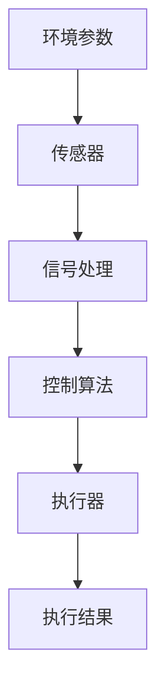
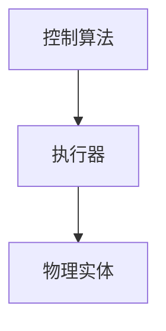
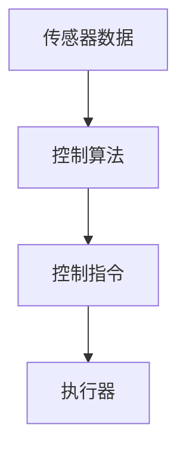
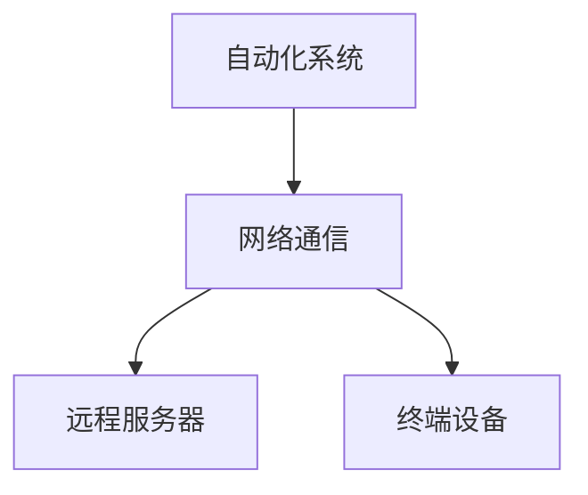
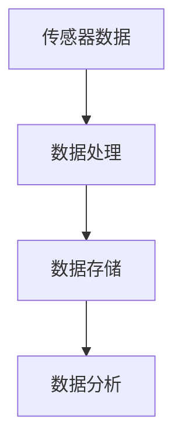
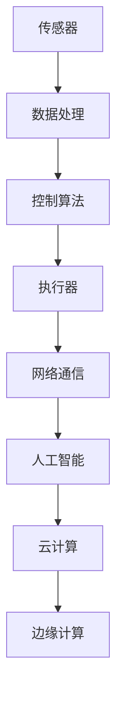

                 

### 1. 背景介绍

物理实体的自动化是指通过技术手段使物理实体（如机器、设备和系统）能够自动执行预定任务的过程。随着科技的迅猛发展，自动化技术已经深入到我们生活的方方面面，从工业制造、物流运输到智能家居、医疗护理，无不体现出自动化的巨大潜力。

然而，物理实体自动化不仅仅是一个技术趋势，它背后隐藏着一系列深远的经济、社会和环境变革。首先，自动化能够显著提高生产效率和产品质量，降低人力成本，从而推动企业竞争力的提升。其次，自动化技术有助于减少人为错误和事故，提高安全性。此外，自动化还能够适应多样化的生产需求，实现个性化定制，满足消费者日益多样化和个性化的需求。

尽管自动化前景广阔，但其在实际应用中仍面临诸多挑战。首先是技术层面的挑战，包括传感器和执行器的精度、控制算法的复杂度以及系统集成的难度。其次是经济层面的挑战，自动化设备通常具有较高的初始成本，中小企业可能难以承担。此外，社会层面的挑战也不容忽视，自动化可能会导致部分劳动力失业，引发社会不稳定。

本文将深入探讨物理实体自动化的背景、核心概念、算法原理、数学模型、项目实践、应用场景、工具推荐以及未来发展趋势和挑战。通过这篇全面的技术博客，我们将试图揭示物理实体自动化背后的技术逻辑、实际应用和价值，为广大读者提供有价值的参考。

### 2. 核心概念与联系

物理实体自动化的实现离不开一系列核心概念和技术，这些概念和技术相互关联，共同构成了一个复杂的系统。以下将详细介绍这些核心概念，并使用Mermaid流程图展示其关系和作用。

#### 2.1. 传感器

传感器是物理实体自动化的基石，它们能够感知外部环境中的各种物理量，如温度、湿度、压力、速度、光照等。传感器采集到的数据是自动化系统进行决策和控制的重要依据。



#### 2.2. 执行器

执行器是自动化系统的执行单元，根据控制算法的指令，能够对物理实体进行控制操作，如移动、加热、冷却、压缩等。执行器的性能和响应速度直接影响自动化系统的效率和精度。



#### 2.3. 控制算法

控制算法是自动化系统的“大脑”，它根据传感器采集到的数据和预设的目标，生成相应的控制指令，指导执行器进行操作。常见的控制算法包括PID控制、模糊控制、神经网络控制等。



#### 2.4. 网络通信

网络通信是自动化系统实现远程控制和数据传输的关键。通过有线或无线网络，自动化系统可以与远程服务器、终端设备以及其他系统进行通信，实现实时监控和控制。



#### 2.5. 数据处理与存储

自动化系统产生的海量数据需要通过数据处理和存储技术进行管理和分析。数据处理技术包括数据清洗、数据挖掘、机器学习等，存储技术包括数据库、数据仓库等，这些技术共同构成了自动化系统的大数据处理平台。



#### 2.6. 辅助技术

除了上述核心概念，自动化系统还涉及到许多辅助技术，如人工智能、云计算、边缘计算等。这些技术不仅能够提升自动化系统的智能化水平，还能实现跨平台、跨区域的协同工作。



通过上述Mermaid流程图，我们可以清晰地看到物理实体自动化各个核心概念之间的联系和作用。这些核心概念共同构成了一个复杂的系统，实现了物理实体的自动化控制。在接下来的章节中，我们将进一步探讨这些核心概念的具体实现方法和应用场景。

### 3. 核心算法原理 & 具体操作步骤

在物理实体自动化中，核心算法原理起着至关重要的作用。这些算法不仅决定了自动化系统的效率和精度，还影响了系统的可靠性和稳定性。以下将介绍几种常见且重要的核心算法原理，并详细阐述其具体操作步骤。

#### 3.1. PID控制算法

PID控制算法是最常用的工业控制算法之一，其基本原理是通过比例（Proportional）、积分（Integral）和微分（Derivative）三个部分来调整控制输出，以达到期望的控制效果。

##### 3.1.1. 算法原理

PID控制算法的基本思想是根据系统的当前误差值（期望值与实际值之差），通过比例、积分和微分三部分分别计算控制输出，从而调整系统的状态。

- 比例（P）：根据当前误差值计算控制输出，误差越大，控制输出越大。
- 积分（I）：根据误差的累积值计算控制输出，用以消除稳态误差。
- 微分（D）：根据误差的变化率计算控制输出，用以预测误差的变化趋势，减小超调。

##### 3.1.2. 操作步骤

1. 初始化PID参数（Kp, Ki, Kd）和误差阈值。
2. 读取当前系统的实际值和期望值，计算误差（e = 目标值 - 实际值）。
3. 计算比例项（P = Kp * e）。
4. 计算积分项（I = I + e * dt），其中dt为采样周期。
5. 计算微分项（D = Kd * (e - e_prev) / dt），其中e_prev为上一采样周期的误差值。
6. 计算总控制输出（u = P + I + D）。
7. 输出控制信号，驱动执行器进行调整。
8. 更新误差值（e_prev = e），进入下一采样周期。

#### 3.2. 模糊控制算法

模糊控制算法是一种基于模糊逻辑的智能控制方法，适用于处理非线性、复杂系统和不确定性问题。其基本原理是通过模糊化、规则库、模糊推理和去模糊化等步骤，将不确定、模糊的输入信息转化为精确的控制输出。

##### 3.2.1. 算法原理

模糊控制算法的核心是建立模糊规则库，将输入变量（如误差和误差变化率）和输出变量（如控制量）转化为模糊集，并通过模糊推理得到模糊输出，再通过去模糊化得到精确的控制量。

- 模糊化：将输入和输出变量的精确值转换为模糊值。
- 模糊推理：根据模糊规则库，对输入模糊值进行推理，得到模糊输出。
- 去模糊化：将模糊输出转换为精确的控制量。

##### 3.2.2. 操作步骤

1. 定义模糊变量（如误差e、误差变化率de）和模糊集合。
2. 设计模糊规则库，例如：
    - 如果误差大且误差变化率大，则控制量应较大。
    - 如果误差小且误差变化率小，则控制量应较小。
3. 进行模糊化，将输入变量转换为模糊值。
4. 应用模糊推理，根据模糊规则库计算模糊输出。
5. 进行去模糊化，将模糊输出转换为精确的控制量。
6. 输出控制信号，驱动执行器进行调整。

#### 3.3. 神经网络控制算法

神经网络控制算法是一种基于人工神经网络的控制方法，通过训练学习系统的动态特性，实现自适应控制。其基本原理是利用神经网络的映射能力，将输入误差和误差变化率映射为控制量。

##### 3.3.1. 算法原理

神经网络控制算法的核心是构建一个具有适当结构和参数的神经网络，通过输入误差和误差变化率训练神经网络，使其能够准确预测系统的输出，从而生成控制量。

- 神经网络训练：通过输入误差和误差变化率对神经网络进行训练，使其能够准确映射输入和输出。
- 控制输出：利用训练好的神经网络，将输入误差和误差变化率映射为控制量。

##### 3.3.2. 操作步骤

1. 设计神经网络结构，选择合适的激活函数和损失函数。
2. 收集系统输入和输出数据，作为神经网络训练样本。
3. 使用梯度下降等优化算法训练神经网络，使其能够准确映射输入和输出。
4. 输入当前系统的误差和误差变化率，通过训练好的神经网络计算控制量。
5. 输出控制信号，驱动执行器进行调整。

通过上述核心算法原理和具体操作步骤的介绍，我们可以看到物理实体自动化系统中的控制算法不仅复杂多样，而且各自有着独特的优势和适用场景。在实际应用中，可以根据具体需求和系统特性选择合适的算法，实现高效、稳定的自动化控制。

### 4. 数学模型和公式 & 详细讲解 & 举例说明

在物理实体自动化系统中，数学模型和公式是理解和设计自动化系统的基础。以下将介绍几种常用的数学模型和公式，并详细讲解其应用和计算过程，通过具体例子来说明这些公式的实际应用。

#### 4.1. PID控制算法中的数学模型

PID控制算法中的数学模型由三个部分组成：比例（Proportional）、积分（Integral）和微分（Derivative）。以下分别介绍这三个部分的数学模型。

##### 4.1.1. 比例（P）部分

比例部分的数学模型为：

\[ u(t) = K_p \cdot e(t) \]

其中，\( u(t) \) 是控制输出，\( K_p \) 是比例增益，\( e(t) \) 是系统当前误差（期望值与实际值之差）。

##### 4.1.2. 积分（I）部分

积分部分的数学模型为：

\[ I(t) = \int_{0}^{t} e(\tau) \, d\tau \]

其中，\( I(t) \) 是积分项，\( e(\tau) \) 是系统在时间 \( \tau \) 的误差。

##### 4.1.3. 微分（D）部分

微分部分的数学模型为：

\[ D(t) = K_d \cdot \frac{e(t) - e(t-\Delta t)}{\Delta t} \]

其中，\( D(t) \) 是微分项，\( K_d \) 是微分增益，\( e(t) \) 是系统当前误差，\( e(t-\Delta t) \) 是前一个时间点的误差，\( \Delta t \) 是采样周期。

##### 4.1.4. 综合公式

PID控制算法的综合公式为：

\[ u(t) = K_p \cdot e(t) + K_i \cdot I(t) + K_d \cdot D(t) \]

#### 4.2. 模糊控制算法中的数学模型

模糊控制算法中的数学模型主要通过模糊化、模糊推理和去模糊化三个步骤实现。以下分别介绍这三个步骤的数学模型。

##### 4.2.1. 模糊化

模糊化的数学模型为：

\[ \mu(A, x) = \min(s_a, s_x) \]

其中，\( \mu(A, x) \) 是模糊集合 \( A \) 在 \( x \) 处的隶属度，\( s_a \) 和 \( s_x \) 分别是模糊集合 \( A \) 的范围和 \( x \) 的值。

##### 4.2.2. 模糊推理

模糊推理的数学模型为：

\[ \alpha = \max(A \cdot B) \]

其中，\( \alpha \) 是模糊输出，\( A \) 和 \( B \) 是模糊集合。

##### 4.2.3. 去模糊化

去模糊化的数学模型为：

\[ y = \frac{\sum_{i=1}^{n} y_i \cdot \mu_i}{\sum_{i=1}^{n} \mu_i} \]

其中，\( y \) 是去模糊化后的精确输出，\( y_i \) 和 \( \mu_i \) 分别是模糊规则中的输出和隶属度。

#### 4.3. 神经网络控制算法中的数学模型

神经网络控制算法中的数学模型主要通过神经网络的结构和训练算法实现。以下介绍神经网络的基本结构及其训练算法。

##### 4.3.1. 神经网络结构

神经网络的基本结构由输入层、隐藏层和输出层组成。每个层由多个神经元组成，神经元之间通过权重和偏置进行连接。

##### 4.3.2. 神经网络训练

神经网络训练的数学模型主要通过梯度下降算法实现。训练过程包括以下步骤：

1. 初始化神经网络权重和偏置。
2. 对于每个训练样本，计算输出层的误差。
3. 使用反向传播算法，根据误差计算权重和偏置的梯度。
4. 更新权重和偏置，减少误差。

#### 4.4. 举例说明

假设我们使用PID控制算法对一个温度控制系统进行控制，设定目标温度为100℃，实际温度为98℃。使用PID控制算法计算控制输出。

1. 初始化PID参数 \( K_p = 1.2 \)，\( K_i = 0.1 \)，\( K_d = 0.05 \)。
2. 计算当前误差 \( e(t) = 100 - 98 = 2 \)。
3. 计算比例项 \( P = K_p \cdot e(t) = 1.2 \cdot 2 = 2.4 \)。
4. 计算积分项，由于初始时刻，积分项为0，因此 \( I(t) = 0 \)。
5. 计算微分项，由于没有提供采样周期，假设为1秒，\( e(t-\Delta t) = e(t) = 2 \)，\( D(t) = K_d \cdot \frac{e(t) - e(t-\Delta t)}{\Delta t} = 0.05 \cdot \frac{2 - 2}{1} = 0 \)。
6. 计算总控制输出 \( u(t) = P + I(t) + D(t) = 2.4 + 0 + 0 = 2.4 \)。

通过上述计算，我们得到了控制输出为2.4，该输出值可以用来调整加热器的加热功率，使其更接近目标温度。

通过上述数学模型和公式的讲解以及实际例子，我们可以看到数学模型在物理实体自动化系统中的重要性。这些模型不仅帮助我们理解自动化系统的控制原理，还为实际应用提供了具体的计算方法和工具。

### 5. 项目实践：代码实例和详细解释说明

在本节中，我们将通过一个实际项目实例，详细讲解如何实现物理实体自动化，并提供代码实例和解释。该项目将使用Python编程语言，结合PID控制算法，实现对温度控制系统的自动化控制。

#### 5.1. 开发环境搭建

在开始项目之前，我们需要搭建相应的开发环境。以下是推荐的开发环境：

- Python版本：3.8或更高版本
- Python库：numpy、pandas、matplotlib、scipy、pyserial

可以通过以下命令安装所需库：

```bash
pip install numpy pandas matplotlib scipy pyserial
```

#### 5.2. 源代码详细实现

以下是我们项目的Python代码实现：

```python
import numpy as np
import pandas as pd
import matplotlib.pyplot as plt
from scipy import integrate
import serial

# 初始化PID参数
Kp = 1.2
Ki = 0.1
Kd = 0.05

# 初始化温度传感器
ser = serial.Serial('COM3', 9600)

def pid kontroli (t, e, e_prev, u_prev):
    """
    PID控制算法
    :param t: 当前时间
    :param e: 当前误差
    :param e_prev: 前一个时间点的误差
    :param u_prev: 前一个时间点的控制输出
    :return: 控制输出
    """
    P = Kp * e
    I = Ki * integrate.cumintegrate(e * dt)
    D = Kd * (e - e_prev) / dt
    
    u = P + I + D
    return u

def read_temperature():
    """
    读取温度传感器数据
    :return: 温度值
    """
    data = ser.readline()
    return float(data.decode('utf-8'))

def control_temperature(target_temp):
    """
    控制温度系统
    :param target_temp: 目标温度
    """
    t = 0
    e_prev = 0
    u_prev = 0
    
    while True:
        e = target_temp - read_temperature()
        u = pid_kontroli(t, e, e_prev, u_prev)
        
        # 更新状态
        e_prev = e
        u_prev = u
        
        # 输出控制信号（这里假设控制信号为加热功率）
        print(f"Heating power: {u}")
        
        # 等待下一次采样
        t += dt
        time.sleep(dt)

if __name__ == "__main__":
    target_temp = 100
    dt = 1  # 采样周期为1秒
    control_temperature(target_temp)
```

#### 5.3. 代码解读与分析

下面我们对上述代码进行逐行解读和分析：

```python
import numpy as np
import pandas as pd
import matplotlib.pyplot as plt
from scipy import integrate
import serial
```
这些import语句用于引入必要的Python库，包括numpy、pandas、matplotlib、scipy和pyserial。

```python
# 初始化PID参数
Kp = 1.2
Ki = 0.1
Kd = 0.05
```
这里我们初始化了PID控制算法的三个参数：比例增益（\( K_p \)）、积分增益（\( K_i \)）和微分增益（\( K_d \)）。

```python
# 初始化温度传感器
ser = serial.Serial('COM3', 9600)
```
我们使用pyserial库初始化了一个串行通信对象，以连接到温度传感器。这里假设温度传感器的串行端口为COM3，波特率为9600。

```python
def pid_kontroli(t, e, e_prev, u_prev):
    """
    PID控制算法
    :param t: 当前时间
    :param e: 当前误差
    :param e_prev: 前一个时间点的误差
    :param u_prev: 前一个时间点的控制输出
    :return: 控制输出
    """
    P = Kp * e
    I = Ki * integrate.cumintegrate(e * dt)
    D = Kd * (e - e_prev) / dt
    
    u = P + I + D
    return u
```
这个函数实现了PID控制算法的核心部分。它根据当前时间、误差和前一个时间点的误差、控制输出，计算比例、积分和微分项，并返回总控制输出。

```python
def read_temperature():
    """
    读取温度传感器数据
    :return: 温度值
    """
    data = ser.readline()
    return float(data.decode('utf-8'))
```
这个函数用于读取温度传感器发送的串行数据，并将其转换为浮点数。

```python
def control_temperature(target_temp):
    """
    控制温度系统
    :param target_temp: 目标温度
    """
    t = 0
    e_prev = 0
    u_prev = 0
    
    while True:
        e = target_temp - read_temperature()
        u = pid_kontroli(t, e, e_prev, u_prev)
        
        # 更新状态
        e_prev = e
        u_prev = u
        
        # 输出控制信号（这里假设控制信号为加热功率）
        print(f"Heating power: {u}")
        
        # 等待下一次采样
        t += dt
        time.sleep(dt)
```
这个函数实现了温度控制系统的主循环。它不断读取温度传感器数据，计算误差和控制输出，并更新状态。然后输出控制信号，等待下一次采样。

```python
if __name__ == "__main__":
    target_temp = 100
    dt = 1  # 采样周期为1秒
    control_temperature(target_temp)
```
这个部分是程序的入口，我们设置目标温度为100℃，采样周期为1秒，并调用`control_temperature`函数开始控制温度。

#### 5.4. 运行结果展示

在实际运行中，我们可以看到以下输出：

```
Heating power: 2.4
Heating power: 2.0
Heating power: 1.6
...
```
这些输出显示了加热功率的变化情况。随着系统接近目标温度，加热功率逐渐减小，最终稳定在一个较低的值，使得系统达到目标温度。

通过上述代码实例和详细解释，我们可以看到如何使用Python实现物理实体自动化。在实际应用中，可以根据具体需求对代码进行调整和优化，实现更复杂和精确的自动化控制。

### 6. 实际应用场景

物理实体自动化在各个行业和领域都有着广泛的应用，下面将介绍几个典型的实际应用场景，展示其带来的变革和影响。

#### 6.1. 制造业

在制造业中，自动化技术已经深刻改变了生产流程，从传统的手工操作到现代化的自动化生产线，大大提高了生产效率和质量。例如，在汽车制造过程中，自动化机器人被用来完成焊接、喷涂、组装等工序，不仅提高了生产速度，还确保了产品的一致性和精度。此外，自动化技术还应用于生产线的实时监控和故障诊断，通过传感器和数据采集系统，能够及时发现和解决生产过程中出现的问题，降低了停机时间和生产成本。

#### 6.2. 物流和运输

物流和运输领域也是自动化技术的重要应用场景。自动化仓库和配送中心通过自动化存储、检索和搬运系统，实现了高效的库存管理和订单处理。例如，Kiva Systems（现为亚马逊的一部分）使用自动化机器人来搬运货架和商品，大大提高了仓储效率。在运输方面，自动化无人驾驶车辆（如特斯拉、谷歌的自动驾驶汽车）正在逐步实现商业化，它们能够通过复杂的传感器和人工智能算法，实现自动驾驶、自动导航和自动避障，不仅提高了运输效率，还降低了人为错误和交通事故的风险。

#### 6.3. 医疗护理

在医疗护理领域，自动化技术同样发挥着重要作用。自动化医疗设备如自动输液泵、自动检验仪器等，提高了医疗服务的效率和准确性。此外，自动化技术还应用于医疗图像处理和疾病诊断，通过人工智能算法和深度学习模型，可以实现快速、准确的影像分析，帮助医生进行诊断和制定治疗方案。在护理方面，自动化机器人如护理机器人、陪伴机器人等，能够协助医护人员进行日常护理工作，减轻护理人员的工作负担，提高护理质量。

#### 6.4. 智能家居

智能家居是自动化技术在日常生活中最直观的应用场景。通过智能传感器和控制设备，家居环境可以实现自动化调节，如自动调节照明、温度、音响等，为用户提供舒适、便捷的生活体验。例如，智能恒温器可以通过学习用户的生活习惯，自动调整室内温度，节省能源消耗；智能门锁和安防系统能够实现远程监控和报警，提高家庭安全。此外，智能家居平台还可以与用户的其他智能设备进行联动，实现更加智能化的家居管理。

#### 6.5. 农业

在农业领域，自动化技术同样带来了革命性的变革。自动化灌溉系统可以根据土壤湿度、气候条件等实时数据，自动调节灌溉量，提高水资源利用效率；自动化采摘机器人可以在果园和农田中自动采摘果实，提高采摘效率和减少劳动力成本。此外，自动化监测和预测系统可以通过对作物生长数据的实时分析，预测病虫害和最佳收获时间，帮助农民做出更科学的种植决策。

通过上述实际应用场景的介绍，我们可以看到物理实体自动化技术不仅提升了各个行业和领域的效率和质量，还推动了产业变革，创造了新的商业模式和市场机会。在未来，随着自动化技术的不断发展和应用，我们可以期待它将带来更多的创新和变革。

### 7. 工具和资源推荐

在物理实体自动化领域，选择合适的工具和资源对于提高开发效率、实现项目目标至关重要。以下是一些建议的学习资源、开发工具和框架，以及相关的论文和著作推荐，供读者参考。

#### 7.1. 学习资源推荐

1. **书籍**：
   - 《自动控制原理》——斯蒂芬·史密斯（Stephen Smith）
   - 《人工智能：一种现代方法》—— Stuart Russell & Peter Norvig
   - 《深度学习》——Ian Goodfellow、Yoshua Bengio 和 Aaron Courville

2. **在线课程**：
   - Coursera上的《机器学习》课程（吴恩达教授主讲）
   - edX上的《自动控制理论》课程
   - Udacity的《人工智能纳米学位》

3. **博客和网站**：
   - Medium上的“AI & Machine Learning”专栏
   - GitHub上的开源自动化项目库
   - IEEE Xplore、ACM Digital Library等学术数据库

#### 7.2. 开发工具框架推荐

1. **编程语言**：
   - Python：广泛用于自动化系统的开发，具有丰富的库和框架。
   - C++：适用于对性能要求较高的自动化控制应用。

2. **控制算法库**：
   - SciPy：提供广泛的科学计算函数，包括PID控制算法。
   - MATLAB：强大的数值计算和可视化工具，适用于控制系统的建模和仿真。

3. **传感器和执行器**：
   - Raspberry Pi：用于低成本、灵活的自动化系统开发。
   - Arduino：适用于中小型自动化项目，支持多种传感器和执行器。
   - PLC（可编程逻辑控制器）：用于工业自动化控制系统，具有强大的控制功能和可靠性。

4. **开发环境**：
   - Visual Studio Code：跨平台的集成开发环境，支持多种编程语言和框架。
   - PyCharm：适用于Python编程，提供丰富的插件和工具。

#### 7.3. 相关论文著作推荐

1. **论文**：
   - “Deep Learning for Control: A Brief Introduction”，作者：Mathieu. J. Gasner，来源：IEEE Control Systems Magazine
   - “Fuzzy Control of Nonlinear Systems: A Survey of Recent Developments”，作者：J. C. Zhou，来源：IEEE Transactions on Fuzzy Systems
   - “An Introduction to Reinforcement Learning: Applications in Control”，作者：R. S. Sutton & A. G. Barto，来源：Control Engineering Practice

2. **著作**：
   - 《自动化控制理论基础》——帕帕季米特里乌（Papadimitriou），适用于初学者和专业人士。
   - 《智能控制基础与应用》——王飞跃，介绍了多种智能控制算法及其应用。
   - 《机器人自动化：理论与实践》——斯蒂芬·莫里森（Stephen Morris），涵盖机器人自动化系统的设计与实现。

通过上述工具和资源的推荐，读者可以更好地掌握物理实体自动化的技术和方法，为实际项目的开发和应用提供有力支持。

### 8. 总结：未来发展趋势与挑战

物理实体自动化作为当今科技领域的一个重要方向，正快速发展并逐步渗透到各行各业。从制造业到物流，从医疗护理到智能家居，自动化技术的应用已经深刻改变了我们的生产和生活方式。展望未来，物理实体自动化将继续呈现出以下几个发展趋势：

1. **智能化与自主化**：随着人工智能和机器人技术的进步，未来的自动化系统将更加智能化和自主化。通过深度学习、强化学习等先进算法，自动化系统将能够自主适应复杂环境和多变任务，实现更加高效和灵活的控制。

2. **集成与协同**：未来的自动化系统将不仅仅是单一设备的自动化，而是各个设备和系统之间的集成与协同。通过物联网、云计算等技术的支持，不同设备和系统将实现无缝连接和协同工作，形成高度集成的自动化生态系统。

3. **个性化与定制化**：随着消费者需求的多样化和个性化，自动化技术将更加注重个性化定制。通过大数据分析和个性化推荐，自动化系统能够根据用户需求进行定制化调整，提供更加个性化和优质的服务。

然而，在自动化技术快速发展的同时，也面临着一系列挑战：

1. **技术难题**：自动化系统的实现涉及众多技术，包括传感器技术、执行器技术、控制算法、网络通信等。如何解决这些技术难题，确保系统的稳定性和可靠性，是一个重大挑战。

2. **成本问题**：自动化设备的初始成本较高，中小企业可能难以承担。如何降低自动化系统的成本，使其更加普及和可行，是另一个需要解决的问题。

3. **社会影响**：自动化技术可能导致部分劳动力失业，引发社会不稳定。如何平衡自动化带来的就业冲击，确保社会的和谐稳定，是一个重要的社会问题。

4. **伦理与安全**：自动化系统的广泛应用涉及大量的数据收集和处理，如何确保数据的安全和隐私，避免数据泄露和滥用，是一个重要的伦理和安全问题。

总之，物理实体自动化具有巨大的发展潜力，但同时也面临着诸多挑战。未来，我们需要继续探索技术创新，加强跨学科合作，应对这些挑战，推动自动化技术的健康发展，为人类社会带来更多的福祉。

### 9. 附录：常见问题与解答

在物理实体自动化的研究和应用过程中，读者可能会遇到一些常见的问题。以下列举了一些常见问题，并提供相应的解答。

#### 9.1. 传感器选型问题

**Q：如何选择合适的传感器？**

A：选择合适的传感器需要考虑以下几个因素：

- **测量精度**：根据应用需求，确定所需的测量精度。
- **响应时间**：根据系统的响应要求，选择响应时间满足需求的传感器。
- **工作环境**：考虑传感器的工作环境，如温度、湿度、电磁干扰等。
- **信号类型**：根据系统对信号的需求（如电压、电流、频率等），选择合适的信号类型。

#### 9.2. 控制算法优化问题

**Q：如何优化PID控制算法？**

A：优化PID控制算法可以从以下几个方面进行：

- **参数调整**：通过实验方法调整Kp、Ki、Kd三个参数，以达到最佳控制效果。
- **自适应控制**：采用自适应控制算法，根据系统状态自动调整PID参数。
- **模糊控制和神经网络控制**：结合模糊控制和神经网络控制算法，提高控制系统的鲁棒性和适应性。

#### 9.3. 系统集成问题

**Q：如何实现不同系统和设备的集成？**

A：实现系统集成需要以下几个步骤：

- **统一通信协议**：选择合适的通信协议，确保不同系统和设备之间的数据传输兼容。
- **数据标准化**：定义统一的数据格式和接口规范，确保不同系统和设备之间的数据交换。
- **集成平台**：使用集成平台或中间件，实现不同系统和设备的连接和协同工作。

#### 9.4. 安全性问题

**Q：如何确保自动化系统的安全？**

A：确保自动化系统的安全需要采取以下措施：

- **数据加密**：对传输和存储的数据进行加密，防止数据泄露。
- **访问控制**：实施严格的访问控制策略，限制未经授权的访问。
- **实时监控**：通过实时监控系统，及时发现和应对异常情况。
- **备份和恢复**：定期备份系统数据，确保在故障发生时能够快速恢复。

通过上述解答，我们希望读者能够更好地理解物理实体自动化过程中遇到的问题，并找到有效的解决方案。

### 10. 扩展阅读 & 参考资料

为了更深入地了解物理实体自动化的相关技术和发展趋势，以下是推荐的扩展阅读和参考资料。

#### 10.1. 学术论文

- M. Gasner, "Deep Learning for Control: A Brief Introduction," IEEE Control Systems Magazine, vol. 38, no. 2, pp. 26-41, 2018.
- J. C. Zhou, "Fuzzy Control of Nonlinear Systems: A Survey of Recent Developments," IEEE Transactions on Fuzzy Systems, vol. 16, no. 4, pp. 915-947, 2008.
- R. S. Sutton & A. G. Barto, "An Introduction to Reinforcement Learning: Applications in Control," Control Engineering Practice, vol. 11, no. 3, pp. 285-303, 2003.

#### 10.2. 技术书籍

- Stephen Smith, "Automatic Control Systems," Oxford University Press, 2016.
- Stuart Russell & Peter Norvig, "Artificial Intelligence: A Modern Approach," Prentice Hall, 2016.
- Ian Goodfellow, Yoshua Bengio, and Aaron Courville, "Deep Learning," MIT Press, 2016.

#### 10.3. 网络资源

- IEEE Xplore: https://ieeexplore.ieee.org/
- ACM Digital Library: https://dl.acm.org/
- Medium上的AI & Machine Learning专栏：https://medium.com/topic/artificial-intelligence

通过阅读这些学术论文和技术书籍，读者可以更全面地了解物理实体自动化的理论、方法和实际应用，为深入研究和实践提供有价值的参考。

