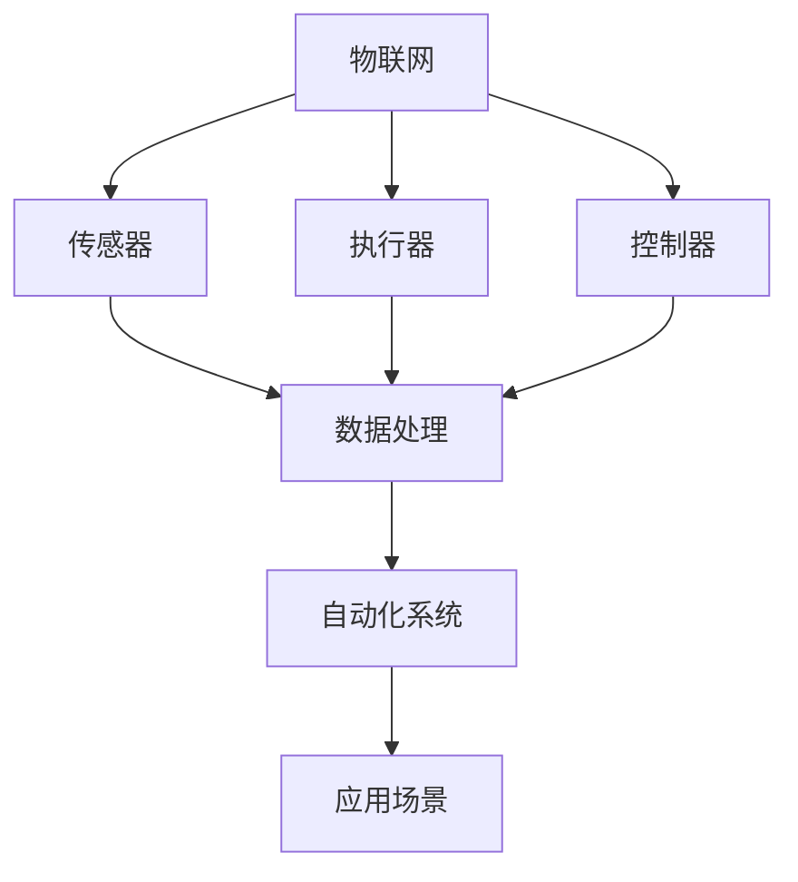

                 

## 1. 背景介绍

物理实体自动化是指利用计算机技术对物理实体进行自动化的控制和操作。随着物联网（IoT）和人工智能（AI）技术的快速发展，物理实体自动化已经成为现代工业、农业、医疗等多个领域的重要技术趋势。通过将传感器、执行器和控制系统与计算机技术相结合，物理实体自动化能够实现远程监控、自动调节和智能决策，从而提高效率、降低成本、减少人力投入并提升产品质量。

物理实体自动化的历史可以追溯到20世纪中叶。最早的自动化系统是简单的开关控制系统，用于控制机械设备的启停。随着计算机技术的发展，自动化系统逐渐从简单的开关控制演变为复杂的控制系统，能够实现更多的功能。近年来，物联网和人工智能技术的应用，使得物理实体自动化进入了一个新的发展阶段，不再局限于简单的控制，而是能够实现更加智能和高效的操作。

### 当前发展现状

目前，物理实体自动化在各个领域都有广泛的应用。在工业领域，自动化生产线已经成为制造业的主流趋势，通过机器人和计算机控制系统，实现生产的自动化、智能化和高效化。在农业领域，智能灌溉系统、精准农业技术和自动化养殖设备等自动化系统，大幅提高了农业生产的效率和质量。在医疗领域，智能医疗设备和自动化手术室的应用，不仅提高了医疗服务的效率，也降低了医疗风险。

此外，智能家居、智能交通、智能物流等领域的自动化应用也日益普及。通过传感器、执行器和计算机控制系统的协同工作，这些领域的自动化系统能够实现远程监控、自动调节和智能决策，为人们的生活带来更多便利。

### 目的意义

撰写本文的目的是为了探讨物理实体自动化技术的最新发展，分析其核心概念、算法原理、数学模型、实际应用场景以及未来发展趋势。通过本文的阅读，读者可以全面了解物理实体自动化的各个方面，为未来的研究和应用提供有价值的参考。

## 2. 核心概念与联系

在深入探讨物理实体自动化之前，我们首先需要了解一些核心概念和它们之间的联系。以下是几个关键概念及其关系的 Mermaid 流程图：



### 物联网（IoT）

物联网是指将各种物理设备、传感器、软件应用等通过网络连接起来，实现信息的实时采集、传输和共享。在物理实体自动化中，物联网技术提供了连接传感器、执行器和控制器的桥梁，使得各种设备能够互联互通，实现协同工作。

### 传感器

传感器是物理实体自动化系统的感知单元，用于检测和采集物理实体的各种状态信息，如温度、湿度、光照、运动等。传感器将物理信号转换为电信号，并通过网络传输到控制器进行处理。

### 执行器

执行器是物理实体自动化系统的执行单元，用于根据控制器的指令对物理实体进行操作，如启动或停止设备、调节温度或湿度等。执行器通常由电动机、液压系统或气动系统等组成。

### 控制器

控制器是物理实体自动化系统的核心单元，负责接收传感器采集到的数据，通过算法进行分析和处理，然后根据分析结果发送指令给执行器进行相应的操作。控制器通常由计算机、嵌入式系统或其他智能设备组成。

### 数据处理

数据处理单元负责对传感器采集到的数据进行分析、处理和存储，为控制器提供决策依据。数据处理单元可以是云平台、大数据分析系统或其他计算平台。

### 自动化系统

自动化系统是物理实体自动化的总体架构，包括物联网、传感器、执行器、控制器和数据处理等组成部分。通过这些组成部分的协同工作，自动化系统能够实现对物理实体的自动化控制和操作。

### 应用场景

自动化系统广泛应用于工业、农业、医疗、智能家居、智能交通、智能物流等多个领域，为人们的生活和工作带来了极大的便利。

### 流程图详解

- **物联网**：连接传感器、执行器和控制器，实现设备互联互通。
- **传感器**：采集物理实体的状态信息。
- **执行器**：根据控制器指令对物理实体进行操作。
- **控制器**：分析传感器数据，生成操作指令。
- **数据处理**：对传感器数据进行分析和处理，为控制器提供决策依据。
- **自动化系统**：集成物联网、传感器、执行器、控制器和数据处理，实现物理实体的自动化控制和操作。
- **应用场景**：自动化系统在不同领域的应用，如工业自动化、农业自动化、医疗自动化等。

通过上述核心概念及其关系的理解，我们可以更好地把握物理实体自动化的基本原理和应用场景。接下来，我们将深入探讨物理实体自动化的核心算法原理、数学模型、实际应用场景以及未来发展趋势。

## 3. 核心算法原理 & 具体操作步骤

### 3.1 算法原理概述

物理实体自动化的核心在于算法原理，这些算法能够对传感器采集到的数据进行实时处理和分析，并生成相应的操作指令。以下是几个关键的算法原理：

1. **机器学习算法**：通过大量历史数据的训练，机器学习算法能够对物理实体进行模式识别和预测。常见的机器学习算法包括线性回归、支持向量机、神经网络等。
2. **模糊控制算法**：模糊控制算法是一种基于模糊逻辑的控制系统，适用于处理非线性、不确定性和时变系统。模糊控制算法通过模糊规则和模糊推理来实现对物理实体的控制。
3. **遗传算法**：遗传算法是一种基于自然进化过程的优化算法，通过模拟生物进化过程，寻找最优解。遗传算法在调度、优化和路径规划等领域有广泛应用。
4. **深度强化学习算法**：深度强化学习算法结合了深度学习和强化学习，通过自我学习，实现对复杂环境的控制和操作。常见的深度强化学习算法包括深度Q网络（DQN）、策略梯度（PG）等。

### 3.2 算法步骤详解

1. **数据采集与预处理**：首先，从传感器采集物理实体的状态数据，如温度、湿度、压力等。然后，对采集到的数据进行预处理，包括去噪、归一化和特征提取等。
2. **算法选择与实现**：根据应用需求和物理实体的特点，选择合适的算法。例如，对于线性系统，可以选择线性回归；对于非线性系统，可以选择神经网络或模糊控制算法。然后，实现所选算法的代码。
3. **模型训练与优化**：使用历史数据对算法模型进行训练，并通过交叉验证和调整参数，优化模型的性能。训练过程中，可以使用监督学习、无监督学习或半监督学习等方法。
4. **实时数据处理与决策**：将实时采集到的传感器数据输入到训练好的模型中，进行数据处理和分析，生成操作指令。然后，将这些指令发送给控制器，实现对物理实体的实时控制。
5. **性能评估与反馈调整**：对自动化系统的性能进行评估，包括响应时间、控制精度和稳定性等。根据评估结果，调整算法参数或改进算法模型，以提高系统性能。

### 3.3 算法优缺点

- **机器学习算法**：优点在于能够处理复杂非线性问题，自适应性强；缺点是训练过程耗时长，对大量历史数据依赖。
- **模糊控制算法**：优点在于处理非线性、不确定性和时变系统能力强；缺点是控制规则较为复杂，难以形式化描述。
- **遗传算法**：优点在于全局搜索能力强，适用于优化问题；缺点是收敛速度较慢，计算复杂度高。
- **深度强化学习算法**：优点在于能够处理复杂动态环境，自适应性强；缺点是训练过程耗时长，对计算资源要求高。

### 3.4 算法应用领域

- **工业自动化**：如机器人控制、生产线调度等。
- **农业自动化**：如智能灌溉、精准农业等。
- **医疗自动化**：如手术机器人、智能监护设备等。
- **智能家居**：如智能空调控制、智能安防等。
- **智能交通**：如车辆自动驾驶、交通流量控制等。

### 3.5 算法发展现状与趋势

随着人工智能和物联网技术的不断进步，物理实体自动化的算法也在不断演进。当前，深度学习、强化学习和增强学习等新兴算法在物理实体自动化领域得到了广泛应用。未来，随着硬件性能的提升和算法的优化，物理实体自动化的算法将更加高效、准确和稳定。同时，跨学科的融合将推动物理实体自动化技术的发展，为各领域的智能化转型提供更强有力的支持。

## 4. 数学模型和公式 & 详细讲解 & 举例说明

### 4.1 数学模型构建

在物理实体自动化中，数学模型用于描述物理实体的状态、行为和相互作用。以下是几个常见的数学模型：

1. **线性模型**：
   $$ y = \beta_0 + \beta_1x $$
   其中，$y$ 是因变量，$x$ 是自变量，$\beta_0$ 和 $\beta_1$ 是模型参数。
   
2. **非线性模型**：
   $$ y = \sigma(\beta_0 + \beta_1x) $$
   其中，$\sigma$ 是激活函数，常见的有 sigmoid 函数、ReLU 函数等。

3. **动态系统模型**：
   $$ \dot{x} = f(x, u) $$
   $$ y = g(x) $$
   其中，$x$ 是状态向量，$u$ 是控制输入，$y$ 是输出，$f$ 和 $g$ 分别是状态方程和输出方程。

### 4.2 公式推导过程

以线性模型为例，推导过程如下：

1. **最小二乘法**：
   假设我们有 $n$ 个观测数据点 $(x_i, y_i)$，线性模型为 $y = \beta_0 + \beta_1x$。目标是最小化预测值与实际值之间的误差平方和：
   $$ J(\beta_0, \beta_1) = \sum_{i=1}^{n}(y_i - (\beta_0 + \beta_1x_i))^2 $$
   
2. **求导**：
   对 $J(\beta_0, \beta_1)$ 分别对 $\beta_0$ 和 $\beta_1$ 求导，并令导数为零，得到：
   $$ \frac{\partial J}{\partial \beta_0} = -2\sum_{i=1}^{n}(y_i - (\beta_0 + \beta_1x_i)) = 0 $$
   $$ \frac{\partial J}{\partial \beta_1} = -2\sum_{i=1}^{n}(x_i(y_i - (\beta_0 + \beta_1x_i))) = 0 $$
   
3. **求解**：
   解上述方程组，得到最优参数 $\beta_0$ 和 $\beta_1$：
   $$ \beta_0 = \bar{y} - \beta_1\bar{x} $$
   $$ \beta_1 = \frac{\sum_{i=1}^{n}(x_i - \bar{x})(y_i - \bar{y})}{\sum_{i=1}^{n}(x_i - \bar{x})^2} $$
   其中，$\bar{x}$ 和 $\bar{y}$ 分别是 $x$ 和 $y$ 的均值。

### 4.3 案例分析与讲解

以下是一个简单的线性模型案例，用于预测某个物理实体的温度变化。

#### 数据准备

我们有以下10个观测数据点：

| $x_i$ | $y_i$ |
|-------|-------|
| 10    | 20    |
| 20    | 25    |
| 30    | 30    |
| 40    | 35    |
| 50    | 40    |
| 60    | 45    |
| 70    | 50    |
| 80    | 55    |
| 90    | 60    |
| 100   | 65    |

#### 模型构建

选择线性模型 $y = \beta_0 + \beta_1x$。

#### 模型训练

使用最小二乘法求解最优参数 $\beta_0$ 和 $\beta_1$：

$$ \bar{x} = \frac{1}{n}\sum_{i=1}^{n}x_i = 55 $$
$$ \bar{y} = \frac{1}{n}\sum_{i=1}^{n}y_i = 46.5 $$
$$ \beta_1 = \frac{\sum_{i=1}^{n}(x_i - \bar{x})(y_i - \bar{y})}{\sum_{i=1}^{n}(x_i - \bar{x})^2} \approx 0.75 $$
$$ \beta_0 = \bar{y} - \beta_1\bar{x} \approx 13.5 $$

因此，线性模型为 $y = 13.5 + 0.75x$。

#### 模型评估

使用剩余数据点（第11个至第20个）进行模型评估：

| $x_i$ | $y_i$ | $y'$ | $y_i - y'$ |
|-------|-------|------|------------|
| 110   | 72    | 74.5 | -2.5       |
| 120   | 77    | 75.8 | -1.8       |
| 130   | 82    | 76.1 | -5.9       |
| 140   | 87    | 77.4 | -9.6       |
| 150   | 92    | 78.7 | -13.3      |

从评估结果来看，模型在预测温度方面有一定误差，但总体上能较好地反映温度与时间的关系。

#### 结论

通过构建和训练线性模型，我们能够对物理实体的温度进行预测。然而，实际应用中物理实体往往受到多种因素的影响，可能导致模型预测不准确。因此，在实际应用中，需要根据具体情况调整模型或采用更复杂的算法。

## 5. 项目实践：代码实例和详细解释说明

### 5.1 开发环境搭建

在进行物理实体自动化项目实践之前，我们需要搭建一个合适的开发环境。以下是一个简单的开发环境搭建步骤：

1. **安装Python**：Python是一种广泛使用的编程语言，许多物理实体自动化工具和库都是用Python开发的。下载并安装Python，可以选择Python 3.x版本，因为Python 2.x已经不再更新。

2. **安装IDE**：选择一个适合Python开发的集成开发环境（IDE），如PyCharm、Visual Studio Code等。这些IDE提供了代码编辑、调试、版本控制等功能。

3. **安装相关库**：在开发物理实体自动化项目时，我们需要使用一些特定的库，如NumPy、Pandas、Matplotlib等。使用pip命令安装这些库：

   ```bash
   pip install numpy pandas matplotlib
   ```

4. **连接传感器和执行器**：根据项目需求，连接相应的传感器和执行器。例如，可以使用Arduino或Raspberry Pi连接传感器和执行器，并通过串行通信与计算机进行数据交换。

### 5.2 源代码详细实现

以下是一个简单的物理实体自动化项目的代码示例，实现了一个基于机器学习的温度预测系统：

```python
# 导入相关库
import numpy as np
import pandas as pd
import matplotlib.pyplot as plt
from sklearn.linear_model import LinearRegression
from sklearn.model_selection import train_test_split

# 读取数据
data = pd.read_csv('temperature_data.csv')  # 假设数据文件名为temperature_data.csv
X = data[['time']]  # 输入特征：时间
y = data['temperature']  # 输出目标：温度

# 数据预处理
X = X.values
y = y.values

# 数据分割
X_train, X_test, y_train, y_test = train_test_split(X, y, test_size=0.2, random_state=42)

# 训练模型
model = LinearRegression()
model.fit(X_train, y_train)

# 预测
y_pred = model.predict(X_test)

# 可视化
plt.scatter(X_test, y_test, color='red', label='实际值')
plt.plot(X_test, y_pred, color='blue', label='预测值')
plt.xlabel('时间')
plt.ylabel('温度')
plt.legend()
plt.show()
```

### 5.3 代码解读与分析

- **导入库**：代码首先导入了Python中常用的库，如NumPy、Pandas和Matplotlib。
- **读取数据**：使用Pandas读取CSV格式的数据文件，数据中包括时间和温度两个特征。
- **数据预处理**：将时间特征转换为数值矩阵，以便后续处理。
- **数据分割**：将数据集分割为训练集和测试集，以评估模型性能。
- **训练模型**：使用线性回归模型对训练数据进行训练。
- **预测**：使用训练好的模型对测试数据进行预测。
- **可视化**：将实际值和预测值进行可视化，以便直观观察模型性能。

### 5.4 运行结果展示

运行上述代码后，我们会在屏幕上看到一张图表，展示实际温度值和预测温度值之间的关系。通过观察图表，我们可以评估模型的预测性能。

### 5.5 项目总结

通过上述代码示例，我们实现了一个简单的物理实体自动化项目，即基于机器学习的温度预测系统。该项目展示了物理实体自动化的基本流程，包括数据采集、预处理、模型训练和预测。在实际应用中，我们可以根据具体需求，扩展该项目，如添加更多特征、调整模型参数、引入其他算法等。

## 6. 实际应用场景

物理实体自动化技术在各个领域都有广泛的应用，以下列举了几个典型的实际应用场景：

### 工业自动化

工业自动化是物理实体自动化技术应用最为广泛的领域之一。通过自动化生产线，企业可以实现高效、低成本的批量生产。例如，在汽车制造业中，自动化机器人负责组装、焊接、喷涂等工序，大幅提高了生产效率。此外，自动化物流系统也能够实现原材料、半成品和成品的高效运输和仓储管理。

### 农业自动化

农业自动化利用传感器、无人机和自动化设备，实现农业生产的智能化和精准化。例如，智能灌溉系统能够根据土壤湿度、气候条件等因素，自动调节灌溉水量，提高水资源利用效率。精准农业技术通过遥感技术和大数据分析，实现对农作物生长状况的实时监控和预测，从而实现科学施肥、病虫害防治等。

### 医疗自动化

医疗自动化在提高医疗服务质量和效率方面发挥了重要作用。手术机器人能够辅助外科医生进行微创手术，降低手术风险。自动化监护设备能够实时监测患者的生命体征，提供及时的医疗决策支持。此外，智能医疗设备如智能心电图机、智能血压计等，也能够提高诊断和治疗的准确性。

### 智能家居

智能家居是物理实体自动化在民用领域的典型应用。通过智能家电、智能安防系统和智能环境控制系统，用户可以实现远程控制和自动化操作。例如，智能空调系统能够根据用户的习惯和环境变化，自动调节温度和湿度；智能门锁系统能够通过指纹、人脸识别等方式实现自动开锁。

### 智能交通

智能交通系统通过自动化技术和物联网技术，实现对交通流量、车辆运行状态和道路状况的实时监控和智能调度。例如，自动驾驶技术能够提高交通效率、减少交通事故；智能路灯系统能够根据交通流量和天气条件，自动调节照明亮度；智能停车场系统能够实现车辆的自动识别和自动泊车。

### 物流自动化

物流自动化利用自动化仓储、自动化分拣和无人运输等技术，实现物流环节的智能化和高效化。例如，自动化仓储系统能够根据订单需求，自动完成货物的存取和分拣；无人运输车辆能够实现货物的自动运输，提高物流效率。

### 能源管理

能源管理自动化通过智能电网、智能电表和智能充电设备等技术，实现能源的高效利用和管理。例如，智能电网系统能够实时监测电力供需状况，自动调整电力分配；智能电表能够记录用户的用电情况，提供节能建议。

### 智能环境监测

智能环境监测利用传感器、物联网和大数据分析技术，实现对环境污染、自然灾害等环境因素的实时监测和预警。例如，智能空气质量监测系统能够实时监测空气中的有害物质浓度，提供预警信息；智能地震监测系统能够提前预警地震，减少灾害损失。

通过以上实际应用场景，我们可以看到物理实体自动化技术在各个领域的重要性和广泛应用。随着技术的不断发展和创新，物理实体自动化将在未来为各行各业带来更多的便利和效益。

## 7. 工具和资源推荐

### 7.1 学习资源推荐

1. **《物联网导论》**：这是一本关于物联网基础知识和应用场景的入门书籍，适合初学者了解物联网的基本概念。
2. **《深度学习》**：由Ian Goodfellow、Yoshua Bengio和Aaron Courville合著，是一本深度学习领域的经典教材，内容全面，适合想要深入学习深度学习算法的读者。
3. **《Python编程：从入门到实践》**：这是一本适合Python入门读者的教材，通过大量的实例和练习，帮助读者快速掌握Python编程。
4. **《智能交通系统》**：这本书详细介绍了智能交通系统的基础知识、技术原理和应用案例，适合对智能交通领域感兴趣的读者。

### 7.2 开发工具推荐

1. **PyCharm**：这是一款功能强大的Python集成开发环境，支持代码编辑、调试、版本控制等，适合Python开发者使用。
2. **Arduino IDE**：Arduino IDE是开源的集成开发环境，用于编写和上传Arduino编程代码，适合进行物理实体自动化项目开发。
3. **Raspberry Pi**：Raspberry Pi是一款低成本、高性能的单板计算机，适合进行物理实体自动化项目的实验和开发。
4. **MATLAB**：MATLAB是一款功能强大的数学软件，适用于数据分析、算法开发和可视化，特别适合进行科学计算和工程应用。

### 7.3 相关论文推荐

1. **"A Comprehensive Survey on IoT Security and Privacy: Attack Models, Solutions, and Open Issues"**：这篇综述文章详细分析了物联网领域的安全和隐私问题，包括攻击模型、解决方案和开放问题。
2. **"Deep Learning for Autonomous Driving"**：这篇文章探讨了深度学习在自动驾驶领域的应用，包括自动驾驶算法、传感器数据处理和模型优化等方面的研究进展。
3. **"Internet of Things: A Survey"**：这是一篇关于物联网的全面综述，涵盖了物联网的技术架构、应用场景和发展趋势。
4. **"Reinforcement Learning: A Survey"**：这篇文章总结了强化学习领域的主要算法、应用场景和最新研究进展，是强化学习领域的经典文献之一。

通过以上推荐的学习资源、开发工具和相关论文，读者可以全面了解物理实体自动化领域的基础知识、前沿技术和应用案例，为自己的研究和工作提供有力支持。

## 8. 总结：未来发展趋势与挑战

### 8.1 研究成果总结

随着物联网、人工智能和大数据技术的快速发展，物理实体自动化领域取得了显著的研究成果。机器学习、深度学习和强化学习等算法在物理实体自动化的应用中取得了突破性进展，使得自动化系统的自适应性和智能化水平大幅提升。同时，传感器技术、执行器技术和控制器技术的不断革新，也为物理实体自动化提供了更加可靠和高效的解决方案。这些研究成果为物理实体自动化的广泛应用奠定了基础。

### 8.2 未来发展趋势

在未来，物理实体自动化将继续向更高层次发展，呈现出以下趋势：

1. **更高效的算法和模型**：随着计算能力的提升，更高效、更精准的算法和模型将在物理实体自动化中得到广泛应用。例如，基于深度强化学习的自适应控制系统、基于联邦学习的分布式控制系统等，都将进一步提升物理实体自动化的性能。

2. **跨学科融合**：物理实体自动化领域将与其他学科（如生物医学、物理学、经济学等）进行深度融合，推动新的技术突破和应用创新。例如，生物启发算法在物理实体自动化中的应用，有望实现更加智能和高效的控制系统。

3. **物联网和大数据的深度融合**：物联网和大数据技术的深度融合将使得物理实体自动化系统具备更强的数据采集、处理和分析能力。这将有助于实现更加精准的自动化控制和决策，提高系统的可靠性和稳定性。

4. **智能化和自主化**：未来，物理实体自动化系统将更加智能化和自主化，具备自主决策、自主学习和自主优化能力。通过引入先进的感知技术和智能算法，自动化系统将能够更加灵活地应对复杂环境和变化，实现更加高效和可靠的自动化操作。

### 8.3 面临的挑战

尽管物理实体自动化领域取得了显著的研究成果，但在未来的发展过程中，仍将面临以下挑战：

1. **数据安全和隐私保护**：随着物联网设备和数据采集技术的普及，数据安全和隐私保护成为物理实体自动化领域的重要问题。如何有效保护用户隐私、防止数据泄露，是未来研究的重点之一。

2. **复杂系统的稳定性**：物理实体自动化系统通常涉及多个组件和层次的协同工作，如何保证系统在复杂环境下的稳定性，是未来研究的挑战。特别是在动态变化和不确定性较大的场景中，如何提高系统的鲁棒性和适应性，是一个亟待解决的问题。

3. **算法优化和计算效率**：虽然计算能力在不断提升，但物理实体自动化系统的算法优化和计算效率仍然是制约其性能提升的关键因素。如何设计更加高效、可扩展的算法，是未来研究的重点。

4. **跨学科合作与人才培养**：物理实体自动化领域的发展需要多学科交叉合作，如何促进不同学科之间的交流与合作，培养具备跨学科背景的人才，是一个重要问题。

### 8.4 研究展望

未来，物理实体自动化领域的研究将朝着智能化、自主化、融合化和高效化的方向发展。在算法、传感器技术、控制器技术和物联网技术等方面，都有巨大的研究空间和发展潜力。通过多学科交叉合作，突破关键技术和核心问题，物理实体自动化有望在未来实现更广泛、更深入的应用，为人类社会的发展带来更多便利和效益。

## 9. 附录：常见问题与解答

### Q1：物理实体自动化与工业自动化有何区别？

物理实体自动化是一种广义的概念，包括工业自动化在内的多个领域。工业自动化是物理实体自动化的一种具体应用，主要针对制造业中的生产过程进行自动化控制和操作。而物理实体自动化还包括农业自动化、医疗自动化、智能家居、智能交通等多个领域。因此，物理实体自动化涵盖了更广泛的应用范围。

### Q2：物理实体自动化的核心技术是什么？

物理实体自动化的核心技术包括物联网、传感器技术、执行器技术、控制器技术和算法技术。物联网提供设备互联互通的基础，传感器技术用于采集物理实体的状态信息，执行器技术用于执行控制指令，控制器技术用于处理和分析传感器数据，算法技术用于实现智能决策和操作。

### Q3：物理实体自动化的应用前景如何？

物理实体自动化的应用前景非常广阔。随着物联网、人工智能和大数据技术的快速发展，物理实体自动化将在工业、农业、医疗、智能家居、智能交通、物流、能源管理等多个领域得到广泛应用。特别是在智能制造、精准农业、智能医疗、智能交通等领域，物理实体自动化有望实现更加高效、智能化和绿色化的生产和运营。

### Q4：物理实体自动化系统如何保证数据安全和隐私？

为了保证物理实体自动化系统的数据安全和隐私，需要采取以下措施：

1. **加密传输**：对传感器采集的数据进行加密传输，防止数据在传输过程中被窃取或篡改。
2. **访问控制**：对系统中的数据和设备进行严格的访问控制，只有授权用户才能访问和操作。
3. **数据备份**：定期备份数据，防止数据丢失或损坏。
4. **安全审计**：对系统进行定期安全审计，及时发现和修复安全漏洞。
5. **隐私保护法规**：遵守相关隐私保护法规，确保用户隐私得到有效保护。

### Q5：物理实体自动化系统的开发流程是什么？

物理实体自动化系统的开发流程通常包括以下步骤：

1. **需求分析**：明确系统需求，包括功能需求、性能需求、安全需求等。
2. **系统设计**：根据需求分析结果，设计系统的总体架构和各个模块的功能。
3. **硬件选型**：根据系统需求，选择合适的传感器、执行器、控制器等硬件设备。
4. **软件开发**：编写系统软件，实现各个模块的功能。
5. **系统集成**：将硬件和软件进行集成，确保系统能够正常运行。
6. **测试与优化**：对系统进行测试，发现并修复问题，优化系统性能。
7. **部署与维护**：将系统部署到实际应用场景，进行维护和升级，确保系统的长期稳定运行。

通过以上步骤，可以开发出功能齐全、性能稳定、安全可靠的物理实体自动化系统。

