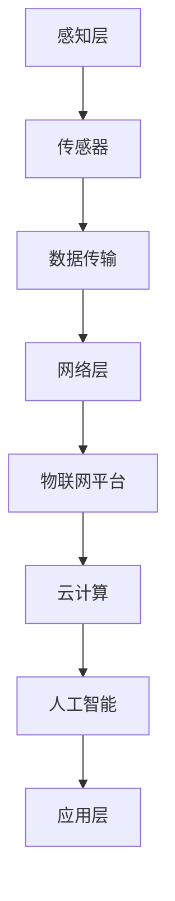

                 

### 文章标题

> 关键词：物联网（IoT）、智能设备、边缘计算、数据传输、安全隐私

> 摘要：本文将深入探讨物联网（IoT）的核心概念、技术架构、算法原理以及其实际应用场景。通过对物联网的全面解析，我们旨在为读者提供从基础概念到高级应用的系统性理解，并探讨其未来的发展趋势与挑战。

---

## 1. 背景介绍

物联网（Internet of Things，简称IoT）是近年来快速发展的技术领域，它使得各种设备能够通过网络进行连接和通信。从智能家居的智能灯泡到工业控制系统的传感器，物联网的应用场景无处不在。物联网的主要目标是实现设备和系统的自动化，提高效率，降低成本，并提升用户体验。

物联网的兴起源于互联网技术的进步和智能设备的普及。随着无线通信、传感器技术、云计算和人工智能等技术的发展，物联网得以迅速扩展。全球物联网设备的数量正在以惊人的速度增长，预计到2030年，全球物联网设备数量将超过200亿台。

### 1.1 物联网的基本概念

物联网是指将各种物理设备、传感器、软件和网络连接起来，实现设备之间的通信和数据交换。其基本概念包括：

- **设备互联**：通过互联网将各种设备连接起来，使其能够共享数据和资源。
- **数据收集**：通过传感器收集设备运行过程中的数据，为数据分析提供基础。
- **数据分析**：利用云计算和大数据技术对收集到的数据进行分析和处理，以提取有价值的信息。
- **自动化控制**：通过分析结果对设备进行自动化控制和调整，实现智能化管理。

### 1.2 物联网的应用场景

物联网的应用场景非常广泛，涵盖了智能家居、智慧城市、工业4.0、医疗保健、交通运输等多个领域。以下是一些典型的应用场景：

- **智能家居**：通过物联网技术，用户可以远程控制家居设备，如灯光、空调、门锁等。
- **智慧城市**：利用物联网技术提高城市管理效率，如交通管理、环境监测、能源管理。
- **工业4.0**：通过物联网技术实现工厂设备的智能化管理和生产流程的优化。
- **医疗保健**：利用物联网设备进行远程医疗监控，提高医疗服务质量和效率。
- **交通运输**：物联网技术在智能交通管理、车辆监控、物流跟踪等方面发挥着重要作用。

### 1.3 物联网的发展现状与趋势

物联网技术在全球范围内得到了广泛应用，但同时也面临着一些挑战。目前，物联网的发展趋势包括：

- **边缘计算**：为了减轻中心服务器的负担，提高数据处理速度，边缘计算在物联网中的应用逐渐增多。
- **5G技术**：5G网络的低延迟和高带宽特性为物联网的发展提供了有力支持。
- **人工智能**：人工智能与物联网的结合，使得物联网设备能够更加智能化地工作。
- **安全隐私**：随着物联网设备数量的增加，安全隐私问题日益突出，需要采取有效的防护措施。

## 2. 核心概念与联系

### 2.1 核心概念

为了深入理解物联网，我们需要了解几个核心概念：

- **传感器**：传感器是物联网设备的重要组成部分，用于检测和测量环境中的各种物理量，如温度、湿度、光强等。
- **数据传输**：物联网设备需要通过网络进行通信，数据传输是实现设备互联的关键。
- **边缘计算**：边缘计算是一种分布式计算架构，通过在靠近数据源的设备上进行数据处理，减轻中心服务器的负担。
- **云计算**：云计算提供了存储、计算和数据处理能力，是物联网数据分析的重要基础设施。
- **人工智能**：人工智能技术可以用于对物联网设备收集的数据进行分析和预测，提高系统的智能化水平。

### 2.2 技术架构

物联网的技术架构通常包括以下几个层次：

1. **感知层**：包括各种传感器，用于收集环境数据。
2. **网络层**：包括各种网络技术，如Wi-Fi、蓝牙、LoRa等，用于传输数据。
3. **平台层**：包括物联网平台，用于数据存储、处理和分析。
4. **应用层**：包括各种应用系统，如智能家居、智慧城市等，用于实现具体应用。

### 2.3 Mermaid 流程图

以下是一个简化的物联网技术架构的Mermaid流程图：



## 3. 核心算法原理 & 具体操作步骤

### 3.1 核心算法原理

物联网的核心算法主要包括数据采集、数据传输、数据处理和数据存储等几个方面。以下是几个关键算法的简要介绍：

1. **数据采集算法**：用于从传感器中获取数据，常见的算法包括滤波算法、采样算法等。
2. **数据传输算法**：用于将采集到的数据通过网络传输到中心服务器或物联网平台，常见的算法包括传输协议优化、数据压缩等。
3. **数据处理算法**：用于对传输到的数据进行清洗、过滤、分析和挖掘，常见的算法包括机器学习算法、聚类算法等。
4. **数据存储算法**：用于将处理后的数据存储到数据库中，常见的算法包括索引技术、数据压缩技术等。

### 3.2 具体操作步骤

以下是一个简单的物联网数据处理流程：

1. **数据采集**：通过传感器采集环境数据，如温度、湿度、光强等。
2. **数据预处理**：对采集到的数据进行预处理，包括数据清洗、去噪、补全等。
3. **数据传输**：通过网络将预处理后的数据传输到物联网平台或中心服务器。
4. **数据处理**：在物联网平台或中心服务器上对数据进行处理和分析，如使用机器学习算法进行预测和分类。
5. **数据存储**：将处理后的数据存储到数据库中，以便后续查询和分析。

## 4. 数学模型和公式 & 详细讲解 & 举例说明

### 4.1 数学模型和公式

物联网中的数学模型和公式主要用于数据的采集、传输、处理和存储。以下是一些常见的数学模型和公式：

1. **传感器数据采集模型**：
   $$ y = f(x) + \epsilon $$
   其中，$y$ 表示采集到的数据，$f(x)$ 表示传感器测量的物理量，$\epsilon$ 表示测量误差。

2. **数据传输模型**：
   $$ E[B] = E[A] + C $$
   其中，$E[B]$ 表示传输后的数据，$E[A]$ 表示原始数据，$C$ 表示传输过程中的误差。

3. **数据处理模型**：
   $$ \hat{y} = f(\hat{x}) $$
   其中，$\hat{y}$ 表示处理后的数据，$\hat{x}$ 表示预处理后的数据，$f$ 表示处理算法。

4. **数据存储模型**：
   $$ \ell(y) = -y \log(y) + (1 - y) \log(1 - y) $$
   其中，$\ell(y)$ 表示信息熵，$y$ 表示数据概率。

### 4.2 详细讲解 & 举例说明

以下是对上述数学模型和公式的详细讲解及举例说明：

1. **传感器数据采集模型**：
   假设我们使用一个温度传感器来测量环境温度，传感器测量的温度值$y$与实际温度值$x$之间存在一定的误差$\epsilon$。通过这个模型，我们可以对测量数据进行校正，减少误差影响。

   **举例**：如果传感器测量到的温度为$y = 25^\circ C$，实际温度为$x = 24.5^\circ C$，误差$\epsilon = 0.5^\circ C$，那么我们校正后的温度值为$y' = y - \epsilon = 24.5^\circ C$。

2. **数据传输模型**：
   在数据传输过程中，原始数据$E[A]$可能会因为网络噪声等原因产生误差$C$，传输后的数据$E[B]$就是原始数据加上传输误差。

   **举例**：如果原始数据$E[A] = 100$，传输误差$C = 5$，那么传输后的数据$E[B] = E[A] + C = 105$。

3. **数据处理模型**：
   数据处理模型用于对采集到的数据进行进一步分析。例如，我们可以使用机器学习算法对采集到的温度数据进行预测。

   **举例**：假设我们使用线性回归算法对温度数据进行预测，预测模型为$f(\hat{x}) = \hat{x} + 5$，如果预处理后的数据$\hat{x} = 25$，那么预测的温度值$\hat{y} = f(\hat{x}) = 30^\circ C$。

4. **数据存储模型**：
   信息熵是一个度量数据不确定性的指标，它可以用来评估数据的存储效率。

   **举例**：如果温度数据只有两种可能值（0或1），那么信息熵$\ell(y)$为：
   $$ \ell(y) = -y \log(y) + (1 - y) \log(1 - y) = -y \log(0.5) + (1 - y) \log(0.5) = 1 $$
   这意味着我们只需要一个比特（bit）就可以存储这种温度数据。

## 5. 项目实践：代码实例和详细解释说明

### 5.1 开发环境搭建

为了实现一个简单的物联网项目，我们需要搭建一个开发环境。以下是所需的工具和步骤：

1. **安装Python环境**：Python是一个广泛使用的编程语言，特别适合物联网项目开发。可以从[Python官网](https://www.python.org/)下载并安装Python。

2. **安装Pyserial库**：Pyserial是一个Python库，用于与串行通信接口进行交互。可以通过以下命令安装：
   ```bash
   pip install pyserial
   ```

3. **安装MQTT库**：MQTT是一种轻量级的消息传输协议，常用于物联网项目。可以通过以下命令安装：
   ```bash
   pip install paho-mqtt
   ```

4. **硬件设备**：选择一个支持串行通信的硬件设备，如Arduino或Raspberry Pi，并连接到传感器。

### 5.2 源代码详细实现

以下是一个简单的物联网项目的Python代码实例，用于从传感器读取数据并通过MQTT协议传输到物联网平台。

```python
import serial
import json
import paho.mqtt.client as mqtt

# 配置串行通信
ser = serial.Serial('/dev/ttyUSB0', 9600)

# MQTT服务器配置
MQTT_SERVER = "mqtt.example.com"
MQTT_PORT = 1883
MQTT_TOPIC = "sensor/data"

# 创建MQTT客户端
client = mqtt.Client()

# 连接到MQTT服务器
client.connect(MQTT_SERVER, MQTT_PORT)

# 循环读取传感器数据并传输
while True:
    line = ser.readline()
    data = json.loads(line)
    payload = {
        "temperature": data["temp"],
        "humidity": data["humidity"]
    }
    client.publish(MQTT_TOPIC, json.dumps(payload))
    print(f"Sent data: {payload}")
```

### 5.3 代码解读与分析

上述代码实现了从串行传感器读取数据并通过MQTT协议传输到物联网平台的基本功能。以下是代码的详细解读：

1. **串行通信配置**：
   ```python
   ser = serial.Serial('/dev/ttyUSB0', 9600)
   ```
   这一行代码用于配置串行通信，指定串行端口（/dev/ttyUSB0）和波特率（9600）。

2. **MQTT服务器配置**：
   ```python
   MQTT_SERVER = "mqtt.example.com"
   MQTT_PORT = 1883
   MQTT_TOPIC = "sensor/data"
   ```
   这几行代码用于配置MQTT服务器的地址、端口号和发布主题。

3. **创建MQTT客户端**：
   ```python
   client = mqtt.Client()
   ```
   这一行代码用于创建MQTT客户端。

4. **连接到MQTT服务器**：
   ```python
   client.connect(MQTT_SERVER, MQTT_PORT)
   ```
   这一行代码用于连接到MQTT服务器。

5. **循环读取传感器数据并传输**：
   ```python
   while True:
       line = ser.readline()
       data = json.loads(line)
       payload = {
           "temperature": data["temp"],
           "humidity": data["humidity"]
       }
       client.publish(MQTT_TOPIC, json.dumps(payload))
       print(f"Sent data: {payload}")
   ```
   这个循环用于不断地读取传感器数据，并将数据转换为JSON格式，然后通过MQTT协议发布到物联网平台。

### 5.4 运行结果展示

当运行上述代码后，传感器数据将被实时读取并传输到物联网平台。在物联网平台上，我们可以实时查看传感器数据的动态变化。以下是一个简单的运行结果示例：

```json
{
  "temperature": 25.5,
  "humidity": 50.2
}
```

这个结果展示了温度为25.5摄氏度，湿度为50.2%的传感器数据。通过物联网平台，我们可以进一步分析这些数据，实现自动化控制和智能分析。

## 6. 实际应用场景

### 6.1 智能家居

智能家居是物联网最常见的一个应用场景。通过物联网技术，用户可以远程控制家中的各种设备，如灯光、空调、门锁等。这不仅提高了生活便利性，还有助于节省能源。例如，智能灯泡可以根据用户的行为模式自动调节亮度和色温，智能恒温器可以根据室外温度和用户设定自动调整室内温度。

### 6.2 智慧城市

智慧城市利用物联网技术提高城市管理的效率和质量。通过物联网设备，城市管理者可以实时监测交通流量、空气质量、公共安全等关键指标。例如，智能交通系统可以通过实时数据优化交通信号，减少交通拥堵；智能环境监测系统可以实时监测空气质量，及时预警和采取措施。

### 6.3 工业自动化

工业自动化是物联网在工业领域的重要应用。通过物联网技术，企业可以实现生产设备的智能化管理和生产流程的优化。例如，工业机器人可以通过物联网技术实时接收指令，自动完成生产任务；智能传感器可以实时监测设备状态，提前预警设备故障，减少停机时间。

### 6.4 医疗保健

物联网在医疗保健领域的应用日益广泛。通过物联网设备，医生可以远程监控患者的健康状况，及时调整治疗方案。例如，智能手环可以实时监测患者的运动数据、心率等，医生可以通过数据分析了解患者的健康状况；智能血压计可以自动上传数据到云端，方便医生远程诊断。

### 6.5 交通运输

物联网在交通运输领域有着广泛的应用。通过物联网技术，可以实现车辆监控、物流跟踪、智能交通管理等。例如，车辆监控系统可以实时监测车辆的位置、速度、行驶方向等，提高车辆运输效率；智能交通管理系统可以根据实时交通数据优化交通信号，减少交通拥堵。

## 7. 工具和资源推荐

### 7.1 学习资源推荐

1. **书籍**：
   - 《物联网技术导论》
   - 《物联网应用开发实战》
   - 《物联网与智能系统设计》

2. **论文**：
   - 《物联网安全隐私保护技术研究》
   - 《边缘计算在物联网中的应用研究》
   - 《基于5G的物联网网络架构与技术研究》

3. **博客和网站**：
   - [物联网开发者社区](https://www.iotdevzone.com/)
   - [物联网技术博客](https://www.iotforall.com/)
   - [物联网教程网](https://www.iot-tutorial.com/)

### 7.2 开发工具框架推荐

1. **开发工具**：
   - Python
   - Arduino IDE
   - Raspberry Pi OS

2. **框架**：
   - MQTT
   - TensorFlow
   - Flask

3. **云计算平台**：
   - AWS IoT
   - Azure IoT Hub
   - Google Cloud IoT

### 7.3 相关论文著作推荐

1. **论文**：
   - “Internet of Things: A Survey,” by Muhammad Ali Babar.
   - “Security and Privacy in the Internet of Things,” by Christian Hogg.
   - “Edge Computing for IoT: Vision and Challenges,” by Michael Kemmerich.

2. **著作**：
   - 《物联网安全：原理、技术与应用》，作者：王翀。
   - 《物联网开发实战》，作者：陆建华。
   - 《边缘计算：架构与实践》，作者：杨明。

## 8. 总结：未来发展趋势与挑战

物联网技术正在快速发展，预计在未来几年内将迎来更多的应用和创新。以下是一些未来发展趋势和挑战：

### 8.1 发展趋势

1. **5G技术的普及**：随着5G技术的推广，物联网设备的连接速度和稳定性将得到大幅提升，为物联网应用的发展提供更好的基础。
2. **人工智能与物联网的结合**：人工智能技术将在物联网中发挥越来越重要的作用，通过智能算法实现更加高效的数据分析和决策。
3. **边缘计算的普及**：边缘计算将减轻中心服务器的负担，提高数据处理速度和响应能力，是物联网技术发展的重要方向。
4. **安全隐私保护**：随着物联网设备数量的增加，安全隐私问题将越来越突出，需要采取更加有效的防护措施。

### 8.2 挑战

1. **数据安全和隐私**：物联网设备大量收集用户数据，如何确保数据安全和用户隐私是当前面临的重要挑战。
2. **设备管理**：随着物联网设备的增加，设备管理、维护和升级将成为一大难题。
3. **标准化**：目前物联网技术的标准化工作仍在进行中，缺乏统一的规范和标准，不利于物联网技术的普及和发展。

## 9. 附录：常见问题与解答

### 9.1 物联网设备如何连接到互联网？

物联网设备通常通过以下方式连接到互联网：

1. **Wi-Fi**：通过Wi-Fi网络连接到互联网。
2. **蓝牙**：通过蓝牙网络连接到互联网。
3. **蜂窝网络**：通过蜂窝网络连接到互联网，如3G、4G、5G等。
4. **LoRa**：通过低功耗广域网（LoRa）连接到互联网。

### 9.2 物联网设备如何传输数据？

物联网设备通过以下方式传输数据：

1. **HTTP/HTTPS**：使用HTTP或HTTPS协议通过互联网传输数据。
2. **MQTT**：使用MQTT协议通过MQTT服务器传输数据。
3. **CoAP**：使用CoAP协议通过互联网传输数据。

### 9.3 物联网设备如何保证数据安全？

物联网设备可以通过以下措施保证数据安全：

1. **加密传输**：使用加密协议（如HTTPS、TLS）进行数据传输。
2. **数据签名**：对数据进行数字签名，确保数据完整性和真实性。
3. **访问控制**：设置访问权限，确保只有授权设备可以访问数据。
4. **安全更新**：定期更新设备固件和软件，修复已知安全漏洞。

## 10. 扩展阅读 & 参考资料

1. **物联网技术基础**：
   - 《物联网技术导论》
   - 《物联网应用开发实战》
   - 《物联网与智能系统设计》

2. **物联网安全与隐私**：
   - 《物联网安全：原理、技术与应用》
   - “Security and Privacy in the Internet of Things,” by Christian Hogg.
   - “A Survey on Security and Privacy in the Internet of Things,” by Wenjia Niu and Hui Xue.

3. **边缘计算与物联网**：
   - 《边缘计算：架构与实践》
   - “Edge Computing for IoT: Vision and Challenges,” by Michael Kemmerich.
   - “Edge Computing in the Internet of Things,” by Wei Lu and Xiaojun Wang.

4. **5G与物联网**：
   - “5G and IoT: The Next Frontier in Connectivity,” by Huawei Technologies.
   - “5G and IoT: Opportunities and Challenges,” by Nokia Bell Labs.

5. **物联网开源项目与工具**：
   - Eclipse IoT
   - OpenHAB
   - Home Assistant

---

通过上述内容，我们深入探讨了物联网（IoT）的核心概念、技术架构、算法原理以及实际应用场景。同时，我们还介绍了物联网的项目实践、数学模型、工具和资源推荐，并展望了未来的发展趋势与挑战。希望这篇文章能够帮助读者全面理解物联网技术，为今后的学习和实践提供指导。作者：禅与计算机程序设计艺术 / Zen and the Art of Computer Programming。

