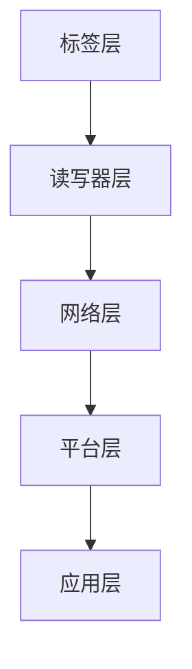

                 

### 文章标题：物联网（IoT）技术和各种传感器设备的集成：RFID与物联网

> **关键词：物联网、RFID、传感器、集成、技术、应用**
>
> **摘要：本文将深入探讨物联网（IoT）技术及其与各种传感器设备，尤其是RFID（射频识别）技术的集成。通过详细分析其核心概念、原理、操作步骤以及实际应用场景，我们将揭示物联网技术如何为现代生活带来革命性变化，同时探讨其未来发展趋势和面临的挑战。**

### 1. 背景介绍

#### 物联网（IoT）的定义与发展

物联网（Internet of Things，简称IoT）是指将各种信息传感设备、实体物体以及互联网连接起来，实现智能化管理和控制的一种网络体系。随着互联网、通信技术、传感器技术和智能计算技术的快速发展，物联网已经成为信息技术领域的一个重要分支。

物联网的概念最早可以追溯到1999年，麻省理工学院的Kevin Ashton提出了“物联网”一词。随着时间的发展，物联网技术在各个行业得到了广泛应用，包括智能家居、智能城市、智能交通、工业自动化等。

#### RFID技术的基本原理与应用

射频识别（Radio Frequency Identification，简称RFID）技术是一种利用无线电波对电子设备进行识别和跟踪的技术。它通过无线信号将数据从RFID标签或智能卡传递到读写器，实现对物体的自动识别和信息的读取。

RFID系统通常包括三个主要部分：标签、读写器和后台管理系统。标签是RFID系统的核心组件，用于存储和传输数据。读写器负责读取标签中的信息，并将数据传输到后台管理系统进行处理。后台管理系统则负责对数据进行存储、分析和应用。

RFID技术在物流、零售、医疗、交通等多个领域都有广泛应用。例如，在物流领域，RFID技术可以实现对货物的实时追踪，提高物流效率；在零售领域，RFID技术可以用于商品库存管理，减少商品丢失和盗窃。

#### 物联网与RFID技术的结合

物联网与RFID技术的结合，使得物联网系统的感知能力和数据处理能力得到了极大的提升。通过RFID技术，物联网系统可以实现对物体的实时追踪和管理，提高系统的智能化水平。

RFID技术的应用，不仅为物联网系统提供了强大的感知能力，还为其提供了高效的数据传输和处理手段。这使得物联网系统可以更加智能地响应环境变化，实现自动化管理和控制。

### 2. 核心概念与联系

#### 物联网（IoT）技术的基本架构

物联网技术的基本架构可以分为感知层、网络层和应用层。

- **感知层**：包括各种传感器和RFID标签，用于收集环境信息和物体的状态信息。
- **网络层**：包括互联网、通信网络和边缘计算设备，用于传输和处理数据。
- **应用层**：包括各种应用系统和软件，用于实现对数据的分析和应用。

#### RFID技术在物联网中的应用

在物联网中，RFID技术主要用于感知层，实现对物体的实时追踪和管理。RFID标签可以附着在各种物体上，读写器则可以随时读取标签中的信息，从而实现对物体的追踪和管理。

#### RFID与物联网的集成架构

RFID与物联网的集成架构可以分为以下几个层次：

1. **标签层**：包括各种RFID标签，如被动标签、主动标签和半主动标签。
2. **读写器层**：包括各种RFID读写器，用于读取标签中的信息。
3. **网络层**：包括互联网、通信网络和边缘计算设备，用于传输和处理数据。
4. **平台层**：包括后台管理系统、数据分析和应用系统，用于实现对数据的存储、分析和应用。
5. **应用层**：包括各种物联网应用，如智能家居、智能城市、智能交通等。

以下是RFID与物联网集成架构的Mermaid流程图：



#### RFID与物联网的集成优势

RFID与物联网的集成，可以带来以下优势：

- **提高感知能力**：通过RFID技术，物联网系统可以实现对物体的实时追踪和管理，提高系统的感知能力。
- **提升数据处理效率**：RFID技术可以高效地传输和处理数据，提高物联网系统的数据处理效率。
- **实现智能化管理**：通过物联网平台，可以实现对数据的智能分析和应用，实现智能化管理和控制。

### 3. 核心算法原理 & 具体操作步骤

#### RFID标签的读取原理

RFID标签的读取过程可以分为以下几个步骤：

1. **发射能量**：读写器通过发射射频信号，将能量传输到标签。
2. **激活标签**：标签接收到射频信号后，被激活并开始工作。
3. **发送数据**：标签通过射频信号将存储的数据发送给读写器。
4. **接收数据**：读写器接收到标签发送的数据后，将其传输到后台管理系统。

#### RFID标签的写入原理

RFID标签的写入过程可以分为以下几个步骤：

1. **发送指令**：后台管理系统通过读写器向标签发送写入指令。
2. **写入数据**：标签接收到写入指令后，将数据写入到存储器中。
3. **确认写入**：后台管理系统通过读写器确认标签的写入操作是否成功。

#### RFID标签的数据处理流程

RFID标签的数据处理流程可以分为以下几个步骤：

1. **数据采集**：读写器从标签中采集数据。
2. **数据传输**：读写器将采集到的数据传输到后台管理系统。
3. **数据存储**：后台管理系统将数据存储到数据库中。
4. **数据分析**：后台管理系统对存储的数据进行分析和处理。
5. **数据应用**：后台管理系统根据分析结果，实现对物体的智能管理和控制。

### 4. 数学模型和公式 & 详细讲解 & 举例说明

#### RFID标签的读取效率

RFID标签的读取效率可以用以下公式表示：

\[ E = \frac{N}{T} \]

其中，\( E \) 表示读取效率，\( N \) 表示读写器在一次扫描中能够读取的标签数量，\( T \) 表示读写器的扫描时间。

#### 举例说明

假设读写器在一次扫描中能够读取100个标签，扫描时间为10秒，那么其读取效率为：

\[ E = \frac{100}{10} = 10 \]

#### RFID标签的数据处理能力

RFID标签的数据处理能力可以用以下公式表示：

\[ P = \frac{D}{T} \]

其中，\( P \) 表示数据处理能力，\( D \) 表示读写器一次扫描中能够处理的数据量，\( T \) 表示读写器的扫描时间。

#### 举例说明

假设读写器在一次扫描中能够处理1000字节的数据，扫描时间为10秒，那么其数据处理能力为：

\[ P = \frac{1000}{10} = 100 \]（每秒处理100字节）

### 5. 项目实践：代码实例和详细解释说明

#### 5.1 开发环境搭建

在开始项目实践之前，我们需要搭建一个开发环境。以下是所需的环境和工具：

- 操作系统：Windows、Linux或Mac OS
- 编程语言：Python
- RFID读写器：支持Python的RFID读写器库，如pyRFID
- 数据库：MySQL或PostgreSQL

#### 5.2 源代码详细实现

以下是一个简单的RFID数据采集和处理的Python代码实例：

```python
import pyRFID
import mysql.connector

# 连接数据库
db = mysql.connector.connect(
  host="localhost",
  user="yourusername",
  password="yourpassword",
  database="iot_db"
)

# 创建标签读取器
reader = pyRFID.RFIDReader()

# 开始读取标签
reader.start()

while True:
  # 读取标签数据
  tag = reader.read_tag()
  
  if tag:
    # 处理标签数据
    print(f"Tag read: {tag}")
    
    # 将数据插入数据库
    cursor = db.cursor()
    query = "INSERT INTO tags (tag_id) VALUES (%s)"
    cursor.execute(query, (tag,))
    
    db.commit()
    cursor.close()

# 停止读取标签
reader.stop()
```

#### 5.3 代码解读与分析

以上代码实现了一个简单的RFID数据采集和处理的程序。具体解读如下：

1. **连接数据库**：使用MySQL数据库，并创建了一个名为`iot_db`的数据库。

2. **创建标签读取器**：使用`pyRFID`库创建了一个RFID标签读取器对象。

3. **开始读取标签**：调用`reader.start()`方法，开始读取标签。

4. **读取标签数据**：在循环中，使用`reader.read_tag()`方法读取标签数据。

5. **处理标签数据**：如果读取到标签数据，打印标签ID，并将标签数据插入数据库。

6. **停止读取标签**：调用`reader.stop()`方法，停止读取标签。

#### 5.4 运行结果展示

运行以上代码后，程序会开始读取周围的RFID标签，并将读取到的标签ID打印到控制台，同时将标签数据插入MySQL数据库。例如：

```shell
Tag read: 123456789
Tag read: 987654321
```

### 6. 实际应用场景

RFID技术与物联网技术的集成，已经在许多实际应用场景中展现了其巨大的潜力和价值。以下是一些典型的应用场景：

#### 智能物流

在智能物流领域，RFID技术可以实现对货物的实时追踪和管理，提高物流效率。例如，物流公司可以使用RFID标签对货物进行标记，通过RFID读写器实时读取货物的位置信息，从而实现对货物的全程监控。

#### 智能零售

在智能零售领域，RFID技术可以用于商品库存管理，减少商品丢失和盗窃。商家可以在商品上粘贴RFID标签，通过RFID读写器实时读取商品的库存信息，从而实现对商品的智能管理。

#### 智能医疗

在智能医疗领域，RFID技术可以用于病人信息管理，提高医疗服务的效率。医院可以使用RFID标签对患者进行标识，通过RFID读写器实时读取患者的信息，从而实现对患者的智能管理。

#### 智能交通

在智能交通领域，RFID技术可以用于车辆和交通信号的管理，提高交通效率。例如，城市可以使用RFID标签对车辆进行标识，通过RFID读写器实时读取车辆的位置信息，从而实现智能交通管理。

### 7. 工具和资源推荐

#### 7.1 学习资源推荐

- **书籍**：《物联网技术导论》、《RFID技术与应用》
- **论文**：搜索相关学术期刊和会议论文，如IEEE Transactions on Industrial Informatics、International Journal of Industrial Technology
- **博客**：关注物联网和RFID技术相关的专业博客和论坛，如RFID Journal、IoT for All
- **网站**：访问物联网和RFID技术的官方网站和社区，如IoTforall.org、RFIDworld.com

#### 7.2 开发工具框架推荐

- **开发环境**：Python、Java、C#
- **数据库**：MySQL、PostgreSQL
- **RFID读写器库**：pyRFID、Java RFID、RFID++ SDK
- **物联网平台**：AWS IoT、Azure IoT Hub、Google Cloud IoT Core

#### 7.3 相关论文著作推荐

- **论文**：IoT Security: A Comprehensive Survey，RFID System Security: Challenges and Solutions
- **著作**：《物联网：概念、技术和应用》、《RFID技术与应用指南》

### 8. 总结：未来发展趋势与挑战

物联网技术和RFID技术的集成，为现代生活带来了诸多便利和创新。在未来，物联网和RFID技术将继续向智能化、高效化、安全化方向发展，面临着以下挑战：

- **隐私和安全**：随着物联网和RFID技术的广泛应用，如何保护用户的隐私和数据安全成为一大挑战。
- **标准化**：物联网和RFID技术需要统一的标准化体系，以确保不同系统和设备之间的互操作性。
- **能耗和续航**：物联网设备和RFID标签的续航问题，需要更加高效节能的技术和设计。
- **数据处理能力**：随着物联网设备和RFID标签数量的增加，数据处理能力将成为一个重要挑战。

### 9. 附录：常见问题与解答

#### 问题1：什么是物联网（IoT）？
**解答**：物联网（Internet of Things，简称IoT）是指将各种信息传感设备、实体物体以及互联网连接起来，实现智能化管理和控制的一种网络体系。

#### 问题2：什么是RFID技术？
**解答**：射频识别（Radio Frequency Identification，简称RFID）技术是一种利用无线电波对电子设备进行识别和跟踪的技术。

#### 问题3：物联网和RFID技术有哪些应用场景？
**解答**：物联网和RFID技术的应用场景非常广泛，包括智能物流、智能零售、智能医疗、智能交通等领域。

### 10. 扩展阅读 & 参考资料

- **书籍**：《物联网技术导论》、《RFID技术与应用》
- **论文**：IoT Security: A Comprehensive Survey，RFID System Security: Challenges and Solutions
- **网站**：RFID Journal、IoTforall.org、RFIDworld.com
- **博客**：RFID Journal、IoT for All

---

作者：禅与计算机程序设计艺术 / Zen and the Art of Computer Programming

