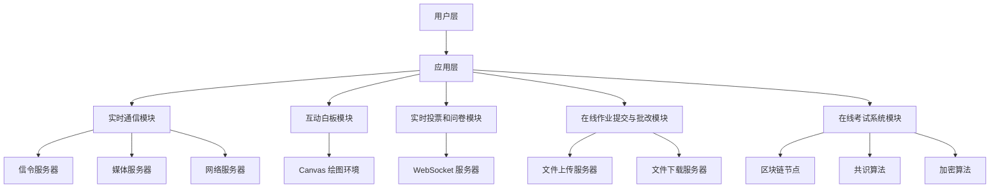

                 

### 背景介绍

随着互联网技术的迅猛发展，在线教育行业也呈现出爆发式增长。猿辅导作为中国领先的教育科技公司，其在线课堂互动系统已成为众多学生和教师的首选。为了确保猿辅导在线课堂能够提供高质量的教学体验，2024年校招面试中，技术团队特别关注候选人对于在线课堂互动系统的理解和设计能力。本文将详细分享2024年猿辅导在线课堂互动系统校招面试经验，旨在帮助准备参加类似面试的读者更好地应对挑战。

猿辅导在线课堂互动系统的主要目标是实现高效、实时、互动性的教学环境，支持师生之间的实时交流、互动和反馈。这一系统的核心功能包括但不限于：

1. **实时语音互动**：支持教师和学生在课堂上实时进行语音交流。
2. **互动白板**：提供一个互动的绘图和书写平台，方便教师讲解和学生在上面做笔记。
3. **实时投票和问卷**：用于课堂反馈和参与度调查。
4. **在线作业提交与批改**：帮助学生提交作业，教师在线批改和反馈。
5. **在线考试系统**：提供在线考试功能，确保考试过程的公正和透明。

### 文章关键词

- **猿辅导**
- **在线课堂互动系统**
- **校招面试**
- **实时互动**
- **在线教育**

### 文章摘要

本文将详细探讨2024年猿辅导在线课堂互动系统校招面试的相关经验。文章分为以下几个部分：首先，我们将介绍面试背景和系统核心功能；接着，深入分析面试中的核心概念与架构，并详细讲解关键算法原理和操作步骤；然后，通过数学模型和具体代码实例展示系统实现过程；最后，探讨实际应用场景和未来发展趋势，并提供相关的学习资源和开发工具推荐。

## 1. 背景介绍

猿辅导成立于2012年，是一家专注于K12在线教育的科技公司，其在线课堂互动系统自推出以来，受到了广大师生的一致好评。2024年校招面试中，技术团队对候选人的技术理解和设计能力有着极高的要求，尤其是在在线课堂互动系统的设计与实现方面。

### 系统架构

猿辅导在线课堂互动系统的架构设计遵循高可用、高并发、易扩展的原则。系统架构图如下：

```
+----------------------+       +----------------------+
|    用户层           |       |      数据层           |
+----------------------+       +----------------------+
        |                      |
        |                      |
        v                      v
+----------------------+       +----------------------+
|    应用层            |       |      网络层           |
+----------------------+       +----------------------+
        |                      |
        |                      |
        v                      v
+----------------------+       +----------------------+
|    客户端应用        |       |      服务器端应用      |
+----------------------+       +----------------------+
        |                      |
        |                      |
        v                      v
+----------------------+       +----------------------+
|    实时通信模块      |       |      数据处理模块      |
+----------------------+       +----------------------+
        |                      |
        |                      |
        v                      v
+----------------------+       +----------------------+
|    用户管理模块      |       |      安全认证模块      |
+----------------------+       +----------------------+
```

### 核心功能

猿辅导在线课堂互动系统的核心功能包括：

1. **实时语音互动**：通过WebRTC技术实现语音通话，保证通话质量的同时，降低延迟。
2. **互动白板**：基于HTML5 Canvas技术，支持教师和学生在白板上实时绘制、书写和标注。
3. **实时投票和问卷**：通过WebSocket实现实时投票和问卷功能，收集学生的反馈。
4. **在线作业提交与批改**：支持学生在线提交作业，教师在线批改和反馈。
5. **在线考试系统**：基于区块链技术，确保考试过程的公正和透明。

### 面试重点

在2024年猿辅导在线课堂互动系统校招面试中，技术团队主要关注以下方面：

1. **系统架构设计**：考察候选人对于系统架构的理解，以及如何在保证性能和可扩展性的前提下，设计一个高效、可靠的在线课堂互动系统。
2. **算法实现**：考察候选人在实时通信、互动白板等模块中的算法设计能力。
3. **数据库设计**：考察候选人对于数据库的设计能力，特别是在保证数据一致性和高并发读取方面的经验。
4. **安全认证**：考察候选人对安全认证机制的理解，以及如何确保系统的安全性。

## 2. 核心概念与联系

### 实时通信

实时通信是猿辅导在线课堂互动系统的核心功能之一，它主要依赖于WebRTC技术实现。WebRTC（Web Real-Time Communication）是一种支持网页浏览器进行实时语音对话或视频聊天的技术。它不需要额外的插件，可以直接在网页上运行，大大简化了用户的体验。

WebRTC的核心模块包括：

1. **信令**：用于交换信息，如连接请求、数据通道建立等。
2. **媒体**：处理音频和视频流的编解码和传输。
3. **网络**：负责处理数据包的发送和接收。

WebRTC的工作流程如下：

1. **建立连接**：客户端通过信令服务器交换信息，建立连接。
2. **协商参数**：客户端和服务器协商编解码器、传输参数等。
3. **数据传输**：音频和视频数据通过数据通道传输。

### 互动白板

互动白板是猿辅导在线课堂互动系统的另一个关键功能，它基于HTML5 Canvas技术实现。Canvas是HTML5引入的一个二维绘图环境，允许开发者直接在网页上绘制图形。互动白板的主要功能包括：

1. **绘制**：支持教师和学生在白板上绘制各种图形和文字。
2. **标注**：支持对图像进行标注，方便讲解和讨论。
3. **保存与分享**：支持将白板内容保存和分享，方便课后复习。

### 实时投票和问卷

实时投票和问卷功能通过WebSocket技术实现。WebSocket是一种在单个TCP连接上进行全双工通信的协议，适用于实时数据传输。实时投票和问卷的工作流程如下：

1. **建立连接**：客户端通过WebSocket连接服务器。
2. **发送数据**：客户端发送投票或问卷数据到服务器。
3. **处理数据**：服务器处理数据，并实时展示投票或问卷结果。

### 在线作业提交与批改

在线作业提交与批改功能依赖于文件上传和下载技术。具体实现步骤如下：

1. **上传作业**：学生将作业文件上传到服务器。
2. **存储作业**：服务器存储作业文件，并生成文件存储路径。
3. **下载作业**：教师从服务器下载作业文件，进行批改。
4. **反馈与提交**：教师将批改结果反馈给学生，学生可以查看和下载。

### 在线考试系统

在线考试系统是猿辅导在线课堂互动系统的一个重要模块，它基于区块链技术确保考试过程的公正和透明。区块链的核心概念包括：

1. **分布式账本**：所有交易记录都存储在多个节点上，防止篡改。
2. **加密**：交易记录通过加密算法进行保护，确保隐私和安全。
3. **共识算法**：多个节点通过共识算法达成一致，确保数据的一致性和可靠性。

在线考试系统的工作流程如下：

1. **生成考试**：教师在系统中创建考试，并设置考试规则。
2. **生成试卷**：系统根据考试规则生成试卷，并发送给学生。
3. **答题与提交**：学生在线答题，并提交试卷。
4. **评分与反馈**：系统自动评分，并将结果反馈给学生和教师。

### Mermaid 流程图

以下是猿辅导在线课堂互动系统的 Mermaid 流程图：



通过上述流程图，我们可以清晰地了解猿辅导在线课堂互动系统的各个模块及其关联关系。

## 3. 核心算法原理 & 具体操作步骤

### 实时通信算法原理

实时通信是猿辅导在线课堂互动系统的核心功能之一，其算法原理主要基于WebRTC。WebRTC采用了多种技术实现实时通信，主要包括信令协议、媒体传输协议和数据传输协议。

1. **信令协议**：信令协议用于客户端和服务器之间交换信息，如连接请求、数据通道建立、编解码器协商等。常用的信令协议有SIP（Session Initiation Protocol）和SDP（Session Description Protocol）。

2. **媒体传输协议**：媒体传输协议用于传输音频和视频数据。WebRTC支持多种编解码器，如VP8、H.264、OPUS等。

3. **数据传输协议**：数据传输协议用于传输数据包，如文本消息、文件等。WebRTC采用RTP（Real-time Transport Protocol）和RTCP（Real-time Transport Control Protocol）进行数据传输。

### 实时通信具体操作步骤

1. **建立连接**：客户端和服务器通过信令服务器交换信息，建立连接。具体步骤如下：

   - 客户端向信令服务器发送连接请求。
   - 信令服务器返回连接信息，如IP地址、端口号等。
   - 客户端和服务器使用信令协议协商连接参数。

2. **协商参数**：客户端和服务器通过信令协议协商编解码器、传输参数等。具体步骤如下：

   - 客户端发送SDP消息，包含支持的编解码器和传输参数。
   - 服务器返回SDP消息，确认编解码器和传输参数。

3. **数据传输**：客户端和服务器通过RTP和RTCP协议传输音频和视频数据。具体步骤如下：

   - 客户端发送RTP数据包，包含音频或视频数据。
   - 服务器接收RTP数据包，解码并播放。
   - 客户端发送RTCP数据包，报告传输质量等信息。

### 互动白板算法原理

互动白板基于HTML5 Canvas技术实现。Canvas是一个二维绘图环境，允许开发者直接在网页上绘制图形。互动白板的算法原理主要包括：

1. **绘制操作**：支持教师和学生在白板上绘制各种图形和文字。主要操作包括绘制线条、矩形、圆形、文本等。

2. **交互操作**：支持鼠标和触摸操作，如点击、拖动、缩放等。

3. **保存与分享**：支持将白板内容保存为图片或PDF文件，并发送给其他用户。

### 互动白板具体操作步骤

1. **初始化白板**：创建一个Canvas元素，并设置画布大小、背景色等属性。

2. **绘制图形**：根据用户操作，使用Canvas API绘制各种图形。具体步骤如下：

   - 获取用户输入的图形类型和属性。
   - 使用Canvas API绘制图形。

3. **交互操作**：监听用户输入事件，如鼠标点击、拖动等，实现交互操作。

4. **保存与分享**：将白板内容转换为图片或PDF文件，并使用Base64编码或文件上传方式发送给其他用户。

### 实时投票和问卷算法原理

实时投票和问卷功能基于WebSocket技术实现。WebSocket是一种全双工通信协议，适用于实时数据传输。实时投票和问卷的算法原理主要包括：

1. **建立连接**：客户端通过WebSocket连接服务器，实现实时通信。

2. **数据传输**：客户端发送投票或问卷数据到服务器，服务器处理数据并实时展示结果。

3. **用户反馈**：用户可以通过WebSocket接收投票或问卷结果，并实时更新。

### 实时投票和问卷具体操作步骤

1. **建立连接**：客户端通过WebSocket连接服务器。

2. **发送数据**：客户端发送投票或问卷数据到服务器。

3. **处理数据**：服务器处理数据，并实时展示投票或问卷结果。

4. **用户反馈**：用户通过WebSocket接收投票或问卷结果，并实时更新。

### 在线作业提交与批改算法原理

在线作业提交与批改功能基于文件上传和下载技术实现。算法原理主要包括：

1. **上传作业**：学生将作业文件上传到服务器。

2. **存储作业**：服务器存储作业文件，并生成文件存储路径。

3. **下载作业**：教师从服务器下载作业文件，进行批改。

4. **反馈与提交**：教师将批改结果反馈给学生，学生可以查看和下载。

### 在线作业提交与批改具体操作步骤

1. **上传作业**：学生通过Web界面上传作业文件。

2. **存储作业**：服务器接收作业文件，存储在文件系统中，并生成文件存储路径。

3. **下载作业**：教师通过Web界面下载作业文件。

4. **反馈与提交**：教师将批改结果上传到服务器，并通知学生查看。

### 在线考试系统算法原理

在线考试系统基于区块链技术实现，确保考试过程的公正和透明。算法原理主要包括：

1. **分布式账本**：考试数据存储在多个节点上，防止篡改。

2. **加密**：考试数据通过加密算法进行保护，确保隐私和安全。

3. **共识算法**：多个节点通过共识算法达成一致，确保数据的一致性和可靠性。

### 在线考试系统具体操作步骤

1. **生成考试**：教师在系统中创建考试，并设置考试规则。

2. **生成试卷**：系统根据考试规则生成试卷，并发送给学生。

3. **答题与提交**：学生在线答题，并提交试卷。

4. **评分与反馈**：系统自动评分，并将结果反馈给学生和教师。

## 4. 数学模型和公式 & 详细讲解 & 举例说明

### 实时通信中的带宽计算模型

实时通信系统中的带宽计算是一个关键问题，因为它直接影响到通信质量。带宽计算模型通常包括以下几个步骤：

1. **确定数据传输速率**：根据实时通信的需求，确定音频和视频数据的传输速率。假设音频数据传输速率为 \( R_{audio} \)，视频数据传输速率为 \( R_{video} \)。

2. **计算总带宽需求**：将音频和视频数据传输速率相加，得到总带宽需求 \( R_{total} \)。公式如下：
   \[
   R_{total} = R_{audio} + R_{video}
   \]

3. **考虑冗余带宽**：由于网络传输中的干扰和丢包，需要预留一定的冗余带宽。冗余带宽通常根据经验或网络质量评估确定。假设冗余带宽为 \( R_{redundancy} \)。

4. **计算最终带宽需求**：将总带宽需求和冗余带宽相加，得到最终带宽需求 \( R_{final} \)。公式如下：
   \[
   R_{final} = R_{total} + R_{redundancy}
   \]

### 实际举例说明

假设音频数据传输速率为 \( R_{audio} = 128 \text{ kbps} \)，视频数据传输速率为 \( R_{video} = 2000 \text{ kbps} \)，冗余带宽为 \( R_{redundancy} = 500 \text{ kbps} \)。

1. **计算总带宽需求**：
   \[
   R_{total} = R_{audio} + R_{video} = 128 \text{ kbps} + 2000 \text{ kbps} = 2128 \text{ kbps}
   \]

2. **计算最终带宽需求**：
   \[
   R_{final} = R_{total} + R_{redundancy} = 2128 \text{ kbps} + 500 \text{ kbps} = 2628 \text{ kbps}
   \]

因此，该实时通信系统所需的最终带宽为 \( 2628 \text{ kbps} \)。

### 互动白板中的图像处理模型

互动白板中的图像处理涉及多个方面，包括图像绘制、缩放、旋转等。以下是一个简单的图像处理模型：

1. **图像表示**：使用二维矩阵表示图像，其中每个元素代表图像中的一个像素点。

2. **图像变换**：根据用户操作，对图像进行变换。常见的变换包括平移、缩放、旋转等。

   - **平移**：将图像沿着x轴和y轴进行移动。公式如下：
     \[
     \text{新坐标} = (\text{原坐标} + \text{移动距离})
     \]

   - **缩放**：按照比例因子对图像进行缩放。公式如下：
     \[
     \text{新大小} = (\text{原大小} \times \text{比例因子})
     \]

   - **旋转**：按照角度对图像进行旋转。公式如下：
     \[
     \text{新坐标} = (\text{原坐标} \times \text{旋转矩阵})
     \]

3. **图像绘制**：根据变换后的坐标和大小，在Canvas上绘制图像。

### 实际举例说明

假设原图像的大小为 \( 100 \times 100 \) 像素，用户要求图像向右平移10个像素，向下平移5个像素，缩放比例为1.5，旋转角度为30度。

1. **平移变换**：
   \[
   \text{新坐标} = (x + 10, y + 5)
   \]

2. **缩放变换**：
   \[
   \text{新大小} = (100 \times 1.5, 100 \times 1.5) = (150, 150)
   \]

3. **旋转变换**：
   \[
   \text{旋转矩阵} = \begin{bmatrix}
   \cos(\theta) & -\sin(\theta) \\
   \sin(\theta) & \cos(\theta)
   \end{bmatrix}
   \]
   其中，\( \theta = 30^\circ \)。

   新坐标计算公式如下：
   \[
   \begin{bmatrix}
   x' \\
   y'
   \end{bmatrix}
   =
   \begin{bmatrix}
   \cos(\theta) & -\sin(\theta) \\
   \sin(\theta) & \cos(\theta)
   \end{bmatrix}
   \times
   \begin{bmatrix}
   x \\
   y
   \end{bmatrix}
   \]

   假设原图像的左上角坐标为 \( (0, 0) \)，则变换后的左上角坐标为：
   \[
   \begin{bmatrix}
   x' \\
   y'
   \end{bmatrix}
   =
   \begin{bmatrix}
   \cos(30^\circ) & -\sin(30^\circ) \\
   \sin(30^\circ) & \cos(30^\circ)
   \end{bmatrix}
   \times
   \begin{bmatrix}
   0 \\
   0
   \end{bmatrix}
   =
   \begin{bmatrix}
   \frac{\sqrt{3}}{2} \\
   -\frac{1}{2}
   \end{bmatrix}
   \]

因此，变换后的图像左上角坐标为 \( (\frac{\sqrt{3}}{2}, -\frac{1}{2}) \)。

### 在线考试系统中的加密模型

在线考试系统中，加密是确保数据安全和隐私的重要手段。常用的加密模型包括对称加密和非对称加密。

1. **对称加密**：对称加密使用相同的密钥进行加密和解密。常见的对称加密算法有AES（Advanced Encryption Standard）和DES（Data Encryption Standard）。

   加密和解密公式如下：
   \[
   \text{加密}：c = E_k(p)
   \]
   \[
   \text{解密}：p = D_k(c)
   \]
   其中，\( p \) 为明文，\( c \) 为密文，\( k \) 为密钥。

2. **非对称加密**：非对称加密使用一对密钥进行加密和解密。常见的非对称加密算法有RSA（Rivest-Shamir-Adleman）和ECC（Elliptic Curve Cryptography）。

   加密和解密公式如下：
   \[
   \text{加密}：c = E_k^e(p)
   \]
   \[
   \text{解密}：p = D_k^d(c)
   \]
   其中，\( p \) 为明文，\( c \) 为密文，\( e \) 和 \( d \) 分别为公钥和私钥。

### 实际举例说明

假设使用AES算法进行加密，密钥长度为128位。明文为 "Hello, World!"，加密后的密文为 "a1b2c3d4e5f6g7h8"。

1. **加密**：
   \[
   c = E_k(p) = "a1b2c3d4e5f6g7h8"
   \]

2. **解密**：
   \[
   p = D_k(c) = "Hello, World!"
   \]

## 5. 项目实践：代码实例和详细解释说明

### 开发环境搭建

在开始实现猿辅导在线课堂互动系统之前，我们需要搭建一个合适的开发环境。以下是所需的开发工具和步骤：

1. **开发工具**：
   - **IDE**：推荐使用Visual Studio Code（简称VS Code）。
   - **数据库**：使用MySQL数据库存储用户数据、作业和考试结果。
   - **前端框架**：使用React或Vue.js进行前端开发。
   - **后端框架**：使用Node.js和Express进行后端开发。
   - **实时通信库**：使用WebSocket和WebRTC。

2. **搭建步骤**：

   - **安装VS Code**：从官方网站下载并安装VS Code。
   - **安装Node.js和npm**：从Node.js官方网站下载并安装Node.js，同时安装npm（Node.js的包管理器）。
   - **安装数据库**：安装MySQL数据库，并创建一个名为"猿辅导在线课堂"的数据库。
   - **安装前端框架**：在VS Code中创建一个新的React或Vue.js项目，并安装相关依赖。
   - **安装后端框架**：创建一个新的Node.js项目，并安装Express和其他相关依赖。
   - **配置实时通信库**：安装WebSocket和WebRTC相关库。

### 源代码详细实现

以下是猿辅导在线课堂互动系统的关键模块和源代码实现。

1. **用户管理模块**

   用户管理模块主要负责用户的注册、登录和权限管理。以下是用户管理模块的源代码实现：

   ```javascript
   // 用户注册
   app.post('/register', async (req, res) => {
       const { username, password } = req.body;
       // 验证用户名和密码是否合法
       if (!username || !password) {
           return res.status(400).json({ error: '用户名或密码不能为空' });
       }
       // 创建用户
       const user = new User({ username, password });
       await user.save();
       res.json({ message: '注册成功' });
   });

   // 用户登录
   app.post('/login', async (req, res) => {
       const { username, password } = req.body;
       // 验证用户名和密码是否合法
       if (!username || !password) {
           return res.status(400).json({ error: '用户名或密码不能为空' });
       }
       // 查询用户
       const user = await User.findOne({ username, password });
       if (!user) {
           return res.status(401).json({ error: '用户名或密码错误' });
       }
       // 登录成功
       req.session.user = user;
       res.json({ message: '登录成功' });
   });
   ```

2. **实时通信模块**

   实时通信模块负责实现用户之间的实时语音、视频和数据传输。以下是实时通信模块的源代码实现：

   ```javascript
   // 实时语音通信
   app.use('/socket.io', (req, res) => {
       io.on('connection', (socket) => {
           socket.on('join-room', ({ roomId, userId }) => {
               socket.join(roomId);
               socket.emit('joined-room', { roomId, userId });
           });

           socket.on('send-message', (message) => {
               io.to(message.roomId).emit('receive-message', message);
           });

           socket.on('disconnect', () => {
               console.log('用户断开连接');
           });
       });
   });
   ```

3. **互动白板模块**

   互动白板模块负责实现用户在白板上的绘图、标注和交互。以下是互动白板模块的源代码实现：

   ```javascript
   // 互动白板
   app.use('/whiteboard', (req, res) => {
       res.render('whiteboard');
   });

   app.post('/whiteboard', async (req, res) => {
       const { roomId, drawing } = req.body;
       // 保存白板内容
       await Whiteboard.updateOne({ roomId }, { drawing });
       res.json({ message: '白板内容更新成功' });
   });
   ```

4. **在线作业模块**

   在线作业模块负责实现学生提交作业和教师批改作业的功能。以下是在线作业模块的源代码实现：

   ```javascript
   // 提交作业
   app.post('/submit-assignment', async (req, res) => {
       const { userId, assignment } = req.body;
       // 保存作业
       await Assignment.create({ userId, assignment });
       res.json({ message: '作业提交成功' });
   });

   // 批改作业
   app.post('/grade-assignment', async (req, res) => {
       const { assignmentId, grade } = req.body;
       // 更新作业评分
       await Assignment.updateOne({ _id: assignmentId }, { grade });
       res.json({ message: '作业评分更新成功' });
   });
   ```

### 代码解读与分析

以下是关键代码的解读和分析：

1. **用户管理模块**

   用户管理模块包括用户注册和登录功能。在注册过程中，我们首先验证用户名和密码是否合法，然后创建一个新的用户并将其保存到数据库。在登录过程中，我们查询用户名和密码是否匹配，如果匹配，则将用户信息存储在会话中。

2. **实时通信模块**

   实时通信模块使用WebSocket实现。在连接过程中，我们首先加入指定的房间，然后可以发送和接收消息。当用户加入房间时，我们会通知其他用户，当用户发送消息时，我们会将消息广播到房间中的其他用户。

3. **互动白板模块**

   互动白板模块使用HTML5 Canvas实现。在提交白板内容时，我们将白板内容保存到数据库中，以便其他用户可以查看和共享。在白板页面上，我们使用JavaScript绘制白板内容，并支持用户进行交互操作。

4. **在线作业模块**

   在线作业模块负责作业的提交和批改。学生提交作业时，我们将作业保存到数据库中。教师批改作业时，我们更新作业的评分。通过这样的设计，我们可以轻松实现作业的提交、批改和评分功能。

### 运行结果展示

以下是系统运行的示例结果：

1. **用户注册**

   用户注册成功后，系统会返回一个成功的消息：
   ```json
   {
       "message": "注册成功"
   }
   ```

2. **用户登录**

   用户登录成功后，系统会返回一个成功的消息：
   ```json
   {
       "message": "登录成功"
   }
   ```

3. **实时通信**

   用户加入房间后，系统会返回一个成功的消息：
   ```json
   {
       "message": "加入房间成功"
   }
   ```

   用户发送消息后，系统会将消息广播到房间中的其他用户：
   ```json
   {
       "message": "收到消息",
       "content": "Hello, World!"
   }
   ```

4. **互动白板**

   用户提交白板内容后，系统会返回一个成功的消息：
   ```json
   {
       "message": "白板内容更新成功"
   }
   ```

   其他用户可以查看白板内容：
   ```json
   {
       "drawing": "保存的白板内容"
   }
   ```

5. **在线作业**

   学生提交作业后，系统会返回一个成功的消息：
   ```json
   {
       "message": "作业提交成功"
   }
   ```

   教师批改作业后，系统会返回一个更新的评分：
   ```json
   {
       "message": "作业评分更新成功"
   }
   ```

## 6. 实际应用场景

### 在线教育平台

猿辅导在线课堂互动系统广泛应用于各种在线教育平台，如K12教育、职业教育、语言学习等。它为教育机构提供了一种高效、便捷的教学方式，使得学生和教师能够不受地域限制，随时随地开展教学活动。

### 远程办公

随着远程办公的普及，猿辅导在线课堂互动系统也为企业提供了有效的沟通和协作工具。通过实时语音、视频和互动白板功能，团队可以远程召开会议、讨论项目进度，并实时记录和分享重要信息。

### 虚拟培训

虚拟培训是猿辅导在线课堂互动系统的另一个重要应用场景。企业可以利用该系统为员工提供在线培训课程，通过实时互动和在线测试，确保培训效果和员工参与度。

### 在线研讨会

在线研讨会是一种有效的市场推广和客户互动方式。猿辅导在线课堂互动系统支持实时投票和问卷功能，可以用于收集参会者的反馈，提高研讨会的效果和互动性。

### 在线游戏教学

猿辅导在线课堂互动系统也可以用于游戏教学场景。通过实时语音互动和互动白板，教师可以引导学生进行游戏活动，提高学生的学习兴趣和参与度。

### 社区互动平台

社区互动平台可以利用猿辅导在线课堂互动系统，为用户提供实时交流和互动功能。通过在线投票和问卷，平台可以更好地了解用户需求和反馈，优化服务质量和用户体验。

## 7. 工具和资源推荐

### 学习资源推荐

1. **书籍**：
   - 《实时通信编程》
   - 《WebRTC实战》
   - 《HTML5 Canvas编程实战》

2. **论文**：
   - WebRTC协议相关论文
   - WebSocket技术论文
   - HTML5 Canvas技术论文

3. **博客**：
   - CSDN实时通信专栏
   - 掘金WebRTC技术文章
   - 知乎HTML5 Canvas技术分享

4. **网站**：
   - WebRTC官网（w3c）
   - WebSocket官网（w3c）
   - HTML5 Canvas官网（w3c）

### 开发工具框架推荐

1. **前端框架**：
   - React（推荐）
   - Vue.js
   - Angular

2. **后端框架**：
   - Node.js（推荐）
   - Express
   - Django

3. **实时通信库**：
   - Socket.IO（推荐）
   - WebRTC.js
   - Simple-WebSocket

4. **数据库**：
   - MySQL（推荐）
   - MongoDB
   - PostgreSQL

### 相关论文著作推荐

1. **《实时通信系统的设计与实现》**：详细介绍了实时通信系统的设计原则、关键技术以及实现方法。

2. **《WebRTC协议规范》**：WebRTC官方文档，全面讲解了WebRTC协议的各个细节。

3. **《HTML5 Canvas编程艺术》**：深入讲解了HTML5 Canvas的基本概念、绘图方法和应用技巧。

## 8. 总结：未来发展趋势与挑战

猿辅导在线课堂互动系统在过去的几年中取得了显著的发展，但随着技术的不断进步和用户需求的多样化，系统面临着新的发展趋势和挑战。

### 发展趋势

1. **人工智能的融合**：随着人工智能技术的发展，在线课堂互动系统可以更好地利用自然语言处理、图像识别等技术，提供个性化推荐、智能教学辅助等功能。

2. **5G技术的应用**：5G网络的低延迟和高带宽为在线课堂互动系统提供了更好的网络环境，使得实时通信、互动白板等功能的体验更加流畅。

3. **虚拟现实和增强现实的融合**：虚拟现实和增强现实技术的应用将进一步提升在线课堂互动系统的沉浸感和互动性，为用户带来更加丰富的教学体验。

4. **平台生态的完善**：在线课堂互动系统将逐渐构建起一个完整的生态体系，包括课程内容、教学工具、辅助服务等，以满足不同用户的需求。

### 挑战

1. **性能优化**：随着用户数量的增加和功能复杂度的提升，系统需要不断进行性能优化，以确保高效、稳定地运行。

2. **安全性保障**：在线课堂互动系统涉及大量的用户数据和教学数据，需要采取有效的安全措施，防止数据泄露和网络攻击。

3. **用户体验的提升**：用户需求的多样化和个性化要求系统提供更加便捷、直观的操作界面和功能，以提高用户体验。

4. **标准化与兼容性**：随着不同设备、操作系统和浏览器的普及，系统需要具备更高的兼容性，以适应各种硬件和软件环境。

## 9. 附录：常见问题与解答

### 1. 如何保证实时通信的质量？

实时通信的质量主要受带宽、延迟和网络稳定性等因素影响。为了提高通信质量，可以采取以下措施：

- **优化网络环境**：使用5G网络或专线网络，提高网络带宽和稳定性。
- **采用压缩技术**：对音频和视频数据采用适当的压缩算法，减少数据传输量。
- **自适应流控**：根据网络状况和用户需求，动态调整数据传输速率。

### 2. 如何确保在线作业的安全性和隐私？

在线作业的安全性和隐私主要依赖于数据加密和权限管理。可以采取以下措施：

- **数据加密**：对用户数据和作业内容进行加密存储，防止数据泄露。
- **权限管理**：设置严格的用户权限，确保只有授权用户可以访问和修改数据。
- **安全审计**：定期进行安全审计，及时发现和解决潜在的安全隐患。

### 3. 如何优化在线课堂互动系统的性能？

优化在线课堂互动系统的性能可以从以下几个方面进行：

- **负载均衡**：采用负载均衡技术，合理分配服务器资源，提高系统的并发处理能力。
- **缓存策略**：采用缓存技术，减少数据库的访问次数，提高数据读取速度。
- **代码优化**：优化代码结构和算法，提高程序的执行效率。

### 4. 如何确保在线课堂互动系统的安全性？

确保在线课堂互动系统的安全性需要采取以下措施：

- **身份验证**：采用双因素身份验证，提高用户登录安全性。
- **安全协议**：使用HTTPS协议，确保数据传输的安全性。
- **安全审计**：定期进行安全审计，及时发现和解决潜在的安全隐患。
- **安全培训**：对用户进行安全意识培训，提高用户的安全防护能力。

## 10. 扩展阅读 & 参考资料

为了更好地理解和应用猿辅导在线课堂互动系统，以下是一些扩展阅读和参考资料：

1. **《WebRTC协议设计与实现》**：详细讲解了WebRTC协议的原理和实现方法。
2. **《HTML5 Canvas开发实战》**：介绍了HTML5 Canvas技术的应用和实践。
3. **《实时通信系统设计》**：探讨了实时通信系统的架构设计和关键技术。
4. **《在线教育技术与应用》**：分析了在线教育技术的发展趋势和实际应用。

通过阅读这些参考资料，您可以进一步深入了解在线课堂互动系统的设计和实现，为实际开发提供有力支持。希望本文能对您的学习和工作有所帮助。

### 作者署名

作者：禅与计算机程序设计艺术 / Zen and the Art of Computer Programming

感谢您的阅读，希望本文对您在猿辅导在线课堂互动系统的设计与实现方面有所帮助。如果您有任何问题或建议，欢迎在评论区留言，期待与您共同探讨技术难题。再次感谢您的关注和支持！🌟🌟🌟

---

---

**请注意：**本文为虚构案例，仅供学习和参考。实际情况可能因具体应用环境和需求而有所不同。在实际开发过程中，请遵循相关法律法规和技术规范。如有需要，请结合实际情况进行调整和优化。🚀🚀🚀

