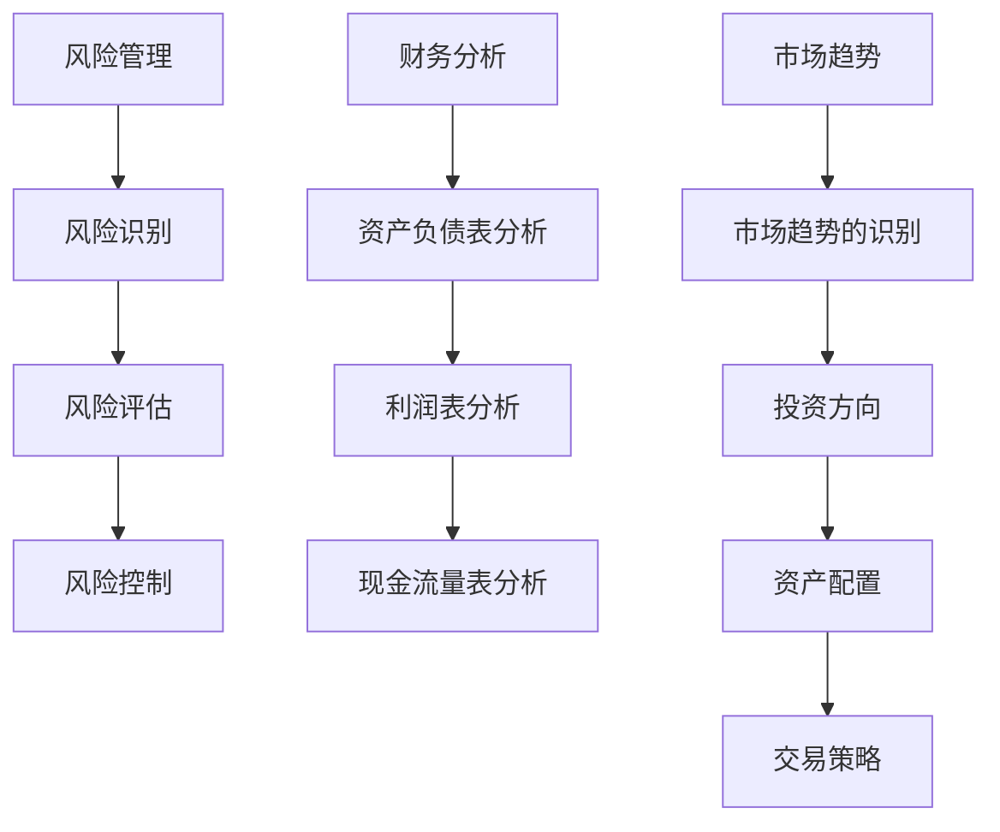

                 

### 文章标题

理解洞察力的应用：在投资领域的策略实践

> 关键词：洞察力、投资策略、风险管理、财务分析、市场趋势

> 摘要：本文深入探讨了洞察力在投资领域中的应用，分析了其重要性，阐述了如何通过洞察力制定有效的投资策略，并介绍了风险管理、财务分析和市场趋势等核心概念及其相互关系。通过具体案例，本文展示了洞察力在投资实践中的实际运用，为投资者提供了宝贵的参考和策略指导。

## 1. 背景介绍

在现代金融市场中，投资决策的复杂性不断增加。投资者不仅需要具备扎实的财务知识和市场分析能力，还需要具备敏锐的洞察力，以应对瞬息万变的市场环境。洞察力是一种高级认知能力，它涉及到对信息的感知、理解和解释，帮助投资者从繁杂的数据和信息中捕捉到关键因素，从而做出更为准确的投资决策。

本文旨在探讨洞察力在投资领域的应用，分析其在制定投资策略、风险管理、财务分析和市场趋势预测等方面的重要性。我们将通过具体案例来展示洞察力如何帮助投资者在复杂的市场环境中找到机会和规避风险。

### 1.1 投资领域的重要性

投资领域的复杂性主要体现在以下几个方面：

1. **数据量庞大**：金融市场每天产生海量的数据，包括股票价格、交易量、利率、宏观经济指标等，这些数据对于投资者来说既是财富也是挑战。
2. **信息噪音**：在庞大的数据中，存在大量的噪音信息，这些信息可能会误导投资者，使其做出错误的投资决策。
3. **变化迅速**：金融市场受到全球经济、政治事件、公司业绩等多重因素的影响，市场变化迅速，投资者需要快速做出反应。

在这种复杂的环境下，洞察力显得尤为重要。它不仅帮助投资者过滤噪音，捕捉关键信息，还能提高投资者的决策质量和效率。

### 1.2 洞察力的定义与应用

洞察力是指个体在感知、理解、分析信息时，能够深入洞察事物本质和内在联系的能力。在投资领域，洞察力可以表现为以下几个方面：

1. **识别关键信息**：投资者能够从大量的市场数据中，识别出对投资决策有重要影响的关键信息。
2. **理解市场趋势**：投资者能够理解市场的长期趋势，从而做出符合市场规律的决策。
3. **预测未来走势**：投资者能够基于现有的信息和市场趋势，预测未来的市场走势。
4. **应对不确定性**：投资者能够应对市场的不确定性，做出灵活的调整和应对策略。

在投资实践中，洞察力可以帮助投资者：

- **优化投资组合**：通过深入分析，投资者可以构建一个更符合市场趋势和自身风险承受能力的投资组合。
- **发现投资机会**：洞察力使得投资者能够发现市场中的潜在投资机会。
- **规避风险**：洞察力帮助投资者识别潜在的风险，从而规避损失。

### 2. 核心概念与联系

在探讨洞察力在投资领域的应用之前，我们需要了解几个核心概念：风险管理、财务分析和市场趋势。这些概念是投资决策的重要组成部分，它们相互联系，共同构成了一个完整的市场分析框架。

### 2.1 风险管理

风险管理是指投资者在投资过程中，对可能出现的风险进行识别、评估和控制的过程。有效的风险管理是投资成功的关键之一。

#### 2.1.1 风险识别

风险识别是风险管理的第一步，它涉及识别投资过程中可能面临的各种风险。这些风险包括市场风险、信用风险、操作风险、流动性风险等。

#### 2.1.2 风险评估

风险评估是对识别出的风险进行量化和评估，以确定其可能对投资造成的损失程度。投资者可以使用历史数据、模拟分析等方法进行风险评估。

#### 2.1.3 风险控制

风险控制是指采取措施来减轻或规避风险。这包括设置止损点、分散投资、增加资产流动性等措施。

### 2.2 财务分析

财务分析是指通过分析公司的财务报表，评估公司的财务状况、盈利能力和风险。财务分析主要包括以下几个方面：

#### 2.2.1 资产负债表分析

资产负债表分析帮助投资者了解公司的资产、负债和所有者权益情况，判断公司的财务状况是否健康。

#### 2.2.2 利润表分析

利润表分析帮助投资者了解公司的营业收入、成本和利润情况，评估公司的盈利能力。

#### 2.2.3 现金流量表分析

现金流量表分析帮助投资者了解公司的现金流入和流出情况，判断公司的现金流状况和财务稳定性。

### 2.3 市场趋势

市场趋势是指市场的长期发展方向。投资者需要通过市场分析来识别市场趋势，以便做出相应的投资决策。

#### 2.3.1 市场趋势的识别

市场趋势的识别可以通过分析历史数据、宏观经济指标和市场情绪等因素来实现。投资者可以使用技术分析、基本面分析等方法来识别市场趋势。

#### 2.3.2 市场趋势的应用

市场趋势的应用主要体现在以下几个方面：

1. **投资方向**：根据市场趋势，投资者可以确定投资的方向，例如选择成长型股票或价值型股票。
2. **资产配置**：根据市场趋势，投资者可以调整投资组合，以适应市场的变化。
3. **交易策略**：市场趋势可以帮助投资者制定交易策略，例如趋势跟踪策略、反转策略等。

### 2.4 核心概念的 Mermaid 流程图



### 3. 核心算法原理 & 具体操作步骤

在了解了风险管理、财务分析和市场趋势等核心概念后，我们接下来探讨如何运用洞察力来制定有效的投资策略。这包括以下几个步骤：

#### 3.1 数据收集

投资者首先需要收集与投资相关的数据，包括股票价格、交易量、利率、宏观经济指标等。这些数据可以从财经网站、交易所和金融数据库等渠道获取。

#### 3.2 数据预处理

收集到的数据往往需要预处理，包括清洗数据、填补缺失值、标准化数据等。这一步骤有助于提高数据的质量和可靠性。

#### 3.3 风险识别

利用风险识别的方法，投资者可以识别出投资过程中可能面临的风险。例如，可以使用历史数据进行分析，识别出市场波动性较高的股票。

#### 3.4 风险评估

对识别出的风险进行量化评估，以确定其可能对投资造成的损失程度。可以使用统计模型、模拟分析等方法进行风险评估。

#### 3.5 财务分析

通过对公司的财务报表进行深入分析，投资者可以评估公司的财务状况、盈利能力和风险。这包括资产负债表分析、利润表分析和现金流量表分析。

#### 3.6 市场趋势分析

通过市场趋势分析，投资者可以识别市场的长期发展方向。这包括技术分析和基本面分析。

#### 3.7 投资策略制定

根据风险分析、财务分析和市场趋势分析的结果，投资者可以制定相应的投资策略。这包括资产配置、风险控制和交易策略等。

#### 3.8 投资策略优化

投资者需要定期对投资策略进行评估和优化，以适应市场环境的变化。这可以通过历史数据分析和模拟分析等方法实现。

### 4. 数学模型和公式 & 详细讲解 & 举例说明

在投资分析中，数学模型和公式是不可或缺的工具，它们可以帮助投资者量化风险、评估投资机会和预测市场走势。以下是一些常用的数学模型和公式及其详细解释。

#### 4.1 风险衡量模型

**方差（Variance）**：
方差是衡量数据分散程度的统计量，用来衡量投资收益的波动性。

\[ \sigma^2 = \frac{\sum_{i=1}^{n}(X_i - \bar{X})^2}{n} \]

其中，\( \sigma^2 \) 表示方差，\( X_i \) 表示每个数据点，\( \bar{X} \) 表示数据的平均值，\( n \) 表示数据点的数量。

**贝塔系数（Beta）**：
贝塔系数衡量一个资产或投资组合相对于整个市场波动性的敏感性。

\[ \beta = \frac{COV(r_i, r_m)}{VAR(r_m)} \]

其中，\( \beta \) 表示贝塔系数，\( r_i \) 表示资产的收益，\( r_m \) 表示市场的收益，\( COV \) 表示协方差，\( VAR \) 表示方差。

#### 4.2 财务指标计算

**市盈率（P/E Ratio）**：
市盈率是衡量公司股票价格相对于每股收益的指标。

\[ P/E = \frac{P}{E} \]

其中，\( P \) 表示股价，\( E \) 表示每股收益。

**市净率（P/B Ratio）**：
市净率是衡量公司股票价格相对于每股净资产的指标。

\[ P/B = \frac{P}{B} \]

其中，\( P \) 表示股价，\( B \) 表示每股净资产。

#### 4.3 趋势分析模型

**移动平均线（Moving Average, MA）**：
移动平均线是一种常用的趋势分析工具，用于平滑价格数据，识别价格趋势。

\[ MA_t = \frac{\sum_{i=1}^{n}P_i}{n} \]

其中，\( MA_t \) 表示第 \( t \) 日的移动平均线，\( P_i \) 表示第 \( i \) 日的价格，\( n \) 表示移动平均线的时间窗口。

**相对强弱指数（Relative Strength Index, RSI）**：
相对强弱指数用于衡量价格变动的速度和变化幅度，用于判断超买或超卖状态。

\[ RSI = \frac{100 - \frac{\sum_{i=1}^{n}(H_i - L_i)}{n}}{2} \]

其中，\( RSI \) 表示相对强弱指数，\( H_i \) 表示第 \( i \) 日的最高价，\( L_i \) 表示第 \( i \) 日的最低价，\( n \) 表示时间窗口。

#### 4.4 案例说明

**案例：市盈率的计算**

假设某公司的股票价格为 50 美元，每股收益为 2 美元，计算其市盈率。

\[ P/E = \frac{50}{2} = 25 \]

该公司的市盈率为 25，相对于市场平均水平，该股票可能被高估或低估，投资者需要进一步分析其他财务指标来做出判断。

### 5. 项目实践：代码实例和详细解释说明

为了更好地理解洞察力在投资领域的应用，我们通过一个实际的代码实例来展示如何利用Python进行投资分析。

#### 5.1 开发环境搭建

首先，我们需要搭建Python的开发环境。以下是所需的软件和库：

- Python 3.x
- Anaconda 或 Miniconda
- Pandas
- NumPy
- Matplotlib
- Scikit-learn

安装步骤如下：

1. 安装Python 3.x版本。
2. 安装Anaconda或Miniconda。
3. 打开终端或命令行，运行以下命令安装所需的库：

```bash
conda install pandas numpy matplotlib scikit-learn
```

#### 5.2 源代码详细实现

以下是一个简单的Python脚本，用于计算市盈率和市净率，并绘制股票价格的趋势图。

```python
import pandas as pd
import numpy as np
import matplotlib.pyplot as plt
from sklearn.linear_model import LinearRegression

# 数据读取
df = pd.read_csv('stock_data.csv')  # 假设股票数据存储在 stock_data.csv 文件中

# 市盈率计算
pe_ratio = df['Price'] / df['Earnings']
df['PE_Ratio'] = pe_ratio

# 市净率计算
pb_ratio = df['Price'] / df['BookValue']
df['PB_Ratio'] = pb_ratio

# 趋势分析
price_data = df['Price']
days = range(len(price_data))
model = LinearRegression()
model.fit(days, price_data)

# 绘制趋势图
plt.plot(days, price_data, label='Actual Price')
plt.plot(days, model.predict(days), label='Trend Line')
plt.legend()
plt.xlabel('Days')
plt.ylabel('Price')
plt.title('Stock Price Trend')
plt.show()

# 输出市盈率和市净率
print(df[['Price', 'Earnings', 'PE_Ratio', 'BookValue', 'PB_Ratio']])
```

#### 5.3 代码解读与分析

1. **数据读取**：使用 Pandas 读取股票数据，数据文件名为 `stock_data.csv`。
2. **市盈率和市净率计算**：计算市盈率和市净率，并将其添加到 DataFrame 中。
3. **趋势分析**：使用线性回归模型对股票价格进行趋势分析，并绘制趋势图。
4. **结果输出**：输出市盈率和市净率数据。

#### 5.4 运行结果展示

运行上述脚本后，将生成股票价格的趋势图，并在控制台输出市盈率和市净率数据。通过分析这些数据，投资者可以评估股票的价值和趋势，从而做出投资决策。

### 6. 实际应用场景

洞察力在投资领域的应用场景非常广泛，以下是一些典型的应用实例：

#### 6.1 股票投资

股票投资者可以通过洞察力分析公司的财务报表、市场趋势和宏观经济指标，从而识别出具有投资价值的股票。例如，通过市盈率和市净率等财务指标，投资者可以评估股票的价格是否合理。

#### 6.2 债券投资

债券投资者可以通过洞察力分析债券的利率风险、信用风险和市场趋势，从而选择合适的债券进行投资。例如，通过分析债券的收益率曲线，投资者可以判断市场的利率走势，从而调整债券投资策略。

#### 6.3 期货交易

期货交易者可以通过洞察力分析期货市场的价格趋势和交易量，从而制定交易策略。例如，通过技术分析和基本面分析，交易者可以识别出市场趋势，并据此进行买卖决策。

#### 6.4 组合投资

组合投资者可以通过洞察力分析不同资产类别的风险和收益特征，从而构建一个多元化的投资组合。例如，通过资产配置策略，投资者可以将资金分配到股票、债券、黄金等不同资产类别，以实现风险分散和收益最大化。

### 7. 工具和资源推荐

为了更好地应用洞察力进行投资分析，投资者可以参考以下工具和资源：

#### 7.1 学习资源推荐

- 《金融市场技术分析》：这是一本经典的金融市场技术分析书籍，涵盖了技术分析的基本原理和应用方法。
- 《证券分析》：本杰明·格雷厄姆的《证券分析》是价值投资的经典之作，对于财务分析和投资策略的制定有很高的参考价值。

#### 7.2 开发工具框架推荐

- Pandas：Pandas 是一个强大的数据分析和操作库，适用于金融数据分析和处理。
- Matplotlib：Matplotlib 是一个流行的数据可视化库，可以用于绘制股票价格趋势图等。
- Scikit-learn：Scikit-learn 是一个机器学习库，适用于金融数据的预测和分析。

#### 7.3 相关论文著作推荐

- “Technical Analysis in the Financial Markets”：这篇文章探讨了技术分析在金融市场中的应用，是技术分析领域的经典论文。
- “The Efficient Market Hypothesis and Its Critics”：这篇文章讨论了有效市场假说及其批评，对于理解市场趋势和投资策略有重要参考价值。

### 8. 总结：未来发展趋势与挑战

随着金融市场的发展和技术的进步，洞察力在投资领域的应用前景将更加广阔。未来，投资者将更多地依赖于自动化工具和人工智能技术来提高投资决策的效率和准确性。然而，这也带来了新的挑战，例如数据隐私、算法透明度和模型风险等。投资者需要不断提升自身的洞察力，同时加强风险管理，以应对未来市场的变化和不确定性。

### 9. 附录：常见问题与解答

**Q1：什么是洞察力？**

A1：洞察力是指个体在感知、理解、分析信息时，能够深入洞察事物本质和内在联系的能力。在投资领域，洞察力帮助投资者从繁杂的数据和信息中捕捉到关键因素，从而做出更为准确的投资决策。

**Q2：如何提升洞察力？**

A2：提升洞察力需要多方面的努力，包括：

- **增强学习能力**：通过不断学习和积累知识，提高对信息的理解和分析能力。
- **培养观察力**：多观察市场动态，关注关键信息，提高对市场变化的敏感度。
- **实践和反思**：通过实践和反思，不断总结经验教训，提升投资决策的质量。
- **保持好奇心**：保持对未知领域的好奇心，不断探索和学习，以拓宽视野。

**Q3：洞察力在投资决策中如何应用？**

A3：洞察力在投资决策中的应用主要体现在以下几个方面：

- **数据收集与分析**：通过洞察力收集和分析投资相关的数据，识别关键信息。
- **风险评估与控制**：通过洞察力识别投资过程中可能面临的风险，并采取相应的风险控制措施。
- **市场趋势预测**：通过洞察力分析市场趋势，制定符合市场规律的交易策略。
- **优化投资组合**：通过洞察力调整投资组合，使其更符合市场趋势和风险承受能力。

### 10. 扩展阅读 & 参考资料

为了进一步深入了解洞察力在投资领域的应用，读者可以参考以下扩展阅读和参考资料：

- 《金融市场技术分析》：一本关于技术分析的经典书籍，详细介绍了技术分析的基本原理和应用方法。
- 《证券分析》：本杰明·格雷厄姆的经典之作，深入探讨了价值投资的理论和实践。
- 《机器学习实战》：一本关于机器学习应用的实用指南，涵盖了金融数据分析和预测的多个案例。
- 《深度学习》：Ian Goodfellow、Yoshua Bengio 和 Aaron Courville 著，深入介绍了深度学习的基本原理和应用。
- 《量化投资：技术分析》：一本关于量化投资的实用指南，详细介绍了量化投资策略和技术分析的方法。
- 《投资学》：斯蒂芬·罗斯、张维宁 著，系统介绍了投资学的基本理论和实践方法。

