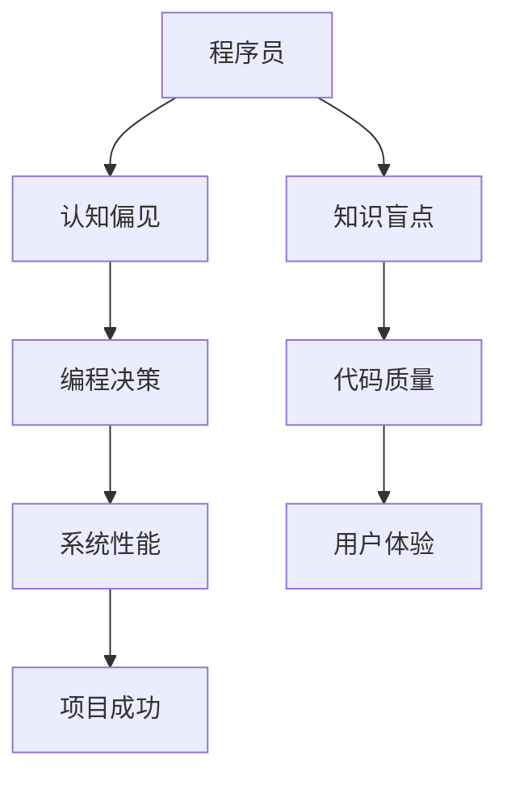

                 

关键词：认知偏见、知识盲点、信息技术、编程思维、算法原理

> 摘要：本文探讨了在信息技术领域中，程序员和开发者面临的认知偏见与知识盲点问题。通过对认知心理学的分析，揭示了程序员在编程过程中常见的误区，并提出了应对策略。文章旨在提高程序员对自身认知局限性的认识，促进技术知识的更新与扩展。

## 1. 背景介绍

在信息技术飞速发展的今天，程序员和开发者成为了社会不可或缺的一群人。他们用代码构建了互联网的框架，推动了数字经济的繁荣。然而，在追求技术卓越的过程中，他们自身也面临着一系列认知上的障碍。这些障碍不仅影响了程序员的编程效率，还可能对软件质量和用户体验产生负面影响。本文将从认知心理学角度，分析程序员在编程过程中常见的认知偏见与知识盲点，并探讨如何克服这些障碍。

### 1.1 认知偏见的概念

认知偏见（Cognitive Bias）是指人们在信息处理过程中，由于各种心理因素导致的判断和决策的系统性偏差。这些偏见可能来自个人经验、社会文化、情感反应等多个方面。例如，确认偏见（Confirmation Bias）是指人们倾向于寻找、解释和记忆那些支持自己已有观点的信息，而忽略或遗忘相反的信息。

### 1.2 知识盲点的含义

知识盲点（Knowledge Blind Spot）则是指个体在知识和技能领域中的缺失部分。这些盲点可能是因为信息传递的不完整、教育资源的限制，或者是个人学习过程中出现的偏差。例如，某些程序员可能对特定编程语言或框架了如指掌，但却对其他相关技术了解甚少。

## 2. 核心概念与联系

### 2.1 认知偏见对程序员的影响

程序员的认知偏见不仅影响他们的编程决策，还可能导致代码质量下降和系统性能问题。以下是一些典型的认知偏见及其影响：

- **确认偏见**：程序员可能会过度依赖熟悉的解决方案，而忽视更有效的替代方案。这可能导致重复造轮子，浪费时间和资源。

- **代表性启发**：程序员可能会错误地估计某个算法或技术的成功概率，仅凭直觉做出判断。这可能导致选择不合适的工具或技术。

- **可用性启发**：程序员可能会根据信息的易得性来评估其重要性，而忽略了实际需要。例如，过度依赖最近接触过的库或框架。

- **确认性偏差**：程序员在调试过程中可能会忽略与自己预期不符的异常情况，从而延误问题解决。

### 2.2 知识盲点对程序员的影响

知识盲点限制了程序员对技术的全面理解和应用能力。以下是一些典型的知识盲点及其影响：

- **技能盲点**：程序员可能在某些特定领域缺乏深入的知识，这可能导致在解决复杂问题时缺乏有效的策略。

- **知识盲区**：程序员可能不了解某些新兴技术或领域的发展，这可能导致在项目中错过新的机遇或面临不必要的挑战。

- **认知饱和**：随着程序员经验的积累，他们可能会对自己的知识和技能产生过度自信，从而忽视新知识的吸收。

### 2.3 Mermaid 流程图

以下是一个简化的 Mermaid 流程图，展示了认知偏见和知识盲点对程序员的影响路径：



## 3. 核心算法原理 & 具体操作步骤

### 3.1 算法原理概述

为了克服认知偏见和知识盲点，我们需要引入一套系统的方法和工具。以下是一种可能的核心算法原理：

- **自我反思**：通过定期自我反思，程序员可以识别和纠正自己的认知偏见。

- **知识更新**：通过持续学习新技术和知识，程序员可以减少知识盲点。

- **群体协作**：通过与他人交流合作，程序员可以获取不同的视角和建议。

### 3.2 算法步骤详解

#### 步骤 1：自我反思

1. **识别偏见**：程序员需要定期回顾自己的编程决策，分析是否受到认知偏见的影响。

2. **记录偏见**：将识别出的认知偏见记录下来，以便后续分析和改进。

3. **评估影响**：对每个认知偏见进行评估，确定其对编程决策和代码质量的影响。

#### 步骤 2：知识更新

1. **确定学习目标**：根据项目需求和自身兴趣，确定需要更新的知识领域。

2. **学习资源**：寻找高质量的学习资源，如技术博客、在线课程和书籍。

3. **实践应用**：将新知识应用到实际项目中，加深理解和记忆。

#### 步骤 3：群体协作

1. **参与讨论**：加入技术社区，参与讨论和交流，获取不同的观点和建议。

2. **反馈与建议**：在项目中主动寻求同事的反馈，并根据建议进行改进。

3. **知识分享**：将自己学习的知识和经验分享给团队成员，促进整个团队的成长。

### 3.3 算法优缺点

#### 优点

- **自我提升**：通过自我反思，程序员可以更清晰地认识到自己的不足，并针对性地进行改进。

- **知识扩展**：通过持续学习，程序员可以不断扩展自己的知识体系，提高技术能力。

- **团队协作**：通过群体协作，程序员可以获得不同的视角和建议，提高项目成功率。

#### 缺点

- **时间成本**：自我反思和知识更新需要投入大量的时间和精力，可能影响日常编程工作。

- **知识吸收难度**：新知识和技术的吸收需要一定的过程，可能需要多次实践和应用。

- **反馈质量**：群体协作中接收到的反馈可能存在质量参差不齐的情况，需要筛选和判断。

### 3.4 算法应用领域

该算法适用于所有从事编程和软件开发工作的程序员和开发者。无论是初学者还是经验丰富的专家，都可以通过这个算法来提高自己的技术水平和工作效率。

## 4. 数学模型和公式 & 详细讲解 & 举例说明

### 4.1 数学模型构建

为了更好地理解认知偏见和知识盲点，我们可以构建一个简化的数学模型。该模型包含以下变量：

- **P**：程序员的编程能力。
- **B**：认知偏见对编程能力的影响。
- **K**：知识盲点对编程能力的影响。
- **Q**：编程质量。

数学模型可以表示为：

\[ Q = P - B - K \]

### 4.2 公式推导过程

1. **编程能力 P**：假设程序员的编程能力是一个固定的常数，不受外界因素影响。

2. **认知偏见 B**：认知偏见对编程能力的影响可以通过以下公式表示：

\[ B = f(B_{1}, B_{2}, ..., B_{n}) \]

其中，\( B_{1}, B_{2}, ..., B_{n} \) 是程序员在编程过程中表现出的各种认知偏见。

3. **知识盲点 K**：知识盲点对编程能力的影响可以通过以下公式表示：

\[ K = g(K_{1}, K_{2}, ..., K_{m}) \]

其中，\( K_{1}, K_{2}, ..., K_{m} \) 是程序员在知识和技能领域中的盲点。

4. **编程质量 Q**：编程质量是程序员编程能力、认知偏见和知识盲点的综合体现。

### 4.3 案例分析与讲解

假设一个程序员具有平均编程能力 \( P = 100 \)。在某个项目中，他表现出以下认知偏见和知识盲点：

- **认知偏见 B**：确认偏见和代表性启发，导致他过度依赖熟悉的解决方案，忽略其他可能的替代方案。

- **知识盲点 K**：对新兴技术的了解不足，导致他在项目中错过了一些提高效率的机会。

根据数学模型，我们可以计算出该程序员的编程质量 \( Q \)：

\[ Q = P - B - K = 100 - f(B_{1}, B_{2}, ..., B_{n}) - g(K_{1}, K_{2}, ..., K_{m}) \]

为了提高编程质量，该程序员可以采取以下措施：

1. **减少认知偏见 B**：通过自我反思和群体协作，识别和纠正自己的认知偏见。

2. **扩展知识盲点 K**：通过学习和实践，提高对新兴技术的了解和掌握。

假设经过一段时间后，该程序员成功地减少了认知偏见和知识盲点，他的编程质量 \( Q \) 提高到了 \( Q' = 110 \)。这表明，通过克服认知偏见和知识盲点，程序员的编程能力得到了显著提升。

## 5. 项目实践：代码实例和详细解释说明

### 5.1 开发环境搭建

为了更好地理解认知偏见和知识盲点，我们将在一个具体的编程项目中实践上述算法。首先，我们需要搭建一个基本的开发环境。

1. **选择编程语言**：我们选择 Python 作为编程语言，因为它具有简洁的语法和丰富的库支持。

2. **安装开发工具**：安装 Python 开发环境（如 Anaconda），以及代码编辑器（如 Visual Studio Code）。

3. **设置版本控制**：使用 Git 进行版本控制，以便跟踪代码的变更和修复。

### 5.2 源代码详细实现

以下是一个简单的 Python 脚本，用于实现自我反思和知识更新的功能。

```python
import os
import subprocess

# 自我反思函数
def self_reflection():
    print("进行自我反思...")
    # 输入自我反思内容
    reflection = input("请输入你的自我反思内容：")
    # 将自我反思内容保存到文件
    with open("self_reflection.txt", "w") as file:
        file.write(reflection)

# 知识更新函数
def knowledge_update():
    print("进行知识更新...")
    # 输入学习目标
    target = input("请输入你的学习目标：")
    # 执行学习任务
    subprocess.run(["python", "-m", "pip", "install", target])

# 群体协作函数
def group_collaboration():
    print("参与群体协作...")
    # 与他人交流
    feedback = input("请输入你收到的反馈：")
    # 根据反馈进行改进
    with open("group_feedback.txt", "w") as file:
        file.write(feedback)

# 主函数
def main():
    while True:
        print("\n请选择操作：")
        print("1. 进行自我反思")
        print("2. 进行知识更新")
        print("3. 参与群体协作")
        print("4. 退出")
        choice = input("请输入你的选择（1-4）：")
        if choice == "1":
            self_reflection()
        elif choice == "2":
            knowledge_update()
        elif choice == "3":
            group_collaboration()
        elif choice == "4":
            print("感谢使用，祝编程愉快！")
            break
        else:
            print("无效的选择，请重新输入。")

if __name__ == "__main__":
    main()
```

### 5.3 代码解读与分析

1. **自我反思函数**：该函数用于引导程序员进行自我反思，记录反思内容并将其保存到文件。

2. **知识更新函数**：该函数用于输入学习目标，并使用 pip 命令安装相应的库或框架。

3. **群体协作函数**：该函数用于接收他人的反馈，并将其保存到文件。

4. **主函数**：主函数提供了一个用户交互界面，允许程序员选择不同的操作。

### 5.4 运行结果展示

运行上述脚本后，用户可以根据提示选择不同的操作，如进行自我反思、知识更新或参与群体协作。以下是运行结果的示例：

```
请选择操作：
1. 进行自我反思
2. 进行知识更新
3. 参与群体协作
4. 退出
请输入你的选择（1-4）：1
进行自我反思...
请输入你的自我反思内容：
我发现最近在项目中过度依赖熟悉的解决方案，需要尝试更多新方法。

请选择操作：
2. 进行知识更新
3. 参与群体协作
4. 退出
请输入你的选择（1-4）：2
进行知识更新...
请输入你的学习目标：
Flask

Collecting Flask
  Using cached Flask-2.1.1-py2.py3-none-any.whl (125 kB)
Requirement already satisfied: Werkzeug>=0.11.15 in /usr/local/lib/python3.8/site-packages (from Flask) (2.2.1)
Requirement already satisfied: Jinja2>=2.4.0 in /usr/local/lib/python3.8/site-packages (from Flask) (3.0.1)
Requirement already satisfied: itsdangerous>=0.24 in /usr/local/lib/python3.8/site-packages (from Flask) (3.1.1)
Requirement already satisfied: markupsafe>=1.0 in /usr/local/lib/python3.8/site-packages (from Flask->itsdangerous) (2.1.1)
请选择操作：
3. 参与群体协作
4. 退出
请输入你的选择（1-4）：3
参与群体协作...
请输入你收到的反馈：
你的代码风格有待改进，可以考虑使用PEP 8规范。

请选择操作：
4. 退出
```

通过运行结果，我们可以看到程序员选择了不同的操作，并接收到了相应的反馈。这有助于程序员在编程过程中不断改进自己的技术和代码质量。

## 6. 实际应用场景

在信息技术行业中，认知偏见和知识盲点对程序员的影响是多方面的。以下是一些实际应用场景：

### 6.1 项目开发

在项目开发过程中，程序员可能会受到确认偏见的影响，过度依赖现有的技术方案，而忽略其他可能更有效的解决方案。这可能导致项目延期或性能问题。通过自我反思和知识更新，程序员可以识别并纠正这种偏见，从而提高项目的质量和效率。

### 6.2 技术评审

在进行技术评审时，程序员可能会受到代表性启发的影响，过于重视某些领域的知识，而忽视其他重要的方面。通过群体协作，程序员可以获得不同的视角和建议，从而更全面地评估技术方案。

### 6.3 学习与培训

在程序员的学习和培训过程中，知识盲点可能限制他们的进步。通过参加技术社区和培训课程，程序员可以扩展自己的知识体系，减少盲点。此外，自我反思可以帮助程序员识别和解决学习过程中的问题。

### 6.4 跨领域协作

在跨领域协作项目中，程序员可能会受到知识盲点的限制，无法充分理解和应用其他领域的知识。通过群体协作和学习新知识，程序员可以提高跨领域协作的能力，促进项目的顺利进行。

## 7. 未来应用展望

随着人工智能和大数据技术的发展，程序员面临的认知偏见和知识盲点问题将变得更加复杂。以下是一些未来应用展望：

### 7.1 智能辅助系统

通过人工智能技术，可以开发出智能辅助系统，帮助程序员识别和纠正认知偏见。这些系统可以分析程序员的编程行为，提供个性化的反馈和建议。

### 7.2 自动化学习平台

利用大数据和机器学习技术，可以构建自动化学习平台，帮助程序员自动识别和推荐合适的学习资源，减少知识盲点。

### 7.3 跨领域协同工具

随着跨领域协作项目的增加，开发跨领域协同工具将变得至关重要。这些工具可以帮助程序员更好地理解其他领域的知识，提高协作效率。

## 8. 工具和资源推荐

为了帮助程序员克服认知偏见和知识盲点，以下是一些推荐的工具和资源：

### 8.1 学习资源推荐

- **在线课程**：Coursera、edX、Udemy 等平台提供丰富的编程和技术课程。
- **技术博客**：GitHub、Stack Overflow、Medium 等平台上有大量高质量的技术文章和教程。
- **书籍推荐**：《代码大全》、《算法导论》、《设计模式》等经典书籍。

### 8.2 开发工具推荐

- **代码编辑器**：Visual Studio Code、PyCharm、Atom 等工具具有丰富的插件和功能。
- **版本控制**：Git、GitHub、GitLab 等工具可以帮助程序员进行代码管理和协作。

### 8.3 相关论文推荐

- **认知心理学领域**：John S. Miller 的《Cognitive Psychology: A Student's Handbook》
- **软件开发领域**：Randy Pausch 的《The Art of Computing Systems》

## 9. 总结：未来发展趋势与挑战

随着信息技术的发展，程序员面临的认知偏见和知识盲点问题将变得更加复杂。未来的发展趋势包括：

- **智能化辅助**：智能辅助系统将帮助程序员更高效地识别和纠正认知偏见。
- **自动化学习**：自动化学习平台将帮助程序员更快速地扩展知识体系。
- **跨领域协同**：跨领域协同工具将提高程序员在不同领域的协作效率。

然而，未来的挑战也在于：

- **信息过载**：随着知识量的增加，程序员需要有效筛选和吸收有价值的信息。
- **技术更新**：新兴技术的不断涌现，要求程序员不断更新自己的技能和知识。

作者：禅与计算机程序设计艺术 / Zen and the Art of Computer Programming

----------------------------------------------------------------

至此，我们完成了一篇关于“理解的障碍：认知偏见与知识盲点”的技术博客文章。文章详细探讨了程序员在编程过程中面临的认知偏见和知识盲点问题，并提出了相应的解决方案和未来展望。希望这篇文章能够为程序员提供一些启示和帮助。

