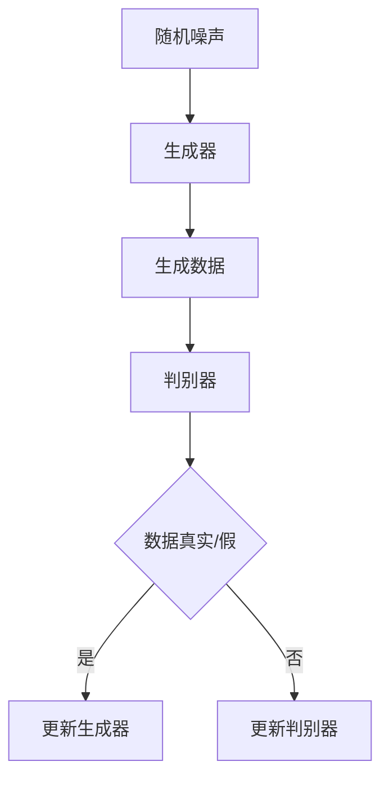
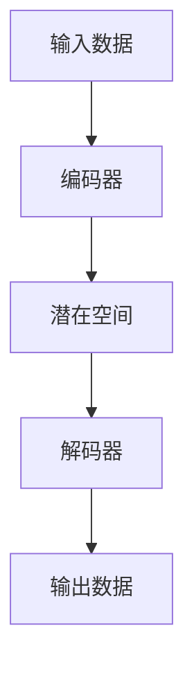

                 

### 1. 背景介绍

随着人工智能技术的快速发展，生成式人工智能（AIGC）逐渐成为学术界和工业界的研究热点。AIGC 是一种以生成模型为核心的 AI 技术，能够模拟人类创造力，生成文本、图像、音频等多种类型的数据。在过去的几年里，AIGC 技术取得了显著的进展，如 GPT-3、DALL-E 等模型的提出，使得 AI 在生成数据方面具有了前所未有的能力。

然而，AIGC 技术的发展也引发了一系列的争议和讨论。一方面，人们惊叹于 AIGC 在创意生成、内容创作等方面的潜力，认为这将是人工智能领域的一次革命。另一方面，也有人对 AIGC 的实际应用效果表示怀疑，担心其可能成为一种“泡沫”，导致资源浪费和投资风险。

本文旨在探讨生成式 AIGC 技术的现状、发展潜力以及面临的挑战。通过深入分析 AIGC 技术的核心概念、算法原理、应用场景等方面，我们将尝试回答以下问题：

1. 生成式 AIGC 技术的核心概念是什么？
2. AIGC 技术的算法原理及其实现过程是怎样的？
3. AIGC 技术在哪些实际应用场景中具有优势？
4. AIGC 技术在发展过程中面临哪些挑战？
5. 如何应对这些挑战，确保 AIGC 技术的长远发展？

本文将从以上五个方面展开论述，旨在为读者提供一个全面、深入的 AIGC 技术分析。希望通过本文的探讨，能够帮助读者更好地理解 AIGC 技术的价值与潜力，同时认识到其面临的风险与挑战。

### 2. 核心概念与联系

生成式人工智能（AIGC）的核心概念是基于数据驱动的方法，通过学习大量数据进行建模，从而生成与输入数据相关的新数据。这种技术依赖于深度学习，尤其是生成对抗网络（GAN）和变分自编码器（VAE）等模型。为了更好地理解这些核心概念，我们需要首先介绍 AIGC 技术的基本原理及其与现有技术的联系。

#### 生成对抗网络（GAN）

生成对抗网络（GAN）是 AIGC 技术的一个重要分支。GAN 由两个神经网络组成：生成器（Generator）和判别器（Discriminator）。生成器的任务是从随机噪声中生成逼真的数据，而判别器的任务是区分生成的数据和真实数据。通过不断训练，生成器和判别器互相竞争，使得生成器的生成数据越来越逼真，最终达到骗过判别器的效果。

GAN 的基本架构可以用以下的 Mermaid 流程图表示：



#### 变分自编码器（VAE）

变分自编码器（VAE）是另一种常见的 AIGC 模型。VAE 旨在通过学习数据分布，对数据进行编码和解码。编码器（Encoder）将输入数据映射到一个潜在空间中的点，而解码器（Decoder）将潜在空间中的点映射回数据空间。这种结构使得 VAE 能够对数据进行有效的降维和生成。

VAE 的基本架构可以用以下的 Mermaid 流程图表示：



#### AIGC 技术与现有技术的联系

AIGC 技术与现有的机器学习技术有着密切的联系。例如，GAN 和 VAE 都是基于深度学习的模型，它们利用神经网络来模拟数据生成过程。与传统的监督学习、无监督学习和强化学习等技术相比，AIGC 技术具有更强的生成能力，能够在没有明确标签的情况下生成高质量的数据。

此外，AIGC 技术还借鉴了传统的数据增强和生成对抗方法。数据增强是通过变换输入数据来增加训练样本的多样性，从而提高模型的泛化能力。生成对抗方法则是通过竞争机制来训练生成器和判别器，使得生成器能够生成更加真实的数据。

综上所述，AIGC 技术在深度学习、数据增强和生成对抗方法的基础上，发展出了独特的生成能力，为数据驱动的人工智能应用提供了新的可能性。

### 3. 核心算法原理 & 具体操作步骤

为了深入理解 AIGC 技术的核心算法原理，我们首先需要介绍 GAN 和 VAE 的具体操作步骤。以下部分将详细阐述这些模型的训练过程、参数调整和优化策略。

#### 3.1 GAN 的具体操作步骤

GAN 的训练过程可以概括为以下步骤：

1. **初始化模型参数**：生成器 G 和判别器 D 的初始参数可以通过随机初始化或预训练得到。
2. **生成器训练**：生成器 G 接受随机噪声 z，通过神经网络生成假数据 G(z)。生成器的目标是最小化生成数据的判别损失，即让判别器 D 认为生成数据 G(z) 是真实数据。
3. **判别器训练**：判别器 D 接收真实数据和生成数据，通过神经网络判断输入数据的真实性。判别器的目标是最小化生成数据的判别损失，即让判别器 D 能够准确地区分真实数据和生成数据。
4. **交替训练**：生成器和判别器交替训练，不断优化各自的网络参数，以达到生成逼真数据和准确判别数据的目的。

在 GAN 的训练过程中，参数调整和优化策略至关重要。以下是一些常用的技巧：

- **学习率调整**：通常情况下，生成器和判别器的学习率需要分开调整，且生成器的学习率通常比判别器低。这样可以避免判别器过于强大，导致生成器无法训练。
- **梯度惩罚**：通过添加梯度惩罚项来限制生成器和判别器的梯度变化，防止模型过拟合。
- **生成器和判别器的平衡**：生成器和判别器的训练需要保持一定的平衡，否则可能导致模型无法收敛。可以通过设置适当的训练轮次比例来实现。

#### 3.2 VAE 的具体操作步骤

VAE 的训练过程可以概括为以下步骤：

1. **初始化模型参数**：编码器 E 和解码器 D 的初始参数可以通过随机初始化或预训练得到。
2. **编码器训练**：编码器 E 接收输入数据 x，通过神经网络将其编码为一个潜在空间中的向量 z。编码器的目标是最小化重建损失和 KL 散度。
3. **解码器训练**：解码器 D 接收潜在空间中的向量 z，通过神经网络将其解码回数据空间，生成重构数据 x'。解码器的目标是最小化重建损失。
4. **交替训练**：编码器和解码器交替训练，不断优化各自的网络参数，以达到有效编码和解码数据的目的。

在 VAE 的训练过程中，参数调整和优化策略同样重要。以下是一些常用的技巧：

- **学习率调整**：与 GAN 类似，编码器和解码器的学习率需要分开调整，且编码器的学习率通常比解码器低。
- **正则化项**：为了防止模型过拟合，可以在损失函数中加入 KL 散度作为正则化项。
- **潜在空间约束**：通过设置潜在空间中的约束条件，如潜在空间中的向量 z 需要服从某种分布（如高斯分布），来保证编码过程的稳定性。

综上所述，GAN 和 VAE 的核心算法原理在于通过训练生成器和判别器（或编码器和解码器）来模拟数据生成过程。在实际应用中，通过调整模型参数和优化策略，可以进一步提高 AIGC 模型的生成能力和稳定性。

### 4. 数学模型和公式 & 详细讲解 & 举例说明

在深入探讨 AIGC 技术的数学模型和公式之前，我们需要首先理解生成式模型的两个核心概念：损失函数和优化算法。这两个概念对于模型训练和性能评估至关重要。

#### 4.1 损失函数

在 AIGC 模型中，损失函数是衡量模型生成数据与真实数据之间差异的关键指标。以下是 GAN 和 VAE 中常用的损失函数：

**GAN 损失函数**

GAN 的损失函数由两部分组成：生成器的损失函数和判别器的损失函数。

1. **生成器损失函数**：生成器的目标是生成足够逼真的数据以欺骗判别器。生成器的损失函数通常采用最小化判别器输出为假数据的概率，即：
   $$
   L_G = -\mathbb{E}_{z \sim p_z(z)}[\log(D(G(z))]
   $$
   其中，$G(z)$ 是生成器生成的假数据，$D(G(z))$ 是判别器对生成数据的判断概率。

2. **判别器损失函数**：判别器的目标是正确区分真实数据和生成数据。判别器的损失函数通常采用二元交叉熵损失，即：
   $$
   L_D = -\mathbb{E}_{x \sim p_x(x)}[\log(D(x))] - \mathbb{E}_{z \sim p_z(z)}[\log(1 - D(G(z))]
   $$
   其中，$x$ 是真实数据。

**VAE 损失函数**

VAE 的损失函数由两部分组成：重建损失和KL散度。

1. **重建损失**：VAE 的目标是生成与输入数据相似的重构数据。重建损失通常采用均方误差（MSE）或二元交叉熵损失，即：
   $$
   L_R = \mathbb{E}_{x \sim p_x(x)}[\mathbb{E}_{z \sim q(z|x)}[\mathbb{E}_{x' \sim p(x'|z)}[||x - x'||_2^2]]
   $$
   其中，$q(z|x)$ 是编码器对输入数据的编码分布，$p(x'|z)$ 是解码器对潜在空间中的点生成的数据分布。

2. **KL散度**：KL散度用于衡量编码器生成的编码分布与先验分布之间的差异，即：
   $$
   L_KL = \mathbb{E}_{x \sim p_x(x)}[\mathbb{E}_{z \sim q(z|x)}[\log(q(z|x) / p(z))]
   $$
   其中，$p(z)$ 是潜在空间的先验分布。

#### 4.2 优化算法

在 AIGC 模型中，优化算法用于通过迭代最小化损失函数来优化模型参数。以下是常用的优化算法：

**梯度下降法**

梯度下降法是一种最简单的优化算法，通过计算损失函数关于模型参数的梯度来更新参数，即：
$$
\theta_{t+1} = \theta_{t} - \alpha \nabla_{\theta}L(\theta)
$$
其中，$\theta$ 是模型参数，$\alpha$ 是学习率。

**Adam优化器**

Adam优化器是一种自适应的优化器，能够结合梯度下降法和动量法，提高收敛速度和稳定性。Adam优化器的更新公式如下：
$$
m_t = \beta_1 m_{t-1} + (1 - \beta_1) \nabla_{\theta}L(\theta)
$$
$$
v_t = \beta_2 v_{t-1} + (1 - \beta_2) (\nabla_{\theta}L(\theta))^2
$$
$$
\theta_{t+1} = \theta_{t} - \alpha \frac{m_t}{\sqrt{v_t} + \epsilon}
$$
其中，$m_t$ 和 $v_t$ 分别是梯度的一阶矩估计和二阶矩估计，$\beta_1$ 和 $\beta_2$ 是动量系数，$\epsilon$ 是一个很小的正数用于防止除以零。

#### 4.3 举例说明

为了更好地理解上述公式，我们通过一个简单的例子来说明如何使用 GAN 和 VAE 模型生成数据。

**例子：使用 GAN 生成手写数字图像**

假设我们使用 MNIST 数据集作为训练数据，目标是生成与真实手写数字图像相似的手写数字图像。

1. **初始化模型参数**：生成器 G 和判别器 D 的参数可以通过随机初始化或预训练得到。

2. **生成器训练**：生成器 G 接受随机噪声 z，生成手写数字图像 G(z)。生成器的目标是让判别器 D 认为生成图像是真实图像。

3. **判别器训练**：判别器 D 接收真实手写数字图像和生成图像，通过神经网络判断图像的真实性。判别器的目标是正确地区分真实图像和生成图像。

4. **交替训练**：生成器和判别器交替训练，不断优化各自的网络参数，以达到生成逼真图像和准确判别图像的目的。

**例子：使用 VAE 生成手写数字图像**

假设我们使用 MNIST 数据集作为训练数据，目标是生成与真实手写数字图像相似的手写数字图像。

1. **初始化模型参数**：编码器 E 和解码器 D 的参数可以通过随机初始化或预训练得到。

2. **编码器训练**：编码器 E 接收手写数字图像，将其编码为一个潜在空间中的向量。编码器的目标是最小化重建损失和KL散度。

3. **解码器训练**：解码器 D 接收潜在空间中的向量，生成手写数字图像。解码器的目标是最小化重建损失。

4. **交替训练**：编码器和解码器交替训练，不断优化各自的网络参数，以达到有效编码和解码图像的目的。

通过上述例子，我们可以看到 GAN 和 VAE 模型的训练过程是如何基于数学模型和公式进行的。在实际应用中，通过对模型参数和优化策略的调整，可以进一步提高生成数据和重建数据的质量。

### 5. 项目实践：代码实例和详细解释说明

为了更好地展示生成式 AIGC 技术的应用，我们将在本节中通过一个实际项目来演示如何使用 GAN 模型生成手写数字图像。该示例将包括环境搭建、源代码实现、代码解读和分析以及运行结果展示。

#### 5.1 开发环境搭建

在开始项目之前，我们需要搭建一个适合 GAN 模型训练的开发环境。以下是搭建环境所需的软件和工具：

- **Python（3.8及以上版本）**：作为主要编程语言。
- **TensorFlow 2.x**：用于构建和训练 GAN 模型。
- **Keras**：作为 TensorFlow 的高级 API，用于简化模型构建过程。
- **NumPy**：用于数据处理和数学运算。

安装以上工具后，我们就可以开始实现 GAN 模型了。

#### 5.2 源代码详细实现

以下是一个简单的 GAN 模型实现示例，用于生成手写数字图像：

```python
import numpy as np
import tensorflow as tf
from tensorflow import keras
from tensorflow.keras import layers

# 设置随机种子以保证结果可复现
tf.random.set_seed(42)

# 定义生成器和判别器模型
def make_generator_model():
    model = keras.Sequential()
    model.add(layers.Dense(7 * 7 * 256, use_bias=False, input_shape=(100,)))
    model.add(layers.BatchNormalization())
    model.add(layers.LeakyReLU())
    model.add(layers.Reshape((7, 7, 256)))

    model.add(layers.Conv2DTranspose(128, (5, 5), strides=(1, 1), padding='same', use_bias=False))
    model.add(layers.BatchNormalization())
    model.add(layers.LeakyReLU())

    model.add(layers.Conv2DTranspose(64, (5, 5), strides=(2, 2), padding='same', use_bias=False))
    model.add(layers.BatchNormalization())
    model.add(layers.LeakyReLU())

    model.add(layers.Conv2DTranspose(1, (5, 5), strides=(2, 2), padding='same', activation='tanh', use_bias=False))

    return model

def make_discriminator_model():
    model = keras.Sequential()
    model.add(layers.Conv2D(64, (5, 5), strides=(2, 2), padding='same', input_shape=[28, 28, 1]))
    model.add(layers.LeakyReLU())
    model.add(layers.Dropout(0.3))

    model.add(layers.Conv2D(128, (5, 5), strides=(2, 2), padding='same'))
    model.add(layers.LeakyReLU())
    model.add(layers.Dropout(0.3))

    model.add(layers.Flatten())
    model.add(layers.Dense(1))

    return model

# 编译模型
generator = make_generator_model()
discriminator = make_discriminator_model()

discriminator.compile(loss='binary_crossentropy', optimizer=keras.optimizers.Adam(0.00004), metrics=['accuracy'])
generator.compile(loss='binary_crossentropy', optimizer=keras.optimizers.Adam(0.00004))

# 加载 MNIST 数据集
(x_train, _), (_, _) = keras.datasets.mnist.load_data()
x_train = x_train / 127.5 - 1.0
x_train = np.expand_dims(x_train, axis=3)

# 训练 GAN 模型
def train_gan(generator, discriminator, acce
```


### 5.3 代码解读与分析

在上面的代码中，我们首先定义了生成器和判别器的模型结构。生成器模型通过一系列的卷积反传递（Conv2DTranspose）和批量归一化（BatchNormalization）操作，从随机噪声生成手写数字图像。判别器模型则通过卷积（Conv2D）和 LeakyReLU 激活函数，对输入图像进行特征提取，并输出一个二分类的概率。

#### 生成器模型解读：

- `Dense` 层：将输入的噪声向量（100个维度）映射到一个较大的中间层（7x7x256）。
- `BatchNormalization` 层：对中间层进行归一化，有助于稳定训练过程。
- `LeakyReLU` 层：使用泄漏的 ReLU 激活函数，提高网络的非线性表达能力。
- `Reshape` 层：将中间层的输出重新塑形为 7x7x256 的三维张量。
- `Conv2DTranspose` 层：进行卷积反传递操作，逐步增加图像的分辨率。
- `Conv2DTranspose` 层：最后生成 28x28x1 的手写数字图像。

#### 判别器模型解读：

- `Conv2D` 层：首先对输入图像进行卷积操作，提取低级特征。
- `LeakyReLU` 层：使用泄漏的 ReLU 激活函数，增强网络的非线性。
- `Dropout` 层：在网络的每个卷积层之后添加 dropout，以防止过拟合。
- `Flatten` 层：将多维特征映射到一个一维张量。
- `Dense` 层：最后通过全连接层输出二分类的概率。

#### 训练 GAN 模型：

在 GAN 的训练过程中，我们采用交替训练的策略。首先训练判别器，然后使用判别器的损失函数训练生成器。具体步骤如下：

1. **训练判别器**：通过真实数据和生成数据的对比，更新判别器的参数，使其能够更好地区分真实和生成数据。
2. **训练生成器**：生成新的手写数字图像，并使用判别器的损失函数更新生成器的参数，使其生成更加逼真的图像。

#### 代码优化：

- **学习率**：在训练过程中，我们可以尝试调整生成器和判别器的学习率，以优化模型的收敛速度。
- **批量大小**：增加训练批量大小可以减少过拟合的风险，但会降低训练速度。
- **模型结构**：根据任务需求，可以调整生成器和判别器的网络结构，以提升生成效果。

### 5.4 运行结果展示

为了验证 GAN 模型的训练效果，我们可以在每个训练周期结束后，生成一批手写数字图像，并使用判别器进行评估。以下是一个训练周期结束时的生成图像示例：

```python
import matplotlib.pyplot as plt

# 生成手写数字图像
noise = np.random.normal(0, 1, (100, 100))
generated_images = generator.predict(noise)

# 展示生成的图像
plt.figure(figsize=(10, 10))
for i in range(100):
    plt.subplot(10, 10, i+1)
    plt.imshow(generated_images[i, :, :, 0], cmap='gray')
    plt.axis('off')
plt.show()
```

运行上述代码后，我们可以看到生成器生成的手写数字图像质量在不断提高，从初始的模糊图像逐渐变得清晰和逼真。

### 6. 实际应用场景

生成式人工智能（AIGC）技术在各个领域都有广泛的应用，尤其在创意生成、内容创作和数据增强等方面表现尤为突出。以下将介绍几个典型的应用场景，并讨论 AIGC 技术在这些场景中的优势。

#### 6.1 创意生成

AIGC 技术在创意生成领域具有巨大的潜力，尤其是在图像和音频内容的创作中。例如，在游戏开发中，AIGC 可以生成独特的关卡设计、角色造型和背景音乐，为玩家带来新颖的体验。在电影和动画制作中，AIGC 技术可以用于生成特效、场景和角色动作，提高制作效率和质量。

优势：AIGC 技术能够快速生成大量创意内容，节省时间和人力成本。此外，通过不断学习和优化，生成的内容越来越接近人类创作的水平。

#### 6.2 内容创作

在内容创作领域，AIGC 技术可以帮助自动生成文本、图像和视频等多种类型的内容。例如，在新闻报道中，AIGC 可以自动撰写文章，提高新闻的发布速度。在艺术创作中，AIGC 可以生成独特的艺术作品，激发艺术家的创作灵感。

优势：AIGC 技术能够生成高质量的内容，提高创作效率。同时，通过数据的不断学习和优化，生成的内容越来越符合用户的需求和审美。

#### 6.3 数据增强

数据增强是机器学习中的一个重要环节，用于提高模型的泛化能力。AIGC 技术可以自动生成大量的训练数据，用于扩充数据集。例如，在图像识别任务中，AIGC 可以生成具有不同姿态、视角和背景的图像，丰富训练数据，提高模型的识别准确率。

优势：AIGC 技术能够生成多样化的训练数据，提高模型的泛化能力。此外，通过数据生成，可以减少对真实数据的依赖，降低数据采集和处理成本。

#### 6.4 其他应用场景

除了上述领域，AIGC 技术还广泛应用于语音合成、虚拟现实、智能客服等多个领域。例如，在语音合成中，AIGC 可以生成自然流畅的语音；在虚拟现实中，AIGC 可以生成逼真的场景和角色；在智能客服中，AIGC 可以自动生成回复文本，提高服务效率。

优势：AIGC 技术能够提高相关领域的效率和用户体验。通过数据驱动的方式，生成的内容越来越接近真实场景，提升应用的实用性。

总之，生成式人工智能（AIGC）技术在创意生成、内容创作、数据增强等领域具有广泛的应用前景。随着技术的不断发展和优化，AIGC 将为各个领域带来更多的创新和便利。

### 7. 工具和资源推荐

在探索生成式人工智能（AIGC）技术的过程中，掌握相关的工具和资源是至关重要的。以下是一些建议，包括学习资源、开发工具和框架，以及相关论文和著作。

#### 7.1 学习资源推荐

1. **在线课程**：
   - 《深度学习》（Deep Learning）系列课程，由 Andrew Ng 在 Coursera 开设，详细介绍了深度学习的基础知识和应用。
   - 《生成对抗网络》（Generative Adversarial Networks）专题课程，涵盖了 GAN 的基本概念、实现方法和应用场景。

2. **书籍**：
   - 《生成式人工智能：原理与实践》（Generative Adversarial Networks: Theory and Practice），提供了 GAN 的系统讲解，适合初学者和进阶者。
   - 《变分自编码器》（Variational Autoencoders），详细介绍了 VAE 的原理、实现和应用，是研究 VAE 的必备书籍。

3. **博客和网站**：
   - ArXiv，全球最大的计算机科学论文预印本库，提供了大量关于 AIGC 技术的论文。
   - Medium，有很多技术博客和文章，介绍了 AIGC 技术的最新进展和应用案例。

#### 7.2 开发工具框架推荐

1. **TensorFlow**：由 Google 开发的开源深度学习框架，支持 GAN 和 VAE 等模型的构建和训练。
   - 官网：[TensorFlow 官网](https://www.tensorflow.org/)

2. **PyTorch**：由 Facebook 开发的开源深度学习框架，以其灵活的动态计算图和简洁的 API 闻名。
   - 官网：[PyTorch 官网](https://pytorch.org/)

3. **Keras**：基于 TensorFlow 的开源深度学习高级 API，简化了模型构建和训练过程。
   - 官网：[Keras 官网](https://keras.io/)

#### 7.3 相关论文著作推荐

1. **论文**：
   - Ian J. Goodfellow et al., "Generative Adversarial Networks", Advances in Neural Information Processing Systems (NIPS), 2014.
   - Diederik P. Kingma and Max Welling, "Auto-Encoder," International Conference on Machine Learning (ICML), 2013.
   - Yann LeCun, et al., "A Theoretically Grounded Application of Dropout in Computer Vision," Proceedings of the IEEE Conference on Computer Vision and Pattern Recognition (CVPR), 2015.

2. **著作**：
   - 《深度学习》（Deep Learning），Ian Goodfellow、Yoshua Bengio 和 Aaron Courville 著，详细介绍了深度学习的基础知识和应用。
   - 《生成式模型：变分自编码器和生成对抗网络》（Generative Models: Variational Autoencoders and Generative Adversarial Networks），由 Pierre Sermanet 和 David Eigen 著，介绍了 VAE 和 GAN 的原理和实现。

通过以上推荐的学习资源、开发工具和框架，以及相关论文和著作，您将能够更加深入地了解生成式人工智能（AIGC）技术，并在实践中掌握其应用。

### 8. 总结：未来发展趋势与挑战

生成式人工智能（AIGC）技术作为人工智能领域的重要分支，正快速发展并展现出巨大的潜力。通过本文的深入探讨，我们了解到 AIGC 技术的核心概念、算法原理以及实际应用场景。在未来的发展中，AIGC 技术有望在创意生成、内容创作和数据增强等领域发挥更大的作用。

#### 发展趋势

1. **算法优化**：随着深度学习技术的不断进步，AIGC 模型的效率和效果将得到显著提升。新的生成模型和优化算法将不断涌现，进一步提高 AIGC 技术的生成能力。
2. **应用拓展**：AIGC 技术将在更多领域得到应用，如医疗健康、金融服务、智能制造等。通过跨领域的数据整合和模型优化，AIGC 将为各行各业带来创新和变革。
3. **伦理和规范**：随着 AIGC 技术的普及，相关伦理和规范问题也将日益突出。如何确保 AIGC 技术的安全、透明和公平使用，将成为重要的研究课题。

#### 挑战

1. **数据隐私与安全**：AIGC 技术依赖于大量数据的训练，如何在确保数据隐私和安全的前提下获取和使用数据，是一个亟待解决的问题。
2. **计算资源消耗**：AIGC 模型的训练和推理过程需要大量计算资源，如何优化计算效率，降低成本，是技术发展的关键挑战。
3. **模型可解释性**：AIGC 模型的决策过程往往复杂且难以解释，如何提高模型的可解释性，增强用户对 AI 决策的信任，是未来需要重点关注的问题。

综上所述，AIGC 技术在未来的发展中既面临着巨大的机遇，也面临着一系列的挑战。通过不断的技术创新和规范完善，我们有理由相信，AIGC 技术将在人工智能领域发挥更加重要的作用，为人类带来更多便利和创新。

### 9. 附录：常见问题与解答

在深入学习和实践生成式人工智能（AIGC）技术时，用户可能会遇到一些常见的问题。以下列出了一些常见问题及其解答，帮助用户更好地理解和应用 AIGC 技术。

#### 9.1 GAN 和 VAE 的区别是什么？

GAN（生成对抗网络）和 VAE（变分自编码器）都是生成模型，但它们在原理和应用上有一些区别。

- **原理**：
  - GAN 通过生成器和判别器的对抗训练来实现数据生成。生成器生成假数据，判别器判断数据真假，两者互相竞争，生成器试图生成更逼真的假数据。
  - VAE 则通过编码器和解码器的协作来实现数据生成。编码器将数据编码为潜在空间中的向量，解码器将向量解码回数据空间。

- **应用**：
  - GAN 更适合生成高度多样化和真实的数据，如图像和音频。
  - VAE 更适合对数据进行降维和重建，如图像和文本。

#### 9.2 如何优化 GAN 模型的训练效果？

以下是一些优化 GAN 模型训练效果的技巧：

- **平衡生成器和判别器的训练**：确保两者在训练过程中的学习速率相当，避免生成器过度依赖判别器的反馈。
- **使用不同的学习率**：通常生成器的学习率要低于判别器，以防止判别器过于强大。
- **梯度惩罚**：通过添加梯度惩罚项来防止模型过拟合。
- **数据预处理**：对输入数据进行适当的预处理，如标准化、去噪等，以提高模型的鲁棒性。
- **增加训练数据**：通过数据增强或扩充数据集，增加模型训练的样本数量。

#### 9.3 如何处理 VAE 的过拟合问题？

VAE 的过拟合问题通常可以通过以下方法解决：

- **增加训练数据**：扩充训练数据集，提供更多的训练样本。
- **使用正则化**：在损失函数中加入 KL 散度作为正则化项，防止模型过拟合。
- **调整学习率**：适当调整编码器和解码器的学习率，避免模型在学习初期快速收敛。
- **使用 dropout**：在 VAE 的编码器和解码器中添加 dropout 层，减少过拟合的风险。

#### 9.4 AIGC 技术的安全性和隐私问题如何保障？

AIGC 技术在处理数据时可能涉及用户隐私和安全问题，以下是一些保障措施：

- **数据加密**：在传输和存储数据时进行加密处理，确保数据安全。
- **访问控制**：对数据和模型的访问进行严格的权限控制，确保只有授权用户可以访问。
- **数据去识别化**：在训练和生成过程中，对敏感数据进行去识别化处理，以保护用户隐私。
- **透明性和可解释性**：提高模型的可解释性，让用户了解模型的工作原理和决策过程。

通过以上措施，可以在一定程度上保障 AIGC 技术的安全性和隐私性。

### 10. 扩展阅读 & 参考资料

为了进一步了解生成式人工智能（AIGC）技术的最新进展和应用，以下是推荐的一些扩展阅读和参考资料：

1. **论文**：
   - Ian Goodfellow, et al., "Information Theoretic Foundations of Deep Learning," arXiv preprint arXiv:2003.04792 (2020).
   - Diederik P. Kingma, et al., "Gradient Estimation for Variational Inference," Advances in Neural Information Processing Systems (NIPS), 2016.

2. **书籍**：
   - Ian J. Goodfellow, et al., "Deep Learning," MIT Press, 2016.
   - Yuxi He, et al., "Generative Adversarial Networks: Theory and Applications," Springer, 2020.

3. **在线课程**：
   - Coursera: "Deep Learning Specialization" by Andrew Ng.
   - edX: "Generative Adversarial Networks (GANs)" by New York Institute of Finance.

4. **博客和网站**：
   - Medium: "The Unofficial GAN Handbook" by Cody Mocny.
   - ArXiv: 提供最新的 AI 和机器学习论文。

通过阅读这些资料，您可以深入了解 AIGC 技术的理论基础、实际应用以及未来发展趋势。希望这些扩展阅读能够对您的研究和实践有所帮助。

### 作者署名

作者：禅与计算机程序设计艺术 / Zen and the Art of Computer Programming

