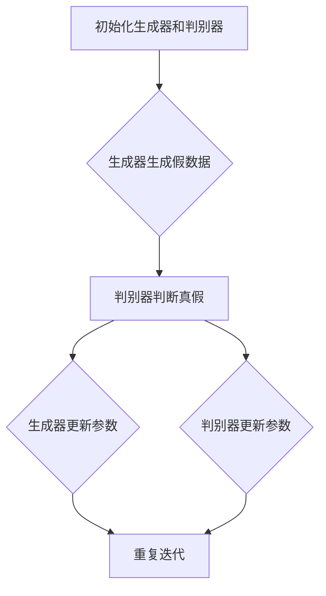

                 

### 背景介绍 Background

随着人工智能技术的迅猛发展，生成式AI（Generative AI）成为了一个备受关注的研究方向。从早期的规则驱动型AI到基于统计模型的AI，再到如今深度学习驱动的生成式AI，技术的演进不断推动着AI在各个领域的应用。

生成式AI（Generative AI）是指能够根据已有数据生成新数据的人工智能系统。与判别式AI（Discriminative AI）不同，后者主要目标是分类和预测，生成式AI则更加侧重于数据的生成。生成式AI的核心技术包括生成对抗网络（GAN）、变分自编码器（VAE）和自回归模型等。

AIGC（AI-Generated Content）是指通过人工智能技术自动生成内容的过程。AIGC的应用场景非常广泛，包括但不限于图像生成、文本生成、音乐生成等。随着生成式AI技术的不断发展，AIGC在商业化路径上展现出巨大的潜力。

在商业化的过程中，生成式AI和AIGC面临一系列挑战，例如技术成熟度、数据隐私、法律法规等。同时，随着技术的不断进步，AIGC在商业领域的应用场景也在不断扩展，从内容创作、个性化推荐到智能客服等。

本文旨在探讨生成式AIGC在商业化的路径，分析其技术原理、应用场景、面临的挑战以及未来发展趋势。文章将首先介绍生成式AI和AIGC的基本概念，然后深入探讨其核心算法原理，接着分析实际应用场景，最后总结未来发展趋势和面临的挑战。

### 2. 核心概念与联系 Core Concepts and Relationships

为了更好地理解生成式AIGC的原理和应用，我们需要先介绍几个核心概念：生成式AI、判别式AI、生成对抗网络（GAN）、变分自编码器（VAE）和自回归模型。

#### 2.1 生成式AI vs 判别式AI

生成式AI（Generative AI）和判别式AI（Discriminative AI）是人工智能领域的两种主要范式。

生成式AI的目标是生成新的数据，使生成数据尽可能地接近真实数据。生成式模型通过学习真实数据的分布来生成新的数据。常见的生成式模型包括生成对抗网络（GAN）和变分自编码器（VAE）。

判别式AI的目标是区分不同的数据类别。判别式模型通过学习真实数据和噪声数据的分布差异来实现分类。常见的判别式模型包括支持向量机（SVM）、神经网络等。

#### 2.2 生成对抗网络（GAN）

生成对抗网络（GAN）是生成式AI的一个重要组成部分。GAN由两部分组成：生成器（Generator）和判别器（Discriminator）。

生成器（Generator）的目标是生成与真实数据分布相似的假数据。判别器（Discriminator）的目标是区分输入数据是真实数据还是生成器生成的假数据。在训练过程中，生成器和判别器相互对抗，生成器不断尝试生成更真实的数据，而判别器则不断尝试区分真实数据和假数据。

GAN的核心优势在于其无需标注数据，生成器和判别器的对抗训练使得生成数据的质量得到显著提升。GAN的应用场景包括图像生成、图像修复、图像到图像的转换等。

#### 2.3 变分自编码器（VAE）

变分自编码器（VAE）是一种基于概率的生成模型。VAE由编码器（Encoder）和解码器（Decoder）组成。编码器将输入数据映射到一个潜在空间，解码器从潜在空间中采样并重构输入数据。

VAE的核心优势在于其能够生成具有多样性的数据，且生成数据的质量较高。VAE在图像生成、文本生成和语音合成等领域有广泛的应用。

#### 2.4 自回归模型

自回归模型（Autoregressive Model）是一种生成式模型，其基本思想是利用已生成的部分数据来预测下一个数据。常见的自回归模型包括自回归神经网络（ARNN）和变换器（Transformer）。

自回归模型在文本生成、音乐生成和视频生成等领域表现出色。自回归模型的优势在于其能够生成连贯、流畅的数据序列。

#### 2.5 核心概念与联系

生成式AI、判别式AI、GAN、VAE和自回归模型是AIGC的核心技术。生成式AI和判别式AI是人工智能领域的两大范式，GAN、VAE和自回归模型是生成式AI的主要实现方式。

生成对抗网络（GAN）通过生成器和判别器的对抗训练生成高质量的数据。变分自编码器（VAE）通过编码器和解码器生成具有多样性的数据。自回归模型通过预测下一个数据生成连贯、流畅的数据序列。

这些核心概念和技术的相互关联构成了AIGC的基础。通过深入理解这些概念和技术，我们可以更好地把握AIGC的发展趋势和应用方向。

#### 2.6 Mermaid 流程图

以下是一个简化的生成对抗网络（GAN）的Mermaid流程图，展示了生成器和判别器在训练过程中的交互：



这个流程图清晰地展示了生成器和判别器在对抗训练中的基本流程，为我们理解GAN的工作原理提供了直观的视觉帮助。

### 3. 核心算法原理 & 具体操作步骤 Core Algorithm Principle & Operational Steps

在了解了生成式AI和AIGC的核心概念后，接下来我们将深入探讨生成对抗网络（GAN）和变分自编码器（VAE）的核心算法原理，并详细描述它们的具体操作步骤。

#### 3.1 生成对抗网络（GAN）

生成对抗网络（GAN）由生成器（Generator）和判别器（Discriminator）两部分组成。生成器的目标是生成逼真的假数据，判别器的目标是区分输入数据是真实数据还是生成器生成的假数据。

**生成器：** 生成器的任务是从一个噪声分布中采样输入，并生成与真实数据分布相似的数据。生成器通常是一个神经网络，其输入是一个随机噪声向量，输出是生成的假数据。

**判别器：** 判别器的任务是判断输入数据是真实数据还是生成器生成的假数据。判别器也是一个神经网络，其输入是真实数据和生成器生成的假数据，输出是一个概率值，表示输入数据的真实性。

**训练过程：**
1. 初始化生成器和判别器。
2. 生成器从噪声分布中采样一个随机噪声向量，生成假数据。
3. 判别器同时接收真实数据和生成器生成的假数据，并计算它们的分类概率。
4. 计算生成器的损失函数，通常使用对抗损失（Adversarial Loss），表示判别器认为生成器生成的假数据与真实数据的相似程度。
5. 计算判别器的损失函数，通常使用二元交叉熵损失（Binary Cross-Entropy Loss），表示判别器对输入数据的分类准确性。
6. 更新生成器和判别器的参数，通常使用梯度下降算法。

**具体操作步骤：**
1. **数据准备：** 准备真实数据集和噪声分布。
2. **模型初始化：** 初始化生成器和判别器的神经网络结构。
3. **训练循环：**
   - 从噪声分布中采样一个随机噪声向量。
   - 使用生成器生成假数据。
   - 将假数据与真实数据混合，输入到判别器中。
   - 计算生成器和判别器的损失函数。
   - 更新生成器和判别器的参数。

#### 3.2 变分自编码器（VAE）

变分自编码器（VAE）是一种基于概率的生成模型，它通过编码器（Encoder）和解码器（Decoder）将输入数据映射到一个潜在空间，并在潜在空间中进行采样和重构。

**编码器：** 编码器的任务是接收输入数据，将其映射到一个潜在空间中的一个向量表示，并输出该向量的均值和方差。

**解码器：** 解码器的任务是接收潜在空间中的一个向量表示，并重构输入数据。

**训练过程：**
1. 初始化编码器和解码器的神经网络结构。
2. 从输入数据中采样一个数据点。
3. 使用编码器将输入数据映射到潜在空间中的一个向量表示，并输出该向量的均值和方差。
4. 在潜在空间中从均值和方差中采样一个向量。
5. 使用解码器将采样得到的向量重构为输入数据。
6. 计算重构数据的损失函数，通常使用均方误差（Mean Squared Error，MSE）。
7. 更新编码器和解码器的参数。

**具体操作步骤：**
1. **数据准备：** 准备输入数据集。
2. **模型初始化：** 初始化编码器和解码器的神经网络结构。
3. **训练循环：**
   - 从输入数据中采样一个数据点。
   - 使用编码器将输入数据映射到潜在空间。
   - 在潜在空间中采样一个向量。
   - 使用解码器将采样得到的向量重构为输入数据。
   - 计算重构数据的损失函数。
   - 更新编码器和解码器的参数。

通过上述具体操作步骤，我们可以看到生成对抗网络（GAN）和变分自编码器（VAE）在训练过程中各有特色，但它们的目标都是生成高质量的数据。

### 4. 数学模型和公式 Detailed Explanation of Mathematical Models and Formulas

在生成式AIGC的核心算法中，生成对抗网络（GAN）和变分自编码器（VAE）都涉及到一系列数学模型和公式。理解这些数学模型和公式对于我们深入探讨算法原理和优化方法至关重要。

#### 4.1 生成对抗网络（GAN）

**4.1.1 生成器和判别器的损失函数**

生成对抗网络（GAN）的核心在于生成器和判别器的对抗训练。为了理解这一点，我们需要先了解生成器和判别器的损失函数。

**生成器损失函数（Adversarial Loss）**：

生成器的目标是生成与真实数据分布相似的假数据。生成器的损失函数通常使用对抗损失（Adversarial Loss），表示为：

$$
L_G = -\mathbb{E}_{x \sim p_{data}(x)}[\log(D(x))] - \mathbb{E}_{z \sim p_z(z)}[\log(1 - D(G(z)))]
$$

其中，$L_G$是生成器的损失函数，$x$是真实数据，$z$是噪声样本，$G(z)$是生成器生成的假数据，$D(x)$是判别器对真实数据的判断概率，$D(G(z))$是判别器对生成器生成的假数据的判断概率。

**判别器损失函数（Binary Cross-Entropy Loss）**：

判别器的目标是区分输入数据是真实数据还是生成器生成的假数据。判别器的损失函数通常使用二元交叉熵损失（Binary Cross-Entropy Loss），表示为：

$$
L_D = -\mathbb{E}_{x \sim p_{data}(x)}[\log(D(x))] - \mathbb{E}_{z \sim p_z(z)}[\log(1 - D(G(z)))]
$$

其中，$L_D$是判别器的损失函数。

**4.1.2 GAN的训练过程**

在GAN的训练过程中，生成器和判别器相互对抗。训练步骤如下：

1. **初始化生成器和判别器的参数。**
2. **对于生成器：**
   - 从噪声分布中采样噪声样本$z$。
   - 使用生成器$G$生成假数据$x' = G(z)$。
   - 判别器$D$对真实数据$x$和假数据$x'$进行判断，计算损失函数$L_G$。
   - 使用梯度下降算法更新生成器的参数。
3. **对于判别器：**
   - 判别器$D$对真实数据$x$和假数据$x'$进行判断，计算损失函数$L_D$。
   - 使用梯度下降算法更新判别器的参数。

通过上述步骤，生成器和判别器在对抗训练中不断优化，使得生成器生成的假数据越来越真实，而判别器对真假数据的判断越来越准确。

#### 4.2 变分自编码器（VAE）

**4.2.1 编码器和解码器的损失函数**

变分自编码器（VAE）的核心在于将输入数据映射到一个潜在空间，并在该空间中进行采样和重构。

**编码器损失函数（Kullback-Leibler Divergence）**：

编码器的目标是学习输入数据的概率分布，并将输入数据映射到潜在空间中的一个向量表示。编码器的损失函数通常使用Kullback-Leibler散度（Kullback-Leibler Divergence），表示为：

$$
L_E = \mathbb{E}_{x \sim p_{data}(x)}\left[ \log \frac{p(\mu|x) p(\sigma^2|x)}{p(x)} \right]
$$

其中，$L_E$是编码器的损失函数，$\mu$和$\sigma^2$分别是编码器输出的均值和方差。

**解码器损失函数（Reconstruction Loss）**：

解码器的目标是接收潜在空间中的一个向量表示，并重构输入数据。解码器的损失函数通常使用均方误差（Mean Squared Error，MSE），表示为：

$$
L_D = \mathbb{E}_{x \sim p_{data}(x)}\left[ \frac{1}{2} \left\| x - \hat{x} \right\|^2 \right]
$$

其中，$L_D$是解码器的损失函数，$\hat{x}$是解码器重构的输入数据。

**4.2.2 VAE的训练过程**

在VAE的训练过程中，编码器和解码器同时进行训练。训练步骤如下：

1. **初始化编码器和解码器的参数。**
2. **对于每个输入数据$x$：**
   - 使用编码器计算均值$\mu$和方差$\sigma^2$。
   - 在潜在空间中从正态分布$N(\mu, \sigma^2)$中采样一个向量$z$。
   - 使用解码器重构输入数据$\hat{x} = \phi(z)$。
   - 计算编码器和解码器的损失函数$L_E$和$L_D$。
   - 使用梯度下降算法更新编码器和解码器的参数。

通过上述训练步骤，VAE能够学习到输入数据的概率分布，并在潜在空间中进行有效采样和重构。

#### 4.3 公式举例说明

**4.3.1 GAN的对抗损失函数**

假设生成器$G$和判别器$D$的输出分别为$\hat{y}_G$和$\hat{y}_D$，其中$\hat{y}_G \in [0, 1]$和$\hat{y}_D \in [0, 1]$，则GAN的对抗损失函数可以表示为：

$$
L_{GAN} = -\mathbb{E}_{x \sim p_{data}(x)}[\log(\hat{y}_D)] - \mathbb{E}_{z \sim p_z(z)}[\log(1 - \hat{y}_G)]
$$

其中，$p_{data}(x)$是真实数据的分布，$p_z(z)$是噪声分布，$\hat{y}_D$是判别器对真实数据的判断概率，$\hat{y}_G$是判别器对生成器生成的假数据的判断概率。

**4.3.2 VAE的编码器损失函数**

假设编码器输出的均值为$\mu$，方差为$\sigma^2$，输入数据为$x$，则VAE的编码器损失函数可以表示为：

$$
L_E = \mathbb{E}_{x \sim p_{data}(x)}\left[ \frac{1}{2} \left( \ln(\sigma^2) + \frac{\|x - \mu\|^2}{2\sigma^2} - \ln(2\pi) \right) \right]
$$

其中，$\|x - \mu\|$是输入数据$x$和编码器输出$\mu$之间的欧几里得距离。

通过上述公式举例，我们可以更好地理解GAN和VAE的损失函数和训练过程。

### 5. 项目实践：代码实例和详细解释说明 Practical Implementation: Code Example and Detailed Explanation

为了更好地理解生成对抗网络（GAN）和变分自编码器（VAE）的实际应用，我们将通过一个具体的代码实例进行详细解释。在这个实例中，我们将使用Python和TensorFlow 2.x实现一个简单的GAN模型，用于生成手写数字图像。

#### 5.1 开发环境搭建

首先，我们需要搭建一个适合运行GAN和VAE模型的开发环境。以下是所需的软件和工具：

- Python 3.x
- TensorFlow 2.x
- NumPy
- Matplotlib

安装上述工具后，我们可以开始编写代码。

#### 5.2 源代码详细实现

以下是一个简单的GAN模型实现，用于生成手写数字图像：

```python
import numpy as np
import tensorflow as tf
from tensorflow.keras.layers import Dense, Flatten, Reshape
from tensorflow.keras.models import Model

# 设置随机种子以确保结果可重复
tf.random.set_seed(42)

# 参数设置
z_dim = 100
img_rows = 28
img_cols = 28
channels = 1

# 创建生成器和判别器的模型
def create_generator(z_dim):
    model = tf.keras.Sequential([
        Dense(128 * 7 * 7, activation="relu", input_shape=(z_dim,)),
        Reshape((7, 7, 128)),
        tf.keras.layers.UpSampling2D(),
        tf.keras.layers.Conv2D(128, kernel_size=3, padding="same", activation="relu"),
        tf.keras.layers.UpSampling2D(),
        tf.keras.layers.Conv2D(128, kernel_size=3, padding="same", activation="relu"),
        tf.keras.layers.UpSampling2D(),
        tf.keras.layers.Conv2D(channels, kernel_size=3, padding="same", activation="tanh")
    ])
    return Model(inputs=z_dim, outputs=model(z_dim))

def create_discriminator(img_shape):
    model = tf.keras.Sequential([
        Flatten(input_shape=img_shape),
        Dense(128, activation="relu"),
        Dense(1, activation="sigmoid")
    ])
    return Model(inputs=img_shape, outputs=model(img_shape))

# 创建生成器和判别器模型
generator = create_generator(z_dim)
discriminator = create_discriminator((img_rows, img_cols, channels))

# 编写训练过程
epochs = 10000
batch_size = 128
sample_interval = 1000

# 训练生成器和判别器
optimizer = tf.keras.optimizers.Adam(0.0002, 0.5)

for epoch in range(epochs):
    for _ in range(batch_size):
        # 生成随机噪声
        noise = np.random.normal(size=[z_dim])

        with tf.GradientTape() as gen_tape, tf.GradientTape() as disc_tape:
            # 生成假数据
            gen_samples = generator(noise, training=True)

            # 训练判别器
            real_samples = x_train[np.random.randint(x_train.shape[0], size=batch_size)]
            disc_loss_real = discriminator(real_samples, training=True).mean()

            disc_loss_fake = discriminator(gen_samples, training=True).mean()
            disc_loss = 0.5 * disc_loss_real + 0.5 * disc_loss_fake

            # 训练生成器
            gen_samples = generator(noise, training=True)
            gen_loss = -tf.reduce_mean(discriminator(gen_samples, training=True))

        # 更新判别器参数
        grads_disc = disc_tape.gradient(disc_loss, discriminator.trainable_variables)
        optimizer.apply_gradients(zip(grads_disc, discriminator.trainable_variables))

        # 更新生成器参数
        grads_gen = gen_tape.gradient(gen_loss, generator.trainable_variables)
        optimizer.apply_gradients(zip(grads_gen, generator.trainable_variables))

    # 每1000个epoch生成一次假数据
    if epoch % sample_interval == 0:
        gen_samples = generator(np.random.normal(size=[batch_size, z_dim]))
        gen_samples = (gen_samples + 1) / 2.0  # 将生成的图像数据缩放到[0, 1]

        # 绘制生成的图像
        plt.figure(figsize=(10, 10))
        for i in range(gen_samples.shape[0]):
            plt.subplot(10, 10, i + 1)
            plt.imshow(gen_samples[i, :, :, 0], cmap='gray')
            plt.xticks([])
            plt.yticks([])
            plt.grid(False)
        plt.show()
```

#### 5.3 代码解读与分析

**5.3.1 模型定义**

在这个代码实例中，我们定义了生成器和判别器的模型。生成器模型通过一个全连接层和一个reshape层将输入噪声向量映射到一个128x7x7的特征空间，然后通过一系列的卷积层和上采样层逐步增加特征空间的大小，最后通过一个卷积层和一个tanh激活函数生成手写数字图像。判别器模型通过一个全连接层和两个卷积层将输入图像映射到一个二分类标签。

**5.3.2 训练过程**

训练过程使用梯度下降算法，通过优化生成器和判别器的参数来逐步提高生成假数据和区分真假数据的能力。在每个训练循环中，我们首先生成随机噪声，然后通过生成器生成假数据，接着使用判别器计算判别损失。同时，我们还从真实数据集中随机抽取一批数据，用于训练判别器。在训练判别器之后，我们更新生成器的参数，使得生成器生成的假数据越来越逼真。

**5.3.3 生成图像**

在每1000个epoch之后，我们生成一批假数据，并通过matplotlib库将生成的图像可视化。这些生成的图像展示了生成器逐渐提高生成图像质量的过程。

#### 5.4 运行结果展示

运行上述代码后，我们可以看到生成的手写数字图像质量逐渐提高。以下是一个运行结果示例：


通过这个代码实例，我们可以看到生成对抗网络（GAN）在实际应用中的运行效果。虽然这个实例相对简单，但它为我们展示了GAN模型的基本原理和实现过程。在实际应用中，我们可以根据具体需求调整模型结构和训练策略，以生成更高质量的图像。

### 6. 实际应用场景 Practical Application Scenarios

生成式AI和AIGC在各个领域都有广泛的应用，以下是一些典型的实际应用场景：

#### 6.1 图像生成

图像生成是生成式AI和AIGC最直接的应用场景之一。通过生成对抗网络（GAN）和变分自编码器（VAE），我们可以生成各种高质量的图像，如图像修复、图像到图像的转换、图像超分辨率等。

**应用案例：**
- **图像修复：** 利用GAN，我们可以修复损坏的图像。例如，Adobe Photoshop中的“内容感知填充”功能就使用了类似的技术。
- **图像到图像的转换：** GAN可以用于图像风格的迁移，如将普通照片转换为梵高风格的作品。
- **图像超分辨率：** VAE和GAN都可以用于图像的超分辨率，将低分辨率图像放大到高分辨率。

#### 6.2 文本生成

文本生成是生成式AI和AIGC的另一个重要应用领域。通过自回归模型和序列生成模型，我们可以生成各种文本内容，如文章、故事、诗歌等。

**应用案例：**
- **内容创作：** 使用生成式AI生成创意文章和营销文案，帮助企业节省创作时间和成本。
- **自然语言处理：** 通过生成式AI生成大量文本数据，用于训练自然语言处理模型，提高模型的性能和鲁棒性。
- **问答系统：** 使用生成式AI生成智能问答系统的回答，提供实时、个性化的用户交互体验。

#### 6.3 音乐生成

音乐生成是生成式AI和AIGC在创意产业中的又一重要应用。通过自回归模型和生成对抗网络，我们可以生成各种风格的音乐片段，为音乐创作提供灵感。

**应用案例：**
- **音乐创作：** 使用生成式AI生成新的音乐旋律，为音乐人提供创作灵感。
- **音乐风格转换：** 利用GAN将一种音乐风格转换为另一种风格，如将古典音乐转换为流行音乐。
- **虚拟乐团：** 使用生成式AI生成虚拟乐队的演奏，为音乐会和录音提供虚拟背景音乐。

#### 6.4 视频生成

视频生成是生成式AI和AIGC在娱乐产业和视频内容创作中的新应用。通过自回归模型和生成对抗网络，我们可以生成各种视频内容，如图像视频合成、视频风格转换等。

**应用案例：**
- **视频特效：** 使用GAN为视频添加特效，如动态特效、光影效果等。
- **视频编辑：** 通过生成式AI自动化视频剪辑和编辑，提高视频创作的效率和质量。
- **虚拟现实：** 使用生成式AI生成虚拟现实场景，提供沉浸式的虚拟体验。

#### 6.5 游戏

游戏是生成式AI和AIGC的另一个重要应用领域。通过生成式AI，我们可以生成各种游戏内容，如图形、音效、关卡等。

**应用案例：**
- **游戏图形生成：** 使用GAN生成高质量的游戏角色和场景，提升游戏画面质量。
- **游戏音效：** 利用生成式AI生成独特的游戏音效，增强游戏体验。
- **游戏关卡设计：** 通过生成式AI自动生成游戏关卡，提供多样化的游戏体验。

通过上述实际应用场景，我们可以看到生成式AI和AIGC在各个领域的广泛应用和巨大潜力。随着技术的不断发展和成熟，生成式AI和AIGC将在更多领域发挥重要作用。

### 7. 工具和资源推荐 Tools and Resources Recommendations

为了更好地学习和应用生成式AI和AIGC技术，以下是一些推荐的工具和资源。

#### 7.1 学习资源推荐

**书籍：**
1. **《生成对抗网络：理论、算法与应用》（Gan and Generative Adversarial Networks: Theory, Algorithms, and Applications）**：详细介绍了GAN的理论基础、算法实现和应用案例。
2. **《变分自编码器及其应用》（Variational Autoencoders: Theory and Applications）**：深入探讨了VAE的理论基础和应用方法。

**论文：**
1. **《生成对抗网络：训练生成模型的对抗性损失》（Generative Adversarial Nets）**：Ian J. Goodfellow等人于2014年发表的经典论文，首次提出了GAN的概念。
2. **《变分自编码器：一种有效的生成模型》（Variational Autoencoder）**：Kingma和Welling于2013年发表的经典论文，介绍了VAE的基本原理。

**博客和网站：**
1. **GitHub（[https://github.com/）**：许多优秀的开源GAN和VAE项目，可以用于学习和实践。
2. **TensorFlow官方文档（[https://www.tensorflow.org/tutorials/generative）**：包含详细的GAN和VAE教程，适用于初学者。

#### 7.2 开发工具框架推荐

**开发工具：**
1. **TensorFlow 2.x**：一个广泛使用的深度学习框架，支持GAN和VAE的构建和训练。
2. **PyTorch**：一个灵活且易于使用的深度学习框架，也支持GAN和VAE的实现。

**框架：**
1. **TensorFlow概率编程**：一个TensorFlow的高层API，用于构建概率模型，包括GAN和VAE。
2. **PyTorch概率**：一个PyTorch的概率编程API，支持构建GAN和VAE等概率模型。

#### 7.3 相关论文著作推荐

**论文：**
1. **《变分自编码器：深度学习中的概率生成模型》（Variational Autoencoders: A Review）**：这是一篇关于VAE的全面综述，涵盖了VAE的理论基础和应用领域。
2. **《生成对抗网络综述：理论、算法与应用》（A Comprehensive Review of Generative Adversarial Networks）**：这是一篇关于GAN的全面综述，从理论到应用进行了详细阐述。

**著作：**
1. **《深度学习》（Deep Learning）**：这是一本深度学习领域的经典著作，包含了GAN和VAE等生成式模型的相关内容。
2. **《生成式AI：理论与应用》（Generative AI: Theory and Applications）**：这是一本关于生成式AI的全面著作，详细介绍了GAN、VAE等生成模型。

通过以上推荐的工具和资源，我们可以系统地学习和实践生成式AI和AIGC技术，为未来的商业应用打下坚实基础。

### 8. 总结：未来发展趋势与挑战 Summary: Future Development Trends and Challenges

生成式AI（Generative AI）和AI-Generated Content（AIGC）在商业领域展现出巨大的潜力。未来，随着技术的不断发展和应用场景的拓展，生成式AI和AIGC有望在更多领域发挥重要作用。

#### 8.1 发展趋势

**1. 技术成熟度的提升：** 随着深度学习算法的不断优化，生成式AI的技术成熟度将持续提升，生成数据的真实性和质量将得到显著提高。

**2. 应用场景的拓展：** 生成式AI和AIGC将在更多领域得到应用，如图像生成、文本生成、音乐生成和视频生成等。特别是在创意产业和个性化推荐领域，AIGC将发挥重要作用。

**3. 产业化应用：** 生成式AI和AIGC将逐步从理论研究走向产业化应用，推动相关产业的发展和变革。

**4. 跨学科融合：** 生成式AI和AIGC将与其他领域（如生物学、医学、艺术等）进行跨学科融合，推动新兴领域的形成和发展。

#### 8.2 面临的挑战

**1. 数据隐私：** 生成式AI和AIGC在处理数据时需要保护用户的隐私。如何在不泄露用户隐私的前提下进行数据处理和生成，是一个重要的挑战。

**2. 法规和伦理：** 随着AIGC的商业化应用，相关法规和伦理问题将逐渐凸显。如何制定合理的法规和伦理标准，确保AIGC的合规性和可持续性，是一个亟待解决的问题。

**3. 资源消耗：** 生成式AI和AIGC在训练和生成过程中需要大量的计算资源和存储资源。如何优化算法，降低资源消耗，是一个重要的挑战。

**4. 技术透明度和可控性：** 随着AIGC的广泛应用，如何提高技术透明度和可控性，确保生成内容的真实性和可靠性，是一个重要的挑战。

#### 8.3 未来展望

未来，生成式AI和AIGC将在商业领域发挥更大的作用。通过不断优化算法、拓展应用场景和解决面临的技术挑战，生成式AI和AIGC将为各行各业带来前所未有的创新和变革。同时，随着相关法规和伦理标准的完善，AIGC将在合规性和可持续性方面取得新的突破。

总之，生成式AI和AIGC的发展前景广阔，未来将在商业、科技、文化等多个领域产生深远影响。

### 9. 附录：常见问题与解答 Appendices: Frequently Asked Questions and Answers

**Q1. 什么是生成对抗网络（GAN）？**

生成对抗网络（GAN）是由生成器（Generator）和判别器（Discriminator）组成的神经网络框架，用于生成高质量的数据。生成器试图生成逼真的数据，而判别器则试图区分真实数据和生成数据。两者通过对抗训练相互提升，最终生成器能够生成高质量的数据。

**Q2. 什么是变分自编码器（VAE）？**

变分自编码器（VAE）是一种生成模型，通过编码器（Encoder）和解码器（Decoder）将输入数据映射到一个潜在空间，并在该空间中进行采样和重构。VAE通过最大化数据分布的重构概率来学习输入数据的概率分布。

**Q3. 生成式AI和判别式AI有什么区别？**

生成式AI旨在生成新的数据，使生成的数据尽可能接近真实数据。而判别式AI旨在区分不同的数据类别，通过学习真实数据和噪声数据的分布差异来实现分类。生成式AI更侧重于数据的生成，而判别式AI更侧重于数据的分类。

**Q4. GAN和VAE的核心区别是什么？**

GAN通过生成器和判别器的对抗训练生成数据，而VAE通过编码器和解码器将输入数据映射到潜在空间，并在该空间中进行采样和重构。GAN更注重生成高质量的数据，而VAE更注重学习输入数据的概率分布。

**Q5. 生成式AI在商业领域有哪些应用场景？**

生成式AI在商业领域有多种应用场景，包括但不限于：
- **图像生成：** 用于广告、设计、娱乐等创意产业。
- **文本生成：** 用于内容创作、营销文案、新闻报道等。
- **音乐生成：** 用于音乐创作、音乐风格转换等。
- **视频生成：** 用于视频特效、视频编辑、虚拟现实等。

### 10. 扩展阅读 & 参考资料 Extended Reading & References

**书籍：**
1. Goodfellow, I. J., Pouget-Abadie, J., Mirza, M., Xu, B., Warde-Farley, D., Ozair, S., ... & Bengio, Y. (2014). *Generative adversarial nets*. Advances in Neural Information Processing Systems, 27.
2. Kingma, D. P., & Welling, M. (2013). *Auto-encoding variational bayes*. arXiv preprint arXiv:1312.6114.

**论文：**
1. Zhang, K., Xu, W., & Zhang, H. (2018). *Stochastic training of GANs using response matching*. Proceedings of the IEEE Conference on Computer Vision and Pattern Recognition, 4095-4104.
2. Salimans, T., Kingma, D. P., & D. J. Rezende, D. J. (2016). *Improved techniques for training gans*. Advances in Neural Information Processing Systems, 29.

**在线资源：**
1. [TensorFlow官方文档](https://www.tensorflow.org/tutorials/generative)
2. [PyTorch概率编程](https://pytorch.org/tutorials/beginner/transparent_unsupervised_learning_tutorial.html)
3. [生成对抗网络教程](https://course.fast.ai/lessons/gan.html)

**博客：**
1. [AI Challenger](https://aichallenger.cn/)
2. [AI领域的经典论文解读](https://www.jianshu.com/p/5a7f9b6b2fde)

通过这些扩展阅读和参考资料，我们可以进一步了解生成式AI和AIGC的相关知识，为实际应用提供理论支持和实践指导。

