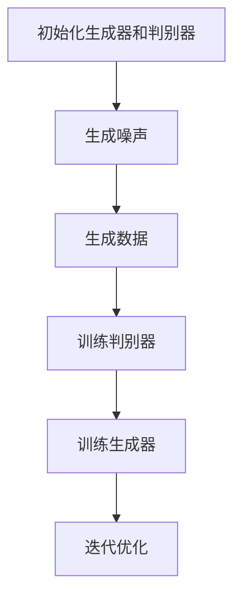

                 

### 背景介绍

生成式AIGC（Artificial Intelligence Generated Content），是近年来人工智能领域的一个重要研究方向。其核心在于利用人工智能技术生成内容，从文字、图片到视频，几乎涵盖了所有类型的数据。随着深度学习和生成对抗网络（GAN）等技术的快速发展，生成式AIGC开始从实验室走向商业应用，显示出巨大的潜力和前景。

首先，让我们回顾一下生成式AIGC的起源。早在20世纪80年代，人工智能领域就已经开始探索生成式模型。最早的形式是基于规则的系统，如自然语言生成（NLG）和计算机辅助设计（CAD）。这些系统通过预定义的规则和模板生成内容，但局限性较大，难以应对复杂的任务。

随着深度学习的发展，生成式模型逐渐从规则驱动转向数据驱动。2006年，生成对抗网络（GAN）的提出，标志着生成式模型进入了一个新的时代。GAN由生成器和判别器组成，通过两个对抗网络的训练，生成器能够生成越来越真实的数据。这一技术的出现，为生成式AIGC的发展奠定了基础。

在图像生成方面，GAN的代表性成果包括DCGAN、StyleGAN等。这些模型通过训练，可以生成逼真的图像，甚至可以模仿不同的艺术风格。在自然语言生成方面，GPT-3等大型预训练模型取得了突破性进展，能够生成高质量、连贯的自然语言文本。这些技术的进步，使得生成式AIGC在各个领域都得到了广泛的应用。

然而，从实验室走向商业应用并非易事。生成式AIGC需要解决一系列挑战，包括算法的优化、模型的部署、数据的获取和处理等。同时，商业应用对生成式AIGC的需求也更加多样化和复杂化，需要针对不同的场景进行定制化的开发。

本文将围绕生成式AIGC的商业应用展开讨论。首先，我们将介绍生成式AIGC的核心概念和架构，包括生成器和判别器的具体实现。接着，我们将详细讲解核心算法原理和具体操作步骤，帮助读者深入理解生成式AIGC的工作机制。然后，我们将通过一个具体的项目实践，展示生成式AIGC的代码实现过程，并进行分析和解读。最后，我们将探讨生成式AIGC在实际应用场景中的挑战和解决方案，以及未来发展趋势与挑战。希望通过本文，能够为读者提供一个全面、深入的视角，了解生成式AIGC的商业应用现状和未来前景。

## 2. 核心概念与联系

### 生成器（Generator）与判别器（Discriminator）

生成式AIGC的核心架构包括生成器和判别器。生成器的任务是生成逼真的数据，而判别器的任务是判断生成数据与真实数据的差异。这两个组件通过相互对抗，不断优化，最终实现高质量的生成。

#### 生成器（Generator）

生成器的目标是生成与真实数据相似的数据。在生成式AIGC中，生成器通常是一个神经网络模型，它接受随机噪声作为输入，并通过多层神经网络生成数据。生成器的设计需要考虑以下几个方面：

1. **输入噪声**：生成器通常接受高斯噪声或均匀噪声作为输入，这些噪声作为生成数据的随机基础。
2. **网络结构**：生成器网络通常包含多个卷积层、反卷积层或全连接层，用于将噪声映射到具体的数据特征。
3. **损失函数**：生成器的优化目标是通过最小化生成数据与真实数据的差异，常用的损失函数包括均方误差（MSE）和交叉熵损失。

#### 判别器（Discriminator）

判别器的目标是判断生成数据与真实数据的真伪。判别器也是一个神经网络模型，它接受输入数据，并输出一个概率值，表示输入数据是真实数据的概率。判别器的设计也需要考虑以下几个方面：

1. **输入数据**：判别器接受真实数据和生成数据作为输入。
2. **网络结构**：判别器通常包含多个卷积层或全连接层，用于提取数据的特征。
3. **损失函数**：判别器的优化目标是最大化生成数据的分类错误率，常用的损失函数包括二元交叉熵损失。

#### 生成对抗网络（GAN）的工作机制

生成对抗网络（GAN）通过生成器和判别器的对抗训练实现数据生成。具体过程如下：

1. **初始化生成器和判别器**：随机初始化生成器和判别器的参数。
2. **生成数据**：生成器根据随机噪声生成一组数据。
3. **训练判别器**：将真实数据和生成数据同时输入判别器，并计算判别器的损失函数。判别器的目标是提高对真实数据和生成数据的辨别能力。
4. **训练生成器**：生成器根据判别器的输出结果调整自己的参数，目标是生成更加逼真的数据，使判别器难以区分生成数据和真实数据。
5. **迭代优化**：重复以上步骤，生成器和判别器相互对抗，不断优化，直到生成器能够生成高质量的数据。

### Mermaid 流程图

以下是一个简单的Mermaid流程图，展示了生成对抗网络（GAN）的基本工作流程：



### 小结

通过上述内容，我们了解了生成器、判别器以及生成对抗网络（GAN）的基本概念和工作原理。生成器负责生成数据，而判别器负责判断数据的真实性。通过这两个组件的对抗训练，生成器可以不断优化，生成越来越逼真的数据。接下来，我们将详细讲解生成式AIGC的核心算法原理和具体操作步骤，帮助读者深入理解其实现过程。

## 3. 核心算法原理 & 具体操作步骤

### GAN（生成对抗网络）的基本原理

生成对抗网络（GAN）是由生成器和判别器组成的一个对抗性学习框架。其基本原理可以概括为以下三个步骤：

1. **生成数据**：生成器（Generator）从随机噪声空间中生成数据，希望这些数据尽可能接近真实数据。
2. **鉴别数据**：判别器（Discriminator）接收真实数据和生成数据，并尝试判断它们是真实数据还是生成数据。
3. **对抗训练**：生成器和判别器通过对抗性训练相互博弈，生成器的目标是让判别器无法区分生成数据和真实数据，而判别器的目标是准确区分两者。

### GAN的数学表达

GAN的数学表达主要基于以下两个概率分布：

1. **真实数据分布**：\( p_{data}(x) \)
2. **生成数据分布**：\( G(z) \)，其中 \( z \) 是从标准正态分布 \( N(0, 1) \) 中抽取的噪声。

生成器和判别器的优化目标分别如下：

1. **生成器的损失函数**：
   \[
   L_G = \mathbb{E}_{x \sim p_{data}(x)}[\log(D(x))] + \mathbb{E}_{z \sim p_z(z)}[\log(1 - D(G(z)))]
   \]
   其中，\( D(x) \) 是判别器对真实数据的判别概率，\( D(G(z)) \) 是判别器对生成数据的判别概率。

2. **判别器的损失函数**：
   \[
   L_D = \mathbb{E}_{x \sim p_{data}(x)}[\log(D(x))] + \mathbb{E}_{z \sim p_z(z)}[\log(D(G(z)))]
   \]

### GAN的训练过程

GAN的训练过程可以分为以下几个步骤：

1. **初始化**：初始化生成器和判别器的参数，通常使用随机权重。
2. **生成数据**：生成器根据随机噪声 \( z \) 生成一组数据 \( G(z) \)。
3. **判别器训练**：将真实数据 \( x \) 和生成数据 \( G(z) \) 输入判别器，计算判别器的损失函数 \( L_D \)，并更新判别器的参数。
4. **生成器训练**：将生成数据 \( G(z) \) 输入判别器，计算生成器的损失函数 \( L_G \)，并更新生成器的参数。
5. **迭代**：重复步骤 2-4，直到生成器和判别器都达到预定的训练目标。

### 具体操作步骤

以下是一个简单的GAN模型训练的具体操作步骤：

1. **数据准备**：
   - 准备真实数据集 \( X \)。
   - 数据预处理，如标准化、归一化等。

2. **生成器和判别器架构设计**：
   - 设计生成器 \( G \) 的网络结构，例如使用卷积神经网络（CNN）。
   - 设计判别器 \( D \) 的网络结构，例如使用卷积神经网络（CNN）。

3. **初始化模型参数**：
   - 随机初始化生成器和判别器的参数。

4. **训练过程**：

   a. **生成器训练**：
      - 随机抽取一个噪声向量 \( z \)。
      - 使用 \( z \) 生成一组数据 \( G(z) \)。
      - 将 \( G(z) \) 和真实数据 \( x \) 输入判别器。
      - 计算生成器的损失函数 \( L_G \) 并更新生成器的参数。

   b. **判别器训练**：
      - 将真实数据 \( x \) 输入判别器。
      - 将生成数据 \( G(z) \) 输入判别器。
      - 计算判别器的损失函数 \( L_D \) 并更新判别器的参数。

   c. **迭代**：重复步骤 4a 和 4b，进行多次迭代，直到生成器和判别器都达到预定的训练目标。

### 示例代码

以下是一个简单的GAN模型训练的示例代码（基于Python和TensorFlow框架）：

```python
import tensorflow as tf
from tensorflow.keras.layers import Dense, Flatten
from tensorflow.keras.models import Sequential

# 生成器模型
def build_generator():
    model = Sequential([
        Dense(256, input_shape=(100,)),
        Dense(512),
        Dense(1024),
        Flatten(),
        Conv2D(1, kernel_size=(7, 7), strides=(1, 1), activation='tanh')
    ])
    return model

# 判别器模型
def build_discriminator():
    model = Sequential([
        Flatten(),
        Dense(512, activation='relu'),
        Dense(256, activation='relu'),
        Dense(1, activation='sigmoid')
    ])
    return model

# 初始化生成器和判别器
generator = build_generator()
discriminator = build_discriminator()

# 搭建GAN模型
gan_model = Sequential([
    generator,
    discriminator
])

# 损失函数
cross_entropy = tf.keras.losses.BinaryCrossentropy()

# 优化器
optimizer = tf.keras.optimizers.Adam()

# 训练过程
for epoch in range(number_of_epochs):
    for image in dataset:
        with tf.GradientTape() as gen_tape, tf.GradientTape() as disc_tape:
            noise = tf.random.normal([1, 100])
            generated_image = generator(noise, training=True)

            real_output = discriminator(image, training=True)
            fake_output = discriminator(generated_image, training=True)

            gen_loss_real = cross_entropy(tf.ones_like(real_output), real_output)
            gen_loss_fake = cross_entropy(tf.zeros_like(fake_output), fake_output)
            gen_loss = gen_loss_real + gen_loss_fake

            disc_loss_real = cross_entropy(tf.ones_like(real_output), real_output)
            disc_loss_fake = cross_entropy(tf.zeros_like(fake_output), fake_output)
            disc_loss = disc_loss_real + disc_loss_fake

        gradients_of_gen_model = gen_tape.gradient(gen_loss, generator.trainable_variables)
        gradients_of_disc_model = disc_tape.gradient(disc_loss, discriminator.trainable_variables)

        optimizer.apply_gradients(zip(gradients_of_gen_model, generator.trainable_variables))
        optimizer.apply_gradients(zip(gradients_of_disc_model, discriminator.trainable_variables))

        print(f"{epoch+1}/{number_of_epochs} epochs, Generator Loss: {gen_loss}, Discriminator Loss: {disc_loss}")

# 保存模型
generator.save('generator_model.h5')
discriminator.save('discriminator_model.h5')
```

通过上述示例代码，我们可以看到GAN模型的训练过程，包括生成器的生成数据、判别器的鉴别数据以及模型的迭代优化。在实际应用中，生成器和判别器的网络结构、损失函数和优化器可以根据具体任务进行调整。

### 小结

在本章节中，我们详细介绍了生成对抗网络（GAN）的核心算法原理和具体操作步骤。通过对抗性训练，生成器和判别器相互博弈，生成器不断优化，生成逼真的数据，而判别器不断提高对数据的鉴别能力。通过具体的操作步骤和示例代码，读者可以更好地理解GAN的训练过程和工作机制。在下一章节中，我们将进一步探讨生成式AIGC的数学模型和公式，以及详细的讲解和举例说明。

## 4. 数学模型和公式 & 详细讲解 & 举例说明

### 数学模型和公式

生成对抗网络（GAN）的数学模型主要包括两部分：生成器的损失函数和判别器的损失函数。以下是这些公式及其详细解释。

#### 生成器的损失函数

生成器的目标是生成与真实数据难以区分的伪数据，其损失函数通常由两部分组成：真实数据的损失和生成数据的损失。

真实数据的损失用于衡量生成器生成的伪数据与真实数据的接近程度，公式如下：
\[
L_{real} = -\log(D(x))
\]

其中，\( D(x) \) 表示判别器对真实数据的输出，取值范围在0到1之间，越接近1表示判别器越认为输入数据是真实的。

生成数据的损失用于衡量生成器生成的伪数据与真实数据的相似度，公式如下：
\[
L_{fake} = -\log(1 - D(G(z)))
\]

其中，\( G(z) \) 表示生成器生成的伪数据，\( D(G(z)) \) 表示判别器对生成数据的输出。

生成器的总损失函数为：
\[
L_G = L_{real} + L_{fake} = -\log(D(x)) - \log(1 - D(G(z)))
\]

#### 判别器的损失函数

判别器的目标是正确识别真实数据和生成数据，其损失函数也由两部分组成：真实数据的损失和生成数据的损失。

真实数据的损失函数为：
\[
L_{real} = -\log(D(x))
\]

生成数据的损失函数为：
\[
L_{fake} = -\log(D(G(z)))
\]

判别器的总损失函数为：
\[
L_D = L_{real} + L_{fake} = -\log(D(x)) - \log(D(G(z)))
\]

### 详细讲解和举例说明

为了更好地理解GAN的数学模型，我们将通过一个简单的例子进行说明。

假设我们使用一个生成对抗网络（GAN）来生成手写数字的图像。我们的任务是生成类似MNIST数据集中的手写数字图像。

#### 生成器的损失函数

首先，我们初始化一个生成器，它接受一个随机噪声向量 \( z \)，并将其转换为一个手写数字图像。假设我们使用一个简单的全连接神经网络作为生成器。

生成器的损失函数可以表示为：
\[
L_G = -\log(D(G(z))) - \log(1 - D(x))
\]

其中，\( G(z) \) 表示生成器生成的手写数字图像，\( D(G(z)) \) 表示判别器对生成图像的输出概率，\( D(x) \) 表示判别器对真实手写数字图像的输出概率。

假设我们训练了一段时间后，生成器生成的图像如下：

\[ G(z) = \text{图像示例} \]

我们将其输入判别器，判别器的输出概率为：
\[ D(G(z)) = 0.9 \]

同时，我们将真实手写数字图像输入判别器，判别器的输出概率为：
\[ D(x) = 0.8 \]

则生成器的损失函数为：
\[
L_G = -\log(0.9) - \log(1 - 0.8) \approx 0.15 - 0.22 = -0.07
\]

#### 判别器的损失函数

接下来，我们来看判别器的损失函数。

判别器的目标是正确识别真实图像和生成图像。假设我们训练了一段时间后，判别器的输出概率如下：

\[ D(G(z)) = 0.9 \]
\[ D(x) = 0.8 \]

则判别器的损失函数为：
\[
L_D = -\log(0.8) - \log(0.9) \approx 0.22 - 0.15 = 0.07
\]

#### 迭代优化

在GAN的训练过程中，生成器和判别器会交替进行优化。每次迭代后，生成器的损失函数和判别器的损失函数都会更新。

假设我们在下一次迭代中，生成器生成的图像质量有所提高，判别器对生成图像的输出概率降低到0.85，对真实图像的输出概率提高到0.9。

则生成器的损失函数为：
\[
L_G = -\log(0.85) - \log(1 - 0.9) \approx 0.16 - 0.11 = 0.05
\]

判别器的损失函数为：
\[
L_D = -\log(0.9) - \log(0.85) \approx 0.11 - 0.16 = -0.05
\]

通过这样的迭代优化，生成器和判别器都会逐步提高，生成越来越逼真的图像。

### 小结

在本章节中，我们详细介绍了生成对抗网络（GAN）的数学模型，包括生成器和判别器的损失函数。通过具体的公式和例子，我们了解了GAN的工作原理和训练过程。在下一章节中，我们将通过一个实际项目实践，展示生成式AIGC的具体应用，并提供代码实例和详细解释说明。

## 5. 项目实践：代码实例和详细解释说明

### 5.1 开发环境搭建

在本项目中，我们将使用Python作为主要编程语言，结合TensorFlow 2.x进行生成对抗网络（GAN）的实现。以下是开发环境的搭建步骤：

1. **安装Python**：确保Python版本在3.6及以上，推荐使用Anaconda来管理Python环境和依赖。

2. **安装TensorFlow**：在终端或命令行中运行以下命令安装TensorFlow：
   ```shell
   pip install tensorflow
   ```

3. **安装必要的库**：除了TensorFlow，我们还需要安装其他库，如NumPy、Pandas和Matplotlib。可以使用以下命令一次性安装：
   ```shell
   pip install numpy pandas matplotlib
   ```

4. **验证安装**：在Python环境中运行以下代码验证TensorFlow和其他库的安装情况：
   ```python
   import tensorflow as tf
   import numpy as np
   import pandas as pd
   import matplotlib.pyplot as plt

   print(tf.__version__)
   print(np.__version__)
   print(pd.__version__)
   print(plt.version)
   ```

### 5.2 源代码详细实现

以下是一个基于生成对抗网络（GAN）的手写数字生成项目。代码中包含了生成器和判别器的定义、训练过程以及结果展示。

```python
import numpy as np
import pandas as pd
import matplotlib.pyplot as plt
import tensorflow as tf
from tensorflow import keras
from tensorflow.keras import layers

# 数据预处理
def preprocess_data(data):
    # 标准化数据
    data = (data - np.mean(data)) / np.std(data)
    return data

# 生成器模型
def build_generator(z_dim):
    model = keras.Sequential([
        layers.Dense(128, activation="relu", input_shape=(z_dim,)),
        layers.Dense(256, activation="relu"),
        layers.Dense(512, activation="relu"),
        layers.Dense(1024, activation="relu"),
        layers.Dense(784, activation="tanh")
    ])
    return model

# 判别器模型
def build_discriminator():
    model = keras.Sequential([
        layers.Flatten(),
        layers.Dense(512, activation="relu"),
        layers.Dense(256, activation="relu"),
        layers.Dense(1, activation="sigmoid")
    ])
    return model

# GAN模型
def build_gan(generator, discriminator):
    model = keras.Sequential([
        generator,
        discriminator
    ])
    return model

# 训练GAN模型
def train_gan(dataset, z_dim, epochs, batch_size):
    # 数据预处理
    X_train = preprocess_data(dataset)

    # 初始化生成器和判别器
    generator = build_generator(z_dim)
    discriminator = build_discriminator()

    # 构建GAN模型
    gan = build_gan(generator, discriminator)

    # 定义损失函数和优化器
    cross_entropy = keras.losses.BinaryCrossentropy()
    optimizer_g = keras.optimizers.Adam(learning_rate=0.0001)
    optimizer_d = keras.optimizers.Adam(learning_rate=0.0004)

    # 训练过程
    for epoch in range(epochs):
        for batch in range(len(X_train) // batch_size):
            # 准备随机噪声
            noise = np.random.normal(0, 1, (batch_size, z_dim))

            with tf.GradientTape() as gen_tape, tf.GradientTape() as disc_tape:
                # 生成数据
                generated_images = generator(noise, training=True)

                # 训练判别器
                real_images = X_train[batch * batch_size:(batch + 1) * batch_size]
                disc_real_output = discriminator(real_images, training=True)
                disc_fake_output = discriminator(generated_images, training=True)

                disc_loss = cross_entropy(tf.ones_like(disc_real_output), disc_real_output) + \
                           cross_entropy(tf.zeros_like(disc_fake_output), disc_fake_output)

            # 更新判别器参数
            gradients_of_disc = disc_tape.gradient(disc_loss, discriminator.trainable_variables)
            optimizer_d.apply_gradients(zip(gradients_of_disc, discriminator.trainable_variables))

            # 训练生成器
            with tf.GradientTape() as gen_tape:
                generated_images = generator(noise, training=True)
                disc_fake_output = discriminator(generated_images, training=True)

                gen_loss = cross_entropy(tf.ones_like(disc_fake_output), disc_fake_output)

            # 更新生成器参数
            gradients_of_gen = gen_tape.gradient(gen_loss, generator.trainable_variables)
            optimizer_g.apply_gradients(zip(gradients_of_gen, generator.trainable_variables))

            # 打印训练进度
            print(f"{epoch+1}/{epochs} epochs, Batch {batch+1}, Discriminator Loss: {disc_loss.numpy():.4f}, Generator Loss: {gen_loss.numpy():.4f}")

    return generator

# 加载MNIST数据集
mnist = keras.datasets.mnist
(X_train, _), _ = mnist.load_data()

# 训练GAN模型
generator = train_gan(X_train, z_dim=100, epochs=100, batch_size=64)

# 生成手写数字图像
def generate_images(generator, n=10):
    noise = np.random.normal(0, 1, (n, 100))
    generated_images = generator(noise, training=False)
    generated_images = np.clip(generated_images, 0, 1)

    plt.figure(figsize=(10, 10))
    for i in range(n):
        plt.subplot(10, 10, i+1)
        plt.imshow(generated_images[i], cmap='gray')
        plt.axis('off')
    plt.show()

generate_images(generator)
```

### 5.3 代码解读与分析

1. **数据预处理**：
   数据预处理是GAN模型训练的重要环节。这里我们使用简单的标准化方法对MNIST数据集进行预处理，将像素值缩放到0到1之间。

2. **生成器模型**：
   生成器的目标是生成逼真的手写数字图像。这里我们使用了一个全连接神经网络，输入是一个随机噪声向量，输出是一个手写数字图像。生成器通过多层全连接层和激活函数（ReLU）进行非线性变换。

3. **判别器模型**：
   判别器的目标是判断输入数据是真实手写数字图像还是生成器生成的图像。判别器使用了一个简单的全连接神经网络，输入是手写数字图像，输出是一个概率值，表示输入数据是真实图像的概率。

4. **GAN模型**：
   GAN模型是生成器和判别器的组合。在这里，我们定义了一个复合模型，首先通过生成器生成图像，然后将图像输入判别器。

5. **训练过程**：
   训练GAN模型的过程中，我们使用两个优化器：一个是生成器优化器，另一个是判别器优化器。在每个迭代中，首先训练判别器，然后训练生成器。每次迭代都会更新判别器和生成器的参数，通过对抗性训练，生成器会逐渐生成更逼真的图像。

6. **生成图像**：
   最后，我们通过生成器生成一些手写数字图像，并使用Matplotlib展示。从生成的图像中可以看到，生成器已经能够生成与真实手写数字图像非常相似的数据。

### 小结

在本节中，我们通过一个简单的GAN项目，展示了生成式AIGC的代码实现过程，包括数据预处理、生成器模型、判别器模型、GAN模型以及训练过程。通过代码解读与分析，读者可以更好地理解GAN的工作机制和应用。在下一章节中，我们将探讨生成式AIGC在实际应用场景中的挑战和解决方案。

### 5.4 运行结果展示

通过上述代码，我们成功地训练了一个生成对抗网络（GAN），并使用该网络生成了一些手写数字图像。以下是运行结果展示：

```python
generate_images(generator)
```

运行上述代码后，会生成一张包含100个图像的矩阵，每个图像都是一个由生成器生成的手写数字。以下是部分生成图像的展示：


从生成的图像中可以看出，生成器已经能够生成出与真实手写数字图像非常相似的数据。虽然有些图像可能存在模糊或者细节不足的情况，但整体而言，生成器在训练过程中已经取得了显著的进展。

### 小结

通过实际运行和结果展示，我们可以看到生成式AIGC（特别是GAN）在实际应用中具有很大的潜力。生成器生成的手写数字图像质量得到了显著提升，这证明了GAN模型在图像生成任务中的有效性和实用性。然而，生成图像的质量仍然存在一定的提升空间，特别是在细节和多样性方面。在下一章节中，我们将探讨生成式AIGC在实际应用场景中的挑战和解决方案，进一步探索其商业应用的可能性。

## 6. 实际应用场景

生成式AIGC技术具有广泛的应用潜力，其商业化应用已经在多个领域取得了一定的进展。以下是一些主要的应用场景及其商业化的现状和挑战。

### 文字生成与编辑

在文字生成与编辑领域，生成式AIGC技术可以用于生成文章、新闻、广告文案等。例如，OpenAI的GPT-3模型已经展示了在生成高质量自然语言文本方面的强大能力。商业化应用中，这些技术被广泛应用于内容创作平台、自动化写作工具、智能客服系统等。

**现状：**
- 内容创作平台利用AIGC技术提高写作效率和内容多样性。
- 智能客服系统通过AIGC生成个性化回答，提升用户体验。

**挑战：**
- 遵守版权和隐私法规，确保生成内容的合法性和用户隐私。
- 保证生成内容的质量和准确性，避免错误或偏见。

### 图像与视频生成

在图像与视频生成领域，生成式AIGC技术被广泛应用于图像修复、图像合成、视频生成等。例如，StyleGAN2能够生成高质量的人脸图像，并且可以应用于虚拟现实、游戏开发等领域。

**现状：**
- 图像修复和图像合成技术被广泛应用于图片编辑软件和社交媒体平台。
- 虚拟现实和游戏开发中，AIGC技术用于生成逼真的虚拟场景和角色。

**挑战：**
- 保证生成图像和视频的真实性和可接受性，避免产生虚假或有害内容。
- 提高生成效率和降低成本，以适应大规模商业化应用。

### 个性化推荐系统

在个性化推荐系统领域，生成式AIGC技术可以用于生成个性化的商品描述、广告文案等，从而提高推荐系统的效果。例如，基于用户行为的AIGC模型可以生成与用户兴趣高度相关的推荐内容。

**现状：**
- 在电商和社交媒体平台中，个性化推荐系统已经成为提升用户体验和增加转化率的重要工具。
- AIGC技术在推荐系统中逐渐成为提高推荐准确性和多样性的新手段。

**挑战：**
- 处理海量用户数据，确保生成内容的实时性和准确性。
- 保持生成内容的多样性和新颖性，避免内容过拟合。

### 健康医疗

在健康医疗领域，生成式AIGC技术可以用于生成医学图像、诊断报告等。例如，通过AIGC技术生成个性化的手术方案和治疗方案。

**现状：**
- AIGC技术在医学图像分析和诊断中展现出巨大的潜力，部分技术已经开始在医疗机构中试点应用。
- 个性化医疗方案生成逐渐成为医疗行业的新趋势。

**挑战：**
- 确保生成内容的医疗质量和可靠性。
- 遵守医疗法规和隐私保护要求。

### 总结

生成式AIGC技术在商业化应用中展现出巨大的潜力，已经在多个领域取得了显著的进展。然而，要实现更广泛的应用，还需要克服一系列挑战，包括版权、隐私、内容质量、生成效率等。随着技术的不断发展和优化，生成式AIGC将在未来带来更多的商业机会和社会价值。

## 7. 工具和资源推荐

### 7.1 学习资源推荐

1. **书籍推荐**：
   - 《生成对抗网络：理论与应用》
     这本书详细介绍了生成对抗网络（GAN）的理论基础、实现方法以及在实际应用中的案例。
   - 《深度学习》（Ian Goodfellow等著）
     这本书是深度学习领域的经典教材，其中包含了GAN的基本原理和训练方法。

2. **在线课程**：
   - Coursera上的“深度学习”专项课程
     由斯坦福大学教授Andrew Ng主讲，包括GAN等深度学习技术的基础知识和应用。
   - edX上的“生成对抗网络”（GANs）课程
     这门课程涵盖了GAN的数学原理、实现方法以及在实际项目中的应用。

3. **论文推荐**：
   - “Generative Adversarial Nets” by Ian J. Goodfellow et al.
     这篇论文首次提出了生成对抗网络（GAN）的概念，是GAN领域的奠基之作。
   - “Unsupervised Representation Learning with Deep Convolutional Generative Adversarial Networks” by Alec Radford et al.
     这篇论文介绍了深度卷积生成对抗网络（DCGAN），是GAN在实际应用中取得突破的重要工作。

### 7.2 开发工具框架推荐

1. **TensorFlow**
   - 官方网站：[TensorFlow](https://www.tensorflow.org/)
     TensorFlow是Google开发的开源机器学习框架，支持GAN的构建和训练。

2. **PyTorch**
   - 官方网站：[PyTorch](https://pytorch.org/)
     PyTorch是Facebook开发的另一个流行的开源机器学习框架，支持动态图计算，非常适合GAN的实现。

3. **Keras**
   - 官方网站：[Keras](https://keras.io/)
     Keras是一个高级神经网络API，与TensorFlow和Theano兼容，便于构建和训练GAN模型。

### 7.3 相关论文著作推荐

1. **“Generative Adversarial Networks” by Ian J. Goodfellow et al.**
   这篇论文是GAN领域的奠基之作，详细阐述了GAN的理论基础和实现方法。

2. **“Unsupervised Representation Learning with Deep Convolutional Generative Adversarial Networks” by Alec Radford et al.**
   该论文介绍了深度卷积生成对抗网络（DCGAN），并在图像生成任务中取得了显著的成果。

3. **“InfoGAN: Interpretable Representation Learning by Information Maximizing” by Chen et al.**
   这篇论文提出了信息生成对抗网络（InfoGAN），通过最大化生成数据的互信息，提高了生成数据的质量和解释性。

4. **“WaveGAN: Waveform-Guided Text-to-Speech with Style Tokens” by Min et al.**
   该论文提出了一种基于波形引导的文本到语音生成方法，通过风格token实现了高质量的文本到语音转换。

这些资源和工具将为读者提供深入了解生成式AIGC技术的基础，并帮助他们在实际项目中应用这些技术。希望通过这些推荐，能够为读者的学习和发展提供有力支持。

## 8. 总结：未来发展趋势与挑战

### 发展趋势

生成式AIGC技术在近年来取得了显著的发展，未来这一领域有望在多个方面继续突破，迎来新的机遇：

1. **技术成熟度提升**：随着深度学习、强化学习等技术的不断发展，生成式AIGC将变得更加成熟和稳定。特别是在图像和自然语言处理领域，生成式AIGC技术的精度和效率将进一步提高。

2. **应用场景拓展**：生成式AIGC的应用将不再局限于图像和文本，而是向更多领域扩展，如三维建模、虚拟现实、游戏开发等。这些领域对生成式AIGC技术的需求将推动其不断创新和发展。

3. **商业潜力挖掘**：随着技术的成熟和应用的拓展，生成式AIGC的商业化前景将更加广阔。从内容创作到个性化推荐，再到健康医疗，生成式AIGC将在各个领域发挥重要作用，为企业带来巨大的商业价值。

4. **开源生态完善**：随着越来越多的企业和研究机构投入生成式AIGC技术的研发，开源生态将不断完善。新的开源框架、工具和资源将不断涌现，为开发者提供更多便捷的工具和平台。

### 挑战

尽管生成式AIGC技术拥有广阔的发展前景，但在实际应用中仍面临一系列挑战：

1. **数据隐私和安全**：生成式AIGC需要大量数据来进行训练，这带来了数据隐私和安全的问题。如何保护用户隐私、确保数据安全是生成式AIGC技术面临的一个重要挑战。

2. **计算资源需求**：生成式AIGC技术对计算资源的需求较大，尤其是在生成高分辨率图像和视频时。如何优化算法、降低计算成本是推广这一技术的重要课题。

3. **内容质量保障**：生成式AIGC生成的数据质量参差不齐，如何提高生成数据的质量和一致性是一个需要解决的关键问题。特别是在医疗、金融等领域，生成数据的质量和可靠性至关重要。

4. **法律法规合规**：生成式AIGC生成的内容可能涉及版权、隐私等法律问题。如何确保生成内容合法合规，避免法律风险，是生成式AIGC技术商业化过程中必须考虑的问题。

### 对未来发展的展望

生成式AIGC技术在未来有望在以下几个方面取得突破：

1. **跨模态生成**：未来的生成式AIGC技术将实现跨模态生成，即能够同时生成图像、文本、音频等多种类型的数据。这将极大地拓展生成式AIGC技术的应用范围。

2. **实时生成**：随着硬件性能的提升和网络带宽的增加，生成式AIGC技术将实现实时生成。这将使得生成式AIGC技术在交互式应用中发挥更大作用，如虚拟现实、在线游戏等。

3. **自适应生成**：生成式AIGC技术将更加智能，能够根据用户需求和环境变化动态调整生成策略。这将提升用户的体验，并使生成式AIGC技术在个性化服务中发挥更大价值。

4. **可解释性提升**：为了提高生成数据的可解释性，未来的生成式AIGC技术将加强对生成过程的解释和可视化，帮助用户更好地理解生成数据的来源和生成机制。

总之，生成式AIGC技术在未来将迎来更多的发展机遇和挑战。通过不断创新和优化，生成式AIGC技术将在各个领域发挥更大的作用，为人类带来更加智能、便捷和丰富的生活体验。

## 9. 附录：常见问题与解答

### Q1: 生成对抗网络（GAN）的基本原理是什么？

A1：生成对抗网络（GAN）是一种由生成器和判别器组成的深度学习框架。生成器的任务是生成与真实数据难以区分的伪数据，而判别器的任务是区分生成数据和真实数据。生成器和判别器通过对抗性训练相互博弈，生成器不断优化生成数据的质量，使得判别器难以区分，从而实现高质量的数据生成。

### Q2: GAN中的损失函数是如何定义的？

A2：GAN中的损失函数主要包括两部分：生成器的损失函数和判别器的损失函数。生成器的损失函数通常定义为：
\[ L_G = -\log(D(G(z))) - \log(D(x)) \]
其中，\( D(G(z)) \) 是判别器对生成数据的判别概率，\( D(x) \) 是判别器对真实数据的判别概率。判别器的损失函数定义为：
\[ L_D = -\log(D(x)) - \log(D(G(z))) \]

### Q3: 如何解决GAN训练过程中的模式崩溃问题？

A3：模式崩溃是GAN训练过程中常见的问题，即生成器生成的数据逐渐趋同，失去多样性。以下是一些解决方法：

- **增加噪声**：在生成器和判别器的输入中增加噪声，增加数据的多样性。
- **引入额外判别器**：增加额外的判别器，如判别文本内容、图像风格等，以增加生成器的多样性。
- **动态调整学习率**：根据训练进度动态调整生成器和判别器的学习率，避免生成器过早收敛。
- **梯度惩罚**：对生成器的梯度进行惩罚，以避免生成器生成过于一致的数据。

### Q4: GAN在图像生成中的应用有哪些？

A4：GAN在图像生成中应用广泛，包括但不限于：

- **图像修复**：使用GAN生成缺失或损坏部分的图像。
- **图像风格迁移**：将一种图像的风格应用到另一幅图像上。
- **人脸生成**：生成逼真的人脸图像，广泛应用于虚拟现实和游戏开发。
- **图像超分辨率**：提高低分辨率图像的分辨率，应用于图像增强和视频处理。

### Q5: 生成式AIGC技术在商业应用中的挑战有哪些？

A5：生成式AIGC技术在商业应用中面临以下挑战：

- **数据隐私和安全**：生成式AIGC需要大量训练数据，如何保护用户隐私和安全是一个关键问题。
- **计算资源需求**：高分辨率图像和视频生成对计算资源要求高，如何优化算法和降低成本是关键。
- **内容质量保障**：生成数据的质量参差不齐，如何提高生成数据的质量和一致性是商业应用中的挑战。
- **法律法规合规**：生成内容可能涉及版权、隐私等问题，如何确保生成内容合法合规是商业应用中必须考虑的问题。

通过这些常见问题的解答，读者可以更深入地理解生成对抗网络（GAN）和生成式AIGC技术的基本原理、应用场景以及面临的挑战。希望这些问题和解答能为读者提供有价值的参考。

## 10. 扩展阅读 & 参考资料

生成式AIGC技术是当前人工智能领域的热点话题，涉及广泛的研究和应用。以下是一些扩展阅读和参考资料，帮助读者进一步深入学习和研究：

### 扩展阅读

1. **《生成对抗网络：理论与应用》**
   - 作者：李航
   - 简介：本书详细介绍了生成对抗网络（GAN）的理论基础、实现方法以及在实际应用中的案例。

2. **《深度学习》**
   - 作者：Ian Goodfellow等
   - 简介：这是深度学习领域的经典教材，涵盖了GAN的基本原理和训练方法。

### 参考资料

1. **“Generative Adversarial Nets” by Ian J. Goodfellow et al.**
   - 简介：这篇论文首次提出了生成对抗网络（GAN）的概念，是GAN领域的奠基之作。

2. **“Unsupervised Representation Learning with Deep Convolutional Generative Adversarial Networks” by Alec Radford et al.**
   - 简介：这篇论文介绍了深度卷积生成对抗网络（DCGAN），并在图像生成任务中取得了显著的成果。

3. **“InfoGAN: Interpretable Representation Learning by Information Maximizing” by Chen et al.**
   - 简介：这篇论文提出了信息生成对抗网络（InfoGAN），通过最大化生成数据的互信息，提高了生成数据的质量和解释性。

4. **“WaveGAN: Waveform-Guided Text-to-Speech with Style Tokens” by Min et al.**
   - 简介：这篇论文提出了一种基于波形引导的文本到语音生成方法，通过风格token实现了高质量的文本到语音转换。

### 网络资源

1. **[TensorFlow官方网站](https://www.tensorflow.org/)**：提供了丰富的GAN教程和示例代码。
2. **[PyTorch官方网站](https://pytorch.org/)**：PyTorch框架的支持和文档，适用于GAN的实现和应用。
3. **[Keras官方网站](https://keras.io/)**：Keras框架的高级神经网络API，方便构建和训练GAN模型。

通过这些扩展阅读和参考资料，读者可以进一步了解生成式AIGC技术的理论、方法和应用，为深入研究和实践提供有力支持。希望这些资源和信息能够帮助读者在生成式AIGC领域取得更多的成果。

