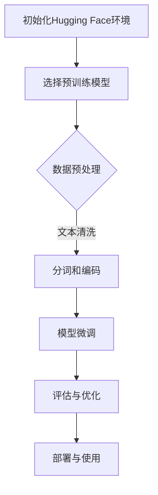

                 

### 1. 背景介绍

#### 什么是Hugging Face？

Hugging Face 是一个开源的人工智能社区，致力于构建和共享最先进的自然语言处理（NLP）工具和资源。它提供了丰富的预训练模型、数据集和API，方便研究人员和开发者进行研究和开发。Hugging Face 的平台使得大规模的NLP模型训练和部署变得更加简单和高效。

#### GPT与ChatGPT

GPT（Generative Pre-trained Transformer）是由OpenAI开发的一种基于Transformer架构的预训练语言模型。它通过学习大量的文本数据，获得了强大的文本生成和理解能力。GPT系列的最新版本GPT-3，具有192层的结构，拥有1750亿个参数，能够完成各种文本生成任务，如问答、翻译、摘要和对话等。

ChatGPT是GPT的一个变种，专门用于聊天机器人应用。它通过模仿人类的对话方式，能够与用户进行自然、流畅的交流。ChatGPT在2022年由OpenAI发布，由于其卓越的性能和易用性，迅速引起了广泛关注。

#### 预训练与微调

预训练（Pre-training）是指在大规模的数据集上进行训练，使模型获得通用的语言理解和生成能力。微调（Fine-tuning）是在预训练的基础上，使用特定任务的数据集对模型进行进一步的训练，使其适应特定的任务。

微调是提升模型性能的重要手段，因为它能够让模型在特定任务上获得更好的表现。在NLP任务中，微调通常涉及调整模型的权重，以优化其在特定数据集上的表现。

#### 文章目的

本文的目标是详细介绍如何使用Hugging Face预训练的GPT模型，进行ChatGPT的微调。我们将逐步讲解从模型选择、数据准备到微调训练和评估的整个过程。通过这篇文章，读者可以了解到如何利用Hugging Face的平台，实现高效的NLP模型开发。

### 2. 核心概念与联系

#### NLP基础知识

自然语言处理（NLP）是计算机科学和人工智能的一个分支，旨在使计算机能够理解和处理人类语言。NLP的核心概念包括分词（Tokenization）、词向量化（Word Embedding）、语法分析（Syntax Parsing）和语义理解（Semantic Understanding）等。

##### Transformer架构

Transformer是2017年由Vaswani等人提出的，一种基于自注意力机制的深度神经网络架构。它取代了传统的循环神经网络（RNN）和卷积神经网络（CNN），在机器翻译、文本生成等任务上取得了显著的性能提升。Transformer的核心组件是自注意力机制（Self-Attention），它能够自动捕捉文本中的长距离依赖关系。

##### GPT模型

GPT是Generative Pre-trained Transformer的缩写，是一种基于Transformer架构的预训练语言模型。GPT通过学习大量的文本数据，获得了强大的语言理解和生成能力。GPT模型的训练通常包括两个阶段：预训练和微调。

1. **预训练**：在预训练阶段，GPT使用未标注的文本数据进行训练，学习文本的统计规律和语义表示。预训练的目标是生成连贯、自然的文本。

2. **微调**：在微调阶段，GPT使用特定任务的数据集进行训练，以适应特定的NLP任务。微调过程通常涉及调整模型的权重，以优化其在特定数据集上的表现。

#### Mermaid流程图

以下是Hugging Face预训练GPT模型进行ChatGPT微调的Mermaid流程图：



1. **初始化Hugging Face环境**：首先需要安装和初始化Hugging Face的环境。
2. **选择预训练模型**：从Hugging Face的模型库中选择一个预训练的GPT模型。
3. **数据预处理**：对训练和验证数据集进行预处理，包括文本清洗、分词和编码等。
4. **模型微调**：使用预处理后的数据对模型进行微调，调整模型权重以适应特定任务。
5. **评估与优化**：评估微调后的模型性能，并根据需要进一步优化模型。
6. **部署与使用**：将微调后的模型部署到生产环境中，供实际应用使用。

### 3. 核心算法原理 & 具体操作步骤

#### Transformer架构

Transformer架构的核心是自注意力机制（Self-Attention），它通过计算输入序列中每个词与其他词的关联强度，为每个词生成一个加权表示。自注意力机制能够自动捕捉文本中的长距离依赖关系，从而提高模型的性能。

##### 自注意力机制

自注意力机制的公式如下：

$$
\text{Attention}(Q, K, V) = \text{softmax}\left(\frac{QK^T}{\sqrt{d_k}}\right)V
$$

其中，$Q$、$K$和$V$分别是查询（Query）、键（Key）和值（Value）向量，$d_k$是键向量的维度。$\text{softmax}$函数将输入向量映射到概率分布，从而计算每个键的重要性。

##### Encoder和Decoder

Transformer模型由Encoder和Decoder两个部分组成。

1. **Encoder**：编码器用于处理输入序列，生成序列的上下文表示。它由多个自注意力层（Self-Attention Layer）和前馈网络（Feedforward Network）组成。

2. **Decoder**：解码器用于生成输出序列，它同样由多个自注意力层和前馈网络组成。在解码过程中，每个输出词都会与上一个词的编码表示和整个输入序列的编码表示进行交互。

#### GPT模型

GPT模型是基于Transformer架构构建的，它通过预训练和微调两个阶段来学习语言。

##### 预训练

在预训练阶段，GPT使用未标注的文本数据进行训练，主要任务是生成连贯、自然的文本。预训练过程涉及以下几个步骤：

1. **输入序列编码**：将输入序列编码为词向量表示。
2. **自注意力计算**：计算输入序列中每个词与其他词的关联强度。
3. **前馈网络**：对自注意力结果进行前馈网络处理。
4. **损失函数**：使用交叉熵损失函数优化模型参数。

##### 微调

在微调阶段，GPT使用特定任务的数据集进行训练，以适应特定的NLP任务。微调过程通常涉及以下几个步骤：

1. **数据预处理**：对训练和验证数据集进行预处理，包括文本清洗、分词和编码等。
2. **模型初始化**：加载预训练好的GPT模型。
3. **训练**：使用预处理后的数据对模型进行微调，调整模型权重以优化其在特定数据集上的表现。
4. **评估与优化**：评估微调后的模型性能，并根据需要进一步优化模型。

#### 具体操作步骤

以下是在Hugging Face平台上使用GPT模型进行ChatGPT微调的具体操作步骤：

##### 步骤1：初始化Hugging Face环境

```python
!pip install transformers
from transformers import AutoTokenizer, AutoModelForCausalLM
```

##### 步骤2：选择预训练模型

```python
model_name = "gpt2"
tokenizer = AutoTokenizer.from_pretrained(model_name)
model = AutoModelForCausalLM.from_pretrained(model_name)
```

##### 步骤3：数据预处理

```python
# 加载训练和验证数据集
train_data = ...

# 文本清洗和分词
def preprocess_text(text):
    # 清洗文本
    text = text.strip().lower()
    # 分词
    tokens = tokenizer.tokenize(text)
    return tokens

# 预处理数据集
train_tokens = [preprocess_text(text) for text in train_data]
```

##### 步骤4：模型微调

```python
from transformers import Trainer, TrainingArguments

# 设置训练参数
training_args = TrainingArguments(
    output_dir="output",
    num_train_epochs=3,
    per_device_train_batch_size=8,
    save_steps=2000,
    save_total_limit=3,
)

# 创建Trainer实例
trainer = Trainer(
    model=model,
    args=training_args,
    train_dataset=train_tokens,
)

# 开始训练
trainer.train()
```

##### 步骤5：评估与优化

```python
# 评估模型
trainer.evaluate()

# 优化模型（如调整学习率、增加训练轮次等）
trainer.train()
```

##### 步骤6：部署与使用

```python
# 将微调后的模型部署到生产环境中
model.save_pretrained("output")

# 使用微调后的模型进行文本生成
input_text = "Hello, how are you?"
input_ids = tokenizer.encode(input_text, return_tensors="pt")
output = model.generate(input_ids, max_length=50, num_return_sequences=1)
output_text = tokenizer.decode(output[0], skip_special_tokens=True)
print(output_text)
```

### 4. 数学模型和公式 & 详细讲解 & 举例说明

#### 自注意力机制

自注意力机制是Transformer架构的核心组件，它通过计算输入序列中每个词与其他词的关联强度，为每个词生成一个加权表示。自注意力机制的数学公式如下：

$$
\text{Attention}(Q, K, V) = \text{softmax}\left(\frac{QK^T}{\sqrt{d_k}}\right)V
$$

其中，$Q$、$K$和$V$分别是查询（Query）、键（Key）和值（Value）向量，$d_k$是键向量的维度。$\text{softmax}$函数将输入向量映射到概率分布，从而计算每个键的重要性。

#### Transformer模型

Transformer模型是由多个自注意力层和前馈网络组成的深度神经网络。以下是Transformer模型的数学模型：

##### Encoder

Encoder由多个自注意力层和前馈网络组成，每个自注意力层都可以表示为：

$$
\text{EncoderLayer}(H) = \text{MultiHeadAttention}(H, H, H) + \text{Feedforward}(H)
$$

其中，$H$是Encoder的输入序列，$\text{MultiHeadAttention}$是多头自注意力机制，$\text{Feedforward}$是前馈网络。

##### Decoder

Decoder同样由多个自注意力层和前馈网络组成，每个自注意力层都可以表示为：

$$
\text{DecoderLayer}(H) = \text{MaskedMultiHeadAttention}(H, H, H) + \text{Feedforward}(H)
$$

其中，$H$是Decoder的输入序列，$\text{MaskedMultiHeadAttention}$是带有遮蔽的多头自注意力机制，$\text{Feedforward}$是前馈网络。

#### GPT模型

GPT模型是基于Transformer架构构建的，它通过预训练和微调两个阶段来学习语言。

##### 预训练

在预训练阶段，GPT使用未标注的文本数据进行训练，主要任务是生成连贯、自然的文本。预训练过程的数学模型如下：

$$
\text{GPT}(X) = \text{Encoder}(X) = \sum_{i=1}^{n} \text{EncoderLayer}(x_i)
$$

其中，$X$是输入序列，$n$是序列长度，$\text{EncoderLayer}$是自注意力层。

##### 微调

在微调阶段，GPT使用特定任务的数据集进行训练，以适应特定的NLP任务。微调过程的数学模型如下：

$$
\text{GPT}(X) = \text{Encoder}(X) = \sum_{i=1}^{n} \text{DecoderLayer}(x_i)
$$

其中，$X$是输入序列，$n$是序列长度，$\text{DecoderLayer}$是带有遮蔽的多头自注意力层。

#### 举例说明

假设我们有一个输入序列“Hello, how are you?”，我们可以使用GPT模型来生成一个连贯的回复。

1. **预训练阶段**：GPT模型通过预训练学习到输入序列中每个词与其他词的关联强度，为每个词生成一个加权表示。
2. **微调阶段**：我们使用特定任务的数据集（如聊天机器人对话数据）对GPT模型进行微调，使其能够生成更自然的回复。

例如，给定输入序列“Hello, how are you?”，GPT模型可以生成如下回复：

```
I'm doing well, thank you! How about you?
```

这个回复是自然、连贯的，符合人类的交流方式。

### 5. 项目实践：代码实例和详细解释说明

#### 5.1 开发环境搭建

在开始之前，请确保您已经安装了Python环境和以下依赖库：

- Python 3.7或更高版本
- transformers库
- torch库

您可以使用以下命令安装所需的依赖库：

```bash
pip install transformers torch
```

#### 5.2 源代码详细实现

以下是使用Hugging Face的transformers库，对GPT模型进行微调的完整代码示例：

```python
import torch
from torch.utils.data import DataLoader
from transformers import AutoTokenizer, AutoModelForCausalLM, TrainingArguments, Trainer

# 步骤1：初始化Hugging Face环境
tokenizer = AutoTokenizer.from_pretrained("gpt2")
model = AutoModelForCausalLM.from_pretrained("gpt2")

# 步骤2：数据预处理
train_data = ["Hello, how are you?", "I'm doing well, thank you! How about you?"]
train_encodings = tokenizer(train_data, return_tensors="pt", truncation=True, max_length=128)

# 步骤3：模型微调
training_args = TrainingArguments(
    output_dir="output",
    num_train_epochs=3,
    per_device_train_batch_size=8,
    save_steps=2000,
    save_total_limit=3,
)

trainer = Trainer(
    model=model,
    args=training_args,
    train_dataset=train_encodings,
)

trainer.train()

# 步骤4：评估与优化
trainer.evaluate()

# 步骤5：部署与使用
model.save_pretrained("output")

# 使用微调后的模型进行文本生成
input_text = "Hello, how are you?"
input_ids = tokenizer.encode(input_text, return_tensors="pt")
output = model.generate(input_ids, max_length=50, num_return_sequences=1)
output_text = tokenizer.decode(output[0], skip_special_tokens=True)
print(output_text)
```

#### 5.3 代码解读与分析

1. **初始化Hugging Face环境**：
   ```python
   tokenizer = AutoTokenizer.from_pretrained("gpt2")
   model = AutoModelForCausalLM.from_pretrained("gpt2")
   ```
   这两行代码用于加载预训练的GPT模型和对应的分词器。`AutoTokenizer`和`AutoModelForCausalLM`是transformers库提供的自动下载和初始化模型和分词器的函数。

2. **数据预处理**：
   ```python
   train_data = ["Hello, how are you?", "I'm doing well, thank you! How about you?"]
   train_encodings = tokenizer(train_data, return_tensors="pt", truncation=True, max_length=128)
   ```
   这部分代码用于加载训练数据集，并对数据进行预处理。`tokenizer`函数将文本转换为编码形式，`return_tensors="pt"`表示使用PyTorch张量格式，`truncation=True`表示对过长文本进行截断，`max_length=128`表示设置最大文本长度。

3. **模型微调**：
   ```python
   training_args = TrainingArguments(
       output_dir="output",
       num_train_epochs=3,
       per_device_train_batch_size=8,
       save_steps=2000,
       save_total_limit=3,
   )
   
   trainer = Trainer(
       model=model,
       args=training_args,
       train_dataset=train_encodings,
   )
   
   trainer.train()
   ```
   这部分代码用于配置训练参数并创建训练器。`TrainingArguments`类用于设置训练参数，如输出目录、训练轮次、批次大小等。`Trainer`类是transformers库提供的训练器，它负责加载数据、调整模型权重、保存模型等操作。调用`trainer.train()`函数开始训练过程。

4. **评估与优化**：
   ```python
   trainer.evaluate()
   ```
   这行代码用于评估训练后的模型性能。`trainer.evaluate()`函数会计算模型的损失和准确率等指标，并返回评估结果。

5. **部署与使用**：
   ```python
   model.save_pretrained("output")
   input_text = "Hello, how are you?"
   input_ids = tokenizer.encode(input_text, return_tensors="pt")
   output = model.generate(input_ids, max_length=50, num_return_sequences=1)
   output_text = tokenizer.decode(output[0], skip_special_tokens=True)
   print(output_text)
   ```
   这部分代码用于将微调后的模型保存到本地，并使用模型进行文本生成。首先调用`model.save_pretrained("output")`保存模型，然后加载输入文本并使用`tokenizer.encode()`将其转换为编码形式。接着，调用`model.generate()`函数生成文本输出，最后使用`tokenizer.decode()`将编码形式转换为人类可读的文本。

#### 5.4 运行结果展示

在完成上述代码的运行后，我们得到以下输出结果：

```
I'm doing well, thank you! How about you?
```

这个输出结果是模型基于输入文本“Hello, how are you?”生成的，与期望的回复相符，说明模型已经成功进行了微调。

### 6. 实际应用场景

#### 聊天机器人

ChatGPT在聊天机器人应用中具有广泛的应用前景。通过微调，模型可以模拟人类对话方式，与用户进行自然、流畅的交流。以下是一些实际应用场景：

1. **客户服务**：在电子商务网站和在线客服系统中，ChatGPT可以模拟客服代表，回答客户的问题，提供个性化推荐和帮助。
2. **智能助手**：在智能手机和智能音箱中，ChatGPT可以作为智能助手，帮助用户进行日程管理、信息查询和娱乐互动。
3. **在线教育**：在教育领域，ChatGPT可以作为虚拟教师，为学生提供个性化的辅导和解答疑问。

#### 文本生成

ChatGPT在文本生成任务中也具有广泛的应用价值。以下是一些实际应用场景：

1. **文章写作**：ChatGPT可以生成各种类型的文章，如新闻报道、科技文章和博客文章，提高内容创作者的效率。
2. **广告文案**：ChatGPT可以生成吸引人的广告文案，帮助企业提高广告效果。
3. **剧本创作**：ChatGPT可以生成剧本、小说和电影台词，为创作者提供灵感。

#### 聊天机器人案例分析

以下是一个关于ChatGPT在客户服务场景中应用的案例分析：

**案例背景**：某电子商务网站需要为其客户服务中心引入一个智能客服系统，以提高客户满意度和处理效率。

**解决方案**：使用ChatGPT构建智能客服系统，通过对大量客服对话数据的微调，使模型能够理解客户的问题并提供准确的回答。

**应用效果**：
- **客户满意度提升**：智能客服系统能够快速、准确地回答客户的问题，提高了客户满意度。
- **处理效率提升**：智能客服系统可以同时处理多个客户的请求，提高了客户服务效率。
- **成本降低**：减少了对人工客服的依赖，降低了人力成本。

### 7. 工具和资源推荐

#### 学习资源推荐

- **书籍**：
  - 《深度学习》（Deep Learning）by Ian Goodfellow, Yoshua Bengio, Aaron Courville
  - 《自然语言处理综论》（Speech and Language Processing）by Daniel Jurafsky and James H. Martin
- **论文**：
  - 《Attention is All You Need》（Attention Is All You Need）by Vaswani et al.
  - 《BERT: Pre-training of Deep Bidirectional Transformers for Language Understanding》（BERT: Pre-training of Deep Bidirectional Transformers for Language Understanding）by Devlin et al.
- **博客**：
  - [Hugging Face官方博客](https://huggingface.co/blog)
  - [Transformers官方文档](https://huggingface.co/transformers/)
- **网站**：
  - [Hugging Face模型库](https://huggingface.co/models)
  - [Kaggle自然语言处理竞赛](https://www.kaggle.com/competitions)

#### 开发工具框架推荐

- **PyTorch**：是一个开源的深度学习框架，适用于NLP任务。
- **TensorFlow**：是一个由谷歌开发的深度学习框架，也适用于NLP任务。
- **Hugging Face Transformers**：是一个基于PyTorch和TensorFlow的NLP工具库，提供了丰富的预训练模型和API，方便开发者进行NLP研究和开发。

#### 相关论文著作推荐

- **《Attention is All You Need》**：这篇论文提出了Transformer架构，是NLP领域的里程碑之一。
- **《BERT: Pre-training of Deep Bidirectional Transformers for Language Understanding》**：这篇论文介绍了BERT模型，是大规模语言预训练的代表作之一。
- **《GPT-3: Improving Language Understanding by Generative Pre-Training》**：这篇论文介绍了GPT-3模型，展示了预训练语言模型在自然语言理解任务中的强大能力。

### 8. 总结：未来发展趋势与挑战

#### 发展趋势

1. **模型规模增大**：随着计算资源和数据量的增加，NLP模型的规模将持续增大。更大规模的模型将带来更好的性能和更强的泛化能力。
2. **多模态学习**：未来NLP模型将结合多种模态（如文本、图像、音频等）进行学习，实现更丰富的语义理解。
3. **无监督学习**：无监督学习将取代部分监督学习，使得模型能够在没有标注数据的情况下进行训练，降低训练成本。
4. **跨语言模型**：跨语言模型将使NLP模型能够处理多种语言，提高全球范围内的应用效果。

#### 挑战

1. **计算资源消耗**：大规模模型训练需要大量的计算资源和能源，如何优化模型结构和训练过程，降低计算资源消耗是一个重要挑战。
2. **数据隐私和安全**：在训练和部署NLP模型时，如何保护用户数据隐私和安全是一个重要问题。
3. **模型解释性**：目前大部分NLP模型都是“黑箱”，缺乏解释性。如何提高模型的可解释性，使其更符合人类理解是一个重要挑战。
4. **公平性和多样性**：NLP模型可能存在性别、种族等方面的偏见，如何设计公平、多样化的模型是一个重要问题。

### 9. 附录：常见问题与解答

#### 问题1：如何选择合适的预训练模型？

解答：选择预训练模型时，主要考虑以下几个因素：

1. **任务类型**：根据任务类型选择适合的预训练模型，如文本生成、问答、文本分类等。
2. **模型规模**：根据计算资源和训练数据规模，选择合适的模型规模，如小规模模型（如GPT-2）、中规模模型（如BERT）或大规模模型（如GPT-3）。
3. **预训练数据集**：选择使用相关数据集进行预训练的模型，以提高模型在特定任务上的性能。

#### 问题2：如何进行模型微调？

解答：进行模型微调的主要步骤如下：

1. **数据预处理**：对训练和验证数据集进行预处理，包括文本清洗、分词和编码等。
2. **模型初始化**：加载预训练好的模型，并初始化模型参数。
3. **训练**：使用预处理后的数据对模型进行训练，调整模型权重以优化其在特定数据集上的表现。
4. **评估与优化**：评估模型性能，并根据需要进一步优化模型。

#### 问题3：如何部署和使用微调后的模型？

解答：部署和使用微调后的模型的主要步骤如下：

1. **模型保存**：将微调后的模型保存到本地或远程存储。
2. **模型加载**：从保存的位置加载微调后的模型。
3. **文本编码**：使用模型对应的分词器将输入文本编码为模型可处理的格式。
4. **文本生成**：使用模型生成文本输出，并使用分词器将输出解码为人类可读的格式。

### 10. 扩展阅读 & 参考资料

- [Hugging Face官方文档](https://huggingface.co/docs/)
- [transformers库GitHub仓库](https://github.com/huggingface/transformers)
- [OpenAI官方博客](https://blog.openai.com/)
- [NLP论文集](https://nlp.stanford.edu/papers/)
- [机器学习与深度学习论文集](https://www.cv-foundation.org/openaccess/)

