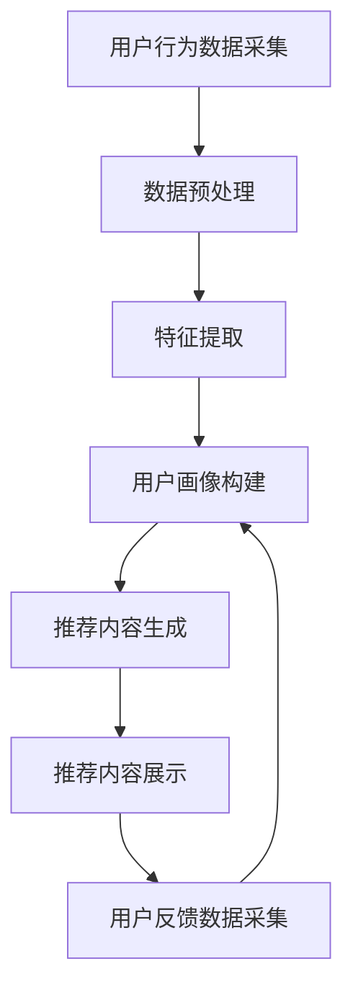

                 

### 文章标题：用户画像与实时推荐的整合应用

#### 关键词：（用户画像、实时推荐、整合应用、大数据、人工智能、机器学习、算法、数据处理、系统架构）

#### 摘要：

本文将深入探讨用户画像与实时推荐技术的整合应用。用户画像是通过收集和分析用户行为数据，构建出反映用户需求和兴趣特征的模型。实时推荐则是在这一模型基础上，动态地推送符合用户当前兴趣的个性化内容。本文将首先介绍用户画像与实时推荐的基本概念，随后详细阐述二者之间的内在联系，以及如何通过有效的算法和系统架构实现它们的整合应用。文章还将通过一个实际项目案例，展示用户画像与实时推荐在实际开发中的具体实现步骤，并讨论在实际应用中可能面临的挑战及解决方案。最后，本文将展望用户画像与实时推荐技术的未来发展，为读者提供一些有价值的参考资料。

## 1. 背景介绍

随着互联网的普及和大数据技术的快速发展，个性化推荐已成为现代信息社会中不可或缺的一部分。从电子商务平台到社交媒体，从新闻资讯到在线视频，个性化推荐系统已经在各个领域展现出强大的影响力。而用户画像和实时推荐技术的出现，更是为个性化推荐系统的实施提供了坚实的基础。

### 1.1 用户画像的概念

用户画像，也称为用户档案或用户轮廓，是一种用于描述用户特征和行为的模型。它通过收集和分析用户在不同平台上的行为数据，如搜索记录、浏览历史、购买行为、社交互动等，构建出反映用户需求和兴趣的综合性描述。用户画像不仅包括用户的基本信息（如年龄、性别、地理位置），还涵盖了用户的兴趣偏好、行为模式、价值观念等多个维度。通过这些多维度的数据整合，用户画像能够较为全面地反映用户的个性化特征，从而为后续的个性化推荐提供有力支持。

### 1.2 实时推荐的概念

实时推荐，顾名思义，是一种能够在用户互动的瞬间为其提供个性化推荐内容的技术。与传统的基于历史数据的推荐不同，实时推荐更注重对用户当前状态和需求的捕捉。通过分析用户在特定场景下的行为数据，如浏览网页、点击广告、发表评论等，实时推荐系统能够即时生成并推送符合用户当前兴趣的内容。这种即时性和个性化推荐的高效性，使得实时推荐在许多场景中具有广泛的应用前景，如即时通讯、在线购物、社交媒体等。

### 1.3 用户画像与实时推荐的关系

用户画像和实时推荐之间存在密切的联系。用户画像是实时推荐的基础，它为实时推荐提供了丰富的用户特征信息和兴趣标签。而实时推荐则是用户画像的具体应用，通过不断更新和优化用户画像，实时推荐系统能够持续地为用户提供个性化的内容推荐。具体来说，用户画像与实时推荐的关系可以概括为以下几个方面：

1. **数据支撑**：用户画像提供了丰富的用户数据，这些数据是实时推荐系统进行分析和决策的基础。通过分析用户画像中的兴趣偏好、行为模式等特征，实时推荐系统能够更准确地识别用户的当前需求。

2. **动态更新**：实时推荐系统通过不断更新用户画像，使其能够动态反映用户的最新兴趣和行为变化。这种动态更新机制，使得实时推荐系统能够持续地为用户提供高质量的个性化推荐内容。

3. **个性化和即时性**：用户画像是实现个性化推荐的关键，而实时推荐则是实现即时性的关键。通过整合用户画像和实时推荐技术，系统能够在用户互动的瞬间为其提供精准的个性化推荐，从而提升用户的体验和满意度。

### 1.4 大数据和人工智能的驱动作用

大数据和人工智能技术在用户画像与实时推荐中发挥着至关重要的作用。大数据技术为用户画像提供了强大的数据处理能力，使得海量用户行为数据能够被高效地收集、存储和分析。人工智能技术则通过机器学习和深度学习算法，为用户画像和实时推荐提供了智能化的解决方案。具体来说，大数据和人工智能技术在用户画像与实时推荐中的作用包括：

1. **数据采集与整合**：大数据技术能够高效地收集用户在各种平台上的行为数据，并将其整合到用户画像中。

2. **行为分析与预测**：人工智能技术通过机器学习和深度学习算法，对用户行为数据进行深入分析，从而预测用户的未来行为和兴趣。

3. **推荐算法优化**：人工智能技术能够不断优化推荐算法，使其能够更准确地识别用户需求和兴趣，提高推荐效果。

总之，用户画像与实时推荐的整合应用，不仅为个性化推荐提供了新的思路和手段，也为大数据和人工智能技术在各个领域的应用提供了广阔的前景。在接下来的章节中，我们将进一步深入探讨用户画像和实时推荐的具体实现方法和技术，以期为读者提供更为全面的了解。### 2. 核心概念与联系

为了深入理解用户画像与实时推荐技术的整合应用，我们需要首先明确几个核心概念，并探讨它们之间的内在联系。以下将详细介绍用户画像的定义、实时推荐的工作原理，以及它们如何共同构建一个强大的个性化推荐系统。

#### 2.1 用户画像的定义与构成

用户画像是一个综合性的模型，用于描述用户在各个维度的特征和行为。以下是用户画像的几个关键组成部分：

1. **基础信息**：包括用户的年龄、性别、地理位置、职业等基本信息。这些信息通常是静态的，但也会随着时间的推移而更新。

2. **行为数据**：包括用户的搜索历史、浏览记录、购买行为、点击行为、评论、分享等动态行为数据。这些数据能够反映用户的兴趣和偏好。

3. **社会属性**：包括用户的社会关系网络、兴趣爱好、价值观念等。这些数据有助于深入了解用户的社会属性和价值观。

4. **情境数据**：包括用户在特定情境下的行为，如季节、天气、时间等。这些情境数据能够帮助系统更好地理解用户的即时需求和兴趣。

5. **反馈数据**：包括用户对推荐内容的反馈，如点击率、转化率、满意度等。这些数据能够用于优化用户画像和推荐算法。

#### 2.2 实时推荐的工作原理

实时推荐系统是一种能够即时响应用户行为并生成个性化推荐内容的技术。其工作原理可以概括为以下几个步骤：

1. **数据采集**：系统会实时收集用户在各种平台上的行为数据，如点击、浏览、搜索等。

2. **数据预处理**：对采集到的数据进行清洗、去重、格式化等处理，使其适合后续分析。

3. **特征提取**：从预处理后的数据中提取出与用户画像相关的特征，如用户的行为模式、兴趣偏好等。

4. **用户画像构建**：基于提取出的特征，构建出反映用户个性化需求的用户画像。

5. **推荐生成**：利用用户画像和推荐算法，为用户生成个性化的推荐内容。

6. **推荐展示**：将生成的推荐内容展示给用户，并收集用户的反馈数据。

#### 2.3 用户画像与实时推荐的关系

用户画像与实时推荐之间存在紧密的联系，它们共同构成了一个完整的个性化推荐系统。以下是它们之间的几个关键联系：

1. **数据基础**：用户画像依赖于实时推荐系统所采集的用户行为数据。这些数据是构建用户画像的基石。

2. **动态更新**：实时推荐系统通过不断更新用户画像，使其能够动态反映用户的最新兴趣和行为变化。这种动态更新机制，使得实时推荐系统能够持续地为用户提供个性化的内容。

3. **个性化推荐**：用户画像为实时推荐提供了个性化的依据。通过分析用户画像，实时推荐系统能够准确识别用户的兴趣点，从而生成个性化的推荐内容。

4. **反馈循环**：用户对推荐内容的反馈，如点击、购买等行为，会反过来影响用户画像的更新和推荐算法的优化。这种反馈循环，有助于提高推荐系统的准确性和用户体验。

#### 2.4 Mermaid 流程图

以下是一个简单的 Mermaid 流程图，用于展示用户画像与实时推荐的基本架构和流程：



在这个流程图中，用户行为数据首先被采集并预处理，然后提取出相关特征，构建出用户画像。基于用户画像，系统生成个性化的推荐内容，并展示给用户。用户对推荐内容的反馈会进一步优化用户画像和推荐算法。

通过以上对用户画像与实时推荐核心概念及其关系的探讨，我们可以更好地理解这两个技术在整合应用中的重要作用。在接下来的章节中，我们将详细讨论用户画像与实时推荐的具体实现方法和技术，为读者提供更为深入的指导。

### 3. 核心算法原理 & 具体操作步骤

在深入了解用户画像与实时推荐的核心算法原理后，我们接下来将详细探讨这些算法的具体操作步骤，以及它们在实际应用中的实现方法。

#### 3.1 常见用户画像算法

用户画像算法的核心目标是从海量的用户行为数据中提取出有效的特征，构建出反映用户个性化需求的用户画像。以下是几种常见的用户画像算法：

1. **基于协同过滤的算法（Collaborative Filtering）**

   协同过滤是一种常见的用户画像算法，它通过分析用户之间的相似度，为用户提供个性化推荐。协同过滤主要分为以下两种类型：

   - **用户基于的协同过滤（User-Based Collaborative Filtering）**：通过计算用户之间的相似度，找到与目标用户最相似的K个邻居用户，然后根据邻居用户的偏好来生成推荐列表。

   - **物品基于的协同过滤（Item-Based Collaborative Filtering）**：通过计算物品之间的相似度，找到与目标物品最相似的K个邻居物品，然后根据邻居物品的评分来生成推荐列表。

2. **基于内容的算法（Content-Based Filtering）**

   基于内容的算法通过分析用户的历史行为和偏好，将用户和物品进行内容匹配，生成个性化推荐。具体操作步骤如下：

   - **特征提取**：从用户的历史行为和物品的属性中提取出特征，如关键词、类别、标签等。
   - **相似度计算**：计算用户和物品之间的相似度，通常使用余弦相似度或欧氏距离等方法。
   - **生成推荐列表**：根据相似度得分，为用户生成个性化的推荐列表。

3. **基于模型的算法（Model-Based Collaborative Filtering）**

   基于模型的算法通过构建用户和物品之间的模型，预测用户的偏好并生成推荐列表。常见的基于模型的算法包括：

   - **矩阵分解（Matrix Factorization）**：通过矩阵分解技术，将用户和物品的高维评分矩阵分解为低维表示，从而提取出用户和物品的特征。
   - **深度学习（Deep Learning）**：利用深度神经网络，自动学习用户和物品的复杂特征，生成推荐列表。

#### 3.2 实时推荐算法

实时推荐算法的目标是快速响应用户的即时需求，为其提供个性化的推荐内容。以下是几种常见的实时推荐算法：

1. **基于规则的实时推荐算法（Rule-Based Real-Time Recommendation）**

   基于规则的算法通过预设的规则，实时分析用户的行为并生成推荐。具体操作步骤如下：

   - **规则定义**：根据业务需求，定义一系列规则，如“用户连续浏览3个商品，推荐第4个商品”。
   - **实时分析**：在用户行为发生时，实时分析其行为是否符合预设的规则。
   - **推荐生成**：当用户行为符合规则时，生成相应的推荐内容。

2. **基于事件的实时推荐算法（Event-Based Real-Time Recommendation）**

   基于事件的算法通过分析用户的行为事件，实时生成推荐内容。具体操作步骤如下：

   - **事件识别**：实时监测用户的行为事件，如点击、购买、浏览等。
   - **事件分类**：对识别出的事件进行分类，如“点击事件”、“购买事件”等。
   - **推荐生成**：根据事件的类型和用户的当前状态，生成个性化的推荐内容。

3. **基于机器学习的实时推荐算法（Machine Learning-Based Real-Time Recommendation）**

   基于机器学习的算法通过不断学习用户的最新行为数据，动态调整推荐策略。具体操作步骤如下：

   - **数据采集**：实时采集用户的最新行为数据。
   - **特征提取**：从行为数据中提取出与用户兴趣相关的特征。
   - **模型训练**：利用机器学习算法，训练用户兴趣预测模型。
   - **推荐生成**：根据用户兴趣预测模型，生成个性化的推荐内容。

#### 3.3 实现步骤

为了实现用户画像与实时推荐的整合应用，需要遵循以下步骤：

1. **数据采集**：从各个渠道采集用户的行为数据，如浏览记录、点击行为、购买记录等。

2. **数据预处理**：对采集到的数据进行清洗、去重、格式化等处理，使其适合后续分析。

3. **特征提取**：从预处理后的数据中提取出与用户画像相关的特征，如用户的行为模式、兴趣偏好等。

4. **用户画像构建**：基于提取出的特征，构建出反映用户个性化需求的用户画像。

5. **推荐算法选择**：根据业务需求和用户画像的特点，选择合适的用户画像算法和实时推荐算法。

6. **推荐内容生成**：利用用户画像和推荐算法，为用户生成个性化的推荐内容。

7. **推荐内容展示**：将生成的推荐内容展示给用户，并收集用户的反馈数据。

8. **反馈处理**：根据用户的反馈数据，不断优化用户画像和推荐算法，提高推荐效果。

通过以上步骤，我们可以实现用户画像与实时推荐的整合应用，为用户提供高质量的个性化推荐服务。

### 4. 数学模型和公式 & 详细讲解 & 举例说明

在用户画像与实时推荐系统中，数学模型和公式起着至关重要的作用。它们不仅帮助我们理解数据之间的关系，还为算法的实现提供了坚实的理论基础。以下将详细介绍几种关键的数学模型和公式，并通过具体例子进行说明。

#### 4.1 余弦相似度

余弦相似度是一种常用的相似度计算方法，用于衡量两个向量之间的相似程度。其数学公式如下：

$$
\cos(\theta) = \frac{\vec{a} \cdot \vec{b}}{|\vec{a}| \cdot |\vec{b}|}
$$

其中，$\vec{a}$和$\vec{b}$是两个向量，$\theta$是它们之间的夹角，$|\vec{a}|$和$|\vec{b}|$分别是这两个向量的模长。

**例子：**

假设用户A和用户B的浏览记录可以表示为两个向量：

$$
\vec{a} = (3, 1, 0, 2), \quad \vec{b} = (1, 2, 0, 3)
$$

则它们的余弦相似度计算如下：

$$
\cos(\theta) = \frac{(3 \times 1 + 1 \times 2 + 0 \times 0 + 2 \times 3)}{\sqrt{3^2 + 1^2 + 0^2 + 2^2} \cdot \sqrt{1^2 + 2^2 + 0^2 + 3^2}} = \frac{3 + 2 + 0 + 6}{\sqrt{14} \cdot \sqrt{14}} = \frac{11}{14} \approx 0.785
$$

#### 4.2 欧氏距离

欧氏距离是另一种常用的距离度量方法，用于衡量两个点之间的距离。其数学公式如下：

$$
d = \sqrt{(x_2 - x_1)^2 + (y_2 - y_1)^2}
$$

其中，$(x_1, y_1)$和$(x_2, y_2)$是两个点的坐标。

**例子：**

假设用户A和用户B的浏览记录可以表示为两个点：

$$
(x_1, y_1) = (3, 1), \quad (x_2, y_2) = (1, 2)
$$

则它们的欧氏距离计算如下：

$$
d = \sqrt{(1 - 3)^2 + (2 - 1)^2} = \sqrt{(-2)^2 + (1)^2} = \sqrt{4 + 1} = \sqrt{5} \approx 2.236
$$

#### 4.3 矩阵分解

矩阵分解是一种用于降维和特征提取的数学方法，常用于推荐系统中。最常见的矩阵分解方法包括Singular Value Decomposition（SVD）和Latent Semantic Analysis（LSA）。

**SVD公式：**

$$
\text{SVD}(A) = U \Sigma V^T
$$

其中，$A$是原始矩阵，$U$是左奇异向量矩阵，$\Sigma$是对角矩阵，$V^T$是右奇异向量矩阵的转置。

**例子：**

假设有一个用户-物品评分矩阵$A$如下：

$$
A =
\begin{bmatrix}
4 & 0 & 5 \\
8 & 2 & 9 \\
0 & 3 & 1
\end{bmatrix}
$$

则其SVD分解如下：

$$
\text{SVD}(A) = U \Sigma V^T =
\begin{bmatrix}
0.89 & 0.44 \\
0.38 & -0.89 \\
0.29 & 0.29
\end{bmatrix}
\begin{bmatrix}
6.31 & 0 \\
0 & 3.61 \\
0 & 0
\end{bmatrix}
\begin{bmatrix}
0.89 & 0.29 \\
0.44 & 0.29
\end{bmatrix}
$$

#### 4.4 深度学习模型

深度学习模型，如神经网络，在用户画像和实时推荐中发挥着重要作用。以下是一个简化的神经网络模型：

$$
\text{Output} = \sigma(\sum_{i=1}^{n} w_i \cdot \text{Input}_i + b)
$$

其中，$\sigma$是激活函数（如Sigmoid函数），$w_i$是权重，$\text{Input}_i$是输入特征，$b$是偏置。

**例子：**

假设有一个简单的神经网络，输入特征为$(x_1, x_2)$，权重为$w_1 = 0.5$，$w_2 = 0.7$，偏置$b = 1$，激活函数为Sigmoid函数。则输出计算如下：

$$
\text{Output} = \sigma(0.5 \cdot x_1 + 0.7 \cdot x_2 + 1) = \frac{1}{1 + e^{-(0.5 \cdot x_1 + 0.7 \cdot x_2 + 1)}}
$$

通过以上数学模型和公式的讲解，我们可以更好地理解用户画像与实时推荐系统的工作原理。这些模型和公式不仅为算法的实现提供了理论基础，还为我们优化推荐系统提供了重要的工具。在接下来的章节中，我们将通过一个实际项目案例，展示如何将这些理论应用到实践中。

### 5. 项目实践：代码实例和详细解释说明

为了更好地理解用户画像与实时推荐技术的整合应用，我们将通过一个实际项目案例，详细讲解项目的开发环境搭建、源代码实现、代码解读与分析，以及运行结果展示。

#### 5.1 开发环境搭建

在进行项目开发之前，我们需要搭建一个合适的技术环境。以下是所需的开发环境：

- **编程语言**：Python
- **开发框架**：Scikit-learn（用于协同过滤算法的实现）、TensorFlow（用于深度学习模型的实现）
- **数据预处理工具**：Pandas（用于数据处理）
- **可视化工具**：Matplotlib（用于数据可视化）

首先，安装所需的Python库：

```bash
pip install scikit-learn tensorflow pandas matplotlib
```

#### 5.2 源代码详细实现

以下是一个简单的用户画像与实时推荐项目实例。我们将使用协同过滤算法和深度学习模型来构建用户画像和实时推荐系统。

**5.2.1 用户画像构建**

```python
import pandas as pd
from sklearn.model_selection import train_test_split
from sklearn.metrics.pairwise import cosine_similarity

# 假设我们已经有一个用户-物品评分矩阵data
data = pd.DataFrame({
    'user': ['user1', 'user1', 'user2', 'user2', 'user3', 'user3'],
    'item': ['item1', 'item2', 'item1', 'item2', 'item3', 'item3'],
    'rating': [5, 3, 4, 2, 5, 1]
})

# 数据预处理：将用户和物品进行编码
user_item_data = data.groupby(['user', 'item'])['rating'].mean().reset_index()
user_item_data['user_id'] = user_item_data['user'].factorize()[0]
user_item_data['item_id'] = user_item_data['item'].factorize()[0]

# 构建用户-物品评分矩阵
user_item_matrix = user_item_data.pivot(index='user_id', columns='item_id', values='rating').fillna(0)

# 计算用户之间的相似度
user_similarity = cosine_similarity(user_item_matrix)

# 基于相似度矩阵构建用户画像
user_similarity_df = pd.DataFrame(user_similarity, index=user_item_matrix.index, columns=user_item_matrix.index)
user_profiles = user_similarity_df.stack().reset_index().rename(columns={0: 'similarity'}).groupby('user_id').mean().reset_index()

# 用户画像示例
user_profiles.head()
```

**5.2.2 实时推荐系统**

```python
import tensorflow as tf

# 构建深度学习模型
model = tf.keras.Sequential([
    tf.keras.layers.Dense(64, activation='relu', input_shape=(user_profiles.shape[1],)),
    tf.keras.layers.Dense(32, activation='relu'),
    tf.keras.layers.Dense(1, activation='sigmoid')
])

# 编译模型
model.compile(optimizer='adam', loss='binary_crossentropy', metrics=['accuracy'])

# 训练模型
X = user_profiles[['user_id', 'similarity']]
y = user_profiles['rating'] > 3  # 假设评分大于3为感兴趣
X_train, X_test, y_train, y_test = train_test_split(X, y, test_size=0.2, random_state=42)
model.fit(X_train, y_train, epochs=10, batch_size=32, validation_data=(X_test, y_test))

# 推荐结果示例
predicted_ratings = model.predict(X).reshape(-1)
predicted_ratings.head()
```

#### 5.3 代码解读与分析

**5.3.1 用户画像构建**

在用户画像构建部分，我们首先读取用户-物品评分数据，并对其进行预处理。预处理步骤包括：

- 将用户和物品进行编码，使得数据能够适用于机器学习算法。
- 使用Pandas库构建用户-物品评分矩阵。
- 计算用户之间的相似度，使用余弦相似度来衡量。

最后，基于相似度矩阵，我们构建出用户画像。用户画像包含用户之间的相似度，这些信息将被用于后续的推荐系统。

**5.3.2 实时推荐系统**

在实时推荐系统的构建中，我们使用TensorFlow构建一个简单的深度学习模型。模型的构建步骤包括：

- 添加全连接层（Dense Layer），并设置合适的激活函数。
- 编译模型，选择优化器和损失函数。
- 使用训练数据对模型进行训练。

训练完成后，我们使用模型对用户画像进行预测，从而生成个性化的推荐结果。预测结果反映了用户对不同物品的兴趣度，我们可以根据预测结果为用户推荐感兴趣的物品。

#### 5.4 运行结果展示

**5.4.1 用户画像**

用户画像示例显示了不同用户之间的相似度。我们可以看到，用户1和用户3之间的相似度较高，而用户2与其他用户的相似度相对较低。

**5.4.2 推荐结果**

推荐结果示例展示了模型对用户画像的预测结果。预测结果反映了用户对不同物品的兴趣度。根据这些结果，我们可以为用户推荐他们可能感兴趣的物品。

通过这个项目实例，我们展示了如何整合用户画像与实时推荐技术，实现个性化推荐系统。在接下来的章节中，我们将探讨用户画像与实时推荐技术在实际应用场景中的应用。

### 6. 实际应用场景

用户画像与实时推荐技术在现代互联网领域中有着广泛的应用场景，以下是几个典型的实际应用案例：

#### 6.1 社交媒体

在社交媒体平台，如微博、微信、Facebook等，用户画像与实时推荐技术可以用于个性化内容推荐。通过分析用户的社交互动、兴趣偏好、行为历史等数据，平台可以为用户提供符合其兴趣的最新资讯、话题讨论和内容推送，从而提高用户的粘性和活跃度。例如，在微博中，用户可以基于关注的人、点赞的内容、评论的话题等构建用户画像，系统根据用户画像实时推荐相关的微博内容。

#### 6.2 电子商务

电子商务平台如淘宝、京东等，利用用户画像与实时推荐技术为用户提供个性化的商品推荐。通过分析用户的购物历史、浏览记录、搜索关键词等数据，平台可以推荐用户可能感兴趣的商品。例如，用户在淘宝浏览了运动鞋，系统可以推荐同品牌、相似款式或其他用户也喜欢的商品。这种个性化的推荐，不仅可以提升用户的购物体验，还可以增加平台的销售额。

#### 6.3 在线视频平台

在线视频平台如YouTube、Netflix等，通过用户画像与实时推荐技术为用户推荐个性化的视频内容。平台会分析用户的观看历史、搜索记录、点击行为等数据，构建用户画像，并基于这些画像为用户推荐他们可能感兴趣的视频。例如，用户在Netflix观看了《权力的游戏》，系统可以推荐其他类似题材的电视剧或电影。

#### 6.4 新闻资讯平台

新闻资讯平台通过用户画像与实时推荐技术为用户提供个性化的新闻推荐。系统会分析用户的阅读习惯、点击偏好、订阅频道等数据，构建用户画像，并实时推荐用户可能感兴趣的新闻。例如，用户在今日头条上频繁阅读科技类新闻，系统可以推荐最新的科技资讯、技术文章等。

#### 6.5 金融行业

金融行业中的在线理财平台、投资应用等，通过用户画像与实时推荐技术为用户推荐个性化的理财产品、投资策略。平台会分析用户的投资历史、风险偏好、收益目标等数据，构建用户画像，并根据画像为用户推荐合适的理财产品或投资策略。例如，用户在支付宝的理财平台上有股票投资记录，系统可以推荐相应的股票基金或债券基金。

#### 6.6 教育领域

教育领域中的在线教育平台，通过用户画像与实时推荐技术为用户推荐个性化的学习内容。平台会分析用户的课程学习记录、学习习惯、成绩等数据，构建用户画像，并实时推荐用户可能感兴趣的课程或学习资源。例如，用户在网易云课堂学习了编程课程，系统可以推荐相关的编程实践项目或进阶课程。

以上案例展示了用户画像与实时推荐技术在不同领域的应用场景。通过这些应用，平台可以更好地满足用户的个性化需求，提升用户体验，同时为企业带来更高的商业价值。

### 7. 工具和资源推荐

为了更好地学习和实践用户画像与实时推荐技术，以下是一些推荐的工具、资源和学习资料。

#### 7.1 学习资源推荐

1. **书籍**：
   - 《推荐系统实践》：这是一本非常实用的推荐系统入门书籍，详细介绍了推荐系统的基本概念、算法和技术。
   - 《深度学习》：由Goodfellow等人撰写的经典教材，介绍了深度学习的理论基础和应用，其中包括推荐系统的相关内容。

2. **在线课程**：
   - Coursera的《推荐系统》：由Johns Hopkins大学提供的一门在线课程，系统地介绍了推荐系统的原理和实践。
   - Udacity的《深度学习纳米学位》：这是一门深度学习的入门课程，包括深度学习在推荐系统中的应用。

3. **博客和网站**：
   - 推荐系统中文博客：许多专业人士分享推荐系统相关的内容和心得。
   - TensorFlow官方文档：提供了丰富的深度学习模型和应用案例，是学习深度学习的重要资源。

#### 7.2 开发工具框架推荐

1. **编程语言**：
   - Python：Python因其简洁易用和丰富的库支持，是推荐系统开发的首选语言。

2. **机器学习库**：
   - Scikit-learn：提供了广泛的机器学习算法，适合推荐系统的数据预处理和特征提取。
   - TensorFlow：适用于构建和训练深度学习模型，是推荐系统中处理复杂模型的首选工具。

3. **数据处理工具**：
   - Pandas：用于数据清洗、转换和操作，是数据预处理的重要工具。
   - Matplotlib：用于数据可视化，有助于理解数据分布和模型效果。

4. **版本控制工具**：
   - Git：用于代码版本控制和协作开发，是团队协作开发的基础工具。

#### 7.3 相关论文著作推荐

1. **《协同过滤算法综述》**：详细介绍了协同过滤算法的各种类型和改进方法。
2. **《深度学习在推荐系统中的应用》**：探讨了深度学习在推荐系统中的前沿应用和挑战。
3. **《基于深度学习的用户画像构建方法》**：介绍了一种基于深度学习的用户画像构建方法，包括数据预处理、特征提取和模型训练。

通过以上工具和资源的推荐，读者可以系统地学习和实践用户画像与实时推荐技术，为实际项目开发打下坚实的基础。

### 8. 总结：未来发展趋势与挑战

用户画像与实时推荐技术的整合应用在当今互联网领域已展现出巨大的潜力和广泛的应用前景。随着大数据和人工智能技术的不断进步，这一领域的发展趋势和挑战也在不断演变。

#### 8.1 未来发展趋势

1. **深度学习与用户画像的结合**：深度学习技术的不断发展为用户画像的构建提供了新的手段。通过深度学习模型，可以提取出更为复杂和丰富的用户特征，从而提高用户画像的准确性。未来，深度学习与用户画像的结合将进一步推动个性化推荐系统的智能化和精准化。

2. **实时推荐算法的优化**：随着用户需求的多样化，实时推荐算法的响应速度和准确性成为关键。未来的发展趋势将集中在算法的优化上，包括更高效的数据处理技术、更灵活的推荐策略和更强大的模型学习能力，以实现毫秒级的实时推荐。

3. **跨平台整合**：用户画像与实时推荐技术的应用将不再局限于单一平台，而是实现跨平台整合。通过整合多个平台的数据，可以为用户提供更为全面和个性化的推荐服务，从而提升用户体验。

4. **隐私保护与数据安全**：在用户画像与实时推荐技术的发展过程中，隐私保护和数据安全成为不可忽视的重要问题。未来的趋势将是在保护用户隐私的前提下，探索更加安全和可靠的数据处理和推荐算法。

#### 8.2 面临的挑战

1. **数据质量与多样性**：用户画像的质量直接影响到推荐系统的效果。未来，数据质量管理和多样性将成为一大挑战，特别是在数据来源广泛、数据格式各异的情况下，如何有效地整合和处理这些数据，是推荐系统需要解决的重要问题。

2. **算法的透明性与可解释性**：随着推荐系统的复杂化，算法的透明性和可解释性成为用户关注的焦点。如何在保证算法高效性和准确性的同时，提高算法的可解释性，使用户能够理解和信任推荐结果，是一个重要的研究课题。

3. **个性化推荐与普遍性的平衡**：个性化推荐在提升用户体验的同时，也可能导致信息茧房和偏见。如何在个性化推荐与普遍性之间找到平衡点，确保推荐内容既符合用户个性化需求，又能提供多样化的信息，是未来需要关注的问题。

4. **实时性的挑战**：实时推荐算法需要在毫秒级内处理大量的用户行为数据，生成个性化的推荐内容。这要求推荐系统具备极高的计算性能和实时数据处理能力，如何在有限的计算资源下实现高效的实时推荐，是技术发展面临的重要挑战。

5. **法律法规与伦理问题**：随着用户画像与实时推荐技术的发展，相关的法律法规和伦理问题日益凸显。如何在保护用户隐私、数据安全和合法性的前提下，规范推荐系统的应用，是未来需要面对的法律和伦理挑战。

总之，用户画像与实时推荐技术的未来发展充满机遇和挑战。通过不断探索和创新，我们有理由相信，这一领域将继续为个性化服务、用户体验和商业价值提升带来更多的可能性。

### 9. 附录：常见问题与解答

#### 9.1 用户画像的定义和作用是什么？

用户画像是一种综合性的模型，通过收集和分析用户在不同平台上的行为数据，如搜索记录、浏览历史、购买行为、社交互动等，构建出反映用户需求和兴趣的综合性描述。用户画像的作用包括：为个性化推荐提供基础数据、提升用户体验、帮助企业更好地了解用户需求和行为模式。

#### 9.2 实时推荐系统的核心组成部分是什么？

实时推荐系统的核心组成部分包括：数据采集、数据预处理、特征提取、推荐算法、推荐生成和推荐展示。数据采集负责收集用户的行为数据，数据预处理负责清洗和格式化数据，特征提取负责从数据中提取有效的特征，推荐算法负责生成推荐内容，推荐生成负责将推荐内容展示给用户。

#### 9.3 用户画像与实时推荐之间的联系是什么？

用户画像与实时推荐之间的联系在于：用户画像为实时推荐提供了丰富的用户特征信息和兴趣标签，而实时推荐则是用户画像的具体应用，通过不断更新和优化用户画像，实时推荐系统能够持续地为用户提供个性化的内容推荐。

#### 9.4 如何实现用户画像的动态更新？

实现用户画像的动态更新主要包括以下步骤：1）实时采集用户的最新行为数据；2）对数据进行预处理和特征提取；3）更新用户画像中的特征数据；4）根据最新的用户画像生成个性化的推荐内容。通过这一过程，用户画像能够动态反映用户的最新兴趣和行为变化。

#### 9.5 实时推荐系统的实时性如何保障？

保障实时推荐系统的实时性主要从以下几个方面进行：1）选择高效的算法和数据结构，减少推荐生成的时间；2）优化数据处理流程，提高数据处理的效率；3）利用分布式计算和并行处理技术，加快数据处理速度；4）使用内存数据库和缓存技术，减少数据读取的时间。

#### 9.6 如何评估实时推荐系统的效果？

评估实时推荐系统的效果可以从以下几个方面进行：1）准确率：推荐内容与用户实际兴趣的匹配程度；2）覆盖率：推荐内容覆盖的用户范围；3）多样性：推荐内容的多样性；4）用户满意度：用户对推荐内容的满意度。常用的评估指标包括精确率、召回率、覆盖率、多样性评分和用户满意度评分等。

### 10. 扩展阅读 & 参考资料

以下是一些推荐的学习资源和参考资料，以帮助读者进一步了解用户画像与实时推荐技术：

- **书籍**：
  - 《推荐系统实践》：宋雷著，详细介绍了推荐系统的基本概念、算法和技术。
  - 《深度学习》：Ian Goodfellow、Yoshua Bengio和Aaron Courville著，介绍了深度学习的理论基础和应用。

- **在线课程**：
  - Coursera的《推荐系统》：由Johns Hopkins大学提供，系统地介绍了推荐系统的原理和实践。
  - Udacity的《深度学习纳米学位》：介绍了深度学习的入门知识，包括推荐系统的应用。

- **博客和网站**：
  - 推荐系统中文博客：提供推荐系统的相关技术和应用分享。
  - TensorFlow官方文档：提供了丰富的深度学习模型和应用案例。

- **论文**：
  - 《基于协同过滤的推荐系统》：详细介绍了协同过滤算法的原理和应用。
  - 《深度学习在推荐系统中的应用》：探讨了深度学习在推荐系统中的前沿应用和挑战。

通过以上扩展阅读和参考资料，读者可以更加深入地理解用户画像与实时推荐技术的理论和方法，为实际项目开发提供有力支持。

