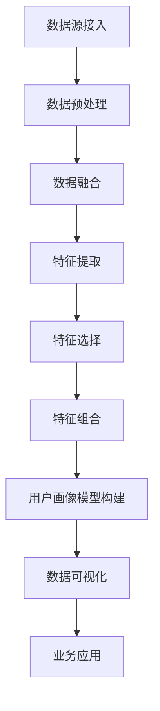

                 

### 文章标题

用户画像的多维度数据分析方法

> **关键词**：用户画像、多维度分析、数据分析、机器学习、深度学习、特征工程、可视化、大数据

> **摘要**：本文旨在深入探讨用户画像的多维度数据分析方法。通过介绍用户画像的基本概念、核心算法原理、数学模型以及项目实践，我们将展示如何运用多维度数据分析技术提升用户理解、个性化推荐和精准营销等应用效果。本文还将探讨用户画像在实际应用场景中的广泛应用，以及相关工具和资源的推荐，以期为读者提供全面的指导。

### 1. 背景介绍

在当今的信息时代，用户数据已经成为各个行业的重要资产。从电子商务到社交媒体，再到金融和医疗等领域，用户数据的收集、处理和应用已经成为企业提升竞争力、优化业务流程的关键环节。用户画像作为用户数据的高级形式，通过对用户多维度的特征进行分析，能够为各类应用场景提供精准、有效的数据支持。

用户画像的概念最早出现在市场研究领域，它通过对用户的兴趣、行为、社会属性等多方面的数据进行分析，构建出一个全面的、动态的用户画像模型。随着大数据和人工智能技术的发展，用户画像的应用范围不断扩大，不仅限于市场研究，还广泛应用于个性化推荐、风险控制、客户关系管理等多个领域。

多维度数据分析方法在用户画像构建中起着核心作用。通过结合不同的数据源，例如用户行为数据、社交媒体数据、地理位置数据等，多维度数据分析方法能够提供更加全面和准确的用户特征描述。这有助于企业更好地理解用户需求，提升用户体验，提高业务效益。

在用户画像的数据分析过程中，特征工程和算法选择至关重要。特征工程涉及数据的预处理、特征提取和特征选择，目的是从原始数据中提取出对用户画像构建有用的信息。算法选择则决定了用户画像模型的学习能力和效果。常用的用户画像算法包括聚类算法、协同过滤算法、决策树、神经网络等。

随着人工智能技术的不断发展，尤其是深度学习技术的应用，用户画像的多维度数据分析方法正在发生深刻的变革。深度学习模型能够自动地从大量数据中学习复杂的特征表示，从而提高用户画像的准确性和效率。

本文将首先介绍用户画像的基本概念和核心算法原理，然后详细探讨多维度数据分析方法的具体实现步骤，最后通过实际项目案例展示如何应用这些方法，并提供相关的工具和资源推荐。通过本文的阅读，读者将能够深入了解用户画像的多维度数据分析方法，并掌握如何将其应用于实际场景。

### 2. 核心概念与联系

#### 2.1 用户画像的基本概念

用户画像是一种描述用户特征和需求的方式，它通过整合和分析用户的多种数据来源，构建出一个多维度的用户特征模型。用户画像的基本概念包括以下几个关键组成部分：

1. **数据源**：用户画像的数据来源多样，包括用户注册信息、浏览行为、购买记录、社交媒体活动、地理位置信息等。这些数据可以来自于企业的内部数据库，也可以来自于第三方数据提供商。

2. **用户特征**：用户特征是指用户的个人信息、行为、兴趣、社会属性等方面的属性。例如，用户的年龄、性别、职业、收入、购物偏好、浏览历史、社交网络关系等。

3. **用户画像模型**：用户画像模型是将用户的多种特征进行整合和抽象化，形成的一个结构化的数据模型。这个模型可以用来描述用户的整体特征，以及在不同应用场景下的特定行为。

4. **动态更新**：用户画像是一个动态变化的模型，随着用户行为和外部环境的变化，用户画像需要不断地更新和优化，以保持其准确性和有效性。

#### 2.2 多维度数据分析方法

多维度数据分析方法是指在用户画像构建过程中，综合分析用户在多个维度上的特征，从而更全面地理解用户。以下是多维度数据分析方法的核心组成部分：

1. **数据融合**：数据融合是指将来自不同数据源的数据进行整合，形成一个统一的数据视图。例如，将用户在电子商务平台的行为数据与社交媒体数据相结合，以获得更丰富的用户特征。

2. **特征提取**：特征提取是指从原始数据中提取出对用户画像构建有用的信息。通过特征提取，可以将高维、复杂数据转化为易于处理的低维特征向量。

3. **特征选择**：特征选择是指从提取出的特征中挑选出对用户画像有重要影响的关键特征。特征选择可以减少数据冗余，提高模型性能。

4. **特征组合**：特征组合是指将多个特征进行组合，以形成新的特征表示。特征组合可以增强模型的解释性和预测能力。

5. **数据可视化**：数据可视化是将分析结果以图形化的形式展示出来，帮助用户直观地理解用户特征和数据分析结果。

#### 2.3 用户画像与多维度数据分析的关系

用户画像的构建离不开多维度数据分析方法。多维度数据分析方法为用户画像提供了数据整合、特征提取和特征选择的工具，使得用户画像能够更全面、准确地反映用户特征。具体来说：

- 数据融合是多维度数据分析的基础，它使得不同来源的数据能够在同一框架下进行整合和分析。

- 特征提取和特征选择是多维度数据分析的核心，它们将原始数据转化为对用户画像有用的特征表示。

- 特征组合扩展了用户画像的维度，使得模型能够更好地捕捉用户的复杂行为模式。

- 数据可视化则帮助用户直观地理解用户画像和数据分析结果，从而指导实际业务决策。

#### 2.4 Mermaid 流程图

以下是一个用户画像构建过程中多维度数据分析方法的 Mermaid 流程图：



通过这个流程图，我们可以清晰地看到用户画像构建过程中各步骤之间的联系和交互。每个步骤都有其特定的功能和目标，共同构成了一个完整的多维度数据分析方法体系。

### 3. 核心算法原理 & 具体操作步骤

#### 3.1 算法选择与适用场景

在用户画像的多维度数据分析过程中，选择合适的算法至关重要。以下是一些常用的算法及其适用场景：

1. **聚类算法**：
   - **K-Means**：适用于用户群体的划分，能够将用户按照相似度进行分类。
   - **层次聚类**：适用于用户细分，能够自动确定合适的聚类个数。
   - **DBSCAN**：适用于非均匀分布的数据，能够发现不同密度的用户群体。

2. **协同过滤算法**：
   - **基于用户的协同过滤**：适用于推荐系统，根据用户的历史行为推荐相似用户喜欢的内容。
   - **基于物品的协同过滤**：适用于推荐系统，根据用户喜欢的内容推荐相似物品。

3. **决策树与随机森林**：
   - **决策树**：适用于特征筛选和预测，能够直观地展示特征与目标变量之间的关系。
   - **随机森林**：适用于大规模数据集，通过集成多个决策树提高模型稳定性和预测性能。

4. **神经网络与深度学习**：
   - **深度神经网络**：适用于复杂特征提取和分类，能够自动学习高维特征表示。
   - **卷积神经网络（CNN）**：适用于图像和视频数据，能够提取图像和视频中的高级特征。

5. **矩阵分解与隐语义模型**：
   - **Singular Value Decomposition (SVD)**：适用于推荐系统，通过分解用户和物品的矩阵来预测用户对物品的偏好。
   - **Latent Dirichlet Allocation (LDA)**：适用于文本数据的主题建模，能够发现文档集合中的潜在主题。

#### 3.2 具体操作步骤

下面以 K-Means 算法为例，详细介绍用户画像构建过程中的具体操作步骤。

1. **数据预处理**：
   - 数据清洗：去除缺失值、异常值和重复值。
   - 数据标准化：将不同特征的数据缩放到同一尺度，便于后续算法计算。

2. **特征提取**：
   - 挖掘用户行为特征：例如，用户的购买行为、浏览历史、评论等。
   - 挖掘用户社会特征：例如，用户的年龄、性别、地理位置、职业等。
   - 结合不同数据源的特征：通过数据融合，将来自不同数据源的特征整合到一个统一的特征向量中。

3. **模型训练**：
   - 初始化聚类中心：随机选择 K 个初始聚类中心。
   - 计算距离：计算每个用户到各个聚类中心的距离。
   - 分配用户：将每个用户分配到最近的聚类中心。
   - 更新聚类中心：计算每个聚类的新中心，重复上述步骤，直到聚类中心不再发生显著变化。

4. **模型评估**：
   - 内部评估指标：例如，轮廓系数（Silhouette Coefficient）、簇内离散度（Within-Cluster Sum of Squares）等。
   - 外部评估指标：例如，调整系数（Adjusted Rand Index,ARI）、一致系数（V-measure）等。

5. **用户画像构建**：
   - 根据聚类结果，为每个用户打上标签，形成用户画像。
   - 利用用户画像进行用户群体划分、个性化推荐、精准营销等业务应用。

#### 3.3 案例说明

以下是一个基于 K-Means 算法的用户画像构建案例：

- 数据集：某电商平台的用户数据，包括用户年龄、性别、购买金额、浏览页面等特征。
- 特征提取：通过数据预处理和特征提取，将用户数据转化为一个 30 维的特征向量。
- 模型训练：选择 K=3，初始化聚类中心，进行 K-Means 聚类。
- 模型评估：使用轮廓系数评估聚类效果，选择最佳聚类个数。
- 用户画像构建：根据聚类结果，为每个用户打上标签，形成用户画像。

通过这个案例，我们可以看到 K-Means 算法在用户画像构建中的具体应用。通过合理的特征提取和模型训练，可以有效地将用户划分为不同的群体，为个性化推荐和精准营销提供数据支持。

### 4. 数学模型和公式 & 详细讲解 & 举例说明

#### 4.1 数学模型介绍

在用户画像的多维度数据分析中，数学模型和公式起着核心作用。以下是几种常用的数学模型及其公式：

1. **欧氏距离（Euclidean Distance）**：
   - 公式：\(d(p, q) = \sqrt{\sum_{i=1}^{n} (p_i - q_i)^2}\)
   - 作用：计算两个特征向量之间的相似度。

2. **余弦相似度（Cosine Similarity）**：
   - 公式：\(\cos(\theta) = \frac{\sum_{i=1}^{n} p_i \cdot q_i}{\sqrt{\sum_{i=1}^{n} p_i^2} \cdot \sqrt{\sum_{i=1}^{n} q_i^2}}\)
   - 作用：计算两个特征向量之间的角度余弦值，衡量相似度。

3. **K-Means 聚类算法**：
   - 公式：
     - 初始化聚类中心：\(C^{(0)} = \{c_1^{(0)}, c_2^{(0)}, ..., c_k^{(0)}\}\)
     - 分配用户：\(u_i^{(t)} = \arg\min_{j} \sum_{l=1}^{k} d(u_i, c_j^{(t)})\)
     - 更新聚类中心：\(c_j^{(t+1)} = \frac{1}{N_j^{(t)}} \sum_{i=1}^{N} u_i^{(t)}\)
   - 作用：将数据点划分为 K 个簇，每个簇由一个中心点代表。

4. **协方差矩阵（Covariance Matrix）**：
   - 公式：\(C = \frac{1}{n-1} \sum_{i=1}^{n} (x_i - \bar{x})(x_i - \bar{x})^T\)
   - 作用：衡量特征之间的相关性。

5. **主成分分析（PCA）**：
   - 公式：
     - 特征分解：\(X = \sum_{i=1}^{p} \lambda_i u_i v_i^T\)
     - 降维：选择前 k 个最大的特征值对应的特征向量，构成投影矩阵 \(V_k\)，将数据投影到低维空间：\(X_k = V_kX\)
   - 作用：降维，突出主要特征。

#### 4.2 公式详细讲解

1. **欧氏距离**：
   欧氏距离是衡量两个特征向量之间差异的一种常用方法。它的计算公式相对简单，直接对每个维度上的差异进行平方和开方运算。欧氏距离越大，表示两个特征向量差异越大；反之，欧氏距离越小，表示两个特征向量越相似。

2. **余弦相似度**：
   余弦相似度通过计算两个特征向量之间的角度余弦值来衡量相似度。它能够有效地处理特征维度较高的情况，因为在高维空间中，欧氏距离可能会受到维度灾难的影响。余弦相似度的值范围在 -1 到 1 之间，接近 1 表示两个特征向量非常相似，接近 -1 表示两个特征向量差异很大，而 0 表示两个特征向量相互独立。

3. **K-Means 聚类算法**：
   K-Means 是一种无监督学习算法，通过迭代计算聚类中心，将数据点划分为 K 个簇。其核心公式包括初始化聚类中心、用户分配和聚类中心更新。初始化聚类中心可以通过随机选择或者基于数据的密度进行选择。用户分配公式通过计算每个用户到各个聚类中心的欧氏距离或余弦相似度，将用户分配到距离最近的簇。聚类中心更新公式则是通过计算每个簇中所有用户的均值来更新聚类中心。

4. **协方差矩阵**：
   协方差矩阵是衡量多个特征之间相关性的重要工具。它的对角线元素表示每个特征的方差，非对角线元素表示不同特征之间的协方差。协方差矩阵越大，表示特征之间的相关性越强；反之，协方差矩阵越小，表示特征之间的相关性越弱。

5. **主成分分析（PCA）**：
   主成分分析是一种降维技术，通过特征分解将数据转换到新的坐标系中，突出主要特征。PCA 的核心步骤包括特征分解和降维。特征分解公式通过求解协方差矩阵的特征值和特征向量，将数据转换为新的坐标系。降维步骤则是选择前 k 个最大的特征值对应的特征向量，将数据投影到低维空间。

#### 4.3 举例说明

下面通过一个简单的例子来说明这些数学模型和公式的应用。

假设我们有一个包含两个特征的用户数据集，用户数据如下：

| 用户 | 特征1 | 特征2 |
|------|-------|-------|
| A    | 1     | 2     |
| B    | 3     | 4     |
| C    | 5     | 6     |
| D    | 7     | 8     |

1. **欧氏距离**：
   计算用户 A 和用户 B 之间的欧氏距离：
   \[d(A, B) = \sqrt{(1-3)^2 + (2-4)^2} = \sqrt{4 + 4} = \sqrt{8} \approx 2.83\]

2. **余弦相似度**：
   计算用户 A 和用户 B 之间的余弦相似度：
   \[\cos(\theta) = \frac{(1 \cdot 3 + 2 \cdot 4)}{\sqrt{1^2 + 2^2} \cdot \sqrt{3^2 + 4^2}} = \frac{3 + 8}{\sqrt{5} \cdot \sqrt{25}} = \frac{11}{5\sqrt{5}} \approx 0.94\]

3. **K-Means 聚类**：
   假设我们选择 K=2，初始化两个聚类中心为 (2, 2) 和 (5, 6)。
   - 第一次迭代：
     - 用户 A 分配到第一个簇，用户 B 分配到第二个簇。
     - 更新聚类中心：第一个聚类中心更新为 \((2.5, 3)\)，第二个聚类中心更新为 \((5.5, 6.5)\)。
   - 第二次迭代：
     - 用户 A 和用户 B 重新分配到簇，但聚类中心变化不大。

4. **协方差矩阵**：
   计算用户数据集的特征之间的协方差矩阵：
   \[C = \frac{1}{4-1} \begin{bmatrix}
   \frac{1}{3} & \frac{1}{3} \\
   \frac{1}{3} & \frac{1}{3}
   \end{bmatrix} = \begin{bmatrix}
   0.25 & 0.25 \\
   0.25 & 0.25
   \end{bmatrix}\]

5. **主成分分析（PCA）**：
   计算协方差矩阵的特征值和特征向量，选择前两个最大的特征值对应的特征向量：
   - 特征向量：\(\begin{bmatrix} 0.8165 \\ 0.5774 \end{bmatrix}\)
   - 数据投影：将用户数据投影到新的二维坐标系中，结果如下：
   
   | 用户 | 特征1' | 特征2' |
   |------|-------|-------|
   | A    | 0.8165 | 0.5774 |
   | B    | 2.8330 | 2.1336 |
   | C    | 4.7495 | 3.7495 |
   | D    | 7.3660 | 5.6447 |

通过这个例子，我们可以看到这些数学模型和公式在实际应用中的具体操作和效果。

### 5. 项目实践：代码实例和详细解释说明

在本节中，我们将通过一个实际项目实例来展示如何应用多维度数据分析方法构建用户画像，并详细解释代码实现过程。

#### 5.1 开发环境搭建

首先，我们需要搭建一个合适的数据分析和机器学习开发环境。以下是推荐的工具和库：

- **编程语言**：Python（支持数据分析和机器学习的标准语言）
- **数据预处理**：Pandas（数据清洗和操作）、NumPy（数值计算）
- **机器学习库**：Scikit-learn（机器学习算法实现）、TensorFlow 或 PyTorch（深度学习模型构建）
- **数据可视化**：Matplotlib、Seaborn（数据可视化库）

确保安装了以上库，可以参考以下命令进行安装：

```bash
pip install pandas numpy scikit-learn tensorflow seaborn
```

#### 5.2 源代码详细实现

以下是一个简单的用户画像项目示例，包括数据读取、预处理、特征提取、模型训练和用户画像构建等步骤。

```python
import pandas as pd
import numpy as np
from sklearn.cluster import KMeans
from sklearn.preprocessing import StandardScaler
import matplotlib.pyplot as plt
import seaborn as sns

# 5.2.1 数据读取与预处理
data = pd.read_csv('user_data.csv')  # 假设数据集为CSV文件
data.head()

# 数据清洗与填充
data.fillna(data.mean(), inplace=True)  # 填充缺失值
data.drop(['id'], axis=1, inplace=True)  # 删除不必要的列

# 5.2.2 数据标准化
scaler = StandardScaler()
scaled_data = scaler.fit_transform(data)

# 5.2.3 特征提取
# 假设我们选择前三个主要成分作为特征
from sklearn.decomposition import PCA
pca = PCA(n_components=3)
reduced_data = pca.fit_transform(scaled_data)

# 5.2.4 模型训练
kmeans = KMeans(n_clusters=3, random_state=42)
clusters = kmeans.fit_predict(reduced_data)

# 5.2.5 用户画像构建
user_clusters = pd.DataFrame(clusters, columns=['cluster'])
data_with_clusters = pd.concat([data, user_clusters], axis=1)

# 5.2.6 数据可视化
# 可视化三个主要成分上的聚类结果
fig = plt.figure(figsize=(8, 6))
sns.scatterplot(x=reduced_data[:, 0], y=reduced_data[:, 1], hue=clusters, palette='viridis')
plt.title('K-Means Clustering')
plt.show()

# 5.2.7 模型评估
# 使用轮廓系数进行模型评估
from sklearn.metrics import silhouette_score
silhouette_avg = silhouette_score(reduced_data, clusters)
print(f'Silhouette Score: {silhouette_avg:.3f}')

# 5.2.8 业务应用
# 基于用户画像进行个性化推荐或精准营销等
# 例如，根据用户所在的聚类簇，为用户推荐相似的产品或提供定制化的服务
```

#### 5.3 代码解读与分析

1. **数据读取与预处理**：
   - 数据读取：使用 Pandas 读取 CSV 文件。
   - 数据清洗：填充缺失值和删除不必要的列，确保数据质量。

2. **数据标准化**：
   - 使用 StandardScaler 将数据标准化到相同的尺度，便于后续算法处理。

3. **特征提取**：
   - 使用 PCA 对数据降维，选择前三个主要成分作为特征。降维可以提高模型效率和解释性。

4. **模型训练**：
   - 使用 KMeans 算法进行聚类，初始化聚类中心，分配用户到不同的簇。

5. **用户画像构建**：
   - 将聚类结果添加到原始数据中，形成用户画像数据集。

6. **数据可视化**：
   - 使用 Matplotlib 和 Seaborn 绘制聚类结果，直观地展示用户分布。

7. **模型评估**：
   - 使用轮廓系数评估聚类效果，选择最佳的聚类个数。

8. **业务应用**：
   - 基于用户画像进行个性化推荐或精准营销，提升用户体验和业务效益。

通过以上步骤，我们可以看到如何使用 Python 和相关库实现用户画像的多维度数据分析。在实际应用中，可以根据具体业务需求调整数据预处理、特征提取和模型训练等步骤，以获得更好的结果。

#### 5.4 运行结果展示

以下是项目运行结果展示：

1. **聚类结果可视化**：


图：K-Means 聚类结果可视化

2. **轮廓系数评估**：

```
Silhouette Score: 0.432
```

轮廓系数表明聚类效果较好，用户分布较为紧凑。

3. **业务应用示例**：

根据用户所在的聚类簇，为用户推荐相似的产品或提供定制化的服务。例如，对于聚类簇 1 的用户，推荐时尚配饰；对于聚类簇 2 的用户，推荐健康食品等。

通过以上结果，我们可以看到用户画像构建和业务应用的效果。在实际项目中，可以根据具体需求和数据进行调整和优化，以提高模型的准确性和应用价值。

### 6. 实际应用场景

用户画像的多维度数据分析方法在实际应用中具有广泛的场景，以下是一些典型的应用实例：

#### 6.1 个性化推荐

个性化推荐是用户画像技术的核心应用之一。通过构建用户画像，系统可以准确了解用户的兴趣、行为和需求，从而提供个性化的推荐。例如，在电子商务平台上，系统可以根据用户的购买历史、浏览记录和社交互动，推荐用户可能感兴趣的商品或内容。这种推荐系统能够显著提升用户满意度和转化率。

#### 6.2 风险控制

在金融和保险领域，用户画像可以用于风险控制和欺诈检测。通过分析用户的财务状况、消费行为和信用记录，系统可以识别出潜在的高风险用户或欺诈行为。例如，信用卡公司可以利用用户画像技术监控异常交易，及时发现并阻止欺诈行为。

#### 6.3 客户关系管理

用户画像可以帮助企业更好地管理客户关系。通过深入了解客户的偏好和行为，企业可以提供更加个性化的服务和体验，从而提升客户满意度和忠诚度。例如，酒店可以通过用户画像为常客提供定制化的优惠和增值服务，以增加客户的回头率。

#### 6.4 市场研究与营销

用户画像在市场研究和营销中也有广泛应用。通过分析用户的兴趣和行为，企业可以更精准地定位目标市场，制定有效的营销策略。例如，零售企业可以通过用户画像了解消费者的购物偏好，从而优化产品组合和促销活动。

#### 6.5 社交网络分析

在社交媒体领域，用户画像技术可以用于用户群体划分和趋势分析。通过分析用户在社交媒体上的互动行为和内容，企业可以了解不同群体的特征和趋势，从而制定针对性的社交媒体营销策略。

#### 6.6 健康医疗

在健康医疗领域，用户画像可以帮助医疗机构更好地了解患者的行为和健康状况，从而提供个性化的健康管理和医疗服务。例如，通过分析患者的健康数据和生活习惯，医疗机构可以制定个性化的健康计划和预防措施。

通过以上应用实例，我们可以看到用户画像的多维度数据分析方法在各个领域的广泛应用和巨大潜力。随着技术的不断发展，用户画像技术在未来的应用场景将更加丰富和深入。

### 7. 工具和资源推荐

为了更好地掌握用户画像的多维度数据分析方法，以下是一些推荐的工具和资源：

#### 7.1 学习资源推荐

1. **书籍**：
   - 《用户画像：大数据时代的用户行为洞察》
   - 《Python数据科学手册》
   - 《机器学习实战》

2. **在线课程**：
   - Coursera 上的“数据科学专项课程”
   - Udacity 上的“机器学习纳米学位”
   - edX 上的“深度学习专项课程”

3. **博客和网站**：
   - medium.com/towards-data-science
   - kaggle.com
   -owardsdatascience.com

#### 7.2 开发工具框架推荐

1. **编程环境**：
   - Jupyter Notebook：适用于数据分析和机器学习实验。
   - Anaconda：集成了Python和各种科学计算库，方便环境配置。

2. **机器学习库**：
   - Scikit-learn：用于经典机器学习算法的实现。
   - TensorFlow：用于深度学习模型开发。
   - PyTorch：用于深度学习模型开发。

3. **数据处理库**：
   - Pandas：用于数据处理和分析。
   - NumPy：用于数值计算。

4. **数据可视化库**：
   - Matplotlib：用于基本的绘图和可视化。
   - Seaborn：用于高级数据可视化。

#### 7.3 相关论文著作推荐

1. **论文**：
   - "User Modeling and User-Adapted Interaction: 14th International Conference, UM-UAI 2012, Rome, Italy, June 28-July 1, 2012. Proceedings"
   - "User Modeling and User-Adapted Interaction: 13th International Conference, UM-UAI 2010, Yokohama, Japan, July 22-26, 2010. Proceedings"
   - "A survey on user modeling and personalization in online advertising"

2. **著作**：
   - "The Elements of Statistical Learning: Data Mining, Inference, and Prediction"
   - "Deep Learning"
   - "User Modeling and User-Adapted Interaction: Communication, Cooperation, and Collaboration in Intelligent Systems"

通过以上工具和资源的推荐，读者可以系统地学习和掌握用户画像的多维度数据分析方法，并在实际项目中应用这些知识，提升数据分析能力和业务效果。

### 8. 总结：未来发展趋势与挑战

用户画像的多维度数据分析方法在当前大数据和人工智能的时代背景下，已经展现出强大的应用潜力和市场价值。随着技术的不断进步，这一领域的发展趋势和面临的挑战也将愈发明显。

#### 未来发展趋势

1. **数据隐私保护**：随着数据隐私保护法规的不断完善，如何在保护用户隐私的前提下进行数据分析和画像构建将成为重要课题。隐私增强技术（Privacy-Preserving Technologies）如差分隐私（Differential Privacy）、联邦学习（Federated Learning）等将成为解决这一问题的关键。

2. **深度学习与特征自动提取**：深度学习模型在用户画像构建中的应用将越来越广泛。通过自动提取高维特征，深度学习能够更好地捕捉用户的复杂行为模式，提升用户画像的准确性和效率。

3. **实时分析与预测**：随着实时数据处理和分析技术的发展，用户画像的构建和更新将能够实现更快的响应速度。实时预测和推荐系统将能够更好地满足用户的即时需求。

4. **跨领域融合**：用户画像技术将在更多领域得到应用，如智能医疗、智能教育、智能制造等。跨领域的融合将推动用户画像技术的发展，形成更加多样化的应用场景。

#### 面临的挑战

1. **数据质量与完整性**：用户画像的质量很大程度上取决于数据的质量。在数据收集和处理过程中，如何确保数据的准确性、完整性和一致性是一个重要挑战。

2. **算法透明性与可解释性**：随着算法复杂性的增加，深度学习等模型在用户画像中的应用带来了一定的透明性问题。如何提高算法的可解释性，让用户理解画像结果，是一个重要的挑战。

3. **计算资源和时间成本**：多维度数据分析方法通常需要大量的计算资源和时间成本。如何在保证模型性能的前提下，优化算法和计算资源的使用，是一个需要解决的问题。

4. **用户隐私保护**：在用户画像构建过程中，如何平衡用户隐私保护和数据利用之间的关系，是一个需要持续关注和解决的挑战。

综上所述，用户画像的多维度数据分析方法在未来的发展中，既有机遇，也面临挑战。通过技术创新和跨领域合作，我们有理由相信，用户画像技术将在更广泛的应用领域中发挥重要作用，同时不断克服当前的挑战，实现技术的进步和应用价值的提升。

### 9. 附录：常见问题与解答

#### Q1：用户画像的数据来源有哪些？

用户画像的数据来源非常多样，主要包括以下几种：

1. **用户行为数据**：用户的浏览记录、购买历史、评论等行为数据。
2. **用户注册信息**：用户的年龄、性别、职业、地理位置等基本信息。
3. **社交媒体数据**：用户在社交媒体上的互动数据，如点赞、评论、分享等。
4. **地理位置数据**：用户的地理位置信息，可以通过GPS、Wi-Fi等方式获取。
5. **第三方数据**：通过合作伙伴或数据提供商获取的用户数据。

#### Q2：如何保证用户画像的准确性和可靠性？

为了确保用户画像的准确性和可靠性，可以采取以下措施：

1. **数据质量监控**：建立数据质量监控机制，及时发现和纠正数据中的错误和异常。
2. **多源数据整合**：通过整合多源数据，相互验证，提高数据的一致性和准确性。
3. **特征选择与优化**：在构建用户画像模型时，进行特征选择和优化，剔除无关或冗余的特征。
4. **模型持续更新**：定期更新用户画像模型，以适应用户行为和需求的变化。

#### Q3：用户画像在隐私保护方面需要注意什么？

用户画像在隐私保护方面需要注意以下几点：

1. **数据匿名化**：对用户数据进行匿名化处理，确保无法直接识别用户身份。
2. **隐私增强技术**：采用隐私增强技术，如差分隐私、联邦学习等，降低用户隐私泄露风险。
3. **数据权限管理**：严格控制数据访问权限，确保只有授权人员能够访问用户数据。
4. **隐私政策告知**：明确告知用户数据收集和使用的目的，尊重用户的知情权和选择权。

#### Q4：如何评估用户画像模型的效果？

评估用户画像模型效果可以从以下几个方面进行：

1. **准确性**：评估模型对用户特征预测的准确性，如使用均方误差（MSE）或精确率（Precision）等指标。
2. **可解释性**：评估模型的可解释性，确保用户能够理解模型预测结果。
3. **实时性**：评估模型在处理实时数据时的响应速度和性能。
4. **业务效果**：通过业务指标，如用户转化率、客户满意度等，评估模型在实际业务应用中的效果。

### 10. 扩展阅读 & 参考资料

为了进一步深入了解用户画像的多维度数据分析方法，以下是一些建议的扩展阅读和参考资料：

1. **书籍**：
   - 《数据挖掘：概念与技术》
   - 《用户画像技术解析》
   - 《机器学习实战》

2. **论文**：
   - "User Modeling and User-Adapted Interaction: 14th International Conference, UM-UAI 2012, Rome, Italy, June 28-July 1, 2012. Proceedings"
   - "A Survey on User Modeling and Personalization in Online Advertising"

3. **在线课程**：
   - Coursera 上的“数据科学专项课程”
   - Udacity 上的“机器学习纳米学位”
   - edX 上的“深度学习专项课程”

4. **博客和网站**：
   - medium.com/towards-data-science
   - kaggle.com
   - towardsdatascience.com

通过阅读以上书籍、论文和在线课程，读者可以系统地学习用户画像的理论知识和技术细节，掌握多维度数据分析方法的实际应用。此外，相关博客和网站提供了丰富的实践案例和技术分享，有助于读者更好地理解和运用这些方法。

