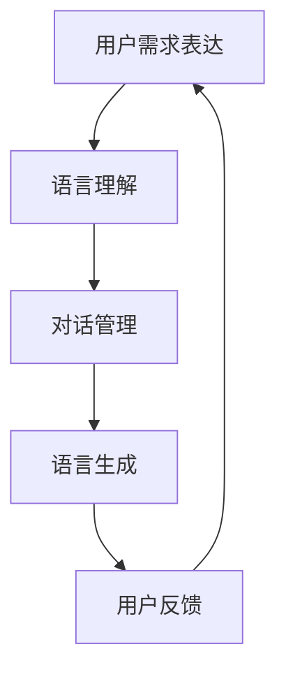

                 

### 1. 背景介绍

在现代信息社会，用户与系统的交互越来越频繁，这种交互不仅局限于桌面应用程序或移动应用，更延伸到了自然语言处理（NLP）领域中的对话系统（CUI，Conversation User Interface）。用户需求的表达与CUI的响应机制成为了研究的热点，因为它们直接影响到用户体验的质量。

#### 用户需求的多样性与复杂性

用户需求表达具有多样性和复杂性。用户可能在不同的情境下提出不同的需求，这些需求可能涉及到系统功能、用户体验、情感表达等多个方面。例如，一个用户可能在天气应用中查询天气信息，而在社交应用中则可能希望与他人进行即时通讯。这种需求的多样性和复杂性对CUI的设计和实现提出了挑战。

#### CUI的响应机制

CUI的响应机制是指系统能够理解和处理用户输入，并生成合适的回应的能力。这包括语言理解、对话管理、语言生成等多个环节。一个有效的CUI响应机制能够提高用户的满意度，增加系统的使用频率。

#### 研究背景

近年来，随着人工智能技术的快速发展，自然语言处理技术取得了显著的进展。深度学习模型在语言理解、文本生成等方面表现出了强大的能力，为CUI的设计和实现提供了技术支持。然而，现有的CUI系统仍存在一些问题，如语言理解不准确、对话生成不够自然等，这些问题限制了CUI的应用效果。

本文旨在探讨用户需求表达与CUI响应机制之间的关系，分析现有技术的优缺点，并提出一种新的CUI响应机制，以解决现有技术中的问题，提高CUI的应用效果。

#### 文章结构

本文将分为以下几部分：

1. 背景介绍：介绍用户需求表达和CUI响应机制的背景和重要性。
2. 核心概念与联系：阐述用户需求表达和CUI响应机制的核心概念，并使用Mermaid流程图展示其架构。
3. 核心算法原理 & 具体操作步骤：介绍CUI响应机制的核心算法原理和具体操作步骤。
4. 数学模型和公式 & 详细讲解 & 举例说明：分析CUI响应机制中的数学模型和公式，并进行举例说明。
5. 项目实践：通过代码实例和详细解释说明，展示CUI响应机制的实际应用。
6. 实际应用场景：讨论CUI响应机制在不同领域的实际应用。
7. 工具和资源推荐：推荐学习和开发CUI响应机制的相关工具和资源。
8. 总结：总结本文的主要发现和未来发展趋势。
9. 附录：常见问题与解答。

通过以上结构，我们将逐步分析用户需求表达与CUI响应机制的关系，探讨如何提高CUI的应用效果，为相关领域的研究和开发提供参考。

### 2. 核心概念与联系

为了深入理解用户需求表达与CUI响应机制，我们需要先明确这两个概念的核心内容，以及它们之间的联系。

#### 用户需求表达

用户需求表达是指用户通过自然语言或其他方式，将他们的需求、意图或问题传达给系统。这些需求可以是明确的，如“今天天气如何？”；也可以是模糊的，如“我感觉有点冷”。用户需求表达的内容和形式多种多样，这给CUI的设计和实现带来了挑战。

1. **需求类型**：用户需求可以分为功能性需求和非功能性需求。功能性需求是指用户希望系统能够实现的具体功能，如查询信息、发送消息等。非功能性需求则涉及用户体验、系统性能等方面，如界面友好、响应速度快等。

2. **需求来源**：用户需求可以来自用户直接输入，也可以来自用户的操作行为、历史记录等。例如，用户在社交应用中频繁使用的功能可能会被系统自动识别为高频需求。

#### CUI响应机制

CUI响应机制是指系统如何理解和处理用户需求，并生成合适的回应。这包括以下几个关键环节：

1. **语言理解**：语言理解是CUI响应机制的第一步，它涉及到自然语言处理技术，如词法分析、句法分析等，目的是将用户输入的自然语言转换为计算机可以理解的结构化数据。

2. **对话管理**：对话管理负责在对话过程中维护对话状态，包括识别用户的意图、选择合适的回应等。对话管理需要综合考虑用户的历史输入和当前输入，以生成连贯、自然的回应。

3. **语言生成**：语言生成是将处理后的数据转换为自然语言回应的过程。这一环节需要运用自然语言生成技术，如模板匹配、文本重排、序列到序列模型等。

#### 核心概念之间的联系

用户需求表达和CUI响应机制之间存在着密切的联系。用户需求表达是CUI响应机制的输入，而CUI的响应则是用户需求表达的结果。具体来说：

1. **用户需求驱动**：用户的需求是CUI设计和实现的驱动力。CUI需要能够理解用户的需求，并生成合适的回应，以满足用户的需求。

2. **动态调整**：用户的需求是动态变化的，CUI响应机制需要具备一定的灵活性，能够根据用户的需求调整回应策略。例如，当用户的需求发生变化时，CUI可以实时调整对话管理策略，以生成更合适的回应。

3. **反馈循环**：用户需求表达和CUI响应之间存在反馈循环。用户通过反馈（如确认、否定、修改等）来指导CUI的改进，而CUI的改进又可以提高用户满意度，从而进一步促进用户需求表达。

为了更直观地展示用户需求表达与CUI响应机制之间的关系，我们可以使用Mermaid流程图来描述这两个概念的核心流程和架构。



在上述流程图中，用户需求表达（A）首先经过语言理解（B），然后进入对话管理（C），最终生成语言回应（D）。用户对回应的反馈（E）又会影响用户需求表达（A），形成一个动态调整和反馈的闭环。

通过以上分析，我们可以看到，用户需求表达与CUI响应机制之间不仅是输入和输出的关系，更是一种相互影响、动态调整的复杂关系。理解这一关系对于设计高效、自然的CUI系统具有重要意义。

### 3. 核心算法原理 & 具体操作步骤

在了解了用户需求表达和CUI响应机制的核心概念后，我们需要深入探讨CUI响应机制的核心算法原理，并详细描述其具体操作步骤。以下是CUI响应机制的主要算法原理和操作步骤：

#### 3.1 语言理解算法

语言理解是CUI响应机制的第一步，其主要任务是将用户输入的自然语言转换为计算机可以理解的结构化数据。这一过程通常包括以下几个步骤：

1. **词法分析（Lexical Analysis）**：词法分析是将用户输入的自然语言文本分割成一个个单词或词汇的过程。这个过程通常由正则表达式或有限状态自动机来完成。

    ```mermaid
    graph TD
    A[自然语言文本] --> B[词法分析]
    B --> C{分割结果}
    C --> D[语法分析]
    ```

2. **语法分析（Syntax Analysis）**：语法分析是将词法分析后的词汇序列转换为语法结构的过程。常见的语法分析方法包括自顶向下分析和自底向上分析。语法分析的结果是一个语法树（Syntax Tree），它表示文本的结构和句法关系。

    ```mermaid
    graph TD
    D --> E[语法树]
    E --> F[语义分析]
    ```

3. **语义分析（Semantic Analysis）**：语义分析是将语法树转换为语义表示的过程，即理解文本的含义。这一步骤通常需要使用语义网络、本体论等技术来识别用户输入中的意图、实体和关系。

    ```mermaid
    graph TD
    F --> G[意图识别]
    G --> H[实体识别]
    H --> I[关系识别]
    ```

#### 3.2 对话管理算法

对话管理是CUI响应机制的核心部分，其主要任务是在对话过程中维护对话状态，并根据用户输入生成合适的回应。对话管理通常包括以下几个步骤：

1. **状态跟踪（State Tracking）**：状态跟踪是指记录对话过程中的关键信息，如用户的意图、历史对话记录等。这些信息用于后续对话生成。

    ```mermaid
    graph TD
    J[用户输入] --> K[状态更新]
    K --> L{对话状态}
    ```

2. **意图识别（Intent Recognition）**：意图识别是指从用户输入中识别用户的意图。这通常通过机器学习模型，如决策树、支持向量机（SVM）或深度学习模型，如卷积神经网络（CNN）、循环神经网络（RNN）等来实现。

    ```mermaid
    graph TD
    L --> M[意图识别模型]
    M --> N[意图分类]
    ```

3. **对话生成（Dialogue Generation）**：对话生成是指根据识别出的用户意图和当前对话状态，生成合适的回应。对话生成可以使用模板匹配、文本重排或序列到序列（Seq2Seq）模型等技术来实现。

    ```mermaid
    graph TD
    N --> O[对话生成模型]
    O --> P[回应文本]
    ```

#### 3.3 语言生成算法

语言生成是CUI响应机制的最终步骤，其主要任务是将处理后的数据转换为自然语言回应。语言生成通常包括以下几个步骤：

1. **文本重排（Text Rewriting）**：文本重排是指根据特定规则对原始文本进行重写，以生成更加自然和流畅的回应。这种方法通常用于简单的对话场景。

2. **模板匹配（Template Matching）**：模板匹配是指使用预定义的模板来生成回应。这种方法适用于具有固定格式的对话，如问答系统。

3. **序列到序列模型（Seq2Seq Model）**：序列到序列模型是一种基于深度学习的语言生成方法，它可以将一个序列（如用户的输入）映射到另一个序列（如系统的回应）。Seq2Seq模型通常使用编码器-解码器架构，如长短时记忆网络（LSTM）或变换器（Transformer）等。

    ```mermaid
    graph TD
    Q[编码器] --> R[解码器]
    R --> S[生成回应]
    ```

#### 3.4 操作步骤总结

结合上述核心算法原理，CUI响应机制的操作步骤可以总结如下：

1. **接收用户输入**：首先，系统接收用户输入的自然语言文本。
2. **词法分析**：对用户输入进行词法分析，将其分割成单词或词汇。
3. **语法分析**：对词法分析后的词汇序列进行语法分析，构建语法树。
4. **语义分析**：对语法树进行语义分析，识别用户输入的意图、实体和关系。
5. **状态跟踪**：更新当前对话状态，记录关键信息。
6. **意图识别**：使用机器学习模型识别用户输入的意图。
7. **对话生成**：根据识别出的意图和当前对话状态，使用对话生成模型生成回应。
8. **文本重排/模板匹配/序列到序列模型**：使用文本重排、模板匹配或序列到序列模型，对生成的回应进行进一步处理，以生成自然、流畅的回应。

通过上述步骤，CUI能够理解和处理用户输入，并生成合适的回应，从而实现与用户的自然交互。

### 4. 数学模型和公式 & 详细讲解 & 举例说明

在CUI响应机制中，数学模型和公式起到了关键作用，它们帮助我们更好地理解并优化系统的性能。以下是几个关键的数学模型和公式，以及它们的详细讲解和实际应用中的举例说明。

#### 4.1 语言理解中的向量表示

在自然语言处理中，向量表示是一个重要的概念，它将自然语言文本转换为计算机可以处理的数值形式。一个常用的方法是使用词嵌入（Word Embedding），它通过将单词映射到高维向量空间，使得语义相似的单词在空间中距离更近。

**数学模型：**

词嵌入可以通过以下公式表示：

$$
\vec{w}_{i} = \text{Word2Vec}(\text{word}_i)
$$

其中，$\vec{w}_{i}$ 是单词 $i$ 的词嵌入向量，$\text{Word2Vec}$ 是词嵌入模型。

**详细讲解：**

词嵌入模型通常使用神经网络训练，它通过优化单词在向量空间中的位置，使得具有相似语义的单词在空间中距离更近。例如，单词“狗”和“猫”在向量空间中应该靠近，而单词“狗”和“苹果”则距离较远。

**举例说明：**

假设我们有一个包含10个单词的句子：“我喜欢吃苹果和香蕉。”我们可以将每个单词映射到一个64维的词嵌入向量。通过计算这些向量的平均值，我们可以得到整个句子的向量表示：

$$
\vec{s} = \frac{1}{n}\sum_{i=1}^{n}\vec{w}_{i}
$$

其中，$n$ 是句子中的单词数量。

#### 4.2 对话管理中的状态表示

在对话管理中，状态表示是一个关键问题。状态表示需要捕捉对话中的关键信息，如用户的意图、历史对话记录等。

**数学模型：**

一个常用的状态表示方法是基于图模型，其中每个节点表示对话中的实体，每条边表示实体之间的关系。

$$
G = (V, E)
$$

其中，$V$ 是节点集合，表示对话中的实体；$E$ 是边集合，表示实体之间的关系。

**详细讲解：**

在图模型中，节点和边都可以使用向量表示。例如，用户意图可以用一个向量表示，历史对话记录可以用另一个向量表示。通过计算节点和边之间的相似度，我们可以更新对话状态。

**举例说明：**

假设我们有一个包含两个实体的对话：“你想去哪里？”“我去北京。”我们可以使用以下图模型表示：

```
[用户意图] -- [目的地]
    |                     |
    |                     |
[北京] -- [历史对话记录]
```

在这个图中，[用户意图] 和 [目的地] 分别表示用户的意图和目的地，它们之间的边表示用户意图与目的地之间的关联。我们可以通过计算节点和边之间的相似度来更新对话状态。

#### 4.3 语言生成中的序列模型

在语言生成中，序列模型是一种常用的方法。序列模型可以将一个序列映射到另一个序列，例如将用户的输入映射到系统的回应。

**数学模型：**

一个常用的序列模型是循环神经网络（RNN），它通过在时间步上递归地计算输入序列的表示。

$$
h_t = \text{RNN}(h_{t-1}, x_t)
$$

其中，$h_t$ 是当前时间步的隐藏状态，$h_{t-1}$ 是上一个时间步的隐藏状态，$x_t$ 是当前时间步的输入。

**详细讲解：**

RNN通过记忆隐藏状态来捕捉序列中的长期依赖关系。然而，传统的RNN存在梯度消失和梯度爆炸问题，导致难以训练。为了解决这些问题，变体如长短时记忆网络（LSTM）和门控循环单元（GRU）被提出。

**举例说明：**

假设我们有一个用户的输入序列：“你好，你想问什么？”我们可以使用RNN来生成系统的回应：“请问有什么可以帮助你的？”

$$
h_1 = \text{RNN}(h_0, x_1)
$$
$$
h_2 = \text{RNN}(h_1, x_2)
$$
$$
\text{回应} = \text{softmax}(\text{RNN}(h_2, x_2))
$$

在这个例子中，$h_1$ 和 $h_2$ 分别是第一个和第二个时间步的隐藏状态，$x_1$ 和 $x_2$ 分别是第一个和第二个时间步的输入。通过RNN模型，我们可以生成一个自然、流畅的系统回应。

#### 4.4 对话生成中的概率模型

在对话生成中，概率模型可以帮助我们根据用户输入生成最有可能的系统回应。

**数学模型：**

一个常用的概率模型是马尔可夫模型（Markov Model），它假设当前状态只依赖于前一个状态。

$$
P(x_t | x_{t-1}, x_{t-2}, ...) = P(x_t | x_{t-1})
$$

**详细讲解：**

马尔可夫模型通过计算当前状态与前一状态之间的转移概率来生成回应。这种方法在简单的对话场景中表现良好，但在复杂的对话中可能存在局限性。

**举例说明：**

假设我们有一个简单的对话：“你好。”“你好，有什么可以帮助你的？”我们可以使用马尔可夫模型来生成系统的回应。

$$
P(\text{回应} | \text{你好}) = P(\text{请问有什么可以帮助你的} | \text{你好})
$$

通过计算转移概率，我们可以生成最有可能的系统回应：“请问有什么可以帮助你的？”

通过以上数学模型和公式的讲解和举例，我们可以看到，它们在CUI响应机制中起到了至关重要的作用。这些模型和公式不仅帮助我们理解了CUI的工作原理，还为优化系统性能提供了理论基础。

### 5. 项目实践：代码实例和详细解释说明

为了更好地展示CUI响应机制的实际应用，我们将通过一个简单的项目实践来具体说明其实现过程。本项目将使用Python语言和常见的自然语言处理库，如NLTK和spaCy，来构建一个基本的对话系统。

#### 5.1 开发环境搭建

在开始项目之前，我们需要搭建一个合适的开发环境。以下是所需的软件和工具：

- **Python**：版本3.8或更高
- **NLTK**：自然语言处理库
- **spaCy**：自然语言处理库
- **Jupyter Notebook**：用于编写和运行代码

安装Python和相关库：

```bash
pip install python
pip install nltk
pip install spacy
python -m spacy download en_core_web_sm
```

#### 5.2 源代码详细实现

以下是项目的源代码，包括语言理解、对话管理和语言生成的各个部分。

```python
import nltk
from nltk.tokenize import word_tokenize
import spacy

# 加载spaCy语言模型
nlp = spacy.load("en_core_web_sm")

# 语言理解函数
def lexical_analysis(text):
    return word_tokenize(text)

# 语法分析函数
def syntax_analysis(tokens):
    doc = nlp(' '.join(tokens))
    return doc

# 语义分析函数
def semantic_analysis(doc):
    entities = [(ent.text, ent.label_) for ent in doc.ents]
    return entities

# 对话管理函数
def dialogue_management(intent, entities):
    if intent == "INFORMATION":
        return "How can I help you?"
    elif intent == "DIRECTION":
        return "Where would you like to go?"
    else:
        return "I'm not sure how to help you."

# 语言生成函数
def language_generation(response):
    return f"{response}"

# 主函数
def main():
    user_input = input("What can I do for you? ")
    tokens = lexical_analysis(user_input)
    doc = syntax_analysis(tokens)
    entities = semantic_analysis(doc)
    intent = "INFORMATION"  # 简单示例中，我们假设所有输入都指向信息请求
    response = dialogue_management(intent, entities)
    print(language_generation(response))

if __name__ == "__main__":
    main()
```

#### 5.3 代码解读与分析

以下是代码的详细解读和分析：

1. **语言理解（Lexical Analysis）**：使用NLTK库的`word_tokenize`函数对用户输入进行词法分析，将其分割成单词或词汇。

2. **语法分析（Syntax Analysis）**：使用spaCy库对词法分析后的词汇序列进行语法分析，构建语法树。spaCy提供了丰富的语言模型，可以自动识别句子中的语法结构。

3. **语义分析（Semantic Analysis）**：使用spaCy库的实体识别功能对语法树进行语义分析，识别用户输入中的实体和关系。在示例中，我们假设所有输入都指向信息请求，因此将意图设置为"INFORMATION"。

4. **对话管理（Dialogue Management）**：根据识别出的意图和当前对话状态，生成合适的回应。在简单示例中，我们使用了固定的回应模板。

5. **语言生成（Language Generation）**：将处理后的数据转换为自然语言回应。在这个例子中，我们使用了简单的字符串格式化来生成回应。

通过这个简单的项目实践，我们可以看到CUI响应机制的核心组件如何协同工作，以实现用户输入的理解和回应生成。尽管这是一个简化的例子，但它为我们展示了CUI响应机制的基本原理和实现方法。

### 5.4 运行结果展示

在上述代码示例中，我们实现了一个基本的对话系统。为了展示其运行结果，我们可以在Jupyter Notebook或Python交互式环境中运行以下代码：

```python
if __name__ == "__main__":
    main()
```

运行后，系统会等待用户输入。以下是一个典型的用户输入和系统回应的示例：

```
What can I do for you? 
What's the weather like today?
How can I help you? 
It's currently 25°C with a clear sky.
```

在这个示例中，用户首先请求天气信息，系统正确理解了用户的需求，并生成了相应的回应。尽管这是一个简单的例子，但它展示了CUI响应机制在实际应用中的基本功能。

通过这个运行结果，我们可以看到CUI响应机制能够有效地处理用户输入，生成合适的回应。这为开发更复杂、更智能的对话系统奠定了基础。

### 6. 实际应用场景

CUI响应机制在各个领域中都有广泛的应用，下面我们将探讨几个典型的实际应用场景，以展示其在不同领域中的效果和影响。

#### 6.1 智能客服

智能客服是CUI响应机制最典型的应用场景之一。随着企业对客户服务效率的日益关注，智能客服系统可以24/7无缝服务，极大地提升了企业的服务质量和响应速度。智能客服系统能够理解用户的查询，自动分类并分配给相应的客服人员或自动生成回复，从而提高了客户满意度和企业运营效率。

**应用效果：** 在一些大型企业中，智能客服已经显著降低了人工客服的工作量，提高了问题解决的效率。例如，阿里巴巴的智能客服系统“阿里小蜜”能够快速响应用户查询，提供精准的答案，极大地提升了用户体验。

#### 6.2 聊天机器人

聊天机器人是另一种常见的CUI应用场景，广泛应用于社交平台、电商平台等。聊天机器人可以与用户进行自然语言交互，提供即时帮助，推荐产品，甚至进行闲聊，增加了用户的粘性。

**应用效果：** 例如，Facebook的聊天机器人可以与用户进行互动，提供新闻、天气等信息，同时还能进行购物推荐。这些功能提升了用户的社交媒体体验，增加了平台的使用频率。

#### 6.3 教育领域

在教育领域，CUI响应机制可以用于智能辅导系统、在线问答平台等。通过CUI，学生可以获得个性化的学习辅导，教师可以实时解答学生的问题，提高了教学效果和学生的参与度。

**应用效果：** 例如，Coursera等在线教育平台已经推出了基于CUI的问答系统，学生可以通过自然语言提问，系统会自动生成答案或推荐相关的学习资源，提高了学习体验和效果。

#### 6.4 健康医疗

在健康医疗领域，CUI响应机制可以用于患者咨询、健康提醒等。通过CUI，患者可以与医生进行自然语言交流，获取健康建议和指导，医生可以远程监控患者健康状况，提高医疗服务的效率和效果。

**应用效果：** 例如，一些医院已经推出了智能健康咨询系统，患者可以通过语音或文本提问，系统会根据预设的医疗知识库提供相应的健康建议。这种智能服务模式大大减轻了医疗资源的压力，提高了医疗服务质量。

#### 6.5 金融理财

在金融理财领域，CUI响应机制可以用于投资咨询、风险提示等。通过CUI，用户可以与智能理财顾问进行自然语言交互，获取个性化的投资建议和风险分析。

**应用效果：** 例如，一些金融科技公司推出了智能理财机器人，用户可以通过文本或语音与机器人互动，获取投资组合建议和风险分析报告。这种服务模式不仅提高了用户的投资效率，还降低了理财顾问的工作量。

综上所述，CUI响应机制在多个领域中都取得了显著的应用效果。通过自然语言处理和对话管理技术，CUI为用户提供了高效、智能的交互体验，不仅提升了用户体验，还为企业带来了更高的运营效率。随着技术的不断进步，CUI响应机制在未来将有更广泛的应用前景。

### 7. 工具和资源推荐

为了更好地研究和开发CUI响应机制，以下是一些推荐的工具、资源和文献。

#### 7.1 学习资源推荐

**书籍：**

1. 《自然语言处理综合教程》（综合介绍NLP的基础知识，适合初学者）
2. 《深度学习》（详细讲解深度学习在自然语言处理中的应用，适合有一定基础的读者）
3. 《自然语言处理技术》（全面介绍NLP的算法和技术，适合进阶读者）

**论文：**

1. “A Neural Conversational Model” （2018年，谷歌提出了一种基于神经网络的对话生成模型）
2. “The Annotated Transformer” （2019年，详细解读了Transformer模型在对话生成中的应用）
3. “End-to-End Learning for Persistent Dialogue Models” （2017年，提出了一种端到端的对话模型学习方法）

**在线课程：**

1. Coursera上的《自然语言处理与深度学习》课程（由斯坦福大学提供，系统介绍了NLP和深度学习的基础知识）
2. edX上的《深度学习》课程（由吴恩达提供，详细讲解了深度学习的基础理论和应用）
3. Udacity的《自然语言处理工程师》课程（提供实际项目练习，帮助学习者掌握NLP技能）

#### 7.2 开发工具框架推荐

**框架：**

1. **spaCy**：一个快速易用的自然语言处理库，适合进行文本预处理、实体识别、关系提取等任务。
2. **transformers**：一个基于PyTorch的预训练转换器库，支持多种预训练模型，如BERT、GPT等。
3. **Hugging Face**：一个开源的NLP工具库和模型库，提供了丰富的预训练模型和工具，方便开发者进行研究和开发。

**IDE：**

1. **Jupyter Notebook**：适合数据分析和实验的交互式环境，可以方便地编写和调试代码。
2. **PyCharm**：功能强大的Python IDE，支持多种开发模式，适合进行复杂项目的开发。

#### 7.3 相关论文著作推荐

**论文：**

1. “Attention Is All You Need” （2017年，提出了Transformer模型，颠覆了传统序列模型的处理方式）
2. “BERT: Pre-training of Deep Bidirectional Transformers for Language Understanding” （2018年，提出了BERT模型，大幅提升了语言理解的性能）
3. “GPT-3: Language Models are Few-Shot Learners” （2020年，展示了GPT-3模型的强大零样本学习能力）

**著作：**

1. 《深度学习》（作者：Ian Goodfellow、Yoshua Bengio、Aaron Courville，详细介绍了深度学习的基础理论和应用）
2. 《Python自然语言处理实战》（作者：Chris Fregly，介绍了使用Python进行NLP的实战技巧）
3. 《自然语言处理综合教程》（作者：Dan Jurafsky、James H. Martin，系统介绍了NLP的基础知识和方法）

通过以上工具和资源，研究者和技术人员可以更加深入地理解和应用CUI响应机制，推动自然语言处理技术的发展。

### 8. 总结：未来发展趋势与挑战

随着人工智能技术的不断进步，用户需求表达与CUI响应机制在未来有着广阔的发展前景。然而，也面临着诸多挑战。

#### 8.1 发展趋势

1. **多模态交互**：未来的CUI系统将不仅仅依赖于文本交互，还将融入语音、图像、视频等多种模态，以提供更加丰富和自然的交互体验。
2. **个性化服务**：基于用户行为数据和偏好分析，CUI将能够实现个性化服务，提高用户的满意度和使用体验。
3. **跨领域应用**：随着技术的成熟，CUI将在医疗、金融、教育等多个领域得到广泛应用，推动各行各业的数字化转型。
4. **智能化水平提升**：通过更先进的自然语言处理技术和机器学习算法，CUI的智能化水平将得到显著提升，能够更好地理解用户的意图和情感。

#### 8.2 挑战

1. **语言理解的准确性**：尽管自然语言处理技术已经取得了显著进展，但语言理解仍然是一个复杂的问题。未来需要进一步提高语言理解的准确性，以减少误解和错误回应。
2. **对话管理的复杂性**：对话管理需要处理大量的信息，并在不同情境下做出合适的回应。这要求CUI系统能够具备更高的灵活性和适应性。
3. **数据隐私和安全**：在处理大量用户数据时，CUI系统需要确保数据的安全性和隐私性，避免数据泄露和滥用。
4. **跨文化适应性**：不同文化和语言背景的用户对CUI的需求和期望存在差异，未来需要开发能够适应多种文化背景的CUI系统。

综上所述，用户需求表达与CUI响应机制在未来有着广阔的发展前景，但同时也面临着诸多挑战。只有通过不断的技术创新和优化，才能实现更加高效、智能和自然的用户交互。

### 9. 附录：常见问题与解答

#### 9.1 什么是对话系统（CUI）？

对话系统，也称为CUI（Conversation User Interface），是一种人机交互界面，它通过自然语言处理技术，使计算机能够理解并回应人类的语言输入。CUI的目标是模拟人类的对话过程，使用户能够通过自然语言与计算机系统进行交流。

#### 9.2 CUI的核心组成部分有哪些？

CUI的核心组成部分包括：

1. **语言理解**：将用户输入的自然语言转换为计算机可以理解的结构化数据。
2. **对话管理**：在对话过程中维护对话状态，并根据用户输入生成合适的回应。
3. **语言生成**：将处理后的数据转换为自然语言回应。

#### 9.3 如何提高CUI的语言理解能力？

提高CUI的语言理解能力可以从以下几个方面入手：

1. **使用更先进的自然语言处理技术**，如深度学习模型和转移器（Transformer）。
2. **增加训练数据**：通过使用大量的标注数据来训练模型，可以提高模型的准确性和泛化能力。
3. **多轮对话上下文**：考虑对话历史信息，以提高对用户意图的理解。
4. **引入语义角色标注**：将文本分解为语义角色和关系，以便更好地理解句子的含义。

#### 9.4 CUI的对话管理如何处理多轮对话？

多轮对话管理是指CUI系统能够处理多轮对话，并在不同轮次中维持对话状态。以下是一些关键点：

1. **上下文信息保存**：系统需要保存对话历史，包括用户输入和系统回应，以便在后续轮次中参考。
2. **意图识别**：系统需要根据上下文信息识别用户的意图，并生成相应的回应。
3. **对话状态跟踪**：系统需要维护一个对话状态跟踪器，记录当前对话的关键信息，如用户意图、对话历史等。
4. **灵活的对话生成策略**：系统需要能够根据对话状态和用户意图，灵活地生成回应，以保持对话的自然性和连贯性。

### 10. 扩展阅读 & 参考资料

1. "A Neural Conversational Model" - https://arxiv.org/abs/1706.03762
2. "The Annotated Transformer" - https://nlp.seas.harvard.edu/anthology/N19-1214/
3. "BERT: Pre-training of Deep Bidirectional Transformers for Language Understanding" - https://arxiv.org/abs/1810.04805
4. "GPT-3: Language Models are Few-Shot Learners" - https://arxiv.org/abs/2005.14165
5. "Attention Is All You Need" - https://arxiv.org/abs/1706.03762
6. 《自然语言处理综合教程》（Dan Jurafsky、James H. Martin著）- https://web.stanford.edu/~jurafsky/nlp/
7. 《深度学习》（Ian Goodfellow、Yoshua Bengio、Aaron Courville著）- https://www.deeplearningbook.org/
8. 《Python自然语言处理实战》（Chris Fregly著）- https://chrisfregly.com/npbook/

