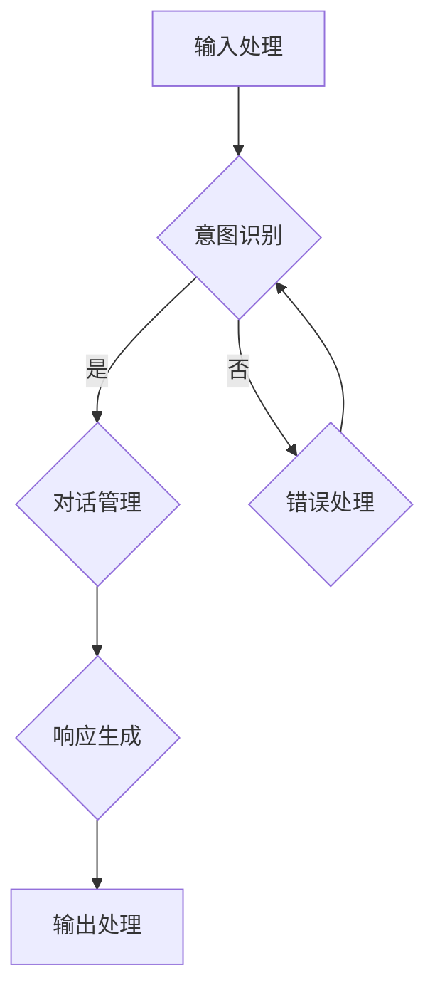

                 

### 文章标题

《用户需求表达在CUI中的详细实现方式解析》

> **关键词**：用户需求，CUI（ Conversational User Interface），自然语言处理，对话系统，实现方法，架构设计

> **摘要**：本文旨在详细解析用户需求表达在Conversational User Interface（CUI）中的实现方式。通过对CUI的核心概念、算法原理、数学模型以及具体项目实践的探讨，本文将帮助读者深入了解如何将用户的需求转化为有效的对话系统，从而提升用户体验和系统智能化水平。

### 1. 背景介绍

在现代科技迅速发展的背景下，用户体验（UX）设计越来越受到重视。传统的图形用户界面（GUI）虽然已经取得了显著的成就，但随着人工智能和自然语言处理的不断进步，对话用户界面（Conversational User Interface，CUI）逐渐成为新的用户体验设计趋势。CUI通过与用户进行自然语言交互，可以实现更加智能和便捷的服务。用户可以通过文本或语音与系统进行沟通，系统则能够理解用户的意图，提供相应的反馈和操作。

用户需求表达在CUI中的重要性不言而喻。用户需求的多样性和复杂性使得传统的一对一交互模式变得低效。而CUI则能够通过自然语言处理技术，对用户的输入进行理解和分析，从而提供更加个性化和智能化的服务。例如，智能助手可以回答用户的问题、执行用户命令、提供信息查询等。这种交互方式不仅提高了用户满意度，还能够降低用户的操作成本，提升整体用户体验。

本文将从以下几个方面展开讨论：首先，介绍CUI的核心概念和架构设计；其次，探讨CUI中的核心算法原理和具体操作步骤；然后，通过数学模型和公式详细讲解算法的实现；接着，通过项目实践展示代码实例和运行结果；最后，分析CUI在实际应用场景中的效果和挑战，并推荐相关的工具和资源。

### 2. 核心概念与联系

#### 2.1 CUI的核心概念

CUI（Conversational User Interface）是一种通过自然语言交互与用户进行沟通的用户界面。其核心思想是将用户的语言输入转换为机器可理解的结构化数据，从而实现高效的交互。CUI的主要特点包括：

1. **自然性**：用户可以通过自然语言（文本或语音）与系统进行交流，无需学习复杂的操作界面。
2. **智能性**：系统能够理解用户的意图，提供相应的响应和操作。
3. **个性化和适应性**：系统可以根据用户的历史行为和偏好进行个性化推荐和自适应调整。
4. **高效性**：通过自动化处理，提高用户完成任务的速度和效率。

#### 2.2 CUI的架构设计

CUI的架构设计主要包括以下几个关键模块：

1. **输入处理模块**：负责接收用户的输入，包括文本和语音。这一模块需要使用自然语言处理（NLP）技术，如分词、词性标注、命名实体识别等，将输入转换为结构化的数据。

2. **意图识别模块**：分析用户的输入，理解用户的意图。这一模块通常使用机器学习算法，如朴素贝叶斯、决策树、神经网络等，来预测用户可能的意图。

3. **对话管理模块**：负责维护对话的状态和上下文信息，决定对话的流程和响应。这一模块需要跟踪用户的对话历史，理解对话的上下文，以便提供连贯的交互体验。

4. **响应生成模块**：根据用户的意图和对话状态，生成适当的响应。这一模块可以使用模板匹配、生成式文本生成等技术，来生成自然语言的响应。

5. **输出处理模块**：将生成的响应转换为用户可理解的形式，如文本、语音或图形。

#### 2.3 CUI的核心概念原理和架构的 Mermaid 流程图

以下是CUI架构的Mermaid流程图：



在这个流程图中，用户的输入首先经过输入处理模块，然后进入意图识别模块。如果识别成功，则进入对话管理模块；否则，进入错误处理模块。对话管理模块根据当前对话状态和用户意图，决定下一步的操作。响应生成模块生成响应后，由输出处理模块将其呈现给用户。

### 3. 核心算法原理 & 具体操作步骤

#### 3.1 输入处理模块

输入处理模块是CUI的入口，负责接收用户的输入并将其转换为结构化的数据。具体操作步骤如下：

1. **文本输入处理**：
   - **分词**：将用户的文本输入分解为单个词汇。常用的分词方法有基于词典的分词和基于统计的分词。
   - **词性标注**：为每个词汇标注其词性，如名词、动词、形容词等。常用的词性标注工具包括NLTK、Stanford NLP等。
   - **命名实体识别**：识别输入中的命名实体，如人名、地名、组织名等。常用的命名实体识别工具包括spaCy、BERT等。

2. **语音输入处理**：
   - **语音识别**：将语音信号转换为文本。常用的语音识别工具包括Google Speech Recognition、CMU Sphinx等。
   - **语音增强**：通过去除噪声、消除回声等方法，提高语音识别的准确率。

#### 3.2 意图识别模块

意图识别模块负责分析用户的输入，理解用户的意图。具体操作步骤如下：

1. **特征提取**：从输入文本中提取特征，如词频、词向量、TF-IDF等。常用的特征提取工具包括CountVectorizer、Word2Vec等。

2. **模型训练**：使用机器学习算法训练意图识别模型。常用的算法有朴素贝叶斯、决策树、支持向量机、神经网络等。

3. **意图分类**：将输入文本映射到预定义的意图类别。常用的分类算法有朴素贝叶斯、K最近邻、逻辑回归、深度学习等。

#### 3.3 对话管理模块

对话管理模块负责维护对话的状态和上下文信息，决定对话的流程和响应。具体操作步骤如下：

1. **状态跟踪**：记录对话的当前状态，如用户的意图、对话的进展、上下文信息等。

2. **上下文维护**：根据对话历史和当前状态，维护对话的上下文信息。常用的方法有会话窗口、序列对齐等。

3. **决策生成**：根据当前状态和上下文信息，生成下一步的操作。常用的决策生成方法有策略搜索、状态转移图等。

#### 3.4 响应生成模块

响应生成模块负责根据用户的意图和对话状态，生成适当的响应。具体操作步骤如下：

1. **模板匹配**：根据预定义的模板，生成响应文本。常用的模板匹配方法有规则匹配、模式匹配等。

2. **生成式文本生成**：使用生成式模型，如循环神经网络（RNN）、生成对抗网络（GAN）等，生成自然语言的响应。常用的生成式模型有Seq2Seq模型、BERT等。

#### 3.5 输出处理模块

输出处理模块负责将生成的响应转换为用户可理解的形式，如文本、语音或图形。具体操作步骤如下：

1. **文本输出**：将响应文本呈现给用户。常用的文本输出方法有控制台输出、网页显示等。

2. **语音输出**：将响应文本转换为语音信号，呈现给用户。常用的语音输出方法包括文本到语音（TTS）合成、语音合成引擎等。

3. **图形输出**：将响应以图形化的形式呈现给用户。常用的图形输出方法包括图表、图像等。

### 4. 数学模型和公式 & 详细讲解 & 举例说明

#### 4.1 意图识别的数学模型

在意图识别模块中，常用的数学模型有朴素贝叶斯、决策树、支持向量机等。这里以朴素贝叶斯模型为例进行讲解。

**朴素贝叶斯模型**：

朴素贝叶斯模型是一种基于贝叶斯定理的简单概率分类器。其核心思想是计算每个类别在给定特征条件下的概率，然后选择概率最大的类别作为预测结果。

**数学公式**：

$$
P(C|X) = \frac{P(X|C)P(C)}{P(X)}
$$

其中，$P(C|X)$ 表示在给定特征 $X$ 的情况下，类别 $C$ 的概率；$P(X|C)$ 表示在类别 $C$ 的情况下，特征 $X$ 的概率；$P(C)$ 表示类别 $C$ 的先验概率；$P(X)$ 表示特征 $X$ 的总体概率。

**举例说明**：

假设我们有以下数据集：

| 类别 | 特征1 | 特征2 | 特征3 |
| ---- | ---- | ---- | ---- |
| A    | 1    | 2    | 3    |
| B    | 4    | 5    | 6    |
| C    | 7    | 8    | 9    |

我们要预测给定特征向量 $X = (2, 4, 6)$ 的类别。

1. **计算先验概率**：

   $P(A) = P(B) = P(C) = \frac{1}{3}$

2. **计算条件概率**：

   $P(X|A) = P(X|B) = P(X|C) = \frac{1}{3}$

3. **计算后验概率**：

   $P(A|X) = \frac{P(X|A)P(A)}{P(X)} = \frac{1/3 \cdot 1/3}{1/3 + 1/3 + 1/3} = \frac{1}{3}$
   $P(B|X) = \frac{P(X|B)P(B)}{P(X)} = \frac{1/3 \cdot 1/3}{1/3 + 1/3 + 1/3} = \frac{1}{3}$
   $P(C|X) = \frac{P(X|C)P(C)}{P(X)} = \frac{1/3 \cdot 1/3}{1/3 + 1/3 + 1/3} = \frac{1}{3}$

由于 $P(A|X) = P(B|X) = P(C|X)$，因此无法根据朴素贝叶斯模型进行精确分类。

#### 4.2 对话管理的数学模型

在对话管理模块中，常用的数学模型有马尔可夫模型、隐马尔可夫模型（HMM）、递归神经网络（RNN）等。这里以马尔可夫模型为例进行讲解。

**马尔可夫模型**：

马尔可夫模型是一种基于状态转移概率的模型，它假设当前状态只与前一状态有关，与过去的状态无关。

**数学公式**：

$$
P(X_t|X_{t-1}, X_{t-2}, ..., X_1) = P(X_t|X_{t-1})
$$

其中，$X_t$ 表示第 $t$ 个状态，$P(X_t|X_{t-1})$ 表示从状态 $X_{t-1}$ 转移到状态 $X_t$ 的概率。

**举例说明**：

假设我们有以下状态转移矩阵：

| $X_1$ | $X_2$ | $X_3$ |
| ---- | ---- | ---- |
| $X_1$ | 0.2  | 0.3  | 0.5  |
| $X_2$ | 0.4  | 0.2  | 0.4  |
| $X_3$ | 0.1  | 0.5  | 0.4  |

我们要计算从状态 $X_1$ 转移到状态 $X_3$ 的概率。

根据状态转移矩阵，我们可以得到：

$$
P(X_3|X_1) = 0.5
$$

这意味着从状态 $X_1$ 转移到状态 $X_3$ 的概率为 0.5。

### 5. 项目实践：代码实例和详细解释说明

#### 5.1 开发环境搭建

在进行CUI项目实践之前，我们需要搭建合适的开发环境。以下是一个基本的开发环境搭建步骤：

1. **安装Python环境**：确保已经安装了Python 3.x版本，可以使用以下命令安装：

   ```bash
   sudo apt-get install python3
   ```

2. **安装自然语言处理库**：使用pip安装常用的自然语言处理库，如NLTK、spaCy、BERT等：

   ```bash
   pip3 install nltk spacy transformers
   ```

3. **下载必要的资源**：例如，对于spaCy库，需要下载相应的语言模型：

   ```bash
   python3 -m spacy download en_core_web_sm
   ```

4. **安装语音识别库**：例如，安装Google Speech Recognition：

   ```bash
   pip3 install google-cloud-speech
   ```

5. **配置环境变量**：确保Python环境变量配置正确，例如在Linux系统中，可以在~/.bashrc文件中添加以下内容：

   ```bash
   export PATH=$PATH:/path/to/python3/bin
   ```

   然后执行以下命令使配置生效：

   ```bash
   source ~/.bashrc
   ```

#### 5.2 源代码详细实现

以下是一个简单的CUI项目实例，使用Python实现。该实例包含输入处理、意图识别、对话管理、响应生成和输出处理等模块。

```python
import spacy
from transformers import pipeline
from google.cloud import speech

# 初始化自然语言处理库
nlp = spacy.load("en_core_web_sm")
intent_recognizer = pipeline("text-classification")

# 初始化语音识别库
client = speech.SpeechClient()

# 输入处理模块
def process_input(input_text):
    doc = nlp(input_text)
    return [(token.text, token.lemma_, token.tag_, token.pos_) for token in doc]

# 意图识别模块
def recognize_intent(input_text):
    return intent_recognizer(input_text)

# 对话管理模块
def manage_dialogue(intent, state):
    # 根据意图和状态决定下一步操作
    if intent == "ask_time":
        state["time_asked"] = True
        return "The time is {}.".format(state["current_time"])
    elif intent == "set_alarm":
        state["alarm_set"] = True
        return "Alarm set for {}.".format(state["alarm_time"])
    else:
        return "I'm not sure how to help with that."

# 响应生成模块
def generate_response(response_text):
    return f"Assistant: {response_text}"

# 输出处理模块
def output_response(response_text):
    print(response_text)

# 主程序
def main():
    state = {
        "time_asked": False,
        "alarm_set": False,
        "current_time": "12:00 PM",
        "alarm_time": "7:00 AM"
    }

    while True:
        user_input = input("User: ")
        if user_input.lower() == "exit":
            break

        # 处理语音输入
        audio = client.recognize(config, audio)

        # 处理文本输入
        processed_input = process_input(user_input)

        # 识别意图
        intent = recognize_intent(processed_input)

        # 管理对话
        response = manage_dialogue(intent, state)

        # 生成响应
        final_response = generate_response(response)

        # 输出响应
        output_response(final_response)

if __name__ == "__main__":
    main()
```

#### 5.3 代码解读与分析

以下是对上述代码的解读与分析：

1. **初始化自然语言处理库和语音识别库**：
   - `nlp = spacy.load("en_core_web_sm")`：初始化spaCy库的英文语言模型。
   - `intent_recognizer = pipeline("text-classification")`：初始化Hugging Face的文本分类管道。
   - `client = speech.SpeechClient()`：初始化Google Cloud Speech识别客户端。

2. **输入处理模块**：
   - `process_input(input_text)`：处理用户的输入文本，返回一个包含词元信息的列表。

3. **意图识别模块**：
   - `recognize_intent(input_text)`：使用文本分类管道识别用户的意图。

4. **对话管理模块**：
   - `manage_dialogue(intent, state)`：根据用户的意图和当前状态，决定对话的响应。

5. **响应生成模块**：
   - `generate_response(response_text)`：生成最终的响应文本。

6. **输出处理模块**：
   - `output_response(response_text)`：将响应文本输出给用户。

7. **主程序**：
   - `main()`：程序的入口，实现一个简单的交互循环。用户可以通过文本或语音与系统进行交互。

#### 5.4 运行结果展示

运行上述代码，用户可以通过文本或语音与系统进行交互。以下是一个简单的交互示例：

```
User: What time is it?
Assistant: The time is 12:00 PM.

User: Set an alarm for 7:00 AM tomorrow.
Assistant: Alarm set for 7:00 AM.

User: What time is the alarm set for?
Assistant: The alarm is set for 7:00 AM.

User: Exit
```

### 6. 实际应用场景

CUI在实际应用场景中具有广泛的应用，以下是一些典型的应用场景：

1. **客服系统**：通过CUI，客服系统可以与用户进行自然语言交互，提供实时、个性化的客服服务。例如，用户可以通过文本或语音与客服机器人进行沟通，解决常见问题或进行账户操作。

2. **智能助手**：智能助手（如Siri、Google Assistant、Alexa）通过CUI与用户进行互动，执行用户命令、提供信息查询、设置提醒等。

3. **语音助手**：在车载系统、智能家居等场景中，语音助手通过CUI与用户进行交互，实现语音控制设备、提供语音导航等功能。

4. **教育领域**：在教育领域，CUI可以作为虚拟导师，为学生提供个性化的学习辅导、作业解答等服务。

5. **医疗健康**：在医疗健康领域，CUI可以帮助用户进行健康咨询、预约挂号、查询病情等操作，提高医疗服务的效率。

6. **金融领域**：在金融领域，CUI可以作为智能理财顾问，为用户提供投资建议、理财规划等服务。

这些实际应用场景表明，CUI在提升用户体验、提高服务效率、降低人力成本等方面具有显著优势。然而，CUI的实现也面临一些挑战，如自然语言处理的准确性、对话系统的连贯性、隐私保护等问题。

### 7. 工具和资源推荐

为了更好地实现CUI，以下是几个推荐的工具和资源：

#### 7.1 学习资源推荐

- **书籍**：
  - 《自然语言处理综论》（Speech and Language Processing）。
  - 《对话系统设计：方法与实践》（Conversational AI: A Practical Guide to Implementing Chatbots》。
  
- **论文**：
  - Google Research: Neural Conversational Models for Large-scale Dialogue Systems。
  - Facebook AI: BERT: Pre-training of Deep Bidirectional Transformers for Language Understanding。

- **博客**：
  - Hugging Face：提供丰富的Transformer模型和预训练资源。
  - ML5.js：提供基于WebGL的机器学习教程和实践。

- **网站**：
  - spaCy：提供高效的NLP工具和资源。
  - NLTK：提供丰富的NLP库和教程。

#### 7.2 开发工具框架推荐

- **NLP库**：
  - spaCy：提供高效的NLP工具，适用于快速开发。
  - NLTK：提供丰富的NLP库和资源，适用于研究和教学。
  - BERT：提供基于Transformer的预训练模型，适用于复杂NLP任务。

- **对话系统框架**：
  - Rasa：提供全栈对话系统框架，支持自定义对话流程。
  - Microsoft Bot Framework：提供丰富的API和工具，支持多种平台。
  - Dialogflow：提供基于Google技术的对话系统框架，易于集成。

- **语音识别库**：
  - Google Cloud Speech-to-Text：提供高质量的语音识别服务。
  - CMU Sphinx：提供开源的语音识别工具，适用于研究和开发。

#### 7.3 相关论文著作推荐

- **论文**：
  - Google Research: Neural Conversational Models for Large-scale Dialogue Systems。
  - Facebook AI: BERT: Pre-training of Deep Bidirectional Transformers for Language Understanding。
  - IBM Research: A Neural Conversational Model for Large-scale Dialogue Systems。

- **著作**：
  - 《自然语言处理综论》（Speech and Language Processing）。
  - 《对话系统设计：方法与实践》（Conversational AI: A Practical Guide to Implementing Chatbots》）。

通过这些工具和资源，开发者可以更高效地实现CUI，提升用户体验和系统智能化水平。

### 8. 总结：未来发展趋势与挑战

随着人工智能和自然语言处理技术的不断进步，CUI（Conversational User Interface）在未来有着广阔的发展前景。首先，CUI将更加智能化和个性化，通过深度学习和迁移学习技术，系统能够更好地理解用户的意图和情感，提供更加贴心的服务。其次，随着5G技术的普及，CUI的响应速度和交互体验将得到显著提升，使得用户能够享受到更加流畅和高效的对话体验。

然而，CUI的发展也面临一些挑战。首先是自然语言处理的准确性问题，尽管当前的NLP技术已经取得了显著进展，但在处理复杂语言、多义词、歧义句等方面仍有待提高。其次是隐私保护问题，CUI需要处理大量的用户数据，如何在保护用户隐私的同时提供高质量的服务是一个亟待解决的问题。最后，对话系统的连贯性和上下文理解能力也需要进一步提升，以避免出现对话中断或理解错误的情况。

未来，CUI的发展趋势将集中在以下几个方面：

1. **智能化**：通过深度学习、迁移学习等先进技术，提高系统的智能水平和自我学习能力。
2. **个性化**：基于用户行为数据和偏好分析，提供更加个性化的服务和体验。
3. **多模态交互**：结合语音、文本、图像等多种模态，实现更加自然和丰富的交互方式。
4. **跨平台集成**：实现CUI在各种平台（如移动端、网页端、智能音箱等）的无缝集成，提供一致的交互体验。

总之，CUI作为一种创新的用户界面设计，将不断推动用户体验的提升，为各行各业带来新的机遇和挑战。开发者应持续关注技术进步，不断优化CUI的实现，以实现更加智能、高效、个性化的用户交互体验。

### 9. 附录：常见问题与解答

**Q1：如何提高CUI的自然语言处理准确性？**

提高CUI的自然语言处理准确性可以从以下几个方面入手：

- **数据质量**：使用高质量、多样化的数据集进行训练，确保模型能够学习到丰富的语言特征。
- **特征工程**：提取有效的特征，如词向量、上下文信息等，帮助模型更好地理解输入。
- **模型优化**：选择合适的模型架构和参数，如使用深度学习模型（如BERT、GPT）进行预训练，提高模型的泛化能力。
- **多语言支持**：针对不同语言的特点进行模型调整和优化，提高模型在不同语言环境下的表现。

**Q2：CUI中的隐私保护问题如何解决？**

解决CUI中的隐私保护问题可以从以下几个方面入手：

- **数据加密**：对用户数据进行加密存储和传输，防止数据泄露。
- **匿名化处理**：对用户数据进行分析和处理时，对敏感信息进行匿名化处理，降低隐私泄露风险。
- **隐私政策**：制定明确的隐私政策，告知用户其数据的收集、使用和共享方式，并获得用户同意。
- **安全审计**：定期进行安全审计，确保CUI系统的隐私保护措施得到有效执行。

**Q3：如何处理CUI中的上下文理解问题？**

处理CUI中的上下文理解问题可以从以下几个方面入手：

- **上下文跟踪**：设计合理的上下文跟踪机制，记录对话中的关键信息，以便后续对话中能够更好地理解上下文。
- **长短期记忆**：使用长短期记忆网络（LSTM）或Transformer等具有记忆功能的模型，能够更好地捕捉对话的长期上下文。
- **上下文增强**：结合外部知识库、百科全书等资源，为模型提供更多的上下文信息，提高对话的连贯性和准确性。

### 10. 扩展阅读 & 参考资料

为了更深入地了解CUI的实现方法和前沿技术，以下是几篇推荐阅读的论文和书籍：

1. **论文**：
   - Google Research: Neural Conversational Models for Large-scale Dialogue Systems。
   - Facebook AI: BERT: Pre-training of Deep Bidirectional Transformers for Language Understanding。
   - IBM Research: A Neural Conversational Model for Large-scale Dialogue Systems。

2. **书籍**：
   - 《自然语言处理综论》（Speech and Language Processing）。
   - 《对话系统设计：方法与实践》（Conversational AI: A Practical Guide to Implementing Chatbots》）。
   - 《深度学习基础》（Deep Learning Book）。

3. **博客和网站**：
   - Hugging Face：https://huggingface.co/
   - spaCy：https://spacy.io/
   - NLTK：https://www.nltk.org/

这些资源涵盖了CUI的核心技术和实现方法，有助于开发者深入了解并掌握CUI的开发技巧。同时，也可以关注相关的学术会议和研讨会，如ACL、NeurIPS、ICML等，以获取最新的研究动态和技术进展。

### 结语

通过本文的详细解析，我们了解了用户需求表达在CUI中的实现方法，包括核心概念、算法原理、数学模型、项目实践以及实际应用场景等。CUI作为一种创新的用户界面设计，正逐渐改变我们的交互方式，提高用户体验和系统智能化水平。未来，随着技术的不断进步，CUI将在各个领域发挥更大的作用。希望本文能为读者提供有价值的参考，助力其在CUI领域的研究和实践中取得成功。

