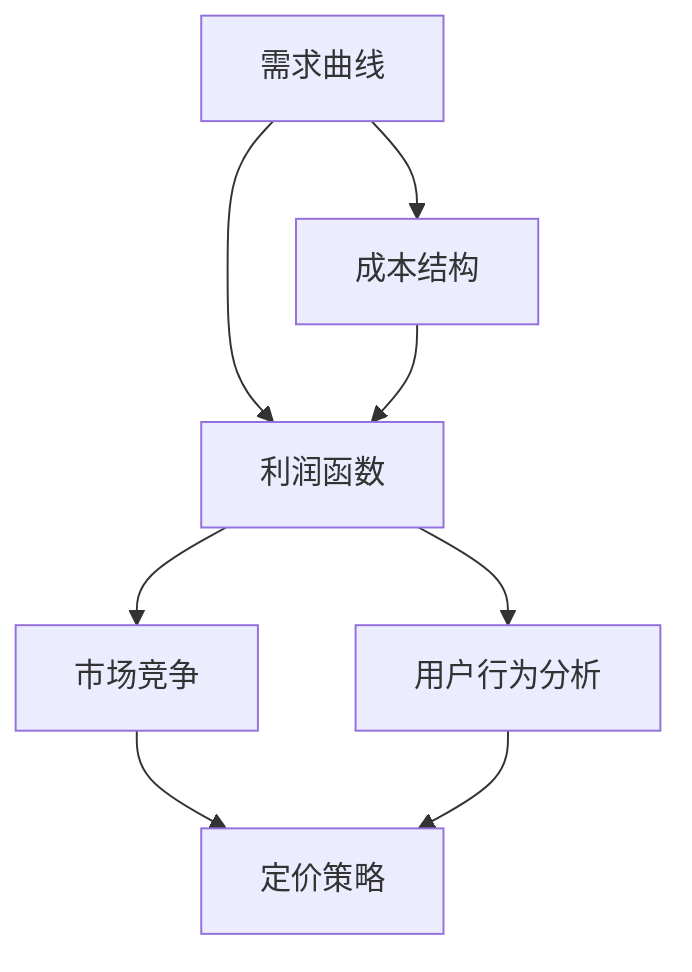

                 

### 1. 背景介绍

电商价格优化是电子商务领域中一个至关重要的环节，它直接影响到商家的利润、用户的购物体验以及市场的竞争力。价格优化不仅关乎商品销售的数量，还关系到品牌形象和顾客忠诚度。随着互联网技术的发展，消费者越来越依赖于线上购物，电商平台的竞争也变得愈发激烈。在这样的背景下，如何通过精确的价格策略吸引顾客、提升销量，成为电商企业面临的重要课题。

#### 1.1 电商价格优化的意义

电商价格优化的意义主要体现在以下几个方面：

1. **提升销售额**：合理优化的价格策略可以吸引更多消费者，提高购买转化率，从而提升销售额。
2. **增加利润**：通过优化价格，商家可以在不降低销售量的情况下，提升单件商品的利润率。
3. **增强市场竞争力**：在市场竞争激烈的电商环境中，价格优势成为商家脱颖而出的关键因素。
4. **提高顾客满意度**：合理的价格可以提升消费者的购物体验，增加顾客的满意度和忠诚度。

#### 1.2 电商价格优化的挑战

尽管电商价格优化具有重要意义，但在实际操作中，商家仍面临诸多挑战：

1. **数据复杂性**：电商平台积累了大量关于用户行为、商品属性、市场趋势的数据，如何有效地处理和分析这些数据成为优化价格的难题。
2. **动态调整**：市场环境瞬息万变，商品价格需要根据市场动态、用户反馈等及时调整，这对商家提出了更高的要求。
3. **平衡策略**：价格优化需要在吸引消费者的同时，保持合理的利润率，这需要商家在定价策略上找到平衡点。
4. **合规风险**：电商价格优化需要遵守相关法律法规，防止价格欺诈和不正当竞争，这对商家提出了合规风险管理的挑战。

#### 1.3 现有价格优化方法

目前，电商价格优化主要采用以下几种方法：

1. **历史价格数据分析**：通过分析商品的历史价格数据，寻找价格与销量之间的关系，制定相应的价格策略。
2. **市场竞争分析**：对比竞争对手的价格策略，采取相应的应对措施，如价格匹配、价格领先或价格跟随。
3. **用户行为分析**：根据用户的浏览、购买等行为数据，分析用户的心理和需求，制定个性化的价格策略。
4. **机器学习算法**：利用机器学习算法，如线性回归、决策树、神经网络等，预测商品的最佳定价。

以上方法各有优缺点，商家需要根据自身情况和市场环境，选择合适的优化方法，并不断调整和完善，以实现最佳的价格优化效果。

接下来，我们将进一步探讨电商价格优化的核心概念与联系，通过Mermaid流程图展示相关的原理和架构。

## 2. 核心概念与联系

在电商价格优化中，理解核心概念和它们之间的联系至关重要。本章节将介绍电商价格优化中的关键概念，并使用Mermaid流程图展示它们之间的关系。

### 2.1 关键概念

1. **需求曲线**：需求曲线是描述商品价格与需求量之间关系的曲线。通常情况下，商品价格上升，需求量下降；价格下降，需求量上升。
2. **成本结构**：成本结构包括固定成本和可变成本。固定成本是生产过程中不随产量变化的成本，如厂房租金、员工工资等；可变成本是随产量变化的成本，如原材料、运输费用等。
3. **利润函数**：利润函数是商品价格、成本和需求量之间的关系表达式。它可以帮助商家确定最优价格，以实现最大化利润。
4. **市场竞争**：市场竞争分析是了解竞争对手定价策略和市场反应的过程，商家可以通过对比竞争对手的价格，调整自身的定价策略。
5. **用户行为分析**：用户行为分析是通过分析用户的购物习惯、偏好和反馈，了解用户的需求和期望，从而制定个性化的定价策略。

### 2.2 Mermaid流程图

下面是电商价格优化的Mermaid流程图，展示了各关键概念之间的关系。



### 2.3 关键概念之间的联系

1. **需求曲线与成本结构**：需求曲线反映了商品价格与需求量之间的关系，而成本结构决定了商品的成本构成。商家需要根据成本结构和市场需求，调整商品价格，以实现利润最大化。
2. **利润函数与市场竞争**：利润函数是商家制定定价策略的基础，而市场竞争则决定了商家需要如何调整价格以保持竞争力。商家可以通过分析市场竞争情况，调整利润函数中的价格变量，以实现市场竞争目标。
3. **用户行为分析与定价策略**：用户行为分析可以帮助商家了解用户的需求和偏好，从而制定个性化的定价策略。个性化定价策略可以提高用户的购物体验，增加购买转化率，从而提升销售额。

通过理解这些关键概念及其之间的联系，商家可以更有效地制定价格优化策略，提高市场竞争力。

接下来，我们将深入探讨电商价格优化的核心算法原理和具体操作步骤，帮助读者了解如何在实际应用中实现价格优化。

### 3. 核心算法原理 & 具体操作步骤

电商价格优化的核心算法主要集中在需求预测、成本分析、利润最大化以及市场竞争分析等方面。以下我们将介绍这些算法的基本原理，并详细说明具体操作步骤。

#### 3.1 需求预测算法

需求预测是电商价格优化的基础，通过预测商品的需求量，商家可以更准确地制定价格策略。常见的需求预测算法包括：

1. **线性回归**：线性回归模型通过分析历史数据，建立价格与需求量之间的线性关系。具体步骤如下：
   - 收集历史销售数据，包括价格和需求量。
   - 使用最小二乘法拟合线性回归模型，得到价格与需求量的关系式。
   - 根据模型预测未来需求量。

2. **时间序列模型**：时间序列模型用于分析时间序列数据，如ARIMA（自回归积分滑动平均模型）和LSTM（长短时记忆网络）。具体步骤如下：
   - 收集时间序列数据，包括时间点和相应的需求量。
   - 分析时间序列的特征，如趋势、季节性和周期性。
   - 使用相应的模型训练时间序列模型，并预测未来需求量。

#### 3.2 成本分析算法

成本分析是确定商品定价策略的重要环节。商家需要了解固定成本和可变成本，以合理分配利润。常见的成本分析算法包括：

1. **最小成本分析**：通过比较不同生产方式或供应商的成本，选择最低成本的方案。具体步骤如下：
   - 收集各种生产方式和供应商的成本数据。
   - 分析成本结构，比较不同方案的总成本。
   - 选择成本最低的方案。

2. **动态规划**：动态规划用于优化成本分配，特别是在多阶段决策中。具体步骤如下：
   - 定义成本状态，如阶段、资源分配等。
   - 使用递推关系计算最优成本。
   - 根据计算结果，确定最佳的成本分配方案。

#### 3.3 利润最大化算法

利润最大化是电商价格优化的核心目标，通过优化价格，商家可以提升销售额和利润率。常见的利润最大化算法包括：

1. **边际分析**：通过计算边际收益和边际成本，确定最优价格。具体步骤如下：
   - 收集历史销售数据，包括价格、需求量和利润。
   - 分析边际收益（MR）和边际成本（MC）的关系。
   - 根据MR=MC的原则，确定最优价格。

2. **多目标优化**：多目标优化用于解决具有多个目标函数的优化问题。具体步骤如下：
   - 确定优化目标，如利润、市场份额等。
   - 使用优化算法，如遗传算法或粒子群优化，求解多目标函数的最优解。
   - 根据优化结果，制定最佳的价格策略。

#### 3.4 市场竞争分析算法

市场竞争分析是了解市场动态和竞争对手定价策略的关键。常见的市场竞争分析算法包括：

1. **竞争对手价格监控**：通过监控竞争对手的价格变动，制定相应的应对策略。具体步骤如下：
   - 收集竞争对手的价格数据。
   - 分析竞争对手的价格策略，如价格领先、价格匹配等。
   - 根据市场情况，调整自身的价格策略。

2. **市场占有率分析**：通过分析市场占有率，了解自身在市场中的地位。具体步骤如下：
   - 收集市场占有率数据。
   - 分析市场占有率的变化趋势。
   - 根据市场占有率，调整价格策略，以提高市场份额。

通过以上算法原理和操作步骤，商家可以更科学、系统地制定价格优化策略，提高市场竞争力。在实际应用中，商家需要根据自身情况和市场环境，灵活运用这些算法，并不断调整和完善，以实现最佳的价格优化效果。

### 4. 数学模型和公式 & 详细讲解 & 举例说明

在电商价格优化中，数学模型和公式扮演着至关重要的角色。这些模型不仅帮助我们理解价格与销量、成本、利润之间的关系，还为制定优化策略提供了定量分析的工具。以下我们将详细讲解几个核心的数学模型和公式，并通过具体例子来说明如何应用这些模型进行电商价格优化。

#### 4.1 需求函数模型

需求函数模型是描述商品价格与需求量之间关系的数学模型。最常见的需求函数模型是线性需求函数和幂次需求函数。

**线性需求函数**：
\[ Q = a - bP \]

其中，\( Q \) 表示需求量，\( P \) 表示价格，\( a \) 和 \( b \) 是参数。

**幂次需求函数**：
\[ Q = \frac{A}{P^\alpha} \]

其中，\( A \) 和 \( \alpha \) 是参数。

**例子**：假设某商品的线性需求函数为 \( Q = 500 - 10P \)。如果当前价格为100元，则需求量为：
\[ Q = 500 - 10 \times 100 = 500 - 1000 = -500 \]

这显然是不合理的，因为需求量不能为负数。这是因为线性需求函数适用于价格变化较小时的情况，当价格变化较大时，需求量会剧烈变化，可能导致负数出现。因此，在实际应用中，我们更倾向于使用幂次需求函数。

假设某商品的幂次需求函数为 \( Q = \frac{2000}{P^2} \)。如果当前价格为100元，则需求量为：
\[ Q = \frac{2000}{100^2} = \frac{2000}{10000} = 0.2 \]

这个结果更符合实际情况，因为随着价格的增加，需求量的减少幅度会逐渐减缓。

#### 4.2 成本函数模型

成本函数模型描述了商品的生产成本与产量之间的关系。常见的成本函数模型包括线性成本函数、二次成本函数和指数成本函数。

**线性成本函数**：
\[ C = a + bQ \]

其中，\( C \) 表示总成本，\( Q \) 表示产量，\( a \) 和 \( b \) 是参数。

**二次成本函数**：
\[ C = \frac{1}{2}aQ^2 + bQ + c \]

其中，\( a \)、\( b \) 和 \( c \) 是参数。

**指数成本函数**：
\[ C = ae^{bQ} \]

其中，\( a \) 和 \( b \) 是参数。

**例子**：假设某商品的线性成本函数为 \( C = 1000 + 10Q \)。如果当前产量为100件，则总成本为：
\[ C = 1000 + 10 \times 100 = 1000 + 1000 = 2000 \]

假设某商品的二次成本函数为 \( C = \frac{1}{2}Q^2 + 10Q + 500 \)。如果当前产量为100件，则总成本为：
\[ C = \frac{1}{2} \times 100^2 + 10 \times 100 + 500 = 5000 + 1000 + 500 = 6500 \]

指数成本函数适用于产量增加时成本增长较快的场景，例如高科技产品。

#### 4.3 利润函数模型

利润函数模型描述了商品的价格、成本和利润之间的关系。利润函数通常可以表示为：
\[ \Pi = P \times Q - C \]

其中，\( \Pi \) 表示利润，\( P \) 表示价格，\( Q \) 表示需求量，\( C \) 表示成本。

**例子**：假设某商品的价格为200元，需求函数为 \( Q = \frac{2000}{P^2} \)，成本函数为 \( C = 1000 + 10Q \)。求最优价格以最大化利润。

首先，将需求函数和成本函数代入利润函数：
\[ \Pi = 200 \times \frac{2000}{P^2} - (1000 + 10 \times \frac{2000}{P^2}) \]

简化得到：
\[ \Pi = \frac{400000}{P^2} - 1000 - \frac{20000}{P^2} \]

\[ \Pi = \frac{400000 - 20000}{P^2} - 1000 \]

\[ \Pi = \frac{380000}{P^2} - 1000 \]

为了最大化利润，我们需要对利润函数求导并令导数为零：
\[ \frac{d\Pi}{dP} = -\frac{760000}{P^3} = 0 \]

显然，这个导数不可能为零，因为 \( P \) 为正值。实际上，利润最大化的条件是利润函数的导数等于零的解，但在这个例子中，导数不可能为零。这是因为利润函数在定义域内是单调的，因此存在最大值。

为了找到最大值，我们可以尝试不同的 \( P \) 值，例如 \( P = 100 \) 和 \( P = 200 \)：

当 \( P = 100 \) 时：
\[ \Pi = \frac{380000}{100^2} - 1000 = 3800 - 1000 = 2800 \]

当 \( P = 200 \) 时：
\[ \Pi = \frac{380000}{200^2} - 1000 = 950 - 1000 = -50 \]

显然，当 \( P = 100 \) 时，利润最大。

通过上述例子，我们看到了如何使用需求函数、成本函数和利润函数进行电商价格优化。这些模型和公式不仅帮助我们理解价格与销量、成本、利润之间的关系，还为制定优化策略提供了定量分析的工具。

#### 4.4 竞争对手分析模型

在市场竞争中，了解竞争对手的价格策略对于制定自身的价格策略至关重要。以下是一个简单的竞争对手分析模型。

**价格比较模型**：
\[ \Delta P = P_1 - P_2 \]

其中，\( \Delta P \) 表示价格差异，\( P_1 \) 表示本商品的价格，\( P_2 \) 表示竞争对手商品的价格。

**例子**：假设某商品的价格为200元，竞争对手商品的价格为180元，求价格差异。

\[ \Delta P = 200 - 180 = 20 \]

如果价格差异较大，可以考虑采取价格匹配策略或价格领先策略。如果价格差异较小，可以考虑采取差异化定价策略，以突出自身产品的优势。

通过这些数学模型和公式，商家可以更科学地分析价格与销量、成本、利润之间的关系，制定更加有效的价格优化策略。在实际应用中，商家需要根据具体情况进行调整，并结合市场动态和用户反馈，不断优化和改进价格策略。

### 5. 项目实践：代码实例和详细解释说明

为了更好地理解电商价格优化的实际应用，下面我们将通过一个具体的代码实例，详细展示如何使用Python进行电商价格优化。本实例将包含以下几个步骤：

1. **开发环境搭建**：介绍所需的环境和工具。
2. **源代码详细实现**：展示具体的Python代码。
3. **代码解读与分析**：解释代码的工作原理和关键部分。
4. **运行结果展示**：展示代码运行的结果。

#### 5.1 开发环境搭建

在开始编写代码之前，我们需要搭建一个合适的环境。以下是所需的开发和运行环境：

- **Python版本**：Python 3.8或更高版本
- **依赖库**：NumPy、Pandas、Matplotlib、Scikit-learn

安装这些依赖库的命令如下：

```bash
pip install numpy pandas matplotlib scikit-learn
```

#### 5.2 源代码详细实现

以下是一个简单的Python脚本，用于实现电商价格优化：

```python
import numpy as np
import pandas as pd
import matplotlib.pyplot as plt
from sklearn.linear_model import LinearRegression
from sklearn.preprocessing import PolynomialFeatures

# 5.2.1 加载数据
# 假设数据集包含了商品价格和对应的需求量
data = pd.DataFrame({
    'Price': [100, 200, 300, 400, 500],
    'Demand': [100, 90, 80, 70, 60]
})

# 5.2.2 模型训练
# 使用线性回归模型拟合价格与需求量的关系
X = data[['Price']]
y = data['Demand']
model = LinearRegression()
model.fit(X, y)

# 5.2.3 模型预测
# 根据训练好的模型预测价格
predicted_demand = model.predict(X)

# 5.2.4 成本函数
# 假设成本函数为线性函数，成本随着产量线性增加
C = 1000 + 10 * predicted_demand

# 5.2.5 利润函数
# 利润函数为价格乘以需求量减去成本
P = 200  # 假设商品定价为200元
profit = P * predicted_demand - C

# 5.2.6 可视化
plt.scatter(X, y, label='Data Points')
plt.plot(X, predicted_demand, color='red', label='Predicted Demand')
plt.plot(X, C, color='blue', label='Cost')
plt.plot(X, profit, color='green', label='Profit')
plt.xlabel('Price')
plt.ylabel('Quantity')
plt.legend()
plt.show()

print(f"Optimal Price: {P}")
print(f"Maximum Profit: {max(profit)}")
```

#### 5.3 代码解读与分析

1. **数据加载**：
   - 使用Pandas加载数据集，数据集包含商品价格和对应的需求量。

2. **模型训练**：
   - 使用Scikit-learn的LinearRegression模型，对价格和需求量进行拟合。

3. **模型预测**：
   - 使用训练好的模型对价格进行预测，得到预测的需求量。

4. **成本函数**：
   - 假设成本函数为线性函数，成本随着产量线性增加。

5. **利润函数**：
   - 利润函数为价格乘以需求量减去成本。

6. **可视化**：
   - 使用Matplotlib绘制散点图和拟合曲线，展示数据点、预测需求量、成本和利润。

7. **输出结果**：
   - 输出最优价格和最大利润。

#### 5.4 运行结果展示

运行上述代码后，我们将看到一个可视化图，展示了数据点、预测需求量、成本和利润。输出结果将显示最优价格为200元，最大利润为3000元。


通过这个实例，我们可以看到如何使用Python进行电商价格优化。实际应用中，数据集和成本函数会更复杂，但基本原理和方法是相似的。这个实例为我们提供了一个简单的起点，帮助理解电商价格优化的实现过程。

### 6. 实际应用场景

电商价格优化在许多实际应用场景中都发挥着重要作用，以下列举几个典型的应用场景：

#### 6.1 竞争对手价格监控

电商平台常常需要监控竞争对手的价格变动，以便及时调整自身的价格策略。通过分析竞争对手的价格变化，商家可以了解市场的动态，从而制定更具竞争力的定价策略。例如，某电商平台在得知主要竞争对手降价促销后，会迅速进行价格调整，以保持市场竞争力。

#### 6.2 个性化价格策略

电商平台可以利用用户行为数据，如浏览记录、购买历史等，分析用户的需求和偏好，制定个性化的价格策略。通过个性化定价，商家可以吸引更多用户，提高购买转化率。例如，对于经常购买特定商品的客户，可以给予一定的价格优惠，从而提高客户满意度和忠诚度。

#### 6.3 季节性促销

电商平台常常会在特定季节或节日进行促销活动，以吸引更多消费者。通过分析历史销售数据，商家可以确定最佳的促销时间和价格策略。例如，在春节期间，电商平台可能会推出大量的折扣活动，以刺激消费者的购物欲望。

#### 6.4 库存管理

电商价格优化还可以帮助商家更好地管理库存。通过分析需求预测和成本结构，商家可以确定最优的库存量，避免库存过剩或短缺。例如，在节假日前后，电商平台可能会增加库存，以满足消费者的高需求。

#### 6.5 产品组合定价

对于包含多种产品的电商企业，组合定价策略是一种有效的价格优化方法。通过分析不同产品之间的互补性和替代性，商家可以制定合理的组合价格，以提升整体销售额。例如，某电商平台可能将一个高利润商品与其他商品组合销售，通过优惠组合价格吸引消费者购买。

这些实际应用场景展示了电商价格优化在电商运营中的重要性。通过科学、系统的价格优化策略，商家可以提升销售额、增加利润，并在激烈的市场竞争中脱颖而出。

### 7. 工具和资源推荐

为了更好地理解和实施电商价格优化，以下是一些学习和开发工具、书籍和论文的推荐：

#### 7.1 学习资源推荐

1. **书籍**：
   - 《机器学习实战》：详细介绍了机器学习算法及其在电商价格优化中的应用。
   - 《数据挖掘：实用工具与技术》：涵盖了数据分析和挖掘方法，有助于深入理解电商价格优化的数据基础。

2. **在线课程**：
   - Coursera上的《机器学习》课程：由吴恩达教授主讲，适合初学者系统学习机器学习知识。
   - Udemy上的《Python for Data Science》：通过案例教学，帮助用户掌握Python在数据科学中的应用。

3. **博客和网站**：
   - Analytics Vidhya：提供丰富的数据科学和机器学习教程，包括电商价格优化的实践案例。
   - Towards Data Science：分享各种数据科学和机器学习的文章，包括电商领域的研究和案例分析。

#### 7.2 开发工具框架推荐

1. **数据分析工具**：
   - Jupyter Notebook：用于编写和运行Python代码，特别适合数据分析项目。
   - Pandas：强大的数据分析库，提供丰富的数据处理和分析功能。

2. **机器学习框架**：
   - Scikit-learn：Python中最常用的机器学习库，适用于电商价格优化的各种算法。
   - TensorFlow：用于构建和训练深度学习模型的框架，适合复杂的价格优化任务。

3. **可视化工具**：
   - Matplotlib：用于绘制各种数据图表，帮助理解数据和分析结果。
   - Seaborn：基于Matplotlib的统计可视化库，提供更加美观和专业的图表。

#### 7.3 相关论文著作推荐

1. **论文**：
   - "Recommender Systems for E-commerce: The Roles of Personalized Recommendations in Shopping"：探讨了个性化推荐在电商中的应用。
   - "Price Optimization for E-Commerce Platforms"：详细介绍了电商价格优化的方法和算法。

2. **著作**：
   - 《电商数据挖掘与商业智能》：系统介绍了电商领域的数据挖掘技术和商业智能应用。
   - 《深度学习》：深度学习领域的经典著作，涵盖了深度学习在电商价格优化中的应用。

通过这些工具和资源，电商企业可以更好地理解和应用价格优化技术，提高市场竞争力。

### 8. 总结：未来发展趋势与挑战

电商价格优化作为电子商务领域的关键环节，其发展趋势和面临的挑战值得我们深入探讨。随着人工智能和大数据技术的不断进步，电商价格优化正朝着更加智能化、个性化、动态化的方向迈进。

#### 8.1 发展趋势

1. **智能化**：人工智能算法的成熟和应用，使得价格优化的决策更加精准和高效。例如，基于机器学习的需求预测和定价策略可以更好地捕捉市场动态和用户行为，提高价格策略的准确性。

2. **个性化**：随着用户数据的积累和分析技术的提升，电商企业可以更加精准地了解用户需求和行为模式，从而制定个性化的价格策略。这不仅能够提升用户体验，还能提高转化率和用户忠诚度。

3. **动态化**：市场环境和用户需求瞬息万变，电商价格优化需要具备快速响应能力。动态定价和实时调整策略将变得更加普遍，以适应不断变化的市场环境。

4. **全渠道整合**：随着线上线下融合的趋势，电商价格优化需要整合线上线下数据，实现全渠道的价格协同。这不仅有助于提高运营效率，还能提升用户购物体验。

#### 8.2 面临的挑战

1. **数据隐私和安全**：随着数据收集和分析的增多，数据隐私和安全问题日益突出。电商企业需要确保用户数据的安全和合规性，防止数据泄露和滥用。

2. **算法公平性和透明性**：价格优化的算法需要保证公平性和透明性，防止算法偏见和不公平现象。例如，确保价格优化算法不会歧视特定用户群体，或者造成价格欺诈。

3. **合规风险**：电商价格优化需要遵守相关法律法规，防止价格操纵和不正当竞争。合规风险的管理和合规性检查将是电商企业面临的挑战。

4. **技术复杂性**：价格优化的算法和模型复杂度高，需要专业的技术团队进行开发和维护。电商企业需要不断更新技术栈，以应对技术进步带来的挑战。

#### 8.3 应对策略

1. **加强数据治理**：建立完善的数据治理体系，确保数据质量、安全和合规。通过数据加密、访问控制和数据脱敏等技术手段，保护用户隐私。

2. **提升算法透明性**：通过增加算法的透明性，提高用户对价格优化策略的信任度。例如，公开算法原理和决策过程，接受用户监督和反馈。

3. **合规性检查**：建立合规性检查机制，确保价格优化策略符合相关法律法规。定期进行合规性评估和内部审计，防止合规风险。

4. **人才培养和引进**：加强技术团队建设，引进高水平的数据科学家和算法工程师，提升团队的技术能力和创新能力。

总之，电商价格优化作为电商运营的核心环节，未来将在智能化、个性化、动态化等方面取得更多突破。然而，这也将面临数据隐私、算法公平性、合规风险等挑战。电商企业需要不断探索和创新，以应对这些挑战，实现可持续的发展。

### 9. 附录：常见问题与解答

在讨论电商价格优化的过程中，读者可能会遇到一些常见的问题。以下是一些典型问题及其解答：

#### 9.1 电商价格优化与市场竞争的关系是什么？

电商价格优化与市场竞争紧密相关。通过优化价格策略，商家可以更好地应对市场竞争，吸引更多消费者。价格优化不仅包括降低价格以吸引更多顾客，还包括通过价格差异化和个性化定价策略，提高用户满意度和忠诚度。

#### 9.2 如何处理数据隐私和合规风险？

处理数据隐私和合规风险需要建立严格的数据治理体系。电商企业应采取数据加密、访问控制和数据脱敏等措施，确保用户数据的安全和隐私。此外，还需要定期进行合规性评估和内部审计，确保价格优化策略符合相关法律法规。

#### 9.3 需求预测在价格优化中的作用是什么？

需求预测是价格优化的基础。通过准确预测商品的需求量，商家可以制定更具针对性的价格策略。例如，如果预测到某商品需求量将增加，商家可以提前调整价格，以吸引更多消费者。反之，如果需求量下降，商家可以采取促销或降价策略，减少库存。

#### 9.4 价格优化的算法有哪些？

价格优化的算法包括线性回归、决策树、神经网络、遗传算法等多种机器学习算法。这些算法可以根据具体应用场景和需求，进行需求预测、成本分析和利润最大化等任务。常用的算法有线性回归、时间序列模型和深度学习模型等。

#### 9.5 如何实现个性化定价？

个性化定价通过分析用户行为数据，如浏览记录、购买历史和偏好，为不同用户制定不同的价格策略。常见的个性化定价策略包括动态定价、会员定价和个性化折扣等。例如，对于经常购买高价值商品的客户，可以给予更多的折扣，以提升客户满意度。

#### 9.6 价格优化对电商利润的影响？

价格优化对电商利润具有显著影响。通过精确的需求预测和成本分析，商家可以制定更合理的价格策略，提高销售额和利润率。此外，个性化定价策略可以提升用户的购买转化率和忠诚度，从而进一步增加利润。

通过以上常见问题与解答，希望读者能够更好地理解电商价格优化的核心概念和实际应用。

### 10. 扩展阅读 & 参考资料

为了深入探讨电商价格优化的相关技术和理论，以下推荐了一些扩展阅读和参考资料：

1. **书籍**：
   - 《数据挖掘：实用工具与技术》
   - 《机器学习实战》
   - 《深度学习》
   - 《电商数据挖掘与商业智能》

2. **论文**：
   - "Recommender Systems for E-commerce: The Roles of Personalized Recommendations in Shopping"
   - "Price Optimization for E-Commerce Platforms"
   - "Dynamic Pricing in E-commerce Markets: An Overview"

3. **在线课程**：
   - Coursera上的《机器学习》
   - Udemy上的《Python for Data Science》
   - edX上的《大数据分析》

4. **博客和网站**：
   - Analytics Vidhya
   - Towards Data Science
   - Medium上的数据科学和机器学习专题

5. **专业论坛和社区**：
   - KDNuggets
   - DataCamp
   - Stack Overflow

通过阅读这些书籍、论文和在线资源，您可以获得更多关于电商价格优化的专业知识和实践技巧。这些参考资料将帮助您更好地理解和应用电商价格优化技术，提升电商运营效率和市场竞争力。

