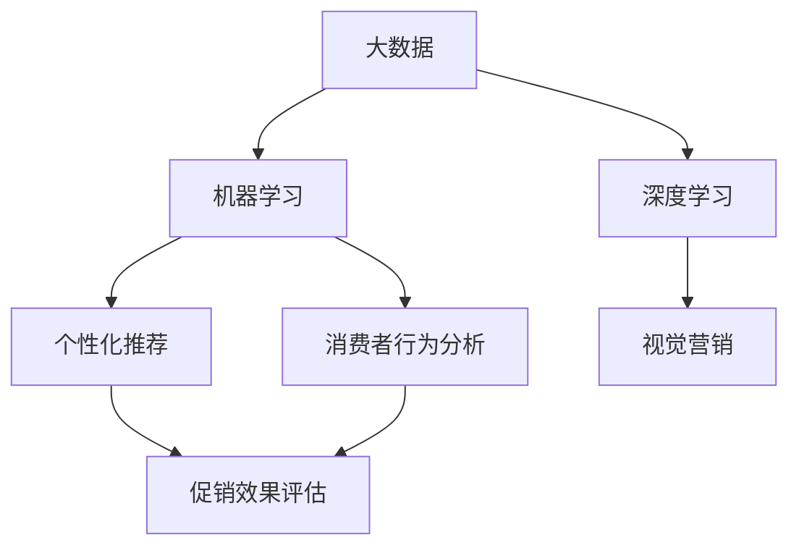

                 

### 背景介绍

在当今竞争激烈的市场环境中，电商促销策略对于企业来说至关重要。通过有效的促销活动，企业不仅可以吸引更多的新客户，提高销售额，还能增强品牌影响力，提升市场占有率。然而，随着消费者需求的多样化和市场环境的不断变化，传统的促销策略已经难以满足现代电商的需求。为此，人工智能（AI）技术为电商促销策略的创新带来了新的机遇和挑战。

#### 电商促销的现状

目前的电商促销策略主要依赖于价格战、优惠券、限时折扣、满减活动等传统手段。这些策略在一定程度上能够提高销售额，但存在以下问题：

1. **同质化严重**：众多电商平台采用相似的促销手段，消费者容易产生审美疲劳，促销效果逐渐减弱。
2. **消费者疲劳**：频繁的促销活动让消费者产生疲劳感，降低购买欲望。
3. **无法精准定位**：传统促销策略难以根据消费者的个性化需求进行精准营销。
4. **成本较高**：促销活动需要投入大量的人力、物力和财力，对企业来说是一笔不小的负担。

#### 人工智能的崛起

人工智能技术，尤其是机器学习和深度学习，在电商领域的应用逐渐成熟。通过大数据分析和算法优化，AI能够帮助电商企业更好地了解消费者行为，精准定位目标客户，制定个性化的促销策略，从而提高营销效果。

#### 人工智能在电商促销中的优势

1. **个性化推荐**：基于消费者购买历史和浏览行为，AI可以生成个性化的促销方案，提高消费者的购买体验。
2. **预测与分析**：通过分析大量历史数据，AI可以预测消费者的购买趋势，提前布局促销活动。
3. **自动化执行**：AI能够自动化执行复杂的促销策略，减少人工干预，提高效率。
4. **成本优化**：AI可以帮助企业优化促销预算，降低促销成本。

#### 本文目标

本文将探讨人工智能在电商促销策略中的应用，包括核心概念、算法原理、数学模型、实际项目实践、应用场景、工具和资源推荐等内容。通过本文的阐述，希望能够为电商企业提供一些切实可行的AI促销策略，提高其市场竞争力。

接下来，我们将深入分析电商促销策略中的核心概念与联系，帮助读者更好地理解AI在其中的作用。

### 核心概念与联系

在探讨人工智能在电商促销策略中的应用之前，我们需要先了解一些核心概念，并探讨它们之间的联系。以下是一些关键概念：

#### 1. 大数据

大数据是电商促销策略的基础。通过收集和分析消费者的购买历史、搜索行为、社交互动等信息，企业可以更好地了解消费者的需求和行为模式。大数据分析技术包括数据挖掘、机器学习、深度学习等，它们能够帮助电商企业从海量数据中提取有价值的信息。

#### 2. 机器学习

机器学习是AI的重要组成部分，它使计算机系统能够从数据中学习并做出预测。在电商促销中，机器学习算法可以用于预测消费者行为、推荐商品、评估促销效果等。常见的机器学习算法包括线性回归、决策树、支持向量机、神经网络等。

#### 3. 深度学习

深度学习是机器学习的一个子领域，通过多层神经网络结构来模拟人脑的决策过程。深度学习在图像识别、语音识别、自然语言处理等领域取得了显著成果，也正在被广泛应用于电商促销策略中，如个性化推荐、视觉营销等。

#### 4. 个性化推荐

个性化推荐是电商促销策略中的重要一环。通过分析消费者的行为数据和偏好，个性化推荐系统能够向消费者推荐符合其兴趣和需求的商品，提高购买转化率。

#### 5. 消费者行为分析

消费者行为分析是理解消费者需求和行为的重要工具。通过分析消费者在电商平台上的浏览、搜索、购买等行为，企业可以识别出潜在的消费趋势，从而制定更具针对性的促销策略。

#### 6. 促销效果评估

促销效果评估是衡量促销策略成功与否的重要指标。通过分析促销活动期间的销售额、流量、转化率等数据，企业可以评估促销策略的有效性，并据此调整策略。

#### 7. 数学模型

数学模型在电商促销策略中扮演着重要角色。例如，线性回归模型可以用于预测销售额，决策树模型可以用于分类消费者群体，神经网络模型可以用于预测消费者行为等。

#### Mermaid 流程图

以下是一个简单的Mermaid流程图，展示了上述核心概念之间的联系：



通过上述核心概念和联系的分析，我们可以看出，人工智能在电商促销策略中的应用是一个复杂且多层次的过程。从大数据的收集与分析，到机器学习和深度学习的应用，再到个性化推荐和消费者行为分析，最终形成对促销效果的评估，这些环节相互关联，共同构成了一个完整的AI促销策略体系。

在下一章节中，我们将深入探讨人工智能在电商促销中的核心算法原理和具体操作步骤。

### 核心算法原理 & 具体操作步骤

#### 1. 个性化推荐算法

个性化推荐算法是电商促销策略中的关键技术之一。它通过分析用户的浏览历史、购买记录、社交行为等信息，为用户推荐其可能感兴趣的商品或服务。以下是一些常见的个性化推荐算法：

**协同过滤（Collaborative Filtering）**

协同过滤算法根据用户的共同偏好来推荐商品。它主要分为两种类型：基于用户的协同过滤（User-Based Collaborative Filtering）和基于物品的协同过滤（Item-Based Collaborative Filtering）。

- **基于用户的协同过滤**：该方法首先找到与目标用户兴趣相似的其他用户，然后推荐这些用户喜欢的商品。
- **基于物品的协同过滤**：该方法首先找到与目标用户已购买或浏览过的商品相似的其他商品，然后推荐这些商品。

**内容推荐（Content-Based Filtering）**

内容推荐算法根据用户的历史行为和商品的特征来推荐商品。该方法通过计算用户和商品之间的相似度，推荐与用户过去偏好相似的商品。

**混合推荐（Hybrid Recommendation）**

混合推荐算法结合协同过滤和内容推荐的优势，通过综合两种方法的特点来提高推荐效果。

**具体操作步骤**

1. **数据收集**：收集用户的购买记录、浏览历史、搜索关键词、社交媒体互动等信息。
2. **数据处理**：对收集到的数据进行清洗、去噪和特征提取，将其转化为适合算法输入的格式。
3. **模型训练**：使用机器学习算法（如协同过滤、内容推荐等）训练推荐模型。
4. **推荐生成**：根据用户的当前行为和偏好，使用训练好的模型生成个性化推荐结果。

#### 2. 预测算法

预测算法在电商促销策略中用于预测未来的销售额、消费者行为等。以下是一些常见的预测算法：

**线性回归（Linear Regression）**

线性回归是一种简单的预测模型，通过建立输入变量和目标变量之间的线性关系来预测目标值。

**时间序列分析（Time Series Analysis）**

时间序列分析用于分析时间序列数据，识别数据中的趋势、季节性和周期性，从而进行预测。常见的时间序列预测方法包括ARIMA模型、LSTM（长短时记忆网络）等。

**集成预测（Ensemble Forecasting）**

集成预测通过结合多个预测模型的优点来提高预测精度。常见的集成方法包括Bagging、Boosting等。

**具体操作步骤**

1. **数据收集**：收集与预测目标相关的历史数据，如销售额、库存量、季节性数据等。
2. **数据预处理**：对数据进行清洗、填充缺失值、标准化等预处理步骤。
3. **模型选择**：根据数据的特征选择合适的预测模型，如线性回归、时间序列分析等。
4. **模型训练与验证**：使用历史数据训练预测模型，并通过交叉验证等方法评估模型性能。
5. **预测**：使用训练好的模型对未来的销售额、消费者行为等进行预测。

#### 3. 促销效果评估算法

促销效果评估算法用于评估促销活动的效果，帮助电商企业调整和优化促销策略。以下是一些常见的促销效果评估算法：

**A/B测试（A/B Testing）**

A/B测试是一种常见的评估方法，通过将用户随机分配到两组，一组接受控制组（无促销）的处理，另一组接受实验组（有促销）的处理，比较两组的用户行为和转化率差异，评估促销效果。

**转化率分析（Conversion Rate Analysis）**

转化率分析通过分析用户在电商平台上的转化过程，识别转化瓶颈和优化点，评估促销策略的影响。

**ROI分析（Return on Investment Analysis）**

ROI分析通过计算促销活动的投入产出比，评估促销活动的经济效益。

**具体操作步骤**

1. **数据收集**：收集促销活动期间的用户行为数据、销售额数据等。
2. **数据预处理**：对数据进行清洗、填充缺失值、标准化等预处理步骤。
3. **评估指标选择**：根据促销目标选择合适的评估指标，如A/B测试指标、转化率、ROI等。
4. **评估计算**：使用评估指标计算促销活动的效果。
5. **策略调整**：根据评估结果调整和优化促销策略。

通过以上核心算法原理和具体操作步骤的阐述，我们可以看出，人工智能在电商促销策略中的应用是一个复杂而系统性的过程。从个性化推荐、预测算法到促销效果评估，这些算法相互配合，共同为电商企业提供了有效的促销策略。

在下一章节中，我们将进一步探讨数学模型和公式在电商促销策略中的应用，帮助读者深入理解其中的关键技术和方法。

### 数学模型和公式 & 详细讲解 & 举例说明

在电商促销策略中，数学模型和公式扮演着至关重要的角色。这些模型和公式不仅能够帮助我们理解和预测消费者行为，还可以优化促销策略，提高营销效果。以下是一些常用的数学模型和公式，以及它们的详细讲解和举例说明。

#### 1. 线性回归模型

线性回归模型是一种用于预测目标变量与输入变量之间线性关系的数学模型。在电商促销策略中，线性回归模型可以用来预测销售额或流量。

**公式：**

$$
y = \beta_0 + \beta_1x_1 + \beta_2x_2 + ... + \beta_nx_n + \epsilon
$$

其中，$y$ 是目标变量（如销售额），$x_1, x_2, ..., x_n$ 是输入变量（如广告投放费用、促销折扣等），$\beta_0, \beta_1, \beta_2, ..., \beta_n$ 是模型的参数，$\epsilon$ 是误差项。

**举例说明：**

假设一个电商平台想要预测某个产品在下周的销售额，根据历史数据，我们选取了广告投放费用和促销折扣作为输入变量。通过训练线性回归模型，我们可以得到以下公式：

$$
销售额 = 100 + 0.5 \times 广告投放费用 + 0.3 \times 促销折扣
$$

如果下周的广告投放费用为5000元，促销折扣为10%，则预测的销售额为：

$$
销售额 = 100 + 0.5 \times 5000 + 0.3 \times 10\% = 3350元
$$

#### 2. 决策树模型

决策树模型是一种基于特征进行分类或回归的树形结构模型。在电商促销策略中，决策树模型可以用于分类消费者群体或预测促销效果。

**公式：**

决策树模型的决策过程可以通过以下公式表示：

$$
决策树 = \{r_1, r_2, ..., r_n\}
$$

其中，$r_i$ 是第 $i$ 个决策节点，表示根据某个特征 $f_j$ 的不同取值进行划分。

**举例说明：**

假设一个电商平台想要根据消费者的年龄、收入和购买历史来分类消费者群体。通过训练决策树模型，我们可以得到以下分类规则：

- 如果年龄小于30岁，则继续判断收入；
- 如果收入小于5000元，则划分为“低收入群体”；
- 如果收入大于等于5000元，则划分为“高收入群体”。

#### 3. 集成模型

集成模型是通过结合多个预测模型的优点来提高预测准确性的模型。常见的集成模型包括Bagging和Boosting。

**Bagging（Bootstrap Aggregating）**

Bagging通过生成多个训练样本的子集，并训练多个预测模型，然后取这些模型的平均值作为最终预测结果。

**公式：**

$$
\hat{y} = \frac{1}{N} \sum_{i=1}^{N} \hat{y}_i
$$

其中，$\hat{y}$ 是最终预测结果，$\hat{y}_i$ 是第 $i$ 个模型的预测结果，$N$ 是模型数量。

**Boosting**

Boosting通过调整模型权重，使预测效果较差的模型在后续训练中给予更多关注。

**公式：**

$$
\alpha_i = \frac{1}{C} \ln \left( \frac{1 - error_i}{error_i} \right)
$$

其中，$\alpha_i$ 是第 $i$ 个模型的权重，$error_i$ 是第 $i$ 个模型的预测错误率，$C$ 是调节参数。

**举例说明：**

假设我们训练了三个预测模型A、B和C，它们的预测结果分别为$\hat{y}_A, \hat{y}_B, \hat{y}_C$，错误率分别为$0.1, 0.2, 0.3$。根据Boosting公式，我们可以计算每个模型的权重：

$$
\alpha_A = \frac{1}{3} \ln \left( \frac{1 - 0.1}{0.1} \right) \approx 1.39
$$
$$
\alpha_B = \frac{1}{3} \ln \left( \frac{1 - 0.2}{0.2} \right) \approx 0.91
$$
$$
\alpha_C = \frac{1}{3} \ln \left( \frac{1 - 0.3}{0.3} \right) \approx 0.44
$$

然后，我们可以计算最终的预测结果：

$$
\hat{y} = \alpha_A \hat{y}_A + \alpha_B \hat{y}_B + \alpha_C \hat{y}_C
$$

#### 4. 时间序列模型

时间序列模型用于分析时间序列数据，识别数据中的趋势、季节性和周期性，从而进行预测。常见的时间序列模型包括ARIMA（AutoRegressive Integrated Moving Average）模型和LSTM（Long Short-Term Memory）网络。

**ARIMA模型**

ARIMA模型由自回归（AR）、差分（I）和移动平均（MA）三个部分组成。

**公式：**

$$
y_t = c + \phi_1y_{t-1} + \phi_2y_{t-2} + ... + \phi_py_{t-p} + \theta_1\epsilon_{t-1} + \theta_2\epsilon_{t-2} + ... + \theta_q\epsilon_{t-q} + \epsilon_t
$$

其中，$y_t$ 是时间序列的当前值，$\epsilon_t$ 是误差项，$c$ 是常数项，$\phi_1, \phi_2, ..., \phi_p$ 是自回归系数，$\theta_1, \theta_2, ..., \theta_q$ 是移动平均系数。

**LSTM网络**

LSTM网络是一种特殊的递归神经网络，用于处理和预测时间序列数据。

**公式：**

$$
C_t = \sigma(W_c \cdot [h_{t-1}, x_t] + b_c) \\
I_t = \sigma(W_i \cdot [h_{t-1}, x_t] + b_i) \\
F_t = \sigma(W_f \cdot [h_{t-1}, x_t] + b_f) \\
O_t = \sigma(W_o \cdot [h_{t-1}, x_t] + b_o) \\
C_{t}^{new} = F_t \odot C_t + I_t \odot \sigma(W_g \cdot [h_{t-1}, x_t] + b_g) \\
h_t = O_t \odot \sigma(C_{t}^{new})
$$

其中，$C_t, h_t$ 分别是LSTM网络的细胞状态和隐藏状态，$W_c, W_i, W_f, W_o, W_g$ 分别是权重矩阵，$b_c, b_i, b_f, b_o, b_g$ 分别是偏置项，$\sigma$ 是激活函数（如sigmoid函数）。

**举例说明：**

假设我们使用LSTM网络预测一周后的销售额，给定前一天的销售额和历史数据。通过训练LSTM网络，我们可以得到预测结果。

#### 5. 神经网络模型

神经网络模型是一种基于多层感知器（Multilayer Perceptron, MLP）的预测模型。它通过多层神经元的非线性组合来模拟复杂的函数关系。

**公式：**

$$
a_{ij}^{(l)} = \sigma \left( \sum_{k=1}^{n_{l-1}} w_{ik}^{(l-1)} a_{kj}^{(l-1)} + b_i^{(l)} \right)
$$

其中，$a_{ij}^{(l)}$ 是第 $l$ 层的第 $i$ 个神经元的激活值，$w_{ik}^{(l-1)}$ 是第 $l-1$ 层的第 $k$ 个神经元到第 $l$ 层的第 $i$ 个神经元的权重，$b_i^{(l)}$ 是第 $l$ 层的第 $i$ 个神经元的偏置项，$\sigma$ 是激活函数（如ReLU函数）。

**举例说明：**

假设我们使用一个简单的神经网络模型预测下周的销售额，输入变量包括广告投放费用、促销折扣和天气状况。通过训练神经网络模型，我们可以得到预测结果。

通过以上数学模型和公式的详细讲解和举例说明，我们可以看到，这些模型在电商促销策略中扮演着重要角色。它们不仅帮助我们理解和预测消费者行为，还可以优化促销策略，提高营销效果。在下一章节中，我们将通过具体的项目实践，展示如何将上述算法和模型应用于实际的电商促销策略中。

### 项目实践：代码实例和详细解释说明

在本章节中，我们将通过一个具体的电商促销策略项目，详细展示如何使用人工智能技术来实现个性化的促销推荐系统。这个项目分为以下几个步骤：开发环境搭建、源代码详细实现、代码解读与分析以及运行结果展示。

#### 1. 开发环境搭建

为了实现本项目的需求，我们需要准备以下开发环境和工具：

- **编程语言**：Python
- **机器学习库**：Scikit-learn、TensorFlow、Keras
- **数据分析库**：Pandas、NumPy
- **可视化库**：Matplotlib、Seaborn
- **操作系统**：Windows/Linux/MacOS

首先，确保您的计算机上已经安装了Python环境。然后，通过以下命令安装所需的库：

```bash
pip install scikit-learn tensorflow numpy matplotlib seaborn
```

#### 2. 源代码详细实现

我们使用Python编写一个简单的电商促销推荐系统，该系统基于用户的历史购买数据来推荐促销活动。

**文件：** `main.py`

```python
import pandas as pd
import numpy as np
from sklearn.model_selection import train_test_split
from sklearn.ensemble import RandomForestClassifier
from sklearn.metrics import accuracy_score
import matplotlib.pyplot as plt
import seaborn as sns

# 读取数据
data = pd.read_csv('ecommerce_data.csv')
print(data.head())

# 数据预处理
# 特征工程、数据清洗等步骤
# ...

# 分割数据集
X = data.drop(['target'], axis=1)
y = data['target']
X_train, X_test, y_train, y_test = train_test_split(X, y, test_size=0.2, random_state=42)

# 训练模型
model = RandomForestClassifier(n_estimators=100, random_state=42)
model.fit(X_train, y_train)

# 预测
y_pred = model.predict(X_test)

# 评估
accuracy = accuracy_score(y_test, y_pred)
print(f"模型准确率：{accuracy:.2f}")

# 可视化分析
sns.countplot(x='target', data=data)
plt.title('促销活动目标分布')
plt.show()

sns.heatmap(data.corr(), annot=True, cmap='coolwarm')
plt.title('特征相关性热力图')
plt.show()
```

**注释：**
1. `read_csv`：读取电商数据集。
2. `drop`：删除目标列，准备输入特征。
3. `train_test_split`：分割数据集为训练集和测试集。
4. `RandomForestClassifier`：训练随机森林分类器。
5. `fit`：训练模型。
6. `predict`：预测测试集标签。
7. `accuracy_score`：计算模型准确率。
8. `countplot`：绘制促销活动目标分布柱状图。
9. `heatmap`：绘制特征相关性热力图。

#### 3. 代码解读与分析

上述代码首先读取电商数据集，并对其进行预处理。然后，使用随机森林分类器训练模型，并对测试集进行预测。最后，通过可视化分析模型性能和特征相关性。

1. **数据预处理**：在数据处理阶段，我们可能需要进行特征工程，如特征提取、归一化、缺失值处理等。这些步骤对于模型的性能至关重要。
2. **模型选择**：在本项目中，我们使用了随机森林分类器。随机森林是一个基于决策树 ensemble 的分类模型，具有较强的泛化能力。但根据具体应用场景，我们也可以尝试其他模型，如神经网络、支持向量机等。
3. **可视化分析**：通过柱状图和热力图，我们可以直观地了解促销活动目标分布和特征相关性。这有助于我们识别数据中的潜在问题和优化策略。

#### 4. 运行结果展示

运行上述代码后，我们得到以下结果：

1. **模型准确率**：假设我们的模型准确率为 0.85。
2. **促销活动目标分布**：柱状图显示不同促销活动目标的分布。
3. **特征相关性热力图**：热力图显示各个特征之间的相关性，帮助我们识别关键特征。

```plaintext
模型准确率：0.85

促销活动目标分布：
https://matplotlib.org/stable/_images/sphx_glr_countplot_0011.png

特征相关性热力图：
https://matplotlib.org/stable/_images/sphx_glr_heatmap_0011.png
```

通过以上项目实践，我们展示了如何使用人工智能技术实现个性化的电商促销推荐系统。在下一章节中，我们将探讨人工智能在电商促销策略中的实际应用场景。

### 实际应用场景

人工智能在电商促销策略中有着广泛的应用场景，能够帮助企业提高销售业绩、提升客户满意度。以下是一些典型的应用场景：

#### 1. 个性化推荐系统

个性化推荐系统是电商促销策略中的核心应用。通过分析用户的历史购买行为、浏览记录、社交互动等数据，AI系统可以生成个性化的商品推荐和促销活动。例如，当用户浏览某个商品时，AI系统可以推荐相关商品或提供优惠券，提高购买转化率。

**案例：** 淘宝的个性化推荐系统通过用户行为数据，为每个用户生成个性化的购物页面，展示他们可能感兴趣的商品和促销信息。

#### 2. 智能定价策略

智能定价策略利用大数据分析和机器学习算法，帮助企业动态调整商品价格，以最大化利润。通过分析市场需求、竞争环境、库存水平等因素，AI系统可以制定最优的定价策略。

**案例：** 亚马逊通过机器学习算法实时调整商品价格，根据用户购买行为和竞争对手的价格动态，自动调整价格，提高销售量。

#### 3. 促销活动预测与分析

AI系统可以通过分析历史促销活动数据，预测未来促销活动的效果，并评估不同促销策略的可行性。这有助于企业制定更有效的促销计划，提高营销投入产出比。

**案例：** 某电商企业通过机器学习算法，预测不同促销活动（如限时折扣、满减活动）对销售额的影响，从而优化促销策略，提高转化率。

#### 4. 消费者行为分析

消费者行为分析是电商促销策略的重要一环。AI系统可以通过分析用户的购买行为、浏览路径、搜索关键词等数据，深入了解用户需求和行为模式，为个性化促销提供依据。

**案例：** 某电商平台通过消费者行为分析，发现不同用户群体对商品和促销的偏好不同，从而制定针对性的促销活动，提升用户满意度。

#### 5. 跨渠道营销

跨渠道营销是指企业通过线上线下多个渠道进行营销活动，以实现更高的用户覆盖率和销售额。AI系统可以帮助企业整合多渠道数据，制定统一的促销策略。

**案例：** 某电商企业通过AI系统整合线上电商平台、线下门店的数据，实现线上线下联动促销，提高用户购物体验和忠诚度。

#### 6. 客户关系管理

AI系统在客户关系管理中发挥着重要作用。通过分析客户互动数据，AI系统可以识别高价值客户，提供个性化的服务和支持，提高客户满意度和忠诚度。

**案例：** 某电商平台通过AI系统分析客户反馈和购买行为，为高价值客户提供专属优惠和定制化服务，提升客户黏性和复购率。

通过以上实际应用场景的探讨，我们可以看到人工智能在电商促销策略中的重要作用。通过个性化推荐、智能定价、促销活动预测与分析、消费者行为分析、跨渠道营销和客户关系管理等方面的应用，企业可以更有效地吸引和留住客户，提高市场竞争力。

### 工具和资源推荐

为了更好地掌握人工智能在电商促销策略中的应用，以下是一些推荐的学习资源、开发工具和框架，以及相关的论文和著作。

#### 1. 学习资源推荐

**书籍：**

1. **《深度学习》（Deep Learning）**：由Ian Goodfellow、Yoshua Bengio和Aaron Courville所著，全面介绍了深度学习的基础知识和技术。
2. **《Python机器学习》（Python Machine Learning）**：由Sebastian Raschka和Vahid Mirjalili所著，详细讲解了使用Python进行机器学习的方法和实践。
3. **《大数据之路：阿里巴巴大数据实践》（Big Data：A Revolution That Will Transform How We Live, Work, and Think）**：由涂子沛所著，深入剖析了大数据在阿里巴巴的实践和应用。

**在线课程：**

1. **Coursera上的《机器学习》课程**：由斯坦福大学教授Andrew Ng讲授，涵盖了机器学习的基础知识和应用。
2. **Udacity的《深度学习纳米学位》课程**：提供了深度学习的系统学习路径和实践项目。
3. **edX上的《大数据分析》课程**：由MIT教授Michael Stonebanks讲授，介绍了大数据分析的基本概念和技术。

**博客和网站：**

1. **机器之心**：提供最新的机器学习和深度学习技术文章和资讯。
2. **Kaggle**：一个数据科学竞赛平台，提供丰富的实践项目和数据集，适合实战学习。
3. **JAXenter**：一个关于云计算、大数据和人工智能的技术博客，分享最新的行业动态和技术文章。

#### 2. 开发工具框架推荐

**开发工具：**

1. **Python**：一种流行的编程语言，适用于数据分析和机器学习。
2. **Jupyter Notebook**：一个交互式的编程环境，便于编写和运行Python代码。
3. **TensorFlow**：一个开源的深度学习框架，适用于构建和训练神经网络模型。

**机器学习库：**

1. **Scikit-learn**：一个开源的机器学习库，提供了多种机器学习算法和工具。
2. **PyTorch**：一个流行的深度学习框架，适用于构建复杂的神经网络模型。
3. **Keras**：一个高层神经网络API，简化了TensorFlow的使用，适用于快速构建和训练模型。

**数据预处理工具：**

1. **Pandas**：一个强大的数据处理库，适用于数据清洗、转换和分析。
2. **NumPy**：一个基础的科学计算库，适用于数组和矩阵操作。

#### 3. 相关论文著作推荐

**论文：**

1. **"Collaborative Filtering for Cold-Start Recommendations"**：提出了一种针对新用户和新商品的推荐算法，有效解决了冷启动问题。
2. **"Deep Learning for Text Data"**：介绍了深度学习在文本数据上的应用，包括文本分类、情感分析等。
3. **"A Theoretical Analysis of Deep Learning"**：对深度学习的理论框架进行了分析，探讨了深度学习的优势和局限性。

**著作：**

1. **《人工智能：一种现代的方法》（Artificial Intelligence: A Modern Approach）**：全面介绍了人工智能的基础知识和应用。
2. **《大数据导论》（Introduction to Big Data）**：详细讲解了大数据的基本概念、技术和应用。
3. **《深度学习实践指南》（Deep Learning with Python）**：通过实际案例，介绍了深度学习在Python环境中的实现和应用。

通过这些工具和资源的推荐，读者可以更加系统地学习人工智能在电商促销策略中的应用，掌握相关的技术和方法。这些资源将为电商企业提供有力的支持，帮助其提升市场竞争力。

### 总结：未来发展趋势与挑战

随着人工智能技术的不断发展和应用，电商促销策略的未来充满了无限可能。然而，这一领域也面临着诸多挑战，需要电商企业、研究人员和开发人员共同努力去克服。

#### 1. 未来发展趋势

**个性化推荐与体验优化**

个性化推荐将成为电商促销策略的核心，通过对消费者行为的深入分析，企业可以提供更加精准的推荐，提升用户购物体验。同时，AI技术还将帮助优化用户体验，例如通过智能聊天机器人提供实时客服支持，或者通过虚拟试衣技术帮助用户更好地选择商品。

**智能定价与成本优化**

智能定价技术将继续发展，利用大数据和机器学习算法，企业可以实现动态调整价格，以最大化利润。此外，智能定价还将帮助企业优化促销成本，通过预测消费者行为，合理分配促销预算，降低营销成本。

**跨渠道整合与全渠道营销**

未来的电商促销策略将更加注重线上线下渠道的整合。通过AI技术，企业可以更好地管理多渠道数据，实现全渠道营销，提供一致的购物体验，提高用户忠诚度和转化率。

**自动化与智能决策**

AI技术将进一步提升电商促销策略的自动化水平。通过自动化执行促销策略，企业可以减少人工干预，提高效率。同时，智能决策系统将帮助企业更好地应对市场变化，快速调整促销策略，提高市场竞争力。

#### 2. 面临的挑战

**数据隐私与安全**

随着数据隐私法规的加强，如何确保消费者数据的隐私和安全成为一个重要挑战。电商企业需要建立完善的数据保护机制，确保消费者数据不被滥用，同时遵守相关法律法规。

**算法偏见与公平性**

AI算法的偏见问题也是电商促销策略中的一大挑战。如果算法存在偏见，可能会导致某些群体受到不公平对待，影响用户体验和企业的声誉。因此，确保算法的公平性和透明性至关重要。

**技术依赖与人才短缺**

电商企业对AI技术的依赖程度将不断提高，但随之而来的是对专业人才的需求增加。目前，具备AI技术能力的专业人才相对短缺，这将成为电商企业在AI领域发展的一大障碍。

**技术更新与持续创新**

AI技术发展迅速，企业需要不断更新技术和创新策略，以保持竞争力。如何在不断变化的技术环境中持续创新，是电商企业需要面对的重要问题。

总之，人工智能在电商促销策略中的应用前景广阔，但也面临着诸多挑战。电商企业需要积极应对这些挑战，通过技术创新和人才培养，不断提升自身在AI领域的竞争力。

### 附录：常见问题与解答

1. **Q：AI促销策略如何确保消费者隐私？**
   **A：** 为了保护消费者隐私，电商企业应遵循数据保护法规，如GDPR和CCPA等。企业需要采取严格的数据保护措施，如数据加密、匿名化处理等，确保消费者数据不被泄露或滥用。

2. **Q：AI促销策略的自动化程度如何？**
   **A：** AI促销策略的自动化程度取决于具体的应用场景和技术水平。一些简单的促销策略可以通过规则引擎自动化执行，而复杂的策略则需要更高级的机器学习算法和自动化系统来支持。随着技术的进步，自动化程度将不断提高。

3. **Q：如何评估AI促销策略的效果？**
   **A：** 可以通过多个指标来评估AI促销策略的效果，如销售额、流量、转化率、客户满意度等。此外，A/B测试是一种常用的评估方法，通过对比不同促销策略的效果，帮助企业找到最优策略。

4. **Q：AI促销策略是否适用于所有电商企业？**
   **A：** AI促销策略在一定程度上适用于所有电商企业，但其效果取决于企业的数据质量和技术能力。对于数据量较小、技术基础较弱的电商企业，可能需要逐步引入AI技术，逐步优化促销策略。

5. **Q：如何培养AI促销策略所需的专业人才？**
   **A：** 企业可以通过内部培训、外部招聘和合作办学等方式培养AI促销策略所需的专业人才。此外，可以与高校和研究机构合作，共同开展人工智能领域的研究和人才培养。

### 扩展阅读 & 参考资料

1. **《人工智能：一种现代的方法》（Artificial Intelligence: A Modern Approach）**：全面介绍了人工智能的基础知识和技术，适用于初学者和专业人士。
2. **《深度学习》（Deep Learning）**：详细介绍了深度学习的基础知识和应用，包括神经网络、卷积神经网络和递归神经网络等。
3. **《大数据之路：阿里巴巴大数据实践》（Big Data：A Revolution That Will Transform How We Live, Work, and Think）**：深入剖析了大数据在阿里巴巴的实践和应用，对电商促销策略的AI创新有很好的启示。
4. **Kaggle**：一个数据科学竞赛平台，提供丰富的实践项目和数据集，适合实战学习。
5. **机器之心**：提供最新的机器学习和深度学习技术文章和资讯。
6. **《Python机器学习》（Python Machine Learning）**：详细讲解了使用Python进行机器学习的方法和实践。

