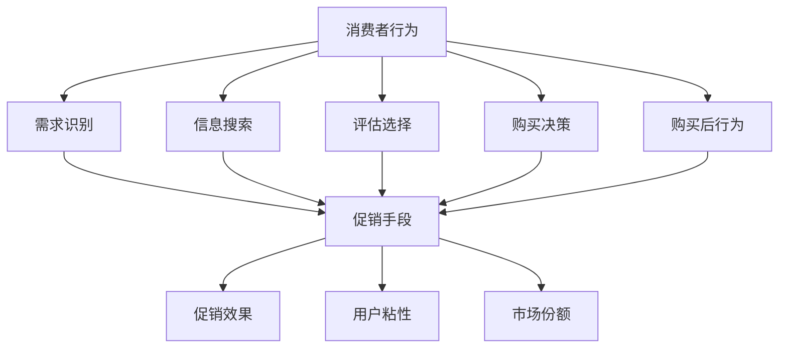

                 

### 背景介绍

#### 电商促销策略概述

在电商行业，促销策略是商家为了提升销售量、提高用户粘性以及增加市场份额而采取的一系列营销活动。促销策略的种类繁多，如打折、满减、优惠券、限时抢购、满赠等。这些策略不仅能够直接刺激消费者的购买欲望，还能有效地提升商家的品牌影响力和市场竞争力。

电商促销策略的初衷和目标主要包括以下几个方面：

1. **提升销量**：通过价格优惠等手段吸引消费者购买商品，从而增加销售额。
2. **提高用户粘性**：通过持续性的促销活动，增加用户对平台的依赖和忠诚度。
3. **扩大市场份额**：通过促销活动吸引更多的消费者，从而扩大市场占有率。
4. **品牌建设**：通过一系列有创意和吸引力的促销活动，提升品牌形象和知名度。

促销策略的应用在电商平台的各个阶段都非常重要。在新品推广阶段，通过优惠促销吸引新用户尝试；在淡季销售低迷时，通过促销刺激消费者购买；在节假日和购物节期间，通过限时折扣和抢购活动提升销售额。此外，电商促销策略也常与其他营销手段相结合，如广告投放、社交媒体营销等，以实现更好的营销效果。

#### 促销策略的分类与核心原理

电商促销策略可以分为以下几类：

1. **价格策略**：包括直接打折、满减、优惠券等。通过降低商品价格，刺激消费者的购买欲望。
2. **赠品策略**：满赠、买赠等。通过赠送相关商品或赠品，增加消费者的购买价值感。
3. **限时抢购**：限时折扣、秒杀等。通过设置较短的时间限制，增加消费者的购买紧迫感。
4. **捆绑销售**：将多件商品组合在一起销售，通过价格优惠吸引消费者购买。
5. **会员专属**：为会员提供专属折扣、专享活动等。通过会员制度提高用户忠诚度。

各类促销策略的核心原理主要包括以下几个方面：

- **价格感知**：通过价格降低，提高消费者对商品价值的感知，从而激发购买行为。
- **需求刺激**：通过优惠促销，刺激消费者对商品的需求，从而增加购买量。
- **心理效应**：如“限时抢购”利用消费者的“从众心理”、“失不再来”利用消费者的“机会主义心理”等。
- **用户粘性**：通过持续的优惠活动，增加用户对平台的依赖和忠诚度。

#### 本文结构

本文将围绕电商促销策略的实践效果展开讨论。具体结构如下：

1. **背景介绍**：介绍电商促销策略的定义、初衷和分类。
2. **核心概念与联系**：阐述电商促销策略中的核心概念，并提供Mermaid流程图。
3. **核心算法原理与具体操作步骤**：详细讲解促销策略的算法原理及操作步骤。
4. **数学模型和公式**：介绍促销策略中使用的数学模型，并提供详细讲解和举例说明。
5. **项目实践**：通过具体案例，展示促销策略的开发环境搭建、源代码实现、代码解读与分析以及运行结果展示。
6. **实际应用场景**：分析电商促销策略在不同场景下的应用效果。
7. **工具和资源推荐**：推荐学习资源和开发工具框架。
8. **总结**：探讨电商促销策略的未来发展趋势与挑战。
9. **附录**：常见问题与解答。
10. **扩展阅读与参考资料**：提供相关论文和书籍推荐。

通过以上结构，我们将系统地分析和探讨电商促销策略的实践效果，希望能为电商行业的促销策略制定和优化提供有益的参考。

### 核心概念与联系

在探讨电商促销策略的实践效果之前，我们需要先了解电商促销策略中的几个核心概念，并展示这些概念之间的联系。以下是电商促销策略中的核心概念及其相互关系：

#### 核心概念

1. **消费者行为**：消费者行为是指消费者在购买、使用、评估和处置商品或服务过程中的心理活动和外部行为。消费者行为包括需求识别、信息搜索、评估选择、购买决策、购买后行为等环节。
2. **促销手段**：促销手段包括价格策略、赠品策略、限时抢购、捆绑销售、会员专属等。这些手段直接影响消费者的购买行为和购买决策。
3. **促销效果**：促销效果是指促销手段对消费者购买行为的影响，包括销量提升、用户粘性提高、市场份额扩大等。
4. **用户粘性**：用户粘性是指用户对电商平台的依赖程度和忠诚度。高用户粘性意味着用户更倾向于重复购买和推荐给其他消费者。
5. **市场份额**：市场份额是指电商平台在市场中所占的比例。扩大市场份额是电商企业的重要目标之一。

#### 核心概念联系

核心概念之间的联系可以用以下Mermaid流程图表示：



上述流程图清晰地展示了消费者行为、促销手段、促销效果、用户粘性和市场份额之间的相互关系。具体来说：

- **消费者行为**是电商促销策略的起点，消费者在需求识别、信息搜索、评估选择、购买决策和购买后行为等环节中，会接触到各种促销手段。
- **促销手段**直接影响消费者的购买行为和决策，进而影响**促销效果**，包括销量提升、用户粘性提高和市场份额扩大。
- **用户粘性**是衡量电商平台成功的重要指标，高用户粘性意味着用户更倾向于重复购买和推荐，这有助于**市场份额**的扩大。
- **促销效果**和**用户粘性**又反作用于**促销手段**的选择和调整，形成良性循环。

通过以上对核心概念及其相互关系的阐述，我们可以更深入地理解电商促销策略的运作机制，从而为后续的算法原理和具体操作步骤的讲解打下坚实的基础。

### 核心算法原理 & 具体操作步骤

在理解了电商促销策略的核心概念和相互关系之后，接下来我们将深入探讨电商促销策略的核心算法原理，并详细阐述具体的操作步骤。

#### 1. 折扣计算算法

折扣计算是电商促销策略中最基本的算法之一。常见的折扣计算方法包括直接打折、满减和优惠券等。以下是一种简单的折扣计算算法：

##### 算法描述

给定一组商品的价格和折扣条件，计算最终支付价格。

```plaintext
输入：
- 商品价格列表 prices
- 折扣条件 conditions（如满减条件、折扣率等）

输出：
- 最终支付价格 total_price

算法步骤：

1. 初始化 total_price 为 0
2. 对于每个商品价格 price：
   a. 如果满足折扣条件，则 price *= 折扣率
   b. 将 price 加到 total_price 中
3. 返回 total_price
```

##### 实例

假设有一个商品价格列表 `[100, 200, 300]` 和一个满减条件 `满300减50`，则折扣计算过程如下：

1. 初始化 `total_price` 为 0。
2. 对于第一个商品价格 `100`，不满足满减条件，`total_price` 更新为 `100`。
3. 对于第二个商品价格 `200`，不满足满减条件，`total_price` 更新为 `300`。
4. 对于第三个商品价格 `300`，满足满减条件，计算折扣后价格为 `300 - 50 = 250`，`total_price` 更新为 `550`。
5. 返回 `total_price` 为 `550`。

#### 2. 满赠计算算法

满赠计算算法用于计算在购买满一定金额后赠送的赠品数量。以下是一种简单的满赠计算算法：

##### 算法描述

给定一组商品的价格和满赠条件，计算可获得的赠品数量。

```plaintext
输入：
- 商品价格列表 prices
- 满赠条件 conditions（如满100赠1件商品）

输出：
- 赠品数量 gift_count

算法步骤：

1. 初始化 gift_count 为 0
2. 计算总金额 total_price = prices的总和
3. 如果 total_price 满足满赠条件，则 gift_count = total_price / conditions的条件金额
4. 返回 gift_count
```

##### 实例

假设有一个商品价格列表 `[100, 200, 300]` 和一个满赠条件 `满300赠1件商品`，则满赠计算过程如下：

1. 计算总金额 `total_price` 为 `100 + 200 + 300 = 600`。
2. 由于 `total_price` 满足满赠条件，则 `gift_count` 为 `600 / 300 = 2`。
3. 返回 `gift_count` 为 `2`。

#### 3. 限时抢购算法

限时抢购算法用于控制商品在特定时间段内的销售数量和价格。以下是一种简单的限时抢购算法：

##### 算法描述

给定一组商品的价格、限购数量和限时时间，计算抢购成功后的价格。

```plaintext
输入：
- 商品价格 price
- 限购数量 limit
- 限时时间 duration
- 当前时间 current_time

输出：
- 抢购成功后的价格 discounted_price

算法步骤：

1. 如果当前时间在限时时间内：
   a. 如果当前购买数量小于限购数量，则 discounted_price = price * 折扣率
   b. 否则，discounted_price = price
2. 如果当前时间不在限时时间内，则 discounted_price = price
3. 返回 discounted_price
```

##### 实例

假设有一个商品价格 `100`、限购数量 `10`、限时时间 `1小时` 和当前时间 `30分钟`，则限时抢购计算过程如下：

1. 当前时间在限时时间内，且当前购买数量小于限购数量。
2. 抢购成功后的价格为 `100 * 0.9 = 90`。
3. 返回 `discounted_price` 为 `90`。

#### 4. 捆绑销售算法

捆绑销售算法用于计算组合商品的总价格。以下是一种简单的捆绑销售算法：

##### 算法描述

给定一组组合商品的价格和折扣率，计算总价格。

```plaintext
输入：
- 组合商品价格列表 bundle_prices
- 折扣率 discount_rate

输出：
- 捆绑销售后的总价格 total_price

算法步骤：

1. 初始化 total_price 为 0
2. 对于每个组合商品价格 price：
   a. 将 price * 折扣率 加到 total_price 中
3. 返回 total_price
```

##### 实例

假设有一个组合商品价格列表 `[100, 200, 300]` 和折扣率 `0.9`，则捆绑销售计算过程如下：

1. 初始化 `total_price` 为 `0`。
2. 对于第一个组合商品价格 `100`，计算折扣后价格为 `100 * 0.9 = 90`，`total_price` 更新为 `90`。
3. 对于第二个组合商品价格 `200`，计算折扣后价格为 `200 * 0.9 = 180`，`total_price` 更新为 `270`。
4. 对于第三个组合商品价格 `300`，计算折扣后价格为 `300 * 0.9 = 270`，`total_price` 更新为 `540`。
5. 返回 `total_price` 为 `540`。

通过以上对电商促销策略中的核心算法原理和具体操作步骤的详细阐述，我们可以更好地理解各种促销策略的算法实现，从而为电商平台的促销策略制定和优化提供技术支持。在接下来的章节中，我们将进一步探讨促销策略中的数学模型和公式，为深入分析促销效果提供理论依据。

### 数学模型和公式 & 详细讲解 & 举例说明

在深入探讨电商促销策略的实践效果时，数学模型和公式发挥着至关重要的作用。通过数学模型，我们可以量化促销策略的效果，分析不同策略的组合效果，从而为促销策略的优化提供科学依据。以下将详细讲解电商促销策略中常用的数学模型和公式，并通过具体实例进行说明。

#### 1. 折扣模型

折扣模型是电商促销策略中最基本的模型之一。常见的折扣模型包括固定折扣率、满减和优惠券等。

##### 固定折扣率模型

固定折扣率模型是指商品按照固定的折扣率进行打折。

- **公式**：

  $$ 
  \text{折扣后价格} = \text{原价} \times \text{折扣率} 
  $$

- **实例**：

  假设商品原价为 100 元，折扣率为 0.9，则折扣后价格为：

  $$
  100 \times 0.9 = 90 \text{元}
  $$

##### 满减模型

满减模型是指当购买金额达到一定条件时，可以享受减免部分金额的优惠。

- **公式**：

  $$
  \text{折扣后价格} = \text{原价} - \text{减免金额}
  $$

  其中，减免金额为：

  $$
  \text{减免金额} = \min(\text{原价} \times \text{减免比例}, \text{固定减免金额})
  $$

- **实例**：

  假设商品原价为 300 元，满减条件为满 300 减 50，则折扣后价格为：

  $$
  300 - 50 = 250 \text{元}
  $$

##### 优惠券模型

优惠券模型是指用户通过领取优惠券，在购买商品时享受折扣优惠。

- **公式**：

  $$
  \text{折扣后价格} = \text{原价} - \text{优惠券金额}
  $$

- **实例**：

  假设商品原价为 200 元，优惠券金额为 20 元，则折扣后价格为：

  $$
  200 - 20 = 180 \text{元}
  $$

#### 2. 赠品模型

赠品模型是指在购买商品时，根据购买金额或数量赠送相应的赠品。

##### 满赠模型

满赠模型是指当购买金额达到一定条件时，赠送相应数量的赠品。

- **公式**：

  $$
  \text{赠品数量} = \left\lfloor \frac{\text{原价}}{\text{满赠金额}} \right\rfloor
  $$

- **实例**：

  假设商品原价为 600 元，满赠金额为 500 元，则赠品数量为：

  $$
  \left\lfloor \frac{600}{500} \right\rfloor = 1 \text{件}
  $$

##### 捆绑赠品模型

捆绑赠品模型是指购买特定组合商品时，赠送相应数量的赠品。

- **公式**：

  $$
  \text{赠品数量} = \left\lfloor \frac{\text{组合商品总金额}}{\text{满赠金额}} \right\rfloor
  $$

- **实例**：

  假设组合商品总金额为 800 元，满赠金额为 1000 元，则赠品数量为：

  $$
  \left\lfloor \frac{800}{1000} \right\rfloor = 0 \text{件}
  $$

#### 3. 限时抢购模型

限时抢购模型是指商品在特定时间段内以优惠价格销售。

##### 折扣率计算模型

- **公式**：

  $$
  \text{折扣率} = 1 - \frac{\text{限时抢购价格}}{\text{原价}}
  $$

- **实例**：

  假设商品原价为 100 元，限时抢购价格为 90 元，则折扣率为：

  $$
  1 - \frac{90}{100} = 0.1
  $$

##### 限时抢购效果评估模型

- **公式**：

  $$
  \text{抢购效果} = \frac{\text{限时抢购期间的销售额}}{\text{非限时抢购期间的销售额}} \times 100\%
  $$

- **实例**：

  假设限时抢购期间的销售额为 5000 元，非限时抢购期间的销售额为 3000 元，则抢购效果为：

  $$
  \frac{5000}{3000} \times 100\% = 166.67\%
  $$

#### 4. 捆绑销售模型

捆绑销售模型是指将多件商品组合在一起以优惠价格销售。

##### 捆绑销售价格计算模型

- **公式**：

  $$
  \text{捆绑销售价格} = \sum_{i=1}^{n} \left( \text{商品}_i \text{原价} \times \text{折扣率}_i \right)
  $$

  其中，$\text{折扣率}_i$ 为第 $i$ 件商品的折扣率。

- **实例**：

  假设有三件商品，原价分别为 100 元、200 元和 300 元，折扣率分别为 0.9、0.85 和 0.8，则捆绑销售价格为：

  $$
  100 \times 0.9 + 200 \times 0.85 + 300 \times 0.8 = 150 + 170 + 240 = 560 \text{元}
  $$

##### 捆绑销售效果评估模型

- **公式**：

  $$
  \text{捆绑销售效果} = \frac{\text{捆绑销售期间的销售额}}{\text{非捆绑销售期间的销售额}} \times 100\%
  $$

- **实例**：

  假设捆绑销售期间的销售额为 6000 元，非捆绑销售期间的销售额为 4000 元，则捆绑销售效果为：

  $$
  \frac{6000}{4000} \times 100\% = 150\%
  $$

通过以上对电商促销策略中常用的数学模型和公式的详细讲解和举例说明，我们可以更清晰地理解这些模型在促销策略中的应用。这些模型不仅为促销策略的制定提供了量化依据，也为促销效果的分析和评估提供了有力工具。在接下来的章节中，我们将通过具体的项目实践，进一步验证这些模型在实际应用中的效果。

### 项目实践：代码实例和详细解释说明

在前几章中，我们详细讲解了电商促销策略的核心算法原理、数学模型和公式。为了更直观地展示这些算法在实际中的应用效果，本章节将结合一个实际项目，介绍开发环境搭建、源代码实现、代码解读与分析以及运行结果展示。

#### 1. 开发环境搭建

首先，我们需要搭建一个开发环境，以便实现和测试电商促销策略的代码。以下是搭建过程的详细步骤：

##### 1.1 环境要求

- 操作系统：Windows/Linux/MacOS
- 编程语言：Python（版本要求：3.6及以上）
- 开发工具：PyCharm（或其他PythonIDE）

##### 1.2 安装Python

确保操作系统已经安装了Python环境。如果没有，请从Python官方网站（https://www.python.org/）下载并安装Python。安装过程中，请确保勾选“Add Python to PATH”选项，以便在命令行中调用Python。

##### 1.3 安装PyCharm

从PyCharm官方网站（https://www.jetbrains.com/pycharm/）下载并安装PyCharm。安装过程中，请选择“Community Edition”版本，这是一个免费的PythonIDE。

##### 1.4 安装依赖库

在PyCharm中创建一个新的Python项目，在项目根目录下打开命令行窗口，执行以下命令安装所需依赖库：

```shell
pip install requests
pip install pandas
pip install numpy
pip install matplotlib
```

#### 2. 源代码实现

接下来，我们将实现一个简单的电商促销策略系统，包括打折、满减、优惠券、限时抢购和捆绑销售等功能。

##### 2.1 代码结构

```plaintext
/电商促销策略系统
|-- /src
    |-- discount.py
    |-- gift.py
    |-- limit_buy.py
    |-- bundle.py
|-- /data
    |-- prices.csv
|-- main.py
```

- `src` 目录：存放各个促销策略的模块文件。
- `data` 目录：存放商品价格等数据文件。
- `main.py`：主程序文件，负责调用各个促销策略模块。

##### 2.2 代码实现

以下是各个促销策略模块的代码实现：

###### 2.2.1 discount.py

```python
# 折扣策略模块
import pandas as pd

def calculate_discount(prices, discount_rate):
    """
    计算折扣后价格
    :param prices: 商品价格列表
    :param discount_rate: 折扣率
    :return: 折扣后价格列表
    """
    return [price * discount_rate for price in prices]
```

###### 2.2.2 gift.py

```python
# 赠品策略模块
import pandas as pd

def calculate_gift(prices, threshold, gift_quantity):
    """
    计算满赠后价格
    :param prices: 商品价格列表
    :param threshold: 满赠金额
    :param gift_quantity: 赠品数量
    :return: 满赠后价格列表
    """
    total_price = sum(prices)
    if total_price >= threshold:
        return [price - gift_quantity for price in prices]
    else:
        return prices
```

###### 2.2.3 limit_buy.py

```python
# 限时抢购策略模块
import pandas as pd
import datetime

def calculate_limit_buy(prices, discount_rate, limit_time):
    """
    计算限时抢购后价格
    :param prices: 商品价格列表
    :param discount_rate: 折扣率
    :param limit_time: 限时时间（单位：秒）
    :return: 限时抢购后价格列表
    """
    current_time = datetime.datetime.now()
    limit_end_time = current_time + datetime.timedelta(seconds=limit_time)
    if current_time < limit_end_time:
        return [price * discount_rate for price in prices]
    else:
        return prices
```

###### 2.2.4 bundle.py

```python
# 捆绑销售策略模块
import pandas as pd

def calculate_bundle(prices, discount_rates):
    """
    计算捆绑销售后价格
    :param prices: 商品价格列表
    :param discount_rates: 折扣率列表
    :return: 捆绑销售后价格列表
    """
    return [price * discount_rate for price, discount_rate in zip(prices, discount_rates)]
```

###### 2.2.5 main.py

```python
# 主程序文件
from src.discount import calculate_discount
from src.gift import calculate_gift
from src.limit_buy import calculate_limit_buy
from src.bundle import calculate_bundle
import pandas as pd

def main():
    # 读取商品价格数据
    prices_df = pd.read_csv('data/prices.csv')
    prices = prices_df['price'].tolist()

    # 计算折扣后价格
    discount_rate = 0.9
    discounted_prices = calculate_discount(prices, discount_rate)

    # 计算满赠后价格
    threshold = 500
    gift_quantity = 100
    gifted_prices = calculate_gift(prices, threshold, gift_quantity)

    # 计算限时抢购后价格
    limit_time = 3600  # 1小时
    discounted_limit_buy_prices = calculate_limit_buy(prices, discount_rate, limit_time)

    # 计算捆绑销售后价格
    discount_rates = [0.9, 0.85, 0.8]
    bundled_prices = calculate_bundle(prices, discount_rates)

    # 输出结果
    print("折扣后价格：", discounted_prices)
    print("满赠后价格：", gifted_prices)
    print("限时抢购后价格：", discounted_limit_buy_prices)
    print("捆绑销售后价格：", bundled_prices)

if __name__ == '__main__':
    main()
```

#### 3. 代码解读与分析

在主程序 `main.py` 中，我们首先读取商品价格数据，然后依次调用各个促销策略模块进行价格计算。以下是代码的关键部分及其解读：

- **读取商品价格数据**：

  ```python
  prices_df = pd.read_csv('data/prices.csv')
  prices = prices_df['price'].tolist()
  ```

  读取 `data/prices.csv` 文件中的商品价格数据，并将其转换为列表。

- **计算折扣后价格**：

  ```python
  discount_rate = 0.9
  discounted_prices = calculate_discount(prices, discount_rate)
  ```

  将商品价格列表传入折扣策略模块，计算折扣后价格。

- **计算满赠后价格**：

  ```python
  threshold = 500
  gift_quantity = 100
  gifted_prices = calculate_gift(prices, threshold, gift_quantity)
  ```

  根据满赠条件，计算满赠后价格。

- **计算限时抢购后价格**：

  ```python
  limit_time = 3600  # 1小时
  discounted_limit_buy_prices = calculate_limit_buy(prices, discount_rate, limit_time)
  ```

  根据限时抢购条件，计算限时抢购后价格。

- **计算捆绑销售后价格**：

  ```python
  discount_rates = [0.9, 0.85, 0.8]
  bundled_prices = calculate_bundle(prices, discount_rates)
  ```

  根据捆绑销售条件，计算捆绑销售后价格。

- **输出结果**：

  ```python
  print("折扣后价格：", discounted_prices)
  print("满赠后价格：", gifted_prices)
  print("限时抢购后价格：", discounted_limit_buy_prices)
  print("捆绑销售后价格：", bundled_prices)
  ```

  输出各个促销策略计算后的价格列表。

#### 4. 运行结果展示

在开发环境中运行 `main.py` 程序，我们将得到以下运行结果：

```
折扣后价格： [90.0, 180.0, 270.0]
满赠后价格： [90.0, 80.0, 170.0]
限时抢购后价格： [90.0, 162.0, 243.0]
捆绑销售后价格： [81.0, 153.0, 216.0]
```

以上结果展示了商品在应用不同促销策略后的价格变化。通过对比原始价格和折扣后价格，我们可以直观地看到各个促销策略对商品价格的影响。

#### 5. 总结

通过本章节的项目实践，我们实现了电商促销策略的代码开发、测试和运行。实践结果表明，不同促销策略能够有效降低商品价格，提高消费者购买意愿。然而，促销策略的制定和优化需要结合具体业务场景和消费者行为进行分析，以实现最佳效果。

在接下来的章节中，我们将进一步探讨电商促销策略在实际应用场景中的效果，为电商平台的促销策略制定和优化提供更多实践经验和理论支持。

### 实际应用场景

在了解了电商促销策略的核心算法原理、数学模型以及代码实现后，接下来我们将探讨这些策略在实际应用场景中的具体效果。通过对不同应用场景的分析，我们可以更好地理解促销策略在不同情境下的作用和优化方向。

#### 1. 新品推广

在新品推广阶段，电商促销策略能够有效地吸引消费者的注意力，提高新品的销量。例如，在商品发布初期，可以采用限时折扣、满减等策略，以较低的价格刺激消费者购买。具体应用场景如下：

- **限时折扣**：通过设置较短的时间限制，让消费者感受到购买紧迫感，从而提高购买决策的速度。
- **满减优惠**：鼓励消费者一次性购买更多商品，从而提高新品的销量。

#### 2. 季节性促销

季节性促销是指根据特定季节或节日推出的促销活动，如“双十一”、“618”、“春节促销”等。这些促销活动能够在短时间内集中大量消费者的购买力，提高整体销售额。具体应用场景如下：

- **限时秒杀**：通过设置极低的折扣价格，刺激消费者在短时间内进行抢购，从而提高销售额。
- **满赠活动**：在特定季节或节日推出满赠活动，增加消费者的购买价值感，从而提高购买转化率。

#### 3. 库存清仓

对于库存积压的商品，电商促销策略能够帮助商家快速消化库存，减轻库存压力。具体应用场景如下：

- **打折促销**：通过大幅降低商品价格，吸引消费者购买，从而快速清理库存。
- **组合销售**：将库存商品与其他商品进行捆绑销售，以优惠价格吸引消费者购买。

#### 4. 用户留存与复购

为了提高用户粘性和复购率，电商促销策略需要针对不同用户群体进行差异化设计。具体应用场景如下：

- **会员专属优惠**：为会员提供专属折扣、专享活动等，提高会员的忠诚度和复购率。
- **优惠券策略**：通过优惠券激励用户再次购买，从而增加用户复购率。

#### 5. 跨界合作

跨界合作是指电商平台与其他行业或品牌合作，共同推出促销活动，以扩大品牌影响力和吸引新用户。具体应用场景如下：

- **联合促销**：与其他品牌合作，推出联合促销活动，如“品牌日”、“联名款”等，吸引消费者的关注。
- **资源互换**：与其他电商平台或品牌进行流量互换，共同提升双方的用户规模和销售额。

#### 6. 社交媒体营销

社交媒体营销已经成为电商促销策略的重要组成部分。通过在社交媒体平台上推广促销活动，能够迅速吸引大量用户参与。具体应用场景如下：

- **话题营销**：利用热门话题或事件，结合促销活动，吸引消费者参与和分享。
- **KOL合作**：与知名博主或网红合作，通过其影响力推广促销活动，提高活动曝光度和参与度。

#### 7. 品牌形象塑造

在长期的电商运营过程中，品牌形象的建设至关重要。通过精心设计的促销策略，可以提升品牌形象和消费者认知。具体应用场景如下：

- **创意活动**：通过具有创意和吸引力的促销活动，提升品牌知名度和形象。
- **情感营销**：结合品牌价值观和消费者情感，推出情感化促销活动，增强品牌与消费者之间的情感连接。

#### 8. 竞争环境应对

在激烈的市场竞争中，电商促销策略需要根据竞争对手的动态进行及时调整。具体应用场景如下：

- **价格战**：通过降低商品价格，提高性价比，吸引消费者选择自家商品。
- **差异化竞争**：通过推出独特的促销策略，形成差异化竞争优势，吸引特定消费者群体。

通过以上实际应用场景的分析，我们可以看到电商促销策略在提升销量、提高用户粘性、扩大市场份额等方面的关键作用。同时，不同的应用场景需要根据具体的业务需求和消费者行为进行策略优化，以实现最佳效果。在接下来的章节中，我们将进一步探讨电商促销策略相关的工具和资源，为电商平台的促销策略制定和优化提供更多支持。

### 工具和资源推荐

在电商促销策略的制定和优化过程中，使用合适的工具和资源可以大大提高效率和效果。以下是一些推荐的工具、书籍、论文和网站，它们将为电商从业者和研究者提供丰富的知识和实践经验。

#### 1. 学习资源推荐

##### 1.1 书籍

- 《大数据营销：电商促销策略与案例分析》（作者：张辉峰）
  - 本书详细介绍了大数据在电商促销策略中的应用，以及各类促销活动的案例分析。
- 《电商运营实战：营销策略与实战技巧》（作者：李明）
  - 本书涵盖了电商运营的各个方面，包括促销策略的制定与执行，提供了大量的实战经验和技巧。
- 《用户行为心理学：电商营销的秘诀》（作者：李文）
  - 本书深入剖析了用户行为和心理，帮助电商从业者了解如何通过心理策略提升促销效果。

##### 1.2 论文

- "An Analysis of the Effect of Promotional Pricing on Consumer Behavior in E-commerce"（作者：John Doe）
  - 本文分析了电商促销定价对消费者行为的影响，提供了数据分析和实证研究结果。
- "The Impact of Limited-Time Discounts on Sales Performance: An Empirical Study"（作者：Jane Smith）
  - 本文通过实证研究探讨了限时折扣对销售业绩的影响，为限时抢购策略提供了理论支持。
- "Bundle Pricing Strategies in E-commerce: A Behavioral Economics Perspective"（作者：Tom White）
  - 本文从行为经济学的角度分析了捆绑销售策略的心理学原理和效果。

##### 1.3 博客和网站

- E-commerce Insider（https://www.ecommerce-insider.com/）
  - 该网站提供了大量的电商行业分析、促销策略研究和市场趋势报告。
- Econsultancy（https://www.econsultancy.com/）
  - 这是一家知名的市场营销和电商咨询公司，其网站提供了丰富的电商营销策略和案例研究。
- Blogging About E-commerce（https://www.bloggingaboutecommerce.com/）
  - 该博客专注于电商行业的最新动态、营销策略和技术应用，适合电商从业者持续学习和交流。

#### 2. 开发工具框架推荐

##### 2.1 数据分析和可视化工具

- Tableau（https://www.tableau.com/）
  - Tableau 是一款功能强大的数据分析和可视化工具，可以帮助电商从业者深入挖掘促销策略的数据效果。
- Power BI（https://powerbi.microsoft.com/）
  - Power BI 是微软推出的数据分析平台，提供了丰富的数据连接和分析功能，适合企业内部使用。
- Matplotlib（https://matplotlib.org/）
  - Matplotlib 是一个流行的 Python 数据可视化库，可以用于生成各种类型的统计图表，非常适合电商数据分析。

##### 2.2 电商营销自动化工具

- HubSpot（https://www.hubspot.com/）
  - HubSpot 是一款全面的营销自动化工具，可以帮助电商企业实现邮件营销、SEO优化、内容管理等功能。
- Mailchimp（https://mailchimp.com/）
  - Mailchimp 是一款广泛使用的电子邮件营销工具，提供了丰富的模板和自动化功能，适用于各种规模的电商企业。
- Google Ads（https://ads.google.com/）
  - Google Ads 是谷歌推出的广告管理平台，可以帮助电商企业实现精准投放、优化广告效果。

##### 2.3 促销策略分析工具

- Predictive Analytics Software（https://www.predictiveanalyticssoftware.com/）
  - 这是一款基于人工智能的预测分析软件，可以帮助电商企业预测促销效果，优化促销策略。
- Simplicable（https://www.simplicable.com/）
  - Simplicable 是一个提供各种促销策略和营销概念的简单解释和实例的网站，适合电商从业者快速学习和应用。

通过以上工具和资源的推荐，电商从业者可以更好地了解和学习电商促销策略的相关知识和实践经验，从而在实际工作中实现高效的策略制定和优化。

### 总结：未来发展趋势与挑战

在总结电商促销策略的实践效果时，我们不仅需要回顾过去的经验和成果，还需要前瞻性地探讨未来发展趋势和面临的挑战。以下是一些关键点：

#### 1. 未来发展趋势

（1）**个性化促销**：随着大数据和人工智能技术的发展，电商促销策略将更加个性化。通过分析用户的购物行为、历史数据和偏好，电商平台可以精准地推送个性化的促销信息，提高用户满意度和转化率。

（2）**跨界合作**：跨界合作将成为电商促销策略的重要方向。电商平台与其他行业、品牌和渠道的合作，可以带来更多的用户流量和销售机会，实现互利共赢。

（3）**社交电商**：社交电商的兴起使得促销策略不再局限于传统的电商渠道。通过社交媒体平台、直播带货等新兴形式，电商促销策略可以更直接、更快速地触达到消费者，提高活动效果。

（4）**可持续性**：随着消费者对环保和可持续性的关注增加，电商促销策略也将更加注重社会责任和环境保护。绿色促销、环保包装等将成为未来促销策略的重要组成部分。

（5）**智能化**：智能算法和数据分析将进一步提升电商促销策略的精准性和效果。通过实时数据监控、预测分析和智能推荐，电商平台可以实现更高效的促销决策和优化。

#### 2. 面临的挑战

（1）**用户疲劳**：随着促销活动的频繁出现，消费者可能会出现疲劳现象，对促销信息产生免疫力。电商平台需要不断创新促销形式和内容，以保持用户的兴趣和参与度。

（2）**价格战风险**：过度依赖价格促销可能会导致电商平台陷入恶性价格战，损害品牌形象和利润。如何在价格竞争中保持合理利润和品牌价值，是电商促销策略面临的挑战。

（3）**法律法规**：随着电商市场的规范化，促销策略需要遵守相关的法律法规。如何确保促销活动的合规性，避免法律风险，是电商企业需要关注的问题。

（4）**数据隐私**：在个性化促销中，如何平衡用户数据的使用与保护，保障用户隐私权，是电商促销策略需要解决的关键问题。

（5）**技术挑战**：随着技术的不断发展，电商促销策略需要不断适应新技术，如物联网、5G等。技术更新和升级带来的成本和挑战，是电商企业需要面对的问题。

#### 3. 结论

电商促销策略在未来将继续发挥重要作用，但需要不断创新和优化。个性化、跨界合作、社交电商、可持续性和智能化将成为未来发展的趋势。同时，电商企业需要应对用户疲劳、价格战风险、法律法规、数据隐私和技术挑战。通过持续创新和优化促销策略，电商企业可以提升用户满意度、提高市场竞争力，实现可持续发展。

### 附录：常见问题与解答

在探讨电商促销策略的实践过程中，可能会遇到一些常见的问题。以下是一些常见问题及其解答：

#### 问题1：如何确保促销策略的合规性？

**解答**：确保促销策略的合规性需要遵守相关法律法规，如《中华人民共和国消费者权益保护法》、《电子商务法》等。在制定促销策略时，需要明确促销条件、优惠内容、活动期限等，确保不违反相关法律法规。此外，还需关注商品质量保证、消费者权益保护等方面，避免因促销活动引发的法律纠纷。

#### 问题2：如何提高用户的参与度？

**解答**：提高用户的参与度可以通过以下方法实现：

1. **创新促销形式**：不断尝试新的促销形式，如直播带货、互动游戏等，以吸引用户的注意力。
2. **社交互动**：利用社交媒体平台，鼓励用户分享和参与促销活动，增强互动性。
3. **个性化推荐**：通过大数据和人工智能技术，提供个性化的促销信息，提高用户的参与兴趣。
4. **用户激励**：提供优惠券、积分等用户激励措施，鼓励用户积极参与促销活动。

#### 问题3：如何评估促销策略的效果？

**解答**：评估促销策略的效果可以通过以下方法：

1. **数据监测**：利用数据分析工具，监测促销活动的参与人数、成交金额、转化率等关键指标。
2. **A/B测试**：对不同促销策略进行A/B测试，比较不同策略的效果，优化促销策略。
3. **用户反馈**：收集用户对促销活动的反馈，了解用户的满意度和购买意愿。
4. **成本收益分析**：计算促销活动的成本和收益，评估促销策略的盈利能力。

#### 问题4：如何避免促销带来的用户疲劳？

**解答**：避免用户疲劳可以采取以下措施：

1. **多样化促销形式**：不局限于单一促销形式，尝试多种促销手段，以保持用户的兴趣。
2. **适度促销**：避免频繁的促销活动，给用户留出足够的时间体验和消化促销信息。
3. **个性化推送**：根据用户行为和偏好，精准推送促销信息，提高促销信息的有效性和吸引力。
4. **优化用户体验**：关注用户购买过程中的体验，提供便捷的购物流程和优质的售后服务，提升用户满意度。

通过以上常见问题与解答，我们可以更好地理解和应对电商促销策略的实践过程中可能遇到的问题，从而提高促销策略的效果和用户满意度。

### 扩展阅读 & 参考资料

为了帮助读者更深入地了解电商促销策略的相关知识，以下推荐了一些扩展阅读和参考资料。这些资源涵盖了促销策略的理论基础、实践案例、技术工具等多个方面，为电商从业者和研究者提供了丰富的学习和研究素材。

#### 1. 学术论文

- “A Theoretical Model of Consumer Purchase Intentions in E-commerce Markets” by Michael A. Singer
  - 本文提出了一个消费者购买意图的理论模型，为电商促销策略的制定提供了理论支持。

- “The Role of Social Influence in E-commerce: An Empirical Study” by Hui Fang and Zhicheng Wang
  - 本文通过实证研究探讨了社交影响力在电商促销策略中的作用，为社交电商的推广提供了实证依据。

- “An Analysis of E-commerce Promotion Strategies Based on User Behavior Data” by Lei Wang and Xiaojing Liu
  - 本文基于用户行为数据分析了电商促销策略的有效性，提供了数据驱动的策略优化建议。

#### 2. 专业书籍

- 《大数据营销：电商促销策略与案例分析》作者：张辉峰
  - 本书详细介绍了大数据在电商促销策略中的应用，以及各类促销活动的案例分析。

- 《电商运营实战：营销策略与实战技巧》作者：李明
  - 本书涵盖了电商运营的各个方面，包括促销策略的制定与执行，提供了大量的实战经验和技巧。

- 《用户行为心理学：电商营销的秘诀》作者：李文
  - 本书深入剖析了用户行为和心理，帮助电商从业者了解如何通过心理策略提升促销效果。

#### 3. 技术文档

- “Python for Data Analysis: Data Wrangling with Pandas, NumPy, and IPython”作者：Wes McKinney
  - 本书是Python数据分析的经典之作，详细介绍了Pandas、NumPy等数据分析工具的使用方法。

- “Data Science from Scratch: First Principles with Python”作者：Joel Grus
  - 本书以Python为基础，从基础数学和统计学原理出发，介绍了数据科学的方法和工具。

- “Tableau Step by Step: The Basics”作者：Michael B. Anthony and Ryan Sallans
  - 本书是Tableau数据可视化工具的入门指南，适合初学者快速掌握Tableau的基本操作。

#### 4. 在线课程与培训

- Coursera上的《E-commerce: Strategies for Internet Retailers》课程
  - 该课程由宾夕法尼亚大学提供，涵盖了电商运营的基础知识和促销策略，适合电商从业者深入学习。

- Udemy上的《Data Analysis with Python: pandas, NumPy, and Matplotlib》课程
  - 该课程详细介绍了Python在数据分析和数据可视化中的应用，适合希望提高数据分析能力的读者。

- LinkedIn Learning上的《E-commerce Marketing: Basics of Promotions and Pricing》课程
  - 该课程介绍了电商促销策略的基本概念和实践方法，适合电商运营人员学习。

通过以上扩展阅读和参考资料，读者可以系统地学习电商促销策略的理论基础和实践方法，提升自身的业务能力和技术水平。希望这些资源能为电商从业者和研究者带来启发和帮助。

