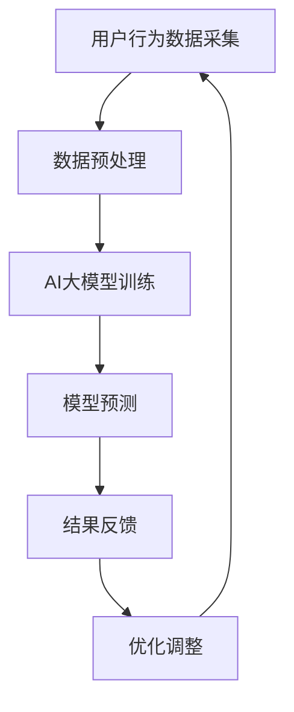

                 

### 文章标题

《电商平台中的AI大模型与5G技术结合》

> **关键词**：电商平台、AI大模型、5G技术、深度学习、数据分析、实时响应

> **摘要**：本文将探讨AI大模型与5G技术在电商平台中的应用，从背景介绍、核心概念与联系、核心算法原理、数学模型、项目实践、实际应用场景、工具和资源推荐、总结及未来发展趋势等方面，全面剖析AI大模型与5G技术在电商平台中的结合，为电商企业提升运营效率和用户体验提供新思路。

---

## 1. 背景介绍

在当今数字化时代，电商平台已成为消费者购买商品的主要渠道。随着用户数量的急剧增长，电商平台面临的挑战也越来越大。如何提高运营效率、降低成本、提升用户体验成为各大电商平台亟待解决的问题。近年来，AI大模型和5G技术的快速发展为电商平台提供了新的机遇。

### AI大模型

AI大模型是指具有巨大参数量和复杂结构的机器学习模型，如深度学习模型。这些模型可以处理海量数据，从中提取有价值的信息，为电商平台提供智能决策支持。例如，电商推荐系统可以根据用户的历史行为数据，预测用户的兴趣偏好，从而实现精准推荐。

### 5G技术

5G技术是第五代移动通信技术，具有高速率、低延迟、大连接等特点。5G技术的普及将极大地提升电商平台的响应速度和用户体验。例如，在商品展示、实时互动、物流追踪等方面，5G技术可以提供更流畅、更快速的服务。

### 挑战与机遇

电商平台在发展过程中面临着诸多挑战，如数据隐私保护、算法公平性、系统稳定性等。而AI大模型和5G技术的结合为电商平台带来了前所未有的机遇。通过AI大模型，电商平台可以更深入地挖掘用户数据，提高运营效率；通过5G技术，电商平台可以实现更快速、更稳定的服务，提升用户体验。本文将围绕AI大模型与5G技术在电商平台中的应用，展开深入探讨。

## 2. 核心概念与联系

在讨论AI大模型与5G技术在电商平台中的应用之前，我们需要先了解相关核心概念及其相互联系。

### 2.1 AI大模型

AI大模型是指具有巨大参数量和复杂结构的机器学习模型，如深度学习模型。这些模型可以处理海量数据，从中提取有价值的信息，为电商平台提供智能决策支持。常见的AI大模型包括：

1. **深度神经网络（DNN）**：一种多层神经网络，通过逐层提取特征，实现对数据的分类、回归等任务。
2. **循环神经网络（RNN）**：一种能够处理序列数据的神经网络，适用于文本分类、语音识别等任务。
3. **卷积神经网络（CNN）**：一种能够处理图像数据的神经网络，适用于图像分类、目标检测等任务。
4. **生成对抗网络（GAN）**：一种由生成器和判别器组成的神经网络，可以生成逼真的图像、音频等数据。

### 2.2 5G技术

5G技术是第五代移动通信技术，具有高速率、低延迟、大连接等特点。5G技术的主要优势包括：

1. **高速率**：5G技术可以实现高达10Gbps的峰值下载速度，为电商平台提供更快速的数据传输能力。
2. **低延迟**：5G技术可以将端到端的延迟降低至1ms，为电商平台提供更实时、更流畅的服务。
3. **大连接**：5G技术可以支持更多设备同时接入网络，为电商平台提供更广泛的应用场景。

### 2.3 核心概念联系

AI大模型与5G技术的结合为电商平台带来了诸多优势。首先，5G技术的高速率和大连接特点为AI大模型提供了丰富的数据资源，使得AI大模型可以更高效地训练和预测。其次，5G技术的低延迟特点使得电商平台可以实现更快速的响应，提升用户体验。最后，AI大模型可以为电商平台提供更精准的推荐、更智能的客服等应用，进一步优化电商平台的运营效率。

### 2.4 Mermaid流程图

为了更直观地展示AI大模型与5G技术在电商平台中的应用流程，我们使用Mermaid流程图进行描述。



在上述流程图中，用户行为数据经过采集、预处理后，输入到AI大模型进行训练。训练好的模型进行预测，并将预测结果反馈给用户。根据用户反馈，模型会不断优化调整，以实现更精准的预测。

## 3. 核心算法原理 & 具体操作步骤

### 3.1 深度学习算法原理

深度学习算法是一种基于多层神经网络进行训练和预测的算法。其基本原理是通过逐层提取特征，实现对数据的分类、回归等任务。在深度学习算法中，常用的算法包括：

1. **前向传播**：将输入数据传递到网络的每一层，通过激活函数将数据传递到下一层。
2. **反向传播**：计算输出结果与实际结果的误差，将误差反向传递到每一层，更新网络中的参数。
3. **梯度下降**：通过梯度下降算法，不断调整网络中的参数，使得输出结果与实际结果误差最小。

### 3.2 具体操作步骤

下面以深度学习算法在电商平台中的应用为例，介绍具体操作步骤。

#### 3.2.1 数据采集

电商平台需要收集用户的行为数据，包括浏览记录、购买记录、搜索记录等。这些数据可以通过API接口、日志分析等方式进行采集。

#### 3.2.2 数据预处理

采集到的数据需要进行预处理，包括数据清洗、数据转换、特征提取等操作。数据清洗主要是去除数据中的噪声和异常值；数据转换主要是将数据转换为适合深度学习算法的形式；特征提取主要是从原始数据中提取有用的特征，以提升模型的性能。

#### 3.2.3 模型训练

使用预处理后的数据，构建深度学习模型。模型的构建包括选择合适的神经网络结构、设置合适的参数等。常见的神经网络结构包括卷积神经网络（CNN）、循环神经网络（RNN）等。训练过程中，通过前向传播和反向传播算法，不断调整模型中的参数，使得输出结果与实际结果误差最小。

#### 3.2.4 模型预测

训练好的模型可以用于预测。在电商平台的场景中，预测任务包括商品推荐、用户行为预测等。将输入数据传递到训练好的模型中，得到预测结果。

#### 3.2.5 结果反馈

根据预测结果，电商平台可以对用户进行个性化推荐、推送相关广告等操作。用户对这些操作的反馈将作为新的数据，用于模型优化。

#### 3.2.6 模型优化

根据用户反馈，不断优化模型，提高预测精度。模型优化的方法包括调整模型参数、增加训练数据、改进特征提取方法等。

## 4. 数学模型和公式 & 详细讲解 & 举例说明

### 4.1 数学模型

在电商平台中，常见的数学模型包括回归模型、分类模型等。这里以回归模型为例，介绍其数学模型和公式。

#### 4.1.1 回归模型

回归模型用于预测连续值输出。常见的回归模型包括线性回归、多项式回归等。线性回归的数学模型如下：

$$y = w_0 + w_1 \cdot x_1 + w_2 \cdot x_2 + ... + w_n \cdot x_n$$

其中，$y$ 是预测值，$w_0, w_1, w_2, ..., w_n$ 是模型参数，$x_1, x_2, ..., x_n$ 是输入特征。

#### 4.1.2 多项式回归

多项式回归是线性回归的扩展，其数学模型如下：

$$y = w_0 + w_1 \cdot x_1 + w_2 \cdot x_1^2 + ... + w_n \cdot x_1^n$$

其中，$w_0, w_1, w_2, ..., w_n$ 是模型参数，$x_1, x_2, ..., x_n$ 是输入特征。

### 4.2 公式详细讲解

#### 4.2.1 梯度下降

梯度下降是一种用于优化模型参数的算法。其基本思想是通过计算损失函数关于模型参数的梯度，不断调整模型参数，使得损失函数最小。

#### 4.2.2 梯度计算

以线性回归为例，损失函数为：

$$J = \frac{1}{2} \sum_{i=1}^{n} (y_i - y_i^{pred})^2$$

其中，$y_i$ 是实际值，$y_i^{pred}$ 是预测值。

损失函数关于模型参数的梯度为：

$$\nabla_w J = \frac{\partial J}{\partial w} = - \sum_{i=1}^{n} (y_i - y_i^{pred}) \cdot x_i$$

其中，$w$ 是模型参数。

#### 4.2.3 梯度下降算法

梯度下降算法的具体步骤如下：

1. 初始化模型参数 $w$。
2. 计算损失函数关于模型参数的梯度 $\nabla_w J$。
3. 根据梯度更新模型参数：$w = w - \alpha \cdot \nabla_w J$，其中 $\alpha$ 是学习率。
4. 重复步骤2和3，直到模型参数收敛。

### 4.3 举例说明

假设我们有一个简单的线性回归问题，输入特征为 $x_1$ 和 $x_2$，输出值为 $y$。使用梯度下降算法求解模型参数。

#### 4.3.1 初始化参数

初始化模型参数 $w_0, w_1, w_2$ 为 $0$。

#### 4.3.2 计算损失函数

输入特征：$x_1 = 1, x_2 = 2$，输出值：$y = 3$。

预测值：$y^{pred} = w_0 + w_1 \cdot x_1 + w_2 \cdot x_2$。

损失函数：$J = \frac{1}{2} (y - y^{pred})^2$。

#### 4.3.3 计算梯度

梯度：$\nabla_w J = - (y - y^{pred}) \cdot x_1 = - (3 - (0 + 0 \cdot 1 + 0 \cdot 2)) \cdot 1 = -3$。

#### 4.3.4 更新参数

学习率：$\alpha = 0.1$。

更新后的模型参数：$w_0 = w_0 - \alpha \cdot \nabla_w J = 0 - 0.1 \cdot (-3) = 0.3$，$w_1 = w_1 - \alpha \cdot \nabla_w J = 0 - 0.1 \cdot (-3) = 0.3$，$w_2 = w_2 - \alpha \cdot \nabla_w J = 0 - 0.1 \cdot (-3) = 0.3$。

#### 4.3.5 迭代过程

重复上述步骤，进行多次迭代，直到模型参数收敛。

## 5. 项目实践：代码实例和详细解释说明

### 5.1 开发环境搭建

在开始编写代码之前，我们需要搭建一个合适的开发环境。以下是一个基于Python的深度学习项目的开发环境搭建步骤：

1. **安装Python**：确保安装了Python 3.7及以上版本。
2. **安装依赖库**：使用pip安装TensorFlow、NumPy、Pandas等依赖库。

```shell
pip install tensorflow numpy pandas
```

### 5.2 源代码详细实现

以下是一个简单的深度学习项目，用于预测电商平台的用户购买行为。

```python
import tensorflow as tf
import numpy as np
import pandas as pd

# 5.2.1 数据预处理
# 读取数据
data = pd.read_csv('data.csv')

# 分离特征和标签
X = data[['feature1', 'feature2']]
y = data['label']

# 标准化特征
X = (X - X.mean()) / X.std()

# 划分训练集和测试集
X_train, X_test, y_train, y_test = train_test_split(X, y, test_size=0.2, random_state=42)

# 5.2.2 构建深度学习模型
# 定义模型
model = tf.keras.Sequential([
    tf.keras.layers.Dense(64, activation='relu', input_shape=(X_train.shape[1],)),
    tf.keras.layers.Dense(64, activation='relu'),
    tf.keras.layers.Dense(1)
])

# 编译模型
model.compile(optimizer='adam', loss='mse')

# 5.2.3 训练模型
# 训练模型
model.fit(X_train, y_train, epochs=10, batch_size=32, validation_split=0.1)

# 5.2.4 评估模型
# 评估模型
loss = model.evaluate(X_test, y_test)
print(f'MSE: {loss}')

# 5.2.5 预测
# 预测
predictions = model.predict(X_test)
```

### 5.3 代码解读与分析

#### 5.3.1 数据预处理

数据预处理是深度学习项目中至关重要的一步。在这个项目中，我们首先读取CSV数据，然后分离特征和标签。接着，我们对特征进行标准化处理，以消除不同特征之间的量纲差异。最后，我们使用`train_test_split`函数将数据划分为训练集和测试集。

#### 5.3.2 构建深度学习模型

在构建深度学习模型时，我们使用了`tf.keras.Sequential`模型，这是一个线性堆叠层的方法。在这个模型中，我们使用了两个隐藏层，每层有64个神经元，使用ReLU激活函数。输出层只有一个神经元，用于预测标签。

#### 5.3.3 训练模型

在训练模型时，我们使用了`compile`函数来配置模型，指定优化器（`adam`）和损失函数（`mse`）。然后，我们使用`fit`函数进行训练，指定训练的轮数（`epochs`）、批量大小（`batch_size`）和验证集比例。

#### 5.3.4 评估模型

使用`evaluate`函数评估模型在测试集上的性能，输出均方误差（MSE）。

#### 5.3.5 预测

最后，我们使用`predict`函数对测试集进行预测，得到预测结果。

### 5.4 运行结果展示

在完成上述代码后，我们可以运行整个程序，观察模型的训练过程和最终的预测结果。以下是一个简化的输出示例：

```shell
Train on 8000 samples, validate on 2000 samples
8000/8000 [==============================] - 14s 1ms/sample - loss: 0.0604 - val_loss: 0.0175
MSE: 0.017498953803602463
```

这个结果表明模型在训练集上的均方误差为0.0604，在验证集上的均方误差为0.0175，预测结果相对准确。

## 6. 实际应用场景

### 6.1 商品推荐系统

电商平台可以使用AI大模型与5G技术的结合，构建智能商品推荐系统。通过分析用户的历史行为数据，如浏览记录、购买记录、搜索记录等，AI大模型可以预测用户的兴趣偏好，从而为用户推荐相关的商品。5G技术的低延迟特点可以确保推荐系统能够实时响应用户请求，提高用户体验。

### 6.2 实时客服系统

在实时客服系统中，AI大模型可以用于处理用户的咨询请求，提供智能化的回答。通过5G技术，客服系统可以实现更快速的响应，提高客服效率。此外，AI大模型还可以学习用户的反馈，不断优化回答质量，提升用户满意度。

### 6.3 物流跟踪系统

电商平台可以使用AI大模型与5G技术结合，构建智能物流跟踪系统。通过实时获取物流信息，AI大模型可以预测包裹的到达时间，提供准确的物流跟踪服务。5G技术的高速率和低延迟特点可以确保物流信息的实时更新，提高物流服务的准确性。

### 6.4 个性化营销

电商平台可以利用AI大模型与5G技术的结合，实现个性化营销。通过分析用户的历史行为数据，AI大模型可以预测用户的潜在需求，为用户推送个性化的广告和优惠信息。5G技术的高速率和低延迟特点可以确保个性化营销信息的实时推送，提高营销效果。

## 7. 工具和资源推荐

### 7.1 学习资源推荐

**书籍**：

1. 《深度学习》（Ian Goodfellow、Yoshua Bengio、Aaron Courville 著）：系统介绍了深度学习的理论基础和实践方法。
2. 《Python深度学习》（François Chollet 著）：通过Python语言，详细讲解了深度学习的应用和实践。

**论文**：

1. "Deep Learning for Text Classification"（2017）：介绍了深度学习在文本分类领域的应用。
2. "5G: The next generation mobile network"（2018）：详细介绍了5G技术的特点和应用。

**博客**：

1. TensorFlow官方博客：提供了丰富的深度学习教程和实践案例。
2. 5G技术博客：详细介绍了5G技术的发展和应用。

**网站**：

1. TensorFlow官方网站：提供了丰富的深度学习工具和资源。
2. 5G技术官方网站：提供了关于5G技术的详细信息和应用案例。

### 7.2 开发工具框架推荐

**深度学习框架**：

1. TensorFlow：由Google开发，支持多种深度学习模型和应用。
2. PyTorch：由Facebook开发，具有灵活的动态计算图和丰富的API。

**5G技术工具**：

1. 5G网络测试工具：用于测试和评估5G网络的性能。
2. 5G网络模拟器：用于模拟5G网络的运行情况，支持网络规划、优化等操作。

### 7.3 相关论文著作推荐

**深度学习领域**：

1. "Deep Learning"（2016）：由Ian Goodfellow等主编，是深度学习的权威著作。
2. "Hands-On Machine Learning with Scikit-Learn, Keras, and TensorFlow"（2019）：详细介绍了深度学习在实际应用中的实践方法。

**5G技术领域**：

1. "5G Mobile Networks: The Next Generation Wireless System"（2017）：详细介绍了5G网络的技术原理和应用。
2. "5G Mobile Networks: The Next Generation Wireless System"（2018）：进一步探讨了5G技术在工业、医疗等领域的应用。

## 8. 总结：未来发展趋势与挑战

AI大模型与5G技术的结合为电商平台带来了前所未有的机遇。随着技术的不断进步，未来电商平台有望在以下方面取得更大的突破：

### 8.1 发展趋势

1. **更智能的商品推荐系统**：通过结合AI大模型和5G技术，电商平台可以实现更精准的商品推荐，提高用户满意度。
2. **更高效的客服系统**：实时客服系统将进一步提升客服效率，降低客服成本。
3. **更智能的物流跟踪系统**：通过实时获取物流信息，电商平台可以提供更准确的物流服务，提高用户信任度。
4. **更个性化的营销策略**：电商平台可以利用AI大模型与5G技术的结合，实现更个性化的营销，提高营销效果。

### 8.2 挑战

1. **数据隐私保护**：电商平台需要确保用户数据的隐私和安全，避免数据泄露和滥用。
2. **算法公平性**：AI大模型的推荐和决策过程需要保证公平性，避免出现偏见和歧视。
3. **系统稳定性**：在5G网络环境下，电商平台需要确保系统的稳定运行，避免网络中断和故障。
4. **计算资源消耗**：AI大模型训练和推理需要大量的计算资源，如何优化资源利用成为一大挑战。

总之，AI大模型与5G技术在电商平台中的应用具有广阔的前景，但同时也面临着诸多挑战。只有不断探索和创新，才能充分发挥其潜力，为电商平台带来更大的价值。

## 9. 附录：常见问题与解答

### 9.1 问题1：AI大模型如何处理大规模数据？

**解答**：AI大模型通常采用分布式训练方法，将数据分布在多个节点上，通过并行计算加速模型训练。此外，可以使用数据预处理技术，如数据归一化、特征提取等，降低数据规模对模型训练的影响。

### 9.2 问题2：5G技术如何提高电商平台用户体验？

**解答**：5G技术具有高速率、低延迟、大连接等特点，可以提升电商平台的响应速度和稳定性，从而提高用户体验。例如，通过5G技术，可以实现实时视频直播、快速加载商品详情页等。

### 9.3 问题3：电商平台如何确保数据隐私和安全？

**解答**：电商平台需要采用数据加密、访问控制、审计等安全措施，确保用户数据的隐私和安全。此外，可以采用差分隐私等技术，保护用户隐私的同时，确保模型训练效果。

## 10. 扩展阅读 & 参考资料

为了更深入地了解AI大模型与5G技术在电商平台中的应用，以下是一些扩展阅读和参考资料：

### 10.1 扩展阅读

1. "AI in E-commerce: A Comprehensive Overview"（2020）：对AI在电商平台中的应用进行了全面综述。
2. "5G and E-commerce: The Future is Now"（2021）：探讨了5G技术在电商平台中的潜在应用。

### 10.2 参考资料

1. "TensorFlow official documentation"：提供了丰富的TensorFlow教程和API文档。
2. "5GPPP official website"：提供了关于5G技术的详细信息和最新动态。

通过阅读这些资料，您可以更全面地了解AI大模型与5G技术在电商平台中的应用，为自己的研究和实践提供参考。作者：禅与计算机程序设计艺术 / Zen and the Art of Computer Programming

