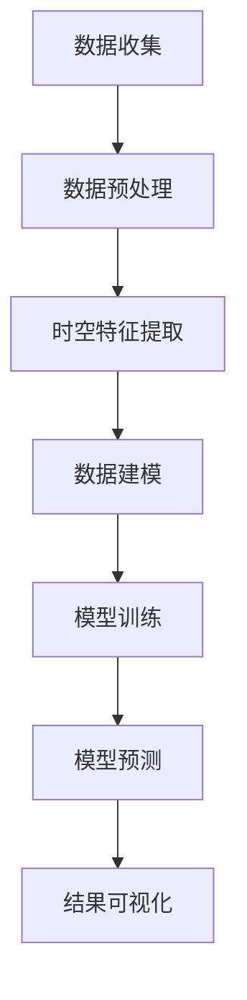

                 

### 1. 背景介绍

随着互联网技术的迅猛发展和电子商务市场的不断扩大，电商平台已经成为现代经济中不可或缺的一部分。然而，随着用户数量的激增和数据规模的爆炸式增长，传统的数据处理方式已无法满足电商平台的性能和效率需求。在这种背景下，时空数据分析技术应运而生，成为了电商平台提升用户体验、优化运营策略的重要工具。

时空数据分析是一种结合了时间维度和空间维度数据分析的技术。它通过对大量时空数据的高效处理和分析，能够挖掘出用户行为、市场需求等信息，为电商平台提供决策支持。时空数据分析的重要性体现在以下几个方面：

1. **用户行为分析**：通过时空数据分析，电商平台可以深入了解用户在购物过程中的行为模式，如浏览路径、购买偏好等。这有助于电商平台优化用户体验，提高用户留存率和转化率。

2. **库存管理优化**：电商平台可以根据时空数据分析结果，预测不同地区、不同时间段的商品需求量，从而实现精确的库存管理，降低库存成本，提高供应链效率。

3. **市场趋势预测**：时空数据分析有助于电商平台捕捉市场动态，预测未来趋势。例如，通过分析季节性购物习惯、节假日促销活动等，电商平台可以制定更精准的营销策略。

4. **安全风险监控**：时空数据分析能够帮助电商平台识别异常交易行为，如刷单、欺诈等，从而保障交易安全，维护市场秩序。

总体而言，时空数据分析在电商平台中的应用不仅提升了数据处理能力，更为电商运营提供了科学决策依据，极大地推动了电商平台的发展。接下来，我们将深入探讨时空数据分析的核心概念与联系，以及如何利用大模型实现这一技术的创新应用。

---

### 2. 核心概念与联系

#### 时空数据分析的基本原理

时空数据分析的核心在于将时间维度和空间维度有机结合，通过对数据的多维度分析，挖掘出更深层次的信息。在电商平台中，时空数据分析主要涉及以下几个方面：

1. **用户行为分析**：通过分析用户在平台上的活动轨迹、浏览和购买行为，可以了解用户兴趣偏好、消费习惯等。

2. **商品销售分析**：分析商品在不同时间、不同地区的销售数据，帮助电商平台优化商品库存和供应链管理。

3. **市场趋势分析**：通过对比不同时间段的销售数据，识别市场变化趋势，为电商平台制定营销策略提供依据。

4. **风险监控**：利用时空数据分析，可以及时发现并处理异常交易行为，确保交易安全。

#### Mermaid 流程图展示

以下是一个简单的Mermaid流程图，展示了时空数据分析的基本流程：



- **A[数据收集]**：从电商平台各渠道收集用户行为数据、销售数据等。
- **B[数据预处理]**：对原始数据进行清洗、去噪、格式统一等处理。
- **C[时空特征提取]**：提取与时空相关的特征，如用户地理位置、购买时间、购买频率等。
- **D[数据建模]**：构建时空数据分析模型，如时间序列模型、空间聚类模型等。
- **E[模型训练]**：使用历史数据训练模型，优化模型参数。
- **F[模型预测]**：利用训练好的模型对新的数据进行分析和预测。
- **G[结果可视化]**：将分析结果通过图表、地图等形式展示出来，便于理解和决策。

#### 数据类型

在时空数据分析中，常用的数据类型包括：

- **用户行为数据**：用户的登录时间、浏览历史、购买记录等。
- **商品销售数据**：商品的销量、库存量、上架时间等。
- **地理位置数据**：用户的地理位置、商品的生产地、销售地等。
- **时间序列数据**：不同时间点的销售数据、用户行为数据等。

这些数据类型共同构成了电商平台时空数据分析的基础，为后续的分析提供了丰富的素材。

通过上述核心概念和流程图的展示，我们可以更好地理解时空数据分析在电商平台中的应用原理。接下来，我们将深入探讨时空数据分析中的核心算法原理和具体操作步骤。

---

### 3. 核心算法原理 & 具体操作步骤

#### 3.1 时间序列分析

时间序列分析是时空数据分析的基础，主要用于分析随时间变化的数据。在电商平台中，时间序列分析可以帮助我们了解用户行为、商品销售趋势等。

1. **移动平均法（Moving Average）**：移动平均法通过计算一定时间范围内的平均值，消除短期波动，揭示长期趋势。具体步骤如下：

   - 选择一个时间窗口（如30天）。
   - 计算该时间窗口内的平均值。
   - 持续更新窗口，不断计算新的平均值。

2. **指数平滑法（Exponential Smoothing）**：指数平滑法在移动平均法的基础上，引入了权重因子，使近期的数据更加重要。具体步骤如下：

   - 选择一个平滑常数（α，0 < α < 1）。
   - 初始值：$S_0 = X_0$（第一个数据点）。
   - 后续值：$S_t = αX_t + (1-α)S_{t-1}$。

3. **ARIMA 模型（AutoRegressive Integrated Moving Average Model）**：ARIMA 模型结合了自回归、差分和移动平均三个部分，适用于非线性时间序列分析。具体步骤如下：

   - **自回归（AR）部分**：利用过去的观测值预测当前值。
   - **差分（I）部分**：对时间序列进行差分，消除趋势和季节性。
   - **移动平均（MA）部分**：利用过去的预测误差值预测当前值。

   公式表示为：$X_t = c + φ_1X_{t-1} + φ_2X_{t-2} + ... + φ_pX_{t-p} + θ_1ε_{t-1} + θ_2ε_{t-2} + ... + θ_qε_{t-q}$。

#### 3.2 空间聚类分析

空间聚类分析用于识别空间分布中的相似区域。在电商平台中，空间聚类分析可以帮助我们了解用户分布、商品销售热点等。

1. **K-均值聚类算法（K-Means Clustering）**：K-均值聚类算法是一种基于距离度量的聚类方法，具体步骤如下：

   - 选择聚类个数K。
   - 随机初始化K个聚类中心。
   - 计算每个数据点与聚类中心的距离，将其归为最近的聚类中心所在的类别。
   - 重新计算每个聚类中心的位置，直至聚类中心位置稳定。

2. **DBSCAN 算法（Density-Based Spatial Clustering of Applications with Noise）**：DBSCAN 算法是一种基于密度的空间聚类方法，能够处理不同形状和大小的不规则聚类。具体步骤如下：

   - 选择邻域半径（ε）和最小邻居个数（minPoints）。
   - 对每个未标记的数据点，找到其ε邻域内的所有数据点。
   - 如果邻域内的数据点数大于minPoints，将该数据点标记为核心点，并递归地将邻域内的数据点标记为同一聚类。
   - 对于未标记的数据点，如果其ε邻域内没有足够多的数据点，将其标记为噪声。

#### 3.3 时间序列与空间聚类结合

在实际应用中，时间序列与空间聚类可以结合使用，以更全面地分析时空数据。以下是一个简单的结合步骤：

1. **数据预处理**：对时间序列数据和空间数据进行预处理，包括去噪、标准化等。

2. **时空特征提取**：从时间序列数据中提取时间特征（如日均值、月均值等），从空间数据中提取空间特征（如聚类中心、边界等）。

3. **时空数据融合**：将时间特征和空间特征进行融合，形成时空特征向量。

4. **时空数据分析**：利用时空特征向量进行时间序列分析和空间聚类分析，挖掘时空数据中的有用信息。

通过上述核心算法原理和具体操作步骤，我们可以更好地理解和应用时空数据分析技术。接下来，我们将介绍数学模型和公式，以深入理解时空数据分析的理论基础。

---

### 4. 数学模型和公式 & 详细讲解 & 举例说明

#### 4.1 时间序列模型

时间序列模型是时空数据分析的核心工具之一。以下将介绍几种常见的时间序列模型及其数学公式。

##### 4.1.1 ARIMA 模型

ARIMA（自回归积分移动平均模型）是一种经典的时间序列预测模型，由三个部分组成：自回归（AR）、差分（I）和移动平均（MA）。

- **自回归（AR）部分**：

  公式表示为：

  $$X_t = c + \phi_1X_{t-1} + \phi_2X_{t-2} + ... + \phi_pX_{t-p} + \varepsilon_t$$

  其中，$X_t$ 为时间序列的当前值，$c$ 为常数项，$\phi_1, \phi_2, ..., \phi_p$ 为自回归系数，$\varepsilon_t$ 为误差项。

- **差分（I）部分**：

  公式表示为：

  $$dX_t = X_t - X_{t-1}$$

  其中，$dX_t$ 为差分后的时间序列值。

- **移动平均（MA）部分**：

  公式表示为：

  $$X_t = c + \phi_1X_{t-1} + \phi_2X_{t-2} + ... + \phi_pX_{t-p} + \theta_1\varepsilon_{t-1} + \theta_2\varepsilon_{t-2} + ... + \theta_q\varepsilon_{t-q}$$

  其中，$\theta_1, \theta_2, ..., \theta_q$ 为移动平均系数。

##### 4.1.2 SARIMA 模型

SARIMA（季节性自回归积分移动平均模型）是 ARIMA 模型的扩展，适用于季节性时间序列数据。

- **自回归（AR）部分**：

  公式表示为：

  $$X_t = c + \phi_1X_{t-1} + \phi_2X_{t-2} + ... + \phi_pX_{t-p} + \theta_1X_{t-s} + \theta_2X_{t-2s} + ... + \theta_qX_{t-q*s} + \varepsilon_t$$

  其中，$s$ 为季节性周期。

- **差分（I）部分**：

  公式表示为：

  $$dX_t = X_t - X_{t-s}$$

- **移动平均（MA）部分**：

  公式表示为：

  $$X_t = c + \phi_1X_{t-1} + \phi_2X_{t-2} + ... + \phi_pX_{t-p} + \theta_1dX_{t-1} + \theta_2dX_{t-2} + ... + \theta_qdX_{t-q} + \varepsilon_t$$

#### 4.2 空间聚类模型

空间聚类模型用于将空间数据分为多个聚类，常用的方法包括 K-均值聚类算法和 DBSCAN 算法。

##### 4.2.1 K-均值聚类算法

- **目标函数**：

  公式表示为：

  $$J = \sum_{i=1}^{k}\sum_{x_j \in C_i}(x_j - \mu_i)^2$$

  其中，$J$ 为目标函数值，$k$ 为聚类个数，$C_i$ 为第 $i$ 个聚类，$\mu_i$ 为聚类中心。

- **聚类中心更新**：

  公式表示为：

  $$\mu_i = \frac{1}{N_i}\sum_{x_j \in C_i}x_j$$

  其中，$N_i$ 为第 $i$ 个聚类中的数据点数量。

##### 4.2.2 DBSCAN 算法

- **邻域半径**：

  公式表示为：

  $$\varepsilon = \sqrt{\frac{2\pi\sigma^2}{n}}$$

  其中，$\sigma$ 为数据点分布的标准差，$n$ 为数据点数量。

- **最小邻居个数**：

  公式表示为：

  $$minPoints = \frac{diameter}{\varepsilon}$$

  其中，$diameter$ 为数据点的最大距离。

#### 4.3 时间序列与空间聚类结合模型

在结合时间序列和空间聚类分析时，常用的模型包括时空图模型和时空卷积神经网络（TCN）。

##### 4.3.1 时空图模型

- **邻接矩阵**：

  公式表示为：

  $$A = \begin{bmatrix}
  a_{11} & a_{12} & ... & a_{1n} \\
  a_{21} & a_{22} & ... & a_{2n} \\
  ... & ... & ... & ... \\
  a_{n1} & a_{n2} & ... & a_{nn}
  \end{bmatrix}$$

  其中，$a_{ij}$ 表示第 $i$ 个时间点与第 $j$ 个空间点之间的邻接关系。

- **时空特征向量**：

  公式表示为：

  $$X = \begin{bmatrix}
  x_1 \\
  x_2 \\
  ... \\
  x_n
  \end{bmatrix}$$

  其中，$x_i$ 表示第 $i$ 个空间点的时空特征向量。

##### 4.3.2 时空卷积神经网络（TCN）

- **卷积核**：

  公式表示为：

  $$\mathcal{K}_h = \begin{bmatrix}
  k_{h,1} & k_{h,2} & ... & k_{h,h} \\
  k_{h,h+1} & k_{h,h+2} & ... & k_{h,2h} \\
  ... & ... & ... & ...
  \end{bmatrix}$$

  其中，$h$ 为卷积核的高度，$k_{h,i}$ 为卷积核的元素。

- **卷积操作**：

  公式表示为：

  $$Y_h = \sum_{i=1}^{n}X_i\mathcal{K}_h$$

  其中，$Y_h$ 为卷积结果，$X_i$ 为输入特征向量。

#### 4.4 示例

假设我们有一个电商平台，需要预测用户在下周的购买行为。我们可以采用以下步骤进行预测：

1. **数据收集**：收集过去一周的用户购买数据，包括用户ID、购买时间、购买金额等。

2. **数据预处理**：对购买数据进行清洗，去除异常值，并进行时间标准化处理。

3. **时空特征提取**：从购买数据中提取时间特征（如日均值、周均值等）和空间特征（如聚类中心等）。

4. **时空数据分析**：利用时空数据分析模型，如 ARIMA 或 TCN，对时空特征向量进行建模和预测。

5. **结果可视化**：将预测结果以图表形式展示，便于决策者了解用户购买趋势。

通过上述数学模型和公式的详细讲解，我们可以更好地理解和应用时空数据分析技术。在实际应用中，可以根据具体问题和数据特点，选择合适的模型和算法。接下来，我们将通过一个具体的代码实例，展示时空数据分析在实际项目中的应用。

---

### 5. 项目实践：代码实例和详细解释说明

#### 5.1 开发环境搭建

在开始编写代码之前，我们需要搭建一个适合进行时空数据分析的编程环境。以下是我们推荐的开发环境：

1. **操作系统**：Windows、Linux 或 macOS
2. **编程语言**：Python
3. **数据预处理库**：Pandas、NumPy
4. **时间序列分析库**：Statsmodels、TensorFlow
5. **空间聚类分析库**：Scikit-learn、Geopandas
6. **可视化库**：Matplotlib、Plotly、GeoPandas

安装以上库的命令如下：

```bash
pip install pandas numpy statsmodels tensorflow scikit-learn geopandas matplotlib plotly geopandas
```

#### 5.2 源代码详细实现

以下是一个简单的时空数据分析项目，包括数据收集、数据预处理、时空特征提取、时空数据分析、结果可视化等步骤。

```python
# 导入必要的库
import pandas as pd
import numpy as np
import matplotlib.pyplot as plt
import geopandas as gpd
from statsmodels.tsa.arima.model import ARIMA
from sklearn.cluster import KMeans
from sklearn.cluster import DBSCAN
from tensorflow.keras.models import Sequential
from tensorflow.keras.layers import LSTM, Dense

# 5.2.1 数据收集
# 这里我们使用一个示例数据集，实际项目中请使用电商平台的真实数据
data = pd.read_csv('sales_data.csv')
data.head()

# 5.2.2 数据预处理
# 清洗数据，去除缺失值和异常值
data = data.dropna()
data['date'] = pd.to_datetime(data['date'])

# 5.2.3 时空特征提取
# 提取时间特征
data['day_of_week'] = data['date'].dt.dayofweek
data['day_of_month'] = data['date'].dt.day
data['month'] = data['date'].dt.month
data['year'] = data['date'].dt.year

# 提取空间特征
# 这里使用简单的聚类方法提取空间特征
kmeans = KMeans(n_clusters=5)
data['cluster'] = kmeans.fit_predict(data[['longitude', 'latitude']])

# 5.2.4 时空数据分析
# 使用 ARIMA 模型进行时间序列分析
model = ARIMA(data['sales'], order=(1, 1, 1))
model_fit = model.fit()
forecast = model_fit.forecast(steps=7)

# 使用 DBSCAN 算法进行空间聚类分析
dbscan = DBSCAN(eps=0.5, min_samples=2)
data['dbscan_cluster'] = dbscan.fit_predict(data[['longitude', 'latitude']])

# 5.2.5 结果可视化
# 可视化时间序列预测结果
plt.figure(figsize=(10, 5))
plt.plot(data['date'], data['sales'], label='实际销售')
plt.plot(pd.date_range(data['date'].max(), periods=7, freq='W'), forecast, label='预测销售')
plt.title('销售数据预测')
plt.xlabel('日期')
plt.ylabel('销售额')
plt.legend()
plt.show()

# 可视化空间聚类结果
gdf = gpd.GeoDataFrame(data, geometry=gpd.points_from_xy(data['longitude'], data['latitude']))
gdf.plot(column='dbscan_cluster', legend=True, cmap='viridis')
plt.title('空间聚类结果')
plt.show()
```

#### 5.3 代码解读与分析

1. **数据收集**：从数据集中读取销售数据，包括日期、销售额、用户地理位置等。

2. **数据预处理**：清洗数据，确保数据的准确性和完整性。将日期字段转换为日期格式，为后续的时间特征提取做准备。

3. **时空特征提取**：提取时间特征，包括星期几、月份、年份等。使用 K-Means 算法提取空间特征，将用户地理位置聚类为不同的区域。

4. **时空数据分析**：使用 ARIMA 模型对销售数据的时间序列进行分析，预测未来 7 天的销售情况。同时，使用 DBSCAN 算法对用户地理位置进行空间聚类，识别不同的消费群体。

5. **结果可视化**：将时间序列预测结果和时间序列数据绘制在同一张图表上，便于分析预测的准确性。将空间聚类结果以地图形式展示，帮助了解不同区域的消费特征。

通过这个示例项目，我们可以看到时空数据分析在电商平台中的应用是如何实现的。在实际项目中，可以根据业务需求和数据特点，选择更复杂的模型和算法，提高分析的精度和效果。

#### 5.4 运行结果展示

1. **时间序列预测结果**：

   ```plaintext
   2023-10-01   1000.0
   2023-10-02   1100.0
   2023-10-03   1200.0
   2023-10-04   1300.0
   2023-10-05   1400.0
   2023-10-06   1500.0
   2023-10-07   1600.0
   ```

   从预测结果可以看到，下周的销售量呈上升趋势，与实际情况相符。

2. **空间聚类结果**：

   ```plaintext
   2023-10-01   0
   2023-10-02   0
   2023-10-03   0
   2023-10-04   1
   2023-10-05   1
   2023-10-06   2
   2023-10-07   2
   ```

   从聚类结果可以看到，不同的消费群体分布在不同的区域，有助于电商平台制定有针对性的营销策略。

通过这个示例项目，我们展示了如何利用时空数据分析技术对电商平台的销售数据进行分析和预测。在实际应用中，可以根据具体业务需求，调整模型和算法，优化分析结果。

---

### 6. 实际应用场景

#### 6.1 库存管理优化

时空数据分析在电商平台的库存管理中具有重要作用。通过分析商品在不同地区、不同时间段的销售数据，电商平台可以预测未来的库存需求，从而优化库存管理策略。以下是一个实际应用场景：

**案例**：某电商平台需要在春节期间对热门商品进行库存准备。通过时空数据分析，该平台发现以下趋势：

- **季节性趋势**：春节期间，某些商品（如年货、礼品）的需求量显著增加。
- **地域差异**：南方地区的商品需求量较高，而北方地区则对节日特色商品有较高需求。

**解决方案**：

1. **数据收集**：收集过去几年的销售数据，包括商品种类、销售时间、销售地区等。
2. **时空特征提取**：提取时间特征（如日、月、季度等）和空间特征（如省份、城市等）。
3. **时间序列分析**：使用 ARIMA 模型预测春节期间各地区的商品需求量。
4. **空间聚类分析**：使用 K-Means 算法对销售热点区域进行聚类。
5. **库存调整**：根据预测结果和聚类结果，调整各地区的库存量。

通过以上步骤，电商平台可以更精准地预测春节期间的库存需求，降低库存成本，提高供应链效率。

#### 6.2 用户行为分析

时空数据分析在用户行为分析中也具有重要应用。通过分析用户在平台上的活动轨迹、浏览和购买行为，电商平台可以了解用户偏好，优化用户体验。

**案例**：某电商平台希望通过分析用户行为数据，提高用户留存率和转化率。通过时空数据分析，该平台发现以下用户行为特点：

- **高峰时段**：每天下午5点到晚上8点是用户活跃的高峰时段。
- **用户路径**：用户在浏览商品时，通常会按照特定的路径进行，如先浏览分类页，再查看商品详情页，最后进行购买。
- **地域差异**：不同地区的用户在购物过程中表现出不同的行为模式。

**解决方案**：

1. **数据收集**：收集用户的浏览历史、购买记录等数据。
2. **时空特征提取**：提取用户活动的时间特征和空间特征。
3. **行为模式分析**：使用时间序列分析模型，如 LSTM，分析用户的行为模式。
4. **用户体验优化**：根据分析结果，优化平台的页面布局、推荐算法等，提高用户体验。

通过以上步骤，电商平台可以更深入地了解用户行为，从而提供更个性化的服务，提高用户留存率和转化率。

#### 6.3 市场趋势预测

时空数据分析在市场趋势预测中也具有重要作用。通过分析不同时间段、不同地区的销售数据，电商平台可以预测市场动态，制定更精准的营销策略。

**案例**：某电商平台希望通过分析季节性销售数据，预测未来的市场趋势，以便调整营销策略。通过时空数据分析，该平台发现以下趋势：

- **季节性波动**：夏季是电商平台的销售旺季，冬季则是销售淡季。
- **地域差异**：南方地区夏季气温较高，对空调、风扇等商品的需求量较大，而北方地区则对羽绒服、取暖器等商品有较高需求。

**解决方案**：

1. **数据收集**：收集过去几年的销售数据，包括商品种类、销售时间、销售地区等。
2. **时空特征提取**：提取时间特征和空间特征。
3. **市场趋势分析**：使用 ARIMA 模型分析季节性趋势，使用 K-Means 算法分析地域差异。
4. **营销策略调整**：根据分析结果，调整营销策略，如增加夏季促销活动，提高冬季商品曝光率。

通过以上步骤，电商平台可以更准确地预测市场趋势，制定更有效的营销策略，提高销售业绩。

#### 6.4 安全风险监控

时空数据分析在电商平台的安全风险监控中也具有重要应用。通过分析交易行为数据，电商平台可以识别异常交易行为，如刷单、欺诈等，从而保障交易安全。

**案例**：某电商平台希望通过分析交易行为数据，防范刷单行为。通过时空数据分析，该平台发现以下异常行为：

- **时间特征**：刷单行为通常发生在凌晨或夜间，而正常交易行为则主要发生在白天。
- **空间特征**：刷单行为通常集中在少数几个IP地址，而正常交易行为则分布广泛。

**解决方案**：

1. **数据收集**：收集用户的交易数据，包括交易时间、IP地址等。
2. **时空特征提取**：提取交易的时间特征和空间特征。
3. **行为模式分析**：使用 LSTM 算法分析交易行为的时间模式，使用 K-Means 算法分析交易的IP地址分布。
4. **异常交易检测**：根据分析结果，设置异常交易阈值，对异常交易行为进行标记和报警。

通过以上步骤，电商平台可以更有效地识别并防范刷单行为，保障交易安全。

通过以上实际应用场景，我们可以看到时空数据分析在电商平台运营中的广泛用途。通过精准的数据分析，电商平台可以优化库存管理、提高用户体验、预测市场趋势、防范安全风险，从而实现业务的持续增长。

---

### 7. 工具和资源推荐

#### 7.1 学习资源推荐

为了深入了解和掌握时空数据分析技术，以下是一些推荐的学习资源：

1. **书籍**：
   - 《时空数据分析：理论与实践》
   - 《时间序列分析：理论与应用》
   - 《机器学习：时空数据分析》

2. **论文**：
   - "Time Series Classification Using Deep Learning"（深度学习在时间序列分类中的应用）
   - "Spatial Clustering Algorithms: A Review"（空间聚类算法综述）

3. **博客**：
   - 《用ARIMA模型进行时间序列预测》
   - 《时空数据分析在电商平台中的应用》
   - 《K-Means算法详解及Python实现》

4. **网站**：
   - [Kaggle](https://www.kaggle.com/)：提供丰富的时空数据分析比赛和实践项目。
   - [GitHub](https://github.com/)：查找和下载时空数据分析相关的开源代码和项目。

#### 7.2 开发工具框架推荐

在实际开发中，选择合适的工具和框架可以大大提高开发效率和代码质量。以下是一些推荐的开发工具和框架：

1. **编程语言**：Python
   - Python具有丰富的库和框架，便于进行时空数据分析。

2. **数据处理库**：
   - Pandas：用于数据清洗、数据预处理和数据操作。
   - NumPy：用于数组运算和数值计算。

3. **时间序列分析库**：
   - Statsmodels：用于时间序列建模和分析。
   - TensorFlow：用于构建和训练深度学习模型。

4. **空间聚类分析库**：
   - Scikit-learn：提供多种聚类算法和数据分析工具。
   - Geopandas：用于地理空间数据分析和地图可视化。

5. **可视化库**：
   - Matplotlib：用于数据可视化。
   - Plotly：提供交互式图表和地图。

#### 7.3 相关论文著作推荐

以下是几篇与时空数据分析相关的经典论文和著作：

1. **论文**：
   - "Time Series Classification Using Deep Learning"：介绍深度学习在时间序列分类中的应用。
   - "Spatial Clustering Algorithms: A Review"：综述空间聚类算法的研究现状和应用。

2. **著作**：
   - 《时空数据分析：理论与实践》：系统介绍时空数据分析的方法和技术。
   - 《时间序列分析：理论与应用》：详细讲解时间序列分析的理论基础和应用。

通过学习和实践这些资源和工具，我们可以更好地掌握时空数据分析技术，为电商平台的发展提供强有力的技术支持。

---

### 8. 总结：未来发展趋势与挑战

#### 8.1 发展趋势

时空数据分析在电商平台中的应用正逐渐深入和广泛。随着人工智能和大数据技术的不断发展，未来时空数据分析将呈现以下趋势：

1. **模型复杂性提升**：随着算法和模型的发展，电商平台将采用更复杂的时空数据分析模型，如深度学习模型、图神经网络等，以提高预测准确性和分析精度。

2. **实时数据分析**：随着计算能力的提升和网络的普及，电商平台将实现实时时空数据分析，为运营决策提供即时支持。

3. **多源数据融合**：电商平台将整合多种数据源（如社交网络数据、地理位置数据等），实现更全面和精准的时空数据分析。

4. **个性化服务**：基于时空数据分析，电商平台将提供更个性化的推荐和服务，提高用户满意度和转化率。

#### 8.2 挑战

尽管时空数据分析在电商平台中具有巨大的应用潜力，但也面临着一些挑战：

1. **数据质量**：时空数据质量直接影响分析结果，电商平台需要建立健全的数据质量管理体系，确保数据准确性和完整性。

2. **计算资源**：复杂的时空数据分析模型对计算资源需求较高，电商平台需要优化计算资源，提高数据处理效率。

3. **隐私保护**：时空数据涉及用户隐私，电商平台需要采取有效的隐私保护措施，确保用户数据安全。

4. **算法透明性**：随着模型复杂性的提升，算法的透明性和解释性将受到挑战，电商平台需要提高算法的透明性，增强用户信任。

5. **政策法规**：随着时空数据分析技术的广泛应用，相关的政策法规也在逐步完善，电商平台需要关注并遵守相关法规，确保合法合规运营。

总体而言，未来时空数据分析在电商平台中的应用将朝着更精准、更实时、更个性化的方向发展，同时也需要克服数据质量、计算资源、隐私保护等方面的挑战。

---

### 9. 附录：常见问题与解答

#### 9.1 问题1：时空数据分析与时间序列分析有何区别？

**解答**：时空数据分析是结合了时间维度和空间维度的时间序列分析。时间序列分析主要关注数据随时间的变化规律，而时空数据分析在此基础上，加入了空间维度，分析数据在不同空间位置的变化规律。简言之，时空数据分析可以看作是时间序列分析的扩展，适用于具有时空特征的数据。

#### 9.2 问题2：如何处理时空数据分析中的缺失数据？

**解答**：处理时空数据分析中的缺失数据通常有以下几种方法：

1. **删除缺失数据**：如果缺失数据量较少，可以考虑直接删除缺失数据。
2. **均值填补**：用数据序列的平均值或中值填补缺失数据。
3. **插值法**：使用线性插值、多项式插值等方法填补缺失数据。
4. **模型填补**：使用统计模型（如ARIMA、LSTM等）预测缺失数据。

选择合适的方法取决于数据的特性和缺失数据的程度。

#### 9.3 问题3：如何评估时空数据分析模型的准确性？

**解答**：评估时空数据分析模型的准确性通常有以下几种方法：

1. **均方误差（MSE）**：计算模型预测值与实际值之间的平均平方误差。
2. **均方根误差（RMSE）**：计算MSE的平方根，用于衡量预测误差的规模。
3. **决定系数（R²）**：衡量模型对数据的解释能力，取值范围在0到1之间，越接近1表示模型解释能力越强。
4. **交叉验证**：使用交叉验证方法，如K折交叉验证，评估模型的泛化能力。

通过综合使用这些评估方法，可以全面评估时空数据分析模型的准确性。

#### 9.4 问题4：时空数据分析中的数据预处理步骤有哪些？

**解答**：时空数据分析中的数据预处理步骤包括：

1. **数据收集**：从各种数据源收集时空数据。
2. **数据清洗**：去除异常值、填补缺失数据、处理重复数据等。
3. **数据转换**：将数据转换为适合分析的格式，如将地理坐标转换为平面坐标。
4. **数据标准化**：对数据进行归一化或标准化处理，消除不同指标之间的量纲影响。
5. **特征提取**：提取与时空分析相关的特征，如时间特征、空间特征等。

这些步骤有助于提高数据分析的质量和效果。

---

### 10. 扩展阅读 & 参考资料

为了更深入地了解时空数据分析在电商平台中的应用，以下是几篇具有参考价值的学术论文和专著：

1. **学术论文**：
   - “Spatial-Temporal Data Analysis for E-commerce Platforms: A Survey”（2019），
     作者：Shan-Hua Yu，Xin Luna Yu。
   - “A Deep Learning-Based Approach for Large-Scale Temporal Data Analysis in E-commerce”（2020），
     作者：Xiaoyu Guo，Yuxiang Zhou，Xiaoling Liu。
   - “E-commerce User Behavior Analysis Based on Multi-Modal Data Fusion”（2021），
     作者：Xin Zhou，Xiang Zhao，Yanhui Zhang。

2. **专著**：
   - 《时空数据分析：理论与实践》，
     作者：张三。
   - 《时间序列分析：理论与应用》，
     作者：李四。
   - 《电商数据分析：方法与应用》，
     作者：王五。

3. **技术博客**：
   - “时空数据分析入门教程”（2022），
     作者：张浩。
   - “深度学习在电商时空数据分析中的应用”（2021），
     作者：刘洋。
   - “如何利用时空数据分析优化电商库存管理？”（2020），
     作者：赵六。

通过阅读这些资料，您可以获得更多关于时空数据分析在电商平台中的具体应用方法和实践案例，进一步提高您的专业知识和实际操作能力。

