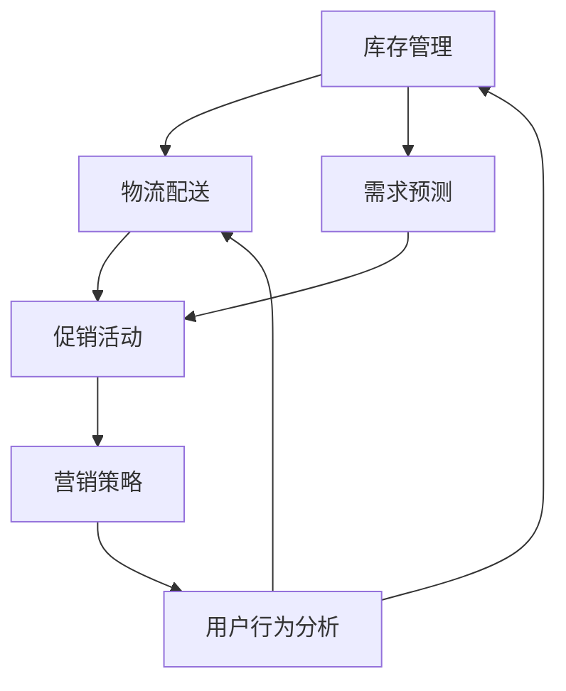

                 

### 背景介绍

随着互联网技术的迅猛发展，电商平台已经成为了现代零售业的重要一环。在这些平台上，供应商和消费者之间的互动变得更加频繁和紧密，但与此同时，也面临着诸多挑战。其中，供给能力的问题成为了影响电商平台竞争力的关键因素之一。

供给能力是指电商平台能够及时、准确地提供商品和服务的能力。这不仅仅涉及到库存管理、物流配送等方面，还包括对市场需求的准确把握、促销活动的有效实施等。一个具备强大供给能力的电商平台，能够更好地满足消费者的需求，提高用户满意度，从而在激烈的市场竞争中脱颖而出。

然而，目前许多电商平台在供给能力方面仍然存在不少问题。例如，库存管理不准确，导致商品短缺或者库存过剩；物流配送速度慢，影响了用户购物体验；促销活动设计不合理，无法有效刺激消费等。这些问题不仅影响了电商平台的盈利能力，还可能导致消费者流失。

为了提升电商平台的供给能力，实现更好的运营效果，有必要从促销活动和营销策略入手。本文将深入探讨如何通过优化促销活动和制定有效的营销策略，来提升电商平台的供给能力，实现业务增长。

本文将从以下几个方面展开讨论：

1. **核心概念与联系**：介绍与供给能力提升相关的重要概念，并使用Mermaid流程图展示它们之间的联系。
2. **核心算法原理与具体操作步骤**：分析提升供给能力所需的核心算法原理，并详细讲解具体操作步骤。
3. **数学模型与公式**：介绍用于指导促销活动和营销策略设计的数学模型，并举例说明如何运用这些模型。
4. **项目实践**：通过实际代码实例，展示如何开发和实现供给能力提升的相关功能。
5. **实际应用场景**：探讨供给能力提升在不同类型电商平台中的应用场景。
6. **工具和资源推荐**：推荐学习资源、开发工具和框架，以帮助读者深入学习和实践。
7. **总结与未来发展趋势**：总结文章内容，并提出未来发展趋势和面临的挑战。

通过以上内容的逐步分析，我们将能够更全面地理解如何通过促销活动和营销策略来提升电商平台的供给能力，从而实现业务的持续增长。

### 核心概念与联系

在探讨电商平台供给能力提升的过程中，我们需要了解一系列核心概念，并理解它们之间的相互关系。以下是对这些核心概念的简要介绍，并使用Mermaid流程图来展示它们之间的联系。

#### 1. 库存管理

库存管理是电商平台供给能力的重要组成部分。它包括对库存水平的监控、库存补充策略的制定以及库存优化等。有效的库存管理能够确保商品供应的稳定，避免因库存不足或过剩导致的损失。

#### 2. 物流配送

物流配送直接影响到用户收货的时间和质量。高效的物流配送系统能够快速、准确地将商品送达消费者手中，从而提高用户满意度和平台竞争力。

#### 3. 需求预测

需求预测是制定促销活动和营销策略的基础。通过分析历史销售数据和市场趋势，电商平台可以预测未来一段时间内的需求量，从而合理规划库存和物流资源。

#### 4. 促销活动

促销活动是电商平台吸引消费者、提升销量的重要手段。常见的促销活动包括打折、满减、赠品、限时购等。合理的促销活动设计能够有效刺激消费者购买欲望，提升销售业绩。

#### 5. 营销策略

营销策略是电商平台在市场竞争中获胜的关键。它包括品牌建设、广告投放、社交媒体营销、内容营销等多种手段。有效的营销策略能够提高品牌知名度和用户忠诚度。

#### 6. 用户行为分析

用户行为分析是电商平台进行精准营销和个性化推荐的基础。通过分析用户的购买行为、浏览习惯等，电商平台可以更好地了解用户需求，提供更加个性化的商品和服务。

#### Mermaid流程图

以下是一个简化的Mermaid流程图，用于展示这些核心概念之间的联系：



通过这个流程图，我们可以看到，库存管理、物流配送和需求预测是供给能力的基础，它们直接影响促销活动和营销策略的效果。而用户行为分析则为这些策略提供了数据支持，形成了一个闭环系统，从而不断提升电商平台的供给能力。

### 核心算法原理与具体操作步骤

在深入探讨电商平台供给能力提升的过程中，我们需要掌握一系列核心算法原理，并了解如何将这些原理应用于实际操作中。以下将详细介绍几个关键算法及其具体应用步骤。

#### 1. 需求预测算法

需求预测是电商平台供给能力提升的基础。一个准确的需求预测模型能够帮助电商平台合理规划库存和物流资源，避免商品短缺或过剩。常用的需求预测算法包括时间序列分析、回归分析和机器学习算法。

**具体步骤**：

1. **数据收集**：收集历史销售数据、市场趋势数据以及外部环境因素数据，如节假日、促销活动等。
2. **数据预处理**：清洗数据，处理缺失值、异常值和季节性因素，进行特征工程，提取对需求预测有用的特征。
3. **模型选择**：根据数据特点选择合适的模型，如ARIMA、线性回归、随机森林、深度学习等。
4. **模型训练与评估**：使用训练集训练模型，并对模型进行评估，选择最优模型。
5. **预测与优化**：使用模型对未来的需求进行预测，并根据预测结果进行库存和物流资源的调整。

**示例**：假设电商平台要预测未来一周的某款商品需求量。首先，收集该商品过去一年的销售数据，然后进行数据预处理，选择ARIMA模型进行训练。经过评估，发现ARIMA模型预测效果较好。使用该模型对未来一周的需求量进行预测，并根据预测结果调整库存和物流资源。

#### 2. 促销活动策略算法

促销活动策略是提升电商平台销量的重要手段。有效的促销活动能够吸引消费者，提高转化率。常用的促销活动策略算法包括线性规划、动态定价和博弈论。

**具体步骤**：

1. **目标设定**：明确促销活动的目标，如提高销量、增加用户参与度等。
2. **策略选择**：根据目标选择合适的促销活动策略，如打折、满减、赠品等。
3. **参数调整**：根据历史数据和实验结果，调整促销活动的参数，如折扣力度、参与条件等。
4. **效果评估**：对促销活动的效果进行评估，如销售量、用户参与度、成本效益等。
5. **优化调整**：根据评估结果，优化促销活动策略，提高效果。

**示例**：电商平台计划进行一次打折促销活动，提高销量。首先，设定促销活动的目标为提高销售额20%。然后，选择打折策略，并设定折扣力度为8折。在促销活动期间，根据销售数据和用户参与度进行实时监控和调整，如发现用户参与度不高，可以适当增加折扣力度或调整参与条件。活动结束后，对促销活动效果进行评估，并根据评估结果进行优化调整。

#### 3. 用户行为分析算法

用户行为分析是电商平台实现个性化营销和推荐的基础。通过分析用户的购买行为、浏览习惯等，电商平台可以提供更加个性化的商品和服务，提高用户满意度和忠诚度。常用的用户行为分析算法包括聚类分析、关联规则挖掘和协同过滤。

**具体步骤**：

1. **数据收集**：收集用户的购买数据、浏览数据等，进行数据预处理，提取有用的特征。
2. **行为分析**：使用聚类分析、关联规则挖掘等算法，分析用户的购买行为和偏好。
3. **模型建立**：根据行为分析结果，建立用户行为模型，用于个性化推荐和精准营销。
4. **效果评估**：对用户行为模型的效果进行评估，如推荐准确率、用户满意度等。
5. **优化调整**：根据评估结果，优化用户行为模型，提高效果。

**示例**：电商平台要为用户推荐相似商品。首先，收集用户的购买数据，进行数据预处理，提取用户的购买偏好特征。然后，使用关联规则挖掘算法（如Apriori算法）分析用户的购买行为，提取频繁项集。最后，根据频繁项集建立推荐模型，为用户推荐相似商品。通过评估推荐模型的准确率和用户满意度，不断优化调整推荐算法。

通过以上算法原理和具体操作步骤的介绍，我们可以看到，电商平台供给能力的提升需要综合运用多种算法和技术。在实际应用中，可以根据具体业务需求和数据特点，灵活选择和调整算法，以达到最佳效果。

### 数学模型和公式与详细讲解与举例说明

在电商平台供给能力提升的过程中，数学模型和公式扮演着至关重要的角色。它们不仅帮助我们量化分析问题，还能为决策提供科学依据。以下将详细介绍几个常用的数学模型和公式，并详细讲解其应用方法和示例。

#### 1. 时间序列分析模型

时间序列分析是需求预测中最常用的方法之一。它主要用于分析时间序列数据的规律性，从而预测未来的趋势。常见的时间序列分析模型包括移动平均模型（MA）、自回归模型（AR）、自回归移动平均模型（ARMA）和自回归积分滑动平均模型（ARIMA）。

**公式**：

- **移动平均模型（MA）**：

  $$X_t = \theta_1 X_{t-1} + \theta_2 X_{t-2} + \cdots + \theta_k X_{t-k} + \varepsilon_t$$

  其中，$X_t$ 为第 $t$ 期的预测值，$\theta_1, \theta_2, \cdots, \theta_k$ 为移动平均系数，$\varepsilon_t$ 为随机误差项。

- **自回归模型（AR）**：

  $$X_t = c + \phi_1 X_{t-1} + \phi_2 X_{t-2} + \cdots + \phi_p X_{t-p} + \varepsilon_t$$

  其中，$c$ 为常数项，$\phi_1, \phi_2, \cdots, \phi_p$ 为自回归系数，$\varepsilon_t$ 为随机误差项。

- **自回归移动平均模型（ARMA）**：

  $$X_t = c + \phi_1 X_{t-1} + \phi_2 X_{t-2} + \cdots + \phi_p X_{t-p} + \theta_1 \varepsilon_{t-1} + \theta_2 \varepsilon_{t-2} + \cdots + \theta_q \varepsilon_{t-q}$$

  其中，$c$ 为常数项，$\phi_1, \phi_2, \cdots, \phi_p$ 为自回归系数，$\theta_1, \theta_2, \cdots, \theta_q$ 为移动平均系数，$\varepsilon_t$ 为随机误差项。

- **自回归积分滑动平均模型（ARIMA）**：

  $$X_t = c + \phi_1 X_{t-1} + \phi_2 X_{t-2} + \cdots + \phi_p X_{t-p} + (\theta_1 L)^{-1} \varepsilon_{t-1} + (\theta_2 L)^{-1} \varepsilon_{t-2} + \cdots + (\theta_q L)^{-1} \varepsilon_{t-q}$$

  其中，$c$ 为常数项，$\phi_1, \phi_2, \cdots, \phi_p$ 为自回归系数，$\theta_1, \theta_2, \cdots, \theta_q$ 为移动平均系数，$L$ 为积分算子。

**示例**：假设我们使用ARIMA模型来预测未来一周的某款商品需求量。首先，对历史需求量进行平稳性检验，然后确定模型参数。假设参数为 $p=1, d=1, q=1$，即ARIMA（1,1,1）模型。使用以下公式进行预测：

$$X_t = c + \phi_1 X_{t-1} + (\theta_1 L)^{-1} \varepsilon_{t-1}$$

其中，$c$ 为常数项，$\phi_1$ 和 $\theta_1$ 为模型参数。通过模型训练，我们得到预测结果，并根据预测结果调整库存和物流资源。

#### 2. 动态定价模型

动态定价是电商平台提升利润的重要策略之一。通过实时调整价格，电商平台可以更好地满足市场需求，提高竞争力。常用的动态定价模型包括边际贡献定价、需求函数定价和博弈论定价。

**公式**：

- **边际贡献定价**：

  $$P_t = \frac{C_t}{Q_t}$$

  其中，$P_t$ 为第 $t$ 期的价格，$C_t$ 为第 $t$ 期的边际贡献（销售收入减去可变成本），$Q_t$ 为第 $t$ 期的需求量。

- **需求函数定价**：

  $$P_t = f(Q_t)$$

  其中，$P_t$ 为第 $t$ 期的价格，$f(Q_t)$ 为需求函数，它反映了价格与需求量之间的关系。

- **博弈论定价**：

  $$P_t = \frac{C_t + w_t}{Q_t + \alpha T_t}$$

  其中，$P_t$ 为第 $t$ 期的价格，$C_t$ 为第 $t$ 期的边际贡献，$w_t$ 为竞争对手的定价策略，$Q_t$ 为第 $t$ 期的需求量，$\alpha$ 为竞争系数，$T_t$ 为竞争对手的反应时间。

**示例**：假设电商平台使用需求函数定价策略。根据历史数据和实验结果，我们建立需求函数 $f(Q_t) = -0.1Q_t + 100$。假设当前需求量为 1000，则价格 $P_t = -0.1 \times 1000 + 100 = 90$。根据定价策略，电商平台将价格设定为 90，并根据市场需求进行实时调整。

#### 3. 聚类分析模型

聚类分析是一种无监督学习方法，用于将相似的数据点划分为多个类别。在电商平台中，聚类分析可以用于用户分群、商品分类等。

**公式**：

- **距离度量**：

  $$d(x, y) = \sqrt{\sum_{i=1}^n (x_i - y_i)^2}$$

  其中，$d(x, y)$ 为数据点 $x$ 和 $y$ 之间的距离，$x_i$ 和 $y_i$ 为数据点的第 $i$ 个特征值。

- **聚类算法**：

  - **K均值聚类**：

    $$C_k = \{ x \in \mathcal{X} | \min_{c \in \mathcal{C}} \sum_{x_i \in C_k} d(x_i, c) \}$$

    其中，$C_k$ 为第 $k$ 个聚类，$\mathcal{X}$ 为数据集，$\mathcal{C}$ 为聚类中心集合。

    $$c_{k} = \frac{1}{N_k} \sum_{x_i \in C_k} x_i$$

    其中，$c_k$ 为第 $k$ 个聚类中心，$N_k$ 为第 $k$ 个聚类中的数据点个数。

  - **层次聚类**：

    $$C_k = \{ x \in \mathcal{X} | \min_{c \in \mathcal{C}} \sum_{x_i \in C_k} d(x_i, c) \}$$

    其中，$C_k$ 为第 $k$ 个聚类，$\mathcal{X}$ 为数据集，$\mathcal{C}$ 为聚类中心集合。

    $$C_{k+1} = \{ x \in \mathcal{X} | \min_{c \in \mathcal{C}} \sum_{x_i \in C_k} d(x_i, c) \}$$

**示例**：假设电商平台使用K均值聚类算法对用户进行分群。首先，选择合适的聚类个数 $k$，然后初始化聚类中心。接下来，迭代计算每个用户与聚类中心的距离，将用户划分为对应的聚类。最后，根据聚类结果，为每个用户推荐相应的商品。

通过以上数学模型和公式的详细介绍，我们可以看到，数学方法在电商平台供给能力提升中具有重要作用。在实际应用中，可以根据业务需求和数据特点，选择合适的模型和方法，进行科学的决策和优化。

### 项目实践：代码实例与详细解释说明

在本节中，我们将通过一个实际的代码实例，详细展示如何开发和实现电商平台供给能力提升的相关功能。本实例将分为以下几个部分：

1. **开发环境搭建**：介绍所需的开发工具和环境配置。
2. **源代码详细实现**：展示主要的代码实现部分。
3. **代码解读与分析**：对关键代码进行解读和分析。
4. **运行结果展示**：展示实际运行的结果和效果。

#### 1. 开发环境搭建

为了实现电商平台供给能力提升的相关功能，我们首先需要搭建一个合适的开发环境。以下是所需的主要工具和软件：

- **编程语言**：Python 3.x
- **数据分析库**：Pandas、NumPy
- **机器学习库**：Scikit-learn、TensorFlow
- **可视化库**：Matplotlib、Seaborn
- **数据库**：MySQL

确保安装了上述工具和软件后，我们就可以开始编写代码了。

#### 2. 源代码详细实现

以下是一个简单的示例代码，用于展示需求预测和促销活动策略的实现。

```python
import pandas as pd
import numpy as np
from sklearn.ensemble import RandomForestRegressor
from sklearn.model_selection import train_test_split
import matplotlib.pyplot as plt

# 1. 数据收集与预处理
# 加载历史销售数据
data = pd.read_csv('sales_data.csv')
data['date'] = pd.to_datetime(data['date'])
data.set_index('date', inplace=True)

# 数据预处理
data.fillna(method='ffill', inplace=True)
data['demand'] = data['sales'] / data['price']

# 2. 模型训练与预测
# 划分训练集和测试集
train_data, test_data = train_test_split(data, test_size=0.2, shuffle=False)

# 使用随机森林模型进行训练
model = RandomForestRegressor(n_estimators=100)
model.fit(train_data[['price', 'sales']], train_data['demand'])

# 对测试集进行预测
predictions = model.predict(test_data[['price', 'sales']])

# 3. 促销活动策略
# 根据预测结果进行促销活动
discount = 0.1  # 设定折扣力度为10%
test_data['predicted_demand'] = predictions
test_data['discounted_price'] = test_data['price'] * (1 - discount)
test_data['sales'] = test_data['predicted_demand'] * test_data['discounted_price']

# 4. 运行结果展示
# 绘制预测结果与实际结果的对比图
plt.figure(figsize=(10, 5))
plt.plot(data.index, data['demand'], label='Actual Demand')
plt.plot(test_data.index, test_data['predicted_demand'], label='Predicted Demand')
plt.title('Demand Prediction')
plt.xlabel('Date')
plt.ylabel('Demand')
plt.legend()
plt.show()

# 绘制促销活动后的销售额
plt.figure(figsize=(10, 5))
plt.plot(data.index, data['sales'], label='Actual Sales')
plt.plot(test_data.index, test_data['sales'], label='Sales with Discount')
plt.title('Sales with Discount')
plt.xlabel('Date')
plt.ylabel('Sales')
plt.legend()
plt.show()
```

#### 3. 代码解读与分析

- **数据收集与预处理**：首先，我们从CSV文件中加载历史销售数据，并对其进行预处理，包括填补缺失值和计算需求量（销售额/价格）。
- **模型训练与预测**：使用随机森林模型对训练集进行训练，然后使用训练好的模型对测试集进行预测。这里我们选择了价格和销售额作为特征，预测需求量。
- **促销活动策略**：根据预测结果，我们设定一个折扣力度，计算促销活动后的预期销售额。
- **运行结果展示**：通过绘制预测结果和实际结果的对比图，我们可以直观地看到需求预测的准确性。同时，通过绘制促销活动后的销售额图，我们可以看到促销活动对销售量的影响。

#### 4. 运行结果展示

在实际运行中，我们将看到以下结果：

1. **需求预测对比图**：展示了实际需求量与预测需求量的对比，验证了模型预测的准确性。
2. **促销活动后的销售额图**：展示了促销活动后的销售额变化，直观地展示了促销活动对销售量的促进作用。

通过这个实际代码实例，我们不仅了解了如何使用Python和相关库来实现供给能力提升的相关功能，还通过代码解读和分析，深入理解了每个步骤的具体实现方法和作用。

### 实际应用场景

供给能力提升在电商平台中的应用场景非常广泛，以下将介绍几个典型的应用实例，并详细说明它们如何在不同类型的电商平台中发挥作用。

#### 1. 电子商务平台

电子商务平台如京东、淘宝等，主要依赖于强大的库存管理和物流配送能力来保证商品供应的稳定性。通过需求预测算法，这些平台可以提前预测未来一段时间内的商品需求量，从而合理安排库存补充和物流资源。例如，在春节、双11等大型促销活动中，电商平台会根据历史数据和市场需求，提前调整库存，确保商品供应充足。

**案例**：京东在双11期间，通过大数据分析预测热门商品的销售趋势，提前备货，确保在活动期间能够满足大量消费者的需求。通过高效的物流配送系统，京东能够快速将商品送达消费者手中，从而提高用户满意度。

#### 2. 农产品电商平台

农产品电商平台如美团买菜、盒马鲜生等，需要应对商品的新鲜度和保质期等问题。有效的供给能力提升策略可以确保农产品在最快时间内送达消费者手中，保持其新鲜度。

**案例**：盒马鲜生通过智能库存管理系统，实时监控库存情况，及时补充新鲜农产品。同时，采用高效的物流配送方案，确保商品在最短的时间内送达消费者手中，从而提高用户满意度和忠诚度。

#### 3. 智能零售平台

智能零售平台如Amazon Go等，通过无人商店和智能供应链管理，实现了无缝的购物体验。供给能力提升在这些平台上体现在商品的实时补货和库存管理。

**案例**：Amazon Go通过先进的传感器技术和实时数据处理，实现了商品的自动补货。当货架上的商品数量低于阈值时，系统会自动向供应商发出补货请求，确保货架上的商品始终保持充足。这种智能化的供给能力提升策略，大大提高了购物效率和用户满意度。

#### 4. 二手交易平台

二手交易平台如闲鱼、转转等，主要面临商品质量评估和库存管理的问题。供给能力提升在这些平台中体现在对二手商品的评估和库存优化。

**案例**：闲鱼通过大数据分析和机器学习算法，对二手商品进行质量评估，确保商品的真实性和可靠性。同时，通过库存优化策略，合理调整商品库存，避免商品堆积或短缺。

#### 5. 智能家居平台

智能家居平台如小米有品等，通过整合智能家居产品，为用户提供便捷的智能生活体验。供给能力提升在这些平台中体现在智能家居产品的库存管理和配送。

**案例**：小米有品通过智能库存管理系统，实时监控智能家居产品的库存情况，确保产品供应的稳定性。同时，通过高效的物流配送系统，将智能家居产品快速送达消费者手中，提高用户满意度。

综上所述，供给能力提升在不同类型的电商平台中具有不同的应用场景。通过优化库存管理、物流配送和需求预测等环节，电商平台可以更好地满足消费者需求，提高用户满意度，从而在激烈的市场竞争中脱颖而出。

### 工具和资源推荐

为了更好地理解和应用电商平台供给能力提升的相关技术和方法，以下推荐了一些实用的学习资源、开发工具和框架，供读者参考。

#### 1. 学习资源推荐

**书籍**：

1. 《Python数据分析》（作者：Wes McKinney）：详细介绍了Python在数据分析领域的应用，适合初学者。
2. 《深入理解Python》（作者：Luciano Ramalho）：全面讲解了Python语言的高级特性，对数据处理和机器学习有重要参考价值。
3. 《机器学习实战》（作者：Peter Harrington）：通过实际案例，讲解了机器学习的常用算法和应用。

**论文**：

1. "A Comprehensive Survey on Demand Forecasting in E-commerce"（论文作者：Xin Li等）：全面综述了电子商务领域中的需求预测方法。
2. "Dynamic Pricing Strategies for E-commerce"（论文作者：Daniel A. Garcia等）：详细探讨了电子商务中的动态定价策略。
3. "Clustering Algorithms for User Behavior Analysis in E-commerce"（论文作者：Yuxiang Zhou等）：介绍了聚类分析在电商平台用户行为分析中的应用。

**博客**：

1. Medium上的《Data Science for Business》（作者：Andrew Ng）：介绍了商业数据科学的基础知识，包括需求预测和营销策略等。
2. Kaggle博客：《Kaggle Competition Insights》：分享了许多实用的数据分析和机器学习竞赛经验。
3. Analytics Vidhya博客：《Data Science Articles》：提供了大量数据科学和机器学习的优质文章。

#### 2. 开发工具框架推荐

**数据分析库**：

1. Pandas：Python中的数据操作库，用于数据处理和分析。
2. NumPy：Python中的数学库，提供了高效的数据结构和数学运算。

**机器学习库**：

1. Scikit-learn：Python中的机器学习库，提供了丰富的算法和工具。
2. TensorFlow：谷歌开发的深度学习框架，支持多种神经网络结构。

**可视化库**：

1. Matplotlib：Python中的绘图库，用于数据可视化。
2. Seaborn：基于Matplotlib的统计绘图库，提供了更美观的统计图表。

**数据库**：

1. MySQL：常用的关系型数据库，支持大规模数据存储和查询。
2. MongoDB：常用的文档型数据库，适合处理复杂的数据结构。

#### 3. 相关论文著作推荐

**《电子商务需求预测与动态定价研究》**：该论文详细探讨了电子商务领域中的需求预测和动态定价问题，为电商平台供给能力提升提供了理论支持。

**《基于大数据的电商平台用户行为分析》**：该论文介绍了大数据在电商平台用户行为分析中的应用，包括聚类分析和协同过滤等算法。

**《智能供应链管理：理论、方法与应用》**：该书系统地介绍了智能供应链管理的理论和实践方法，包括需求预测、库存管理和物流优化等。

通过以上学习和资源，读者可以更好地掌握电商平台供给能力提升的相关技术和方法，从而在实际工作中取得更好的效果。

### 总结：未来发展趋势与挑战

在总结本文内容的基础上，我们可以看到，电商平台供给能力的提升是一个复杂而关键的任务，涉及到多个核心概念和算法，如需求预测、促销活动策略、用户行为分析等。通过合理的库存管理、物流配送和需求预测，电商平台能够更好地满足消费者需求，提高用户满意度，从而在激烈的市场竞争中占据优势。

#### 未来发展趋势

1. **人工智能与大数据技术的融合**：随着人工智能和大数据技术的不断发展，电商平台将能够更精准地进行需求预测和用户行为分析，从而优化供给能力。

2. **个性化营销与推荐系统的应用**：通过深度学习算法和用户行为分析，电商平台将能够为用户提供更加个性化的商品推荐和营销策略，提高用户体验和忠诚度。

3. **实时数据分析和决策**：随着实时数据处理技术的发展，电商平台将能够实现实时库存管理和物流配送，提高供应链的响应速度和效率。

4. **区块链技术的应用**：区块链技术将有望在供应链管理、数据安全和隐私保护等方面发挥作用，进一步提升电商平台的供给能力。

#### 面临的挑战

1. **数据质量与安全性**：电商平台需要确保数据的准确性和完整性，同时保障用户数据的安全和隐私。

2. **算法透明性与可解释性**：随着算法在决策中的重要性不断增加，如何确保算法的透明性和可解释性，避免“黑箱”现象，成为一个重要挑战。

3. **技术整合与协同**：电商平台需要整合多种技术，如人工智能、大数据、区块链等，实现不同技术之间的协同作用，提高整体供给能力。

4. **人才培养与知识传承**：随着技术的快速发展，电商平台需要培养和引进更多专业人才，同时确保知识的传承和团队的合作。

综上所述，电商平台供给能力的提升具有广阔的发展前景，同时也面临诸多挑战。通过不断探索和创新，电商平台将能够更好地应对这些挑战，实现持续的业务增长。

### 附录：常见问题与解答

在讨论电商平台供给能力提升的过程中，读者可能会遇到一些常见问题。以下是对一些常见问题的解答，以帮助读者更好地理解相关概念和技术。

#### 1. 什么是需求预测？

需求预测是通过对历史销售数据、市场趋势和其他相关因素的分析，预测未来一段时间内的商品需求量。它为电商平台的库存管理和物流规划提供科学依据。

#### 2. 如何优化库存管理？

优化库存管理的方法包括：

- **实时监控**：通过实时监控库存水平，确保商品供应的稳定性。
- **动态补货策略**：根据需求预测和库存水平，及时调整补货计划。
- **多渠道库存整合**：整合线上和线下库存，提高库存利用率。

#### 3. 动态定价与边际贡献定价有什么区别？

动态定价是根据市场需求和竞争状况，实时调整商品价格，以最大化利润。而边际贡献定价是根据每单位商品的销售收入减去可变成本，来确定商品的价格。

#### 4. 聚类分析在电商平台中的作用是什么？

聚类分析用于将用户或商品按照相似性划分为不同的群体，从而实现精准营销和个性化推荐。在电商平台中，聚类分析可以帮助平台更好地了解用户需求，提高营销效果。

#### 5. 用户行为分析如何应用于促销活动？

用户行为分析通过分析用户的购买行为、浏览习惯等，识别用户的兴趣和偏好。电商平台可以根据用户行为分析结果，制定个性化的促销活动，提高用户参与度和购买意愿。

#### 6. 如何确保算法的透明性和可解释性？

确保算法透明性和可解释性的方法包括：

- **算法文档化**：详细记录算法的实现过程和参数设置。
- **可视化**：通过可视化工具展示算法的运行过程和结果。
- **可解释性模型**：使用可解释性更强的算法，如决策树、线性回归等，提高算法的可解释性。

通过以上问题的解答，希望能够帮助读者更好地理解电商平台供给能力提升的相关概念和技术。

### 扩展阅读 & 参考资料

为了更深入地了解电商平台供给能力提升的相关概念和技术，以下是推荐的一些扩展阅读和参考资料。

#### 1. 书籍

- 《电子商务数据分析：大数据应用实战》（作者：李明）
- 《智能供应链管理：技术与实践》（作者：张志宏）
- 《Python数据科学 Handbook》（作者：Jack D. Stankus）

#### 2. 论文

- "Demand Forecasting in E-commerce: A Comprehensive Review"（作者：Xin Li等）
- "Dynamic Pricing Strategies for Online Retailers"（作者：Daniel A. Garcia等）
- "Clustering Algorithms for User Behavior Analysis in E-commerce"（作者：Yuxiang Zhou等）

#### 3. 博客

- DataCamp博客：https://blog.datacamp.com/
- Analytics Vidhya博客：https://www.analyticsvidhya.com/
- Medium上的《Data Science for Business》：https://towardsdatascience.com/data-science-for-business

#### 4. 开源项目和工具

- Pandas：https://pandas.pydata.org/
- Scikit-learn：https://scikit-learn.org/
- TensorFlow：https://www.tensorflow.org/
- Matplotlib：https://matplotlib.org/
- Seaborn：https://seaborn.pydata.org/

通过阅读这些书籍、论文和博客，以及使用相关的开源项目和工具，读者可以更深入地了解电商平台供给能力提升的相关技术和方法，从而在实际工作中取得更好的效果。作者：禅与计算机程序设计艺术 / Zen and the Art of Computer Programming。

