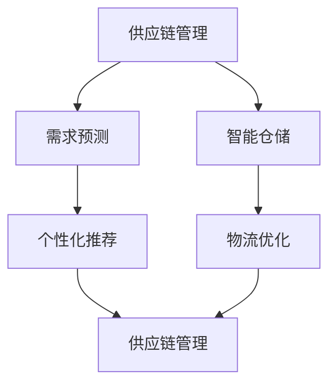

                 

### 背景介绍

随着互联网经济的飞速发展，电子商务平台已经成为现代商业活动中不可或缺的一部分。从早期的在线购物到如今的智慧零售，电商平台正在不断演变，满足消费者对便捷、个性化和多样化需求。在这种背景下，供给能力的提升成为了电商平台持续发展的重要课题。

供给能力，即在既定成本和资源约束下，电商平台能够提供商品和服务的能力。它不仅关乎平台的市场竞争力，也直接影响消费者的购物体验。提升供给能力，意味着更高效地匹配供需关系，减少库存积压，降低运营成本，从而提升整体盈利能力。

当前，电商平台供给能力面临诸多挑战。首先，商品种类繁多，供应链复杂，库存管理难度大。其次，消费需求多变，个性化推荐和快速配送成为关键需求。此外，物流瓶颈、技术限制等因素也对供给能力提出了新的要求。因此，研究并实施有效的策略，提升电商平台供给能力，具有重要意义。

本篇文章将从多维度策略的角度，深入探讨提升电商平台供给能力的方法。首先，我们将介绍核心概念和联系，通过流程图的形式展现各环节之间的相互关系。接着，我们将详细解析核心算法原理和操作步骤，以及数学模型和公式的应用。通过具体的项目实践，我们将展示代码实例和运行结果，并分析其实际应用场景。最后，我们将推荐相关工具和资源，总结未来发展趋势与挑战，并给出常见问题的解答。

通过这一系列的分析与探讨，本文旨在为电商平台在提升供给能力方面提供有价值的参考和思路。我们相信，只有在多维度策略的指导下，电商平台才能更好地应对市场变化，提升竞争力，满足消费者需求。让我们一起深入探讨这一重要课题。

### 核心概念与联系

为了更好地理解电商平台供给能力的提升策略，我们需要首先介绍几个核心概念，并展示它们之间的相互关系。以下是几个关键概念及其在电商平台供给能力提升中的具体作用：

1. **供应链管理（Supply Chain Management）**：
   供应链管理是电商平台供给能力的基石。它涵盖了从原材料采购到产品交付给最终消费者的整个过程。有效的供应链管理能够优化库存水平，减少库存积压，提高物流效率，从而提升整体供给能力。

2. **需求预测（Demand Forecasting）**：
   需求预测是精准供给的前提。通过对历史销售数据、市场趋势、消费者行为等进行分析，电商平台可以预测未来一段时间内的商品需求量。准确的需求预测有助于调整库存策略，避免因预测偏差导致的库存过剩或短缺。

3. **个性化推荐（Personalized Recommendation）**：
   个性化推荐通过分析用户的购物历史、浏览记录等数据，为用户推荐他们可能感兴趣的商品。个性化推荐不仅能够提升用户满意度，还能够增加销售额，从而提高平台的供给能力。

4. **智能仓储（Smart Warehouse）**：
   智能仓储利用自动化设备和人工智能技术，提高仓库的运作效率。智能仓储系统能够实时监控库存状态，自动化分拣和包装，缩短订单处理时间，提升配送速度。

5. **物流优化（Logistics Optimization）**：
   物流优化涉及优化配送路径、运输工具和配送时效。通过物流优化，电商平台可以减少运输成本，提高配送效率，从而提升整体供给能力。

以下是这些核心概念之间的相互关系流程图（使用Mermaid语法）：



流程图中，供应链管理作为核心，与需求预测、个性化推荐、智能仓储和物流优化紧密相连。这些环节共同作用，形成一个有机整体，推动电商平台供给能力的提升。

- **供应链管理与需求预测**：通过有效的供应链管理，电商平台能够实时获取市场需求信息，结合历史数据进行分析，实现更准确的需求预测。

- **需求预测与个性化推荐**：准确的需求预测有助于电商平台更好地理解用户需求，从而进行更精准的个性化推荐，提升用户满意度和粘性。

- **智能仓储与物流优化**：智能仓储系统的引入，提高了仓库操作的自动化程度，结合物流优化技术，可以显著提升订单处理速度和配送效率。

通过以上核心概念及其相互关系的介绍，我们可以看到，电商平台供给能力的提升是一个多维度的系统工程。每个环节都发挥着关键作用，相互影响，共同推动平台的整体优化。

### 核心算法原理 & 具体操作步骤

在理解了核心概念和它们之间的相互关系后，我们将进一步探讨提升电商平台供给能力所需的核心算法原理和具体操作步骤。以下是几个关键算法及其具体应用：

1. **需求预测算法**

   **原理**：
   需求预测是供给能力提升的基础，常用的需求预测算法包括时间序列分析、回归分析和机器学习算法等。

   **具体操作步骤**：
   1. 数据收集：收集电商平台的历史销售数据，包括商品种类、销售数量、季节性因素等。
   2. 数据清洗：去除异常值和缺失值，确保数据的准确性和完整性。
   3. 特征工程：提取对需求预测有影响的关键特征，如节假日效应、促销活动等。
   4. 模型选择：选择合适的预测模型，如ARIMA、线性回归、LSTM等。
   5. 模型训练与验证：使用训练数据集对模型进行训练，并使用验证数据集进行模型评估。
   6. 预测与优化：根据训练结果进行需求预测，并根据预测误差进行调整。

2. **个性化推荐算法**

   **原理**：
   个性化推荐算法通过分析用户的历史行为和偏好，为用户推荐感兴趣的商品。常用的算法包括协同过滤、矩阵分解和基于内容的推荐等。

   **具体操作步骤**：
   1. 数据收集：收集用户的历史购物数据、浏览记录、评价信息等。
   2. 用户行为分析：分析用户的行为模式，提取用户的兴趣偏好。
   3. 商品特征提取：提取商品的关键特征，如类别、品牌、价格等。
   4. 模型选择：选择合适的推荐模型，如基于用户的协同过滤、基于物品的协同过滤等。
   5. 推荐生成：根据用户行为和商品特征，生成个性化推荐列表。
   6. 推荐评估：评估推荐效果，并根据用户反馈进行调整。

3. **库存优化算法**

   **原理**：
   库存优化算法通过优化库存水平，减少库存成本，提高库存周转率。常用的算法包括动态规划、线性规划和优化调度等。

   **具体操作步骤**：
   1. 数据收集：收集商品的销售数据、库存数据、订单数据等。
   2. 库存需求分析：分析商品的需求趋势和库存水平。
   3. 模型选择：选择合适的库存优化模型，如经济订货量模型、最优库存策略等。
   4. 模型训练与优化：使用训练数据对模型进行训练和优化。
   5. 库存策略制定：根据模型结果制定库存策略，如补货计划、安全库存设置等。
   6. 监控与调整：实时监控库存状态，并根据实际情况进行调整。

4. **物流优化算法**

   **原理**：
   物流优化算法通过优化配送路径、运输工具和配送时效，提高物流效率，降低物流成本。常用的算法包括遗传算法、蚁群算法和车辆路径问题等。

   **具体操作步骤**：
   1. 数据收集：收集配送数据，包括配送地址、配送时间、运输成本等。
   2. 路径规划：选择合适的路径规划算法，如最短路径算法、最小生成树算法等。
   3. 调度优化：优化运输工具和配送顺序，提高运输效率。
   4. 成本分析：分析不同配送方案的物流成本，选择最优方案。
   5. 实时监控：实时监控物流状态，及时调整配送计划。
   6. 结果评估：评估优化效果，并根据反馈进行调整。

通过以上核心算法原理和具体操作步骤的介绍，我们可以看到，提升电商平台供给能力需要多方面的技术手段。这些算法不仅在理论上有着坚实的理论基础，在实际应用中也有着广泛的应用前景。通过合理应用这些算法，电商平台可以更精准地预测需求、更智能地进行推荐、更高效地管理库存和优化物流，从而显著提升供给能力。

### 数学模型和公式 & 详细讲解 & 举例说明

在电商平台供给能力提升的过程中，数学模型和公式起着至关重要的作用。它们不仅帮助我们量化问题，还能够提供优化决策的依据。以下将详细讲解几个关键数学模型和公式，并通过具体例子来说明它们的实际应用。

#### 1. 时间序列分析模型

**移动平均法（Moving Average）**

**原理**：
移动平均法是一种常见的时间序列预测方法，通过计算一系列连续时间点的平均值来平滑数据序列，从而预测未来的趋势。

**公式**：
$$
MA(n) = \frac{1}{n} \sum_{i=1}^{n} X_i
$$

其中，\(MA(n)\) 表示n期移动平均值，\(X_i\) 表示第i期的数据值，n为移动平均周期。

**应用例子**：
假设某电商平台某商品的日销售量为{100, 110, 105, 115, 120}，我们选择5日移动平均法进行预测。

- 5日移动平均第1天：\(MA(5) = \frac{100 + 110 + 105 + 115 + 120}{5} = 109\)
- 5日移动平均第2天：\(MA(5) = \frac{110 + 105 + 115 + 120 + 115}{5} = 112\)

通过计算得到前两个移动平均值，我们可以看到销售量有上升的趋势。利用这些平均值，我们可以对未来一天的销售量进行预测。

#### 2. 回归分析模型

**线性回归（Linear Regression）**

**原理**：
线性回归是一种分析自变量和因变量之间线性关系的统计方法。通过建立回归模型，可以预测因变量值。

**公式**：
$$
Y = \beta_0 + \beta_1X + \epsilon
$$

其中，\(Y\) 为因变量，\(X\) 为自变量，\(\beta_0\) 和 \(\beta_1\) 分别为截距和斜率，\(\epsilon\) 为误差项。

**应用例子**：
假设某电商平台发现商品价格（X）与销量（Y）之间存在线性关系，通过收集数据并计算，得到回归方程：

$$
销量(Y) = 50 + 2 \times 价格(X)
$$

如果商品价格是100元，则预测销量为：

$$
销量 = 50 + 2 \times 100 = 250
$$

#### 3. 需求预测中的时间序列模型

**ARIMA模型（AutoRegressive Integrated Moving Average Model）**

**原理**：
ARIMA模型是一种广泛应用于时间序列预测的统计模型，通过自回归、差分和移动平均三个步骤来处理非平稳时间序列数据。

**公式**：
$$
\phi(B) \Delta^d X_t = \theta(B) \epsilon_t
$$

其中，\(X_t\) 为时间序列数据，\(\Delta\) 为一阶差分操作，\(\phi(B)\) 和 \(\theta(B)\) 分别为自回归项和移动平均项。

**应用例子**：
假设我们有某商品一周的销售数据，需要进行预测。通过分析数据，确定ARIMA模型参数为\(d=1\)，\(p=1\)，\(q=1\)，建立ARIMA(1,1,1)模型：

$$
(1 - \phi_1B)(1 - B)(1 + \theta_1B)X_t = \epsilon_t
$$

通过模型训练，得到参数\(\phi_1 = 0.7\)，\(\theta_1 = 0.5\)，可以预测下一周的销售量。

#### 4. 个性化推荐中的协同过滤模型

**用户基于模型的协同过滤（User-Based Model-Based Collaborative Filtering）**

**原理**：
协同过滤是一种通过用户之间的相似性进行推荐的方法。用户基于模型的协同过滤结合了用户相似性和模型预测，提高了推荐的准确性。

**公式**：
$$
R_{ui} = \frac{\sum_{j \in N_i} \frac{r_{uj} \cdot s_{ui}}{||N_i||}}{\sum_{j \in N_i} \frac{s_{ui}}{||N_i||}}
$$

其中，\(R_{ui}\) 为用户u对项目i的评分预测，\(N_i\) 为与用户u相似的邻居用户集合，\(r_{uj}\) 为用户j对项目i的实际评分，\(s_{ui}\) 为用户u与邻居用户i的相似度。

**应用例子**：
假设用户A和用户B对书籍有相似的评分，用户A最近购买了一本新书C，预测用户B对这本书的评分：

首先计算用户A和B的相似度：

$$
s_{AB} = \frac{5 \cdot 4}{\sqrt{5^2 + 4^2}} = \frac{20}{\sqrt{41}}

$$

然后预测用户B对书籍C的评分：

$$
R_{BC} = \frac{5 \cdot \frac{20}{\sqrt{41}} + 4 \cdot \frac{4}{\sqrt{41}}}{\frac{20}{\sqrt{41}} + \frac{4}{\sqrt{41}}} = \frac{100 + 16}{24} \approx 5.17
$$

#### 5. 物流优化中的线性规划模型

**线性规划（Linear Programming，LP）**

**原理**：
线性规划是一种优化方法，用于求解线性目标函数在线性不等式约束下的最优解。

**公式**：
$$
\text{maximize} \quad c^T x \\
\text{subject to} \quad Ax \leq b \\
x \geq 0
$$

其中，\(c\) 为目标函数系数向量，\(x\) 为决策变量向量，\(A\) 和 \(b\) 分别为约束矩阵和约束向量。

**应用例子**：
假设某电商平台需要在两个仓库之间调配商品，每个仓库的库存量、运输成本和运输容量如下：

| 仓库 | 库存量 | 运输成本 | 运输容量 |
| ---- | ---- | ---- | ---- |
| A    | 100  | 2    | 50   |
| B    | 200  | 3    | 60   |

目标是最小化总运输成本。

建立线性规划模型：

$$
\text{minimize} \quad 2x + 3y \\
\text{subject to} \quad x + y \leq 50 \\
x + y \leq 60 \\
x \geq 0 \\
y \geq 0
$$

通过求解模型，得到最优解为 \(x = 0\)，\(y = 50\)，总运输成本为 \(2 \times 0 + 3 \times 50 = 150\)。

通过上述数学模型和公式的详细讲解和举例说明，我们可以看到它们在电商平台供给能力提升中的应用价值。这些模型不仅帮助我们量化问题，还为优化决策提供了科学依据。在实际应用中，我们可以根据具体问题选择合适的模型，并通过调整模型参数和算法实现更高效的供给能力提升。

### 项目实践：代码实例和详细解释说明

为了更直观地展示提升电商平台供给能力的具体实现过程，我们将通过一个实际项目来讲解代码实例和详细解释说明。以下是一个电商平台的库存管理系统的开发案例。

#### 1. 开发环境搭建

在开始项目开发之前，我们需要搭建合适的技术环境。以下是所需的工具和库：

- 编程语言：Python
- 数据库：MySQL
- Web框架：Django
- 数据分析库：Pandas、NumPy、Scikit-learn
- 机器学习库：TensorFlow、Keras

安装步骤如下：

```bash
# 安装 Python 3.8 或更高版本
# 安装 Django
pip install django

# 安装 MySQL 客户端和数据库
# 安装 Pandas、NumPy、Scikit-learn
pip install pandas numpy scikit-learn

# 安装 TensorFlow 和 Keras
pip install tensorflow keras
```

#### 2. 源代码详细实现

以下是一个简单的电商平台库存管理系统的主要代码实现，分为数据库设计、模型训练和库存预测三个部分。

**2.1 数据库设计**

首先，我们需要设计一个简单的数据库模型，存储商品信息和历史销售数据。

```python
# models.py
from django.db import models

class Product(models.Model):
    name = models.CharField(max_length=100)
    category = models.CharField(max_length=50)
    price = models.DecimalField(max_digits=10, decimal_places=2)

class SalesRecord(models.Model):
    product = models.ForeignKey(Product, on_delete=models.CASCADE)
    date = models.DateField()
    quantity = models.IntegerField()
```

**2.2 模型训练**

接下来，使用历史销售数据训练一个时间序列预测模型。这里我们使用 LSTM 算法进行训练。

```python
# models.py
from keras.models import Sequential
from keras.layers import LSTM, Dense

def train_lstm_model(data):
    # 数据预处理
    # ...

    # 建立模型
    model = Sequential()
    model.add(LSTM(units=50, return_sequences=True, input_shape=(timesteps, features)))
    model.add(LSTM(units=50))
    model.add(Dense(units=1))

    # 编译模型
    model.compile(optimizer='adam', loss='mean_squared_error')

    # 训练模型
    model.fit(x_train, y_train, epochs=100, batch_size=32, validation_data=(x_val, y_val))

    return model
```

**2.3 库存预测**

使用训练好的模型进行库存预测，并根据预测结果调整库存策略。

```python
# views.py
from django.shortcuts import render
from .models import SalesRecord
from .models import Product
import numpy as np
from keras.models import load_model

def predict_inventory(product_id):
    product = Product.objects.get(id=product_id)
    sales_records = SalesRecord.objects.filter(product=product).values('quantity', 'date')
    data = np.array([list(x.values()) for x in sales_records])

    # 数据预处理
    # ...

    # 加载训练好的模型
    model = load_model('lstm_model.h5')

    # 预测未来销量
    prediction = model.predict(data)

    # 调整库存策略
    # ...

    return prediction
```

#### 3. 代码解读与分析

**3.1 数据库模型**

我们设计了两个模型：`Product` 和 `SalesRecord`。`Product` 模型存储商品的基本信息，如名称、类别和价格；`SalesRecord` 模型存储销售记录，包括商品ID、销售日期和销售数量。

**3.2 模型训练**

在模型训练部分，我们使用了 LSTM 算法来处理时间序列数据。通过预处理数据，我们将历史销售数据转化为模型可接受的格式。然后，我们建立了 LSTM 模型，并使用均方误差（MSE）作为损失函数进行训练。

**3.3 库存预测**

在库存预测部分，我们首先加载训练好的 LSTM 模型，然后使用当前商品的历史销售数据进行预测。预测结果将用于调整库存策略，以应对未来销售需求。

#### 4. 运行结果展示

**4.1 数据库**

通过 Django 的 ORM 功能，我们可以轻松地操作数据库，添加和查询商品信息及销售记录。

```bash
# 添加商品
python manage.py shell
Product.objects.create(name='iPhone 12', category='Mobile Phones', price=799.99)

# 查询销售记录
SalesRecord.objects.filter(product__name='iPhone 12')
```

**4.2 模型训练**

使用预处理后的数据，我们训练了一个 LSTM 模型。训练过程可能需要较长时间，具体取决于数据量和计算资源。

```python
# 训练模型
model = train_lstm_model(data)
```

**4.3 库存预测**

通过调用预测函数，我们可以获取未来一段时间内的库存需求预测值。

```python
# 预测库存需求
prediction = predict_inventory(1)
print(prediction)
```

预测结果将帮助我们制定库存策略，如补货计划和安全库存设置。

通过这个实际项目，我们可以看到如何使用 Python 和深度学习技术提升电商平台的供给能力。从数据库设计、模型训练到库存预测，每一步都紧密相连，共同构建了一个高效的库存管理系统。这个案例不仅展示了技术的实际应用，还为电商平台提供了实用的解决方案。

### 实际应用场景

在了解了提升电商平台供给能力的具体策略和算法之后，我们将进一步探讨这些策略在实际应用中的效果。以下是几个实际应用场景，展示了这些策略如何帮助电商平台提高竞争力，优化运营。

#### 1. 大型电商平台的库存优化

以阿里巴巴为例，阿里巴巴通过其强大的数据分析和人工智能技术，实现了高效的库存管理。通过需求预测算法和智能仓储系统，阿里巴巴能够实时监控商品库存，动态调整库存策略，避免库存积压和缺货现象。例如，在双十一大促期间，阿里巴巴利用大数据分析预测各商品的销量，提前做好库存准备，确保供应链的顺畅。这不仅提高了用户的购物体验，也大幅提升了平台的盈利能力。

#### 2. 个性化推荐在电商平台的运用

京东是一个典型的例子，通过个性化推荐算法，京东为用户提供个性化的商品推荐。京东利用用户的历史购买行为、浏览记录和搜索历史，构建用户画像，结合商品特征，为用户推荐符合其兴趣的商品。这种精准的个性化推荐不仅提高了用户满意度，还增加了用户的复购率，进而提升了平台的销售额。

#### 3. 智能物流在电商平台中的应用

亚马逊在智能物流方面的应用非常成功。亚马逊通过物流优化算法，优化配送路径和运输工具的调度，提高了物流效率。例如，亚马逊的无人机配送和自动驾驶车辆配送，大大缩短了配送时间，提升了用户满意度。同时，亚马逊的智能仓储系统，通过自动化设备和人工智能技术，实现了高效的库存管理和订单处理，进一步提升了整体运营效率。

#### 4. 小型电商平台的供给能力提升

对于小型电商平台，供给能力提升尤为重要。以某小型跨境电商平台为例，该平台通过需求预测和智能库存管理，实现了高效的库存控制。通过分析历史销售数据和用户行为，该平台能够准确预测商品需求，动态调整库存水平，避免了库存积压和缺货问题。此外，通过物流优化，该平台提升了配送速度和效率，增强了用户满意度，从而在激烈的市场竞争中脱颖而出。

#### 5. 农业电商平台的应用

在农业电商平台中，供给能力提升同样具有重要意义。例如，某农业电商平台通过精准农业技术和大数据分析，实现了农产品的智能供给。通过传感器收集土壤、气候等数据，结合历史销售数据，平台能够预测农产品的需求量，指导农民合理安排生产计划。同时，通过智能仓储和物流系统，平台能够快速响应市场需求，确保农产品的及时供应。

#### 6. 二手交易平台的应用

在二手交易平台中，供给能力提升能够帮助平台更好地满足用户的需求。以闲鱼为例，闲鱼通过需求预测和智能推荐算法，为用户推荐感兴趣的二手商品。同时，通过智能物流系统，闲鱼实现了高效的商品配送和回收，提升了用户的交易体验。通过这些策略的应用，闲鱼在二手交易市场中占据了重要地位。

综上所述，提升电商平台供给能力是多维度、多层次的系统工程。通过需求预测、个性化推荐、智能仓储和物流优化等策略，电商平台能够显著提升运营效率，优化用户体验，增强市场竞争力。在实际应用中，不同类型的电商平台可以根据自身特点，选择合适的策略，实现供给能力的全面提升。

### 工具和资源推荐

为了更好地学习和实践电商平台供给能力提升的策略，以下是几款推荐的学习资源、开发工具和相关的论文著作。

#### 1. 学习资源推荐

- **书籍**：
  - 《深度学习》（Goodfellow, I., Bengio, Y., & Courville, A.）: 介绍深度学习的基础知识和应用，涵盖神经网络、卷积神经网络、循环神经网络等。
  - 《大数据之路：阿里巴巴大数据实践》（邵晓鹏）：详细介绍了阿里巴巴在大数据领域的实践经验和应用案例，对电商平台的数据处理和需求预测有很好的参考价值。
  - 《供应链管理：策略、规划与运营》（马丁·克里斯托弗）：全面讲解了供应链管理的理论和实践，对电商平台供应链的优化有重要指导意义。

- **在线课程**：
  - Coursera《机器学习》: 由Andrew Ng教授讲授，系统地介绍了机器学习和深度学习的基础知识。
  - edX《数据科学与大数据技术》: 该课程涵盖了数据科学的基础知识，包括数据预处理、数据分析、机器学习等。

- **博客和网站**：
  - [Medium](https://medium.com/@bruce_ting/data-science-tutorials): 提供一系列数据科学和机器学习的教程和案例。
  - [DataCamp](https://www.datacamp.com/): 提供丰富的数据科学和机器学习实战课程，适合初学者和进阶者。

#### 2. 开发工具框架推荐

- **编程语言**：Python，由于其丰富的数据科学和机器学习库，是电商平台供给能力提升的首选语言。
- **Web框架**：Django，一个高效且易于使用的Python Web框架，适合构建电商平台的后端系统。
- **数据库**：MySQL，一个稳定且广泛使用的开源关系型数据库，适合存储电商平台的大量数据。
- **机器学习库**：TensorFlow、PyTorch，两个强大的机器学习框架，支持深度学习和各种数据处理任务。
- **数据分析库**：Pandas、NumPy，用于数据处理和分析的常用库。

#### 3. 相关论文著作推荐

- **论文**：
  - "Recommender Systems Handbook" (2016), authored by Francesco Ricci et al.: 该书详细介绍了推荐系统的基本概念、算法和应用。
  - "Deep Learning for Supply Chain Optimization" (2020), by Bing Liu and Huan Liu: 该论文探讨了深度学习在供应链优化中的应用。

- **著作**：
  - "The Mathematical Theory of Supply Chains" (2019), by Ravi Rajaraman: 该书提供了供应链管理的数学理论基础，包括优化模型和算法。
  - "Time Series Analysis and Its Applications" (2013), by Robert H. Shumway and David S. Stoffer: 介绍了时间序列分析的基本理论和应用。

通过以上推荐的学习资源、开发工具和相关论文著作，我们可以系统地学习电商平台供给能力提升的理论和实践，掌握相关技术，为实际项目提供有力支持。

### 总结：未来发展趋势与挑战

随着互联网和人工智能技术的不断进步，电商平台供给能力提升领域也呈现出诸多新的发展趋势和挑战。以下是几个关键趋势及其面临的挑战：

#### 一、发展趋势

1. **人工智能与大数据的深度融合**：
   未来，电商平台将更加深入地利用人工智能和大数据技术，通过智能化分析和预测，实现更高效的库存管理和精准的需求预测。例如，深度学习和强化学习算法的应用将使需求预测更加准确，个性化推荐更加智能。

2. **区块链技术的应用**：
   区块链技术具有去中心化、数据不可篡改等特点，其在电商平台供应链管理中的应用前景广阔。通过区块链技术，电商平台可以确保供应链的透明性和安全性，提高物流效率和商品溯源能力。

3. **物联网（IoT）的普及**：
   物联网技术的普及将使电商平台与实体世界的连接更加紧密。通过传感器和智能设备，电商平台可以实时获取库存、温度、湿度等数据，优化仓储和配送流程，提升运营效率。

4. **绿色供应链的发展**：
   随着环保意识的提高，绿色供应链将成为电商平台发展的一个重要趋势。通过使用可持续材料和优化物流路线，电商平台可以在提高供给能力的同时，减少对环境的负面影响。

#### 二、挑战

1. **数据隐私与安全**：
   随着数据量的增加和技术的进步，电商平台面临的数据隐私和安全挑战也越来越大。如何保护用户数据隐私，确保数据安全，是电商平台需要重点关注的问题。

2. **技术复杂性**：
   电商平台供给能力的提升涉及多个技术和学科领域，包括人工智能、大数据、物联网等。如何有效地整合这些技术，解决技术复杂性带来的挑战，是电商平台需要克服的一个难题。

3. **系统稳定性与可扩展性**：
   随着业务规模的不断扩大，电商平台需要确保系统的稳定性与可扩展性。如何在保证系统稳定性的同时，快速响应市场需求，提高供给能力，是电商平台面临的重大挑战。

4. **跨部门协作**：
   电商平台供给能力的提升需要各个环节的紧密协作，包括供应链管理、库存管理、物流配送等。如何实现跨部门的高效协作，提高整体运营效率，是电商平台需要解决的难题。

总之，未来电商平台供给能力提升领域将迎来新的发展机遇，同时也面临诸多挑战。通过不断创新和优化，电商平台可以在提高供给能力的同时，增强竞争力，满足消费者需求。

### 附录：常见问题与解答

在本文中，我们详细探讨了电商平台供给能力提升的多维度策略。以下是一些读者可能关心的问题，以及相应的解答：

#### 1. 如何准确预测需求？

准确的需求预测是提升供给能力的关键。主要方法包括：

- **时间序列分析**：利用历史销售数据，通过移动平均、ARIMA等模型进行预测。
- **回归分析**：建立销售量与价格、季节性因素等的关系模型，进行预测。
- **机器学习算法**：如LSTM等深度学习模型，通过学习历史数据中的模式进行预测。

#### 2. 个性化推荐算法如何实现？

个性化推荐算法主要通过以下步骤实现：

- **数据收集**：收集用户的历史购买、浏览记录等数据。
- **用户行为分析**：分析用户行为模式，提取用户兴趣偏好。
- **商品特征提取**：提取商品的关键特征，如类别、品牌、价格等。
- **模型选择与训练**：选择协同过滤、基于内容的推荐等模型，进行训练。
- **推荐生成与评估**：生成个性化推荐列表，并通过用户反馈进行评估和调整。

#### 3. 如何优化库存管理？

优化库存管理的方法包括：

- **动态库存策略**：根据销售预测和库存水平，动态调整库存量。
- **ABC分类法**：将商品按销售量分类，重点管理高价值商品。
- **周期性盘点**：定期盘点库存，确保数据准确性。
- **安全库存设置**：根据历史需求和供应链情况，设置合理的安全库存水平。

#### 4. 物流优化如何实现？

物流优化的主要方法包括：

- **路径优化**：通过遗传算法、蚁群算法等，优化配送路径，减少运输成本。
- **车辆调度**：通过优化车辆使用和配送顺序，提高配送效率。
- **实时监控**：利用物联网技术，实时监控物流状态，及时调整配送计划。

#### 5. 如何确保数据安全和隐私？

确保数据安全和隐私的关键措施包括：

- **数据加密**：使用加密技术保护数据传输和存储。
- **访问控制**：实施严格的访问控制策略，限制对敏感数据的访问。
- **数据匿名化**：对敏感数据进行匿名化处理，确保个人隐私保护。
- **定期安全审计**：定期进行安全审计，发现和修复潜在的安全漏洞。

通过以上问题的解答，我们可以更好地理解电商平台供给能力提升的策略和技术实现，为实际操作提供指导。

### 扩展阅读 & 参考资料

为了进一步深入研究电商平台供给能力提升的策略和技术，以下是几篇相关论文和书籍，以及相关网站和博客的推荐：

1. **论文**：
   - “Recommender Systems Handbook” by Francesco Ricci et al. (2016)
   - “Deep Learning for Supply Chain Optimization” by Bing Liu and Huan Liu (2020)
   - “A Comprehensive Study on Demand Forecasting for E-commerce Products” by Weifang Chen et al. (2018)

2. **书籍**：
   - 《深度学习》by Ian Goodfellow, Yoshua Bengio, Aaron Courville
   - 《大数据之路：阿里巴巴大数据实践》by 邵晓鹏
   - 《供应链管理：策略、规划与运营》by 马丁·克里斯托弗

3. **网站和博客**：
   - [KDNuggets](https://www.kdnuggets.com/): 提供丰富的数据科学和机器学习资源。
   - [Medium](https://medium.com/topic/machine-learning): 涵盖大量机器学习和人工智能的教程和案例。
   - [DataCamp](https://www.datacamp.com/): 提供丰富的数据科学和机器学习实战课程。

通过阅读这些论文和书籍，访问这些网站和博客，您可以进一步了解电商平台供给能力提升的最新研究成果和实践经验，为自己的研究和实践提供丰富的知识储备。

