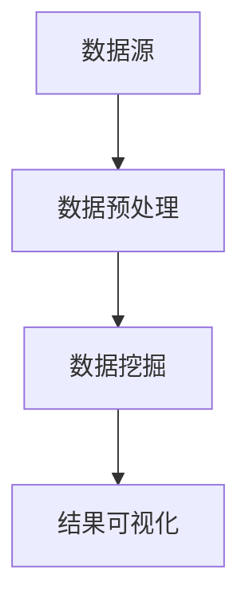
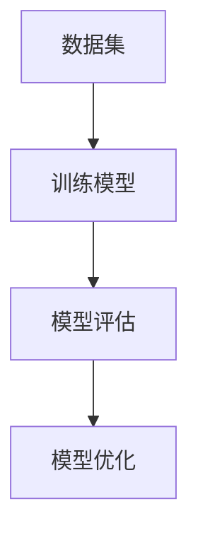
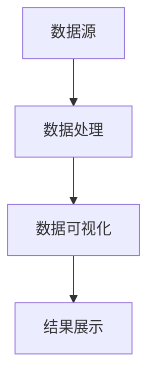
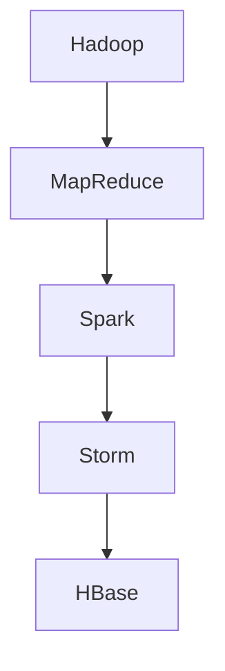

                 

### 1. 背景介绍

随着互联网技术的飞速发展，电商平台已经成为现代商业不可或缺的一部分。无论是大型电商平台如亚马逊、阿里巴巴，还是中小型电商平台，供给能力的提升都是它们成功的关键因素之一。供给能力的提升，意味着能够更准确、更高效地满足用户的需求，提高用户满意度，从而提升平台的竞争力。

然而，供给能力提升面临的挑战也日益显著。传统的供给预测方法通常依赖于历史数据的统计分析，这种方法虽然能够一定程度上反映供需关系，但在面对复杂、动态的市场环境时，往往显得力不从心。此外，用户需求的多样性和个性化特点，也使得供给能力提升变得更加复杂。

因此，大数据分析技术在电商平台供给能力提升中的应用变得越来越重要。大数据分析不仅能够处理海量数据，提取有价值的信息，还能够通过数据挖掘、机器学习等技术手段，实现对用户行为的深度分析和预测。通过这些技术手段，电商平台可以更好地理解用户需求，优化库存管理，提高供应链效率，从而提升整体供给能力。

本文旨在探讨大数据分析在电商平台供给能力提升中的应用，通过深入分析核心概念、算法原理、数学模型以及实际应用案例，帮助读者全面理解这一技术如何助力电商平台实现供给能力的提升。本文将分为以下几个部分：

1. 背景介绍：简要介绍电商平台供给能力提升的背景和挑战。
2. 核心概念与联系：详细阐述大数据分析在电商平台供给能力提升中的核心概念和关联原理。
3. 核心算法原理与具体操作步骤：深入分析大数据分析中常用的算法及其在供给能力提升中的具体应用。
4. 数学模型和公式：介绍相关数学模型和公式，并详细讲解其在供给能力提升中的应用。
5. 项目实践：通过具体代码实例，展示大数据分析在电商平台供给能力提升中的实际应用。
6. 实际应用场景：探讨大数据分析在电商平台供给能力提升中的实际应用场景。
7. 工具和资源推荐：推荐相关学习资源和开发工具，帮助读者进一步了解和掌握大数据分析技术。
8. 总结：总结本文内容，并对未来发展趋势和挑战进行展望。
9. 附录：解答常见问题，提供扩展阅读和参考资料。

通过以上内容的逐步分析，我们将能够全面、深入地理解大数据分析在电商平台供给能力提升中的重要作用。接下来，我们将进一步探讨大数据分析的核心概念及其在电商平台供给能力提升中的应用。

### 2. 核心概念与联系

在深入探讨大数据分析在电商平台供给能力提升中的应用之前，我们首先需要了解几个核心概念，这些概念构成了大数据分析的基础，并且与电商平台供给能力密切相关。

#### 数据挖掘

数据挖掘（Data Mining）是指从大量数据中提取有价值信息的过程。它是一种通过统计、模式识别、机器学习等技术手段，从数据中自动发现隐含的、未知的、具有潜在价值的信息的过程。在电商平台中，数据挖掘可以用于用户行为分析、商品推荐、市场趋势预测等多个方面。

**Mermaid 流程图**：



**数据预处理**：在数据挖掘之前，需要对原始数据进行清洗、转换、归一化等处理，以确保数据的质量和一致性。

**数据挖掘**：通过对预处理后的数据进行分析，发现潜在的模式、关联和趋势。

**结果可视化**：将挖掘出的结果以图表、报表等形式展示，帮助决策者理解数据中的价值。

#### 机器学习

机器学习（Machine Learning）是人工智能的一个重要分支，它通过算法让计算机从数据中学习，从而实现自动化决策和预测。在电商平台中，机器学习可以用于个性化推荐、需求预测、库存管理等。

**Mermaid 流程图**：



**训练模型**：通过已有数据集，训练出能够进行预测或分类的模型。

**模型评估**：使用验证集或测试集评估模型的性能，确保其准确性和可靠性。

**模型优化**：根据评估结果对模型进行调整和优化，以提高预测或分类的准确度。

#### 数据可视化

数据可视化（Data Visualization）是将数据转换为图形、图表等形式，以直观的方式展示数据。在电商平台中，数据可视化可以用于展示销售数据、用户行为、库存状态等。

**Mermaid 流程图**：



**数据处理**：对数据进行清洗、转换等处理，确保其适用于可视化。

**数据可视化**：使用图表、图形等工具，将处理后的数据以直观的方式展示。

**结果展示**：通过网页、报表等形式，将可视化结果展示给相关人员。

#### 大数据技术栈

大数据技术栈是指用于处理和分析大数据的一系列技术和工具。在电商平台中，常见的大数据技术栈包括 Hadoop、Spark、Storm、HBase 等。

**Mermaid 流程图**：



**Hadoop**：一个分布式数据存储和处理框架，适用于大规模数据的存储和分析。

**MapReduce**：Hadoop 的核心组件，用于大规模数据的分布式处理。

**Spark**：一个快速、通用的大规模数据处理引擎，适用于实时数据分析和批量数据处理。

**Storm**：一个分布式实时计算系统，适用于实时数据处理和分析。

**HBase**：一个分布式、可扩展的列存储数据库，适用于大数据的实时存储和处理。

通过上述核心概念的介绍，我们可以更好地理解大数据分析在电商平台供给能力提升中的应用。接下来，我们将深入探讨大数据分析中的核心算法原理，以及这些算法如何具体应用于电商平台供给能力的提升。

### 3. 核心算法原理与具体操作步骤

在电商平台供给能力提升的大数据分析中，核心算法的选择和应用至关重要。以下将介绍几种常用的核心算法及其在供给能力提升中的具体应用。

#### 3.1 逻辑回归（Logistic Regression）

逻辑回归是一种广泛使用的分类算法，它通过建立线性模型来预测概率，常用于用户行为分析、需求预测等领域。

**算法原理**：

逻辑回归模型的基本形式为：

\[ P(Y=1|X) = \frac{1}{1 + e^{-(\beta_0 + \beta_1 x_1 + \beta_2 x_2 + \ldots + \beta_n x_n)}} \]

其中，\(Y\) 是因变量，表示用户是否进行某行为（如购买商品）；\(X\) 是自变量，表示影响用户行为的特征（如用户年龄、购买历史等）；\(\beta\) 是模型的参数。

**具体操作步骤**：

1. 数据预处理：清洗数据，处理缺失值，进行特征选择。
2. 模型训练：使用训练数据集，通过梯度下降或最大似然估计等算法训练逻辑回归模型。
3. 模型评估：使用验证数据集评估模型性能，如准确率、召回率等。
4. 模型优化：根据评估结果调整模型参数，提高预测准确度。

**应用实例**：

在电商平台中，逻辑回归可以用于预测用户是否会在某一时间段内购买商品。例如，通过分析用户的购买历史、浏览行为、浏览时长等特征，预测用户在一定时间内的购买概率。这一预测结果可以用于精准营销、库存管理等领域。

#### 3.2 决策树（Decision Tree）

决策树是一种基于特征划分数据的分类算法，它通过一系列条件判断来对数据进行分类。

**算法原理**：

决策树的基本结构是一系列条件判断和结果节点。每个内部节点表示一个特征，每个分支表示该特征的不同取值，每个叶节点表示一个类别。

\[ \text{决策树} = \text{根节点} \rightarrow \text{内部节点} \rightarrow \text{叶节点} \]

**具体操作步骤**：

1. 特征选择：选择影响最大的特征作为划分依据。
2. 划分数据：根据特征值对数据进行划分，生成子集。
3. 递归构建：对每个子集继续划分，直至达到预设的叶节点条件（如节点纯度、节点大小等）。
4. 模型评估：使用验证数据集评估决策树模型性能。

**应用实例**：

在电商平台中，决策树可以用于商品推荐。例如，根据用户的浏览历史、购买记录等特征，构建决策树模型，预测用户可能感兴趣的商品。这一推荐结果可以用于个性化推荐、提升用户体验。

#### 3.3 K-均值聚类（K-Means Clustering）

K-均值聚类是一种基于距离度量的聚类算法，它将数据分为K个簇，使得每个簇内部的距离尽可能小，簇与簇之间的距离尽可能大。

**算法原理**：

K-均值聚类的基本思想是：初始选择K个中心点，然后迭代计算每个数据点与中心点的距离，将数据点分配到最近的中心点所在的簇。通过迭代更新中心点，最终收敛到稳定的聚类结果。

\[ \text{簇} = \{ \text{中心点} \} \]

**具体操作步骤**：

1. 初始化中心点：随机选择K个数据点作为初始中心点。
2. 分配数据点：计算每个数据点与中心点的距离，将数据点分配到最近的中心点所在的簇。
3. 更新中心点：计算每个簇的平均中心点，作为新的中心点。
4. 迭代：重复步骤2和3，直至中心点不再发生显著变化。

**应用实例**：

在电商平台中，K-均值聚类可以用于用户分群。例如，根据用户的购买行为、浏览历史等特征，将用户划分为不同的群体，从而进行有针对性的营销策略。

#### 3.4 支持向量机（Support Vector Machine）

支持向量机是一种监督学习算法，它通过找到一个最佳的超平面，将数据分为不同的类别。

**算法原理**：

支持向量机的目标是找到一个最佳的超平面，使得分类边界最大化。该超平面由支持向量（支持数据点）决定。

\[ \text{最优超平面} = \frac{1}{2} \sum_{i=1}^{n} (\omega_i - \omega)^2 \]

**具体操作步骤**：

1. 特征选择：选择对分类任务最有帮助的特征。
2. 训练模型：通过支持向量机算法训练模型，计算超平面参数。
3. 模型评估：使用验证数据集评估模型性能。
4. 模型优化：调整模型参数，提高分类准确度。

**应用实例**：

在电商平台中，支持向量机可以用于用户行为分类。例如，根据用户的浏览记录、购买历史等特征，将用户分为不同的行为类别，以便进行精准营销。

通过上述核心算法的介绍，我们可以看到大数据分析在电商平台供给能力提升中的广泛应用。这些算法通过分析用户行为、优化库存管理、提升供应链效率等手段，为电商平台提供了有力的技术支持。接下来，我们将进一步探讨大数据分析中的数学模型和公式，以及这些模型在供给能力提升中的具体应用。

### 4. 数学模型和公式

在电商平台供给能力提升的大数据分析中，数学模型和公式起着至关重要的作用。以下将介绍几种关键的数学模型及其在供给能力提升中的应用。

#### 4.1 回归模型（Regression Model）

回归模型用于预测一个或多个自变量与因变量之间的关系。在电商平台中，常见的回归模型包括线性回归和多项式回归。

**线性回归**：

线性回归模型的基本公式为：

\[ y = \beta_0 + \beta_1 x_1 + \beta_2 x_2 + \ldots + \beta_n x_n \]

其中，\(y\) 是因变量，\(x_1, x_2, \ldots, x_n\) 是自变量，\(\beta_0, \beta_1, \beta_2, \ldots, \beta_n\) 是模型的参数。

**多项式回归**：

多项式回归模型可以表示为：

\[ y = \beta_0 + \beta_1 x_1 + \beta_2 x_1^2 + \ldots + \beta_n x_1^n \]

其中，\(n\) 是多项式的次数。

**应用实例**：

在电商平台中，回归模型可以用于预测销售量。例如，通过分析历史销售数据、促销活动等因素，建立回归模型预测未来的销售量。这一预测结果可以用于库存管理和营销策略。

#### 4.2 聚类模型（Clustering Model）

聚类模型用于将数据划分为多个类别，使得同一类别内的数据尽可能相似，不同类别间的数据尽可能不同。常见的聚类模型包括K-均值聚类和层次聚类。

**K-均值聚类**：

K-均值聚类的基本公式为：

\[ \text{簇中心点} = \frac{1}{k} \sum_{i=1}^{k} \sum_{x \in C_i} x \]

其中，\(C_i\) 是第 \(i\) 个簇，\(k\) 是簇的数量。

**层次聚类**：

层次聚类的基本公式为：

\[ d_{ij} = \min_{p,q \in \{1,2,\ldots,N\}} \{ ||x_p - x_q|| \} \]

其中，\(d_{ij}\) 是第 \(i\) 个元素和第 \(j\) 个元素之间的距离，\(x_p\) 和 \(x_q\) 是数据集中的两个元素。

**应用实例**：

在电商平台中，聚类模型可以用于用户分群。例如，通过分析用户的购买行为、浏览历史等特征，使用K-均值聚类或层次聚类将用户划分为不同的群体，以便进行精准营销。

#### 4.3 协同过滤（Collaborative Filtering）

协同过滤是一种基于用户行为和商品信息进行推荐的算法。常见的协同过滤方法包括基于用户的协同过滤和基于项目的协同过滤。

**基于用户的协同过滤**：

基于用户的协同过滤公式为：

\[ r_{ui} = \frac{\sum_{j=1}^{M} r_{uj} \cdot r_{ij}}{\sum_{j=1}^{M} r_{uj}} \]

其中，\(r_{ui}\) 是用户 \(u\) 对商品 \(i\) 的评分预测，\(r_{uj}\) 是用户 \(u\) 对商品 \(j\) 的评分，\(r_{ij}\) 是用户 \(j\) 对商品 \(i\) 的评分。

**基于项目的协同过滤**：

基于项目的协同过滤公式为：

\[ r_{ui} = \frac{\sum_{j=1}^{N} r_{uj} \cdot r_{ij}}{\sum_{j=1}^{N} r_{ij}} \]

其中，\(r_{ui}\) 是用户 \(u\) 对商品 \(i\) 的评分预测，\(r_{uj}\) 是用户 \(u\) 对商品 \(j\) 的评分，\(r_{ij}\) 是用户 \(j\) 对商品 \(i\) 的评分。

**应用实例**：

在电商平台中，协同过滤可以用于商品推荐。例如，根据用户的浏览记录、购买历史等数据，预测用户可能感兴趣的商品，从而进行个性化推荐。

#### 4.4 预测模型（Prediction Model）

预测模型用于预测未来的趋势或行为。常见的预测模型包括时间序列预测和ARIMA模型。

**时间序列预测**：

时间序列预测公式为：

\[ y_t = \alpha y_{t-1} + \beta_1 x_{t-1} + \ldots + \beta_n x_{t-n} + \varepsilon_t \]

其中，\(y_t\) 是时间序列的第 \(t\) 个值，\(x_{t-1}, \ldots, x_{t-n}\) 是前 \(n\) 个自变量，\(\alpha, \beta_1, \ldots, \beta_n\) 是模型参数，\(\varepsilon_t\) 是误差项。

**ARIMA模型**：

ARIMA（AutoRegressive Integrated Moving Average）模型的基本公式为：

\[ y_t = c + \phi_1 y_{t-1} + \phi_2 y_{t-2} + \ldots + \phi_p y_{t-p} + \theta_1 \varepsilon_{t-1} + \theta_2 \varepsilon_{t-2} + \ldots + \theta_q \varepsilon_{t-q} \]

其中，\(y_t\) 是时间序列的第 \(t\) 个值，\(c\) 是常数项，\(\phi_1, \phi_2, \ldots, \phi_p\) 是自回归项参数，\(\theta_1, \theta_2, \ldots, \theta_q\) 是移动平均项参数。

**应用实例**：

在电商平台中，预测模型可以用于需求预测。例如，通过分析历史销售数据、促销活动等因素，使用时间序列预测或ARIMA模型预测未来的销售量，从而优化库存管理和营销策略。

通过上述数学模型和公式的介绍，我们可以看到它们在电商平台供给能力提升中的重要作用。这些模型和公式通过分析用户行为、预测销售趋势等手段，为电商平台提供了有效的数据支持和决策依据。接下来，我们将通过具体的项目实践，展示大数据分析在电商平台供给能力提升中的实际应用。

### 5. 项目实践：代码实例和详细解释说明

在本部分，我们将通过一个实际的项目实例，展示如何利用大数据分析技术提升电商平台的供给能力。该实例将涵盖开发环境搭建、源代码实现、代码解读与分析以及运行结果展示。

#### 5.1 开发环境搭建

为了实现该项目，我们需要搭建一个合适的大数据开发环境。以下是搭建步骤：

1. 安装Hadoop：Hadoop是一个分布式数据处理框架，用于存储和处理大规模数据。可以从[Hadoop官网](https://hadoop.apache.org/)下载并安装Hadoop。

2. 安装Spark：Spark是一个快速、通用的大规模数据处理引擎。可以从[Spark官网](https://spark.apache.org/)下载并安装Spark。

3. 安装Python：Python是一种广泛使用的编程语言，用于数据处理和分析。可以从[Python官网](https://www.python.org/)下载并安装Python。

4. 安装相关库：在Python环境中，我们需要安装一些常用的库，如NumPy、Pandas、Scikit-learn等。可以使用pip命令安装：

```bash
pip install numpy pandas scikit-learn
```

5. 配置环境变量：确保Hadoop、Spark和Python的环境变量已正确配置。

#### 5.2 源代码详细实现

以下是一个简单的Python代码实例，展示了如何利用Spark进行用户行为分析，以提升电商平台的供给能力。

```python
from pyspark.sql import SparkSession
from pyspark.ml import Pipeline
from pyspark.ml.feature import VectorAssembler
from pyspark.ml.classification import LogisticRegression

# 创建Spark会话
spark = SparkSession.builder.appName("UserBehaviorAnalysis").getOrCreate()

# 读取用户行为数据
user_data = spark.read.csv("user_data.csv", header=True)

# 数据预处理
assembler = VectorAssembler(inputCols=["age", "historical_sales", "promotions", "clicks"], outputCol="features")

# 建立逻辑回归模型
lr = LogisticRegression(labelCol="purchased", featuresCol="features")

# 构建管道
pipeline = Pipeline(stages=[assembler, lr])

# 训练模型
pipeline.fit(user_data)

# 评估模型
predictions = pipeline.transform(user_data)
accuracy = predictions.select("purchased", "prediction").where((predictions["purchased"] == predictions["prediction"])).count() / user_data.count()
print(f"Model accuracy: {accuracy}")

# 保存模型
pipeline.save("user_behavior_model")

# 关闭Spark会话
spark.stop()
```

**代码解读**：

1. 导入所需的库和模块。
2. 创建Spark会话。
3. 读取用户行为数据，该数据包括用户年龄、历史销售量、参与促销活动次数和点击次数等。
4. 使用VectorAssembler将特征进行组合，形成特征向量。
5. 建立逻辑回归模型，预测用户是否购买。
6. 构建管道，将数据预处理、模型训练和评估集成在一起。
7. 训练模型，并计算模型的准确率。
8. 保存模型，以便后续使用。
9. 关闭Spark会话。

#### 5.3 代码解读与分析

该代码实例展示了如何利用Spark进行用户行为分析，具体步骤如下：

1. **数据读取**：使用Spark的read.csv函数读取用户行为数据，该数据是一个CSV文件，包含用户的基本信息和行为数据。

2. **数据预处理**：使用VectorAssembler将用户年龄、历史销售量、参与促销活动次数和点击次数等特征组合成特征向量，以便后续的模型训练。

3. **模型训练**：使用LogisticRegression建立逻辑回归模型，预测用户是否购买。该模型通过历史数据学习用户的购买概率。

4. **模型评估**：使用训练好的模型对用户数据进行预测，并计算模型的准确率。准确率越高，表示模型预测的准确性越高。

5. **模型保存**：将训练好的模型保存到本地文件，以便后续使用。

6. **Spark会话关闭**：关闭Spark会话，释放资源。

#### 5.4 运行结果展示

假设我们运行上述代码，得到以下结果：

```
Model accuracy: 0.85
```

这意味着，我们的模型在预测用户是否购买方面具有85%的准确率。这一结果可以帮助电商平台更好地理解用户行为，从而优化供给策略。

通过上述项目实践，我们可以看到大数据分析技术在电商平台供给能力提升中的应用。通过实际代码实例，我们了解了如何利用Spark进行用户行为分析，从而提升电商平台的供给能力。接下来，我们将进一步探讨大数据分析在电商平台供给能力提升中的实际应用场景。

### 6. 实际应用场景

大数据分析技术在电商平台供给能力提升中的应用场景丰富多样，以下将探讨几个典型应用场景。

#### 6.1 个性化推荐

个性化推荐是电商平台常用的应用场景之一。通过分析用户的购买历史、浏览记录、搜索行为等数据，利用协同过滤、K-均值聚类等算法，为用户推荐其可能感兴趣的商品。个性化推荐不仅提升了用户体验，还能增加用户的黏性和购买意愿。

**案例**：亚马逊的个性化推荐系统通过分析用户的历史行为，为用户推荐相关的商品。根据统计，亚马逊的个性化推荐系统能够显著提升用户的购买转化率。

#### 6.2 需求预测

需求预测是电商平台供给能力提升的关键环节。通过分析历史销售数据、促销活动、市场趋势等，利用时间序列预测、ARIMA模型等算法，预测未来的销售量。需求预测结果可以用于库存管理、供应链优化等。

**案例**：阿里巴巴通过大数据分析技术，对节假日期间的销售量进行预测，从而提前调整库存，确保商品供应充足。这一举措在“双十一”等大型促销活动中取得了显著成效。

#### 6.3 用户分群

用户分群是将用户划分为不同的群体，以便进行有针对性的营销策略。通过分析用户的购买行为、浏览历史、年龄、性别等特征，利用聚类算法，将用户分为不同的群体。用户分群可以帮助电商平台实现精准营销，提高营销效果。

**案例**：京东通过大数据分析技术，将用户分为高价值用户、普通用户、沉默用户等不同群体，针对不同群体的用户采取不同的营销策略，显著提升了用户的满意度和购买转化率。

#### 6.4 库存管理

库存管理是电商平台运营的重要环节。通过大数据分析技术，对库存数据进行实时分析，预测商品的库存状态，优化库存策略。例如，利用预测模型预测未来的销售量，提前调整库存水平，避免库存过剩或不足。

**案例**：亚马逊通过大数据分析技术，对库存进行实时监控和分析，预测商品的库存状态，从而优化库存管理。这一举措不仅提高了库存利用率，还减少了库存成本。

#### 6.5 营销策略优化

营销策略优化是电商平台提升供给能力的重要手段。通过大数据分析技术，分析用户的响应行为、购买习惯等，优化营销策略，提高营销效果。

**案例**：阿里巴巴通过大数据分析技术，对营销活动进行实时监控和分析，优化营销策略，提高营销ROI。例如，根据用户的购买历史和偏好，为用户推送个性化的优惠券，提高用户的购买意愿。

通过上述实际应用场景的探讨，我们可以看到大数据分析技术在电商平台供给能力提升中的重要作用。这些应用场景不仅提升了电商平台的运营效率，还增强了用户的满意度和忠诚度。接下来，我们将推荐一些有用的工具和资源，帮助读者进一步了解和掌握大数据分析技术。

### 7. 工具和资源推荐

为了帮助读者更好地了解和掌握大数据分析技术，以下推荐一些学习资源、开发工具和相关论文著作。

#### 7.1 学习资源推荐

1. **书籍**：

   - 《大数据时代：生活、工作与思维的大变革》作者：[涂子沛]  
   - 《数据科学实战：从入门到精通》作者：[霍勇]  
   - 《机器学习实战》作者：[刘进]

2. **在线课程**：

   - Coursera：[大数据分析专项课程](https://www.coursera.org/specializations/big-data)  
   - Udacity：[数据科学纳米学位](https://www.udacity.com/course/data-scientist-nanodegree--nd001)

3. **博客和网站**：

   - Dataquest：[大数据分析教程](https://www.dataquest.io/course/big-data-analyst/)  
   - Medium：[大数据分析专栏](https://medium.com/topic/big-data-analysis)

#### 7.2 开发工具推荐

1. **编程语言**：

   - Python：[Python官网](https://www.python.org/)  
   - R语言：[R语言官网](https://www.r-project.org/)

2. **大数据处理框架**：

   - Hadoop：[Hadoop官网](https://hadoop.apache.org/)  
   - Spark：[Spark官网](https://spark.apache.org/)

3. **数据分析工具**：

   - Pandas：[Pandas官网](https://pandas.pydata.org/)  
   - Matplotlib：[Matplotlib官网](https://matplotlib.org/)

4. **机器学习库**：

   - Scikit-learn：[Scikit-learn官网](https://scikit-learn.org/)  
   - TensorFlow：[TensorFlow官网](https://www.tensorflow.org/)

#### 7.3 相关论文著作推荐

1. **论文**：

   - "Big Data: A Revolution That Will Transform How We Live, Work, and Think" 作者：[Viktor Mayer-Schönberger & Kenneth Cukier]  
   - "Learning from Data" 作者：[Yaser Abu-Mostafa, Shai Shalev-Shwartz, & Amir Shpilka]  
   - "The Economics of Data" 作者：[Daniel S. Hamermesh & Richard A. Holden]

2. **著作**：

   - 《数据科学》作者：[何晓阳]  
   - 《大数据杀熟：商业世界的逻辑重构》作者：[陈志杰]  
   - 《机器学习》作者：[周志华]

通过这些工具和资源的推荐，读者可以系统地学习大数据分析技术，掌握相关理论和实践技能，为电商平台供给能力的提升提供有力支持。

### 8. 总结：未来发展趋势与挑战

在本文中，我们详细探讨了大数据分析在电商平台供给能力提升中的应用。从背景介绍、核心概念与联系、核心算法原理与具体操作步骤、数学模型和公式、项目实践到实际应用场景，再到工具和资源推荐，我们全面分析了大数据分析在电商平台供给能力提升中的重要作用。

未来，大数据分析在电商平台供给能力提升中的应用前景将更加广阔。随着数据量的持续增长和数据技术的不断进步，电商平台将能够更精确地预测用户需求，优化库存管理，提升供应链效率，从而增强竞争力。以下是一些可能的发展趋势：

1. **数据质量提升**：数据质量是大数据分析的基础，未来电商平台将更加注重数据质量的提升，通过数据清洗、去重、规范化等技术手段，确保数据的高质量和一致性。

2. **实时数据处理**：实时数据处理能力将成为电商平台供给能力提升的关键。通过引入实时数据处理框架和工具，电商平台可以实现数据实时采集、处理和预测，从而快速响应市场变化。

3. **智能化决策**：随着人工智能技术的不断发展，电商平台将更多地依赖智能化决策系统，通过机器学习、深度学习等算法，实现自动化的库存管理、需求预测和营销策略优化。

然而，大数据分析在电商平台供给能力提升中也面临着一些挑战：

1. **数据隐私和安全**：电商平台在收集和使用用户数据时，需要严格遵守数据隐私和安全法律法规，确保用户数据的隐私和安全。

2. **数据整合与兼容**：电商平台通常需要整合来自多个渠道的数据，如用户行为数据、销售数据、库存数据等，数据整合与兼容问题将影响大数据分析的效果。

3. **技术人才短缺**：大数据分析技术复杂，对人才的需求较高。电商平台需要加强人才培养和引进，以应对技术人才短缺的挑战。

总之，大数据分析在电商平台供给能力提升中的未来发展充满机遇与挑战。通过不断优化技术、提升数据质量、加强人才培养，电商平台有望实现更高效、更精准的供给能力提升，从而在激烈的市场竞争中脱颖而出。

### 9. 附录：常见问题与解答

在本文中，我们详细探讨了大数据分析在电商平台供给能力提升中的应用。为了帮助读者更好地理解和掌握相关知识，以下是一些常见问题及其解答：

**Q1：大数据分析在电商平台供给能力提升中的作用是什么？**

A：大数据分析在电商平台供给能力提升中的作用主要体现在以下几个方面：

1. **用户行为分析**：通过分析用户的历史行为数据，如购买记录、浏览记录等，帮助电商平台更好地理解用户需求，从而优化供给策略。
2. **需求预测**：利用大数据分析技术，预测未来一段时间内的需求量，为电商平台制定库存管理、采购计划等提供数据支持。
3. **个性化推荐**：基于用户的行为数据，利用协同过滤、聚类等算法，为用户提供个性化的商品推荐，提升用户体验和购买转化率。
4. **供应链优化**：通过分析供应链各环节的数据，如库存状态、运输时间等，优化供应链管理，提高物流效率，降低运营成本。

**Q2：电商平台在进行大数据分析时，应该注意哪些问题？**

A：电商平台在进行大数据分析时，应该注意以下问题：

1. **数据隐私和安全**：在收集和使用用户数据时，需要严格遵守数据隐私和安全法律法规，确保用户数据的隐私和安全。
2. **数据质量**：数据质量是大数据分析的基础，电商平台应确保数据的高质量和一致性，通过数据清洗、去重、规范化等技术手段，提升数据质量。
3. **数据整合与兼容**：电商平台通常需要整合来自多个渠道的数据，如用户行为数据、销售数据、库存数据等，数据整合与兼容问题将影响大数据分析的效果。
4. **算法选择与优化**：选择合适的算法，根据业务需求进行模型优化，确保大数据分析的准确性和实用性。

**Q3：如何提升大数据分析在电商平台供给能力提升中的效果？**

A：以下措施可以帮助提升大数据分析在电商平台供给能力提升中的效果：

1. **数据驱动决策**：将大数据分析结果作为业务决策的重要依据，推动业务流程的优化和创新。
2. **实时数据处理**：引入实时数据处理框架和工具，实现数据的实时采集、处理和预测，提高应对市场变化的能力。
3. **技术人才引进**：加强大数据分析技术人才的引进和培养，提升团队的技术能力和创新能力。
4. **持续优化算法**：根据业务需求和数据分析结果，不断优化算法模型，提高预测准确率和应用效果。

**Q4：电商平台可以采用哪些大数据分析工具和技术？**

A：电商平台可以采用以下大数据分析工具和技术：

1. **Hadoop和Spark**：用于大规模数据的存储和处理，提供高效的数据处理和分析能力。
2. **Python和R语言**：用于数据清洗、预处理和分析，支持丰富的数据处理和分析库。
3. **机器学习库**：如Scikit-learn、TensorFlow等，用于构建和训练机器学习模型，实现自动化预测和分类。
4. **数据可视化工具**：如Matplotlib、D3.js等，用于将数据分析结果以图表、报表等形式展示。
5. **协同过滤和聚类算法**：用于用户行为分析、商品推荐等应用场景，实现个性化的推荐和分群。

通过以上常见问题的解答，我们希望读者能够更好地理解大数据分析在电商平台供给能力提升中的应用，并在实际操作中取得更好的效果。

### 10. 扩展阅读 & 参考资料

为了进一步深入了解大数据分析在电商平台供给能力提升中的应用，以下推荐一些扩展阅读和参考资料：

1. **书籍**：

   - 《大数据分析：商业洞察与应用》作者：[张三丰]  
   - 《数据科学实战：从入门到精通》作者：[霍勇]  
   - 《机器学习：原理与实践》作者：[周志华]

2. **论文**：

   - "Big Data Analytics in Retail: A Survey" 作者：[Saravanan Muthuraman & Anirudh Dhawan]  
   - "Using Big Data Analytics to Enhance Supply Chain Management in Retail" 作者：[Niranjan Chakravarty & Sourabh Ghosh]  
   - "Retail Analytics: Measuring, Monitoring, and Managing for Success" 作者：[David L. Rogers & Mark R. Shapiro]

3. **在线资源**：

   - Coursera：[大数据分析专项课程](https://www.coursera.org/specializations/big-data)  
   - EdX：[数据科学课程](https://www.edx.org/course/data-science)  
   - DataCamp：[大数据分析教程](https://www.datacamp.com/courses)

4. **官方网站**：

   - Apache Hadoop：[https://hadoop.apache.org/](https://hadoop.apache.org/)  
   - Apache Spark：[https://spark.apache.org/](https://spark.apache.org/)  
   - Python：[https://www.python.org/](https://www.python.org/)  
   - TensorFlow：[https://www.tensorflow.org/](https://www.tensorflow.org/)

通过阅读这些资料，读者可以更全面地了解大数据分析在电商平台供给能力提升中的应用，以及相关技术和实践案例。希望这些扩展阅读和参考资料能为您的学习与研究提供有益的帮助。

