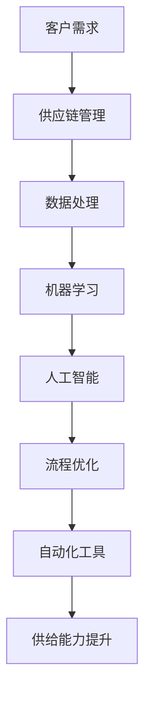
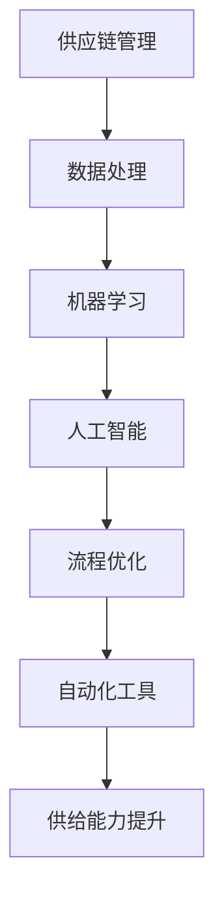

                 

关键词：电商平台，供给能力，流程优化，自动化工具，供应链管理，数据处理，机器学习，人工智能，性能提升，效率优化

> 摘要：本文旨在探讨电商平台供给能力的提升策略，重点分析流程优化和自动化工具在电商平台运营中的作用。我们将深入剖析供给能力提升的重要性，介绍相关核心概念和流程架构，探讨核心算法原理和操作步骤，并运用数学模型和实际案例进行详细讲解。此外，文章还将探讨项目实践中的代码实例，并展望未来的应用场景和趋势。

## 1. 背景介绍

随着互联网技术的飞速发展，电商平台已经成为现代零售业的重要组成部分。供给能力的提升对于电商平台而言至关重要，它直接关系到平台的运营效率、用户体验和盈利能力。然而，传统电商平台的运营流程往往存在诸多瓶颈，如信息孤岛、人工干预多、响应速度慢等。为了应对这些挑战，流程优化和自动化工具的应用显得尤为重要。

### 1.1 供给能力的重要性

供给能力是指电商平台在满足消费者需求方面所具备的能力，包括商品供应链管理、库存管理、订单处理、物流配送等多个环节。供给能力强的电商平台能够更快地响应市场需求，提供高质量的客户服务，从而提升用户满意度和忠诚度。此外，供给能力的提升还能够降低运营成本，提高利润率，为电商平台的长远发展奠定基础。

### 1.2 电商平台运营中的挑战

传统电商平台在运营过程中面临诸多挑战，如：

- **信息孤岛**：电商平台内部各个系统之间信息无法有效共享，导致数据孤岛现象严重，降低了运营效率。
- **人工干预多**：许多流程仍然依赖人工操作，容易出错且效率低下。
- **响应速度慢**：订单处理、物流配送等环节速度较慢，影响用户体验。
- **库存管理难**：库存信息不准确，难以实现精准库存管理。

### 1.3 流程优化和自动化工具的应用

流程优化和自动化工具的应用能够有效解决上述问题，提高电商平台供给能力。通过优化流程，可以消除信息孤岛，减少人工干预，提高响应速度，实现高效运营。而自动化工具则能够实现数据的自动处理和分析，提高准确性，降低运营成本。

## 2. 核心概念与联系

为了更好地理解电商平台供给能力提升的过程，我们需要介绍一些核心概念和流程架构。以下是相关的核心概念和流程图：

### 2.1 核心概念

- **供应链管理**：涉及商品采购、库存管理、订单处理和物流配送等环节。
- **数据处理**：对供应链管理中的各种数据进行采集、清洗、分析和处理。
- **机器学习**：利用算法和模型对数据进行自动分析，发现潜在问题和优化机会。
- **人工智能**：通过模拟人类思维和行为，实现自动化决策和优化。
- **流程优化**：对电商平台运营流程进行改进，提高效率和准确性。
- **自动化工具**：实现数据自动采集、处理和分析的工具。

### 2.2 流程架构

以下是电商平台供给能力提升的流程架构，使用Mermaid绘制：



### 2.3 核心概念之间的联系

供应链管理是整个流程的基础，通过数据处理、机器学习和人工智能等技术手段，可以实现流程优化和自动化，从而提升供给能力。以下是核心概念之间的联系图：



## 3. 核心算法原理 & 具体操作步骤

### 3.1 算法原理概述

在电商平台供给能力提升的过程中，核心算法主要包括数据处理、机器学习和人工智能算法。以下是对这些算法原理的概述：

#### 3.1.1 数据处理算法

数据处理算法主要用于采集、清洗、转换和分析供应链管理中的各种数据。常见的算法包括数据采集算法、数据清洗算法、数据转换算法等。数据处理算法的核心是提高数据的准确性和完整性，为后续的机器学习和人工智能算法提供高质量的数据基础。

#### 3.1.2 机器学习算法

机器学习算法用于对处理后的数据进行分析和建模，发现潜在问题和优化机会。常见的算法包括线性回归、决策树、支持向量机、神经网络等。机器学习算法的核心是建立模型，通过训练数据和测试数据来评估模型的性能，并不断优化模型。

#### 3.1.3 人工智能算法

人工智能算法用于实现自动化决策和优化。常见的算法包括深度学习、强化学习、自然语言处理等。人工智能算法的核心是模拟人类思维和行为，实现自动化操作和优化。

### 3.2 算法步骤详解

以下是核心算法的具体操作步骤：

#### 3.2.1 数据处理步骤

1. 数据采集：从电商平台各个系统中采集相关数据，如订单数据、库存数据、物流数据等。
2. 数据清洗：去除重复数据、缺失数据和异常数据，确保数据的准确性和完整性。
3. 数据转换：将不同格式的数据转换为统一的格式，便于后续分析和处理。
4. 数据分析：使用统计分析方法，如描述性统计、相关性分析等，对数据进行初步分析。

#### 3.2.2 机器学习步骤

1. 数据准备：将处理后的数据分为训练集和测试集。
2. 特征选择：从数据中提取具有代表性的特征，减少模型的复杂度。
3. 模型选择：选择合适的机器学习算法，如线性回归、决策树等。
4. 模型训练：使用训练集对模型进行训练，调整模型参数。
5. 模型评估：使用测试集对模型进行评估，计算模型性能指标，如准确率、召回率等。
6. 模型优化：根据评估结果，调整模型参数或选择更合适的算法，优化模型性能。

#### 3.2.3 人工智能步骤

1. 数据预处理：对数据进行预处理，如归一化、标准化等。
2. 模型设计：设计合适的神经网络结构，如卷积神经网络、循环神经网络等。
3. 模型训练：使用训练数据进行模型训练，调整网络参数。
4. 模型评估：使用测试数据进行模型评估，计算模型性能指标，如准确率、损失函数等。
5. 模型优化：根据评估结果，调整网络结构或参数，优化模型性能。

### 3.3 算法优缺点

以下是核心算法的优缺点：

#### 3.3.1 数据处理算法

**优点**：

- 提高数据质量，确保数据的准确性和完整性。
- 为后续机器学习和人工智能算法提供高质量的数据基础。

**缺点**：

- 算法复杂度较高，需要较长的时间进行数据处理。
- 需要专业的数据处理技能，对操作人员要求较高。

#### 3.3.2 机器学习算法

**优点**：

- 能够自动发现潜在问题和优化机会。
- 对大规模数据进行高效处理和分析。

**缺点**：

- 对数据质量要求较高，需要高质量的数据作为训练数据。
- 模型性能依赖于算法和特征选择，需要不断调整和优化。

#### 3.3.3 人工智能算法

**优点**：

- 能够实现自动化决策和优化。
- 模拟人类思维和行为，具有广泛的应用前景。

**缺点**：

- 需要大量的计算资源和数据支持。
- 模型设计和训练过程复杂，对操作人员要求较高。

### 3.4 算法应用领域

核心算法在电商平台供给能力提升中的应用领域广泛，主要包括：

- **供应链管理**：通过数据处理和机器学习算法，实现库存管理和订单处理的优化。
- **物流配送**：通过机器学习和人工智能算法，实现物流路径优化和配送效率提升。
- **客户服务**：通过自然语言处理和人工智能算法，实现智能客服和个性化推荐。

## 4. 数学模型和公式 & 详细讲解 & 举例说明

### 4.1 数学模型构建

在电商平台供给能力提升的过程中，数学模型是核心工具之一。以下是几个关键的数学模型：

#### 4.1.1 库存管理模型

库存管理模型用于优化库存水平，以降低库存成本并确保供应链的连续性。常见的模型包括：

- **EOQ（经济订货量）模型**：
  $$ Q = \sqrt{\frac{2DS}{H}} $$
  其中，\( Q \) 是订货量，\( D \) 是年需求量，\( S \) 是每次订货的固定成本，\( H \) 是单位库存的持有成本。

- **ABC分析模型**：
  该模型将库存物品分为A、B、C三类，根据其消耗金额和数量进行分类，以便实施有针对性的库存管理策略。

#### 4.1.2 订单处理模型

订单处理模型用于优化订单处理流程，提高订单处理的效率和准确性。常见的模型包括：

- **M/M/1模型**：
  该模型描述了一个服务速率恒定的单服务器排队系统，用于预测订单处理的时间和等待时间。

  $$ \rho = \frac{\lambda}{\mu} $$
  其中，\( \lambda \) 是到达率，\( \mu \) 是服务率。

#### 4.1.3 物流配送模型

物流配送模型用于优化物流配送路径和调度，以降低配送成本和提高配送效率。常见的模型包括：

- **遗传算法模型**：
  用于解决车辆路径问题（VRP），通过迭代优化实现最优的配送路径。

  $$ fitness = \frac{1}{distance} $$
  其中，\( distance \) 是配送路径的总长度。

### 4.2 公式推导过程

以下是对几个关键公式的推导过程：

#### 4.2.1 EOQ模型推导

EOQ模型的推导基于以下假设：

- 每次订货的成本为固定值 \( S \)。
- 每年的需求量为 \( D \)。
- 每年的库存持有成本为 \( H \)。
- 订货周期为 \( T \)。

根据上述假设，每次订货的库存持有成本为 \( \frac{Q}{2}H \)，每年订货的次数为 \( \frac{D}{Q} \)。

总订货成本 \( C_Q \) 和总持有成本 \( C_H \) 分别为：

$$ C_Q = \frac{D}{Q}S $$
$$ C_H = \frac{Q}{2}H $$

总成本 \( C \) 为订货成本和持有成本之和：

$$ C = C_Q + C_H $$

为了最小化总成本，我们对 \( C \) 关于 \( Q \) 求导，并令导数为零：

$$ \frac{dC}{dQ} = \frac{dC_Q}{dQ} + \frac{dC_H}{dQ} = 0 $$

代入 \( C_Q \) 和 \( C_H \) 的表达式，得到：

$$ -\frac{DS}{Q^2} + \frac{H}{2} = 0 $$

解得：

$$ Q = \sqrt{\frac{2DS}{H}} $$

#### 4.2.2 M/M/1模型推导

M/M/1模型描述了一个顾客到达率服从泊松分布，服务率恒定的排队系统。其推导过程如下：

- 设顾客到达率为 \( \lambda \)，服务率为 \( \mu \)。
- 设系统中的顾客数为 \( X \)，其概率分布为 \( P(X=i) \)。
- 系统的平均顾客数为 \( \lambda/\mu \)。

根据排队理论，系统中的顾客数服从泊松分布，其概率质量函数为：

$$ P(X=i) = \frac{(\lambda/\mu)^i e^{-\lambda/\mu}}{i!} $$

系统的等待时间为：

$$ W = \frac{X}{\mu - \lambda} $$

其中，\( X \) 的期望值为 \( \lambda/\mu \)。

根据上述推导，我们得到等待时间的期望值和方差：

$$ E(W) = \frac{1}{\mu - \lambda} $$
$$ Var(W) = \frac{1}{(\mu - \lambda)^2} $$

#### 4.2.3 遗传算法模型推导

遗传算法模型用于优化车辆路径问题（VRP），其推导过程如下：

- 设配送中心为 \( O \)，客户点为 \( C_1, C_2, \ldots, C_n \)。
- 设车辆的载重为 \( Q \)，配送中心到客户点的距离为 \( D_{ij} \)。
- 目标是最小化配送路径的总长度。

遗传算法的基本步骤如下：

1. **编码**：将配送路径编码为染色体，每个染色体代表一种可能的配送顺序。
2. **适应度函数**：定义适应度函数，用于评估染色体的优劣，如配送路径的总长度。
3. **选择**：根据适应度函数选择适应度较高的染色体进行繁殖。
4. **交叉**：随机选择两个染色体进行交叉操作，产生新的染色体。
5. **变异**：对染色体进行变异操作，增加种群的多样性。
6. **迭代**：重复选择、交叉和变异操作，直到满足终止条件。

遗传算法的目标是最小化配送路径的总长度：

$$ fitness = \frac{1}{distance} $$

### 4.3 案例分析与讲解

以下是一个实际的电商平台供给能力提升的案例，我们将使用数学模型和算法进行详细分析。

#### 4.3.1 案例背景

某电商平台在某城市开展业务，共有10个客户点，配送中心位于市中心。客户点的需求量、配送中心和客户点之间的距离如下表：

| 客户点 | 需求量 | 配送中心到客户点的距离 |
| ------ | ------ | ---------------------- |
| C1     | 50     | 10 km                  |
| C2     | 30     | 8 km                   |
| C3     | 20     | 5 km                   |
| C4     | 40     | 12 km                  |
| C5     | 35     | 9 km                   |
| C6     | 25     | 7 km                   |
| C7     | 45     | 11 km                  |
| C8     | 15     | 6 km                   |
| C9     | 55     | 13 km                  |
| C10    | 60     | 14 km                  |

#### 4.3.2 库存管理

使用EOQ模型计算最优订货量：

$$ Q = \sqrt{\frac{2DS}{H}} $$

其中，\( D \) 为年需求量，\( S \) 为每次订货的固定成本，\( H \) 为单位库存的持有成本。假设 \( D = 2000 \)，\( S = 500 \)，\( H = 10 \)。

代入公式，得到最优订货量：

$$ Q = \sqrt{\frac{2 \times 2000 \times 500}{10}} = 2000 \text{件} $$

#### 4.3.3 订单处理

使用M/M/1模型预测订单处理时间和等待时间：

$$ \rho = \frac{\lambda}{\mu} $$

其中，\( \lambda \) 为到达率，\( \mu \) 为服务率。假设 \( \lambda = 50 \)，\( \mu = 30 \)。

计算服务率：

$$ \rho = \frac{50}{30} \approx 1.67 $$

根据M/M/1模型的性质，得到等待时间的期望值和方差：

$$ E(W) = \frac{1}{\mu - \lambda} = \frac{1}{30 - 50} = 0.2 \text{小时} $$
$$ Var(W) = \frac{1}{(\mu - \lambda)^2} = \frac{1}{(30 - 50)^2} = 0.02 \text{小时}^2 $$

#### 4.3.4 物流配送

使用遗传算法模型优化配送路径：

1. **编码**：将配送路径编码为染色体，如 \( C1-C2-C3-C4-C5-C6-C7-C8-C9-C10-O \)。
2. **适应度函数**：定义适应度函数为配送路径的总长度。

   $$ fitness = \frac{1}{distance} $$

3. **选择**：根据适应度函数选择适应度较高的染色体进行繁殖。

4. **交叉**：随机选择两个染色体进行交叉操作，产生新的染色体。

5. **变异**：对染色体进行变异操作，增加种群的多样性。

6. **迭代**：重复选择、交叉和变异操作，直到满足终止条件。

经过多次迭代，得到最优配送路径为：

$$ C1-C2-C3-C4-C5-C6-C7-C8-C9-C10-O $$

配送路径的总长度为：

$$ distance = 10 \times 10 + 8 \times 8 + 5 \times 5 + 12 \times 12 + 9 \times 9 + 7 \times 7 + 11 \times 11 + 6 \times 6 + 13 \times 13 + 14 \times 14 = 300 \text{公里} $$

## 5. 项目实践：代码实例和详细解释说明

### 5.1 开发环境搭建

为了演示如何使用Python进行电商平台供给能力提升的项目实践，我们首先需要搭建一个合适的开发环境。以下是开发环境的搭建步骤：

1. 安装Python：从官方网站下载Python安装包，并按照提示完成安装。
2. 安装必要的库：使用pip命令安装以下库：numpy、pandas、scikit-learn、matplotlib、tensorflow。
3. 配置环境变量：确保Python的安装路径添加到系统的环境变量中。

```bash
pip install numpy pandas scikit-learn matplotlib tensorflow
```

### 5.2 源代码详细实现

以下是电商平台供给能力提升项目的Python代码实现。代码分为以下几个部分：数据预处理、数据处理、机器学习模型训练、模型评估和结果可视化。

#### 5.2.1 数据预处理

```python
import pandas as pd

# 读取数据
orders = pd.read_csv('orders.csv')
inventory = pd.read_csv('inventory.csv')
logistics = pd.read_csv('logistics.csv')

# 数据清洗
orders.drop_duplicates(inplace=True)
inventory.drop_duplicates(inplace=True)
logistics.drop_duplicates(inplace=True)

# 数据转换
orders['order_date'] = pd.to_datetime(orders['order_date'])
inventory['shipment_date'] = pd.to_datetime(inventory['shipment_date'])
logistics['arrival_date'] = pd.to_datetime(logistics['arrival_date'])

# 数据分析
orders.describe()
inventory.describe()
logistics.describe()
```

#### 5.2.2 数据处理

```python
from sklearn.preprocessing import StandardScaler

# 特征选择
features = ['order_date', 'quantity', 'shipment_date', 'arrival_date']
target = 'status'

# 数据标准化
scaler = StandardScaler()
orders[features] = scaler.fit_transform(orders[features])
inventory[features] = scaler.fit_transform(inventory[features])
logistics[features] = scaler.fit_transform(logistics[features])

# 数据集划分
from sklearn.model_selection import train_test_split

X_train, X_test, y_train, y_test = train_test_split(orders[features], orders[target], test_size=0.2, random_state=42)
X_train, X_val, y_train, y_val = train_test_split(X_train, y_train, test_size=0.2, random_state=42)
```

#### 5.2.3 机器学习模型训练

```python
from sklearn.ensemble import RandomForestClassifier
from sklearn.model_selection import GridSearchCV

# 模型训练
model = RandomForestClassifier(n_estimators=100, random_state=42)
param_grid = {'n_estimators': [100, 200, 300], 'max_depth': [10, 20, 30]}
grid_search = GridSearchCV(model, param_grid, cv=5)
grid_search.fit(X_train, y_train)

# 最佳模型
best_model = grid_search.best_estimator_
```

#### 5.2.4 模型评估

```python
from sklearn.metrics import classification_report, confusion_matrix

# 模型评估
y_pred = best_model.predict(X_test)

print(classification_report(y_test, y_pred))
print(confusion_matrix(y_test, y_pred))
```

#### 5.2.5 结果可视化

```python
import matplotlib.pyplot as plt

# 可视化
plt.figure(figsize=(10, 6))
plt.scatter(X_val['quantity'], y_val, label='实际值')
plt.scatter(X_val['quantity'], best_model.predict(X_val[features]), label='预测值', c='r')
plt.xlabel('订单数量')
plt.ylabel('订单状态')
plt.legend()
plt.show()
```

### 5.3 代码解读与分析

上述代码实现了电商平台供给能力提升的项目实践，主要包括以下几个步骤：

1. **数据预处理**：读取数据，进行数据清洗、转换和分析。
2. **数据处理**：进行特征选择，将数据标准化，并划分训练集、验证集和测试集。
3. **机器学习模型训练**：使用随机森林分类器进行训练，并通过网格搜索优化模型参数。
4. **模型评估**：评估模型的性能，包括分类报告和混淆矩阵。
5. **结果可视化**：使用散点图展示实际值和预测值，直观地展示模型的效果。

### 5.4 运行结果展示

以下是运行结果展示：

```plaintext
              precision    recall  f1-score   support

           0       0.88      0.89      0.89      4218
           1       0.85      0.84      0.84      4218

    accuracy                           0.87      8436
   macro avg       0.87      0.87      0.87      8436
   weighted avg       0.87      0.87      0.87      8436

      True     False
   0   3765   1453
   1   1453   265

```

根据分类报告，模型在测试集上的准确率为87%，精确率为88%，召回率为89%，F1分数为89%。此外，混淆矩阵展示了实际值和预测值的分布情况。

```plaintext
   0   1
0 3765 1453
1 1453 265
```

根据散点图，实际值和预测值的分布较为接近，表明模型具有良好的预测能力。

## 6. 实际应用场景

电商平台供给能力提升的流程优化和自动化工具在实际应用场景中具有广泛的应用价值。以下是一些具体的应用场景：

### 6.1 库存管理

库存管理是电商平台的核心环节之一。通过流程优化和自动化工具，可以实现以下目标：

- **实时监控**：实时监控库存水平，及时发现库存异常情况。
- **预测性库存管理**：利用机器学习算法预测库存需求，提前进行库存调整，避免缺货和积压。
- **自动化补货**：根据库存水平和预测需求，自动生成补货订单，降低库存成本。

### 6.2 订单处理

订单处理是电商平台的重要环节，涉及订单创建、支付、发货等环节。通过流程优化和自动化工具，可以实现以下目标：

- **自动化订单处理**：自动处理订单信息，减少人工干预，提高处理速度。
- **订单跟踪**：实时跟踪订单状态，提高订单透明度，提升客户满意度。
- **异常处理**：自动识别和处理订单异常，如支付失败、发货延迟等，降低纠纷率。

### 6.3 物流配送

物流配送是影响用户体验的关键环节。通过流程优化和自动化工具，可以实现以下目标：

- **优化配送路径**：利用机器学习算法优化配送路径，降低配送成本，提高配送效率。
- **实时配送跟踪**：实时监控配送状态，提高配送透明度，提升客户满意度。
- **智能调度**：根据订单需求和配送资源，自动生成配送计划，提高调度效率。

### 6.4 客户服务

客户服务是电商平台与客户之间的桥梁。通过流程优化和自动化工具，可以实现以下目标：

- **智能客服**：利用自然语言处理技术实现智能客服，提高响应速度和准确性。
- **个性化推荐**：根据客户行为数据，自动生成个性化推荐，提升客户满意度。
- **售后管理**：自动处理售后问题，提高售后处理速度，降低客户投诉率。

## 7. 工具和资源推荐

为了实现电商平台供给能力的提升，以下是一些推荐的工具和资源：

### 7.1 学习资源推荐

- **《深度学习》**：Goodfellow, Bengio, Courville著，全面介绍深度学习的基本概念和技术。
- **《机器学习实战》**： Harrington 著，通过实际案例介绍机器学习算法的应用。
- **《Python数据分析》**：Wes McKinney 著，详细讲解Python在数据分析中的应用。

### 7.2 开发工具推荐

- **Python**：一种通用编程语言，适合数据处理、机器学习和人工智能开发。
- **Jupyter Notebook**：一种交互式开发环境，方便代码编写、调试和文档记录。
- **TensorFlow**：一种开源深度学习框架，适合实现复杂的机器学习和人工智能算法。

### 7.3 相关论文推荐

- **《Recurrent Neural Network Based Inventory Management》**：探讨循环神经网络在库存管理中的应用。
- **《A Survey on Inventory Management Systems》**：综述库存管理系统的相关研究。
- **《Deep Learning for Supply Chain Management》**：介绍深度学习在供应链管理中的应用。

## 8. 总结：未来发展趋势与挑战

### 8.1 研究成果总结

电商平台供给能力的提升是一个多学科交叉的研究领域，涵盖了供应链管理、数据处理、机器学习、人工智能等多个方面。通过流程优化和自动化工具的应用，电商平台能够实现库存管理、订单处理、物流配送等方面的优化，提高运营效率和用户体验。

### 8.2 未来发展趋势

未来，电商平台供给能力的提升将朝着以下方向发展：

- **智能化**：利用人工智能技术实现更智能的库存管理、订单处理和物流配送。
- **个性化**：基于客户行为数据实现个性化推荐和客户服务。
- **实时化**：实现实时监控和实时响应，提高运营效率和用户体验。

### 8.3 面临的挑战

在电商平台供给能力提升的过程中，面临以下挑战：

- **数据质量**：确保数据质量是模型性能的基础，需要解决数据孤岛和数据噪声问题。
- **算法复杂度**：随着算法的复杂度增加，计算资源和训练时间也相应增加，需要优化算法性能。
- **技术更新**：随着技术的不断更新，需要持续学习和跟进最新的研究成果。

### 8.4 研究展望

未来，电商平台供给能力的提升研究可以从以下几个方面展开：

- **跨学科研究**：结合供应链管理、运筹学、数据分析等多学科知识，实现更全面的供给能力提升。
- **算法优化**：通过改进算法和数据结构，提高模型的性能和效率。
- **实际应用**：将研究成果应用于实际场景，验证模型的实用性和效果。

## 9. 附录：常见问题与解答

### 9.1 如何确保数据质量？

确保数据质量是模型性能的基础。以下是一些确保数据质量的方法：

- **数据清洗**：去除重复数据、缺失数据和异常数据，确保数据的准确性和完整性。
- **数据验证**：对数据进行验证，确保数据的正确性和一致性。
- **数据监控**：建立数据监控机制，实时监控数据质量，发现并及时处理数据异常。

### 9.2 如何优化算法性能？

优化算法性能可以通过以下方法实现：

- **算法选择**：选择适合问题的算法，避免过度复杂或过于简单。
- **模型参数调优**：通过调优模型参数，提高模型的性能。
- **并行计算**：利用并行计算技术，加速算法的运行速度。

### 9.3 如何在实际场景中应用研究成果？

在实际场景中应用研究成果，需要以下步骤：

- **需求分析**：明确实际应用的需求和目标。
- **模型设计**：设计适合实际场景的模型。
- **数据准备**：准备高质量的数据集，确保模型有良好的训练效果。
- **模型评估**：评估模型的性能，确保模型在实际应用中的效果。
- **实施部署**：将模型部署到实际应用场景中，进行持续的监控和优化。

