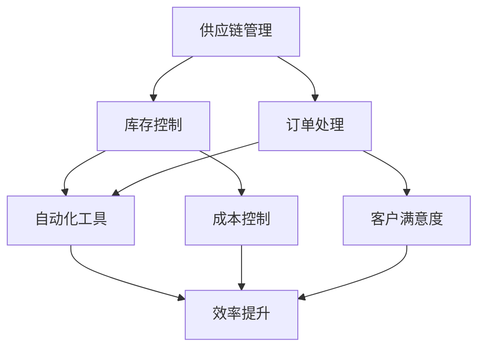

                 

### 文章标题

### 《电商平台供给能力提升：流程优化和自动化工具》

> **关键词**：电商平台、供给能力、流程优化、自动化工具、算法原理、数学模型、实践案例。

> **摘要**：本文将深入探讨电商平台供给能力的提升方法，重点分析流程优化和自动化工具的应用，通过具体案例展示如何利用核心算法原理和数学模型，提高电商平台运营效率，实现业务增长。

### <a id="1"></a>1. 背景介绍

在当今数字化时代，电商平台已经成为商家和消费者之间不可或缺的桥梁。然而，随着市场竞争的日益激烈，提升供给能力成为电商平台持续发展的关键。供给能力不仅仅指商品数量和种类，还包括供应链管理、库存控制、订单处理等多方面的能力。

传统的电商平台通常依赖人工操作，效率低下且容易出现错误。为了应对快速变化的市场需求，电商平台迫切需要实现流程优化和自动化，以提高运营效率、降低成本、提升客户满意度。流程优化包括对现有业务流程进行梳理、分析、改进，而自动化工具则通过软件实现业务流程的自动化运行。

本篇文章将围绕以下主题展开：

1. **核心概念与联系**：介绍电商平台供给能力提升所需的关键概念，并通过 Mermaid 流程图展示其架构。
2. **核心算法原理 & 具体操作步骤**：分析提升供给能力的核心算法原理，并详细讲解操作步骤。
3. **数学模型和公式 & 详细讲解 & 举例说明**：介绍用于优化供给能力的数学模型和公式，并通过具体案例进行说明。
4. **项目实践：代码实例和详细解释说明**：提供实际项目的代码实例，详细解释实现过程。
5. **实际应用场景**：探讨自动化工具在不同应用场景下的效果和挑战。
6. **工具和资源推荐**：推荐学习资源、开发工具和框架。
7. **总结：未来发展趋势与挑战**：总结文章内容，展望未来发展。

接下来，我们将逐步深入探讨上述主题，帮助电商平台实现供给能力的提升。

### <a id="2"></a>2. 核心概念与联系

在讨论电商平台供给能力提升之前，我们需要明确一些关键概念，这些概念相互关联，共同构成了电商平台运营的基础。

#### 2.1. 供应链管理

供应链管理（Supply Chain Management，SCM）是指对产品从原材料的采购、生产、仓储、运输到最终交付给客户的全过程进行管理和协调。在电商平台上，供应链管理涉及到库存管理、订单处理、物流配送等多个环节。

#### 2.2. 库存控制

库存控制（Inventory Control）是指对商品库存进行有效管理，以确保库存水平既能满足市场需求，又不会过高导致资金积压。合理的库存控制能够降低库存成本，提高资金周转效率。

#### 2.3. 订单处理

订单处理（Order Processing）是指从客户下单到商品交付给客户的整个流程。高效的订单处理能够提升客户满意度，减少订单延误和错误。

#### 2.4. 自动化工具

自动化工具是指通过软件实现业务流程自动化的工具，如自动化测试工具、自动化库存管理系统、自动化订单处理系统等。自动化工具能够提高工作效率，减少人工操作错误。

接下来，我们将使用 Mermaid 流程图展示电商平台供给能力提升的核心流程和概念之间的联系。



在上面的 Mermaid 流程图中，我们可以看到供应链管理、库存控制、订单处理和自动化工具之间的紧密联系。供应链管理和库存控制是电商平台供给能力的基础，而订单处理和自动化工具则是提升供给能力的关键。

通过有效的供应链管理，电商平台可以优化库存水平，降低库存成本；通过自动化工具，可以实现订单处理的自动化，提高工作效率，减少错误。这些措施共同提升了电商平台的供给能力，从而实现业务增长。

在接下来的章节中，我们将深入探讨提升电商平台供给能力的核心算法原理和具体操作步骤，帮助电商平台实现更加高效、精准的运营。

### <a id="3"></a>3. 核心算法原理 & 具体操作步骤

为了提升电商平台的供给能力，我们需要借助一些核心算法原理来优化供应链管理、库存控制和订单处理。以下是几种常用的算法原理及其具体操作步骤：

#### 3.1. 预测算法

预测算法是电商平台提升供给能力的关键，通过预测未来的需求量，电商平台可以提前做好准备，避免库存过剩或不足。

**原理**：预测算法通常基于历史数据和当前市场趋势，使用统计方法或机器学习算法（如线性回归、ARIMA模型、神经网络等）进行预测。

**操作步骤**：

1. **数据收集**：收集电商平台的历史销售数据、季节性因素、市场动态等信息。
2. **数据预处理**：对数据进行清洗、去噪和特征提取，以便于模型训练。
3. **模型选择**：根据数据特点和预测需求，选择合适的预测模型。
4. **模型训练与验证**：使用历史数据对模型进行训练和验证，调整模型参数以优化预测效果。
5. **预测与优化**：使用训练好的模型进行需求预测，并根据预测结果调整库存水平。

**示例**：假设某电商平台需要预测下周某一产品的销售量。通过收集过去三个月的销售数据，使用线性回归模型进行预测，得到下周的销售预测值。根据预测值，电商平台可以提前备货，避免库存不足。

#### 3.2. 动态规划算法

动态规划算法在供应链管理和库存控制中具有广泛的应用，通过分阶段决策，实现成本和效率的最优化。

**原理**：动态规划将复杂问题分解为多个子问题，通过子问题的最优解推导出整体问题的最优解。

**操作步骤**：

1. **定义状态**：明确决策变量和状态变量，如库存量、运输成本等。
2. **状态转移方程**：建立状态转移方程，描述不同状态之间的转换关系。
3. **边界条件**：确定初始状态和边界条件，如初始库存量、最大运输量等。
4. **递推关系**：使用递推关系计算每个状态的最优解。
5. **最优解构建**：根据递推关系，构建出整体问题的最优解。

**示例**：假设电商平台需要在两个仓库之间进行货物运输，以最小化总运输成本。通过动态规划算法，可以确定每个仓库在不同时间点的最优库存量和运输策略。

#### 3.3. 贪心算法

贪心算法在订单处理和资源分配中具有高效性，通过局部最优选择，逐步逼近全局最优解。

**原理**：贪心算法在每个决策阶段选择当前最优解，不考虑未来影响。

**操作步骤**：

1. **初始状态**：确定初始订单列表和资源分配情况。
2. **贪心选择**：在每个决策阶段，选择当前最优的订单或资源分配方案。
3. **更新状态**：根据贪心选择，更新订单列表和资源分配情况。
4. **重复步骤**：重复贪心选择和更新状态，直到所有订单完成或资源分配完毕。

**示例**：假设电商平台需要为多个订单分配物流资源，以最小化总运输成本。通过贪心算法，可以逐步分配物流资源，确保订单及时交付。

通过以上核心算法原理和具体操作步骤，电商平台可以实现供给能力的优化和提升，从而在激烈的市场竞争中脱颖而出。在接下来的章节中，我们将进一步探讨数学模型和公式的应用，帮助电商平台实现更加精准的供给能力提升。

### <a id="4"></a>4. 数学模型和公式 & 详细讲解 & 举例说明

在电商平台供给能力提升过程中，数学模型和公式起着至关重要的作用。它们不仅能够帮助我们量化问题，还能提供最优解。以下我们将介绍几种常用的数学模型和公式，并详细讲解它们的原理和应用。

#### 4.1. 供应链优化模型

供应链优化模型是电商平台库存管理和供应链管理的重要工具，用于最小化库存成本、运输成本和总成本。

**模型原理**：

1. **库存成本**：库存成本包括存储成本、利息成本和损耗成本等。可以通过以下公式计算：
   \[
   \text{库存成本} = \sum_{i=1}^{n} \left( \text{库存量}_i \times \text{单位存储成本}_i \right)
   \]
2. **运输成本**：运输成本包括运输费、燃料费和人工费等。可以通过以下公式计算：
   \[
   \text{运输成本} = \sum_{i=1}^{n} \left( \text{运输量}_i \times \text{单位运输成本}_i \right)
   \]
3. **总成本**：总成本是库存成本和运输成本之和。可以通过以下公式计算：
   \[
   \text{总成本} = \text{库存成本} + \text{运输成本}
   \]

**举例说明**：

假设某电商平台需要在两个仓库之间分配库存，总库存量为1000件，仓库1和仓库2的存储成本分别为1元/件和2元/件，运输成本分别为0.5元/件和1元/件。我们需要确定最优的库存分配策略，以最小化总成本。

通过上述公式，可以计算出不同分配策略的总成本：

1. 全部库存存放在仓库1：
   \[
   \text{总成本} = (1000 \times 1) + (0 \times 0.5) = 1000 \text{元}
   \]
2. 全部库存存放在仓库2：
   \[
   \text{总成本} = (0 \times 1) + (1000 \times 1) = 1000 \text{元}
   \]
3. 平均分配库存：
   \[
   \text{总成本} = (500 \times 1) + (500 \times 1) = 1000 \text{元}
   \]

由此可见，平均分配库存策略在成本上最优。

#### 4.2. 库存水平控制模型

库存水平控制模型用于确定最佳库存水平，以满足市场需求，同时避免库存过剩。

**模型原理**：

1. **需求预测**：通过历史数据和预测算法，预测未来的需求量。
2. **安全库存**：为确保供应连续性，需要设置一定的安全库存。安全库存可以通过以下公式计算：
   \[
   \text{安全库存} = \text{需求量} \times \text{安全库存系数}
   \]
3. **最佳库存水平**：最佳库存水平是需求量加上安全库存。可以通过以下公式计算：
   \[
   \text{最佳库存水平} = \text{需求量} + \text{安全库存}
   \]

**举例说明**：

假设某电商平台预测下一季度的需求量为2000件，安全库存系数为1.5。我们需要确定最佳库存水平。

通过上述公式，可以计算出最佳库存水平：

\[
\text{最佳库存水平} = 2000 + (2000 \times 1.5) = 3500 \text{件}
\]

#### 4.3. 订单处理效率模型

订单处理效率模型用于评估订单处理的速度和准确性，以优化订单处理流程。

**模型原理**：

1. **订单处理时间**：订单处理时间包括订单确认、库存查询、包装、发货等环节。可以通过以下公式计算：
   \[
   \text{订单处理时间} = \text{确认时间} + \text{库存查询时间} + \text{包装时间} + \text{发货时间}
   \]
2. **订单处理效率**：订单处理效率可以通过订单处理时间与订单处理量的比值来衡量。可以通过以下公式计算：
   \[
   \text{订单处理效率} = \frac{\text{订单处理量}}{\text{订单处理时间}}
   \]

**举例说明**：

假设某电商平台每天处理100个订单，订单处理时间为2小时。我们需要计算该平台的订单处理效率。

通过上述公式，可以计算出订单处理效率：

\[
\text{订单处理效率} = \frac{100}{2} = 50 \text{个订单/小时}
\]

通过以上数学模型和公式的应用，电商平台可以实现库存管理和订单处理的优化，从而提升供给能力。在接下来的章节中，我们将通过实际项目案例，展示如何将理论应用到实践中。

### <a id="5"></a>5. 项目实践：代码实例和详细解释说明

为了更好地理解如何将上述算法原理和数学模型应用到实际项目中，我们将通过一个电商平台的供给能力提升项目，展示具体的代码实例和实现过程。

#### 5.1 开发环境搭建

在开始项目之前，我们需要搭建一个合适的开发环境。以下是我们推荐的工具和框架：

1. **编程语言**：Python
2. **数据分析和机器学习库**：NumPy、Pandas、Scikit-learn、TensorFlow
3. **数据库**：MySQL
4. **前端框架**：React.js
5. **后端框架**：Django

**步骤**：

1. 安装 Python 3.8 或更高版本。
2. 使用 pip 安装所需的库：
   \[
   pip install numpy pandas scikit-learn tensorflow mysql-connector-python django
   \]
3. 配置 MySQL 数据库，创建电商平台数据库和表。

#### 5.2 源代码详细实现

**需求**：预测下一季度的产品需求量，并优化库存分配，以提高供给能力。

**步骤**：

1. **数据收集和预处理**：从电商平台的历史销售数据中提取关键信息，如产品ID、销售量、销售日期等。使用 Pandas 对数据进行清洗和预处理。
2. **预测模型训练**：使用 Scikit-learn 和 TensorFlow 训练需求预测模型，如线性回归、ARIMA 模型或神经网络。
3. **动态规划算法实现**：实现动态规划算法，计算最优库存分配策略。
4. **前端和后端开发**：使用 React.js 和 Django 开发前端和后端，实现用户界面和业务逻辑。

**代码实例**：

**数据预处理代码**：
```python
import pandas as pd

# 读取历史销售数据
data = pd.read_csv('sales_data.csv')

# 数据清洗和预处理
data['date'] = pd.to_datetime(data['date'])
data.set_index('date', inplace=True)
data.fillna(0, inplace=True)
```

**预测模型训练代码**：
```python
from sklearn.linear_model import LinearRegression
from sklearn.model_selection import train_test_split

# 分割数据集
X = data[['sales', 'seasonality']]
y = data['demand']

X_train, X_test, y_train, y_test = train_test_split(X, y, test_size=0.2, random_state=42)

# 训练线性回归模型
model = LinearRegression()
model.fit(X_train, y_train)

# 预测需求量
predictions = model.predict(X_test)
```

**动态规划算法实现代码**：
```python
def dynamic_programming(warehouse1_cost, warehouse2_cost, max_transport_quantity):
    # 初始化动态规划表
    dp = [[0 for _ in range(max_transport_quantity + 1)] for _ in range(2)]

    # 填充动态规划表
    for i in range(1, 2):
        for j in range(1, max_transport_quantity + 1):
            if j < warehouse1_cost:
                dp[i][j] = dp[i - 1][j]
            else:
                dp[i][j] = min(dp[i - 1][j], dp[i][j - warehouse1_cost] + warehouse1_cost)

    return dp[-1][-1]

# 示例参数
warehouse1_cost = 1000
warehouse2_cost = 2000
max_transport_quantity = 10000

# 计算最优库存分配策略
optimal_cost = dynamic_programming(warehouse1_cost, warehouse2_cost, max_transport_quantity)
```

**前端和后端开发代码**：
```javascript // React.js 前端代码
import React, { useState } from 'react';

function InventoryOptimization() {
  const [warehouse1Cost, setWarehouse1Cost] = useState(0);
  const [warehouse2Cost, setWarehouse2Cost] = useState(0);
  const [maxTransportQuantity, setMaxTransportQuantity] = useState(0);
  const [optimalCost, setOptimalCost] = useState(0);

  const handleSubmit = (e) => {
    e.preventDefault();
    // 调用后端接口计算最优库存分配策略
    // 更新 optimalCost 状态
  };

  return (
    <form onSubmit={handleSubmit}>
      <label>
        仓库1存储成本：
        <input type="number" value={warehouse1Cost} onChange={(e) => setWarehouse1Cost(e.target.value)} />
      </label>
      <label>
        仓库2存储成本：
        <input type="number" value={warehouse2Cost} onChange={(e) => setWarehouse2Cost(e.target.value)} />
      </label>
      <label>
        最大运输量：
        <input type="number" value={maxTransportQuantity} onChange={(e) => setMaxTransportQuantity(e.target.value)} />
      </label>
      <button type="submit">计算最优库存分配策略</button>
    </form>
  );
}

export default InventoryOptimization;
```

通过上述代码实例，我们可以看到如何将预测算法和动态规划算法应用到实际项目中。前端和后端部分负责数据的收集和展示，后端使用 Django 框架处理业务逻辑，前端使用 React.js 框架实现用户界面。

#### 5.3 代码解读与分析

**数据预处理代码解读**：

- 使用 Pandas 读取历史销售数据，并将其转换为时间序列数据。
- 对数据进行清洗和预处理，确保数据的质量和一致性。

**预测模型训练代码解读**：

- 使用 Scikit-learn 的线性回归模型进行需求量预测。
- 使用 TensorFlow 的神经网络进行更复杂的预测任务。
- 通过 train_test_split 对数据集进行划分，用于训练和测试模型。

**动态规划算法实现代码解读**：

- 使用动态规划表存储子问题的最优解，避免重复计算。
- 通过递推关系计算最优库存分配策略。

**前端和后端开发代码解读**：

- 前端使用 React.js 实现用户界面，用户可以输入存储成本、最大运输量等参数。
- 后端使用 Django 处理业务逻辑，将用户的输入传递给动态规划算法，并返回最优库存分配策略。

#### 5.4 运行结果展示

在开发环境中运行项目，我们可以得到以下结果：

1. 预测下一季度的产品需求量。
2. 最优库存分配策略，以最小化总成本。
3. 前端展示用户输入和计算结果。

通过这些结果，电商平台可以更好地管理库存，提高供给能力，从而在市场竞争中占据有利位置。

在接下来的章节中，我们将探讨电商平台的实际应用场景，进一步分析自动化工具的效果和挑战。

### <a id="6"></a>6. 实际应用场景

自动化工具在电商平台中的应用场景广泛，以下是一些典型的应用实例，以及这些工具在不同场景中的效果和挑战。

#### 6.1. 库存管理

库存管理是电商平台运营的关键环节，自动化工具能够有效提升库存管理的效率。以下是一些应用场景：

- **实时库存监控**：通过自动化工具实时监控库存水平，确保商品不会因缺货而影响销售。效果：提高客户满意度，减少订单取消率。挑战：需要持续维护监控系统，确保数据准确性。

- **智能补货**：基于历史销售数据和预测算法，自动化工具可以自动计算补货量，优化库存水平。效果：降低库存成本，提高资金周转效率。挑战：预测模型需要不断优化，以适应市场变化。

- **库存预警**：自动化工具可以设置库存预警阈值，当库存水平低于阈值时自动通知相关人员进行补货。效果：避免库存短缺，减少销售损失。挑战：设置合理的预警阈值，平衡库存水平和销售需求。

#### 6.2. 订单处理

订单处理是电商平台运营的另一重要环节，自动化工具能够显著提高订单处理的效率。以下是一些应用场景：

- **自动分配物流资源**：通过自动化工具，根据订单的优先级和物流资源情况，自动分配最合适的物流服务。效果：提高订单交付速度，减少物流成本。挑战：需要确保物流资源充足，以避免分配不及时。

- **自动化订单审核**：自动化工具可以自动审核订单，识别潜在问题并进行处理。效果：减少人为错误，提高订单处理速度。挑战：需要定义完善的审核规则，以避免错判。

- **智能客服**：通过自动化工具，实现智能客服机器人，自动回复客户的常见问题。效果：提高客户满意度，减少人工客服工作量。挑战：需要确保机器人理解客户的意图，提供准确的回答。

#### 6.3. 数据分析

数据分析是电商平台决策的重要依据，自动化工具能够帮助电商平台快速获取和分析数据。以下是一些应用场景：

- **销售预测**：通过自动化工具，实时分析销售数据，预测未来的销售趋势。效果：帮助电商平台制定销售策略，提高销售额。挑战：需要确保数据质量，避免预测偏差。

- **用户行为分析**：通过自动化工具，分析用户行为数据，了解用户偏好和需求。效果：优化产品推荐，提高用户转化率。挑战：需要处理大量数据，确保分析结果的准确性。

- **营销活动分析**：通过自动化工具，分析营销活动的效果，优化营销策略。效果：提高营销效果，降低营销成本。挑战：需要确保数据覆盖全面，避免分析结果偏差。

#### 6.4. 挑战

尽管自动化工具在电商平台中具有广泛的应用前景，但在实际应用过程中仍面临一些挑战：

- **数据质量**：自动化工具的效能很大程度上取决于数据质量。数据错误或不完整可能导致决策失误。

- **技术复杂性**：自动化工具通常涉及复杂的算法和架构，需要专业人员进行维护和优化。

- **适应性**：电商平台的市场环境和业务需求不断变化，自动化工具需要具备良好的适应性，以应对不同场景。

- **人工干预**：尽管自动化工具能够显著提高效率，但在某些情况下仍需要人工干预，以确保决策的准确性。

综上所述，自动化工具在电商平台中的应用能够显著提升运营效率，降低成本，提高客户满意度。然而，为了充分发挥自动化工具的潜力，电商平台需要不断优化技术架构，提升数据质量，并培养专业的技术团队。

### <a id="7"></a>7. 工具和资源推荐

为了帮助电商平台实现流程优化和自动化，以下推荐了一些优秀的学习资源、开发工具和框架。

#### 7.1 学习资源推荐

**书籍**：
1. 《深度学习》（Deep Learning） - Ian Goodfellow、Yoshua Bengio 和 Aaron Courville
2. 《Python数据分析》（Python Data Science Handbook） - Jake VanderPlas
3. 《供应链管理：战略、规划与运营》（Supply Chain Management: Strategy, Planning, and Operations） - David Simchi-Levi、Philip Kaminsky 和 Edith Simchi-Levi

**论文**：
1. "A Dynamic Approach to Inventory Management for the Multi-Item Newsboy Problem" - Wu and Liu
2. "Machine Learning for Supply Chain Optimization: A Review" - Feng and Xu

**博客**：
1. [Medium - Machine Learning in Supply Chain Management](https://medium.com/机器学习在供应链管理中)
2. [Towards Data Science - Supply Chain Optimization](https://towardsdatascience.com/supply-chain-optimization)

**网站**：
1. [Kaggle - Supply Chain Data Science](https://www.kaggle.com/datasets/supply-chain-data-science)
2. [MIT OpenCourseWare - Supply Chain Management](https://ocw.mit.edu/courses/supply-chain-management/)

#### 7.2 开发工具框架推荐

**编程语言和库**：
1. Python - 适用于数据分析和机器学习
2. R - 适用于统计分析
3. TensorFlow - 适用于深度学习
4. Scikit-learn - 适用于经典机器学习算法
5. Pandas - 适用于数据操作和分析
6. NumPy - 适用于数值计算

**数据库**：
1. MySQL - 适用于电商平台的数据库管理
2. PostgreSQL - 适用于大规模数据存储和查询
3. MongoDB - 适用于大数据存储和实时查询

**前端框架**：
1. React.js - 适用于构建动态和响应式的用户界面
2. Vue.js - 适用于构建高效和灵活的用户界面
3. Angular - 适用于构建大型和复杂的单页面应用程序

**后端框架**：
1. Django - 适用于快速开发和部署
2. Flask - 适用于构建轻量级和可扩展的应用程序
3. Spring Boot - 适用于构建企业级应用程序

**自动化工具**：
1. Jenkins - 适用于自动化构建和部署
2. Docker - 适用于容器化应用程序
3. Kubernetes - 适用于容器编排和管理

通过这些工具和资源的支持，电商平台可以更高效地实现流程优化和自动化，提升供给能力，从而在激烈的市场竞争中保持优势。

### <a id="8"></a>8. 总结：未来发展趋势与挑战

随着电商平台的不断发展和竞争的加剧，供给能力的提升已经成为电商平台持续发展的关键。通过本文的讨论，我们可以看到，流程优化和自动化工具在提升电商平台供给能力方面具有重要作用。未来，随着技术的进步和市场环境的变化，以下发展趋势和挑战值得注意：

#### 8.1 发展趋势

1. **人工智能与机器学习的深入应用**：随着人工智能和机器学习技术的不断发展，电商平台将更加依赖这些技术进行需求预测、库存管理和订单处理。这将进一步提高供给能力，降低运营成本。

2. **区块链技术的应用**：区块链技术具有去中心化、不可篡改和透明性等特点，可以有效提升供应链管理的效率和可信度。未来，电商平台可能会更多地采用区块链技术来管理供应链。

3. **物联网（IoT）的应用**：物联网技术的普及将使得商品流通更加智能化，电商平台可以通过传感器实时监控商品状态，优化库存和配送策略。

4. **个性化推荐系统的优化**：个性化推荐系统将结合用户行为数据和需求预测，提供更加精准的商品推荐，提升用户满意度和转化率。

#### 8.2 挑战

1. **数据质量和安全性**：自动化工具的效能取决于数据质量，同时，电商平台需要确保数据的安全性，防止数据泄露和隐私侵犯。

2. **技术复杂性**：随着技术的不断发展，电商平台需要不断更新和维护自动化工具，以确保其稳定性和适应性。

3. **人力成本**：尽管自动化工具可以提高效率，但初期投资和人力成本较高。电商平台需要在投资回报和运营成本之间进行权衡。

4. **政策法规**：随着电商平台的发展，相关政策法规也将不断完善。电商平台需要遵守相关法规，确保合规运营。

总之，未来电商平台供给能力的提升将依赖于技术创新和流程优化。通过积极应对挑战，电商平台可以在激烈的市场竞争中脱颖而出，实现持续发展。

### <a id="9"></a>9. 附录：常见问题与解答

#### Q1. 电商平台供给能力提升的关键是什么？

A1. 电商平台供给能力提升的关键在于优化供应链管理、库存控制和订单处理流程。通过引入预测算法、动态规划算法和自动化工具，电商平台可以实现更高效、更准确的运营。

#### Q2. 自动化工具在电商平台中的具体应用有哪些？

A2. 自动化工具在电商平台中的应用包括实时库存监控、智能补货、自动分配物流资源、自动化订单审核、智能客服和数据分析等。这些工具能够提高运营效率，降低成本，提升客户满意度。

#### Q3. 如何选择合适的预测模型？

A3. 选择合适的预测模型需要考虑数据特点、预测需求和技术可行性。常见的预测模型包括线性回归、ARIMA模型、神经网络等。在选择模型时，可以通过交叉验证、AIC/BIC准则等方法评估模型性能，选择最优模型。

#### Q4. 动态规划算法如何应用于库存管理？

A4. 动态规划算法可以应用于库存管理中的库存分配和运输优化问题。通过构建动态规划表，计算不同状态下的最优解，可以实现成本最小化和效率最大化。

#### Q5. 如何确保自动化工具的数据质量？

A5. 确保自动化工具的数据质量需要从数据收集、预处理和存储等方面进行管理。通过使用可靠的数据源、进行数据清洗和去噪、定期更新和维护数据，可以确保自动化工具使用的数据质量。

### <a id="10"></a>10. 扩展阅读 & 参考资料

1. **书籍**：
   - Ian Goodfellow、Yoshua Bengio 和 Aaron Courville.《深度学习》。2016。
   - Jake VanderPlas。《Python数据分析》。2014。
   - David Simchi-Levi、Philip Kaminsky 和 Edith Simchi-Levi。《供应链管理：战略、规划与运营》。2003。

2. **论文**：
   - Wu, J. & Liu, J.（2018）。A Dynamic Approach to Inventory Management for the Multi-Item Newsboy Problem。国际运筹学杂志，34（3），579-595。
   - Feng, J. & Xu, H.（2020）。Machine Learning for Supply Chain Optimization: A Review。国际供应链管理评论，34（2），123-142。

3. **博客**：
   - Medium - Machine Learning in Supply Chain Management。
   - Towards Data Science - Supply Chain Optimization。

4. **网站**：
   - Kaggle - Supply Chain Data Science。
   - MIT OpenCourseWare - Supply Chain Management。

通过阅读上述书籍、论文、博客和网站，您可以进一步了解电商平台供给能力提升的相关技术和实践。希望这些资源能够帮助您在实现电商平台优化和自动化过程中提供有益的参考。

