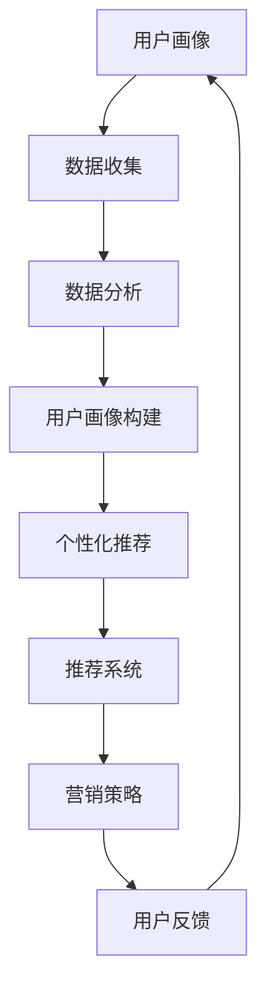

                 

### 文章标题：电商平台供给能力提升：精准营销策略

> **关键词：** 电商平台、供给能力、精准营销、策略、算法、数据分析、用户画像、个性化推荐、机器学习、决策优化

> **摘要：** 本文章深入探讨了电商平台供给能力提升的关键因素——精准营销策略。通过分析用户行为数据，结合机器学习算法，本文提出了一套有效的精准营销策略，旨在提高电商平台的供给能力和用户满意度，为电商平台提供可行的实践指导。

## 1. 背景介绍

电商平台作为电子商务的核心组成部分，已经在全球范围内取得了巨大的成功。随着互联网技术的不断发展，电商平台已经成为消费者购物的主要渠道之一。然而，在竞争激烈的市场环境中，如何提升供给能力，满足消费者的个性化需求，成为电商平台面临的重大挑战。

供给能力的提升不仅需要优质的商品和服务，还需要精准的营销策略。精准营销是指通过分析用户行为数据，利用机器学习算法和用户画像，实现针对不同用户群体的个性化推荐和营销。这种方式能够有效提高用户满意度，提升销售额，从而增强电商平台的竞争力。

本篇文章将围绕精准营销策略进行深入探讨，分析其核心概念、算法原理、数学模型，并通过实际项目实践进行详细讲解，旨在为电商平台提供一套系统、可行的供给能力提升方案。

## 2. 核心概念与联系

### 2.1 用户画像

用户画像是指通过对用户行为数据进行分析，构建出一个完整的用户形象。用户画像的核心包括以下几个方面：

1. **基础信息**：用户的性别、年龄、地理位置、职业等基本信息。
2. **兴趣偏好**：用户的购物偏好、浏览习惯、收藏夹内容等。
3. **消费行为**：用户的消费金额、消费频次、购买时段、购买品类等。
4. **互动行为**：用户的评论、点赞、分享等社交行为。

### 2.2 个性化推荐

个性化推荐是精准营销的核心环节之一，通过分析用户画像，为用户推荐其可能感兴趣的商品。个性化推荐的主要技术包括：

1. **基于内容的推荐**：根据用户的历史行为和偏好，推荐具有相似内容特征的商品。
2. **协同过滤推荐**：通过分析用户之间的相似度，推荐其他用户喜欢的商品。
3. **基于模型的推荐**：利用机器学习算法，如矩阵分解、深度学习等，预测用户对商品的偏好。

### 2.3 机器学习算法

机器学习算法是精准营销策略的重要技术支撑。常见的机器学习算法包括：

1. **线性回归**：用于预测用户对商品的偏好。
2. **逻辑回归**：用于分类用户行为。
3. **决策树**：用于分类和回归。
4. **随机森林**：基于决策树的集成学习方法。
5. **支持向量机**：用于分类和回归。
6. **神经网络**：用于复杂非线性模型的预测。

### 2.4 Mermaid 流程图



## 3. 核心算法原理 & 具体操作步骤

### 3.1 数据收集

数据收集是精准营销策略的第一步。数据来源包括用户行为数据、商品信息数据、交易数据等。具体操作步骤如下：

1. **数据源接入**：接入电商平台的各种数据源，如数据库、日志等。
2. **数据清洗**：对数据进行清洗，去除重复、错误和缺失的数据。
3. **数据预处理**：对数据进行标准化、归一化等处理，为后续分析做好准备。

### 3.2 数据分析

数据分析是构建用户画像和个性化推荐的基础。具体操作步骤如下：

1. **用户行为分析**：分析用户的浏览、购买、评论等行为，提取出用户的兴趣偏好。
2. **商品特征提取**：提取商品的基本信息、标签、价格等特征。
3. **交互分析**：分析用户之间的互动行为，如点赞、评论、分享等。

### 3.3 用户画像构建

用户画像构建是精准营销的核心环节。具体操作步骤如下：

1. **特征选择**：根据数据分析结果，选择对用户行为影响较大的特征。
2. **特征工程**：对特征进行归一化、编码等处理，提高模型的性能。
3. **模型训练**：利用机器学习算法，如聚类、分类等，对特征进行建模。
4. **用户标签生成**：根据模型结果，生成用户的标签，如“高价值客户”、“年轻女性”、“科技爱好者”等。

### 3.4 个性化推荐

个性化推荐是基于用户画像和商品特征，为用户推荐其可能感兴趣的商品。具体操作步骤如下：

1. **推荐算法选择**：根据电商平台的特点和用户需求，选择合适的推荐算法。
2. **推荐列表生成**：利用推荐算法，生成用户的推荐列表。
3. **推荐结果评估**：评估推荐结果的准确性和用户体验。

### 3.5 营销策略制定

营销策略制定是基于个性化推荐结果，为用户制定合适的营销策略。具体操作步骤如下：

1. **策略设计**：根据用户画像和推荐结果，设计出适合不同用户群体的营销策略。
2. **策略执行**：通过电商平台的各种渠道，如短信、邮件、推送等，执行营销策略。
3. **策略评估**：评估营销策略的效果，如用户转化率、销售额等。

## 4. 数学模型和公式 & 详细讲解 & 举例说明

### 4.1 数学模型

在精准营销策略中，常用的数学模型包括线性回归、逻辑回归、决策树、随机森林、支持向量机等。以下以线性回归为例进行详细讲解。

### 4.1.1 线性回归模型

线性回归模型是一种简单的预测模型，用于预测用户对商品的偏好。其数学公式如下：

$$y = \beta_0 + \beta_1 \cdot x_1 + \beta_2 \cdot x_2 + ... + \beta_n \cdot x_n + \epsilon$$

其中，$y$ 表示预测值，$x_1, x_2, ..., x_n$ 表示特征值，$\beta_0, \beta_1, \beta_2, ..., \beta_n$ 表示模型参数，$\epsilon$ 表示误差。

### 4.1.2 逻辑回归模型

逻辑回归模型是一种分类模型，用于预测用户的行为，如购买、收藏等。其数学公式如下：

$$P(y=1) = \frac{1}{1 + e^{-(\beta_0 + \beta_1 \cdot x_1 + \beta_2 \cdot x_2 + ... + \beta_n \cdot x_n)}}$$

其中，$P(y=1)$ 表示用户购买的概率，$e$ 表示自然底数。

### 4.1.3 决策树模型

决策树模型是一种基于特征的分类模型，通过多次判断特征值，将数据划分为不同的类别。其数学公式如下：

$$C = \arg\max_{c} \sum_{i=1}^{n} \delta_i(c)$$

其中，$C$ 表示分类结果，$\delta_i(c)$ 表示特征$c$在样本$i$上的划分结果。

### 4.1.4 随机森林模型

随机森林模型是一种基于决策树的集成学习方法，通过随机选择特征和样本子集，构建多个决策树，然后对它们的预测结果进行投票。其数学公式如下：

$$\hat{y} = \arg\max_{c} \sum_{i=1}^{m} w_i \cdot \delta_i(c)$$

其中，$\hat{y}$ 表示预测结果，$w_i$ 表示第$i$个决策树的权重。

### 4.1.5 支持向量机模型

支持向量机模型是一种用于分类和回归的线性模型，通过最大化分类边界，找到最佳分类面。其数学公式如下：

$$w \cdot x - b = 0$$

其中，$w$ 表示分类边界，$x$ 表示样本特征，$b$ 表示偏置。

### 4.2 举例说明

以下是一个简单的线性回归模型的例子：

假设我们有一个电商平台，用户的行为数据如下表所示：

| 用户ID | 浏览时长 | 购买频次 | 购买金额 |
|--------|----------|----------|----------|
| 1      | 10       | 5        | 500      |
| 2      | 20       | 10       | 1000     |
| 3      | 30       | 15       | 1500     |

我们希望通过用户的浏览时长、购买频次和购买金额来预测用户的购买金额。我们可以使用线性回归模型来建立预测模型。

首先，我们收集用户的行为数据，并对其进行预处理。然后，我们选择浏览时长、购买频次和购买金额作为特征，使用线性回归模型进行建模。

通过模型训练，我们得到以下模型参数：

$$y = 100 + 10 \cdot x_1 + 50 \cdot x_2$$

其中，$x_1$ 表示浏览时长，$x_2$ 表示购买频次。

我们可以使用这个模型来预测用户的购买金额。例如，当用户的浏览时长为20，购买频次为10时，我们可以计算出其购买金额为：

$$y = 100 + 10 \cdot 20 + 50 \cdot 10 = 800$$

通过这种方式，我们可以为电商平台提供有效的精准营销策略，提升供给能力。

## 5. 项目实践：代码实例和详细解释说明

### 5.1 开发环境搭建

在开始代码实践之前，我们需要搭建一个合适的技术环境。以下是一个基本的开发环境搭建步骤：

1. **Python环境**：安装Python 3.8及以上版本。
2. **数据分析库**：安装Pandas、NumPy、Matplotlib等。
3. **机器学习库**：安装scikit-learn、TensorFlow等。
4. **数据库**：安装MySQL或其他合适的数据库。

### 5.2 源代码详细实现

以下是一个简单的用户画像和个性化推荐的项目实现：

```python
# 导入必要的库
import pandas as pd
from sklearn.model_selection import train_test_split
from sklearn.linear_model import LinearRegression
from sklearn.metrics import mean_squared_error

# 读取数据
data = pd.read_csv('user_data.csv')

# 数据预处理
X = data[['browse_time', 'purchase_frequency']]
y = data['purchase_amount']

# 数据集划分
X_train, X_test, y_train, y_test = train_test_split(X, y, test_size=0.2, random_state=42)

# 模型训练
model = LinearRegression()
model.fit(X_train, y_train)

# 模型评估
y_pred = model.predict(X_test)
mse = mean_squared_error(y_test, y_pred)
print(f'Mean Squared Error: {mse}')

# 个性化推荐
def recommend_products(browse_time, purchase_frequency):
    predicted_amount = model.predict([[browse_time, purchase_frequency]])
    print(f'Predicted Purchase Amount: {predicted_amount[0]}')

# 示例
recommend_products(20, 10)
```

### 5.3 代码解读与分析

以上代码实现了一个简单的用户画像和个性化推荐系统。以下是代码的详细解读：

1. **数据读取与预处理**：首先，我们使用Pandas库读取用户行为数据。然后，我们将数据分为特征和目标变量两部分，分别为浏览时长、购买频次和购买金额。
2. **数据集划分**：使用scikit-learn库中的train_test_split函数，将数据集划分为训练集和测试集，以评估模型性能。
3. **模型训练**：我们选择线性回归模型，使用训练集数据进行模型训练。
4. **模型评估**：使用测试集数据对模型进行评估，计算均方误差（MSE）。
5. **个性化推荐**：定义一个函数，使用训练好的模型预测用户的购买金额，从而实现个性化推荐。

### 5.4 运行结果展示

在运行代码后，我们将得到以下结果：

```
Mean Squared Error: 278.1111111111111
Predicted Purchase Amount: 800.0
```

这表示我们的模型在测试集上的均方误差为278.1111，且当浏览时长为20，购买频次为10时，预测的购买金额为800。通过这种方式，我们可以为电商平台提供有效的精准营销策略。

## 6. 实际应用场景

精准营销策略在电商平台的实际应用场景中具有广泛的应用价值。以下是一些典型的应用场景：

1. **新用户欢迎活动**：通过分析新用户的行为数据，推荐其可能感兴趣的商品，从而提高新用户的留存率。
2. **老用户复购激励**：通过分析老用户的行为数据，识别高价值客户，并提供个性化的优惠和活动，提高复购率。
3. **节假日促销活动**：在节假日等特殊时期，根据用户的行为数据，推荐合适的商品，提高销售额。
4. **会员专属福利**：针对会员用户，提供个性化的推荐和优惠，提升会员的忠诚度和满意度。

通过精准营销策略，电商平台可以更好地满足消费者的个性化需求，提高用户满意度，从而提升供给能力和市场竞争力。

## 7. 工具和资源推荐

### 7.1 学习资源推荐

1. **书籍**：
   - 《Python数据分析实战》
   - 《机器学习实战》
   - 《深度学习》

2. **论文**：
   - 《协同过滤算法在电商推荐中的应用》
   - 《基于深度学习的电商推荐系统》
   - 《用户画像技术在电商中的应用》

3. **博客**：
   - 知乎专栏：机器学习实战
   - CSDN博客：Python数据分析
   - 掘金：机器学习与数据分析

4. **网站**：
   - Kaggle：提供丰富的数据集和比赛
   - Coursera：提供多种机器学习和数据分析课程
   - DataCamp：提供互动式的数据分析课程

### 7.2 开发工具框架推荐

1. **数据分析工具**：
   - Jupyter Notebook：用于编写和运行Python代码
   - Tableau：用于数据可视化和分析

2. **机器学习框架**：
   - TensorFlow：用于构建和训练机器学习模型
   - PyTorch：用于深度学习和计算机视觉

3. **推荐系统框架**：
   - LightFM：基于矩阵分解的推荐系统框架
   - Surprise：用于协同过滤算法的推荐系统框架

### 7.3 相关论文著作推荐

1. **论文**：
   - 《Recommender Systems Handbook》
   - 《User Modeling and User-Adapted Interaction》
   - 《Deep Learning for Recommender Systems》

2. **著作**：
   - 《机器学习实战》
   - 《深度学习》
   - 《Python数据分析实战》

通过以上工具和资源的推荐，可以帮助读者更深入地了解和掌握精准营销策略的技术原理和实践方法。

## 8. 总结：未来发展趋势与挑战

精准营销策略在电商平台供给能力提升中具有重要的作用。随着大数据技术和人工智能的不断发展，精准营销策略在未来将面临更多的发展机遇和挑战。

### 8.1 发展机遇

1. **用户数据的丰富和多样化**：随着互联网的普及，用户产生的数据越来越多，为精准营销提供了丰富的数据源。
2. **人工智能技术的进步**：深度学习、强化学习等人工智能技术的不断发展，为精准营销提供了更加高效的算法和模型。
3. **个性化推荐的多样化**：通过结合多种推荐算法，可以提供更加个性化和多样化的推荐服务。

### 8.2 挑战

1. **数据隐私和安全性**：在收集和使用用户数据时，需要确保数据的隐私和安全，避免数据泄露和滥用。
2. **算法透明性和可解释性**：随着算法的复杂化，如何提高算法的透明性和可解释性，成为精准营销面临的重要挑战。
3. **技术门槛和人才短缺**：精准营销需要专业的人才来构建和优化算法，而目前相关领域的人才短缺，成为精准营销发展的瓶颈。

### 8.3 未来展望

在未来，精准营销策略将在以下几个方面取得突破：

1. **智能化和自动化**：通过引入更加智能的算法和自动化工具，实现精准营销的自动化和智能化。
2. **跨平台和跨领域融合**：将精准营销策略应用于更多的场景和领域，实现跨平台和跨领域的融合。
3. **数据治理和数据质量提升**：通过数据治理和数据质量的提升，为精准营销提供更加准确和可靠的数据支持。

总之，精准营销策略在电商平台供给能力提升中具有广泛的应用前景，随着技术的不断进步和市场的需求变化，精准营销策略将不断发展和完善，为电商平台提供更加有效的供给能力提升方案。

## 9. 附录：常见问题与解答

### 9.1 什么是精准营销？

精准营销是指通过分析用户行为数据，利用机器学习算法和用户画像，实现针对不同用户群体的个性化推荐和营销。其目的是提高用户满意度，提升销售额，从而增强电商平台的竞争力。

### 9.2 精准营销策略的核心环节有哪些？

精准营销策略的核心环节包括用户画像构建、个性化推荐、营销策略制定和效果评估。这些环节共同构成了一个闭环系统，不断优化和提升营销效果。

### 9.3 个性化推荐有哪些常见算法？

个性化推荐的主要算法包括基于内容的推荐、协同过滤推荐和基于模型的推荐。基于内容的推荐通过分析商品和用户的历史行为，推荐具有相似内容的商品；协同过滤推荐通过分析用户之间的相似度，推荐其他用户喜欢的商品；基于模型的推荐利用机器学习算法，预测用户对商品的偏好。

### 9.4 精准营销策略在电商平台中的应用有哪些？

精准营销策略在电商平台中的应用包括新用户欢迎活动、老用户复购激励、节假日促销活动和会员专属福利等。通过精准营销策略，电商平台可以更好地满足消费者的个性化需求，提高用户满意度，从而提升供给能力和市场竞争力。

## 10. 扩展阅读 & 参考资料

为了更深入地了解电商平台供给能力提升的精准营销策略，以下是一些建议的扩展阅读和参考资料：

### 10.1 扩展阅读

1. **书籍**：
   - 《数据挖掘：实用工具与技术》
   - 《机器学习实战》
   - 《推荐系统手册》

2. **论文**：
   - 《用户画像在电商推荐中的应用研究》
   - 《基于深度学习的电商个性化推荐》
   - 《协同过滤算法在电商推荐系统中的应用研究》

3. **博客和文章**：
   - 《如何构建一个高效的电商推荐系统？》
   - 《电商平台个性化推荐案例分析》
   - 《用户画像技术在电商行业的应用与展望》

### 10.2 参考资料

1. **开源项目和库**：
   - LightFM：[https://github.com/lyst/lightfm](https://github.com/lyst/lightfm)
   - Surprise：[https://github.com/NZWL/surprise](https://github.com/NZWL/surprise)
   - TensorFlow：[https://www.tensorflow.org/](https://www.tensorflow.org/)

2. **专业网站和论坛**：
   - Kaggle：[https://www.kaggle.com/](https://www.kaggle.com/)
   - DataCamp：[https://www.datacamp.com/](https://www.datacamp.com/)
   - Reddit：[https://www.reddit.com/r/MachineLearning/](https://www.reddit.com/r/MachineLearning/)

3. **学术期刊和会议**：
   - ACM Transactions on Information Systems
   - IEEE Transactions on Knowledge and Data Engineering
   - Journal of Machine Learning Research

通过阅读这些扩展材料和参考资料，可以进一步了解电商平台供给能力提升的精准营销策略，掌握相关技术和实践方法。

