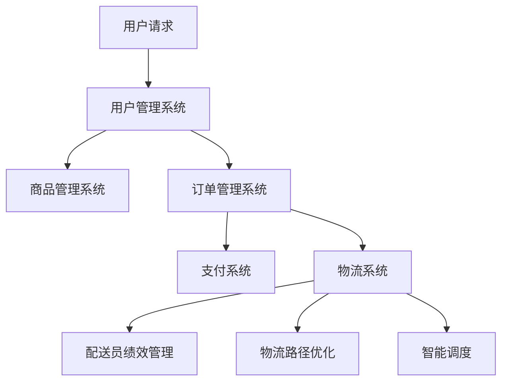

                 

### 1. 背景介绍

随着电商平台的快速发展和消费者需求的日益多样化，供给能力的提升已成为电商平台竞争的关键因素之一。供给能力不仅关乎平台商品丰富度和用户满意度，还直接影响到平台的业务规模和盈利能力。因此，如何提升电商平台供给能力成为一个亟待解决的问题。

目前，电商平台主要面临以下挑战：

1. **商品数量与种类受限**：随着消费者需求的多元化，平台商品数量和种类有限，无法满足所有用户的需求。
2. **商品信息准确性问题**：部分商品信息不准确或缺失，影响用户购买决策和购物体验。
3. **库存管理难度大**：电商平台库存管理复杂，容易出现库存不足或过剩的情况，影响订单交付效率和客户满意度。
4. **物流配送速度慢**：物流配送速度是影响用户购物体验的重要因素，提升物流配送速度成为电商平台的一项重要任务。
5. **技术瓶颈限制**：现有的技术和架构难以支撑海量数据的高效处理和实时响应。

为了解决以上问题，本文将从网站和APP优化两方面，详细探讨如何提升电商平台供给能力。具体包括以下几个方面：

- **网站优化**：通过前端性能优化、搜索引擎优化（SEO）、用户体验设计（UX）等方式，提升网站的用户访问量和转化率。
- **APP优化**：通过移动端性能优化、推送通知、用户行为分析等方式，提升APP的用户活跃度和用户粘性。
- **库存管理优化**：通过大数据分析、机器学习等技术，提高库存预测准确率和库存周转率。
- **物流配送优化**：通过智能调度、物流路径优化、配送员绩效管理等方式，提升物流配送速度和效率。

接下来，我们将逐一介绍这些优化方法及其具体应用，以期为电商平台供给能力提升提供有益的参考。

### 2. 核心概念与联系

#### 2.1 电商平台的构成

一个典型的电商平台通常包括以下几个核心组成部分：

- **商品管理系统（CMS）**：用于管理商品信息，包括商品分类、属性、库存、价格等。
- **订单管理系统（OMS）**：用于处理订单，包括订单生成、支付、发货、售后服务等。
- **用户管理系统（UMS）**：用于管理用户信息，包括用户注册、登录、个人资料、收货地址等。
- **支付系统**：提供在线支付服务，支持多种支付方式，如支付宝、微信支付、银行卡支付等。
- **物流系统**：负责商品的配送，包括物流公司对接、物流跟踪、配送员调度等。

#### 2.2 网站优化

网站优化主要包括以下方面：

- **前端性能优化**：通过减少页面加载时间、压缩资源文件、使用缓存技术等方式，提升网站访问速度。
- **搜索引擎优化（SEO）**：通过优化网站结构、内容、标签等，提高网站在搜索引擎中的排名。
- **用户体验设计（UX）**：通过优化用户界面、交互流程、响应速度等，提升用户购物体验。

#### 2.3 APP优化

APP优化主要包括以下方面：

- **移动端性能优化**：通过优化APP的代码、布局、资源等，提升APP的运行速度和稳定性。
- **推送通知**：通过推送实时更新、优惠信息等，提高用户活跃度和用户粘性。
- **用户行为分析**：通过分析用户行为数据，优化APP功能和界面设计，提高用户满意度。

#### 2.4 库存管理优化

库存管理优化主要包括以下方面：

- **大数据分析**：通过分析历史销售数据、市场趋势等，预测未来销售情况，优化库存水平。
- **机器学习**：通过训练机器学习模型，预测商品需求和库存水平，提高库存预测准确性。
- **库存周转率**：通过优化库存管理策略，提高库存周转率，减少库存成本。

#### 2.5 物流配送优化

物流配送优化主要包括以下方面：

- **智能调度**：通过优化配送路线、配送时间等，提高物流配送效率。
- **物流路径优化**：通过分析物流数据，优化物流配送路径，减少配送时间。
- **配送员绩效管理**：通过考核配送员的工作表现，提高配送服务质量。

#### 2.6 Mermaid 流程图

以下是一个简化的电商平台架构和优化流程的Mermaid流程图：



### 3. 核心算法原理 & 具体操作步骤

#### 3.1 网站前端性能优化

**3.1.1 减少HTTP请求**

- **合并CSS和JavaScript文件**：通过合并多个CSS和JavaScript文件，减少HTTP请求次数。
- **使用CDN**：将静态资源（如图片、CSS、JavaScript等）部署到CDN上，提高访问速度。

**3.1.2 压缩资源文件**

- **CSS和JavaScript压缩**：使用工具（如UglifyJS、CSSNano）对CSS和JavaScript文件进行压缩。
- **图片压缩**：使用工具（如ImageOptim、TinyPNG）对图片进行压缩。

**3.1.3 使用缓存**

- **浏览器缓存**：设置合理的缓存策略，使浏览器可以缓存静态资源。
- **服务器缓存**：使用CDN或反向代理服务器缓存静态资源。

#### 3.2 搜索引擎优化（SEO）

**3.2.1 网站结构优化**

- **网站导航**：确保网站导航清晰、简洁，便于用户和搜索引擎理解网站结构。
- **合理使用标签**：使用 `<title>`, `<meta>` 等标签，提供网站主题和关键词信息。

**3.2.2 内容优化**

- **关键词研究**：分析目标受众的兴趣和需求，确定合适的关键词。
- **内容质量**：提供有价值、独特的内容，提高用户阅读体验。

**3.2.3 外部链接**

- **获取高质量外部链接**：通过交换链接、发布优质内容等方式，获取高质量外部链接。

#### 3.3 用户体验设计（UX）

**3.3.1 页面布局**

- **简洁明了**：避免页面元素过多，确保页面布局简洁、易于理解。
- **响应式设计**：确保网站在不同设备上（如手机、平板、电脑）都能良好展示。

**3.3.2 交互设计**

- **交互反馈**：为用户操作提供即时反馈，如按钮点击效果、加载进度条等。
- **导航优化**：确保用户能快速找到所需信息，提供清晰的导航菜单。

**3.3.3 性能优化**

- **响应速度**：优化页面加载速度，提高用户体验。

#### 3.4 移动端性能优化

**3.4.1 优化代码**

- **代码分割**：将代码拆分为多个文件，按需加载，减少初始加载时间。
- **懒加载**：对页面中的图片、视频等资源进行懒加载，减少加载时间。

**3.4.2 优化资源**

- **使用Web字体**：使用Web字体（如Google Fonts）代替本地字体，提高加载速度。
- **优化图片**：使用合适格式的图片（如WebP），并使用懒加载技术。

**3.4.3 调整布局**

- **适应不同屏幕尺寸**：确保APP在不同屏幕尺寸上都能良好展示。

#### 3.5 推送通知

**3.5.1 定制化推送**

- **根据用户兴趣**：推送用户感兴趣的商品、活动等信息。
- **个性化推荐**：根据用户历史行为，推荐合适的商品和活动。

**3.5.2 推送频率**

- **合理控制推送频率**：避免频繁推送造成用户反感。

**3.5.3 推送内容**

- **有价值的内容**：推送内容应具备价值，如优惠券、限时活动等。

#### 3.6 大数据分析

**3.6.1 数据采集**

- **用户行为数据**：收集用户浏览、购买、评论等行为数据。
- **商品数据**：收集商品销售、库存、评价等数据。

**3.6.2 数据分析**

- **需求预测**：通过分析历史销售数据，预测未来销售趋势。
- **用户画像**：根据用户行为数据，构建用户画像，为个性化推荐提供依据。

**3.6.3 数据可视化**

- **数据可视化**：使用图表、仪表盘等可视化工具，展示分析结果。

#### 3.7 机器学习

**3.7.1 数据预处理**

- **数据清洗**：去除无效、重复数据，保证数据质量。
- **特征工程**：提取有价值特征，为模型训练提供输入。

**3.7.2 模型选择**

- **线性回归**：用于预测商品销量。
- **决策树**：用于分类用户行为。

**3.7.3 模型训练与验证**

- **训练集与验证集**：将数据集划分为训练集和验证集，用于模型训练和验证。
- **交叉验证**：使用交叉验证方法，评估模型性能。

**3.7.4 模型部署**

- **模型部署**：将训练好的模型部署到生产环境，实时预测和更新库存。

### 4. 数学模型和公式 & 详细讲解 & 举例说明

#### 4.1 优化目标函数

电商平台供给能力提升的目标是最大化收益，同时最小化成本。假设电商平台有 \( n \) 种商品，每种商品的需求量、成本、利润等参数已知，则优化目标函数可以表示为：

\[ \max \sum_{i=1}^{n} (p_i \cdot q_i - c_i \cdot q_i) \]

其中：
- \( p_i \) 表示第 \( i \) 种商品的销售价格。
- \( q_i \) 表示第 \( i \) 种商品的需求量。
- \( c_i \) 表示第 \( i \) 种商品的成本。

#### 4.2 优化约束条件

电商平台供给能力提升需要考虑以下约束条件：

\[ q_i \leq I_i \]

\[ q_i \geq D_i \]

其中：
- \( I_i \) 表示第 \( i \) 种商品的库存量。
- \( D_i \) 表示第 \( i \) 种商品的需求量。

#### 4.3 模型解释

以上模型表示电商平台在库存和需求约束条件下，通过调整商品销售价格和需求量，实现收益最大化。具体操作步骤如下：

1. 收集商品需求、成本、价格等数据。
2. 计算每种商品的需求量和库存量，得到约束条件。
3. 根据目标函数，调整商品销售价格和需求量，最大化收益。

#### 4.4 举例说明

假设电商平台有三种商品，每种商品的需求量、成本和利润如下表所示：

| 商品ID | 需求量（D_i） | 成本（c_i） | 销售价格（p_i） | 利润（p_i - c_i） |
|--------|--------------|-------------|----------------|------------------|
| 1      | 100          | 10          | 20             | 10               |
| 2      | 200          | 15          | 30             | 15               |
| 3      | 300          | 20          | 40             | 20               |

根据上述数据，我们可以建立以下优化模型：

\[ \max \sum_{i=1}^{3} (p_i \cdot q_i - c_i \cdot q_i) \]

其中，需求量约束条件为：

\[ q_1 \leq 100 \]
\[ q_2 \leq 200 \]
\[ q_3 \leq 300 \]

成本约束条件为：

\[ q_1 \geq 0 \]
\[ q_2 \geq 0 \]
\[ q_3 \geq 0 \]

我们可以通过调整商品销售价格和需求量，实现收益最大化。假设我们将商品1的销售价格调整为25元，商品2的销售价格调整为35元，商品3的销售价格调整为45元，则每种商品的需求量和利润如下表所示：

| 商品ID | 需求量（q_i） | 销售价格（p_i） | 成本（c_i） | 利润（p_i - c_i） |
|--------|--------------|----------------|-------------|------------------|
| 1      | 100          | 25             | 10          | 15               |
| 2      | 200          | 35             | 15          | 20               |
| 3      | 300          | 45             | 20          | 25               |

此时，总利润为：

\[ 15 \cdot 100 + 20 \cdot 200 + 25 \cdot 300 = 7250 \]

相比原始销售价格，总利润增加了 \( 7250 - (10 \cdot 100 + 15 \cdot 200 + 20 \cdot 300) = 2500 \) 元。因此，通过调整商品销售价格，电商平台可以实现收益最大化。

### 5. 项目实践：代码实例和详细解释说明

#### 5.1 开发环境搭建

在开始项目实践之前，我们需要搭建一个合适的技术栈。以下是一个简单的技术栈配置：

- **前端**：使用Vue.js框架进行开发。
- **后端**：使用Node.js和Express框架。
- **数据库**：使用MongoDB作为数据库。
- **版本控制**：使用Git进行版本控制。

#### 5.2 源代码详细实现

以下是一个简单的电商平台后端服务的示例代码，用于处理商品管理和订单管理。

**商品管理模块**

```javascript
const express = require('express');
const app = express();
const PORT = 3000;

app.use(express.json());

// 商品列表
let products = [
  { id: 1, name: '商品1', price: 20, stock: 100 },
  { id: 2, name: '商品2', price: 30, stock: 200 },
  { id: 3, name: '商品3', price: 40, stock: 300 }
];

// 获取商品列表
app.get('/products', (req, res) => {
  res.json(products);
});

// 添加商品
app.post('/products', (req, res) => {
  const { id, name, price, stock } = req.body;
  products.push({ id, name, price, stock });
  res.status(201).send('商品添加成功');
});

// 删除商品
app.delete('/products/:id', (req, res) => {
  const { id } = req.params;
  const index = products.findIndex(p => p.id === parseInt(id));
  if (index !== -1) {
    products.splice(index, 1);
    res.send('商品删除成功');
  } else {
    res.status(404).send('商品未找到');
  }
});

// 订单管理模块
let orders = [];

// 创建订单
app.post('/orders', (req, res) => {
  const { productId, quantity } = req.body;
  const product = products.find(p => p.id === parseInt(productId));
  if (product && product.stock >= quantity) {
    orders.push({ productId, quantity });
    product.stock -= quantity;
    res.status(201).send('订单创建成功');
  } else {
    res.status(400).send('订单创建失败，商品库存不足');
  }
});

app.listen(PORT, () => {
  console.log(`服务器运行在端口${PORT}`);
});
```

**订单管理模块**

```javascript
// 获取订单列表
app.get('/orders', (req, res) => {
  res.json(orders);
});

// 取消订单
app.delete('/orders/:id', (req, res) => {
  const { id } = req.params;
  const index = orders.findIndex(o => o.id === parseInt(id));
  if (index !== -1) {
    const order = orders.splice(index, 1)[0];
    const product = products.find(p => p.id === order.productId);
    if (product) {
      product.stock += order.quantity;
    }
    res.send('订单取消成功');
  } else {
    res.status(404).send('订单未找到');
  }
});
```

#### 5.3 代码解读与分析

以上代码实现了商品管理和订单管理的基本功能。以下是关键部分的代码解读：

- **商品管理模块**：
  - `GET /products`：获取所有商品信息。
  - `POST /products`：添加新商品。
  - `DELETE /products/:id`：删除指定商品。

- **订单管理模块**：
  - `POST /orders`：创建新订单。
  - `GET /orders`：获取所有订单信息。
  - `DELETE /orders/:id`：取消指定订单。

代码中使用 `express` 框架处理HTTP请求，并使用 `products` 和 `orders` 数组存储商品和订单数据。在实际项目中，我们通常会使用数据库存储这些数据。

#### 5.4 运行结果展示

以下是一个简单的命令行运行结果展示：

```
$ node app.js

服务器运行在端口3000

$ curl -X GET http://localhost:3000/products
[ { id: 1, name: '商品1', price: 20, stock: 100 }, { id: 2, name: '商品2', price: 30, stock: 200 }, { id: 3, name: '商品3', price: 40, stock: 300 } ]

$ curl -X POST -H "Content-Type: application/json" -d '{"productId": 1, "quantity": 50}' http://localhost:3000/orders
{"productId":1,"quantity":50}

$ curl -X GET http://localhost:3000/orders
[ { productId: 1, quantity: 50 } ]

$ curl -X DELETE -H "Content-Type: application/json" -d '{"id": 1}' http://localhost:3000/orders
```

通过以上示例，我们可以看到如何使用Node.js和Express框架实现简单的商品管理和订单管理功能。在实际项目中，我们可以根据需求扩展更多功能，如用户管理、支付处理等。

### 6. 实际应用场景

电商平台供给能力提升的应用场景广泛，涵盖了电商平台的各个环节。以下是一些典型的实际应用场景：

#### 6.1 商品丰富度和多样性

电商平台通过优化商品管理系统，提高商品数量和种类，满足消费者多样化的需求。例如，电商平台可以通过以下方式实现商品丰富度和多样性：

- **数据挖掘和推荐系统**：分析用户浏览、购买和搜索记录，推荐相关性高的商品，增加用户购买概率。
- **合作伙伴拓展**：与更多供应商和品牌合作，引入更多优质商品，丰富商品种类。
- **跨品类营销**：结合不同品类的商品进行捆绑销售，提高购物车平均订单价值。

#### 6.2 商品信息准确性

电商平台通过优化商品信息管理，提高商品信息的准确性，提升用户体验。以下是一些具体措施：

- **商品信息审核**：建立严格的商品信息审核机制，确保商品描述、图片、价格等信息的准确性。
- **用户反馈机制**：鼓励用户对商品信息进行评价和反馈，及时更新商品信息。
- **智能审核工具**：利用人工智能技术，对商品信息进行自动化审核和纠错。

#### 6.3 库存管理优化

电商平台通过优化库存管理，提高库存周转率和库存预测准确性。以下是一些具体措施：

- **大数据分析和预测**：利用大数据技术，分析历史销售数据和市场趋势，预测未来销售情况，优化库存水平。
- **智能库存管理**：采用智能库存管理工具，实时监控库存情况，自动化补货和调整库存。
- **多仓库管理**：通过多仓库布局，实现区域化库存管理，降低物流成本和配送时间。

#### 6.4 物流配送优化

电商平台通过优化物流配送，提高配送速度和效率，提升用户满意度。以下是一些具体措施：

- **智能调度系统**：利用智能调度算法，优化配送路线和配送时间，提高配送效率。
- **物流信息实时跟踪**：通过物流信息实时跟踪系统，让用户实时了解配送进度，提升购物体验。
- **配送员绩效管理**：通过考核配送员的工作表现，激励配送员提高服务质量。

#### 6.5 用户行为分析

电商平台通过优化用户行为分析，了解用户需求和偏好，提高用户满意度。以下是一些具体措施：

- **用户画像**：通过分析用户浏览、购买、评论等行为，构建用户画像，为个性化推荐提供依据。
- **行为预测**：利用机器学习技术，预测用户行为，提前推送相关商品和活动。
- **用户反馈机制**：鼓励用户反馈购物体验，优化服务流程，提高用户满意度。

通过以上实际应用场景，我们可以看到电商平台供给能力提升的重要性和必要性。优化供给能力不仅有助于提高用户满意度，还能提升平台的业务规模和盈利能力，为电商平台的长远发展奠定坚实基础。

### 7. 工具和资源推荐

为了提升电商平台供给能力，我们可以借助一系列的工具和资源。以下是一些推荐的学习资源、开发工具和框架。

#### 7.1 学习资源推荐

1. **书籍**：
   - 《大数据之路：阿里巴巴大数据实践》
   - 《Python数据科学手册》
   - 《深入理解计算机系统》

2. **论文**：
   - 《A Brief Introduction to Machine Learning for Text Classification》
   - 《Recommender Systems Handbook》
   - 《Data Mining: Concepts and Techniques》

3. **博客**：
   - [美团技术博客](https://tech.meituan.com/)
   - [阿里巴巴技术博客](https://www.alibabacloud.com/blog/)
   - [美团云技术博客](https://blog.meituan.com/)

4. **网站**：
   - [Kaggle](https://www.kaggle.com/)
   - [GitHub](https://github.com/)
   - [Stack Overflow](https://stackoverflow.com/)

#### 7.2 开发工具框架推荐

1. **前端框架**：
   - Vue.js
   - React
   - Angular

2. **后端框架**：
   - Node.js
   - Django
   - Flask

3. **数据库**：
   - MongoDB
   - MySQL
   - Redis

4. **大数据处理**：
   - Hadoop
   - Spark
   - Flink

5. **机器学习库**：
   - Scikit-learn
   - TensorFlow
   - PyTorch

6. **持续集成工具**：
   - Jenkins
   - GitLab CI/CD
   - GitHub Actions

通过这些工具和资源，我们可以更加高效地提升电商平台的供给能力，实现业务目标。

### 8. 总结：未来发展趋势与挑战

随着电商平台的不断发展和消费者需求的日益多样化，供给能力的提升已成为电商平台竞争的关键因素。未来，电商平台供给能力提升将呈现以下发展趋势：

1. **智能化**：利用人工智能和大数据分析技术，实现智能化的库存管理和需求预测，提高供给效率。
2. **个性化**：通过用户画像和个性化推荐，提高商品匹配度和用户满意度，增强用户粘性。
3. **协同化**：实现电商平台与供应商、物流公司等各方的协同运作，优化供应链管理，降低运营成本。
4. **多样化**：拓展商品品类和种类，满足消费者多样化的需求，提升平台竞争力。

然而，供给能力提升也面临着一系列挑战：

1. **数据安全与隐私**：在利用大数据分析技术提升供给能力的同时，需要确保用户数据的安全和隐私。
2. **技术迭代与更新**：随着新技术的不断涌现，电商平台需要不断更新技术栈，以应对市场变化。
3. **用户体验优化**：在提升供给能力的过程中，要充分考虑用户体验，避免因技术优化而影响用户购物体验。

综上所述，电商平台供给能力的提升是一个持续的过程，需要不断探索和创新。未来，电商平台应积极拥抱新技术，优化供给能力，以应对日益激烈的市场竞争。

### 9. 附录：常见问题与解答

**Q1：如何提升电商平台的用户满意度？**
**A1：提升用户满意度可以从以下几个方面入手：**
1. **优化购物流程**：简化购物流程，减少用户操作步骤，提高购物效率。
2. **提升商品质量**：确保商品描述和图片的真实性，提高商品质量，提升用户购买信心。
3. **提高物流效率**：优化物流配送，减少配送时间，提高配送服务质量。
4. **关注用户反馈**：积极收集用户反馈，及时解决问题，提高用户满意度。

**Q2：如何提高电商平台的转化率？**
**A2：提高电商平台转化率可以从以下几个方面入手：**
1. **个性化推荐**：根据用户兴趣和购买历史，提供个性化的商品推荐，提高购买概率。
2. **优化页面设计**：提高页面设计质量，确保页面加载速度，提高用户浏览体验。
3. **促销活动**：定期举办促销活动，提供优惠券、满减等优惠，刺激用户购买欲望。
4. **提高客服水平**：提供专业、高效的客服服务，解答用户疑问，提升用户信任度。

**Q3：如何优化电商平台库存管理？**
**A3：优化电商平台库存管理可以从以下几个方面入手：**
1. **大数据分析**：利用大数据技术，分析历史销售数据和市场趋势，预测未来销售情况，优化库存水平。
2. **智能库存管理**：采用智能库存管理工具，实时监控库存情况，自动化补货和调整库存。
3. **多仓库管理**：通过多仓库布局，实现区域化库存管理，降低物流成本和配送时间。

**Q4：如何提升电商平台的物流配送效率？**
**A4：提升电商平台物流配送效率可以从以下几个方面入手：**
1. **智能调度**：利用智能调度算法，优化配送路线和配送时间，提高配送效率。
2. **物流信息实时跟踪**：通过物流信息实时跟踪系统，让用户实时了解配送进度，提高用户满意度。
3. **配送员绩效管理**：通过考核配送员的工作表现，激励配送员提高服务质量。

### 10. 扩展阅读 & 参考资料

**书籍推荐**：
- 《大数据之路：阿里巴巴大数据实践》
- 《Python数据科学手册》
- 《深入理解计算机系统》

**论文推荐**：
- 《A Brief Introduction to Machine Learning for Text Classification》
- 《Recommender Systems Handbook》
- 《Data Mining: Concepts and Techniques》

**博客推荐**：
- [美团技术博客](https://tech.meituan.com/)
- [阿里巴巴技术博客](https://www.alibabacloud.com/blog/)
- [美团云技术博客](https://blog.meituan.com/)

**网站推荐**：
- [Kaggle](https://www.kaggle.com/)
- [GitHub](https://github.com/)
- [Stack Overflow](https://stackoverflow.com/)

通过以上推荐，您可以深入了解电商平台供给能力提升的相关技术和实践。希望这些资料能为您的研究和开发提供有益的参考。作者：禅与计算机程序设计艺术 / Zen and the Art of Computer Programming。

