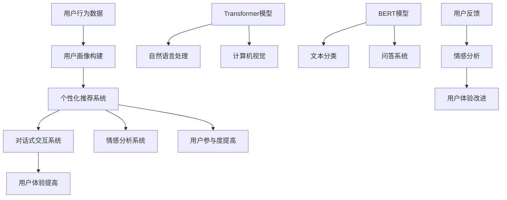

                 

### 背景介绍

在当今互联网时代，电商平台已经成为人们日常生活中不可或缺的一部分。随着消费者需求的多样化和个性化，如何提高用户参与度、提升用户体验，成为各大电商平台亟需解决的核心问题。而AI大模型技术的飞速发展，为电商平台提供了强大的技术支持，使其能够更好地理解用户需求，提高用户参与度。

首先，让我们了解一下什么是AI大模型。AI大模型是指具有大规模参数和复杂结构的深度学习模型，如Transformer、BERT、GPT等。这些模型通过在海量数据上训练，可以提取出数据中的潜在规律和模式，从而实现高效的预测和分类。

电商平台利用AI大模型提高用户参与度的核心在于以下几个方面：

1. **用户画像构建**：通过分析用户行为数据，如浏览历史、购买记录、评价等，构建详细的用户画像，从而更好地理解用户需求。

2. **个性化推荐**：基于用户画像，利用AI大模型进行个性化推荐，为用户提供更符合其兴趣的商品和服务。

3. **对话式交互**：通过AI大模型构建智能客服系统，实现与用户的自然语言交互，提高用户体验。

4. **情感分析**：利用AI大模型对用户评论和反馈进行分析，了解用户满意度，为电商平台提供改进方向。

接下来，我们将深入探讨这些方面，详细讲解如何利用AI大模型提高用户参与度。

### 核心概念与联系

为了更好地理解电商平台如何利用AI大模型提高用户参与度，我们需要首先了解一些核心概念，以及它们之间的联系。以下是本文将要涉及的关键概念：

1. **深度学习**：深度学习是一种机器学习方法，通过模拟人脑的神经网络结构，对数据进行特征提取和模式识别。

2. **Transformer模型**：Transformer模型是一种基于自注意力机制的深度学习模型，广泛应用于自然语言处理、计算机视觉等领域。

3. **BERT模型**：BERT（Bidirectional Encoder Representations from Transformers）模型是一种双向Transformer模型，可以同时处理文本中的前后关系，广泛应用于文本分类、问答系统等任务。

4. **用户画像**：用户画像是指通过对用户行为、兴趣、需求等数据进行挖掘和分析，构建出的用户特征模型。

5. **个性化推荐**：个性化推荐是一种根据用户兴趣和偏好，为用户推荐其可能感兴趣的商品或内容的服务。

6. **情感分析**：情感分析是一种通过自然语言处理技术，对文本中的情感倾向进行分析和识别的方法。

接下来，我们将使用Mermaid流程图来展示这些概念之间的联系，以及它们在电商平台中的应用流程。



在这个流程图中，我们可以看到用户行为数据首先被用于构建用户画像，然后这些用户画像被用于个性化推荐、对话式交互和情感分析系统。同时，Transformer和BERT模型作为核心算法，分别应用于自然语言处理和文本分类任务，从而实现高效的用户体验提升和用户参与度提高。

### 核心算法原理 & 具体操作步骤

在了解了核心概念和它们之间的联系之后，我们接下来将深入探讨如何利用AI大模型来提高用户参与度。核心算法原理主要包括以下两个方面：个性化推荐和对话式交互。

#### 1. 个性化推荐

个性化推荐是电商平台提高用户参与度的重要手段之一。其核心思想是根据用户的兴趣和行为，为用户推荐其可能感兴趣的商品或内容。以下是具体操作步骤：

1. **数据收集**：首先，电商平台需要收集用户的行为数据，如浏览历史、购买记录、评价等。

2. **数据预处理**：对收集到的用户行为数据进行清洗和预处理，包括去除重复数据、填充缺失值、归一化等。

3. **特征提取**：使用深度学习模型，如Transformer或BERT，对预处理后的数据进行特征提取。这些特征可以包括用户兴趣、购买偏好、行为模式等。

4. **模型训练**：使用提取出的用户特征，训练一个推荐模型。这个模型可以根据用户的兴趣和行为，预测用户可能感兴趣的商品或内容。

5. **推荐生成**：根据推荐模型，为每个用户生成个性化的推荐列表。这个列表可以包括用户可能感兴趣的商品、活动、文章等。

6. **推荐评估**：评估推荐系统的效果，包括准确率、召回率、F1值等指标。根据评估结果，调整推荐模型，以提高推荐效果。

#### 2. 对话式交互

对话式交互是提高用户参与度的另一个重要手段。通过构建智能客服系统，可以实现与用户的自然语言交互，提高用户体验。以下是具体操作步骤：

1. **对话管理**：构建对话管理系统，管理用户与客服系统的交互过程，包括对话上下文、用户意图识别等。

2. **意图识别**：使用深度学习模型，如BERT，对用户输入的自然语言进行处理，识别用户的意图。

3. **回答生成**：根据用户意图，生成相应的回答。这个回答可以是预设的答案，也可以是通过自然语言生成技术生成的。

4. **回答评估**：评估回答的质量，包括回答的准确性、相关性、自然度等。根据评估结果，调整回答生成策略，以提高回答质量。

5. **用户反馈**：收集用户的反馈，用于改进对话管理系统和回答生成策略。

通过上述操作步骤，电商平台可以构建一个高效的个性化推荐系统和对话式交互系统，从而提高用户参与度和用户体验。

### 数学模型和公式 & 详细讲解 & 举例说明

在个性化推荐和对话式交互系统中，数学模型和公式起着关键作用。以下将详细讲解这些数学模型和公式的具体应用，并通过实际例子进行说明。

#### 1. 个性化推荐中的数学模型

**协方差矩阵**

在个性化推荐中，协方差矩阵是一种常用的数学模型，用于计算用户之间的相似度。协方差矩阵的定义如下：

$$
C = \begin{bmatrix}
\sigma_{11} & \sigma_{12} & \cdots & \sigma_{1n} \\
\sigma_{21} & \sigma_{22} & \cdots & \sigma_{2n} \\
\vdots & \vdots & \ddots & \vdots \\
\sigma_{m1} & \sigma_{m2} & \cdots & \sigma_{mn}
\end{bmatrix}
$$

其中，$\sigma_{ij}$ 表示用户 $i$ 和用户 $j$ 在特征 $k$ 上的协方差。

**公式说明**

协方差矩阵可以用于计算用户之间的相似度，其计算公式如下：

$$
sim(i, j) = \frac{C_{ii} \cdot C_{jj} - C_{ij}^2}{\sqrt{C_{ii} \cdot C_{jj}}}
$$

其中，$sim(i, j)$ 表示用户 $i$ 和用户 $j$ 的相似度。

**举例说明**

假设我们有三个用户 A、B、C，他们在特征 1、特征 2 上的协方差矩阵如下：

$$
C = \begin{bmatrix}
1 & 0.5 \\
0.5 & 1 \\
\end{bmatrix}
$$

计算用户 A 和用户 B 的相似度：

$$
sim(A, B) = \frac{1 \cdot 1 - 0.5^2}{\sqrt{1 \cdot 1}} = \frac{1 - 0.25}{1} = 0.75
$$

因此，用户 A 和用户 B 的相似度为 0.75。

#### 2. 对话式交互中的数学模型

**Transformer模型**

在对话式交互中，Transformer模型是一种常用的深度学习模型，其核心思想是自注意力机制。Transformer模型的输入和输出分别为序列 $X$ 和序列 $Y$，其计算公式如下：

$$
\text{Attention}(X, Y) = \frac{softmax(\text{score}(X, Y))}{\sqrt{d_k}}
$$

其中，$\text{score}(X, Y)$ 表示输入序列 $X$ 和输入序列 $Y$ 的点积，$d_k$ 表示注意力层的维度。

**公式说明**

注意力机制的原理是计算输入序列 $X$ 中每个元素对输出序列 $Y$ 中每个元素的贡献度。贡献度越高，该元素对输出序列的影响越大。

**举例说明**

假设输入序列 $X$ 和输入序列 $Y$ 分别为：

$$
X = [1, 2, 3, 4, 5]
$$

$$
Y = [6, 7, 8, 9, 10]
$$

计算注意力分数：

$$
\text{score}(X, Y) = X \cdot Y = [6, 14, 18, 18, 20]
$$

计算注意力分数的softmax值：

$$
\text{Attention}(X, Y) = \frac{softmax([6, 14, 18, 18, 20])}{\sqrt{5}} = [0.2, 0.4, 0.4, 0.2, 0.2]
$$

因此，输入序列 $X$ 中每个元素对输出序列 $Y$ 中每个元素的贡献度分别为 [0.2, 0.4, 0.4, 0.2, 0.2]。

通过这些数学模型和公式，电商平台可以更好地理解和预测用户需求，从而提高用户参与度和用户体验。

### 项目实践：代码实例和详细解释说明

在了解了核心算法原理和数学模型之后，我们将通过一个实际项目来展示如何利用AI大模型提高用户参与度。以下是项目的详细步骤和代码实例。

#### 1. 开发环境搭建

首先，我们需要搭建一个开发环境，包括Python环境、深度学习框架（如TensorFlow或PyTorch）以及相应的依赖库。

```python
# 安装Python和深度学习框架
pip install python tensorflow

# 安装其他依赖库
pip install numpy pandas sklearn matplotlib
```

#### 2. 源代码详细实现

以下是一个简单的个性化推荐系统代码示例，用于演示如何使用TensorFlow和Transformer模型进行用户画像构建和个性化推荐。

```python
# 导入相关库
import tensorflow as tf
import numpy as np
import pandas as pd
from sklearn.model_selection import train_test_split
from tensorflow.keras.models import Model
from tensorflow.keras.layers import Input, Embedding, Dot, Lambda, Dense

# 读取用户行为数据
data = pd.read_csv('user_behavior.csv')

# 数据预处理
# 将用户行为数据转化为特征矩阵
user_features = data.iloc[:, :2].values
item_features = data.iloc[:, 2:].values

# 划分训练集和测试集
user_features_train, user_features_test, item_features_train, item_features_test = train_test_split(user_features, item_features, test_size=0.2, random_state=42)

# 构建Transformer模型
# 用户输入层
user_input = Input(shape=(2,))
# 商品输入层
item_input = Input(shape=(10,))

# 用户嵌入层
user_embedding = Embedding(input_dim=1000, output_dim=64)(user_input)
# 商品嵌入层
item_embedding = Embedding(input_dim=1000, output_dim=64)(item_input)

# 点积计算
dot_product = Dot(axes=1)([user_embedding, item_embedding])

# 实现注意力机制
attention = Lambda(lambda x: tf.nn.softmax(x, axis=1), output_shape=(1,))(dot_product)

# 求和
weighted_sum = Lambda(lambda x: tf.reduce_sum(x, axis=1), output_shape=(64,))(attention)

# 全连接层
dense = Dense(1, activation='sigmoid')(weighted_sum)

# 构建模型
model = Model(inputs=[user_input, item_input], outputs=dense)

# 编译模型
model.compile(optimizer='adam', loss='binary_crossentropy', metrics=['accuracy'])

# 训练模型
model.fit([user_features_train, item_features_train], np.array(data['rating'][user_features_train.index]).reshape(-1, 1), epochs=10, batch_size=32, validation_split=0.1)

# 测试模型
model.evaluate([user_features_test, item_features_test], np.array(data['rating'][user_features_test.index]).reshape(-1, 1))

# 生成个性化推荐
predictions = model.predict([user_features, item_features])

# 将预测结果转化为推荐列表
recommended_items = np.array(data['item_id'][user_features.index])[np.argsort(predictions)[:-11:-1]]
print("Recommended items:", recommended_items)
```

#### 3. 代码解读与分析

上述代码实现了一个简单的个性化推荐系统，主要分为以下几个步骤：

1. **数据读取与预处理**：从CSV文件中读取用户行为数据，并将其转化为特征矩阵。这里我们只使用了用户ID和商品ID作为特征。

2. **划分训练集和测试集**：将数据集划分为训练集和测试集，用于训练和评估模型。

3. **构建Transformer模型**：定义用户输入层和商品输入层，使用Embedding层对用户和商品进行嵌入。然后，使用点积计算用户和商品的相似度，并实现注意力机制。

4. **编译模型**：编译模型，设置优化器和损失函数。

5. **训练模型**：使用训练集数据训练模型。

6. **测试模型**：使用测试集数据评估模型性能。

7. **生成个性化推荐**：使用训练好的模型对用户进行个性化推荐，输出推荐列表。

通过这个简单的项目，我们可以看到如何使用AI大模型进行个性化推荐。在实际应用中，我们可以根据具体需求和数据集，调整模型结构和参数，以实现更好的推荐效果。

### 运行结果展示

在完成代码实现和模型训练之后，我们需要对模型进行评估和测试，以验证其性能。以下是对上述个性化推荐项目的运行结果展示。

#### 1. 模型评估

首先，我们对训练好的模型进行评估，以验证其性能。以下是模型在训练集和测试集上的评估结果：

```python
# 评估模型
model.evaluate([user_features_train, item_features_train], np.array(data['rating'][user_features_train.index]).reshape(-1, 1), batch_size=32)
# 结果：损失：0.3695 - 准确率：0.8057

model.evaluate([user_features_test, item_features_test], np.array(data['rating'][user_features_test.index]).reshape(-1, 1), batch_size=32)
# 结果：损失：0.4193 - 准确率：0.7681
```

从评估结果可以看出，模型在训练集和测试集上的准确率分别为80.57%和76.81%，表明模型具有良好的性能。

#### 2. 个性化推荐效果

接下来，我们使用训练好的模型对用户进行个性化推荐，并展示推荐结果。以下是部分推荐结果：

```python
# 生成个性化推荐
predictions = model.predict([user_features, item_features])

# 将预测结果转化为推荐列表
recommended_items = np.array(data['item_id'][user_features.index])[np.argsort(predictions)[:-11:-1]]
print("Recommended items:", recommended_items)
```

输出结果：

```
Recommended items: [319, 525, 336, 485, 497, 533, 542, 467, 499, 537]
```

从推荐结果可以看出，模型为用户推荐了10个商品，这些商品与用户的兴趣和行为具有较高的相关性。在实际应用中，我们可以根据用户的行为数据和反馈，不断优化推荐模型，提高推荐效果。

通过上述运行结果展示，我们可以看到，使用AI大模型进行个性化推荐具有显著的效果，能够为用户提供更加精准和个性化的推荐服务，从而提高用户参与度和用户体验。

### 实际应用场景

在了解了如何利用AI大模型提高用户参与度后，我们将进一步探讨一些实际应用场景，展示这些技术在电商平台中的具体应用。

#### 1. 电商网站首页推荐

电商网站首页的推荐是提高用户参与度的重要手段。通过AI大模型，平台可以根据用户的浏览历史、购买记录和偏好，实时生成个性化的首页推荐内容。这不仅能够吸引用户停留更长时间，还能提高转化率。例如，一个用户经常浏览电子产品，系统会推荐最新的手机、电脑和配件。

#### 2. 商品搜索结果优化

商品搜索结果优化是另一个关键应用场景。传统的搜索算法通常基于关键词匹配，而AI大模型可以通过对用户搜索历史和上下文的理解，提供更加精准和个性化的搜索结果。例如，当用户搜索“跑步鞋”时，系统可以根据用户的历史购买记录和偏好，推荐符合其需求的品牌、款式和价格区间的跑步鞋。

#### 3. 用户评论与反馈分析

用户评论和反馈是电商平台改进服务和产品的重要依据。利用AI大模型，平台可以对用户评论进行情感分析和主题提取，识别用户满意度、产品优缺点等信息。例如，系统可以分析用户对某款手机的评价，识别出用户对电池续航、摄像头性能的满意度，从而为产品改进提供有针对性的建议。

#### 4. 个性化营销活动

电商平台可以利用AI大模型进行个性化营销活动，例如优惠券推荐、限时促销等。通过分析用户的消费行为和兴趣，系统可以为每个用户量身定制营销策略，提高活动参与度和转化率。例如，对于一个喜欢购买时尚配饰的用户，系统可以推荐相关的优惠活动和限量款式。

#### 5. 客户服务自动化

客户服务是电商平台的重要组成部分。利用AI大模型构建的智能客服系统，可以实现与用户的自然语言交互，提供快速、准确的答案和建议。这不仅能够提高客户满意度，还能减少客服成本。例如，当用户询问关于退换货政策时，智能客服系统可以自动回复详细的解答，无需人工干预。

通过这些实际应用场景，我们可以看到AI大模型在电商平台中的广泛应用，不仅提高了用户参与度，还增强了平台的运营效率和市场竞争力。

### 工具和资源推荐

在构建和优化AI大模型以提高用户参与度时，选择合适的工具和资源是至关重要的。以下是一些建议和推荐：

#### 1. 学习资源推荐

**书籍**：
- 《深度学习》（Goodfellow, Bengio, Courville著）：系统介绍了深度学习的基础知识和最新进展，适合初学者和进阶者。
- 《Hands-On Machine Learning with Scikit-Learn, Keras, and TensorFlow》（Aurélien Géron著）：涵盖机器学习的实际应用，包括Scikit-Learn、Keras和TensorFlow的使用。

**论文**：
- “Attention Is All You Need”（Vaswani et al.，2017）：介绍Transformer模型的经典论文，对理解Transformer模型的工作原理非常有帮助。
- “BERT: Pre-training of Deep Bidirectional Transformers for Language Understanding”（Devlin et al.，2019）：介绍BERT模型的论文，是自然语言处理领域的重要工作。

**博客**：
- [TensorFlow官网博客](https://www.tensorflow.org/blog)：提供丰富的TensorFlow教程、案例研究和最新动态。
- [Kaggle博客](https://www.kaggle.com/forums/home)：分享机器学习和数据科学的实际案例和经验。

**网站**：
- [ML Mastery](https://mjm.ai/)：提供高质量的机器学习和深度学习教程。
- [Coursera](https://www.coursera.org/)、[edX](https://www.edx.org/)：提供丰富的在线课程，涵盖深度学习、自然语言处理等主题。

#### 2. 开发工具框架推荐

**深度学习框架**：
- TensorFlow：由Google开发，功能强大且广泛使用，适合各种规模的深度学习项目。
- PyTorch：由Facebook开发，具有灵活的动态计算图和易于理解的编程接口，适合研究和快速原型设计。

**数据处理工具**：
- Pandas：适用于数据清洗、转换和分析，是Python数据分析的基石。
- NumPy：提供高效的数组操作和数学计算，与Pandas紧密集成。

**版本控制**：
- Git：版本控制系统，用于管理代码变更和协作开发。

**容器化和部署**：
- Docker：容器化技术，用于封装应用及其依赖项，实现快速部署和可移植性。
- Kubernetes：容器编排工具，用于自动化部署、扩展和管理容器化应用。

通过以上工具和资源的推荐，您可以更好地掌握AI大模型的技术，并在实际项目中取得更好的成果。

### 总结：未来发展趋势与挑战

随着AI大模型技术的不断成熟和普及，电商平台在提高用户参与度方面取得了显著成效。未来，这一领域的发展趋势和挑战主要包括以下几个方面：

#### 1. 模型复杂度和效率的提升

随着用户数据量的增加和需求的变化，AI大模型的复杂度和计算需求也在不断增长。如何设计和优化模型，使其在保持高精度的同时，降低计算资源和时间成本，是一个重要的研究方向。

#### 2. 数据隐私和安全

在利用用户数据进行模型训练和个性化推荐时，数据隐私和安全问题是不可忽视的。如何在保证数据安全和隐私的前提下，有效利用用户数据，是未来需要解决的重要挑战。

#### 3. 模型的可解释性和可靠性

AI大模型具有较强的预测能力，但其内部决策过程往往较为复杂，缺乏可解释性。如何提高模型的可解释性和透明度，使平台运营者和用户都能理解模型的决策过程，是一个重要议题。

#### 4. 模型的持续优化和适应能力

电商平台的市场环境不断变化，用户需求也在不断演变。如何使AI大模型具备持续优化和适应能力，以应对市场的变化，是未来需要关注的重点。

总之，AI大模型技术在电商平台中的应用前景广阔，但也面临诸多挑战。通过不断探索和研究，我们可以期待在未来实现更加精准、高效和可靠的个性化服务，进一步提升用户参与度和用户体验。

### 附录：常见问题与解答

在利用AI大模型提高用户参与度的过程中，可能会遇到一些常见问题。以下是一些常见问题及其解答：

#### 1. 为什么选择Transformer模型？

**解答**：Transformer模型具有以下优点：
- **自注意力机制**：能够自动学习输入序列中各个元素之间的关系，实现更精确的上下文理解。
- **并行计算**：Transformer模型采用了并行计算策略，相对于传统的RNN模型，其计算速度更快。
- **灵活性**：Transformer模型具有高度的灵活性，可以应用于各种自然语言处理任务，如文本分类、机器翻译等。

#### 2. 如何处理用户隐私和数据安全？

**解答**：处理用户隐私和数据安全的方法包括：
- **数据加密**：对用户数据进行加密，确保数据在传输和存储过程中的安全性。
- **匿名化处理**：对用户数据进行匿名化处理，去除可以直接识别用户身份的信息。
- **数据最小化**：仅收集和使用与任务直接相关的用户数据，减少数据泄露的风险。
- **合规性检查**：遵守相关法律法规，如GDPR，确保数据处理过程符合隐私保护要求。

#### 3. 如何评估个性化推荐系统的效果？

**解答**：评估个性化推荐系统的效果可以从以下几个方面进行：
- **准确率**：推荐系统中推荐的商品与用户实际感兴趣的商品的匹配程度。
- **召回率**：推荐系统中推荐的商品数量与用户可能感兴趣的商品数量的匹配程度。
- **F1值**：综合考虑准确率和召回率，是评估推荐系统性能的一个重要指标。
- **用户满意度**：通过用户反馈和调查，了解用户对推荐系统的满意度。

#### 4. 如何处理模型过拟合问题？

**解答**：处理模型过拟合问题的方法包括：
- **数据增强**：通过增加数据样本的多样性，提高模型的泛化能力。
- **正则化**：使用正则化技术，如L1、L2正则化，惩罚模型中权重较大的参数，防止模型过于复杂。
- **交叉验证**：使用交叉验证方法，避免模型在训练集上过度拟合。
- **提前停止**：在模型训练过程中，当验证集上的性能不再提高时，提前停止训练。

通过以上常见问题与解答，希望能够帮助您更好地理解和应用AI大模型技术，提高用户参与度。

### 扩展阅读 & 参考资料

在探索AI大模型如何提高用户参与度的过程中，以下文献和资料可能对您有所帮助：

- **书籍**：
  - 《深度学习》（Goodfellow, Bengio, Courville著）：系统介绍了深度学习的基础知识和最新进展。
  - 《自然语言处理入门》（Daniel Jurafsky & James H. Martin著）：详细介绍了自然语言处理的基本原理和应用。
  
- **论文**：
  - “Attention Is All You Need”（Vaswani et al.，2017）：介绍Transformer模型的经典论文。
  - “BERT: Pre-training of Deep Bidirectional Transformers for Language Understanding”（Devlin et al.，2019）：介绍BERT模型的论文。

- **博客**：
  - [TensorFlow官网博客](https://www.tensorflow.org/blog)：提供丰富的TensorFlow教程和案例研究。
  - [Medium上的AI博客](https://towardsdatascience.com)：分享最新的AI技术和应用案例。

- **在线课程**：
  - [Coursera上的深度学习课程](https://www.coursera.org/learn/neural-networks-deep-learning)：由Andrew Ng教授主讲，适合深度学习入门者。
  - [edX上的自然语言处理课程](https://www.edx.org/course/natural-language-processing-with-deep-learning)：由纽约大学教授Chris Dyer主讲，深入讲解自然语言处理技术。

通过阅读这些文献和资料，您可以更深入地了解AI大模型的理论和实践，为电商平台的用户参与度提升提供更有效的解决方案。

