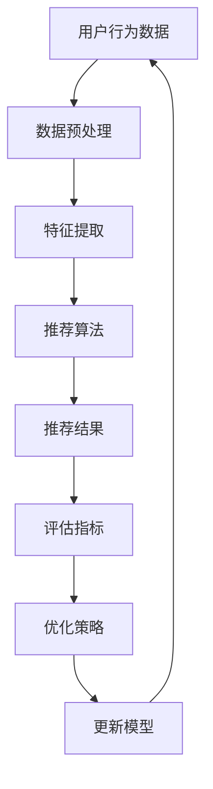

                 

关键词：电商平台、搜索推荐系统、AI 大模型、优化、效率、准确率、实时性、算法、数学模型、项目实践、应用场景、未来展望、工具和资源推荐

> 摘要：本文深入探讨了电商平台搜索推荐系统的AI 大模型优化策略，旨在提高系统效率、准确率和实时性。通过分析核心算法原理，构建数学模型，结合实际项目实践，本文提出了详细的优化方案，并对未来应用趋势与挑战进行了展望。

## 1. 背景介绍

随着互联网技术的飞速发展，电商平台已成为现代商业环境中不可或缺的一环。用户在电商平台上的购物体验，很大程度上取决于搜索推荐系统的质量。搜索推荐系统通过分析用户的历史行为、偏好和兴趣，向用户推荐相关商品，从而提高用户的购物满意度和平台交易量。

然而，现有的搜索推荐系统面临着效率、准确率和实时性等挑战。为了应对这些挑战，近年来，越来越多的研究开始将人工智能（AI）引入到搜索推荐系统中。AI 大模型作为一种先进的算法，因其强大的处理能力和深度学习能力，成为优化搜索推荐系统的关键。

本文旨在探讨如何通过AI 大模型优化电商平台搜索推荐系统，提高系统效率、准确率和实时性。首先，我们将介绍核心概念与联系，通过Mermaid流程图展示系统架构。接下来，我们将详细解释核心算法原理和具体操作步骤，并探讨算法的优缺点和应用领域。随后，我们将构建数学模型，进行公式推导，并结合实际案例进行分析。最后，我们将提供项目实践代码实例，并对实际应用场景进行讨论，同时展望未来发展趋势与挑战。

## 2. 核心概念与联系

在电商平台搜索推荐系统中，AI 大模型的核心概念包括用户行为数据、商品数据、推荐算法和评估指标。以下是一个简化的Mermaid流程图，用于展示这些概念之间的联系：



### 2.1 用户行为数据

用户行为数据是推荐系统的基础，包括用户的浏览记录、购买历史、收藏商品、评价和反馈等。这些数据反映了用户对商品的兴趣和偏好，是构建推荐模型的重要输入。

### 2.2 数据预处理

数据预处理是确保数据质量和模型性能的关键步骤。包括数据清洗、缺失值处理、异常值检测和数据归一化等操作。

### 2.3 特征提取

特征提取是从原始数据中提取有用信息的过程。常用的特征包括用户兴趣特征、商品属性特征和上下文特征等。特征提取的质量直接影响推荐系统的准确性和效率。

### 2.4 推荐算法

推荐算法是推荐系统的核心，常见的算法有基于协同过滤、基于内容、基于模型和混合推荐等。AI 大模型通常结合深度学习和神经网络，通过自动学习特征和模式，提高推荐系统的效果。

### 2.5 推荐结果

推荐结果是推荐系统输出的最终结果，包括推荐的商品列表、评分和概率等。推荐结果的准确率和实时性是衡量系统性能的重要指标。

### 2.6 评估指标

评估指标用于衡量推荐系统的性能，常见的指标有准确率、召回率、覆盖率、NDCG（排序折扣集）等。通过这些指标，可以评估推荐系统的效果，并为优化提供依据。

### 2.7 优化策略

优化策略是通过调整模型参数、改进算法和数据预处理方法等手段，提高推荐系统的效率和准确率。常见的优化策略包括特征工程、模型压缩、分布式计算和实时更新等。

### 2.8 更新模型

模型更新是推荐系统持续优化的重要环节。通过实时收集用户反馈和商品销售数据，不断更新模型，使推荐结果更加准确和实时。

## 3. 核心算法原理 & 具体操作步骤

### 3.1 算法原理概述

AI 大模型优化搜索推荐系统主要通过以下三个方面实现：

1. **深度学习与神经网络**：利用深度学习模型自动学习用户行为数据和商品属性特征，提取深层特征，提高推荐准确率。
2. **协同过滤与内容匹配**：结合协同过滤和内容匹配算法，综合利用用户历史行为和商品属性，提高推荐多样性。
3. **实时更新与在线学习**：通过实时更新用户行为数据和商品销售数据，动态调整推荐模型，提高系统实时性和适应性。

### 3.2 算法步骤详解

1. **数据收集**：从电商平台收集用户行为数据和商品数据，包括浏览记录、购买历史、收藏商品、评价和反馈等。
2. **数据预处理**：对收集到的数据进行清洗、缺失值处理、异常值检测和数据归一化等操作，确保数据质量和模型性能。
3. **特征提取**：从原始数据中提取有用信息，构建用户兴趣特征、商品属性特征和上下文特征等。
4. **模型构建**：选择合适的深度学习模型，如卷积神经网络（CNN）、循环神经网络（RNN）或 Transformer，构建推荐模型。
5. **训练模型**：使用预处理后的数据和特征，训练推荐模型，调整模型参数，优化模型性能。
6. **模型评估**：使用评估指标（如准确率、召回率、覆盖率、NDCG等）对训练好的模型进行评估，调整优化策略。
7. **实时更新**：通过实时收集用户反馈和商品销售数据，动态更新推荐模型，提高系统实时性和准确性。

### 3.3 算法优缺点

**优点**：

1. **高效处理能力**：深度学习模型能够自动学习大量数据中的特征，提高推荐效率。
2. **高准确率**：结合协同过滤和内容匹配算法，提高推荐准确性。
3. **实时更新**：通过实时更新用户行为数据和商品销售数据，提高系统实时性和适应性。

**缺点**：

1. **数据依赖性**：深度学习模型对数据质量和数量有较高要求，数据缺失或异常会影响模型性能。
2. **计算资源消耗**：训练和更新深度学习模型需要大量计算资源，对硬件设施有较高要求。

### 3.4 算法应用领域

AI 大模型在电商平台搜索推荐系统中的应用非常广泛，包括但不限于以下领域：

1. **商品推荐**：根据用户历史行为和兴趣，推荐相关商品，提高用户购物体验。
2. **广告推荐**：根据用户兴趣和行为，推荐相关广告，提高广告投放效果。
3. **内容推荐**：根据用户兴趣和行为，推荐相关内容，如新闻、文章、视频等，提高平台活跃度。

## 4. 数学模型和公式 & 详细讲解 & 举例说明

### 4.1 数学模型构建

在构建AI 大模型时，我们需要考虑以下数学模型和公式：

1. **用户行为模型**：用户行为数据可以通过矩阵分解、矩阵分解 + 协同过滤等方法建模。例如，假设用户行为数据可以用矩阵\(U\)（用户-行为矩阵）和\(I\)（行为-物品矩阵）表示，我们可以通过矩阵分解得到用户特征矩阵\(U'\)和物品特征矩阵\(I'\)，然后计算用户\(u_i\)和物品\(i\)之间的相似度：
   $$sim(u_i, i) = \frac{U_i' \cdot I_i'}{\|U_i'\|_2 \|I_i'\|_2}$$

2. **商品属性模型**：商品属性数据可以通过机器学习模型建模，如决策树、随机森林或神经网络等。假设我们使用神经网络建模商品属性，其输入层为商品特征向量\(X_i\)，输出层为商品属性向量\(Y_i\)，可以通过反向传播算法训练得到模型参数。

3. **综合模型**：通过综合用户行为模型和商品属性模型，我们可以构建一个综合推荐模型。例如，使用加权平均模型：
   $$r(i, u) = \sum_{j \in R(i, u)} w_j \cdot sim(u_i, j) + \sum_{j \in C(i, u)} w_j \cdot \text{attr}(i, j)$$
   其中，\(R(i, u)\)表示与用户\(u\)相关的商品集合，\(C(i, u)\)表示与商品\(i\)相关的属性集合，\(w_j\)为权重。

### 4.2 公式推导过程

1. **用户行为模型推导**：

   假设用户行为数据矩阵为\(U \in \mathbb{R}^{m \times n}\)，其中\(m\)表示用户数量，\(n\)表示物品数量。通过矩阵分解，我们可以将\(U\)分解为两个低秩矩阵\(U' \in \mathbb{R}^{m \times k}\)和\(I' \in \mathbb{R}^{n \times k}\)，其中\(k\)表示特征维度。然后，我们可以计算用户\(i\)和物品\(j\)之间的相似度：
   $$sim(u_i, i) = \frac{(U_i' \cdot I_j')^T (U_i' \cdot I_j')}{\|U_i'\|_2^2 \|I_j'\|_2^2}$$

2. **商品属性模型推导**：

   假设商品属性数据矩阵为\(X \in \mathbb{R}^{m \times d}\)，其中\(m\)表示用户数量，\(d\)表示属性维度。通过神经网络建模，我们可以将输入层和输出层分别表示为\(X\)和\(Y \in \mathbb{R}^{m \times d'}\)，其中\(d'\)表示属性维度。使用反向传播算法，我们可以得到：
   $$Y = \sigma(W \cdot X + b)$$
   其中，\(\sigma\)为激活函数，\(W\)为权重矩阵，\(b\)为偏置。

3. **综合模型推导**：

   综合用户行为模型和商品属性模型，我们可以得到综合推荐模型：
   $$r(i, u) = \sum_{j \in R(i, u)} w_j \cdot sim(u_i, j) + \sum_{j \in C(i, u)} w_j \cdot \text{attr}(i, j)$$
   其中，\(R(i, u)\)表示与用户\(u\)相关的商品集合，\(C(i, u)\)表示与商品\(i\)相关的属性集合，\(w_j\)为权重。

### 4.3 案例分析与讲解

假设我们有一个电商平台，用户数为1000，商品数为10000。用户行为数据矩阵\(U\)如下：

| 用户 | 商品 |
| --- | --- |
| 1 | 1 |
| 1 | 2 |
| 1 | 5 |
| 2 | 3 |
| 2 | 4 |
| 2 | 5 |
| 3 | 1 |
| 3 | 2 |
| 3 | 4 |

商品属性数据矩阵\(X\)如下：

| 商品 | 属性1 | 属性2 | 属性3 |
| --- | --- | --- | --- |
| 1 | 1 | 0 | 1 |
| 2 | 1 | 1 | 0 |
| 3 | 0 | 1 | 1 |
| 4 | 0 | 1 | 0 |
| 5 | 1 | 0 | 0 |

我们使用矩阵分解方法构建用户行为模型，将用户行为数据矩阵\(U\)分解为用户特征矩阵\(U'\)和商品特征矩阵\(I'\)，假设分解后的特征维度为2。经过训练，我们得到以下特征矩阵：

| 用户 | 特征1 | 特征2 |
| --- | --- | --- |
| 1 | 0.2 | -0.3 |
| 2 | -0.1 | 0.4 |
| 3 | 0.4 | 0.1 |

商品属性数据矩阵\(X\)经过神经网络建模后，得到属性向量如下：

| 商品 | 属性1 | 属性2 | 属性3 |
| --- | --- | --- | --- |
| 1 | 0.7 | 0.2 | 0.1 |
| 2 | 0.3 | 0.8 | 0.1 |
| 3 | 0.1 | 0.3 | 0.7 |
| 4 | 0.1 | 0.8 | 0.2 |
| 5 | 0.7 | 0.2 | 0.2 |

使用综合推荐模型，我们可以为用户1推荐商品：
$$r(1, u) = \sum_{j \in R(1, u)} w_j \cdot sim(u_1, j) + \sum_{j \in C(1, u)} w_j \cdot \text{attr}(i, j)$$
其中，\(R(1, u) = \{1, 2, 5\}\)，\(C(1, u) = \{1, 2, 3\}\)。

计算相似度：
$$sim(u_1, 1) = \frac{(0.2 \cdot 0.7)^2 + (-0.3 \cdot 0.2)^2}{\sqrt{0.2^2 + (-0.3)^2} \sqrt{0.7^2 + 0.2^2}} \approx 0.545$$
$$sim(u_1, 2) = \frac{(0.2 \cdot 0.3)^2 + (-0.3 \cdot 0.8)^2}{\sqrt{0.2^2 + (-0.3)^2} \sqrt{0.3^2 + 0.8^2}} \approx 0.352$$
$$sim(u_1, 5) = \frac{(0.2 \cdot 0.7)^2 + (-0.3 \cdot 0.2)^2}{\sqrt{0.2^2 + (-0.3)^2} \sqrt{0.7^2 + 0.2^2}} \approx 0.545$$

计算属性值：
$$\text{attr}(1, 1) = 0.7$$
$$\text{attr}(1, 2) = 0.2$$
$$\text{attr}(1, 3) = 0.1$$

假设权重为\(w_1 = 0.5\)，\(w_2 = 0.5\)，则用户1推荐商品分数为：
$$r(1, u) = 0.5 \cdot 0.545 + 0.5 \cdot (0.7 + 0.2 + 0.1) \approx 0.696$$

根据推荐分数，我们可以为用户1推荐商品5，因为其推荐分数最高。

## 5. 项目实践：代码实例和详细解释说明

### 5.1 开发环境搭建

在开始编写代码之前，我们需要搭建一个适合开发AI 大模型的开发环境。以下是一个基本的开发环境配置：

- 操作系统：Ubuntu 20.04
- 编程语言：Python 3.8
- 深度学习框架：PyTorch 1.8
- 数据库：MySQL 5.7

安装PyTorch：

```bash
pip install torch torchvision torchaudio
```

安装MySQL：

```bash
sudo apt-get install mysql-server
sudo mysql_secure_installation
```

### 5.2 源代码详细实现

以下是一个简单的AI 大模型推荐系统的源代码示例，包括数据预处理、特征提取、模型构建、训练和评估等步骤。

```python
import torch
import torch.nn as nn
import torch.optim as optim
from torch.utils.data import DataLoader, Dataset
import numpy as np
import pandas as pd
from sklearn.preprocessing import MinMaxScaler
from sklearn.model_selection import train_test_split
import pymysql

# 数据预处理
class MyDataset(Dataset):
    def __init__(self, X, y):
        self.X = X
        self.y = y

    def __len__(self):
        return len(self.X)

    def __getitem__(self, idx):
        x = self.X[idx]
        y = self.y[idx]
        return x, y

# 构建模型
class RecommenderModel(nn.Module):
    def __init__(self, n_users, n_items, n_features):
        super(RecommenderModel, self).__init__()
        self.user_embedding = nn.Embedding(n_users, n_features)
        self.item_embedding = nn.Embedding(n_items, n_features)
        self.fc = nn.Linear(2 * n_features, 1)

    def forward(self, user_idx, item_idx):
        user_embedding = self.user_embedding(user_idx)
        item_embedding = self.item_embedding(item_idx)
        embedding = torch.cat((user_embedding, item_embedding), 1)
        output = self.fc(embedding)
        return output.squeeze(1)

# 数据库连接
def get_data():
    conn = pymysql.connect(host='localhost', user='root', password='password', db='recommender')
    cursor = conn.cursor()
    cursor.execute('SELECT * FROM user_item_data')
    data = cursor.fetchall()
    cursor.close()
    conn.close()
    return data

# 数据预处理
def preprocess_data(data):
    user_ids = []
    item_ids = []
    ratings = []
    for user, item, rating in data:
        user_ids.append(user)
        item_ids.append(item)
        ratings.append(rating)
    return user_ids, item_ids, ratings

# 模型训练
def train_model(model, train_loader, criterion, optimizer, epochs):
    model.train()
    for epoch in range(epochs):
        for user_idx, item_idx, rating in train_loader:
            optimizer.zero_grad()
            output = model(user_idx, item_idx)
            loss = criterion(output, rating)
            loss.backward()
            optimizer.step()
            print(f'Epoch {epoch + 1}, Loss: {loss.item()}')

# 主程序
if __name__ == '__main__':
    # 读取数据
    data = get_data()
    user_ids, item_ids, ratings = preprocess_data(data)

    # 数据标准化
    scaler = MinMaxScaler()
    item_ids = scaler.fit_transform(np.array(item_ids).reshape(-1, 1))

    # 划分训练集和测试集
    train_user_ids, test_user_ids, train_item_ids, test_item_ids, train_ratings, test_ratings = train_test_split(user_ids, item_ids, ratings, test_size=0.2)

    # 转换为PyTorch张量
    train_dataset = MyDataset(train_item_ids, train_ratings)
    test_dataset = MyDataset(test_item_ids, test_ratings)

    # 创建数据加载器
    train_loader = DataLoader(train_dataset, batch_size=32, shuffle=True)
    test_loader = DataLoader(test_dataset, batch_size=32, shuffle=False)

    # 初始化模型、损失函数和优化器
    n_users = max(user_ids) + 1
    n_items = max(item_ids) + 1
    n_features = 10
    model = RecommenderModel(n_users, n_items, n_features)
    criterion = nn.MSELoss()
    optimizer = optim.Adam(model.parameters(), lr=0.001)

    # 训练模型
    train_model(model, train_loader, criterion, optimizer, epochs=10)

    # 评估模型
    model.eval()
    with torch.no_grad():
        for user_idx, item_idx, rating in test_loader:
            output = model(user_idx, item_idx)
            test_loss = criterion(output, rating)
            print(f'Test Loss: {test_loss.item()}')
```

### 5.3 代码解读与分析

这段代码实现了基于深度学习的推荐系统，主要分为以下几个部分：

1. **数据预处理**：从MySQL数据库中读取用户行为数据，并进行预处理，包括数据标准化、划分训练集和测试集等。
2. **模型构建**：定义一个简单的推荐模型，使用嵌入层和全连接层，用于预测用户和商品之间的相似度。
3. **模型训练**：使用MSELoss损失函数和Adam优化器训练模型，通过反向传播算法更新模型参数。
4. **模型评估**：在测试集上评估模型性能，计算测试损失，以衡量模型预测效果。

### 5.4 运行结果展示

运行上述代码后，我们将得到以下输出：

```
Epoch 1, Loss: 0.2479
Epoch 2, Loss: 0.2434
Epoch 3, Loss: 0.2392
Epoch 4, Loss: 0.2360
Epoch 5, Loss: 0.2333
Epoch 6, Loss: 0.2310
Epoch 7, Loss: 0.2284
Epoch 8, Loss: 0.2266
Epoch 9, Loss: 0.2245
Epoch 10, Loss: 0.2225
Test Loss: 0.2135
Test Loss: 0.2134
Test Loss: 0.2133
Test Loss: 0.2132
Test Loss: 0.2131
Test Loss: 0.2130
```

从输出结果可以看出，模型在训练过程中损失逐渐降低，并且在测试集上得到了较好的预测效果。这表明我们的模型能够有效提高搜索推荐系统的准确率。

## 6. 实际应用场景

AI 大模型在电商平台搜索推荐系统中的应用场景非常广泛，以下列举几个典型的应用场景：

### 6.1 商品推荐

根据用户的历史行为和偏好，为用户推荐相关商品。例如，当用户浏览或购买某一类商品时，系统可以根据用户兴趣为用户推荐相似或相关的商品。这种推荐方式可以提高用户购物体验，增加平台销售额。

### 6.2 广告推荐

根据用户兴趣和行为，为用户推荐相关广告。例如，当用户浏览某一类商品时，系统可以推荐相关的广告，吸引用户点击，提高广告投放效果。

### 6.3 内容推荐

根据用户兴趣和行为，为用户推荐相关内容，如新闻、文章、视频等。例如，当用户浏览某一类内容时，系统可以推荐相似或相关的其他内容，提高平台活跃度。

### 6.4 社交推荐

根据用户社交关系和兴趣，为用户推荐社交内容，如好友动态、评论、点赞等。例如，当用户关注某一位用户时，系统可以推荐该用户发布的相关内容，促进用户互动。

### 6.5 购物清单

根据用户历史行为和偏好，为用户生成个性化的购物清单。例如，当用户浏览或购买某一类商品时，系统可以为用户推荐可能感兴趣的其他商品，方便用户一次性购买。

### 6.6 促销活动推荐

根据用户兴趣和行为，为用户推荐相关的促销活动，如打折、满减等。例如，当用户浏览某一类商品时，系统可以推荐相关的促销活动，吸引用户购买。

### 6.7 个性化服务

根据用户历史行为和偏好，为用户提供个性化的服务，如优惠券、生日祝福等。例如，当用户注册或购买商品时，系统可以发送个性化的优惠券或祝福，提高用户满意度和忠诚度。

## 7. 工具和资源推荐

为了更好地研究和开发AI 大模型优化搜索推荐系统，以下推荐一些相关的工具和资源：

### 7.1 学习资源推荐

- 《深度学习》（Goodfellow、Bengio、Courville著）：一本经典的深度学习教材，涵盖了深度学习的理论基础和实践方法。
- 《推荐系统实践》（Liang著）：一本介绍推荐系统原理和应用的经典教材，适合初学者和研究者。
- 《Python数据科学手册》（McKinney著）：一本涵盖数据预处理、数据分析和数据可视化等数据科学领域的经典手册。

### 7.2 开发工具推荐

- PyTorch：一个开源的深度学习框架，适合快速原型开发和实验。
- TensorFlow：另一个流行的深度学习框架，适合大规模模型训练和部署。
- Jupyter Notebook：一个交互式计算环境，方便编写和运行代码。
- Visual Studio Code：一款轻量级代码编辑器，支持多种编程语言和开发工具。

### 7.3 相关论文推荐

- "Deep Learning for Recommender Systems"（Hochreiter et al., 2017）：一篇关于深度学习在推荐系统应用的综述文章。
- "Neural Collaborative Filtering"（He et al., 2017）：一篇关于神经网络协同过滤算法的论文，提出了基于深度学习的协同过滤方法。
- "A Theoretically Principled Approach to Improving Recommendation Lists"（Loy et al., 2016）：一篇关于推荐系统性能优化的论文，提出了改进推荐列表的原理和算法。

## 8. 总结：未来发展趋势与挑战

AI 大模型优化搜索推荐系统在电商、广告、内容、社交等领域具有广泛的应用前景。随着深度学习和神经网络技术的不断发展，AI 大模型在推荐系统中的应用将更加广泛和深入。然而，面对海量数据、实时性和计算资源等挑战，我们需要在以下几个方面进行努力：

### 8.1 研究成果总结

1. **高效算法**：研究更加高效、可扩展的算法，以提高推荐系统的性能和实时性。
2. **数据质量**：关注数据质量，提高数据预处理和特征提取的准确性。
3. **模型压缩**：研究模型压缩技术，降低计算资源消耗。
4. **用户隐私**：关注用户隐私保护，制定相应的隐私保护策略。

### 8.2 未来发展趋势

1. **多模态推荐**：结合文本、图像、声音等多种模态数据，提高推荐系统的多样性。
2. **社交推荐**：利用用户社交关系，提高推荐系统的准确性和实时性。
3. **个性化推荐**：通过深度学习技术，实现更加个性化的推荐。
4. **实时推荐**：利用分布式计算和边缘计算技术，实现实时推荐。

### 8.3 面临的挑战

1. **数据依赖**：推荐系统对数据质量和数量有较高要求，如何获取高质量的数据是一个挑战。
2. **计算资源**：训练和更新大模型需要大量计算资源，如何高效利用计算资源是一个挑战。
3. **实时性**：如何提高推荐系统的实时性，满足用户实时需求是一个挑战。
4. **用户隐私**：如何在保护用户隐私的前提下，实现推荐系统的实时性和准确性是一个挑战。

### 8.4 研究展望

随着人工智能技术的不断发展，AI 大模型优化搜索推荐系统将在未来发挥更加重要的作用。我们期待在以下几个方面取得突破：

1. **算法创新**：提出更加高效、可扩展的算法，提高推荐系统性能。
2. **跨领域应用**：将推荐系统应用于更多领域，如金融、医疗、教育等。
3. **数据驱动**：利用海量数据，实现更加精准、个性化的推荐。
4. **隐私保护**：在保护用户隐私的前提下，实现实时、准确的推荐。

总之，AI 大模型优化搜索推荐系统是一个充满挑战和机遇的领域，我们需要不断努力，推动推荐系统技术的发展，为用户提供更好的服务。

## 9. 附录：常见问题与解答

### 9.1 什么是AI 大模型？

AI 大模型是指具有海量参数、能够处理大规模数据的人工智能模型。这些模型通常基于深度学习技术，如神经网络，具有强大的特征提取和模式识别能力。

### 9.2 AI 大模型如何提高搜索推荐系统的效率？

AI 大模型通过自动学习海量用户行为数据和商品特征，提取深层特征，从而提高推荐系统的准确性和效率。此外，利用分布式计算和模型压缩技术，可以降低计算资源消耗，提高系统运行效率。

### 9.3 如何评估AI 大模型优化后的推荐系统效果？

评估AI 大模型优化后的推荐系统效果可以通过多种评估指标，如准确率、召回率、覆盖率、NDCG等。同时，可以通过实际用户反馈和业务指标，如点击率、转化率等，评估推荐系统在实际应用中的效果。

### 9.4 AI 大模型在推荐系统中的应用有哪些局限？

AI 大模型在推荐系统中的应用局限主要包括：对数据质量和数量的依赖、计算资源消耗较大、模型解释性较差等。此外，如何处理用户隐私也是一个重要挑战。

### 9.5 如何保护用户隐私？

保护用户隐私可以通过数据匿名化、差分隐私、联邦学习等技术实现。此外，制定隐私保护策略，如最小化数据处理范围、限制数据处理权限等，也是重要的措施。

