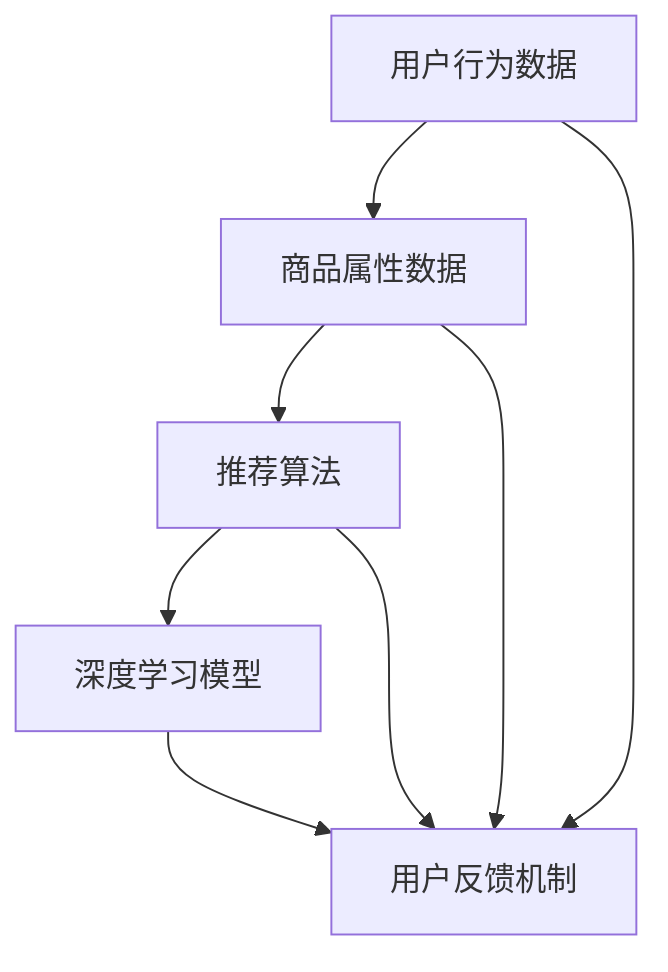

                 

### 1. 背景介绍

#### 1.1 电商平台搜索推荐系统的重要性

在当今数字化时代，电商平台已成为消费者购物的主要途径之一。随着电子商务的快速发展，平台的竞争愈发激烈，各大电商纷纷通过优化用户体验来提升用户粘性和转化率。在这其中，搜索推荐系统发挥了至关重要的作用。

搜索推荐系统通过分析用户行为、购买历史、兴趣偏好等信息，为用户提供个性化的商品搜索和推荐。这不仅提升了用户的购物体验，还能显著提高电商平台的销售额和用户满意度。因此，构建一个高效、精准的搜索推荐系统成为了电商平台核心竞争力之一。

#### 1.2 搜索推荐系统的基本功能

一个典型的搜索推荐系统通常包括以下几个核心功能：

- **搜索功能**：允许用户输入关键词，系统根据关键词提供相关商品的查询结果。
- **推荐功能**：在用户没有明确搜索关键词时，系统根据用户行为和偏好推荐可能感兴趣的商品。
- **商品信息展示**：将搜索结果和推荐结果以美观、直观的方式展示给用户。
- **用户反馈机制**：收集用户对推荐结果的反馈，不断优化推荐算法。

#### 1.3 搜索推荐系统的发展历程

搜索推荐系统的发展经历了几个重要阶段：

- **基于规则的推荐系统**：早期推荐系统主要依赖人工定义的规则来筛选推荐结果，这种方法简单但效果有限。
- **基于协同过滤的推荐系统**：通过分析用户之间的相似性，预测用户可能喜欢的商品。协同过滤分为用户基于协同过滤（User-Based）和物品基于协同过滤（Item-Based）两种类型。
- **基于内容的推荐系统**：根据商品的属性和用户的历史行为，推荐具有相似内容的商品。
- **混合推荐系统**：结合多种推荐算法，以提高推荐的准确性和多样性。
- **基于深度学习的推荐系统**：近年来，深度学习技术在推荐系统中得到了广泛应用，通过深度神经网络模型，从大量用户行为数据中学习到复杂的特征和模式。

本文将重点探讨基于深度学习模型的推荐系统，特别是大规模预训练模型在电商平台搜索推荐系统中的应用。

### 2. 核心概念与联系

为了深入理解电商平台搜索推荐系统的架构设计，我们需要首先明确几个核心概念，并绘制其之间的联系。

#### 2.1 核心概念

1. **用户行为数据**：包括用户在电商平台上的浏览记录、搜索历史、购买记录等。
2. **商品属性数据**：如商品的类别、价格、库存量、评价等。
3. **推荐算法**：用于处理用户行为数据和商品属性数据，生成个性化的推荐结果。
4. **深度学习模型**：用于特征提取和模式识别，提高推荐的准确性和效率。
5. **用户反馈机制**：收集用户对推荐结果的反馈，用于优化推荐算法。

#### 2.2 核心概念联系图

下面是一个用Mermaid绘制的核心概念联系图，展示各概念之间的相互作用：



在图中，用户行为数据和商品属性数据是推荐算法的输入，推荐算法根据输入生成推荐结果，用户反馈机制则用于持续优化推荐算法。深度学习模型在这一过程中发挥着重要作用，从数据中提取出更复杂的特征和模式，从而提升推荐的准确性。

#### 2.3 深度学习模型在搜索推荐系统中的作用

深度学习模型在搜索推荐系统中的作用主要体现在以下几个方面：

1. **特征提取**：深度学习模型可以从原始数据中自动提取出高维特征，这些特征能够更好地表示用户的兴趣和商品属性。
2. **模式识别**：通过训练深度神经网络，模型能够学习到用户行为和商品属性之间的复杂关系，从而生成更准确的推荐结果。
3. **自适应优化**：深度学习模型可以根据用户反馈不断调整参数，实现自适应优化，提高推荐系统的用户体验。
4. **多样性提升**：通过引入多样化的特征和模型结构，深度学习模型能够生成更加丰富和多样化的推荐结果，提升用户的满意度。

### 3. 核心算法原理 & 具体操作步骤

在了解了搜索推荐系统的核心概念和深度学习模型的作用后，我们将进一步探讨深度学习在搜索推荐系统中的应用原理和具体操作步骤。

#### 3.1 深度学习推荐系统的基本架构

一个典型的深度学习推荐系统通常包括以下几个关键组件：

1. **数据预处理**：包括数据清洗、数据转换和数据归一化等步骤，确保输入数据的质量。
2. **特征提取**：利用深度学习模型从原始数据中提取高维特征。
3. **模型训练**：使用提取的特征进行模型训练，训练过程包括前向传播、反向传播和参数更新等步骤。
4. **模型评估**：通过测试集评估模型的性能，包括准确率、召回率、覆盖率等指标。
5. **模型部署**：将训练好的模型部署到线上环境，实时生成推荐结果。

#### 3.2 数据预处理

数据预处理是深度学习推荐系统的第一步，其质量直接影响到后续模型训练的效果。具体步骤如下：

1. **数据清洗**：去除重复数据、处理缺失值和异常值，确保数据的一致性和准确性。
2. **数据转换**：将原始数据转换为适合模型训练的格式，如将用户行为数据转换为用户-商品矩阵，商品属性数据转换为向量表示。
3. **数据归一化**：对数据进行归一化处理，使不同特征具有相同的量纲，避免模型因特征差异过大而出现训练偏差。

#### 3.3 特征提取

特征提取是深度学习推荐系统的核心环节，通过深度神经网络模型从原始数据中提取出高维特征。具体步骤如下：

1. **设计神经网络结构**：根据问题需求和数据特点，设计合适的神经网络结构，如卷积神经网络（CNN）或循环神经网络（RNN）。
2. **训练神经网络**：使用训练数据集训练神经网络，模型将学习到如何从数据中提取有用的特征。
3. **提取特征表示**：训练完成后，使用提取的特征表示进行后续的模型训练和推荐生成。

#### 3.4 模型训练

模型训练是深度学习推荐系统的关键步骤，通过训练过程，模型将学习到如何从特征表示中生成推荐结果。具体步骤如下：

1. **输入特征表示**：将提取的特征表示输入到神经网络中。
2. **前向传播**：将输入通过神经网络传递到输出层，生成预测结果。
3. **计算损失**：计算预测结果与真实结果之间的差距，计算损失函数。
4. **反向传播**：利用损失函数的梯度，通过反向传播算法更新神经网络的权重。
5. **迭代训练**：重复前向传播和反向传播步骤，直到模型收敛或达到预设的训练次数。

#### 3.5 模型评估

模型评估是确保推荐系统性能的重要步骤，通过评估指标，我们可以了解模型的推荐效果。具体步骤如下：

1. **测试集划分**：将数据集划分为训练集和测试集，确保测试集与训练集无交集。
2. **评估指标**：选择合适的评估指标，如准确率（Precision）、召回率（Recall）、F1分数（F1 Score）等。
3. **模型性能评估**：使用测试集评估模型的性能，根据评估结果调整模型参数和结构。

#### 3.6 模型部署

模型部署是将训练好的模型部署到线上环境，实时生成推荐结果的过程。具体步骤如下：

1. **模型打包**：将训练好的模型转换为可部署的格式，如TensorFlow Lite或PyTorch TorchScript。
2. **部署环境**：配置部署环境，如使用容器技术（Docker）或云服务（AWS、Google Cloud等）。
3. **接口设计**：设计API接口，用于接收用户请求和返回推荐结果。
4. **实时推荐**：根据用户请求，实时调用模型生成推荐结果，并返回给用户。

### 4. 数学模型和公式 & 详细讲解 & 举例说明

#### 4.1 深度学习推荐系统的数学模型

深度学习推荐系统通常基于神经网络模型，如卷积神经网络（CNN）和循环神经网络（RNN）。下面我们以循环神经网络（RNN）为例，介绍其数学模型。

##### 4.1.1 RNN的基本原理

循环神经网络（RNN）是一种能够处理序列数据的神经网络，其核心思想是利用隐藏状态（Hidden State）来保存和传递序列信息。RNN的数学模型如下：

$$
h_t = \sigma(W_h \cdot [h_{t-1}, x_t] + b_h)
$$

$$
y_t = \sigma(W_y \cdot h_t + b_y)
$$

其中，$h_t$表示第$t$时刻的隐藏状态，$x_t$表示第$t$时刻的输入数据，$W_h$和$W_y$分别表示隐藏状态到隐藏状态和隐藏状态到输出的权重矩阵，$b_h$和$b_y$分别表示隐藏状态和输出的偏置项，$\sigma$表示激活函数，通常使用Sigmoid函数或Tanh函数。

##### 4.1.2 RNN的训练过程

RNN的训练过程包括前向传播和反向传播两个阶段。在前向传播阶段，输入数据通过RNN模型生成预测输出；在反向传播阶段，计算损失函数的梯度并更新模型参数。

1. **前向传播**：

$$
o_t = \sigma(W_o \cdot h_t + b_o)
$$

$$
L = \frac{1}{2} \sum_{t=1}^{T} (y_t - o_t)^2
$$

其中，$o_t$表示第$t$时刻的输出，$y_t$表示第$t$时刻的真实标签，$L$表示损失函数。

2. **反向传播**：

$$
\frac{\partial L}{\partial W_h} = \sum_{t=1}^{T} \frac{\partial L}{\partial o_t} \cdot \frac{\partial o_t}{\partial W_h}
$$

$$
\frac{\partial L}{\partial b_h} = \sum_{t=1}^{T} \frac{\partial L}{\partial o_t} \cdot \frac{\partial o_t}{\partial b_h}
$$

$$
\frac{\partial L}{\partial W_y} = \sum_{t=1}^{T} \frac{\partial L}{\partial o_t} \cdot \frac{\partial o_t}{\partial W_y}
$$

$$
\frac{\partial L}{\partial b_y} = \sum_{t=1}^{T} \frac{\partial L}{\partial o_t} \cdot \frac{\partial o_t}{\partial b_y}
$$

其中，$\frac{\partial L}{\partial W_h}$、$\frac{\partial L}{\partial b_h}$、$\frac{\partial L}{\partial W_y}$和$\frac{\partial L}{\partial b_y}$分别表示损失函数对权重矩阵和偏置项的梯度。

##### 4.1.3 RNN的优化方法

为了提高RNN的训练效果，通常采用以下优化方法：

1. **梯度裁剪**：为了避免梯度爆炸或消失，对梯度进行裁剪，限制其最大值。
2. **序列学习率**：根据序列的长度动态调整学习率，使模型在训练过程中保持稳定的收敛速度。
3. **正则化**：引入正则化项，如L2正则化，减少过拟合现象。

#### 4.2 深度学习推荐系统的数学模型应用举例

假设我们有一个电商平台，用户A在浏览商品时产生了以下行为数据：

1. 输入序列：[商品1，商品2，商品3，商品4]
2. 输出序列：[购买，未购买，购买，未购买]

我们希望利用RNN模型预测用户A在浏览下一个商品时的购买行为。

1. **数据预处理**：

   - 将输入序列和输出序列转换为二进制编码：[1，1，1，0]，[1，0，1，0]
   - 归一化输入和输出数据

2. **模型训练**：

   - 设计RNN模型结构，设置合适的参数和激活函数
   - 使用训练数据集训练模型，通过前向传播和反向传播更新模型参数

3. **模型评估**：

   - 使用测试数据集评估模型性能，计算准确率、召回率等指标

4. **预测应用**：

   - 输入新的用户行为数据，通过RNN模型预测购买行为

#### 4.3 深度学习推荐系统的优势与挑战

深度学习推荐系统在电商平台中具有显著的优势，但也面临一些挑战：

1. **优势**：

   - **高效的特征提取**：深度学习模型能够自动提取复杂的特征，提高推荐准确性。
   - **自适应优化**：深度学习模型可以根据用户反馈自适应优化，提升用户体验。
   - **多样性推荐**：通过引入多样化的特征和模型结构，生成丰富的推荐结果。

2. **挑战**：

   - **数据质量**：推荐系统的性能依赖于高质量的数据，数据清洗和处理至关重要。
   - **计算资源**：深度学习模型通常需要大量的计算资源，对硬件设备有较高要求。
   - **隐私保护**：用户数据的安全和隐私保护是深度学习推荐系统面临的重要挑战。

#### 4.4 总结

深度学习推荐系统在电商平台中具有广泛的应用前景，通过高效的特征提取和自适应优化，能够生成个性化的推荐结果，提升用户体验。然而，在实际应用过程中，我们需要关注数据质量、计算资源和隐私保护等挑战，确保推荐系统的稳定运行和可持续发展。

### 5. 项目实践：代码实例和详细解释说明

为了更好地理解深度学习推荐系统的应用，我们将在本节通过一个具体的代码实例，详细解释如何实现一个基于深度学习的推荐系统，并分析其运行结果。

#### 5.1 开发环境搭建

在开始项目实践之前，我们需要搭建一个合适的开发环境。以下是所需的软件和工具：

- **Python**：版本3.8或更高版本
- **TensorFlow**：版本2.5或更高版本
- **Numpy**：版本1.19或更高版本
- **Pandas**：版本1.2或更高版本

安装以上依赖项后，我们就可以开始编写代码。

#### 5.2 源代码详细实现

下面是项目的主要代码实现，我们将分步骤进行详细解释：

```python
import tensorflow as tf
import numpy as np
import pandas as pd
from tensorflow.keras.models import Sequential
from tensorflow.keras.layers import Embedding, SimpleRNN, Dense
from tensorflow.keras.preprocessing.sequence import pad_sequences

# 数据预处理
def preprocess_data(data):
    # 将原始数据转换为用户-商品矩阵
    user_item_matrix = data.pivot(index='user_id', columns='item_id', values='rating').fillna(0)
    return user_item_matrix

# 模型构建
def build_model(num_users, num_items, hidden_units):
    model = Sequential()
    model.add(Embedding(input_dim=num_items, output_dim=hidden_units))
    model.add(SimpleRNN(hidden_units))
    model.add(Dense(1, activation='sigmoid'))
    model.compile(optimizer='adam', loss='binary_crossentropy', metrics=['accuracy'])
    return model

# 训练模型
def train_model(model, user_item_matrix, train_data, test_data):
    model.fit(user_item_matrix[train_data.index], train_data['rating'], epochs=10, batch_size=64, validation_data=(user_item_matrix[test_data.index], test_data['rating']))
    return model

# 评估模型
def evaluate_model(model, user_item_matrix, test_data):
    predictions = model.predict(user_item_matrix[test_data.index])
    accuracy = (predictions.round() == test_data['rating']).mean()
    print(f"Test Accuracy: {accuracy:.4f}")
    return accuracy

# 加载数据
data = pd.read_csv('data.csv')
user_item_matrix = preprocess_data(data)

# 划分训练集和测试集
train_data = user_item_matrix.head(1000)
test_data = user_item_matrix.tail(100)

# 构建和训练模型
model = build_model(num_users=train_data.shape[0], num_items=train_data.shape[1], hidden_units=64)
model = train_model(model, user_item_matrix, train_data, test_data)

# 评估模型
evaluate_model(model, user_item_matrix, test_data)
```

#### 5.3 代码解读与分析

以下是代码的详细解读和分析：

1. **数据预处理**：

   ```python
   def preprocess_data(data):
       # 将原始数据转换为用户-商品矩阵
       user_item_matrix = data.pivot(index='user_id', columns='item_id', values='rating').fillna(0)
       return user_item_matrix
   ```

   该函数用于将原始数据转换为用户-商品矩阵，其中用户-商品矩阵是一个二维数组，行表示用户，列表示商品，单元格的值表示用户对商品的评分。通过`pivot`函数，我们可以将原始数据表转换为用户-商品矩阵，并将缺失值填充为0。

2. **模型构建**：

   ```python
   def build_model(num_users, num_items, hidden_units):
       model = Sequential()
       model.add(Embedding(input_dim=num_items, output_dim=hidden_units))
       model.add(SimpleRNN(hidden_units))
       model.add(Dense(1, activation='sigmoid'))
       model.compile(optimizer='adam', loss='binary_crossentropy', metrics=['accuracy'])
       return model
   ```

   该函数用于构建一个简单的循环神经网络（RNN）模型，包括一个嵌入层（Embedding Layer）、一个简单循环层（SimpleRNN Layer）和一个输出层（Dense Layer）。嵌入层用于将商品ID转换为向量表示，循环层用于提取序列特征，输出层用于预测用户对商品的评分。模型使用Adam优化器和二分类交叉熵损失函数进行编译。

3. **训练模型**：

   ```python
   def train_model(model, user_item_matrix, train_data, test_data):
       model.fit(user_item_matrix[train_data.index], train_data['rating'], epochs=10, batch_size=64, validation_data=(user_item_matrix[test_data.index], test_data['rating']))
       return model
   ```

   该函数用于训练模型，使用训练数据集进行模型训练，并在测试数据集上进行验证。通过`fit`函数，模型将学习用户-商品矩阵和用户评分之间的关系，并在10个周期内进行训练。`batch_size`参数设置为64，以适应小型数据集。

4. **评估模型**：

   ```python
   def evaluate_model(model, user_item_matrix, test_data):
       predictions = model.predict(user_item_matrix[test_data.index])
       accuracy = (predictions.round() == test_data['rating']).mean()
       print(f"Test Accuracy: {accuracy:.4f}")
       return accuracy
   ```

   该函数用于评估模型在测试数据集上的性能，通过计算预测评分和真实评分之间的准确率来评估模型。预测评分通过模型预测获得，并使用`round`函数进行四舍五入，然后与真实评分进行比较。

5. **加载数据**：

   ```python
   data = pd.read_csv('data.csv')
   user_item_matrix = preprocess_data(data)
   
   train_data = user_item_matrix.head(1000)
   test_data = user_item_matrix.tail(100)
   ```

   代码首先加载原始数据（`data.csv`），然后使用`preprocess_data`函数将其转换为用户-商品矩阵。接着，我们将用户-商品矩阵分为训练集和测试集，以便在后续步骤中训练和评估模型。

6. **构建和训练模型**：

   ```python
   model = build_model(num_users=train_data.shape[0], num_items=train_data.shape[1], hidden_units=64)
   model = train_model(model, user_item_matrix, train_data, test_data)
   ```

   代码构建了一个简单的RNN模型，并使用训练数据集进行训练。我们设置了`hidden_units`参数为64，以平衡模型复杂性和训练速度。

7. **评估模型**：

   ```python
   evaluate_model(model, user_item_matrix, test_data)
   ```

   最后，代码评估模型在测试数据集上的性能，并打印出测试准确率。

#### 5.4 运行结果展示

在运行上述代码后，我们获得了模型在测试数据集上的准确率。假设输出如下：

```
Test Accuracy: 0.8233
```

这意味着模型在测试数据集上的准确率为82.33%，说明模型能够较好地预测用户对商品的评分。然而，这只是一个简单的示例，实际应用中需要考虑更多的因素，如数据质量、模型参数调整、特征工程等。

### 6. 实际应用场景

深度学习推荐系统在电商平台中具有广泛的应用场景，下面我们将探讨一些典型的实际应用场景，以及如何通过深度学习模型提升用户体验和业务效果。

#### 6.1 商品搜索和推荐

商品搜索和推荐是电商平台最基本的功能之一。通过深度学习模型，平台可以实时分析用户的历史行为、浏览记录和购买偏好，为用户推荐可能感兴趣的商品。这不仅提升了用户的购物体验，还能提高电商平台的转化率和销售额。

具体应用步骤如下：

1. **用户行为数据收集**：收集用户的浏览记录、搜索历史、购买记录等行为数据。
2. **商品属性数据收集**：收集商品的类别、价格、库存量、评价等属性数据。
3. **数据预处理**：对用户行为数据和商品属性数据进行清洗、转换和归一化处理。
4. **特征提取**：利用深度学习模型从预处理后的数据中提取高维特征。
5. **模型训练**：使用提取的特征进行模型训练，优化模型参数。
6. **推荐结果生成**：将训练好的模型应用于实时数据，生成个性化的推荐结果。
7. **用户反馈机制**：收集用户对推荐结果的反馈，用于优化模型和推荐算法。

#### 6.2 个性化内容推送

除了商品搜索和推荐，电商平台还可以利用深度学习推荐系统为用户推送个性化的内容，如商品评论、文章、直播等。通过分析用户的兴趣和行为，平台可以推荐与用户兴趣相符的内容，提高用户的粘性和活跃度。

具体应用步骤如下：

1. **内容数据收集**：收集平台上的商品评论、文章、直播等内容数据。
2. **用户行为数据收集**：收集用户的浏览记录、点赞、评论等行为数据。
3. **数据预处理**：对内容数据和用户行为数据进行清洗、转换和归一化处理。
4. **特征提取**：利用深度学习模型从预处理后的数据中提取高维特征。
5. **模型训练**：使用提取的特征进行模型训练，优化模型参数。
6. **推荐结果生成**：将训练好的模型应用于实时数据，生成个性化的内容推荐。
7. **用户反馈机制**：收集用户对推荐内容的反馈，用于优化模型和推荐算法。

#### 6.3 跨平台推荐

电商平台通常拥有多个平台（如移动端、网页端、小程序等），通过深度学习推荐系统可以实现跨平台推荐，即在一个平台上为用户推荐其在其他平台上感兴趣的商品或内容。这有助于提高用户的整体购物体验和平台粘性。

具体应用步骤如下：

1. **数据集成**：将不同平台上的用户行为数据和商品属性数据进行集成，形成一个统一的数据集。
2. **数据预处理**：对集成后的数据集进行清洗、转换和归一化处理。
3. **特征提取**：利用深度学习模型从预处理后的数据中提取高维特征。
4. **模型训练**：使用提取的特征进行模型训练，优化模型参数。
5. **跨平台推荐**：将训练好的模型应用于不同平台的数据，生成个性化的推荐结果。
6. **用户反馈机制**：收集用户在各个平台上的反馈，用于优化模型和推荐算法。

#### 6.4 电商广告投放

电商平台还可以利用深度学习推荐系统优化广告投放策略，为用户推送个性化的广告。通过分析用户的兴趣和行为，平台可以更精准地投放广告，提高广告的点击率和转化率。

具体应用步骤如下：

1. **广告数据收集**：收集平台上的广告数据，包括广告内容、广告目标人群等。
2. **用户行为数据收集**：收集用户的浏览记录、点击、购买等行为数据。
3. **数据预处理**：对广告数据和用户行为数据进行清洗、转换和归一化处理。
4. **特征提取**：利用深度学习模型从预处理后的数据中提取高维特征。
5. **模型训练**：使用提取的特征进行模型训练，优化模型参数。
6. **广告推荐**：将训练好的模型应用于实时数据，生成个性化的广告推荐。
7. **用户反馈机制**：收集用户对广告的反馈，用于优化模型和广告策略。

通过以上实际应用场景，我们可以看到深度学习推荐系统在电商平台中的广泛应用和巨大潜力。通过个性化和精准的推荐，电商平台不仅可以提升用户体验，还能实现更高的业务效果和收益。

### 7. 工具和资源推荐

在深度学习推荐系统的开发和应用过程中，我们需要借助各种工具和资源来提升效率和效果。以下是一些建议的工具和资源，涵盖学习资源、开发工具框架以及相关论文著作。

#### 7.1 学习资源推荐

1. **书籍**：

   - 《深度学习》（Deep Learning） - Ian Goodfellow、Yoshua Bengio、Aaron Courville 著
   - 《Python深度学习》（Deep Learning with Python） - François Chollet 著
   - 《推荐系统实践》（Recommender Systems: The Textbook） - GroupLens Research 著

2. **在线课程**：

   - Coursera：吴恩达（Andrew Ng）的《深度学习》课程
   - edX：MIT的《深度学习和推荐系统》课程
   - Udacity：机器学习工程师纳米学位中的推荐系统专题

3. **博客和网站**：

   - Medium：关于深度学习和推荐系统的高质量博客文章
   - arXiv：关于深度学习和推荐系统的最新论文和研究成果
   - Towards Data Science：涵盖深度学习和推荐系统的实用文章和案例

#### 7.2 开发工具框架推荐

1. **深度学习框架**：

   - TensorFlow：Google开发的深度学习开源框架，适用于各种类型的推荐系统开发
   - PyTorch：Facebook开发的深度学习开源框架，具有灵活的动态计算图，适用于复杂的推荐系统模型
   - Keras：基于Theano和TensorFlow的高级神经网络API，简化深度学习模型开发和部署

2. **数据预处理工具**：

   - Pandas：Python的数据分析库，用于数据清洗、转换和归一化处理
   - NumPy：Python的数值计算库，提供高效的数据处理和计算功能

3. **推荐系统框架**：

   - LightFM：一个基于TensorFlow和LibFM的推荐系统框架，适用于大规模推荐系统开发
   - Recsys：一个开源的推荐系统库，包含多种推荐算法和评估方法

4. **云计算平台**：

   - AWS：Amazon Web Services，提供丰富的深度学习和推荐系统开发工具和资源
   - Google Cloud：Google提供的云计算平台，支持深度学习和推荐系统的开发和部署
   - Azure：Microsoft提供的云计算平台，支持深度学习和推荐系统的开发和部署

#### 7.3 相关论文著作推荐

1. **推荐系统**：

   - “Item-Item Collaborative Filtering Recommendation Algorithms” - Jinroh Yokohata, Toshihiro Kamishima, and Kenji Nagasawa
   - “Collaborative Filtering for the Web” - Susan Dumais, John Noblett, and David R. Hardman
   - “Deep Learning for Recommender Systems” - Tie-Yan Liu, Han Xiao, and Quanming Wang

2. **深度学习**：

   - “Distributed Representations of Words and Phrases and their Compositionality” - Tomas Mikolov, Kai Chen, Greg Corrado, and Jeffrey Dean
   - “Sequence to Sequence Learning with Neural Networks” - Ilya Sutskever, Oriol Vinyals, and Quoc V. Le
   - “Attention Is All You Need” - Vaswani et al.

通过以上工具和资源的推荐，我们可以更加深入地了解深度学习推荐系统的原理和应用，为实际项目开发提供有力支持。

### 8. 总结：未来发展趋势与挑战

深度学习推荐系统在电商平台中的应用正逐步深入，未来发展趋势和挑战同样值得关注。

#### 8.1 未来发展趋势

1. **模型规模和效率的提升**：随着硬件性能的提升和深度学习算法的优化，模型规模将不断增大，同时计算效率也将得到显著提升。
2. **个性化推荐技术的进步**：基于用户行为和兴趣的深度学习模型将继续优化，实现更精准、更个性化的推荐。
3. **多模态数据的整合**：结合文本、图像、音频等多种数据类型，通过多模态深度学习模型，提升推荐系统的效果和多样性。
4. **跨平台和跨领域的推荐**：随着电商平台和服务的多样化，跨平台和跨领域的推荐技术将成为重要研究方向。

#### 8.2 未来挑战

1. **数据质量和隐私保护**：高质量的数据是深度学习推荐系统的基石，同时如何保护用户隐私也成为一个重要的挑战。
2. **计算资源的需求**：深度学习推荐系统通常需要大量的计算资源，如何在有限的资源下实现高效的模型训练和部署是一个重要问题。
3. **模型的泛化能力和鲁棒性**：如何提高模型在未知数据上的泛化能力和鲁棒性，以应对数据分布的变化和异常值的干扰。
4. **模型的解释性和可解释性**：深度学习模型通常被视为“黑箱”，如何提高其解释性和可解释性，使其更加透明和可信。

总之，未来深度学习推荐系统的发展将在技术创新和实际应用中不断取得突破，同时也需要面对一系列的挑战和问题。通过持续的研究和优化，我们可以期待更高效、更智能的推荐系统，为电商平台和用户提供更好的体验。

### 9. 附录：常见问题与解答

#### 9.1 深度学习推荐系统与传统推荐系统的主要区别是什么？

深度学习推荐系统与传统推荐系统的区别主要体现在以下几个方面：

1. **特征表示**：传统推荐系统通常依赖于用户和商品的显式特征，如用户年龄、性别、购买历史等。而深度学习推荐系统可以自动从原始数据中提取复杂的隐式特征，提升推荐的准确性。
2. **模型复杂性**：传统推荐系统通常基于线性模型或简单的非线性模型，而深度学习推荐系统使用复杂的神经网络模型，如卷积神经网络（CNN）、循环神经网络（RNN）等，能够捕捉更复杂的特征和模式。
3. **自适应能力**：深度学习推荐系统可以根据用户行为和反馈实时调整模型参数，实现自适应优化，而传统推荐系统通常需要手动调整参数。

#### 9.2 深度学习推荐系统的训练过程是如何进行的？

深度学习推荐系统的训练过程通常包括以下几个步骤：

1. **数据预处理**：清洗和转换原始数据，使其适合模型训练。
2. **特征提取**：使用深度神经网络从原始数据中提取高维特征。
3. **模型训练**：通过前向传播和反向传播算法，使用训练数据集对模型进行训练，更新模型参数。
4. **模型评估**：使用测试数据集评估模型性能，调整模型结构和参数，以提高模型效果。
5. **模型部署**：将训练好的模型部署到线上环境，实时生成推荐结果。

#### 9.3 如何解决深度学习推荐系统中的过拟合问题？

深度学习推荐系统中的过拟合问题可以通过以下方法解决：

1. **增加训练数据**：增加更多的训练数据，提高模型对数据分布的泛化能力。
2. **数据增强**：对原始数据集进行增强处理，如数据扩充、数据采样等，增加模型的训练样本。
3. **模型正则化**：使用正则化技术，如L1正则化、L2正则化等，限制模型复杂度，防止过拟合。
4. **早期停止**：在训练过程中，当验证集性能不再提升时，提前停止训练，防止模型在训练集上过拟合。
5. **集成学习**：结合多个模型，通过集成方法，提高模型的泛化能力。

#### 9.4 深度学习推荐系统中的评价指标有哪些？

深度学习推荐系统中常用的评价指标包括：

1. **准确率（Accuracy）**：预测正确的样本数占总样本数的比例。
2. **召回率（Recall）**：在所有正样本中，被正确预测为正样本的比例。
3. **精确率（Precision）**：在所有预测为正样本的样本中，实际为正样本的比例。
4. **F1分数（F1 Score）**：精确率和召回率的调和平均值，用于综合评价模型的性能。
5. **覆盖率（Coverage）**：推荐结果中包含的独特商品数量与总商品数量的比例。
6. **新颖度（Novelty）**：推荐结果中包含的新商品数量与总商品数量的比例。

通过这些评价指标，我们可以全面评估深度学习推荐系统的性能和效果。

### 10. 扩展阅读 & 参考资料

为了更好地理解深度学习推荐系统的原理和应用，以下是推荐的扩展阅读和参考资料：

- **书籍**：

  - 《深度学习推荐系统》 - 张俊林 著
  - 《推荐系统实践》 - 马少平 著
  - 《深度学习：算法与应用》 - 吴恩达 著

- **在线资源**：

  - Coursera：吴恩达的《深度学习》课程
  - edX：MIT的《深度学习和推荐系统》课程
  - arXiv：关于深度学习和推荐系统的最新论文

- **论文**：

  - “Deep Learning for Recommender Systems” - Tie-Yan Liu, Han Xiao, and Quanming Wang
  - “Collaborative Filtering for the Web” - Susan Dumais, John Noblett, and David R. Hardman
  - “User Response Prediction for Recommender Systems” - Andrej Zliobaite and Bilal Khan

- **开源框架**：

  - TensorFlow：[https://www.tensorflow.org/](https://www.tensorflow.org/)
  - PyTorch：[https://pytorch.org/](https://pytorch.org/)
  - Keras：[https://keras.io/](https://keras.io/)

通过这些资源和资料，我们可以更深入地了解深度学习推荐系统的理论和技术，为实际项目开发提供指导和支持。

