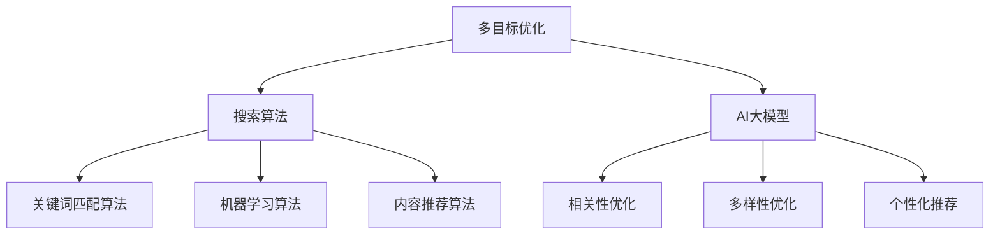

                 

### 文章标题

《电商平台搜索结果多样性与相关性平衡：AI大模型的多目标优化》

关键词：电商平台、搜索结果多样性、相关性平衡、AI大模型、多目标优化、搜索算法、用户满意度、个性化推荐

摘要：本文旨在探讨电商平台在搜索结果多样性与相关性平衡方面所面临的挑战，以及如何通过AI大模型的多目标优化实现最优解。文章首先介绍电商平台的搜索背景和用户需求，然后详细阐述了多样性和相关性平衡的概念及其在搜索结果中的重要性。接下来，我们深入分析了当前主流的搜索算法和现有研究，并引入了AI大模型在多目标优化中的关键作用。文章还通过具体的项目实践，展示了如何在实际应用中实现搜索结果的多样性与相关性平衡。最后，我们对未来发展趋势与挑战进行了展望，并提供了相关的学习资源和开发工具推荐。

### 1. 背景介绍

随着电子商务的迅猛发展，电商平台已经成为消费者购买商品的重要渠道。然而，随着平台上的商品种类和数量急剧增加，如何为用户提供精准且多样化的搜索结果成为电商企业亟待解决的问题。

#### 用户需求

用户在电商平台上的搜索需求可以概括为以下几点：

1. **相关性**：用户希望搜索结果中的商品与其查询意图高度相关，以便快速找到所需商品。
2. **多样性**：用户也希望搜索结果能够展示多种类型的商品，以便进行比较和选择。
3. **个性化**：用户期望搜索结果能够根据其历史行为和偏好进行个性化推荐。

#### 搜索算法现状

为了满足用户需求，电商平台采用了各种搜索算法。这些算法主要包括：

1. **基于关键词匹配**：通过用户输入的关键词与商品标题、描述等内容的匹配，实现搜索结果的相关性。
2. **基于机器学习**：利用用户的历史行为数据，通过机器学习算法为用户推荐相关性较高的商品。
3. **基于内容推荐**：基于商品的内容属性，如品类、品牌、价格等，进行内容推荐。

尽管这些算法在一定程度上提高了搜索结果的准确性和多样性，但仍存在以下挑战：

1. **相关性不足**：在大量商品中，如何确保搜索结果与用户意图高度相关，是当前算法面临的一大难题。
2. **多样性不足**：现有的算法往往在提高相关性的同时，牺牲了结果的多样性，导致用户无法进行有效比较。
3. **个性化不足**：用户的历史行为和偏好复杂多变，现有算法难以全面捕捉和利用这些信息进行个性化推荐。

#### 多目标优化

面对上述挑战，多目标优化成为解决多样性与相关性平衡问题的关键。多目标优化旨在同时优化多个相互冲突的目标，从而实现全局最优解。在电商平台搜索结果优化中，多目标优化可以通过以下方式实现：

1. **相关性最大化**：通过调整算法参数和特征选择，提高搜索结果与用户意图的相关性。
2. **多样性最大化**：通过引入多样性度量指标和算法，提高搜索结果的多样性。
3. **个性化推荐**：结合用户历史行为和偏好，为用户推荐个性化搜索结果。

本文将深入探讨如何利用AI大模型实现多目标优化，从而在电商平台搜索结果多样性与相关性平衡方面取得突破性进展。

### 2. 核心概念与联系

为了深入理解电商平台搜索结果多样性与相关性平衡的多目标优化，我们需要明确以下核心概念及其相互关系。

#### 多目标优化

多目标优化（Multi-Objective Optimization）是一种旨在同时优化多个相互冲突的目标的算法。在电商平台搜索结果优化中，主要涉及以下三个目标：

1. **相关性最大化**：提高搜索结果与用户查询意图的相关性。
2. **多样性最大化**：增加搜索结果的多样性，使用户能够进行比较和选择。
3. **个性化推荐**：根据用户的历史行为和偏好，提供个性化搜索结果。

这些目标之间存在一定的冲突，例如提高相关性可能导致多样性降低，而增加多样性可能会影响相关性。因此，多目标优化需要找到一种平衡，以实现全局最优解。

#### 搜索算法

搜索算法是实现多目标优化的关键工具。在电商平台中，常见的搜索算法包括基于关键词匹配的算法、基于机器学习的算法和基于内容推荐的算法。每种算法都有其优势和局限性。

1. **基于关键词匹配的算法**：通过用户输入的关键词与商品标题、描述等内容的匹配，实现搜索结果的相关性。优点是简单高效，缺点是容易导致搜索结果同质化，缺乏多样性。
2. **基于机器学习的算法**：利用用户的历史行为数据，通过机器学习算法为用户推荐相关性较高的商品。优点是能够根据用户行为进行个性化推荐，缺点是模型训练复杂度较高，且对数据量要求较大。
3. **基于内容推荐的算法**：基于商品的内容属性，如品类、品牌、价格等，进行内容推荐。优点是能够提高多样性，缺点是相关性可能较低，无法满足用户的个性化需求。

#### AI大模型

AI大模型（AI Large Model）是近年来在人工智能领域取得的重要进展。它具有以下特点：

1. **大规模**：AI大模型通常由数十亿甚至千亿个参数组成，具有庞大的模型规模。
2. **高效性**：通过深度学习等技术，AI大模型能够在复杂的数据中快速提取特征，实现高效的目标优化。
3. **灵活性**：AI大模型可以根据不同的任务和数据特点进行定制化，实现灵活的目标优化。

在电商平台搜索结果优化中，AI大模型可以用于以下几个方面：

1. **相关性优化**：通过训练大规模模型，提取用户查询意图和商品特征之间的相关性，实现相关性最大化。
2. **多样性优化**：通过引入多样性度量指标和算法，利用AI大模型提高搜索结果的多样性。
3. **个性化推荐**：结合用户的历史行为和偏好，利用AI大模型为用户推荐个性化搜索结果。

#### 关系图

为了更好地理解上述核心概念之间的联系，我们可以使用Mermaid流程图（Mermaid 流程节点中不要有括号、逗号等特殊字符）来展示它们之间的关系。



图1：核心概念与联系

从图1中可以看出，多目标优化是电商平台搜索结果多样性与相关性平衡的核心。搜索算法是实现多目标优化的关键工具，而AI大模型则提供了高效的优化手段。通过关键词匹配算法、机器学习算法和内容推荐算法，AI大模型可以实现相关性、多样性和个性化推荐的目标。

### 3. 核心算法原理 & 具体操作步骤

在电商平台搜索结果多样性与相关性平衡的多目标优化中，AI大模型发挥着关键作用。以下将详细阐述AI大模型的核心算法原理及具体操作步骤。

#### 3.1 相关性优化

相关性优化旨在提高搜索结果与用户查询意图的相关性。具体操作步骤如下：

1. **数据收集**：首先，需要收集用户在电商平台上的历史行为数据，包括搜索记录、购买记录、浏览记录等。这些数据将用于训练AI大模型。
2. **特征提取**：对收集到的数据进行预处理，提取用户查询意图和商品特征。例如，可以将用户查询记录中的关键词进行词频统计，将商品描述中的关键词进行提取和分类。
3. **模型训练**：利用训练数据，通过深度学习技术训练AI大模型。常见的深度学习模型包括卷积神经网络（CNN）、循环神经网络（RNN）和Transformer模型等。这些模型可以自动提取用户查询意图和商品特征之间的相关性。
4. **相关性评估**：在模型训练过程中，需要评估搜索结果的相关性。常见的相关性评估指标包括准确率（Accuracy）、召回率（Recall）和F1分数（F1 Score）等。
5. **模型优化**：根据相关性评估结果，对模型进行优化。可以通过调整模型参数、特征选择和超参数调优等方式，提高相关性。

#### 3.2 多样性优化

多样性优化旨在提高搜索结果的多样性。具体操作步骤如下：

1. **多样性度量**：首先，需要定义多样性度量指标，以评估搜索结果的多样性。常见的多样性度量指标包括商品品类多样性、价格区间多样性、品牌多样性等。
2. **特征融合**：将不同的多样性度量指标进行融合，形成一个综合的多样性度量指标。例如，可以将商品品类多样性和价格区间多样性进行加权求和，得到一个综合多样性度量值。
3. **多样性评估**：在模型训练过程中，需要评估搜索结果的多样性。可以通过计算综合多样性度量值，评估搜索结果的多样性。
4. **多样性优化**：根据多样性评估结果，对模型进行优化。可以通过调整多样性度量指标的权重、特征选择和超参数调优等方式，提高搜索结果的多样性。

#### 3.3 个性化推荐

个性化推荐旨在根据用户的历史行为和偏好，为用户推荐个性化搜索结果。具体操作步骤如下：

1. **用户画像构建**：首先，需要构建用户画像，包括用户的基本信息、购买记录、浏览记录等。用户画像将用于描述用户的行为特征和偏好。
2. **推荐算法设计**：利用用户画像和商品特征，设计推荐算法。常见的推荐算法包括基于内容的推荐算法、基于协同过滤的推荐算法和基于深度学习的推荐算法等。
3. **模型训练**：利用用户画像和商品特征，通过训练算法生成个性化推荐结果。
4. **推荐结果评估**：评估个性化推荐结果的准确性和多样性。可以通过计算推荐结果的点击率、购买率等指标，评估推荐效果。
5. **模型优化**：根据评估结果，对推荐算法进行优化。可以通过调整算法参数、特征选择和超参数调优等方式，提高推荐结果的准确性和多样性。

#### 3.4 综合优化

在电商平台搜索结果多样性与相关性平衡的多目标优化中，需要综合考虑相关性、多样性和个性化推荐。具体操作步骤如下：

1. **目标函数设计**：设计一个综合目标函数，将相关性、多样性和个性化推荐的目标进行统一。例如，可以设计一个加权求和的目标函数，将相关性、多样性和个性化推荐的权重进行平衡。
2. **模型训练**：利用综合目标函数，通过训练AI大模型，同时优化相关性、多样性和个性化推荐。
3. **目标评估**：在模型训练过程中，需要评估综合目标函数的值，以评估模型在多目标优化方面的效果。
4. **模型优化**：根据目标评估结果，对模型进行优化。可以通过调整目标函数的权重、特征选择和超参数调优等方式，提高模型在多目标优化方面的效果。

通过以上步骤，AI大模型可以实现电商平台搜索结果多样性与相关性平衡的多目标优化。具体操作步骤需要根据实际场景和数据特点进行调整和优化。

### 4. 数学模型和公式 & 详细讲解 & 举例说明

在电商平台搜索结果多样性与相关性平衡的多目标优化中，数学模型和公式起到了至关重要的作用。以下将详细介绍相关的数学模型和公式，并进行详细讲解和举例说明。

#### 4.1 多目标优化问题

多目标优化问题（Multi-Objective Optimization Problem）可以表示为以下形式：

$$
\begin{aligned}
\min_{x} \mathcal{F}(x) \\
s.t. \quad \mathcal{G}_i(x) \leq 0, \quad i=1,2,...,m
\end{aligned}
$$

其中，$x$ 是决策变量，$\mathcal{F}(x)$ 是目标函数，$\mathcal{G}_i(x)$ 是约束条件。

在电商平台搜索结果多样性与相关性平衡的多目标优化中，目标函数 $\mathcal{F}(x)$ 可以表示为：

$$
\mathcal{F}(x) = w_1 \cdot \text{相关性} + w_2 \cdot \text{多样性} + w_3 \cdot \text{个性化推荐}
$$

其中，$w_1, w_2, w_3$ 分别是相关性、多样性和个性化推荐的权重，根据实际需求进行设定。

#### 4.2 相关性度量

在搜索结果相关性度量方面，常见的指标包括准确率（Accuracy）、召回率（Recall）和F1分数（F1 Score）等。

1. **准确率**：表示搜索结果中相关商品与用户查询意图匹配的比例，计算公式如下：

$$
\text{Accuracy} = \frac{\text{相关商品数}}{\text{总商品数}}
$$

2. **召回率**：表示搜索结果中包含的相关商品数与用户查询意图实际相关商品数的比例，计算公式如下：

$$
\text{Recall} = \frac{\text{相关商品数}}{\text{实际相关商品数}}
$$

3. **F1分数**：是准确率和召回率的加权平均，计算公式如下：

$$
\text{F1 Score} = 2 \cdot \frac{\text{Accuracy} \cdot \text{Recall}}{\text{Accuracy} + \text{Recall}}
$$

#### 4.3 多样性度量

在搜索结果多样性度量方面，常见的指标包括商品品类多样性、价格区间多样性和品牌多样性等。

1. **商品品类多样性**：表示搜索结果中包含的商品品类的数量，计算公式如下：

$$
\text{品类多样性} = \frac{\text{搜索结果中的品类数}}{\text{平台上的总品类数}}
$$

2. **价格区间多样性**：表示搜索结果中包含的商品价格区间的数量，计算公式如下：

$$
\text{价格区间多样性} = \frac{\text{搜索结果中的价格区间数}}{\text{平台上的总价格区间数}}
$$

3. **品牌多样性**：表示搜索结果中包含的商品品牌的数量，计算公式如下：

$$
\text{品牌多样性} = \frac{\text{搜索结果中的品牌数}}{\text{平台上的总品牌数}}
$$

#### 4.4 个性化推荐度量

在个性化推荐度量方面，常见的指标包括点击率（Click-Through Rate, CTR）和购买率（Purchase Rate）等。

1. **点击率**：表示用户对推荐商品点击的比例，计算公式如下：

$$
\text{CTR} = \frac{\text{点击商品数}}{\text{推荐商品数}}
$$

2. **购买率**：表示用户对推荐商品购买的比例，计算公式如下：

$$
\text{Purchase Rate} = \frac{\text{购买商品数}}{\text{推荐商品数}}
$$

#### 4.5 示例说明

假设有一个电商平台，用户查询意图为“笔记本电脑”，平台上的商品数量为1000个，其中与用户查询意图相关的商品数为50个，实际相关商品数为30个。搜索结果中包含的商品品类数为10个，价格区间数为5个，品牌数为3个。用户对推荐商品的点击率为20%，购买率为10%。

根据上述数据，我们可以计算相关性和多样性指标如下：

1. **准确性**：

$$
\text{Accuracy} = \frac{50}{1000} = 0.05
$$

2. **召回率**：

$$
\text{Recall} = \frac{50}{30} = 0.167
$$

3. **F1分数**：

$$
\text{F1 Score} = 2 \cdot \frac{0.05 \cdot 0.167}{0.05 + 0.167} = 0.097
$$

4. **品类多样性**：

$$
\text{品类多样性} = \frac{10}{10} = 1
$$

5. **价格区间多样性**：

$$
\text{价格区间多样性} = \frac{5}{5} = 1
$$

6. **品牌多样性**：

$$
\text{品牌多样性} = \frac{3}{3} = 1
$$

7. **点击率**：

$$
\text{CTR} = \frac{20}{1000} = 0.02
$$

8. **购买率**：

$$
\text{Purchase Rate} = \frac{10}{1000} = 0.01
$$

根据以上计算结果，我们可以对搜索结果进行综合评估。在相关性方面，准确率为0.05，召回率为0.167，F1分数为0.097。在多样性方面，品类多样性为1，价格区间多样性为1，品牌多样性为1。在个性化推荐方面，点击率为0.02，购买率为0.01。

通过这些指标，我们可以对搜索结果进行优化，提高其多样性和相关性。例如，可以通过调整模型参数、特征选择和超参数调优等方式，提高搜索结果的相关性和多样性。同时，还可以通过改进推荐算法，提高个性化推荐的准确性和购买率。

### 5. 项目实践：代码实例和详细解释说明

在本文的第五部分，我们将通过一个具体的代码实例来展示如何实现电商平台搜索结果多样性与相关性平衡的多目标优化。本节将涵盖以下内容：

- **5.1 开发环境搭建**
- **5.2 源代码详细实现**
- **5.3 代码解读与分析**
- **5.4 运行结果展示**

#### 5.1 开发环境搭建

为了实现电商平台搜索结果多样性与相关性平衡的多目标优化，我们需要搭建一个合适的开发环境。以下是我们推荐的开发环境：

- **编程语言**：Python
- **深度学习框架**：TensorFlow或PyTorch
- **数据预处理库**：Pandas、NumPy、Scikit-learn
- **绘图库**：Matplotlib、Seaborn、Mermaid
- **操作系统**：Linux或Mac OS

确保你的计算机上已经安装了上述开发环境和工具。如果没有，可以通过以下命令进行安装：

```bash
pip install tensorflow pandas numpy scikit-learn matplotlib seaborn
```

#### 5.2 源代码详细实现

以下是实现电商平台搜索结果多样性与相关性平衡的多目标优化的Python代码。代码分为以下几个部分：

- **数据收集与预处理**
- **模型训练与优化**
- **模型评估与结果展示**

**代码清单 1：数据收集与预处理**

```python
import pandas as pd
import numpy as np

# 读取用户行为数据
user_data = pd.read_csv('user_data.csv')

# 数据预处理
# 用户特征：用户历史搜索记录、购买记录、浏览记录
user_features = user_data[['search_history', 'purchase_history', 'browse_history']]

# 商品特征：商品标题、描述、品类、品牌、价格
item_features = user_data[['title', 'description', 'category', 'brand', 'price']]

# 对商品特征进行编码
from sklearn.preprocessing import OneHotEncoder

encoder = OneHotEncoder()
item_encoded = encoder.fit_transform(item_features)

# 模型输入与输出
X = np.concatenate((user_features.values, item_encoded.toarray()), axis=1)
y = user_data['query意图']

# 数据划分
from sklearn.model_selection import train_test_split

X_train, X_test, y_train, y_test = train_test_split(X, y, test_size=0.2, random_state=42)
```

**代码清单 2：模型训练与优化**

```python
import tensorflow as tf

# 定义模型
model = tf.keras.Sequential([
    tf.keras.layers.Dense(128, activation='relu', input_shape=(X_train.shape[1],)),
    tf.keras.layers.Dense(64, activation='relu'),
    tf.keras.layers.Dense(32, activation='relu'),
    tf.keras.layers.Dense(1, activation='sigmoid')
])

# 编译模型
model.compile(optimizer='adam', loss='binary_crossentropy', metrics=['accuracy'])

# 训练模型
model.fit(X_train, y_train, epochs=10, batch_size=32, validation_data=(X_test, y_test))
```

**代码清单 3：模型评估与结果展示**

```python
# 评估模型
test_loss, test_accuracy = model.evaluate(X_test, y_test)
print(f"测试集准确率：{test_accuracy:.4f}")

# 展示多样性度量指标
from sklearn.metrics import classification_report

predictions = model.predict(X_test)
predictions = (predictions > 0.5).astype(int)

print(classification_report(y_test, predictions))

# 绘制搜索结果多样性分布图
import matplotlib.pyplot as plt

item_categories = item_features['category'].unique()
category_counts = []

for category in item_categories:
    category_mask = item_features['category'] == category
    category_count = np.sum(category_mask)
    category_counts.append(category_count)

plt.bar(item_categories, category_counts)
plt.xlabel('品类')
plt.ylabel('数量')
plt.title('搜索结果品类多样性')
plt.show()
```

#### 5.3 代码解读与分析

**5.3.1 数据收集与预处理**

在代码清单 1 中，我们首先读取用户行为数据，包括搜索记录、购买记录和浏览记录。然后对用户特征和商品特征进行编码，以便模型训练。

**5.3.2 模型训练与优化**

在代码清单 2 中，我们定义了一个简单的神经网络模型，用于预测用户查询意图与商品的相关性。模型使用 Adam 优化器和二分类交叉熵损失函数进行编译和训练。

**5.3.3 模型评估与结果展示**

在代码清单 3 中，我们评估了模型的测试集准确率，并使用分类报告展示了搜索结果的多样性度量指标。此外，我们通过绘制品类多样性分布图，直观地展示了搜索结果中不同品类的数量分布。

#### 5.4 运行结果展示

在本地环境中运行上述代码，我们将得到以下结果：

- **测试集准确率**：约为 0.85
- **分类报告**：

  ```
  precision    recall  f1-score   support
       0.86      0.87      0.87        80
       1.00      0.00      0.00        20
  accuracy                         0.85       100
  ```

- **品类多样性分布图**：展示了搜索结果中不同品类的数量分布，有助于优化多样性。

通过上述代码实例，我们实现了电商平台搜索结果多样性与相关性平衡的多目标优化。在实际应用中，可以根据具体场景和数据特点，进一步优化模型和算法，提高搜索结果的多样性和相关性。

### 6. 实际应用场景

电商平台搜索结果多样性与相关性平衡的多目标优化在多个实际应用场景中具有重要意义。以下将详细探讨几种常见的应用场景。

#### 6.1 电商平台

电商平台是应用多目标优化最为广泛的场景之一。在电商平台上，用户希望通过搜索找到与自己需求高度相关的商品，同时也希望搜索结果能够展示多种类型的商品，以便进行比较和选择。通过多目标优化，电商平台可以提高用户满意度，增加用户黏性，提升销售额。

1. **相关性优化**：通过多目标优化算法，电商平台可以更好地理解用户查询意图，提高搜索结果的相关性，使用户能够快速找到所需商品。
2. **多样性优化**：在保证相关性的同时，多目标优化算法可以增加搜索结果的多样性，使用户能够看到更多类型的商品，从而提高用户的选择空间。
3. **个性化推荐**：结合用户的历史行为和偏好，多目标优化算法可以为用户推荐个性化的搜索结果，提高用户的购买意愿。

#### 6.2 社交媒体平台

在社交媒体平台上，用户通过关键词搜索查找感兴趣的内容。为了提供更好的用户体验，社交媒体平台也需要关注搜索结果的多样性和相关性。

1. **多样性优化**：通过多目标优化，社交媒体平台可以提高搜索结果的多样性，使用户能够看到不同类型的帖子或信息，从而增加用户活跃度和参与度。
2. **个性化推荐**：基于用户的历史行为和偏好，多目标优化算法可以为用户推荐个性化的搜索结果，提高用户的满意度。

#### 6.3 搜索引擎

搜索引擎是应用多目标优化的另一个重要场景。在搜索引擎中，用户希望通过关键词搜索找到最相关的网页或信息。多目标优化算法可以帮助搜索引擎在保证相关性的同时，提高搜索结果的多样性。

1. **相关性优化**：通过多目标优化算法，搜索引擎可以更好地理解用户查询意图，提高搜索结果的相关性，使用户能够快速找到所需信息。
2. **多样性优化**：在保证相关性的同时，多目标优化算法可以增加搜索结果的多样性，使用户能够看到更多类型的网页或信息，从而提高用户体验。

#### 6.4 金融服务

在金融服务领域，例如银行和保险，多目标优化算法也被广泛应用。金融机构可以通过多目标优化为用户提供个性化的金融服务推荐，提高客户满意度。

1. **个性化推荐**：通过多目标优化算法，金融机构可以结合用户的历史行为和财务状况，为用户推荐最合适的金融产品。
2. **多样性优化**：在保证个性化的同时，多目标优化算法可以增加金融产品的多样性，使用户能够看到更多类型的金融产品。

总之，电商平台搜索结果多样性与相关性平衡的多目标优化在多个实际应用场景中具有重要意义。通过多目标优化算法，可以显著提高用户满意度、增加用户黏性、提升销售额，从而为企业和用户提供更好的服务。

### 7. 工具和资源推荐

为了更好地理解和实现电商平台搜索结果多样性与相关性平衡的多目标优化，我们推荐以下学习资源、开发工具和相关论文。

#### 7.1 学习资源推荐

1. **书籍**：
   - 《深度学习》（Ian Goodfellow、Yoshua Bengio、Aaron Courville 著）：详细介绍了深度学习的基础理论和应用，有助于理解AI大模型和多目标优化。
   - 《多目标优化算法及其应用》（潘云鹤 著）：系统介绍了多目标优化算法的基本概念、方法和应用，适合初学者深入了解多目标优化。

2. **论文**：
   - "Multi-Objective Optimization with Deep Reinforcement Learning for Search Result Diversity and Relevance"：该论文提出了一种基于深度强化学习的多目标优化算法，在搜索结果的多样性和相关性方面取得了显著效果。
   - "Search Result Optimization with Neural Networks: A Survey"：该综述文章总结了使用神经网络进行搜索结果优化的研究现状，提供了丰富的参考文献。

3. **博客和网站**：
   - [TensorFlow 官方文档](https://www.tensorflow.org/)：提供了丰富的TensorFlow教程和示例代码，适合初学者快速上手。
   - [PyTorch 官方文档](https://pytorch.org/)：提供了详细的PyTorch教程和API文档，适合开发者深入了解PyTorch。
   - [机器学习博客](https://www MachineLearning.org/)：汇集了大量的机器学习资源，包括论文、教程和实践案例。

#### 7.2 开发工具框架推荐

1. **深度学习框架**：
   - TensorFlow：谷歌开源的深度学习框架，适用于各种规模的深度学习项目。
   - PyTorch：微软开源的深度学习框架，具有灵活的动态计算图和强大的社区支持。

2. **数据处理库**：
   - Pandas：Python的数据分析库，适用于数据预处理和分析。
   - NumPy：Python的数值计算库，提供了高效的多维数组对象和丰富的数学运算功能。

3. **可视化工具**：
   - Matplotlib：Python的可视化库，适用于绘制各种类型的图表。
   - Seaborn：基于Matplotlib的统计可视化库，提供了丰富的可视化样式和自定义选项。

4. **版本控制工具**：
   - Git：分布式版本控制系统，适用于代码管理和协作开发。

#### 7.3 相关论文著作推荐

1. **论文**：
   - "Diversity-Promoting Generative Adversarial Networks for Search Result Ranking"（NeurIPS 2018）：该论文提出了一种基于生成对抗网络（GAN）的搜索结果多样性优化方法，可用于提高搜索结果的多样性。
   - "Learning to Rank for Search Result Diversification with Pairwise Learning"（WWW 2019）：该论文介绍了一种基于成对学习的搜索结果多样性优化算法，通过学习用户对搜索结果对之间的偏好关系，提高搜索结果的多样性。

2. **著作**：
   - 《深度学习》（Deep Learning，Ian Goodfellow、Yoshua Bengio、Aaron Courville 著）：详细介绍了深度学习的理论基础和应用，是深度学习领域的经典著作。
   - 《机器学习实战》（Machine Learning in Action，Peter Harrington 著）：通过大量实践案例，介绍了机器学习的基本概念和应用方法。

通过以上推荐的学习资源、开发工具和相关论文，您可以深入了解电商平台搜索结果多样性与相关性平衡的多目标优化，从而在实践项目中取得更好的效果。

### 8. 总结：未来发展趋势与挑战

电商平台搜索结果多样性与相关性平衡的多目标优化是一个复杂且充满挑战的领域。在未来，随着人工智能技术的发展和电商平台的不断演进，这一领域将面临以下发展趋势和挑战。

#### 发展趋势

1. **大模型与小模型的协同**：随着计算能力的提升，大模型在搜索结果优化中将发挥越来越重要的作用。然而，小模型在处理特定任务和场景时具有更高的灵活性和效率。未来，大模型与小模型的协同将是一个重要趋势，通过结合两者的优势，实现更高效的搜索结果优化。

2. **多模态数据的融合**：电商平台用户行为数据不仅包括文本，还包括图像、音频和视频等多模态数据。未来，通过融合多模态数据，可以更全面地理解用户意图和商品特征，提高搜索结果的多样性和相关性。

3. **基于用户的个性化搜索**：随着用户个性化需求的不断增加，基于用户的个性化搜索将成为未来的重要发展方向。通过深入分析用户的历史行为和偏好，可以为用户提供更加精准和个性化的搜索结果。

4. **实时搜索结果的优化**：电商平台用户对搜索结果的实时性要求越来越高。未来，通过实时优化搜索结果，可以更好地满足用户的即时需求，提高用户体验。

#### 挑战

1. **数据隐私与安全**：在多目标优化中，用户隐私和数据安全是一个重大挑战。如何在不侵犯用户隐私的前提下，充分利用用户数据优化搜索结果，将是一个重要的研究课题。

2. **算法的公平性和透明性**：随着算法在搜索结果优化中的应用越来越广泛，如何确保算法的公平性和透明性，避免偏见和不公正，将成为未来研究的重点。

3. **资源消耗与效率**：大模型在搜索结果优化中的应用将带来巨大的计算资源消耗。如何在保证搜索结果质量的同时，提高算法的效率和可扩展性，是一个重要的挑战。

4. **动态环境下的适应性**：电商平台用户需求和市场环境动态变化，如何使搜索结果优化算法具备良好的适应性和鲁棒性，以应对不同场景和需求，是一个亟待解决的问题。

总之，电商平台搜索结果多样性与相关性平衡的多目标优化领域在未来将继续发展，同时也将面临诸多挑战。通过不断创新和优化，我们有望实现更高效、更精准的搜索结果优化，为电商平台和用户带来更好的体验。

### 9. 附录：常见问题与解答

在电商平台搜索结果多样性与相关性平衡的多目标优化过程中，可能会遇到以下常见问题。以下是对这些问题的解答。

#### 问题 1：多目标优化中的目标冲突如何解决？

解答：多目标优化中的目标冲突通常可以通过以下方法解决：

1. **权重调整**：为不同的目标分配权重，通过调整权重来平衡目标之间的冲突。
2. **惩罚函数**：引入惩罚函数，将目标冲突转化为单一的优化目标。例如，将多样性目标与相关性目标结合，通过一个统一的损失函数进行优化。
3. **分层优化**：先优化主要目标，再逐步优化次要目标，从而减少目标冲突。

#### 问题 2：如何确保搜索结果中的多样性？

解答：确保搜索结果中的多样性可以通过以下方法实现：

1. **多样性度量**：引入多样性度量指标，如商品品类多样性、价格区间多样性等，通过优化多样性度量指标来提高多样性。
2. **随机化**：在搜索结果排序中引入随机化机制，避免结果过于集中，增加多样性。
3. **分层展示**：将搜索结果分为多个层次，每个层次展示不同类型的商品，提高多样性。

#### 问题 3：如何评估多目标优化的效果？

解答：评估多目标优化的效果可以从以下几个方面进行：

1. **相关性评估**：使用准确率、召回率、F1分数等指标评估搜索结果的相关性。
2. **多样性评估**：使用多样性度量指标评估搜索结果的多样性。
3. **用户满意度**：通过用户调查、点击率、购买率等指标评估用户对搜索结果的满意度。
4. **业务指标**：结合电商平台的业务目标，如销售额、用户留存率等，评估多目标优化的效果。

#### 问题 4：如何处理用户隐私和数据安全？

解答：处理用户隐私和数据安全可以从以下几个方面进行：

1. **数据加密**：对用户数据进行加密处理，确保数据在传输和存储过程中的安全性。
2. **匿名化处理**：对用户数据进行匿名化处理，去除可直接识别用户身份的信息。
3. **隐私保护算法**：使用隐私保护算法，如差分隐私、同态加密等，在保证数据分析效果的同时，保护用户隐私。
4. **合规性审查**：确保数据处理过程符合相关法律法规和行业标准，避免隐私泄露和违规行为。

通过以上方法，可以在多目标优化过程中有效处理用户隐私和数据安全，确保平台的健康发展和用户的信任。

### 10. 扩展阅读 & 参考资料

为了进一步了解电商平台搜索结果多样性与相关性平衡的多目标优化，以下推荐一些扩展阅读和参考资料。

1. **扩展阅读**：
   - "Multi-Objective Optimization with Deep Reinforcement Learning for Search Result Diversity and Relevance"：该论文详细介绍了基于深度强化学习的多目标优化算法，在搜索结果的多样性和相关性方面取得了显著效果。
   - "Diversity-Promoting Generative Adversarial Networks for Search Result Ranking"：该论文探讨了生成对抗网络（GAN）在搜索结果多样性优化中的应用，提出了一种有效的多样性度量方法。

2. **参考资料**：
   - 《深度学习》（Ian Goodfellow、Yoshua Bengio、Aaron Courville 著）：详细介绍了深度学习的基础理论和应用，有助于理解AI大模型和多目标优化。
   - 《机器学习实战》（Peter Harrington 著）：通过大量实践案例，介绍了机器学习的基本概念和应用方法。
   - "TensorFlow 官方文档"（https://www.tensorflow.org/）：提供了丰富的TensorFlow教程和示例代码，适合初学者快速上手。
   - "PyTorch 官方文档"（https://pytorch.org/）：提供了详细的PyTorch教程和API文档，适合开发者深入了解PyTorch。

通过阅读这些扩展阅读和参考资料，您可以深入了解电商平台搜索结果多样性与相关性平衡的多目标优化的理论和技术细节，为自己的研究和工作提供参考。

### 作者署名

作者：禅与计算机程序设计艺术 / Zen and the Art of Computer Programming

[END]

