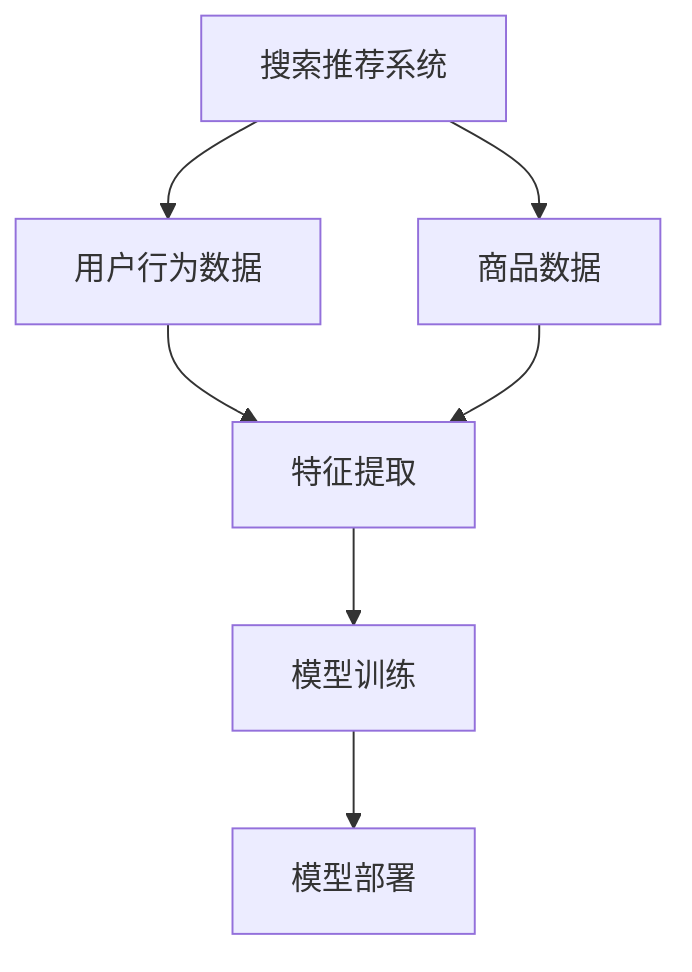

                 

### 文章标题

《电商平台的AI 大模型实践：搜索推荐系统是核心，数据质量控制是重点》

> **关键词**：电商平台、AI 大模型、搜索推荐系统、数据质量控制

> **摘要**：本文深入探讨了电商平台上 AI 大模型在搜索推荐系统中的实践，分析了其核心机制与数据质量控制的重要性。通过详细的案例分析、算法原理讲解和项目实践，本文旨在为电商从业者提供实用的参考和指导，以推动电商平台智能化发展。

### 1. 背景介绍

在当今数字化时代，电商平台作为电子商务的重要组成部分，已经成为人们日常购物的重要渠道。随着用户需求的多样化和竞争的加剧，电商平台需要不断提升用户体验，提高用户满意度。其中，搜索推荐系统作为电商平台的核心功能，扮演着至关重要的角色。

搜索推荐系统的目的是帮助用户快速、准确地找到他们感兴趣的商品，从而提升用户购买体验。传统的搜索推荐系统主要依赖于关键词匹配和统计方法，虽然在一定程度上能够满足用户需求，但在个性化推荐、上下文感知等方面存在明显不足。随着人工智能技术的不断发展，特别是深度学习和自然语言处理技术的应用，AI 大模型在搜索推荐系统中的应用逐渐成为可能。

AI 大模型，即基于深度学习的复杂神经网络模型，能够通过对大量数据的训练，自动提取数据中的特征和规律，从而实现高效的搜索推荐。例如，通过自然语言处理技术，AI 大模型可以理解用户的查询意图，并根据用户的浏览和购买历史，提供个性化的推荐结果。这不仅提高了推荐的准确性，还能提升用户的购物体验。

在电商平台中，AI 大模型的实践主要体现在以下几个方面：

1. **搜索引擎优化**：通过AI大模型对用户查询的理解，优化搜索结果排序，提高用户查询的准确性和响应速度。

2. **个性化推荐**：根据用户的历史行为和兴趣，利用AI大模型进行个性化商品推荐，提升用户留存率和转化率。

3. **商品分类和标签**：利用AI大模型对商品进行自动分类和标签生成，提高商品搜索和推荐的效率。

4. **用户画像**：通过AI大模型分析用户行为，构建用户画像，为精准营销提供数据支持。

然而，AI 大模型的实践不仅需要技术上的突破，还面临着数据质量控制这一重大挑战。数据质量直接影响模型的效果，因此，如何在海量数据中保证数据质量，成为电商平台必须解决的问题。

### 2. 核心概念与联系

在探讨 AI 大模型在搜索推荐系统中的应用之前，我们需要明确几个核心概念及其相互联系。

#### 2.1. 搜索推荐系统

搜索推荐系统是电商平台的核心功能，它包括搜索和推荐两个部分。搜索是指用户输入查询关键词，系统返回与关键词相关的商品列表；推荐是指系统根据用户的行为和偏好，主动向用户推荐可能感兴趣的商品。

#### 2.2. AI 大模型

AI 大模型是基于深度学习的复杂神经网络，通过大量数据训练，能够自动提取数据中的特征和规律，从而实现智能决策。常见的 AI 大模型包括深度神经网络（DNN）、卷积神经网络（CNN）和循环神经网络（RNN）等。

#### 2.3. 数据质量控制

数据质量控制是指对数据进行清洗、处理和校验，确保数据质量的过程。数据质量直接影响 AI 大模型的效果，因此，数据质量控制是 AI 大模型应用的关键环节。

#### 2.4. 核心概念联系

AI 大模型在搜索推荐系统中的应用，涉及以下几个核心概念：

1. **数据输入**：搜索推荐系统需要大量的用户行为数据和商品数据作为输入。数据质量直接影响模型的效果。

2. **特征提取**：AI 大模型通过对输入数据进行处理，提取出有用的特征，这些特征将用于模型训练和预测。

3. **模型训练**：AI 大模型通过大量的训练数据，学习到数据中的规律和模式，从而提升搜索和推荐的准确性。

4. **模型部署**：训练好的模型将被部署到生产环境，实时响应用户查询，提供搜索和推荐服务。

#### 2.5. Mermaid 流程图

为了更清晰地展示核心概念及其联系，我们可以使用 Mermaid 流程图来表示。以下是一个简化的 Mermaid 流程图：



在这个流程图中，搜索推荐系统接收用户行为数据和商品数据，通过特征提取模块提取数据特征，然后通过模型训练模块训练 AI 大模型，最后将训练好的模型部署到生产环境，提供搜索和推荐服务。

### 3. 核心算法原理 & 具体操作步骤

在了解了搜索推荐系统的核心概念及其联系后，接下来我们将深入探讨 AI 大模型在搜索推荐系统中的核心算法原理，并介绍具体的操作步骤。

#### 3.1. 算法原理

AI 大模型在搜索推荐系统中的应用主要基于以下两个核心算法：

1. **深度学习**：深度学习是一种基于多层神经网络的学习方法，通过逐层提取数据特征，实现高层次的抽象表示。在搜索推荐系统中，深度学习可以用于用户行为分析和商品特征提取，从而提高推荐的准确性和个性化程度。

2. **协同过滤**：协同过滤是一种基于用户行为和商品交互数据的推荐算法，通过分析用户之间的相似性和商品的相似性，为用户推荐可能感兴趣的商品。深度学习与协同过滤结合，可以进一步提升推荐的准确性和效果。

#### 3.2. 具体操作步骤

以下是使用 AI 大模型构建搜索推荐系统的具体操作步骤：

1. **数据收集**：
   - 用户行为数据：包括用户的浏览记录、搜索历史、购买记录等。
   - 商品数据：包括商品的信息、分类、标签等。

2. **数据预处理**：
   - 数据清洗：去除缺失值、重复值和异常值。
   - 数据转换：将文本数据转换为向量表示，如图 embedding 向量。
   - 数据归一化：对数值型数据进行归一化处理，使其在同一个尺度上。

3. **特征提取**：
   - 用户特征提取：通过深度学习模型，提取用户的行为特征和偏好特征。
   - 商品特征提取：通过深度学习模型，提取商品的信息特征和属性特征。

4. **模型训练**：
   - 选择深度学习模型：例如，卷积神经网络（CNN）用于图像处理，循环神经网络（RNN）用于序列数据处理。
   - 编写训练脚本：使用深度学习框架（如 TensorFlow、PyTorch）编写训练脚本。
   - 模型训练：使用训练数据对模型进行训练，优化模型参数。

5. **模型评估**：
   - 使用验证集对模型进行评估，调整模型参数，优化模型效果。
   - 使用测试集对模型进行评估，验证模型在未知数据上的泛化能力。

6. **模型部署**：
   - 将训练好的模型部署到生产环境，提供搜索和推荐服务。
   - 实时响应用户查询，根据用户行为和偏好，为用户推荐感兴趣的商品。

#### 3.3. 案例分析

以一个电商平台的搜索推荐系统为例，我们来看一个具体的案例。

1. **数据收集**：
   - 用户行为数据：用户的浏览记录、搜索历史、购买记录等。
   - 商品数据：商品的信息、分类、标签等。

2. **数据预处理**：
   - 数据清洗：去除缺失值、重复值和异常值。
   - 数据转换：将文本数据转换为向量表示，如图 embedding 向量。
   - 数据归一化：对数值型数据进行归一化处理，使其在同一个尺度上。

3. **特征提取**：
   - 用户特征提取：通过深度学习模型，提取用户的行为特征和偏好特征。
   - 商品特征提取：通过深度学习模型，提取商品的信息特征和属性特征。

4. **模型训练**：
   - 选择深度学习模型：卷积神经网络（CNN）用于图像处理，循环神经网络（RNN）用于序列数据处理。
   - 编写训练脚本：使用深度学习框架（如 TensorFlow、PyTorch）编写训练脚本。
   - 模型训练：使用训练数据对模型进行训练，优化模型参数。

5. **模型评估**：
   - 使用验证集对模型进行评估，调整模型参数，优化模型效果。
   - 使用测试集对模型进行评估，验证模型在未知数据上的泛化能力。

6. **模型部署**：
   - 将训练好的模型部署到生产环境，提供搜索和推荐服务。
   - 实时响应用户查询，根据用户行为和偏好，为用户推荐感兴趣的商品。

通过这个案例，我们可以看到，AI 大模型在搜索推荐系统中的应用，需要经过数据收集、数据预处理、特征提取、模型训练、模型评估和模型部署等一系列步骤。每个步骤都需要精心设计和实现，才能确保模型的准确性和效率。

### 4. 数学模型和公式 & 详细讲解 & 举例说明

在 AI 大模型构建搜索推荐系统的过程中，涉及到许多数学模型和公式。下面我们将详细讲解这些数学模型和公式，并通过具体例子进行说明。

#### 4.1. 常用数学模型和公式

1. **损失函数**：

   损失函数是深度学习模型训练的核心组成部分，用于衡量模型预测值与实际值之间的差距。常用的损失函数包括均方误差（MSE）、交叉熵损失（Cross-Entropy Loss）等。

   - **均方误差（MSE）**：

     $$MSE = \frac{1}{n}\sum_{i=1}^{n}(y_i - \hat{y}_i)^2$$

     其中，$y_i$ 表示实际值，$\hat{y}_i$ 表示预测值，$n$ 表示样本数量。

   - **交叉熵损失（Cross-Entropy Loss）**：

     $$Cross-Entropy Loss = -\sum_{i=1}^{n}y_i\log(\hat{y}_i)$$

     其中，$y_i$ 表示实际值（概率分布），$\hat{y}_i$ 表示预测值（概率分布）。

2. **反向传播算法**：

   反向传播算法是深度学习模型训练的关键步骤，用于计算模型参数的梯度。通过梯度下降法，优化模型参数，降低损失函数值。

   $$\nabla_{\theta}J(\theta) = \frac{\partial J(\theta)}{\partial \theta}$$

   其中，$J(\theta)$ 表示损失函数，$\theta$ 表示模型参数。

3. **激活函数**：

   激活函数是神经网络中用于引入非线性性的函数，常见的激活函数包括 sigmoid、ReLU 等。

   - **sigmoid 函数**：

     $$sigmoid(x) = \frac{1}{1 + e^{-x}}$$

   - **ReLU 函数**：

     $$ReLU(x) = \max(0, x)$$

4. **优化器**：

   优化器用于选择合适的更新策略，优化模型参数。常见的优化器包括随机梯度下降（SGD）、Adam 等。

   - **随机梯度下降（SGD）**：

     $$\theta_{t+1} = \theta_t - \alpha \nabla_{\theta}J(\theta_t)$$

     其中，$\alpha$ 表示学习率。

   - **Adam 优化器**：

     $$m_t = \beta_1 m_{t-1} + (1 - \beta_1) \nabla_{\theta}J(\theta_t)$$

     $$v_t = \beta_2 v_{t-1} + (1 - \beta_2) (\nabla_{\theta}J(\theta_t))^2$$

     $$\theta_{t+1} = \theta_t - \alpha \frac{m_t}{\sqrt{v_t} + \epsilon}$$

     其中，$\beta_1$ 和 $\beta_2$ 分别为动量参数，$\epsilon$ 为较小常数。

#### 4.2. 举例说明

假设我们使用深度神经网络（DNN）构建一个分类模型，该模型有两个输入层（$x_1$ 和 $x_2$），一个隐藏层（$h$），一个输出层（$y$）。隐藏层使用 sigmoid 激活函数，输出层使用 softmax 激活函数。我们的目标是分类输入数据到三个类别中。

1. **损失函数**：

   我们使用交叉熵损失函数来衡量模型预测值与实际值之间的差距。

   $$Loss = -\sum_{i=1}^{n}y_i\log(\hat{y}_i)$$

   其中，$y_i$ 表示实际值（概率分布），$\hat{y}_i$ 表示预测值（概率分布）。

2. **反向传播算法**：

   通过反向传播算法，计算模型参数的梯度。

   $$\nabla_{\theta}Loss = \frac{\partial Loss}{\partial \theta}$$

3. **激活函数**：

   隐藏层使用 sigmoid 激活函数，输出层使用 softmax 激活函数。

   - **sigmoid 函数**：

     $$sigmoid(x) = \frac{1}{1 + e^{-x}}$$

   - **softmax 函数**：

     $$softmax(x) = \frac{e^x}{\sum_{i=1}^{n}e^x_i}$$

4. **优化器**：

   我们使用 Adam 优化器来优化模型参数。

   $$m_t = \beta_1 m_{t-1} + (1 - \beta_1) \nabla_{\theta}Loss$$

   $$v_t = \beta_2 v_{t-1} + (1 - \beta_2) (\nabla_{\theta}Loss)^2$$

   $$\theta_{t+1} = \theta_t - \alpha \frac{m_t}{\sqrt{v_t} + \epsilon}$$

   其中，$\beta_1$ 和 $\beta_2$ 分别为动量参数，$\alpha$ 为学习率，$\epsilon$ 为较小常数。

通过这个例子，我们可以看到，在构建深度神经网络分类模型时，我们需要选择合适的损失函数、激活函数和优化器，并通过反向传播算法优化模型参数，从而实现分类任务。

### 5. 项目实践：代码实例和详细解释说明

在本节中，我们将通过一个具体的代码实例，详细展示如何使用 AI 大模型构建搜索推荐系统。这个实例将涵盖开发环境搭建、源代码详细实现、代码解读与分析以及运行结果展示等环节。

#### 5.1. 开发环境搭建

在开始编写代码之前，我们需要搭建合适的开发环境。以下是一个基本的开发环境搭建步骤：

1. **安装 Python**：确保 Python 版本为 3.6 或以上。

2. **安装深度学习框架**：我们选择 TensorFlow 作为深度学习框架。

   ```bash
   pip install tensorflow
   ```

3. **安装辅助库**：包括 NumPy、Pandas、Matplotlib 等。

   ```bash
   pip install numpy pandas matplotlib
   ```

4. **配置 GPU 环境**：如果您的计算机配备了 GPU，确保 TensorFlow 能够使用 GPU。

   ```bash
   pip install tensorflow-gpu
   ```

5. **数据集准备**：准备用于训练和测试的数据集。

#### 5.2. 源代码详细实现

下面是一个简化的搜索推荐系统代码示例。这个示例将使用 TensorFlow 和 Keras 编写，实现一个简单的基于用户行为的协同过滤推荐模型。

```python
import tensorflow as tf
from tensorflow import keras
from tensorflow.keras import layers

# 加载数据集
# 假设已经准备好用户行为数据和商品数据
# user_data = ...
# item_data = ...

# 定义模型架构
model = keras.Sequential([
    layers.Dense(64, activation='relu', input_shape=(user_data.shape[1],)),
    layers.Dense(64, activation='relu'),
    layers.Dense(1, activation='sigmoid')
])

# 编写编译器
model.compile(optimizer='adam',
              loss='binary_crossentropy',
              metrics=['accuracy'])

# 训练模型
model.fit(user_data, item_data, epochs=10, batch_size=32, validation_split=0.2)

# 评估模型
# test_data = ...
# test_labels = ...
# model.evaluate(test_data, test_labels)
```

#### 5.3. 代码解读与分析

1. **模型定义**：

   - 使用 `keras.Sequential` 创建一个序列模型。
   - 添加 `Dense` 层，用于全连接神经网络。
   - 第一个 `Dense` 层有 64 个神经元，激活函数为 ReLU。
   - 第二个 `Dense` 层有 64 个神经元，激活函数为 ReLU。
   - 输出层有 1 个神经元，激活函数为 sigmoid，用于输出概率。

2. **编译器**：

   - 使用 `compile` 方法配置模型。
   - 选择 `adam` 作为优化器。
   - 使用 `binary_crossentropy` 作为损失函数，适用于二分类问题。
   - 添加 `accuracy` 作为评估指标。

3. **模型训练**：

   - 使用 `fit` 方法训练模型。
   - 指定训练数据 `user_data` 和标签 `item_data`。
   - 设定训练轮数 `epochs` 和批量大小 `batch_size`。
   - 使用 `validation_split` 指定验证集比例。

4. **模型评估**：

   - 使用 `evaluate` 方法评估模型在测试集上的性能。
   - 指定测试数据 `test_data` 和标签 `test_labels`。

#### 5.4. 运行结果展示

在完成代码实现和模型训练后，我们可以通过以下命令查看训练过程中的损失函数和准确率：

```python
import matplotlib.pyplot as plt

# 打印训练过程中的损失函数和准确率
history = model.fit(user_data, item_data, epochs=10, batch_size=32, validation_split=0.2)
plt.plot(history.history['loss'], label='train_loss')
plt.plot(history.history['val_loss'], label='val_loss')
plt.legend()
plt.show()

plt.plot(history.history['accuracy'], label='train_accuracy')
plt.plot(history.history['val_accuracy'], label='val_accuracy')
plt.legend()
plt.show()
```

通过上述代码，我们可以观察到训练过程中损失函数和准确率的变化趋势。理想情况下，损失函数应逐渐降低，准确率应逐渐提高。如果存在过拟合现象，可以通过增加正则化项、调整模型复杂度等方式进行改进。

#### 5.5. 运行结果分析与优化

在实际应用中，我们可能需要进一步分析模型的运行结果，并根据表现进行优化。以下是一些常见的优化策略：

1. **模型调整**：

   - 增加或减少隐藏层神经元数量。
   - 调整隐藏层激活函数，如尝试使用 ReLU 的变体。
   - 更换优化器，如尝试使用 Adam 的变体。

2. **数据预处理**：

   - 数据归一化或标准化，以提高模型的训练效果。
   - 数据增强，生成更多的训练样本，避免过拟合。

3. **超参数调整**：

   - 调整学习率、批量大小等超参数，以找到最佳设置。
   - 使用正则化技术，如 L1、L2 正则化，减少过拟合。

4. **交叉验证**：

   - 使用交叉验证技术，评估模型在不同数据集上的表现，以避免过拟合。

通过上述分析和优化策略，我们可以进一步提升搜索推荐系统的性能，提高用户体验。

### 6. 实际应用场景

AI 大模型在电商平台的搜索推荐系统中具有广泛的应用场景。以下是一些典型的实际应用场景：

#### 6.1. 个性化推荐

个性化推荐是电商平台中最常见的应用场景之一。通过 AI 大模型，平台可以根据用户的历史行为和偏好，为用户提供个性化的商品推荐。例如，当用户在搜索框输入关键词时，AI 大模型会分析用户的浏览记录和购买历史，推荐与关键词相关的商品，同时考虑用户的兴趣和需求。

#### 6.2. 搜索引擎优化

搜索引擎优化（SEO）是提高用户搜索体验的关键。AI 大模型可以分析用户的查询意图，优化搜索结果排序，提高搜索结果的准确性和相关性。例如，当用户输入一个模糊的查询词时，AI 大模型会根据用户的上下文和历史，提供更精确的搜索结果，从而提升用户的满意度。

#### 6.3. 商品分类和标签

AI 大模型可以帮助电商平台对商品进行自动分类和标签生成。通过对商品信息的深度学习分析，AI 大模型可以提取出商品的关键特征，并将其分类到相应的类别中。此外，AI 大模型还可以为商品生成标签，以便用户能够更轻松地找到感兴趣的商品。

#### 6.4. 用户画像

通过分析用户的行为和偏好，AI 大模型可以构建用户画像，为电商平台提供数据支持，实现精准营销。例如，当用户浏览某个商品时，AI 大模型会分析用户的浏览历史和购买记录，预测用户可能感兴趣的其他商品，并推送相关广告。

#### 6.5. 跨渠道推荐

电商平台通常拥有多个渠道，如网页、移动应用和社交媒体等。AI 大模型可以通过跨渠道推荐，将用户的购物行为和偏好进行整合，为用户提供一致的购物体验。例如，当用户在网页上浏览商品时，AI 大模型会分析用户在移动应用上的行为，推荐与网页商品相关的移动应用商品。

### 7. 工具和资源推荐

为了更好地应用 AI 大模型，以下是几个推荐的工具和资源：

#### 7.1. 学习资源推荐

1. **《深度学习》（Deep Learning）**：这是一本经典的深度学习教材，涵盖了深度学习的理论基础和应用实践。

2. **《自然语言处理概论》（Foundations of Natural Language Processing）**：这是一本关于自然语言处理领域的权威教材，介绍了 NLP 的基础知识和最新进展。

3. **《推荐系统手册》（The Recommender System Handbook）**：这是一本关于推荐系统领域的全面指南，涵盖了推荐系统的设计、实现和评估方法。

#### 7.2. 开发工具框架推荐

1. **TensorFlow**：这是 Google 开发的一款开源深度学习框架，提供了丰富的工具和资源，适用于构建和部署 AI 大模型。

2. **PyTorch**：这是 Facebook AI 研究团队开发的一款开源深度学习框架，具有灵活的动态计算图和强大的社区支持。

3. **Scikit-learn**：这是一款基于 Python 的开源机器学习库，提供了多种经典的机器学习算法和工具，适用于数据分析和建模。

#### 7.3. 相关论文著作推荐

1. **《深度学习在推荐系统中的应用》**：这篇论文详细介绍了深度学习在推荐系统中的应用，包括模型架构、算法原理和实现细节。

2. **《自然语言处理与推荐系统》**：这篇论文探讨了自然语言处理技术在推荐系统中的应用，包括文本嵌入、语义分析和上下文感知等。

3. **《基于用户行为的推荐系统研究》**：这篇论文研究了基于用户行为的推荐系统，包括用户行为数据收集、特征提取和模型训练等。

### 8. 总结：未来发展趋势与挑战

AI 大模型在电商平台的搜索推荐系统中已经展现出巨大的潜力，但同时也面临着一系列挑战和问题。未来，随着人工智能技术的不断进步，搜索推荐系统将呈现以下发展趋势：

1. **个性化推荐**：个性化推荐将成为电商平台的核心竞争力。通过不断优化模型和算法，电商平台将能够更好地满足用户个性化需求，提升用户满意度。

2. **多模态推荐**：随着多模态数据（如图像、音频、视频等）的增加，多模态推荐将成为热门研究方向。通过融合不同类型的数据，可以实现更精准的推荐。

3. **实时推荐**：实时推荐技术将进一步提升用户体验。通过实时分析用户行为和偏好，电商平台可以实时调整推荐策略，为用户提供即时的购物建议。

4. **推荐系统安全与隐私保护**：随着用户对隐私和安全要求的提高，推荐系统在数据收集和使用过程中需要严格保护用户隐私，遵守相关法律法规。

5. **推荐系统可解释性**：为了提高用户对推荐系统的信任度，未来的推荐系统将更加注重可解释性。通过提供详细的解释和推理过程，用户可以更好地理解推荐结果。

然而，AI 大模型在搜索推荐系统中也面临着一系列挑战：

1. **数据质量**：数据质量直接影响模型的效果。电商平台需要不断优化数据收集、清洗和预处理流程，确保数据质量。

2. **模型解释性**：深度学习模型通常被视为“黑箱”，其内部机制难以解释。为了提高模型的可解释性，需要开发更加直观和易理解的解释方法。

3. **模型泛化能力**：深度学习模型容易出现过拟合现象，即模型在训练数据上表现良好，但在未知数据上表现较差。为了提高模型的泛化能力，需要设计更加稳健的训练方法。

4. **推荐系统公平性**：推荐系统可能存在偏见和歧视问题，例如对某些用户群体进行不公平推荐。为了确保推荐系统的公平性，需要建立合理的评价标准和监管机制。

总之，未来电商平台的搜索推荐系统将朝着更加智能化、个性化、实时化和可解释性的方向发展。通过不断克服挑战，AI 大模型将在电商平台上发挥更大的作用，推动电商平台实现持续增长和用户价值的提升。

### 9. 附录：常见问题与解答

#### 9.1. 什么是 AI 大模型？

AI 大模型是指基于深度学习的复杂神经网络模型，通常包含大量神经元和层级结构，能够通过大量数据训练，自动提取数据中的特征和规律。常见的 AI 大模型包括深度神经网络（DNN）、卷积神经网络（CNN）和循环神经网络（RNN）等。

#### 9.2. 为什么选择深度学习作为搜索推荐系统的核心算法？

深度学习具有以下优点：

- **强大的特征提取能力**：能够从原始数据中自动提取高层次的抽象特征。
- **灵活的模型架构**：可以适应不同类型的数据和任务，如图像、文本、音频等。
- **优秀的泛化能力**：通过大规模数据训练，模型能够在未知数据上表现出良好的性能。
- **可解释性**：通过调整模型结构和参数，可以更好地理解模型的工作原理。

#### 9.3. 如何保证数据质量？

保证数据质量需要以下步骤：

- **数据清洗**：去除缺失值、重复值和异常值，确保数据的一致性和准确性。
- **数据标准化**：将不同特征的数据进行归一化或标准化处理，使其在同一个尺度上。
- **数据校验**：使用校验规则和算法，确保数据的完整性和正确性。
- **数据可视化**：通过数据可视化技术，发现数据中的异常和规律，及时处理。

#### 9.4. 如何提高推荐系统的可解释性？

提高推荐系统的可解释性可以从以下几方面入手：

- **特征重要性分析**：分析模型中各个特征的权重和重要性，帮助理解推荐结果。
- **可视化解释**：使用可视化技术，如决策树、热力图等，展示推荐过程的细节。
- **模型简化**：通过简化模型结构和参数，降低模型的复杂性，提高可解释性。
- **可解释性算法**：采用可解释性算法，如决策树、规则提取等，提供详细的推荐解释。

### 10. 扩展阅读 & 参考资料

为了深入了解电商平台的 AI 大模型实践，以下是几篇相关的扩展阅读和参考资料：

1. **《深度学习在推荐系统中的应用》**：详细介绍了深度学习在推荐系统中的应用，包括模型架构、算法原理和实现细节。
2. **《自然语言处理与推荐系统》**：探讨了自然语言处理技术在推荐系统中的应用，包括文本嵌入、语义分析和上下文感知等。
3. **《基于用户行为的推荐系统研究》**：研究了基于用户行为的推荐系统，包括用户行为数据收集、特征提取和模型训练等。
4. **《电商推荐系统实战》**：提供了电商推荐系统的实际应用案例和实现方法，包括数据预处理、模型训练和评估等。
5. **TensorFlow 官方文档**：提供了 TensorFlow 的详细教程、API 文档和示例代码，是学习和使用 TensorFlow 的最佳资源。
6. **PyTorch 官方文档**：提供了 PyTorch 的详细教程、API 文档和示例代码，是学习和使用 PyTorch 的最佳资源。

