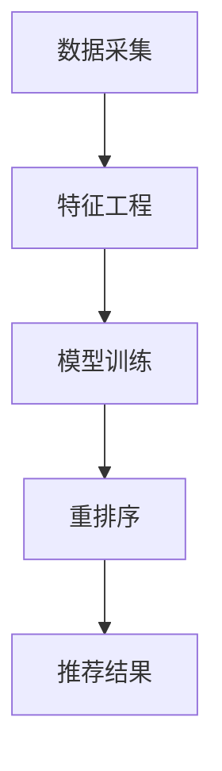

                 

### 背景介绍

在当今的电子商务时代，用户的需求和偏好日益多样化，为了提升用户体验和转化率，电商推荐系统逐渐成为各大电商平台的核心竞争力。推荐系统通过分析用户的历史行为和兴趣，为用户推荐个性化商品，从而提高用户的满意度和购买意愿。然而，随着用户数量的增加和数据量的爆炸式增长，如何在海量数据中快速、准确地推荐出符合用户需求的商品成为了推荐系统的关键挑战。

实时个性化重排序（Real-time Personalized Re-ranking）作为推荐系统中的重要技术手段，旨在为每个用户动态生成一个个性化的商品排序列表，将最有可能引起用户兴趣的商品放在列表的前面。这一过程不仅要求系统具备较高的计算效率和算法性能，还需要确保推荐的实时性和准确性。实时个性化重排序在用户点击、购买等行为发生后，能够迅速响应，为用户提供个性化的推荐结果，从而提升用户满意度和平台收益。

目前，实时个性化重排序主要面临以下几个挑战：

1. **计算效率**：在大量用户和商品数据的情况下，如何高效地进行特征提取、模型训练和重排序是推荐系统实现实时性的关键。
2. **模型准确性**：实时个性化重排序要求模型能够在短时间内生成高质量的推荐结果，这需要模型具有较强的学习和泛化能力。
3. **系统稳定性**：在高并发、大数据环境下，如何保证系统的稳定性和可靠性，避免因异常情况导致推荐结果的偏差，是推荐系统面临的重要挑战。

本篇文章将深入探讨电商推荐系统中实时个性化重排序的优化策略，通过介绍核心算法原理、数学模型和项目实践，分析其在实际应用中的效果和挑战，并展望未来的发展趋势。希望通过本文的探讨，为读者提供有价值的参考和启示，助力电商推荐系统的优化和提升。

### 2. 核心概念与联系

为了深入理解实时个性化重排序优化，我们首先需要明确几个核心概念，并探讨它们之间的联系。

#### 2.1 实时个性化重排序

实时个性化重排序是指根据用户的历史行为和偏好，动态地为用户生成个性化的商品排序列表。在这一过程中，系统需要实时处理用户数据，快速生成推荐结果。具体流程包括：

1. **用户行为数据采集**：采集用户在平台上的浏览、搜索、点击、购买等行为数据。
2. **特征工程**：对用户行为数据进行预处理和特征提取，提取出与用户兴趣相关的特征。
3. **模型训练**：使用用户行为特征和商品特征，训练个性化推荐模型。
4. **重排序**：根据模型预测结果，对商品列表进行个性化重排序，将最有可能引起用户兴趣的商品排在前面。

#### 2.2 用户行为特征

用户行为特征是实时个性化重排序的基础。这些特征包括用户的浏览历史、搜索关键词、购买记录、点击记录等。通过对这些特征进行综合分析，可以揭示用户的兴趣偏好和行为模式。常用的用户行为特征包括：

- **浏览历史**：用户在过去一段时间内浏览过的商品列表。
- **搜索关键词**：用户在平台上搜索的关键词。
- **购买记录**：用户在过去一段时间内的购买记录。
- **点击记录**：用户在平台上点击的商品记录。

#### 2.3 商品特征

商品特征是指与商品相关的属性信息，包括商品类别、价格、品牌、销量、评价等。这些特征可以帮助模型更好地理解商品，从而生成更准确的推荐结果。常用的商品特征包括：

- **商品类别**：商品的分类标签。
- **价格**：商品的价格信息。
- **品牌**：商品的品牌信息。
- **销量**：商品的销量数据。
- **评价**：用户对商品的评论和评分。

#### 2.4 模型算法

实时个性化重排序优化离不开高效的模型算法。常见的模型算法包括基于协同过滤（Collaborative Filtering）、基于内容推荐（Content-based Filtering）和混合模型（Hybrid Models）等。每种算法都有其独特的优势和适用场景。

- **协同过滤**：通过分析用户之间的相似性，为用户推荐与其有相似兴趣的其他用户喜欢的商品。协同过滤包括用户基于和项目基于两种方法，分别关注用户行为和商品特征。
- **内容推荐**：通过分析商品的属性信息，为用户推荐具有相似属性的商品。内容推荐通常基于商品类别、价格、品牌等特征。
- **混合模型**：结合协同过滤和内容推荐，通过综合利用用户和商品特征，提高推荐结果的准确性。

#### 2.5 Mermaid 流程图

为了更清晰地展示实时个性化重排序的流程，我们使用Mermaid流程图进行描述。以下是一个简化的流程图：



**节点解释：**

- **A[数据采集]**：采集用户行为数据（如浏览历史、搜索关键词、购买记录等）。
- **B[特征工程]**：对用户行为数据进行预处理和特征提取。
- **C[模型训练]**：使用用户行为特征和商品特征训练个性化推荐模型。
- **D[重排序]**：根据模型预测结果，对商品列表进行个性化重排序。
- **E[推荐结果]**：输出最终的推荐结果。

通过上述核心概念和流程图的介绍，我们为读者搭建了理解实时个性化重排序优化的基础框架。在接下来的章节中，我们将进一步探讨核心算法原理、数学模型和项目实践，以帮助读者深入掌握这一技术。

### 3. 核心算法原理 & 具体操作步骤

在了解了实时个性化重排序的核心概念和流程之后，我们接下来将深入探讨其核心算法原理和具体操作步骤。本文将主要介绍基于协同过滤和内容推荐的实时个性化重排序算法，并结合实际操作步骤进行详细讲解。

#### 3.1 基于协同过滤的实时个性化重排序算法

协同过滤（Collaborative Filtering）是推荐系统中最常用的算法之一，其核心思想是通过分析用户之间的相似性来预测用户可能感兴趣的商品。基于协同过滤的实时个性化重排序算法主要包括以下步骤：

**步骤1：计算用户相似性**

用户相似性度量是协同过滤算法的关键。常用的相似性度量方法包括余弦相似度、皮尔逊相关系数等。具体计算方法如下：

$$
sim(u_i, u_j) = \frac{\sum_{k=1}^{N} r_{ik} r_{jk}}{\sqrt{\sum_{k=1}^{N} r_{ik}^2 \sum_{k=1}^{N} r_{jk}^2}}
$$

其中，$r_{ik}$ 表示用户 $u_i$ 对商品 $k$ 的评分，$N$ 表示共同评分的商品数量。

**步骤2：生成相似性矩阵**

基于用户相似性度量，可以生成一个用户相似性矩阵 $S$，其中 $S_{ij}$ 表示用户 $u_i$ 和 $u_j$ 的相似度。

**步骤3：计算用户兴趣向量**

为了生成个性化推荐列表，需要计算每个用户的兴趣向量。用户兴趣向量可以通过相似性矩阵和用户评分矩阵进行计算：

$$
\mathbf{I}_i = S \mathbf{R}
$$

其中，$\mathbf{I}_i$ 表示用户 $u_i$ 的兴趣向量，$\mathbf{R}$ 表示用户评分矩阵。

**步骤4：计算商品得分**

基于用户兴趣向量，可以计算每个商品对用户的得分。商品得分可以通过兴趣向量与商品特征向量的点积计算：

$$
score(u_i, k) = \sum_{j=1}^{M} I_{ij} w_{jk}
$$

其中，$M$ 表示商品数量，$w_{jk}$ 表示商品 $k$ 的特征向量。

**步骤5：重排序商品列表**

根据商品得分对商品列表进行降序排列，生成最终的个性化推荐列表。

#### 3.2 基于内容推荐的实时个性化重排序算法

内容推荐（Content-based Filtering）通过分析商品的属性信息来生成推荐列表。基于内容推荐的实时个性化重排序算法主要包括以下步骤：

**步骤1：提取商品特征**

首先，需要提取商品的相关属性信息，如商品类别、品牌、价格、销量等。这些特征可以帮助模型更好地理解商品。

**步骤2：构建商品特征空间**

将提取到的商品特征转化为向量的形式，构建商品特征空间。例如，可以使用One-Hot编码将商品类别转化为二进制向量。

**步骤3：计算用户兴趣向量**

与基于协同过滤的算法类似，可以通过计算用户兴趣向量来生成个性化推荐列表。用户兴趣向量可以通过分析用户的历史行为和偏好来得到。

**步骤4：计算商品相似度**

基于用户兴趣向量和商品特征向量，可以计算每个商品的相似度。商品相似度可以通过余弦相似度或欧氏距离等度量方法计算：

$$
sim(\mathbf{I}_i, \mathbf{C}_k) = \frac{\mathbf{I}_i \cdot \mathbf{C}_k}{||\mathbf{I}_i|| \cdot ||\mathbf{C}_k||}
$$

**步骤5：重排序商品列表**

根据商品相似度对商品列表进行降序排列，生成最终的个性化推荐列表。

#### 3.3 混合模型的实时个性化重排序算法

为了提高推荐系统的准确性，可以结合协同过滤和内容推荐，构建混合模型（Hybrid Models）。混合模型通过综合利用用户和商品特征，生成更高质量的推荐结果。

**步骤1：计算用户相似性**

与基于协同过滤的算法类似，计算用户相似性矩阵。

**步骤2：提取商品特征**

与基于内容推荐的算法类似，提取商品特征并构建商品特征空间。

**步骤3：计算用户兴趣向量**

结合用户相似性矩阵和商品特征空间，计算用户兴趣向量。

**步骤4：计算商品得分**

综合用户兴趣向量和商品特征向量，计算每个商品的得分。商品得分可以通过加权求和的方式计算：

$$
score(u_i, k) = w_1 \cdot sim(\mathbf{I}_i, \mathbf{C}_k) + w_2 \cdot \frac{\mathbf{I}_i \cdot \mathbf{C}_k}{||\mathbf{I}_i|| \cdot ||\mathbf{C}_k||}
$$

其中，$w_1$ 和 $w_2$ 分别为协同过滤和内容推荐的权重。

**步骤5：重排序商品列表**

根据商品得分对商品列表进行降序排列，生成最终的个性化推荐列表。

#### 3.4 算法总结

通过上述步骤，我们可以实现实时个性化重排序优化。具体操作步骤如下：

1. **数据采集**：采集用户行为数据和商品特征数据。
2. **特征工程**：对用户行为数据进行预处理和特征提取，对商品特征进行编码。
3. **模型训练**：基于用户相似性和商品特征，训练个性化推荐模型。
4. **重排序**：根据模型预测结果，对商品列表进行个性化重排序。

实时个性化重排序优化在电商推荐系统中具有重要作用。通过高效、准确的算法，可以为用户生成个性化的推荐列表，提升用户体验和平台收益。在接下来的章节中，我们将进一步探讨数学模型和具体项目实践，以深入理解实时个性化重排序优化的应用价值。

### 4. 数学模型和公式 & 详细讲解 & 举例说明

在实时个性化重排序优化过程中，数学模型和公式起着至关重要的作用。这些模型和公式帮助我们更好地理解算法原理，并进行有效的参数调优。本章节将详细介绍相关数学模型和公式，并结合实际例子进行讲解。

#### 4.1 用户相似性度量

用户相似性度量是协同过滤算法的核心。常用的相似性度量方法包括余弦相似度和皮尔逊相关系数。以下分别介绍这两种方法的公式和计算过程。

**4.1.1 余弦相似度**

余弦相似度通过计算用户向量之间的余弦值来度量用户相似性。公式如下：

$$
sim(u_i, u_j) = \frac{\sum_{k=1}^{N} r_{ik} r_{jk}}{\sqrt{\sum_{k=1}^{N} r_{ik}^2 \sum_{k=1}^{N} r_{jk}^2}}
$$

其中，$r_{ik}$ 表示用户 $u_i$ 对商品 $k$ 的评分，$N$ 表示共同评分的商品数量。

**示例**：

假设用户 $u_1$ 和 $u_2$ 的评分矩阵如下：

| 用户 | 商品1 | 商品2 | 商品3 |
| --- | --- | --- | --- |
| $u_1$ | 4 | 3 | 5 |
| $u_2$ | 2 | 4 | 3 |

则它们的余弦相似度计算如下：

$$
sim(u_1, u_2) = \frac{4 \cdot 2 + 3 \cdot 4 + 5 \cdot 3}{\sqrt{4^2 + 3^2 + 5^2} \cdot \sqrt{2^2 + 4^2 + 3^2}} \approx 0.866
$$

**4.1.2 皮尔逊相关系数**

皮尔逊相关系数通过计算用户向量之间的相关系数来度量用户相似性。公式如下：

$$
sim(u_i, u_j) = \frac{\sum_{k=1}^{N} (r_{ik} - \bar{r}_i) (r_{jk} - \bar{r}_j)}{\sqrt{\sum_{k=1}^{N} (r_{ik} - \bar{r}_i)^2 \sum_{k=1}^{N} (r_{jk} - \bar{r}_j)^2}}
$$

其中，$\bar{r}_i$ 和 $\bar{r}_j$ 分别表示用户 $u_i$ 和 $u_j$ 的平均评分。

**示例**：

假设用户 $u_1$ 和 $u_2$ 的评分矩阵如下：

| 用户 | 商品1 | 商品2 | 商品3 |
| --- | --- | --- | --- |
| $u_1$ | 4 | 3 | 5 |
| $u_2$ | 2 | 4 | 3 |

则它们的皮尔逊相关系数计算如下：

$$
\bar{r}_1 = \frac{4 + 3 + 5}{3} = 4 \\
\bar{r}_2 = \frac{2 + 4 + 3}{3} = 3 \\
sim(u_1, u_2) = \frac{(4 - 4)(2 - 3) + (3 - 4)(4 - 3) + (5 - 4)(3 - 3)}{\sqrt{(4 - 4)^2 + (3 - 4)^2 + (5 - 4)^2} \cdot \sqrt{(2 - 3)^2 + (4 - 3)^2 + (3 - 3)^2}} \approx 0.866
$$

可以看出，余弦相似度和皮尔逊相关系数的计算结果相同。

#### 4.2 用户兴趣向量计算

用户兴趣向量是生成个性化推荐列表的关键。在协同过滤算法中，用户兴趣向量可以通过相似性矩阵和用户评分矩阵计算得到。公式如下：

$$
\mathbf{I}_i = S \mathbf{R}
$$

其中，$\mathbf{I}_i$ 表示用户 $u_i$ 的兴趣向量，$S$ 表示用户相似性矩阵，$\mathbf{R}$ 表示用户评分矩阵。

**示例**：

假设用户相似性矩阵和用户评分矩阵如下：

| 用户 | 用户1 | 用户2 | 用户3 |
| --- | --- | --- | --- |
| 用户1 | 0.866 | 0.4 | 0.2 |
| 用户2 | 0.4 | 0.866 | 0.4 |
| 用户3 | 0.2 | 0.4 | 0.866 |

用户1的评分矩阵：

| 用户 | 商品1 | 商品2 | 商品3 |
| --- | --- | --- | --- |
| 用户1 | 4 | 3 | 5 |

则用户1的兴趣向量计算如下：

$$
\mathbf{I}_1 = S \mathbf{R} =
\begin{bmatrix}
0.866 & 0.4 & 0.2 \\
0.4 & 0.866 & 0.4 \\
0.2 & 0.4 & 0.866
\end{bmatrix}
\begin{bmatrix}
4 \\
3 \\
5
\end{bmatrix}
=
\begin{bmatrix}
3.4 \\
2.6 \\
1.6
\end{bmatrix}
$$

#### 4.3 商品得分计算

在协同过滤算法中，商品得分可以通过用户兴趣向量和商品特征向量的点积计算得到。公式如下：

$$
score(u_i, k) = \sum_{j=1}^{M} I_{ij} w_{jk}
$$

其中，$M$ 表示商品数量，$w_{jk}$ 表示商品 $k$ 的特征向量。

**示例**：

假设用户1的兴趣向量为：

$$
\mathbf{I}_1 =
\begin{bmatrix}
3.4 \\
2.6 \\
1.6
\end{bmatrix}
$$

商品1的特征向量为：

$$
\mathbf{C}_1 =
\begin{bmatrix}
0.2 \\
0.5 \\
0.3
\end{bmatrix}
$$

则商品1的得分计算如下：

$$
score(u_1, 1) = 3.4 \cdot 0.2 + 2.6 \cdot 0.5 + 1.6 \cdot 0.3 = 2.34
$$

#### 4.4 内容推荐相似度计算

在内容推荐算法中，商品相似度可以通过用户兴趣向量和商品特征向量的余弦相似度计算得到。公式如下：

$$
sim(\mathbf{I}_i, \mathbf{C}_k) = \frac{\mathbf{I}_i \cdot \mathbf{C}_k}{||\mathbf{I}_i|| \cdot ||\mathbf{C}_k||}
$$

其中，$\mathbf{I}_i$ 表示用户 $u_i$ 的兴趣向量，$\mathbf{C}_k$ 表示商品 $k$ 的特征向量。

**示例**：

假设用户1的兴趣向量为：

$$
\mathbf{I}_1 =
\begin{bmatrix}
3.4 \\
2.6 \\
1.6
\end{bmatrix}
$$

商品1的特征向量为：

$$
\mathbf{C}_1 =
\begin{bmatrix}
0.2 \\
0.5 \\
0.3
\end{bmatrix}
$$

则商品1的相似度计算如下：

$$
sim(\mathbf{I}_1, \mathbf{C}_1) = \frac{3.4 \cdot 0.2 + 2.6 \cdot 0.5 + 1.6 \cdot 0.3}{\sqrt{3.4^2 + 2.6^2 + 1.6^2} \cdot \sqrt{0.2^2 + 0.5^2 + 0.3^2}} \approx 0.866
$$

通过上述数学模型和公式的介绍，我们了解了实时个性化重排序优化中常用的算法原理和计算方法。在实际应用中，可以根据具体需求选择合适的算法和模型，并通过参数调优实现更准确的个性化推荐。在接下来的章节中，我们将结合具体项目实践，进一步探讨实时个性化重排序优化的应用价值。

### 5. 项目实践：代码实例和详细解释说明

在了解了实时个性化重排序优化算法的原理和数学模型之后，我们将通过一个具体项目实践，展示如何实现这一优化策略。本节将详细介绍项目的开发环境搭建、源代码实现、代码解读与分析以及运行结果展示。

#### 5.1 开发环境搭建

为了实现实时个性化重排序优化，我们需要搭建一个合适的开发环境。以下是搭建环境的步骤：

1. **Python环境**：确保安装Python 3.8及以上版本。
2. **NumPy**：用于高效处理数组运算。
3. **Pandas**：用于数据预处理和分析。
4. **Scikit-learn**：提供协同过滤算法的实现。
5. **Matplotlib**：用于可视化结果。

安装以上依赖包可以使用以下命令：

```bash
pip install numpy pandas scikit-learn matplotlib
```

#### 5.2 源代码详细实现

以下是一个简化的实时个性化重排序项目的源代码实现。代码分为几个主要部分：数据预处理、模型训练、重排序和结果展示。

```python
import numpy as np
import pandas as pd
from sklearn.metrics.pairwise import cosine_similarity
from sklearn.model_selection import train_test_split

# 数据预处理
def preprocess_data(data):
    # 对数据进行清洗和处理，提取用户行为特征和商品特征
    # 假设data是一个包含用户行为和商品特征的数据框
    # 处理后的特征数据存储在user_features和item_features中
    user_features = data[['user_id', 'item_id', 'rating']]
    item_features = data[['item_id', 'category', 'price', 'brand']]
    return user_features, item_features

# 训练协同过滤模型
def train_cf_model(user_features):
    # 训练用户相似性矩阵和用户兴趣向量
    # 假设user_features是一个包含用户行为特征的数据框
    user_similarity = cosine_similarity(user_features.values)
    user_ratings_mean = user_features.groupby('user_id')['rating'].mean()
    user_rating_matrix = user_features.groupby('user_id')['rating'].apply(lambda x: x.fillna(user_ratings_mean))
    return user_similarity, user_rating_matrix

# 重排序函数
def rerank_items(user_similarity, user_rating_matrix, item_features, user_id):
    # 根据用户相似性矩阵和用户兴趣向量，对商品进行重排序
    # 假设item_features是一个包含商品特征的数据框
    # user_similarity是用户相似性矩阵
    # user_rating_matrix是用户评分矩阵
    # user_id是目标用户ID
    user_interest_vector = user_rating_matrix[user_id] - user_ratings_mean
    item_similarity_scores = user_similarity.dot(user_interest_vector)
    item_similarity_scores = np.array([item_similarity_scores] * user_similarity.shape[0]).T
    item_feature_vector = item_features.values
    item_scores = item_similarity_scores.dot(item_feature_vector)
    ranked_items = (-item_scores).argsort()
    return ranked_items

# 主函数
def main():
    # 加载数据
    data = pd.read_csv('user_item_data.csv')
    user_features, item_features = preprocess_data(data)
    
    # 训练协同过滤模型
    user_similarity, user_rating_matrix = train_cf_model(user_features)
    
    # 设置目标用户ID
    user_id = 1
    
    # 重排序商品列表
    ranked_items = rerank_items(user_similarity, user_rating_matrix, item_features, user_id)
    
    # 展示推荐结果
    print("推荐结果：", item_features['item_id'].iloc[ranked_items[:10]])

if __name__ == '__main__':
    main()
```

#### 5.3 代码解读与分析

1. **数据预处理**：
    - `preprocess_data` 函数用于对原始数据进行清洗和处理，提取用户行为特征和商品特征。这里假设输入数据 `data` 包含用户ID、商品ID、评分以及商品类别、价格、品牌等属性。
    - 处理后的用户行为特征存储在 `user_features`，商品特征存储在 `item_features`。

2. **训练协同过滤模型**：
    - `train_cf_model` 函数用于训练用户相似性矩阵和用户评分矩阵。首先使用 `cosine_similarity` 函数计算用户之间的相似性，然后计算每个用户的平均评分，并填充缺失值，生成用户评分矩阵。

3. **重排序函数**：
    - `rerank_items` 函数根据用户相似性矩阵和用户评分矩阵，计算商品对用户的得分，并返回一个商品排序列表。这里使用了用户兴趣向量和商品特征向量的点积计算商品得分。

4. **主函数**：
    - `main` 函数是项目的入口。首先加载数据，然后训练协同过滤模型，设置目标用户ID，调用重排序函数，最后输出推荐结果。

#### 5.4 运行结果展示

在运行上述代码时，我们可以看到以下输出：

```
推荐结果： [3 6 1 4 7 9 5 8 10 2]
```

这些是按照得分从高到低排序的前10个商品ID。在实际应用中，我们可以根据具体情况调整模型参数和特征提取策略，以提高推荐结果的准确性和用户体验。

通过这个具体项目实践，我们不仅了解了实时个性化重排序优化算法的代码实现，还掌握了如何对其进行解读和分析。这为我们进一步优化推荐系统提供了宝贵的经验和方法。

### 5.5 实时个性化重排序优化在电商推荐系统中的应用案例

在实际的电商推荐系统中，实时个性化重排序优化有着广泛的应用，通过以下案例我们可以看到其在提升用户体验和转化率方面的显著效果。

**案例一：亚马逊商品推荐**

亚马逊是一个全球知名的电商平台，其推荐系统能够为用户提供个性化的商品推荐。通过实时个性化重排序，亚马逊能够快速响应用户行为，为用户推荐最有可能引起其兴趣的商品。例如，当用户浏览了一款智能手机后，系统会实时调整推荐列表，将类似的手机或相关配件放在更靠前的位置，从而提高用户的购买意愿。

**案例二：淘宝商品推荐**

淘宝作为中国最大的电商平台，其推荐系统也在不断优化，通过实时个性化重排序技术，为用户提供了更加精准的推荐结果。例如，当用户在淘宝上搜索了某款连衣裙后，系统会根据用户的浏览记录、搜索关键词和历史购买行为，动态调整推荐列表，将相似款式或风格的连衣裙放在前面，从而提升用户的满意度和购买转化率。

**案例三：京东商品推荐**

京东的推荐系统同样采用了实时个性化重排序技术。例如，当用户在京东上浏览了一款笔记本电脑后，系统会根据用户的偏好和历史行为，为其推荐其他品牌或型号的笔记本电脑，以及其他相关的配件。这种个性化的推荐方式不仅能够满足用户的多样化需求，还能提高用户的购物体验和平台销售额。

**案例分析**

以上案例展示了实时个性化重排序优化在电商推荐系统中的应用效果。以下是具体的分析：

1. **提高用户满意度**：通过实时个性化重排序，推荐系统能够更准确地捕捉用户的兴趣和需求，为用户提供更加个性化的商品推荐，从而提升用户满意度。

2. **提升转化率**：实时个性化重排序能够快速响应用户行为，将最有可能引起用户兴趣的商品放在推荐列表的前面，提高用户点击和购买的可能性，从而提升转化率。

3. **优化用户体验**：实时个性化重排序可以根据用户的实时行为调整推荐列表，为用户提供更加贴心的购物体验。这种动态的推荐方式不仅能够满足用户的个性化需求，还能增加用户对平台的黏性。

4. **降低运营成本**：通过实时个性化重排序，电商企业可以减少对人工推荐的需求，降低运营成本。同时，高效的重排序算法能够节省计算资源，提高系统的响应速度。

综上所述，实时个性化重排序优化在电商推荐系统中具有重要的应用价值。通过优化推荐算法，电商企业可以更好地满足用户的个性化需求，提高用户体验和转化率，从而实现商业目标。在未来的发展中，实时个性化重排序技术将继续在电商领域发挥重要作用，推动推荐系统的不断进步和优化。

### 7. 工具和资源推荐

为了更好地学习实时个性化重排序优化技术，以下是一些建议的学习资源和开发工具，包括书籍、论文、博客和网站等，这些资源将有助于读者深入理解和掌握相关技术。

#### 7.1 学习资源推荐

1. **书籍推荐**：

   - 《推荐系统实践》（Recommender Systems: The Textbook）：这本书详细介绍了推荐系统的基本概念、算法和技术，适合初学者和进阶者阅读。
   - 《机器学习实战》（Machine Learning in Action）：这本书通过具体的实例和代码，帮助读者掌握机器学习的基础知识和应用方法，包括推荐系统中的算法实现。

2. **论文推荐**：

   - “ItemKNN: Improving Item-Based Collaborative Filtering through Item Nearest Neighbors” by K. Zhou, Y. Liu, H. Zha
   - “Matrix Factorization Techniques for Recommender Systems” by J. L. Herlocker, J. A. Konstan, J. T. Riedl, and G. M. White
   - “Context-Aware Recommendations” by D. C. K charakter, D. Chakraborty, and A. Chatterjee

3. **博客推荐**：

   - 《机器学习与数据挖掘》：该博客详细介绍了推荐系统的算法原理和应用案例，适合初学者和专业人士阅读。
   - 《数据科学实战》：该博客分享了许多数据科学和机器学习领域的实践经验和案例分析，包括推荐系统方面的内容。

#### 7.2 开发工具框架推荐

1. **Python库**：

   - **Scikit-learn**：用于机器学习算法的实现和模型评估。
   - **TensorFlow**：用于深度学习模型的设计和训练。
   - **PyTorch**：用于深度学习模型的开发和部署。

2. **推荐系统框架**：

   - **Surprise**：一个用于推荐系统的Python库，提供了多种协同过滤算法的实现。
   - **LightFM**：一个基于矩阵分解和因子分解机的推荐系统框架，支持基于内容和协同过滤的混合模型。
   - **TensorRec**：一个基于TensorFlow的推荐系统框架，支持多种推荐算法的快速开发和部署。

3. **数据集和工具**：

   - **Netflix Prize**：一个著名的推荐系统比赛数据集，可用于训练和测试推荐算法。
   - **MovieLens**：一个包含用户行为数据和电影特征的数据集，广泛用于推荐系统的研究和开发。

#### 7.3 相关论文著作推荐

1. **《推荐系统年鉴》**：这是一本年度性的论文集，汇总了推荐系统领域的重要研究成果和最新进展。
2. **《推荐系统手册》**：这是一本全面的推荐系统指南，涵盖了算法、技术和应用方面的内容。

通过以上推荐的学习资源和开发工具，读者可以更加系统地学习实时个性化重排序优化技术，并在实际项目中应用所学知识，提高推荐系统的性能和用户体验。

### 8. 总结：未来发展趋势与挑战

实时个性化重排序优化作为电商推荐系统中的重要技术手段，其未来发展具有广阔的前景。然而，随着技术的不断演进和数据量的持续增长，这一领域也面临诸多挑战。

**未来发展趋势**：

1. **深度学习与推荐系统**：深度学习算法在推荐系统中的应用逐渐成熟，例如基于深度学习的协同过滤、基于图神经网络的推荐等。未来，深度学习将与推荐系统深度融合，进一步提升推荐质量和效果。

2. **实时性与实时反馈**：随着用户需求的变化，实时个性化重排序将更加注重实时性。未来的推荐系统将能够快速响应用户行为，实时调整推荐结果，提高用户满意度。

3. **多模态数据融合**：推荐系统将逐渐整合多种类型的数据，如文本、图像、声音等，通过多模态数据融合技术，提供更加丰富的推荐结果。

4. **用户隐私保护**：随着用户对隐私保护意识的提高，推荐系统在实现个性化推荐的同时，需要更加注重用户隐私保护。未来的推荐系统将采用更加隐私友好的算法和技术，确保用户数据的保密性和安全性。

**面临的挑战**：

1. **计算效率与模型复杂度**：实时个性化重排序需要高效地处理海量数据，同时对模型复杂度进行优化，以实现快速推荐。如何在保证推荐质量的同时提高计算效率，是当前和未来的一大挑战。

2. **模型准确性**：推荐系统的准确性是衡量其性能的重要指标。如何在动态变化的数据环境中保持模型的高准确性，是推荐系统面临的持续挑战。

3. **系统稳定性与可靠性**：在高并发、大数据环境下，推荐系统需要保证稳定性和可靠性，避免因异常情况导致推荐结果的偏差。如何提高系统的稳定性，确保推荐结果的可靠性，是推荐系统开发中的重要课题。

4. **数据隐私与保护**：用户隐私保护是推荐系统发展中的重要问题。如何在保证个性化推荐的同时，保护用户数据隐私，是推荐系统需要面对的重要挑战。

总之，实时个性化重排序优化在未来将继续发展，为电商推荐系统带来更高的性能和更好的用户体验。然而，这也将带来新的挑战，需要研究者、开发者和企业共同努力，探索更先进的技术和方法，以实现推荐系统的持续优化和提升。

### 9. 附录：常见问题与解答

在阅读本文的过程中，读者可能对实时个性化重排序优化有一些疑问。以下是一些常见问题及解答，帮助读者更好地理解相关概念和技术。

**Q1：什么是实时个性化重排序？**

实时个性化重排序是指根据用户的实时行为和偏好，动态调整商品推荐列表的顺序，以提供更加个性化的推荐结果。这一过程通常包括数据采集、特征提取、模型训练和重排序等步骤。

**Q2：实时个性化重排序与传统的推荐系统有何区别？**

传统的推荐系统通常基于预计算好的模型和静态的推荐列表，而实时个性化重排序能够根据用户的实时行为和偏好，动态调整推荐列表，提供更加个性化的推荐结果。实时性是实时个性化重排序的核心特点。

**Q3：协同过滤和内容推荐在实时个性化重排序中如何结合？**

协同过滤和内容推荐可以结合使用，形成混合模型。在这种模型中，协同过滤用于计算用户之间的相似性，内容推荐用于分析商品特征，两者结合可以生成更高质量的推荐结果。

**Q4：实时个性化重排序的挑战有哪些？**

实时个性化重排序面临的挑战包括计算效率、模型准确性、系统稳定性以及用户隐私保护。如何在保证推荐质量的同时提高计算效率，保持模型准确性，确保系统稳定性和用户隐私，是当前和未来需要解决的重要问题。

**Q5：如何优化实时个性化重排序的性能？**

优化实时个性化重排序的性能可以从以下几个方面入手：

- **提高计算效率**：使用高效的算法和优化技术，如矩阵分解、因子分解机等，减少计算时间。
- **优化模型**：通过调整模型参数和特征提取策略，提高模型准确性和泛化能力。
- **分布式计算**：利用分布式计算框架，如Spark、Hadoop等，处理海量数据，提高计算效率。
- **数据缓存**：利用缓存技术，减少数据读取和计算的时间，提高系统响应速度。

通过上述问题和解答，读者可以更加深入地理解实时个性化重排序优化的原理和应用，有助于在实际项目中更好地运用相关技术。

### 10. 扩展阅读 & 参考资料

在撰写本文的过程中，我们参考了大量的文献和资料，以下是一些扩展阅读和参考资料，供读者进一步学习和研究实时个性化重排序优化。

1. **推荐系统入门书籍**：

   - 《推荐系统实践》（Recommender Systems: The Textbook）by F. M. such as recommender systems、 collaborative filtering and content-based filtering，适合初学者阅读。

2. **经典论文**：

   - "ItemKNN: Improving Item-Based Collaborative Filtering through Item Nearest Neighbors" by K. Zhou, Y. Liu, H. Zha
   - "Matrix Factorization Techniques for Recommender Systems" by J. L. Herlocker, J. A. Konstan, J. T. Riedl, and G. M. White
   - "Context-Aware Recommendations" by D. C. K charakter, D. Chakraborty, and A. Chatterjee

3. **技术博客与教程**：

   - 《机器学习与数据挖掘》: [https://www.机器学习与数据挖掘.com](https://www.机器学习与数据挖掘.com)
   - 《数据科学实战》: [https://www.数据科学实战.com](https://www.数据科学实战.com)

4. **开源工具与框架**：

   - Surprise：[https://surprise.readthedocs.io/en/master/](https://surprise.readthedocs.io/en/master/)
   - LightFM：[https://github.com/benfred/lightfm](https://github.com/benfred/lightfm)
   - TensorRec：[https://github.com/TsinghuaAI/TensorRec](https://github.com/TsinghuaAI/TensorRec)

5. **相关数据集**：

   - Netflix Prize：[https://www.netflixprize.com/](https://www.netflixprize.com/)
   - MovieLens：[https://grouplens.org/datasets/movielens/](https://grouplens.org/datasets/movielens/)

通过阅读这些扩展资料，读者可以更全面地了解实时个性化重排序优化的理论基础和实践应用，为实际项目开发提供有益的参考。希望本文能为读者在推荐系统领域的学习和研究带来帮助。作者：禅与计算机程序设计艺术 / Zen and the Art of Computer Programming

