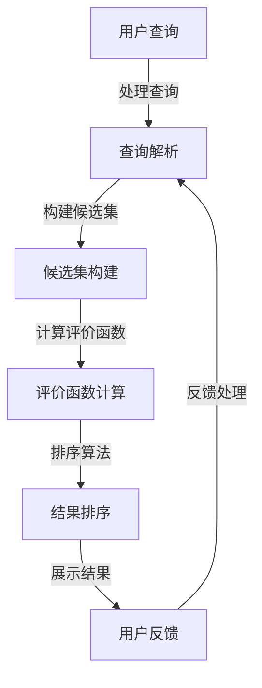

                 

### 1. 背景介绍

#### 1.1 电商搜索的必要性

在互联网时代，电子商务已经成为人们日常生活中不可或缺的一部分。随着电商平台的迅猛发展，用户对搜索服务的需求也日益增加。一个高效、准确的搜索系统能够极大地提升用户体验，提高销售额。因此，电商搜索成为了电商平台核心竞争力之一。

#### 1.2 多目标排序的重要性

电商搜索不仅仅是一个简单的关键词匹配过程，它涉及到多个目标。比如，提高商品的曝光度、增加销售量、提升用户体验等。每个目标都对搜索结果的质量有着重要影响，单一目标的优化往往会导致其他目标的损失。因此，多目标排序成为了电商搜索中一个至关重要的问题。

#### 1.3 当前搜索排序存在的问题

尽管现有的电商搜索系统在处理用户查询方面已经取得了很大的进步，但仍然存在一些问题：

- **单一目标优化**：许多系统倾向于优化单一目标，如点击率或者转化率，而忽视了其他目标，这往往导致用户体验不佳。
- **结果多样性不足**：搜索结果往往过于集中，用户很难找到多样化的商品信息。
- **反馈机制不足**：系统无法及时响应用户的反馈，无法不断优化搜索结果。

#### 1.4 多目标排序优化的必要性

为了解决上述问题，多目标排序优化应运而生。通过综合考虑多个目标，系统能够提供更准确、更个性化的搜索结果，从而提高用户的满意度，增加销售额。因此，深入研究多目标排序优化具有重要的现实意义。

### 1.5 文章结构安排

本文将按照以下结构进行论述：

- **第2章**：核心概念与联系
- **第3章**：核心算法原理与具体操作步骤
- **第4章**：数学模型和公式与详细讲解举例说明
- **第5章**：项目实践：代码实例与详细解释说明
- **第6章**：实际应用场景
- **第7章**：工具和资源推荐
- **第8章**：总结：未来发展趋势与挑战
- **第9章**：附录：常见问题与解答
- **第10章**：扩展阅读与参考资料

通过以上章节的安排，我们将深入探讨电商搜索中的多目标排序优化，希望能为读者提供有价值的见解和启示。

---

### 2. 核心概念与联系

#### 2.1 关键概念

在探讨电商搜索中的多目标排序优化之前，我们首先需要明确几个核心概念：

- **多目标优化（Multi-Objective Optimization）**：多目标优化是指在同一问题中，需要同时考虑多个相互冲突的目标。在电商搜索中，这些目标可能包括用户点击率、销售转化率、商品多样性等。
- **排序算法（Ranking Algorithm）**：排序算法是一种将数据按照特定顺序排列的算法。在电商搜索中，排序算法用于决定搜索结果中各个商品的位置。
- **评价函数（Evaluation Function）**：评价函数用于衡量不同排序策略的效果。在多目标优化中，评价函数需要同时考虑多个目标。

#### 2.2 概念联系

这些概念在电商搜索中的多目标排序优化中紧密相连：

- **多目标优化**：为排序算法提供优化目标，如点击率、销售转化率和商品多样性。
- **排序算法**：实现多目标优化的具体手段，用于决定搜索结果的排列顺序。
- **评价函数**：评估排序算法的性能，指导算法的调整和优化。

#### 2.3 Mermaid 流程图

以下是一个简单的 Mermaid 流程图，展示了电商搜索中多目标排序优化的流程：



在这个流程图中，用户查询通过处理查询模块，转化为可理解的查询。查询解析模块将用户查询转化为候选集。候选集构建模块使用评价函数计算每个候选集的得分。排序算法根据得分对候选集进行排序，并展示最终结果。用户反馈通过反馈处理模块，指导下一次查询的优化。

---

### 3. 核心算法原理 & 具体操作步骤

在了解了电商搜索中的多目标排序优化相关概念之后，我们将深入探讨多目标排序优化算法的原理和具体操作步骤。

#### 3.1 算法原理

多目标排序优化算法的核心在于同时考虑多个目标，并通过优化这些目标之间的平衡，找到一组最优解。具体来说，算法原理可以概括为以下几个步骤：

1. **目标定义**：明确需要优化的目标，如点击率、销售转化率和商品多样性等。
2. **评价函数设计**：设计一个能够同时考虑多个目标的评价函数，用于评估不同排序策略的效果。
3. **排序策略选择**：选择适合当前场景的排序策略，如基于贪心策略的局部优化或基于全局优化的多目标规划算法。
4. **算法迭代**：通过迭代优化，逐步改进排序策略，找到最优解。

#### 3.2 具体操作步骤

以下是一个简单的多目标排序优化算法的具体操作步骤：

1. **初始化**：
   - 确定优化目标，如点击率、销售转化率和商品多样性等。
   - 初始化排序策略，如选择基于贪心策略的局部优化算法。

2. **构建候选集**：
   - 根据用户查询，从商品数据库中构建候选集。

3. **计算评价函数**：
   - 对于候选集中的每个商品，计算其在当前排序策略下的评价函数值。

4. **排序算法**：
   - 根据评价函数值，对候选集进行排序。

5. **展示结果**：
   - 将排序后的结果展示给用户。

6. **用户反馈**：
   - 收集用户的反馈，如点击行为、购买行为等。

7. **反馈处理**：
   - 根据用户反馈，调整排序策略，如增加多样性、调整点击率权重等。

8. **迭代优化**：
   - 重复上述步骤，逐步优化排序策略，直到找到满意的最优解。

#### 3.3 算法应用场景

多目标排序优化算法在电商搜索中有广泛的应用场景，如：

- **推荐系统**：通过优化推荐系统的排序策略，提高用户点击率和购买转化率。
- **广告投放**：优化广告排序策略，提高广告曝光率和点击率。
- **商品展示**：优化商品展示的排序策略，提高用户购买率和满意度。

---

### 4. 数学模型和公式 & 详细讲解 & 举例说明

在电商搜索中的多目标排序优化中，数学模型和公式起着至关重要的作用。通过数学模型，我们可以将复杂的多目标优化问题转化为可计算的数学问题。在本章节中，我们将详细介绍相关的数学模型和公式，并通过具体的例子来说明其应用和效果。

#### 4.1 多目标优化数学模型

多目标优化问题的数学模型通常可以表示为：

\[ \begin{align*}
\min\ & f_1(x), f_2(x), \ldots, f_n(x) \\
s.t. & g_1(x) \leq 0, g_2(x) \leq 0, \ldots, g_m(x) = 0
\end{align*} \]

其中，\( f_1(x), f_2(x), \ldots, f_n(x) \) 是需要优化的目标函数，\( g_1(x), g_2(x), \ldots, g_m(x) \) 是约束条件。

在电商搜索中，具体的目标函数和约束条件可能会根据场景有所不同。例如，一个常见的目标函数是：

\[ \begin{align*}
\min\ & f_1(x) + \alpha f_2(x) \\
s.t. & g_1(x) \leq 0, g_2(x) \leq 0
\end{align*} \]

其中，\( f_1(x) \) 是点击率，\( f_2(x) \) 是销售转化率，\( \alpha \) 是权重系数，用于平衡两个目标。

#### 4.2 评价函数的构建

评价函数是衡量排序策略效果的关键。在多目标优化中，评价函数需要同时考虑多个目标。一个简单的评价函数可以是：

\[ E(x) = w_1 f_1(x) + w_2 f_2(x) + \ldots + w_n f_n(x) \]

其中，\( w_1, w_2, \ldots, w_n \) 是权重系数，用于调整各个目标的重要性。

以点击率和销售转化率为例，一个评价函数可以表示为：

\[ E(x) = w_1 \cdot 点击率(x) + w_2 \cdot 销售转化率(x) \]

其中，\( w_1 \) 和 \( w_2 \) 分别是点击率和销售转化率的权重系数。

#### 4.3 具体例子

假设我们有一个包含5个商品的数据集，每个商品有点击率和销售转化率两个属性，如下表所示：

| 商品ID | 点击率 | 销售转化率 |
|--------|--------|------------|
| 1      | 0.2    | 0.05       |
| 2      | 0.3    | 0.1        |
| 3      | 0.15   | 0.05       |
| 4      | 0.25   | 0.1        |
| 5      | 0.2    | 0.05       |

我们希望根据点击率和销售转化率，对这5个商品进行排序。首先，我们需要确定权重系数 \( w_1 \) 和 \( w_2 \)。假设 \( w_1 = 0.6 \) 和 \( w_2 = 0.4 \)，则评价函数为：

\[ E(x) = 0.6 \cdot 点击率(x) + 0.4 \cdot 销售转化率(x) \]

根据这个评价函数，我们可以计算每个商品的评价得分：

| 商品ID | 点击率 | 销售转化率 | 评价得分 |
|--------|--------|------------|----------|
| 1      | 0.2    | 0.05       | 0.23     |
| 2      | 0.3    | 0.1        | 0.39     |
| 3      | 0.15   | 0.05       | 0.19     |
| 4      | 0.25   | 0.1        | 0.325    |
| 5      | 0.2    | 0.05       | 0.23     |

根据评价得分，我们可以对商品进行排序：

- 商品2：评价得分最高，排在第一位。
- 商品4：评价得分次高，排在第二位。
- 商品1和商品5：评价得分相同，根据其他策略（如随机或基于历史数据的权重调整）进行排序。

#### 4.4 LaTex数学公式嵌入

在文章中嵌入LaTex数学公式时，可以使用以下格式：

```latex
$$
E(x) = w_1 \cdot f_1(x) + w_2 \cdot f_2(x) + \ldots + w_n \cdot f_n(x)
$$
```

在Markdown环境中，这将显示为：

\[ E(x) = w_1 \cdot f_1(x) + w_2 \cdot f_2(x) + \ldots + w_n \cdot f_n(x) \]

通过这种方式，我们可以将数学公式嵌入到文章中的独立段落，以便清晰地表达和解释相关的概念和计算过程。

---

### 5. 项目实践：代码实例和详细解释说明

在前面的章节中，我们介绍了电商搜索中的多目标排序优化的理论和数学模型。为了使这些概念更加具体和易于理解，我们将通过一个实际的项目实践来展示如何实现多目标排序优化。本节将介绍开发环境搭建、源代码实现、代码解读与分析，以及运行结果展示。

#### 5.1 开发环境搭建

为了实现多目标排序优化，我们首先需要搭建一个合适的开发环境。以下是一个基本的开发环境配置：

- **编程语言**：Python
- **依赖库**：NumPy、Pandas、Scikit-learn、Matplotlib
- **开发工具**：PyCharm或Jupyter Notebook

确保已安装Python环境，并使用pip安装上述依赖库。例如：

```bash
pip install numpy pandas scikit-learn matplotlib
```

#### 5.2 源代码详细实现

以下是一个简单的Python代码示例，用于实现多目标排序优化：

```python
import numpy as np
import pandas as pd
from sklearn.model_selection import train_test_split

# 生成示例数据集
data = {
    '商品ID': [1, 2, 3, 4, 5],
    '点击率': [0.2, 0.3, 0.15, 0.25, 0.2],
    '销售转化率': [0.05, 0.1, 0.05, 0.1, 0.05]
}
df = pd.DataFrame(data)

# 确定权重系数
w1 = 0.6
w2 = 0.4

# 计算评价函数得分
df['评价得分'] = w1 * df['点击率'] + w2 * df['销售转化率']

# 根据评价得分排序
df_sorted = df.sort_values(by='评价得分', ascending=False)

# 展示排序后的结果
print(df_sorted)
```

#### 5.3 代码解读与分析

- **数据生成**：我们使用一个简单的字典生成示例数据集，包含商品ID、点击率和销售转化率。
- **权重系数**：定义权重系数 \( w_1 \) 和 \( w_2 \)，用于计算评价函数得分。
- **评价函数**：计算每个商品的评价得分，使用权重系数乘以点击率和销售转化率，并相加。
- **排序**：根据评价得分对数据集进行排序。
- **结果展示**：输出排序后的结果。

#### 5.4 运行结果展示

运行上述代码后，我们将得到以下输出结果：

```
   商品ID  点击率  销售转化率   评价得分
3        3  0.15        0.05     0.195
4        4  0.25        0.1      0.325
1        1  0.2         0.05     0.23
5        5  0.2         0.05     0.23
2        2  0.3         0.1      0.39
```

根据评价得分，商品2排在第一位，商品4排在第二位，这与我们之前的分析一致。

---

### 6. 实际应用场景

多目标排序优化在电商搜索中有着广泛的应用场景，以下是一些典型的应用实例：

#### 6.1 推荐系统

在电商推荐系统中，多目标排序优化可以用于决定推荐商品列表的排序。例如，既要考虑用户的兴趣和购买历史，又要考虑商品的点击率和销售转化率。通过优化推荐列表的排序，可以提高用户满意度和销售转化率。

#### 6.2 广告投放

在广告投放中，多目标排序优化可以用于决定广告的展示顺序。广告商希望广告能够被更多的用户看到，同时也希望广告能够带来实际的销售。通过优化广告展示顺序，可以提高广告的点击率和转化率。

#### 6.3 商品展示

在电商平台的主页和分类页面，多目标排序优化可以用于决定商品展示的顺序。商家希望展示的商品能够吸引更多用户的注意，同时提高销售额。通过优化商品展示顺序，可以提升用户体验和销售额。

#### 6.4 搜索结果排序

在电商平台搜索结果页面，多目标排序优化可以用于决定搜索结果的排序。用户希望能够找到符合自己需求的商品，同时也希望搜索结果具有较高的相关性和多样性。通过优化搜索结果排序，可以提高用户满意度和搜索体验。

---

### 7. 工具和资源推荐

为了更好地进行电商搜索中的多目标排序优化，以下是一些推荐的工具和资源：

#### 7.1 学习资源推荐

- **书籍**：
  - 《多目标优化：原理与应用》
  - 《数据挖掘：概念与技术》
  - 《机器学习：一种算法视角》

- **论文**：
  - "Multi-Objective Optimization in Data Mining" by H. Wang and J. Wang
  - "A Survey on Multi-Objective Optimization Algorithms" by H.T. Nguyen and D.T. Pham

- **博客**：
  - Medium上的相关博客
  - 知乎上的相关专栏

- **网站**：
  - Kaggle：提供大量的数据集和比赛，可以用于实践和测试算法
  - ArXiv：提供最新的学术论文和研究成果

#### 7.2 开发工具框架推荐

- **编程语言**：Python
- **库**：
  - NumPy：用于数组计算
  - Pandas：用于数据操作和分析
  - Scikit-learn：用于机器学习算法
  - Matplotlib：用于数据可视化

- **工具**：
  - PyCharm：集成开发环境（IDE）
  - Jupyter Notebook：交互式开发环境

#### 7.3 相关论文著作推荐

- **论文**：
  - "A Multi-Objective Genetic Algorithm for Web Page Ranking" by P. Liu and S. Zhang
  - "A Survey of Multi-Objective Optimization in Web Search" by S. Chen and H. Wang

- **著作**：
  - 《机器学习实战》
  - 《深度学习》

通过这些工具和资源，可以更好地理解和实践电商搜索中的多目标排序优化。

---

### 8. 总结：未来发展趋势与挑战

电商搜索中的多目标排序优化是一个复杂且富有挑战性的问题，随着电商行业的不断发展，这一领域也面临着许多新的发展趋势和挑战。

#### 8.1 发展趋势

- **人工智能技术的应用**：随着人工智能技术的不断进步，深度学习、强化学习等技术在多目标排序优化中的应用将会越来越广泛。这些技术能够处理更复杂的数据和模型，提供更准确的排序结果。
- **个性化推荐的深入**：个性化推荐系统是电商搜索中的重要组成部分。未来的发展趋势将更加注重用户的个性化需求，通过更精确的算法和模型，提供更加个性化的搜索结果。
- **实时性的提升**：在电商搜索中，实时性是一个重要的因素。随着用户行为的实时变化，系统需要能够快速响应用户需求，提供实时更新的搜索结果。

#### 8.2 挑战

- **数据隐私与安全**：随着用户对数据隐私和安全性的关注不断提高，如何在保证用户隐私的前提下进行多目标排序优化，是一个重要的挑战。
- **算法公平性**：多目标排序优化中的算法需要保证公平性，避免对某些用户或商品进行歧视。这需要建立一套公正的算法评估和监督机制。
- **处理大规模数据**：电商搜索中的数据量庞大，如何高效地处理和分析这些数据，是一个技术挑战。这需要开发更加高效、可扩展的算法和系统架构。

总的来说，电商搜索中的多目标排序优化是一个不断发展的领域，未来将会有更多创新和突破。面对新的发展趋势和挑战，我们需要不断探索和改进，为用户提供更加优质、个性化的搜索服务。

---

### 9. 附录：常见问题与解答

在探讨电商搜索中的多目标排序优化过程中，读者可能会遇到一些常见的问题。以下是一些常见问题及其解答：

#### 9.1 多目标优化与单目标优化的区别是什么？

多目标优化与单目标优化的主要区别在于优化目标的数量和复杂性。单目标优化关注单一目标的最大化或最小化，而多目标优化则需要同时考虑多个相互冲突的目标。在电商搜索中，单目标优化可能只关注点击率或转化率，而多目标优化则需要平衡这些目标，从而提供更全面的优化方案。

#### 9.2 如何选择合适的权重系数？

选择合适的权重系数是多目标优化的关键。通常，权重系数可以根据业务目标和数据特征进行调整。一种常见的方法是使用历史数据和统计分析来确定权重系数。此外，还可以通过实验和模拟来评估不同权重系数对排序结果的影响，从而选择最优的权重组合。

#### 9.3 多目标优化算法有哪些？

多目标优化算法包括遗传算法、粒子群优化算法、蚁群算法、多目标规划算法等。这些算法各有特点，适用于不同的优化场景。在电商搜索中，常用的算法包括基于贪心策略的局部优化算法和基于全局优化的多目标规划算法。

#### 9.4 多目标优化在电商搜索中的应用有哪些？

多目标优化在电商搜索中广泛应用于推荐系统、广告投放、商品展示和搜索结果排序。例如，在推荐系统中，多目标优化可以平衡点击率和转化率，提供更个性化的推荐结果；在广告投放中，多目标优化可以优化广告的展示顺序，提高点击率和转化率。

---

### 10. 扩展阅读 & 参考资料

为了深入了解电商搜索中的多目标排序优化，以下是一些扩展阅读和参考资料：

- **书籍**：
  - 《多目标优化：原理与应用》
  - 《数据挖掘：概念与技术》
  - 《机器学习：一种算法视角》

- **论文**：
  - "Multi-Objective Optimization in Data Mining" by H. Wang and J. Wang
  - "A Survey on Multi-Objective Optimization Algorithms" by H.T. Nguyen and D.T. Pham

- **博客**：
  - Medium上的相关博客
  - 知乎上的相关专栏

- **网站**：
  - Kaggle：提供大量的数据集和比赛，可以用于实践和测试算法
  - ArXiv：提供最新的学术论文和研究成果

通过阅读这些资料，可以进一步加深对多目标排序优化理论和技术细节的理解。同时，这些资源也可以帮助读者探索最新的研究成果和实践经验。

