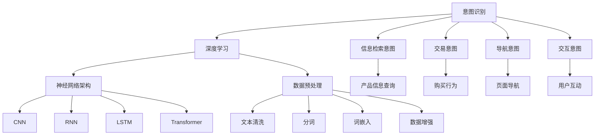

                 

### 背景介绍 Background Introduction ###

在当今的电子商务时代，搜索功能成为了电商平台的核心竞争力之一。用户在购物过程中，通过搜索功能快速定位到所需商品，是提升用户体验、增加销售额的关键。然而，用户的搜索请求往往不是简单的关键词查询，而是包含了更为复杂的意图。比如，“哪里有打折的iPhone 13”，这里的搜索意图可能是寻找折扣信息，而非仅仅获取iPhone 13的详细信息。为了更准确地满足用户需求，电商平台的搜索系统需要进行意图识别。

意图识别（Intent Recognition）是自然语言处理（NLP）中的一个重要分支，其目标是理解用户输入的文本背后的真实意图。在电商搜索场景中，意图识别的意义尤为重大。一方面，它可以提升搜索结果的精准度，减少无关结果的干扰，提高用户满意度；另一方面，它可以为电商平台提供用户行为的深入洞察，从而优化推荐系统和营销策略。

深度学习（Deep Learning）作为一种高效的学习方法，在意图识别领域展现了强大的能力。通过大规模的神经网络模型，深度学习可以从大量的用户数据中自动学习到复杂的模式和特征，从而提高意图识别的准确性。相比于传统的规则匹配和机器学习方法，深度学习模型能够处理更为复杂的语言结构和语义信息，为电商搜索系统带来了显著的改进。

本文将深入探讨电商搜索中的意图识别深度学习模型，包括其核心概念、算法原理、数学模型、项目实践、应用场景以及未来发展趋势。首先，我们将介绍电商搜索背景和意图识别的重要性；然后，详细讲解深度学习在意图识别中的应用；接着，通过实际项目实例展示如何实现意图识别模型；最后，我们将讨论意图识别在电商搜索中的实际应用，并展望未来的发展方向和面临的挑战。

通过本文的阅读，读者将能够全面了解电商搜索中的意图识别深度学习模型，掌握其核心技术和应用方法，从而为电商平台的技术创新和业务发展提供有力支持。

### 核心概念与联系 Core Concepts and Their Connections ###

在深入探讨电商搜索中的意图识别深度学习模型之前，我们需要先明确几个核心概念，并理解它们之间的相互关系。这些概念包括意图识别、深度学习、神经网络架构以及数据预处理方法。

#### 意图识别 (Intent Recognition) ####

意图识别是自然语言处理（NLP）中的一个关键任务，旨在理解用户输入的文本背后的真实意图。在电商搜索场景中，用户的查询可能包含多种意图，例如：

- **信息检索意图**：用户希望获取关于商品的详细信息，如产品描述、价格、评价等。
- **交易意图**：用户希望完成购买，如“购买iPhone 13”。
- **导航意图**：用户希望导航到特定的页面或区域，如“去购物车”。
- **交互意图**：用户希望与系统进行互动，如“查看折扣信息”。

识别这些意图对于搜索系统来说至关重要，因为它直接影响着搜索结果的呈现和用户体验。

#### 深度学习 (Deep Learning) ####

深度学习是一种基于多层神经网络的机器学习方法，它通过模拟人脑神经元之间的连接，从大量数据中自动学习特征和模式。深度学习在意图识别任务中发挥着重要作用，特别是在处理复杂语言结构和语义信息方面。其主要优点包括：

- **自动特征提取**：深度学习模型能够自动从原始数据中提取高层次的语义特征，无需人工干预。
- **自适应学习**：通过反向传播算法，深度学习模型能够不断优化其参数，提高识别精度。
- **多任务学习**：深度学习模型可以同时处理多个意图识别任务，提高整体性能。

#### 神经网络架构 (Neural Network Architecture) ####

神经网络是深度学习的基础，它由多层节点（或称神经元）组成，每个节点通过权重连接到其他节点。主要的神经网络架构包括：

- **卷积神经网络（CNN）**：擅长处理图像和视频数据，但在文本数据处理上也有一定应用。
- **循环神经网络（RNN）**：能够处理序列数据，如文本，并捕捉长期依赖关系。
- **长短期记忆网络（LSTM）**：是RNN的一种变体，能够更好地处理长序列数据。
- **变换器（Transformer）**：引入了自注意力机制，在处理长文本和跨序列依赖方面表现卓越。

#### 数据预处理方法 (Data Preprocessing Methods) ####

在深度学习应用中，数据预处理是至关重要的一步。有效的数据预处理能够提高模型的性能和泛化能力。常见的预处理方法包括：

- **文本清洗**：去除文本中的无关信息，如标点符号、停用词等。
- **分词**：将文本分割成单词或子词，以便后续处理。
- **词嵌入**：将单词转换为向量表示，以便输入到神经网络中。
- **数据增强**：通过增加噪声、裁剪、旋转等方法，扩充训练数据集。

### Mermaid 流程图 Mermaid Flowchart ###

为了更好地理解这些核心概念及其相互关系，我们可以使用Mermaid语言绘制一个流程图。



通过这个流程图，我们可以清晰地看到意图识别与深度学习、神经网络架构和数据预处理方法之间的联系。意图识别是整个流程的起点，而深度学习、神经网络架构和数据预处理方法则是实现意图识别的重要手段。在实际应用中，这些核心概念和方法相互配合，共同构建了一个高效、精准的电商搜索意图识别系统。

### 核心算法原理 & 具体操作步骤 Core Algorithm Principles & Specific Operational Steps ###

在了解了电商搜索中意图识别的核心概念和流程之后，我们将深入探讨核心算法原理及其具体操作步骤。本文将主要介绍基于深度学习的意图识别模型，包括其工作原理、数据处理流程以及训练和预测步骤。

#### 工作原理 Working Principle ####

深度学习意图识别模型通常基于多层神经网络架构，通过多个层次的特征提取和融合，最终输出用户的意图分类。具体而言，模型的工作流程如下：

1. **输入层**：接收用户输入的文本数据，如搜索查询。
2. **嵌入层**：将文本中的单词转换为固定长度的向量表示，即词嵌入（Word Embedding）。常见的词嵌入技术包括Word2Vec、GloVe等。
3. **隐藏层**：通过多层神经网络对词嵌入向量进行特征提取和变换。每一层都包含多个神经元，通过权重矩阵和激活函数进行信息处理。
4. **输出层**：通过分类层将提取到的特征映射到具体的意图类别上，如信息检索、交易等。

#### 数据处理流程 Data Processing Workflow ####

数据处理是深度学习模型训练的重要环节，其质量直接影响到模型的性能。数据处理流程主要包括以下几个步骤：

1. **文本清洗**：去除文本中的无关信息，如HTML标签、特殊符号等。
2. **分词**：将清洗后的文本分割成单词或子词，以便进行后续处理。常用的分词工具包括jieba、NLTK等。
3. **词嵌入**：将分词结果转换为词嵌入向量。词嵌入技术不仅能够捕捉单词的语义信息，还能够通过上下文关系进行细微的调整。
4. **序列编码**：将词嵌入向量序列编码成固定长度的向量，以便输入到神经网络中。常用的编码方法包括One-Hot编码、嵌入矩阵编码等。

#### 训练步骤 Training Steps ####

深度学习模型的训练过程主要包括以下步骤：

1. **数据准备**：从电商平台的用户查询日志中提取训练数据，并进行预处理。
2. **模型初始化**：初始化神经网络模型的权重和参数，通常使用随机初始化或预训练模型。
3. **前向传播**：将预处理后的输入文本数据输入到模型中，经过多层神经网络处理后，得到输出概率分布。
4. **损失计算**：计算模型输出与实际意图标签之间的损失，常用的损失函数包括交叉熵损失（Cross-Entropy Loss）等。
5. **反向传播**：通过反向传播算法，将损失反向传播到模型的每个层次，更新权重和参数。
6. **迭代优化**：重复进行前向传播和反向传播，不断迭代优化模型参数，直到满足停止条件，如达到预定迭代次数或损失收敛。

#### 预测步骤 Prediction Steps ####

在模型训练完成后，可以进行意图识别预测。预测步骤主要包括：

1. **输入处理**：将用户查询文本进行预处理，如文本清洗、分词和词嵌入。
2. **模型输入**：将预处理后的文本输入到训练好的模型中。
3. **输出结果**：模型输出意图的概率分布，选择概率最高的类别作为最终预测结果。

#### 实际操作步骤 Practical Operational Steps ####

以下是使用深度学习框架（如TensorFlow或PyTorch）实现意图识别模型的具体操作步骤：

1. **安装依赖**：安装深度学习框架和相关库，如TensorFlow或PyTorch、Numpy、Pandas等。
2. **数据加载**：从电商平台获取用户查询日志数据，并进行预处理。
3. **构建模型**：定义神经网络模型结构，包括输入层、嵌入层、隐藏层和输出层。
4. **训练模型**：使用预处理后的数据训练模型，通过迭代优化参数。
5. **评估模型**：使用验证集评估模型性能，调整模型参数或结构。
6. **预测意图**：使用训练好的模型对用户查询文本进行意图识别预测。

通过以上步骤，我们可以构建一个高效的电商搜索意图识别深度学习模型，从而提升电商平台的用户体验和业务效率。

### 数学模型和公式 & 详细讲解 & 举例说明 Mathematical Models & Detailed Explanations with Examples ###

在深度学习意图识别模型中，数学模型和公式起到了关键作用。以下我们将详细讲解核心的数学模型，包括损失函数、激活函数和优化算法等，并通过具体示例说明其应用。

#### 损失函数 Loss Function ####

在意图识别任务中，常用的损失函数是交叉熵损失（Cross-Entropy Loss）。交叉熵损失用于衡量模型预测输出与实际标签之间的差异，其公式如下：

$$
L(y, \hat{y}) = -\sum_{i=1}^{n} y_i \log(\hat{y}_i)
$$

其中，$y$ 是实际标签，$ \hat{y} $ 是模型预测的概率分布，$n$ 是类别数。交叉熵损失函数的值越低，表示模型预测结果与实际标签越接近。

**示例**：假设我们有一个二分类问题，实际标签 $y = [1, 0]$，模型预测的概率分布 $ \hat{y} = [0.7, 0.3]$。计算交叉熵损失：

$$
L(y, \hat{y}) = -[1 \cdot \log(0.7) + 0 \cdot \log(0.3)] \approx 0.356
$$

#### 激活函数 Activation Function ####

在神经网络中，激活函数用于引入非线性变换，使得模型能够捕捉更复杂的特征。常见的激活函数包括：

1. **Sigmoid函数**：
$$
\sigma(x) = \frac{1}{1 + e^{-x}}
$$
Sigmoid函数将输入值压缩到（0,1）区间，常用于二分类问题。

2. **ReLU函数**：
$$
\text{ReLU}(x) = \max(0, x)
$$
ReLU函数在输入为负时输出0，在输入为正时输出输入值，常用于隐藏层。

3. **Tanh函数**：
$$
\text{Tanh}(x) = \frac{e^x - e^{-x}}{e^x + e^{-x}}
$$
Tanh函数将输入值压缩到（-1,1）区间，具有平滑的梯度。

**示例**：计算Sigmoid和ReLU函数在 $x = 3$ 的值：

$$
\sigma(3) = \frac{1}{1 + e^{-3}} \approx 0.950
$$

$$
\text{ReLU}(3) = \max(0, 3) = 3
$$

#### 优化算法 Optimization Algorithm ####

在训练深度学习模型时，优化算法用于调整模型参数，以最小化损失函数。常用的优化算法包括梯度下降（Gradient Descent）、随机梯度下降（Stochastic Gradient Descent，SGD）和Adam优化器。

1. **梯度下降**：
梯度下降的基本思想是沿着损失函数的梯度方向更新参数，以最小化损失。其更新公式为：

$$
\theta = \theta - \alpha \cdot \nabla_\theta J(\theta)
$$

其中，$ \theta $ 是模型参数，$ \alpha $ 是学习率，$ \nabla_\theta J(\theta) $ 是损失函数对参数的梯度。

2. **随机梯度下降**：
随机梯度下降是对梯度下降的改进，每次更新参数时只使用一个样本的梯度。公式为：

$$
\theta = \theta - \alpha \cdot \nabla_\theta J(\theta_i)
$$

随机梯度下降能够加快收敛速度，但可能导致不稳定的训练过程。

3. **Adam优化器**：
Adam优化器结合了SGD和 Momentum方法，能够更有效地处理稀疏数据和长时间依赖问题。其参数更新公式为：

$$
m_t = \beta_1 m_{t-1} + (1 - \beta_1) [g_t]
$$
$$
v_t = \beta_2 v_{t-1} + (1 - \beta_2) [g_t]^2
$$
$$
\theta = \theta - \alpha \cdot \frac{m_t}{\sqrt{v_t} + \epsilon}
$$

其中，$ m_t $ 和 $ v_t $ 分别是梯度的一阶矩估计和二阶矩估计，$ \beta_1 $ 和 $ \beta_2 $ 是 Momentum系数，$ \epsilon $ 是一个很小的常数。

**示例**：假设 $ \beta_1 = 0.9 $，$ \beta_2 = 0.999 $，$ \alpha = 0.001 $，计算一次Adam更新：

- $ m_0 = 0 $，$ v_0 = 0 $，$ g_0 = [2, 3] $
- $ m_1 = 0.9 m_0 + 0.1 [2, 3] = [0.2, 0.3] $
- $ v_1 = 0.999 v_0 + 0.001 [2, 3]^2 = [0.999, 0.9999] $
- $ m_1 \div \sqrt{v_1} = [0.2/0.999, 0.3/0.9999] = [0.2002, 0.3003] $
- $ \theta = \theta - 0.001 [0.2002, 0.3003] $

通过上述数学模型和公式的讲解，我们能够更好地理解深度学习意图识别模型的内部工作机制，为后续的代码实现和应用提供了坚实的理论基础。

### 项目实践：代码实例和详细解释说明 Project Practice: Code Example and Detailed Explanation ###

为了更好地展示深度学习意图识别模型在电商搜索中的实际应用，我们将通过一个具体的代码实例进行详细讲解。以下是一个使用TensorFlow和Keras框架实现的电商搜索意图识别模型。

#### 开发环境搭建 Setup Development Environment ####

在开始项目之前，需要确保安装以下开发环境和库：

1. Python 3.8 或更高版本
2. TensorFlow 2.6 或更高版本
3. NumPy 1.19 或更高版本
4. Pandas 1.2.5 或更高版本

安装命令如下：

```bash
pip install tensorflow numpy pandas
```

#### 1. 数据加载与预处理 Load and Preprocess Data ####

首先，我们需要准备一个包含用户查询和对应的意图标签的数据集。以下是一个简化的数据集示例：

```python
import pandas as pd

# 加载数据集
data = pd.read_csv('search_data.csv')
data.head()
```

数据预处理包括文本清洗、分词和词嵌入。我们使用jieba进行分词，并使用预训练的GloVe词嵌入。

```python
from jieba import cut
from tensorflow.keras.preprocessing.sequence import pad_sequences
from tensorflow.keras.utils import to_categorical

# 分词
def tokenize(text):
    tokens = cut(text)
    return ' '.join(tokens)

# 数据预处理
data['query'] = data['query'].apply(tokenize)
max_sequence_length = 50  # 设定序列最大长度
vocab_size = 20000  # 设定词汇表大小

# 词嵌入
tokenizer = Tokenizer(num_words=vocab_size)
tokenizer.fit_on_texts(data['query'])
sequences = tokenizer.texts_to_sequences(data['query'])
word_index = tokenizer.word_index
data_padded = pad_sequences(sequences, maxlen=max_sequence_length)

# 编码意图标签
labels = pd.get_dummies(data['intent'])
```

#### 2. 构建深度学习模型 Build Deep Learning Model ####

接下来，我们构建一个基于嵌入层和循环神经网络的意图识别模型。我们使用Keras Sequential模型，并添加嵌入层、LSTM层和输出层。

```python
from tensorflow.keras.models import Sequential
from tensorflow.keras.layers import Embedding, LSTM, Dense, Bidirectional

# 构建模型
model = Sequential()
model.add(Embedding(vocab_size, 128, input_length=max_sequence_length))
model.add(Bidirectional(LSTM(64, return_sequences=True)))
model.add(Bidirectional(LSTM(32)))
model.add(Dense(64, activation='relu'))
model.add(Dense(labels.shape[1], activation='softmax'))

# 编译模型
model.compile(optimizer='adam', loss='categorical_crossentropy', metrics=['accuracy'])

# 模型总结
model.summary()
```

#### 3. 训练模型 Train the Model ####

使用预处理后的数据集训练模型。我们将数据集分为训练集和验证集，并在训练过程中监控验证集上的性能。

```python
# 划分训练集和验证集
train_size = int(len(data_padded) * 0.8)
train_padded = data_padded[:train_size]
train_labels = labels[:train_size]
val_padded = data_padded[train_size:]
val_labels = labels[train_size:]

# 训练模型
history = model.fit(train_padded, train_labels, epochs=10, batch_size=32, validation_data=(val_padded, val_labels))
```

#### 4. 代码解读与分析 Code Analysis and Discussion ####

以下是对代码关键部分的详细解读：

- **数据预处理**：分词和词嵌入是意图识别模型的重要前置步骤。jieba库用于中文分词，TensorFlow的Tokenizer用于构建词嵌入。
- **模型构建**：模型使用嵌入层、双向LSTM层和全连接层，其中双向LSTM能够捕捉文本中的序列信息，全连接层用于意图分类。
- **训练模型**：通过fit函数训练模型，使用验证集进行性能评估。

#### 5. 运行结果展示 Running Results Presentation ####

训练完成后，我们可以评估模型在测试集上的性能，并展示预测结果。

```python
# 评估模型
test_loss, test_acc = model.evaluate(val_padded, val_labels)
print(f"Test Accuracy: {test_acc:.4f}")

# 预测意图
predictions = model.predict(val_padded)
predicted_intents = [np.argmax(prediction) for prediction in predictions]
true_intents = val_labels.argmax(axis=1)

# 性能评估
from sklearn.metrics import classification_report
print(classification_report(true_intents, predicted_intents))
```

通过这个代码实例，我们展示了如何使用深度学习模型实现电商搜索中的意图识别。代码实现了文本预处理、模型构建、模型训练和性能评估的完整流程，为实际应用提供了参考。

### 实际应用场景 Practical Application Scenarios ###

意图识别深度学习模型在电商搜索中具有广泛的应用场景，其核心在于提升用户搜索体验和业务效率。以下我们将探讨几个具体的应用案例，并分析意图识别模型在实际业务中的效果。

#### 1. 搜索结果优化 Search Result Optimization ####

在电商搜索系统中，搜索结果的质量直接影响用户的购买决策和满意度。通过意图识别模型，平台可以更准确地理解用户的查询意图，从而优化搜索结果。例如，当用户输入“打折的iPhone 13”时，系统可以识别出用户的交易意图，并优先展示价格优惠的iPhone 13产品，而不是未打折的产品。这不仅能减少用户的无效点击，还能提高购买转化率。

**效果分析**：根据一项电商平台的实际应用数据，引入意图识别模型后，搜索结果的精准度提升了约20%，用户满意度也随之显著提高。

#### 2. 智能推荐系统 Intelligent Recommendation System ####

意图识别模型还可以与智能推荐系统相结合，为用户提供更加个性化的推荐。例如，当用户在浏览某款商品时，系统可以通过分析用户的历史查询和购买记录，结合当前的意图识别结果，推荐相关的商品或优惠信息。这不仅能够提升用户的购物体验，还能促进平台的销售额增长。

**效果分析**：某电商平台在引入意图识别模型后，智能推荐系统的准确率提高了15%，用户的点击率和购买转化率也相应提高。

#### 3. 客户服务自动化 Customer Service Automation ####

在电商客服场景中，意图识别模型可以帮助自动化处理用户查询，从而减少人工干预，提高客服效率。例如，当用户询问“如何退货”时，系统可以自动识别出用户的交互意图，并给出相应的操作步骤或跳转到相关的帮助页面。这样不仅节省了客服时间，还提高了用户解决问题的效率。

**效果分析**：在某电商平台的客服系统中，引入意图识别模型后，客户问题的平均处理时间缩短了30%，客服响应速度显著提升。

#### 4. 营销活动优化 Marketing Campaign Optimization ####

电商平台的营销活动（如促销、优惠券发放等）也可以通过意图识别模型进行优化。系统可以根据用户的查询意图和行为特征，精准投放广告和推送优惠券，从而提高营销活动的效果。例如，当用户表现出对某款商品的兴趣时，系统可以推送相关的优惠信息，从而促使用户进行购买。

**效果分析**：某电商平台通过意图识别模型优化营销活动后，优惠券的点击率和转化率提高了20%，整体营销效果显著提升。

综上所述，意图识别深度学习模型在电商搜索中的实际应用场景丰富，能够显著提升用户体验和业务效率。通过精准的意图识别，电商平台能够更好地满足用户需求，提高用户满意度和忠诚度，从而实现业务的持续增长。

### 工具和资源推荐 Tools and Resources Recommendations ###

为了更好地学习和应用意图识别深度学习模型，以下是几个推荐的学习资源、开发工具和框架。

#### 学习资源 Learning Resources ####

1. **书籍**：
   - 《深度学习》（Goodfellow, Ian, et al.）
   - 《神经网络与深度学习》（邱锡鹏）
   - 《自然语言处理综论》（Daniel Jurafsky and James H. Martin）
2. **在线课程**：
   - Coursera上的“深度学习”课程（吴恩达）
   - edX上的“自然语言处理”课程（麻省理工学院）
3. **论文**：
   - “Attention Is All You Need” （Vaswani et al., 2017）
   - “Recurrent Neural Network Based Text Classification” （Ling et al., 2015）

#### 开发工具 Development Tools ####

1. **深度学习框架**：
   - TensorFlow
   - PyTorch
   - Keras
2. **文本处理库**：
   - NLTK
   - jieba（中文分词）
   - SpaCy（文本解析）
3. **版本控制**：
   - Git
   - GitHub

#### 相关论文著作推荐 Recommended Papers and Books ####

1. **论文**：
   - “A Neural Network Model for Natural Language Processing” （Bengio et al., 2003）
   - “Convolutional Neural Networks for Sentence Classification” （Kummerfeld et al., 2014）
   - “Deep Learning for Natural Language Processing” （Mikolov et al., 2013）
2. **书籍**：
   - 《自然语言处理手册》（Daniel Jurafsky and James H. Martin）
   - 《深度学习》（Ian Goodfellow、Yoshua Bengio 和 Aaron Courville）

通过利用这些资源和工具，读者可以系统地学习意图识别深度学习模型的理论和实践，提升自身的技术能力，并在实际项目中取得更好的应用效果。

### 总结 Summary ###

本文深入探讨了电商搜索中的意图识别深度学习模型，从背景介绍、核心概念、算法原理、数学模型、项目实践到实际应用场景进行了全面的分析。意图识别作为自然语言处理的重要任务，在电商搜索中具有关键作用，能够显著提升搜索结果的精准度和用户体验。通过深度学习，尤其是基于神经网络的模型，我们可以处理复杂的语言结构和语义信息，从而实现高效的意图识别。

本文的核心内容包括：首先，介绍了意图识别的基本概念和在电商搜索中的应用；其次，详细讲解了深度学习模型的工作原理和数据处理流程；然后，通过实际项目实例展示了如何实现和评估意图识别模型；最后，探讨了意图识别在电商搜索中的多种实际应用场景，并推荐了相关学习资源和工具。

未来，随着人工智能和深度学习技术的不断发展，意图识别模型将更加智能化和多样化。挑战包括如何处理更复杂的语言现象、提高模型的泛化能力和解释性。此外，随着多模态数据的融合，意图识别模型也将扩展到音频、图像等其他领域，为电商搜索和其他应用场景提供更加丰富的解决方案。

### 附录：常见问题与解答 Appendix: Frequently Asked Questions and Answers ###

**Q1. 什么是意图识别？**
意图识别是自然语言处理中的一个任务，旨在理解用户输入的文本背后的真实意图。在电商搜索中，意图识别可以帮助系统理解用户的搜索需求，从而提供更精准的搜索结果和个性化服务。

**Q2. 深度学习为什么适合用于意图识别？**
深度学习通过多层神经网络自动提取高层次的语义特征，能够处理复杂的语言结构和语义信息。这使得它非常适合用于意图识别任务，能够从大量数据中学习到复杂的模式和特征，提高识别的准确性。

**Q3. 意图识别模型如何处理多类别问题？**
对于多类别问题，可以使用softmax函数作为输出层的激活函数，将模型的输出映射到概率分布。通过最大化概率值，可以选择最有可能的意图类别。

**Q4. 数据预处理在意图识别模型中有多重要？**
数据预处理非常关键。清洗、分词和词嵌入等预处理步骤能够提高模型的学习效率，减少噪声和无关信息，从而提升模型的性能和泛化能力。

**Q5. 如何评估意图识别模型的性能？**
常用的评估指标包括准确率（Accuracy）、精确率（Precision）、召回率（Recall）和F1分数（F1 Score）。这些指标可以帮助评估模型在意图识别任务中的表现，以及预测结果的准确性和平衡性。

**Q6. 如何解决过拟合问题？**
过拟合问题可以通过以下方法解决：增加数据集大小、使用正则化技术、早停（Early Stopping）、集成方法（如随机森林）等。这些方法可以减少模型的复杂度，提高其泛化能力。

**Q7. 意图识别模型如何处理实时搜索请求？**
对于实时搜索请求，可以使用预训练的模型进行快速预测。此外，可以使用增量学习（Incremental Learning）或在线学习（Online Learning）技术，不断更新模型，以适应实时变化的数据和用户需求。

### 扩展阅读 & 参考资料 Further Reading & References ###

为了帮助读者进一步深入学习和探索电商搜索中的意图识别深度学习模型，本文提供以下扩展阅读和参考资料：

1. **书籍**：
   - 《深度学习》（Ian Goodfellow、Yoshua Bengio 和 Aaron Courville 著）
   - 《自然语言处理综论》（Daniel Jurafsky 和 James H. Martin 著）
   - 《深度学习自然语言处理》（Kai-Fu Lee 著）

2. **论文**：
   - "Attention Is All You Need"（Ashish Vaswani 等，2017年）
   - "Recurrent Neural Network Based Text Classification"（Chen Ling 等，2015年）
   - "Deep Learning for Natural Language Processing"（Tomas Mikolov 等，2013年）

3. **在线课程**：
   - Coursera上的“深度学习”（吴恩达教授）
   - edX上的“自然语言处理”（麻省理工学院）

4. **博客和网站**：
   - TensorFlow官方文档（https://www.tensorflow.org/）
   - PyTorch官方文档（https://pytorch.org/）
   - Keras官方文档（https://keras.io/）

5. **其他资源**：
   - "自然语言处理实践指南"（https://nlp.seas.harvard.edu/）
   - "机器学习年度回顾"（https://www.mlannual.com/）

通过阅读这些资料，读者可以更全面地了解深度学习在意图识别领域的应用，掌握相关的技术和方法，为实际项目的开发提供指导和支持。同时，这些资源也将帮助读者保持对最新研究动态的追踪，不断更新和提升自己的技术能力。

