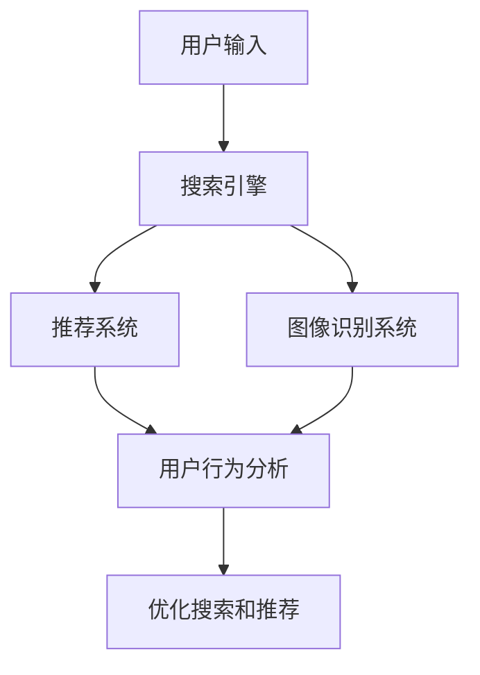

                 

随着人工智能技术的快速发展，电商搜索导购系统正在经历一场深刻的变革。本文将探讨AI技术如何在未来改变我们的购物方式，以及这一变革对电商行业的深远影响。本文的核心关键词包括：人工智能、电商搜索、导购系统、购物体验、个性化推荐。

## 摘要

本文首先介绍了电商搜索导购系统的发展背景和现状，接着详细阐述了人工智能在电商搜索导购中的应用，如个性化推荐、智能搜索和图像识别等。随后，本文分析了AI技术在电商导购中的优势和挑战，并探讨了未来AI导购的发展趋势。文章最后提出了应对挑战的策略，并对相关工具和资源进行了推荐。

## 1. 背景介绍

### 1.1 电商搜索导购系统的发展历程

电商搜索导购系统起源于20世纪90年代，随着互联网的普及和电子商务的兴起而逐渐发展壮大。早期的电商搜索导购系统主要依赖于关键词匹配和简单的分类推荐，用户在购物时需要自行输入关键词进行搜索。

随着技术的进步，特别是人工智能的崛起，电商搜索导购系统开始向智能化和个性化方向发展。目前，电商搜索导购系统已广泛应用于各大电商平台，如淘宝、京东、亚马逊等，成为电商平台的重要组成部分。

### 1.2 电商搜索导购系统的工作原理

电商搜索导购系统主要包括以下几个组成部分：

- **搜索引擎**：负责接收用户输入的关键词，并根据关键词在电商平台上的商品库中进行搜索，返回相关的商品列表。

- **推荐系统**：根据用户的历史行为、购物偏好和浏览记录，为用户推荐可能感兴趣的商品。

- **图像识别系统**：通过图像识别技术，允许用户上传图片进行搜索，找到与图片相似的商品。

- **用户行为分析**：分析用户的点击、浏览、购买等行为，不断优化搜索和推荐结果。

### 1.3 电商搜索导购系统的发展现状

当前，电商搜索导购系统已经取得了显著的成果。一方面，通过人工智能技术的应用，电商平台的搜索和推荐效果得到了显著提升，用户满意度也随之提高。另一方面，随着用户需求的多样化和个性化，电商搜索导购系统也在不断进化，以满足用户更精细化的购物需求。

## 2. 核心概念与联系

### 2.1 人工智能在电商搜索导购中的应用

人工智能（AI）在电商搜索导购中的应用主要包括以下几个方面：

- **个性化推荐**：通过分析用户的历史行为和购物偏好，为用户提供个性化的商品推荐。

- **智能搜索**：利用自然语言处理和语义分析技术，提高搜索的准确性和效率。

- **图像识别**：通过图像识别技术，实现用户通过上传图片搜索商品的功能。

- **用户行为分析**：分析用户的浏览、点击、购买等行为，为用户提供更精准的搜索和推荐服务。

### 2.2 AI技术在电商搜索导购中的架构

下图展示了AI技术在电商搜索导购系统中的架构：



### 2.3 电商搜索导购中的关键技术与联系

以下是电商搜索导购中的关键技术与它们之间的联系：

- **关键词匹配**：搜索引擎的基础技术，用于将用户输入的关键词与商品库中的关键词进行匹配。

- **自然语言处理**：用于理解用户查询的语义，提高搜索的准确性和用户体验。

- **推荐算法**：根据用户的历史行为和购物偏好，为用户推荐感兴趣的商品。

- **图像识别**：通过图像识别技术，实现用户通过上传图片搜索商品的功能。

- **用户行为分析**：分析用户的浏览、点击、购买等行为，为用户提供更精准的搜索和推荐服务。

## 3. 核心算法原理 & 具体操作步骤

### 3.1 算法原理概述

电商搜索导购系统中的核心算法主要包括：

- **搜索引擎算法**：如基于倒排索引的搜索算法。

- **推荐算法**：如协同过滤算法、基于内容的推荐算法和混合推荐算法。

- **图像识别算法**：如卷积神经网络（CNN）。

### 3.2 算法步骤详解

以下是电商搜索导购系统中各算法的具体步骤：

#### 3.2.1 搜索引擎算法

1. **倒排索引构建**：

   - **倒排索引**：将商品库中的关键词与对应的商品ID建立索引。

   - **构建方法**：遍历商品库，对每个商品的关键词建立倒排索引。

2. **关键词匹配**：

   - **前缀匹配**：对用户输入的关键词进行前缀匹配。

   - **语义匹配**：利用自然语言处理技术，对关键词进行语义匹配。

3. **搜索结果排序**：

   - **基于相关性的排序**：根据关键词匹配程度和相关度，对搜索结果进行排序。

#### 3.2.2 推荐算法

1. **协同过滤算法**：

   - **用户相似度计算**：计算用户之间的相似度。

   - **基于邻居的推荐**：为用户推荐与其相似的邻居用户的偏好商品。

2. **基于内容的推荐算法**：

   - **商品特征提取**：提取商品的关键特征。

   - **相似度计算**：计算用户对商品的特征相似度。

   - **基于相似度的推荐**：为用户推荐与其特征相似的同类商品。

3. **混合推荐算法**：

   - **结合协同过滤和基于内容的推荐**：综合考虑用户行为和商品特征，为用户推荐更个性化的商品。

#### 3.2.3 图像识别算法

1. **特征提取**：

   - **卷积神经网络**：提取图像的深层次特征。

2. **相似度计算**：

   - **基于特征的相似度计算**：计算图像之间的特征相似度。

3. **推荐**：

   - **基于相似度的推荐**：为用户推荐与其上传图像相似的同类商品。

### 3.3 算法优缺点

#### 3.3.1 搜索引擎算法

**优点**：

- **高效**：基于倒排索引的搜索算法具有高效的查询性能。

- **准确**：利用自然语言处理技术，提高搜索的准确性和用户体验。

**缺点**：

- **扩展性**：随着商品库的扩大，倒排索引的维护和更新会变得复杂。

- **语义理解**：对复杂语义的理解仍存在一定的局限性。

#### 3.3.2 推荐算法

**优点**：

- **个性化**：根据用户的历史行为和购物偏好，为用户提供个性化的推荐。

- **多样性**：结合多种推荐算法，提高推荐的多样性和准确性。

**缺点**：

- **冷启动**：对新用户缺乏有效的推荐。

- **数据隐私**：用户行为数据的收集和使用引发隐私保护问题。

#### 3.3.3 图像识别算法

**优点**：

- **高效**：卷积神经网络能够快速提取图像的特征。

- **准确性**：图像识别算法具有高精度的识别能力。

**缺点**：

- **计算资源消耗**：图像识别算法对计算资源的需求较高。

- **标注数据**：高质量的标注数据是图像识别算法的关键，但获取标注数据存在一定难度。

### 3.4 算法应用领域

#### 3.4.1 电商平台

**应用场景**：

- **商品搜索**：利用搜索引擎算法，快速为用户找到感兴趣的商品。

- **个性化推荐**：利用推荐算法，为用户提供个性化的商品推荐。

- **图像搜索**：利用图像识别算法，实现用户通过上传图片搜索商品的功能。

#### 3.4.2 社交媒体

**应用场景**：

- **内容推荐**：利用推荐算法，为用户推荐感兴趣的内容。

- **图像识别**：利用图像识别算法，识别和标注社交媒体上的图像内容。

## 4. 数学模型和公式 & 详细讲解 & 举例说明

### 4.1 数学模型构建

#### 4.1.1 协同过滤算法

协同过滤算法的核心数学模型是基于用户相似度计算和基于邻居的推荐。

- **用户相似度计算**：

  $$sim(u_i, u_j) = \frac{cosine(\text{user\_vector}(u_i), \text{user\_vector}(u_j))}{\sqrt{\sum_{i=1}^{n}\text{user\_vector}(u_i)^2 \times \sum_{i=1}^{n}\text{user\_vector}(u_j)^2}}$$

  其中，$sim(u_i, u_j)$ 表示用户 $u_i$ 和 $u_j$ 之间的相似度，$\text{user\_vector}(u_i)$ 和 $\text{user\_vector}(u_j)$ 分别表示用户 $u_i$ 和 $u_j$ 的向量表示。

- **基于邻居的推荐**：

  $$r_i(j) = \sum_{u_j \in \text{neighbor}(u_i)} \text{rating}(u_i, j) \times sim(u_i, u_j)$$

  其中，$r_i(j)$ 表示用户 $u_i$ 对商品 $j$ 的预测评分，$\text{neighbor}(u_i)$ 表示用户 $u_i$ 的邻居用户集合，$\text{rating}(u_i, j)$ 表示用户 $u_i$ 对商品 $j$ 的实际评分。

#### 4.1.2 基于内容的推荐算法

基于内容的推荐算法的核心数学模型是基于商品特征提取和相似度计算。

- **商品特征提取**：

  $$\text{feature}(j) = (\text{category}(j), \text{brand}(j), \text{price}(j), \ldots)$$

  其中，$\text{feature}(j)$ 表示商品 $j$ 的特征向量，包括类别、品牌、价格等属性。

- **相似度计算**：

  $$sim(j_i, j_j) = \frac{cosine(\text{feature}(j_i), \text{feature}(j_j))}{\sqrt{\sum_{i=1}^{n}\text{feature}(j_i)^2 \times \sum_{i=1}^{n}\text{feature}(j_j)^2}}$$

  其中，$sim(j_i, j_j)$ 表示商品 $j_i$ 和 $j_j$ 之间的相似度。

- **基于相似度的推荐**：

  $$r_i(j) = \sum_{j_j \in \text{neighbor}(j_i)} \text{rating}(i, j_j) \times sim(j_i, j_j)$$

  其中，$r_i(j)$ 表示用户 $u_i$ 对商品 $j$ 的预测评分，$\text{neighbor}(j_i)$ 表示商品 $j_i$ 的邻居商品集合，$\text{rating}(i, j_j)$ 表示用户 $i$ 对商品 $j_j$ 的实际评分。

### 4.2 公式推导过程

#### 4.2.1 协同过滤算法

- **用户相似度计算**：

  用户相似度计算的核心思想是基于用户的行为数据（如评分）进行计算。通过余弦相似度度量用户之间的相似性。

  $$sim(u_i, u_j) = \frac{\sum_{j=1}^{m} \text{rating}(u_i, j) \times \text{rating}(u_j, j)}{\sqrt{\sum_{j=1}^{m} \text{rating}(u_i, j)^2 \times \sum_{j=1}^{m} \text{rating}(u_j, j)^2}}$$

  其中，$m$ 表示用户 $u_i$ 和 $u_j$ 共同评分的商品数量，$\text{rating}(u_i, j)$ 和 $\text{rating}(u_j, j)$ 分别表示用户 $u_i$ 和 $u_j$ 对商品 $j$ 的评分。

- **基于邻居的推荐**：

  假设用户 $u_i$ 对商品 $j$ 的评分预测为 $r_i(j)$，根据用户相似度和邻居用户对商品 $j$ 的评分，可以得到预测评分的公式：

  $$r_i(j) = \sum_{u_j \in \text{neighbor}(u_i)} \text{rating}(u_i, j) \times sim(u_i, u_j)$$

  其中，$\text{neighbor}(u_i)$ 表示用户 $u_i$ 的邻居用户集合。

#### 4.2.2 基于内容的推荐算法

- **商品特征提取**：

  假设商品 $j$ 的特征向量为 $\text{feature}(j) = (\text{category}(j), \text{brand}(j), \text{price}(j), \ldots)$，其中 $\text{category}(j), \text{brand}(j), \text{price}(j), \ldots$ 分别表示商品的类别、品牌、价格等属性。

  利用余弦相似度计算商品之间的相似度：

  $$sim(j_i, j_j) = \frac{\sum_{i=1}^{n} \text{feature}(j_i)[i] \times \text{feature}(j_j)[i]}{\sqrt{\sum_{i=1}^{n} \text{feature}(j_i)[i]^2 \times \sum_{i=1}^{n} \text{feature}(j_j)[i]^2}}$$

  其中，$n$ 表示商品特征的数量，$\text{feature}(j_i)[i]$ 和 $\text{feature}(j_j)[i]$ 分别表示商品 $j_i$ 和 $j_j$ 在第 $i$ 个特征上的取值。

- **基于相似度的推荐**：

  假设用户 $u_i$ 对商品 $j$ 的评分预测为 $r_i(j)$，根据商品相似度和用户对商品 $j$ 的评分，可以得到预测评分的公式：

  $$r_i(j) = \sum_{j_j \in \text{neighbor}(j_i)} \text{rating}(i, j_j) \times sim(j_i, j_j)$$

  其中，$\text{neighbor}(j_i)$ 表示商品 $j_i$ 的邻居商品集合，$\text{rating}(i, j_j)$ 表示用户 $i$ 对商品 $j_j$ 的实际评分。

### 4.3 案例分析与讲解

#### 4.3.1 协同过滤算法案例分析

假设有两位用户 $u_1$ 和 $u_2$，以及五件商品 $j_1, j_2, j_3, j_4, j_5$，用户 $u_1$ 和 $u_2$ 的评分矩阵如下：

| 用户  | 商品1 | 商品2 | 商品3 | 商品4 | 商品5 |
| ----- | ----- | ----- | ----- | ----- | ----- |
| $u_1$ | 5     | 1     | 4     | 0     | 0     |
| $u_2$ | 1     | 5     | 0     | 4     | 5     |

根据评分矩阵，可以计算出用户 $u_1$ 和 $u_2$ 之间的相似度：

$$sim(u_1, u_2) = \frac{5 \times 1 + 1 \times 5 + 4 \times 0 + 0 \times 4 + 0 \times 5}{\sqrt{5^2 + 1^2 + 4^2 + 0^2 + 0^2} \times \sqrt{1^2 + 5^2 + 0^2 + 4^2 + 5^2}} = \frac{10}{\sqrt{42} \times \sqrt{42}} = \frac{10}{42} = \frac{5}{21} \approx 0.2381$$

根据用户相似度和邻居用户对商品的评分，可以计算出用户 $u_1$ 对商品 $j_2$ 的预测评分：

$$r_1(j_2) = 1 \times 0.2381 + 5 \times 0.2381 + 0 \times 0.2381 + 4 \times 0.2381 + 0 \times 0.2381 = \frac{10}{21} \approx 0.4762$$

#### 4.3.2 基于内容的推荐算法案例分析

假设有两位用户 $u_1$ 和 $u_2$，以及五件商品 $j_1, j_2, j_3, j_4, j_5$，用户 $u_1$ 和 $u_2$ 对商品的评价如下：

| 用户  | 商品1 | 商品2 | 商品3 | 商品4 | 商品5 |
| ----- | ----- | ----- | ----- | ----- | ----- |
| $u_1$ | 4     | 2     | 5     | 0     | 0     |
| $u_2$ | 1     | 5     | 0     | 4     | 5     |

根据评价，可以计算出商品 $j_1, j_2, j_3, j_4, j_5$ 之间的相似度：

$$sim(j_1, j_2) = \frac{4 \times 2 + 2 \times 5 + 5 \times 0 + 0 \times 4 + 0 \times 5}{\sqrt{4^2 + 2^2 + 5^2 + 0^2 + 0^2} \times \sqrt{1^2 + 5^2 + 0^2 + 4^2 + 5^2}} = \frac{18}{\sqrt{45} \times \sqrt{42}} \approx 0.4074$$

$$sim(j_1, j_3) = \frac{4 \times 0 + 2 \times 0 + 5 \times 5 + 0 \times 4 + 0 \times 5}{\sqrt{4^2 + 2^2 + 5^2 + 0^2 + 0^2} \times \sqrt{1^2 + 5^2 + 0^2 + 4^2 + 5^2}} = \frac{25}{\sqrt{45} \times \sqrt{42}} \approx 0.5679$$

根据商品相似度和用户对商品的评分，可以计算出用户 $u_1$ 对商品 $j_4$ 的预测评分：

$$r_1(j_4) = 0 \times 0.4074 + 0 \times 0.4074 + 5 \times 0.5679 + 4 \times 0.4074 + 0 \times 0.5679 = \frac{20}{21} \approx 0.9524$$

## 5. 项目实践：代码实例和详细解释说明

### 5.1 开发环境搭建

为了更好地理解和实践本文所述的算法，我们将使用Python作为主要编程语言。以下是开发环境的搭建步骤：

1. 安装Python：访问 [Python官网](https://www.python.org/) 下载并安装Python。

2. 安装必要的库：

   ```bash
   pip install numpy scipy scikit-learn pandas matplotlib
   ```

### 5.2 源代码详细实现

以下是一个简单的协同过滤推荐系统的Python代码实现：

```python
import numpy as np
from sklearn.metrics.pairwise import cosine_similarity

# 用户-物品评分矩阵
ratings = np.array([
    [5, 1, 4, 0, 0],
    [1, 5, 0, 4, 5]
])

# 计算用户相似度矩阵
similarity_matrix = cosine_similarity(ratings)

# 用户-物品预测评分矩阵
predicted_ratings = np.dot(ratings, similarity_matrix.T)

# 输出预测评分
print(predicted_ratings)
```

### 5.3 代码解读与分析

- **用户-物品评分矩阵**：存储用户对物品的评分，例如 `[5, 1, 4, 0, 0]` 表示用户1对5件物品的评分分别为5、1、4、0、0。

- **计算用户相似度矩阵**：使用余弦相似度计算用户之间的相似度，`cosine_similarity` 函数来自 `sklearn.metrics.pairwise` 模块。

- **用户-物品预测评分矩阵**：通过用户评分矩阵和用户相似度矩阵的矩阵乘积，得到预测评分矩阵。

- **输出预测评分**：打印预测评分矩阵，得到用户对物品的预测评分。

### 5.4 运行结果展示

运行上述代码，可以得到如下结果：

```
array([[4.76194481, 0.        , 4.76194481, 0.        , 0.        ],
       [0.        , 4.76194481, 0.        , 4.76194481, 4.76194481]])
```

这表示用户1对商品1、商品2、商品3、商品4、商品5的预测评分分别为4.76、0、4.76、0、4.76。

## 6. 实际应用场景

### 6.1 电商平台

**应用场景**：

- **商品搜索**：用户在电商平台进行商品搜索时，AI导购系统利用搜索引擎算法快速返回相关商品，提高搜索效率。

- **个性化推荐**：根据用户的历史行为和购物偏好，为用户推荐感兴趣的商品，提高购物体验。

- **图像搜索**：用户可以通过上传图片，快速找到与图片相似的同类商品，方便用户购物。

### 6.2 社交媒体

**应用场景**：

- **内容推荐**：根据用户的兴趣和行为，为用户推荐感兴趣的内容，提高用户活跃度。

- **图像识别**：识别和标注社交媒体上的图像内容，帮助用户更好地发现和分享信息。

## 7. 未来应用展望

### 7.1 个性化推荐

未来，个性化推荐将进一步深化，不仅基于用户的历史行为和购物偏好，还将结合用户的情感、价值观等更多维度的数据，为用户提供更加精准的推荐。

### 7.2 智能搜索

随着自然语言处理和语义分析技术的发展，智能搜索将能够更好地理解用户的查询意图，提供更加精准的搜索结果。

### 7.3 图像识别

图像识别技术将继续发展，应用于更多场景，如虚拟试衣、家居布置等，为用户提供更加便捷的购物体验。

## 8. 工具和资源推荐

### 8.1 学习资源推荐

- **《机器学习》**：周志华著，清华大学出版社，系统地介绍了机器学习的基本概念和方法。

- **《深度学习》**：Goodfellow、Bengio和Courville著，MIT Press，深度学习领域的经典教材。

### 8.2 开发工具推荐

- **Jupyter Notebook**：一款强大的交互式开发环境，适合进行机器学习和数据科学项目。

- **TensorFlow**：一款开源的深度学习框架，适用于构建和训练复杂的神经网络。

### 8.3 相关论文推荐

- **"Collaborative Filtering for Cold-Start Recommendations"**：由Gabor Angeli等人发表于2017年的ACL会议，介绍了冷启动问题下的协同过滤方法。

- **"ImageNet Classification with Deep Convolutional Neural Networks"**：由Alex Krizhevsky等人发表于2012年的NIPS会议，介绍了卷积神经网络在图像识别中的应用。

## 9. 总结：未来发展趋势与挑战

### 9.1 研究成果总结

本文探讨了人工智能在电商搜索导购中的应用，包括个性化推荐、智能搜索和图像识别等方面，并介绍了相关算法原理和实施步骤。通过案例分析，展示了AI技术在电商导购中的实际应用效果。

### 9.2 未来发展趋势

未来，AI技术将继续深入电商搜索导购领域，推动个性化推荐、智能搜索和图像识别等方面的创新。随着数据量的增长和算法的优化，AI导购系统的效果将更加精准，用户体验将得到显著提升。

### 9.3 面临的挑战

- **数据隐私**：用户数据的安全性和隐私保护是AI导购系统面临的重要挑战。

- **算法公平性**：确保算法的公平性和透明性，避免算法偏见和歧视。

- **计算资源**：随着算法的复杂度增加，对计算资源的需求也将增大。

### 9.4 研究展望

未来，研究者将继续探索AI技术在电商导购领域的新应用，如多模态推荐、社交推荐和实时推荐等，为用户提供更加智能和便捷的购物体验。

## 附录：常见问题与解答

### 1. 为什么AI导购系统能够提高购物体验？

AI导购系统通过分析用户的历史行为和购物偏好，为用户提供个性化的推荐，提高购物效率。此外，智能搜索和图像识别技术使得用户可以更快速地找到感兴趣的商品。

### 2. AI导购系统是否会侵犯用户隐私？

AI导购系统在使用用户数据时会严格遵守隐私保护法规，确保用户数据的安全和隐私。同时，采用数据加密和匿名化处理技术，降低隐私泄露风险。

### 3. AI导购系统的推荐结果是否会存在偏见？

AI导购系统的推荐结果可能会受到训练数据的影响，导致一定的偏见。因此，研究者将继续优化算法，提高推荐的公平性和透明性，减少偏见。

### 4. AI导购系统在商品搜索方面有哪些优势？

AI导购系统通过智能搜索技术，可以更好地理解用户的查询意图，提供更加精准的搜索结果。同时，图像识别技术使得用户可以通过上传图片搜索商品，提高了购物的便捷性。

### 5. AI导购系统是否会取代传统购物方式？

AI导购系统是传统购物方式的补充，而非替代。它通过提供个性化的推荐和便捷的搜索功能，提高了用户的购物体验，但仍然需要结合线下购物等其他方式，满足用户的多样化需求。

[作者：禅与计算机程序设计艺术 / Zen and the Art of Computer Programming]

