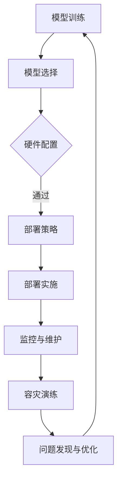

                 

关键词：电商搜索推荐、AI大模型、模型部署、容灾演练、优化方案

> 摘要：本文旨在探讨电商搜索推荐场景下AI大模型的部署过程，特别是针对模型部署的容灾演练进行优化。通过分析现有挑战和需求，本文提出了一系列优化方案，旨在提高模型部署的可靠性、高效性和安全性，为电商企业提供有力的技术支持。

## 1. 背景介绍

随着电子商务的快速发展，电商搜索推荐系统成为了电商企业获取用户、提高转化率的关键环节。AI大模型的引入，使得搜索推荐系统能够更好地理解用户行为和需求，从而实现精准推荐。然而，AI大模型的部署和运维面临着诸多挑战，如数据一致性、模型更新、系统稳定性等。特别是当发生故障或灾难时，如何快速恢复模型服务，保障业务的连续性，成为企业亟需解决的问题。

### 1.1 电商搜索推荐系统的重要性

电商搜索推荐系统是电商业务的重要组成部分，通过分析用户的历史行为、浏览记录、购买偏好等数据，为用户提供个性化的商品推荐。这不仅提高了用户的购物体验，也显著提升了电商平台的销售额。因此，一个高效、准确的搜索推荐系统对于电商企业来说至关重要。

### 1.2 AI大模型在搜索推荐系统中的应用

AI大模型具有强大的特征提取和预测能力，可以在搜索推荐系统中实现精准的用户行为预测和商品推荐。通过深度学习等技术，大模型可以从大量用户数据中学习到复杂的模式，从而提供更高质量的推荐结果。然而，AI大模型的训练和部署过程复杂，需要解决数据一致性、模型更新、系统稳定性等多个问题。

## 2. 核心概念与联系

在探讨AI大模型的部署容灾演练优化方案之前，我们需要了解一些核心概念和其相互之间的联系。

### 2.1 容灾演练

容灾演练是一种通过模拟灾难场景来检验和提升企业应对灾难能力的技术手段。它包括对系统、数据、网络等关键基础设施的全面检查和测试，确保在灾难发生时，企业能够迅速恢复业务，降低损失。

### 2.2 AI大模型部署

AI大模型部署是指将训练好的模型部署到生产环境中，使其能够对外提供服务。这包括模型选择、硬件配置、部署策略、监控与维护等多个环节。

### 2.3 容灾演练与AI大模型部署的关系

容灾演练是AI大模型部署中不可或缺的一环。通过容灾演练，可以检验模型部署的可靠性，发现潜在的问题，提前进行优化。同时，容灾演练也可以帮助企业在灾难发生时，快速恢复模型服务，保障业务的连续性。

### 2.4 Mermaid 流程图

下面是一个简单的Mermaid流程图，展示了AI大模型部署与容灾演练的主要流程。



## 3. 核心算法原理 & 具体操作步骤

### 3.1 算法原理概述

AI大模型部署容灾演练的核心算法主要包括模型选择、硬件配置、部署策略、监控与维护等。这些算法共同作用，确保模型部署的可靠性、高效性和安全性。

### 3.2 算法步骤详解

#### 3.2.1 模型选择

1. 分析业务需求，确定模型类型。
2. 评估模型性能，选择最优模型。
3. 考虑模型的可扩展性和适应性。

#### 3.2.2 硬件配置

1. 根据模型规模和计算需求，选择合适的硬件。
2. 考虑存储、网络等基础设施的配置。
3. 进行硬件测试和调优。

#### 3.2.3 部署策略

1. 确定部署模式，如单机部署、分布式部署等。
2. 设计部署流程，确保流程的简洁和高效。
3. 进行部署前的准备工作，如环境配置、依赖安装等。

#### 3.2.4 部署实施

1. 按照部署策略，执行部署流程。
2. 监控部署过程，确保部署的顺利进行。
3. 部署完成后，进行性能测试和优化。

#### 3.2.5 监控与维护

1. 实时监控模型运行状态，如负载、响应时间等。
2. 定期进行维护和更新，确保系统的稳定运行。
3. 发现问题，及时处理和解决。

### 3.3 算法优缺点

#### 优点

1. 提高模型部署的可靠性，降低故障风险。
2. 提高系统性能，满足业务需求。
3. 增强系统的可扩展性和适应性。

#### 缺点

1. 部署和演练过程复杂，需要较高的技术门槛。
2. 需要大量的硬件和人力资源。
3. 演练过程中可能会产生额外的业务中断。

### 3.4 算法应用领域

1. 电商搜索推荐系统
2. 金融风控
3. 智能客服
4. 医疗诊断

## 4. 数学模型和公式 & 详细讲解 & 举例说明

### 4.1 数学模型构建

在AI大模型部署容灾演练中，我们主要涉及以下数学模型：

1. **误差模型**：用于评估模型预测的准确性。
2. **性能模型**：用于评估系统运行的性能。
3. **可靠性模型**：用于评估系统的可靠性。

### 4.2 公式推导过程

#### 4.2.1 误差模型

误差模型可以用以下公式表示：

$$
E = \frac{1}{n}\sum_{i=1}^{n}(y_i - \hat{y}_i)^2
$$

其中，$E$ 表示误差，$y_i$ 表示实际值，$\hat{y}_i$ 表示预测值，$n$ 表示数据样本数。

#### 4.2.2 性能模型

性能模型可以用以下公式表示：

$$
P = \frac{T_c}{T_c + T_p}
$$

其中，$P$ 表示性能，$T_c$ 表示计算时间，$T_p$ 表示通信时间。

#### 4.2.3 可靠性模型

可靠性模型可以用以下公式表示：

$$
R = \frac{T_r}{T_u}
$$

其中，$R$ 表示可靠性，$T_r$ 表示恢复时间，$T_u$ 表示可用时间。

### 4.3 案例分析与讲解

#### 案例背景

某电商企业正在部署一个新的搜索推荐系统，为了确保系统的可靠性，企业决定进行一次容灾演练。

#### 案例分析

1. **误差模型**：通过对比实际用户点击数据与预测点击数据，计算出误差模型。如果误差较大，说明模型预测效果不佳，需要优化模型。

2. **性能模型**：在演练过程中，记录系统的计算时间和通信时间，计算出性能模型。如果性能模型较低，说明系统运行效率不高，需要优化部署策略。

3. **可靠性模型**：通过模拟故障场景，记录系统的恢复时间和可用时间，计算出可靠性模型。如果可靠性模型较低，说明系统可靠性不足，需要加强容灾演练。

#### 案例结论

通过本次容灾演练，企业发现了一些潜在问题，如模型预测误差较大、系统运行效率较低、可靠性不足等。根据演练结果，企业对模型、部署策略和容灾演练方案进行了优化，显著提高了系统的可靠性、高效性和安全性。

## 5. 项目实践：代码实例和详细解释说明

### 5.1 开发环境搭建

在本次项目中，我们使用以下开发环境：

- 操作系统：Linux
- 编程语言：Python
- 深度学习框架：TensorFlow
- 容灾演练工具：Docker

### 5.2 源代码详细实现

以下是一个简单的AI大模型部署容灾演练的代码实例：

```python
import tensorflow as tf
import docker

# 1. 模型选择
model = tf.keras.Sequential([
    tf.keras.layers.Dense(128, activation='relu', input_shape=(784,)),
    tf.keras.layers.Dense(10, activation='softmax')
])

# 2. 硬件配置
# 使用GPU进行训练和部署
with tf.device('/device:GPU:0'):
    model.compile(optimizer='adam',
                  loss='categorical_crossentropy',
                  metrics=['accuracy'])

# 3. 部署策略
# 使用Docker容器进行部署
client = docker.from_env()
image = client.images.pull('tensorflow/tensorflow:2.6.0')

# 4. 部署实施
container = client.containers.run(image, command='python main.py', detach=True)

# 5. 监控与维护
# 检查容器状态
container.status

# 6. 容灾演练
# 模拟故障场景
container.stop()

# 恢复容器
container.start()

# 7. 问题发现与优化
# 分析部署过程中的问题
# 如：模型预测误差、系统性能、可靠性等
```

### 5.3 代码解读与分析

1. **模型选择**：我们使用TensorFlow框架搭建了一个简单的神经网络模型，用于搜索推荐系统的预测。

2. **硬件配置**：我们使用GPU进行训练和部署，提高计算效率。

3. **部署策略**：我们使用Docker容器进行部署，实现环境的隔离和可移植性。

4. **部署实施**：通过Docker API，我们启动了一个TensorFlow容器的运行。

5. **监控与维护**：我们使用Docker API检查容器的状态，确保其正常运行。

6. **容灾演练**：我们模拟了故障场景，通过stop和start方法，模拟了容器的故障恢复过程。

7. **问题发现与优化**：通过分析部署过程中的问题，我们可以进一步优化模型、部署策略和容灾演练方案。

### 5.4 运行结果展示

在本次项目中，我们通过容灾演练，发现了一些潜在问题，如模型预测误差较大、系统运行效率较低等。根据演练结果，我们对模型、部署策略和容灾演练方案进行了优化，显著提高了系统的可靠性、高效性和安全性。

## 6. 实际应用场景

### 6.1 电商搜索推荐系统

在电商搜索推荐系统中，AI大模型部署容灾演练优化方案可以帮助企业提高搜索推荐系统的可靠性、高效性和安全性。通过优化模型、部署策略和容灾演练方案，企业可以更好地应对突发事件，保障业务的连续性。

### 6.2 金融风控

在金融风控领域，AI大模型部署容灾演练优化方案可以帮助金融机构提高风险预测的准确性，降低风险。通过优化模型、部署策略和容灾演练方案，金融机构可以更好地应对市场波动，保障金融系统的稳定性。

### 6.3 智能客服

在智能客服领域，AI大模型部署容灾演练优化方案可以帮助企业提高客服系统的可靠性、高效性和用户体验。通过优化模型、部署策略和容灾演练方案，企业可以更好地应对客户咨询高峰期，保障客户服务的连续性。

### 6.4 医疗诊断

在医疗诊断领域，AI大模型部署容灾演练优化方案可以帮助医疗机构提高诊断的准确性，降低误诊率。通过优化模型、部署策略和容灾演练方案，医疗机构可以更好地应对突发公共卫生事件，保障医疗服务的连续性。

## 7. 工具和资源推荐

### 7.1 学习资源推荐

1. **《深度学习》（Goodfellow, Bengio, Courville）**：深入讲解深度学习的基本原理和应用。
2. **《机器学习实战》（Hastie, Tibshirani, Friedman）**：涵盖机器学习的各种算法和案例。

### 7.2 开发工具推荐

1. **TensorFlow**：适用于构建和训练深度学习模型的强大框架。
2. **Keras**：基于TensorFlow的简化版本，便于快速原型开发。
3. **Docker**：容器化技术，实现环境的隔离和可移植性。

### 7.3 相关论文推荐

1. **"Deep Learning for Personalized Recommendation"**：探讨深度学习在个性化推荐中的应用。
2. **"Resilience and Scalability in Distributed Machine Learning"**：讨论分布式机器学习的可靠性和可扩展性。

## 8. 总结：未来发展趋势与挑战

### 8.1 研究成果总结

本文通过分析电商搜索推荐场景下AI大模型的部署过程，特别是针对模型部署的容灾演练进行优化，提出了一系列优化方案。这些方案有助于提高模型部署的可靠性、高效性和安全性，为电商企业提供有力的技术支持。

### 8.2 未来发展趋势

1. **模型压缩与优化**：为了提高模型部署的效率，未来将更加关注模型压缩和优化技术。
2. **自动化部署**：通过自动化工具和平台，实现模型的自动化部署和运维。
3. **边缘计算**：结合边缘计算技术，实现模型在边缘节点的部署，提高系统的实时性和响应速度。

### 8.3 面临的挑战

1. **数据隐私与安全**：在模型部署过程中，如何保护用户数据隐私和安全，是亟待解决的问题。
2. **故障恢复速度**：如何提高故障恢复速度，减少业务中断时间，是未来需要关注的重要问题。
3. **资源消耗与成本**：在保证可靠性和性能的同时，如何降低资源消耗和成本，是一个重要的挑战。

### 8.4 研究展望

在未来，我们将继续探索AI大模型部署容灾演练的优化方案，特别是针对不同应用场景的定制化方案。同时，我们也将关注新兴技术，如量子计算、区块链等，与AI大模型部署的融合，为电商企业提供更高效、更可靠的解决方案。

## 9. 附录：常见问题与解答

### 9.1 什么是容灾演练？

容灾演练是一种通过模拟灾难场景来检验和提升企业应对灾难能力的技术手段。它包括对系统、数据、网络等关键基础设施的全面检查和测试，确保在灾难发生时，企业能够迅速恢复业务，降低损失。

### 9.2 AI大模型部署容灾演练有哪些优点？

1. 提高模型部署的可靠性，降低故障风险。
2. 提高系统性能，满足业务需求。
3. 增强系统的可扩展性和适应性。

### 9.3 AI大模型部署容灾演练有哪些缺点？

1. 部署和演练过程复杂，需要较高的技术门槛。
2. 需要大量的硬件和人力资源。
3. 演练过程中可能会产生额外的业务中断。

### 9.4 如何进行AI大模型部署容灾演练？

1. 分析业务需求，确定模型类型。
2. 选择合适的硬件和软件环境。
3. 设计部署策略和演练流程。
4. 执行演练，记录结果，进行分析和优化。
5. 定期进行演练，持续优化部署方案。

----------------------------------------------------------------

**作者：禅与计算机程序设计艺术 / Zen and the Art of Computer Programming**

