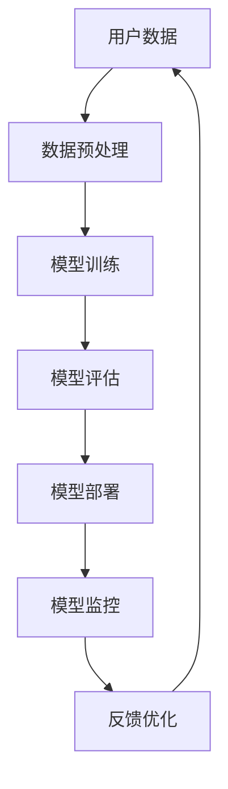

                 

### 1. 背景介绍

#### 1.1 电商搜索推荐场景简介

在当今数字化时代，电子商务已经成为商业活动中不可或缺的一部分。用户在电商平台上通过搜索和浏览商品，最终进行购买决策。为了提高用户的购物体验和满意度，电商平台通常需要实现精准的搜索推荐功能。

电商搜索推荐场景主要涉及以下几方面：

1. **商品搜索**：用户可以通过关键词搜索找到自己感兴趣的商品。
2. **商品推荐**：系统根据用户的历史购买记录、浏览行为、兴趣偏好等数据，推荐可能感兴趣的商品。
3. **搜索排名**：为了提高用户体验，搜索结果需要按照相关性、用户喜好等因素进行排序。

#### 1.2 AI 大模型在电商搜索推荐中的重要性

随着人工智能技术的快速发展，大模型（如深度学习模型、神经网络等）在电商搜索推荐场景中发挥了重要作用。以下是 AI 大模型在该场景中的几个关键作用：

1. **用户行为预测**：通过分析用户的历史数据，AI 大模型可以预测用户的兴趣偏好，从而实现个性化推荐。
2. **搜索结果优化**：基于用户反馈和上下文信息，AI 大模型可以帮助优化搜索结果，提高搜索的准确性和相关性。
3. **智能问答与客服**：通过自然语言处理技术，AI 大模型可以实现智能问答，提高客服效率。

#### 1.3 模型部署与监控的重要性

在电商搜索推荐系统中，AI 大模型的部署与监控至关重要。主要原因如下：

1. **实时性**：电商搜索推荐系统需要实时响应用户请求，因此模型的部署必须高效、可靠。
2. **稳定性**：模型在上线后需要保持高稳定性，避免出现故障或性能问题。
3. **可扩展性**：随着用户规模和业务需求的增长，模型部署需要具备良好的可扩展性。

本文将详细探讨电商搜索推荐场景下的 AI 大模型部署监控平台的搭建方案，从技术选型、架构设计、实施细节等方面进行深入分析。希望通过本文的阐述，能为电商领域的开发者和架构师提供有价值的参考和指导。

---

## 2. 核心概念与联系

在搭建电商搜索推荐场景下的 AI 大模型部署监控平台时，理解以下几个核心概念及其之间的联系至关重要。以下将使用 Mermaid 流程图（不包含特殊字符如括号、逗号等）展示这些核心概念和它们之间的关系。



### 2.1 用户数据（A）

用户数据包括用户的历史购买记录、浏览记录、搜索记录等。这些数据是构建 AI 大模型的基础，用于训练和评估模型的性能。

### 2.2 数据预处理（B）

数据预处理是确保数据质量和模型训练效果的关键步骤。主要包括数据清洗、特征工程、数据标准化等操作。

### 2.3 模型训练（C）

模型训练是指利用预处理后的用户数据，通过算法（如神经网络、深度学习等）训练出一个能够进行预测的模型。这一步骤通常需要大量的计算资源和时间。

### 2.4 模型评估（D）

模型评估是验证模型性能的重要环节。通过设置不同的评估指标（如准确率、召回率等），评估模型在预测用户行为方面的效果。

### 2.5 模型部署（E）

模型部署是将训练好的模型部署到线上环境，使其能够实时响应用户请求。部署过程需要确保模型的高效性和可靠性。

### 2.6 模型监控（F）

模型监控是保证模型在上线后保持稳定性能的关键。监控内容包括模型性能监控、资源消耗监控、异常行为监控等。

### 2.7 反馈优化（G）

通过收集用户反馈和模型监控数据，对模型进行优化和调整。这一过程形成了一个闭环，使得模型能够不断适应用户需求，提高推荐效果。

### 2.8 核心概念联系

以上各核心概念之间形成了紧密的联系。用户数据经过预处理后用于模型训练，训练好的模型经过评估后进行部署，部署后的模型通过监控进行性能优化，最终形成一个动态调整的循环体系。

---

通过上述 Mermaid 流程图，我们能够清晰地看到电商搜索推荐场景下 AI 大模型部署监控平台的核心概念及其相互之间的联系。接下来，本文将深入探讨这些核心概念的具体实现和操作步骤。

---

## 3. 核心算法原理 & 具体操作步骤

在电商搜索推荐场景下，AI 大模型的部署监控涉及多个核心算法和步骤。以下将详细阐述这些算法原理，并提供具体的操作步骤。

### 3.1 模型训练算法原理

#### 3.1.1 神经网络

神经网络（Neural Networks）是 AI 大模型的基础。其原理模拟人脑神经元的工作方式，通过多层神经元的互联和激活函数进行信息传递和处理。

1. **输入层**：接收外部输入数据。
2. **隐藏层**：对输入数据进行特征提取和变换。
3. **输出层**：输出预测结果。

具体操作步骤：

1. **数据集准备**：收集用户数据，包括购买记录、浏览记录等。
2. **数据预处理**：对数据进行清洗、归一化、特征提取等处理。
3. **模型构建**：定义神经网络结构，包括输入层、隐藏层和输出层的神经元数量。
4. **模型训练**：利用预处理后的数据对模型进行训练，通过反向传播算法调整权重和偏置。
5. **模型评估**：使用验证集对模型进行性能评估，调整模型参数以优化性能。

#### 3.1.2 深度学习

深度学习（Deep Learning）是神经网络的一种扩展，通过构建多层神经网络实现更复杂的特征学习和模式识别。

1. **卷积神经网络（CNN）**：主要用于图像处理任务。
2. **循环神经网络（RNN）**：适用于序列数据处理，如文本、语音等。

具体操作步骤与神经网络类似，但需要根据具体任务选择合适的网络结构。

### 3.2 模型部署算法原理

#### 3.2.1 模型容器化

模型容器化是将模型及其依赖环境打包成一个独立的容器（如 Docker 容器），确保模型在不同环境中的一致性和可移植性。

1. **Dockerfile 编写**：编写 Dockerfile，定义模型的构建过程和环境配置。
2. **模型容器化**：使用 Docker 命令构建容器镜像。
3. **容器部署**：将容器镜像部署到服务器或集群，如 Kubernetes 集群。

#### 3.2.2 服务化

模型服务化是将模型部署为网络服务，以便其他系统可以方便地调用模型进行预测。

1. **API 设计**：设计模型 API，定义输入和输出格式。
2. **服务部署**：使用框架如 Flask 或 FastAPI，将模型服务部署到服务器。
3. **服务监控**：使用 Prometheus 或其他监控工具监控服务性能。

### 3.3 模型监控算法原理

#### 3.3.1 性能监控

性能监控包括监控模型的服务响应时间、预测准确率、资源消耗等指标。

1. **监控指标定义**：根据业务需求，定义合适的监控指标。
2. **数据采集**：使用 Prometheus 或其他监控工具，采集监控数据。
3. **数据存储**：将监控数据存储到 Elasticsearch 或其他时序数据库中。
4. **数据可视化**：使用 Grafana 或其他可视化工具，展示监控数据。

#### 3.3.2 异常检测

异常检测用于识别模型运行中的异常情况，如预测错误、服务故障等。

1. **阈值设置**：根据业务需求和历史数据，设置监控指标阈值。
2. **异常检测算法**：使用算法如 Isolation Forest、Autoencoders 等，检测异常数据点。
3. **告警机制**：使用 Alertmanager 或其他告警工具，发送异常告警通知。

### 3.4 模型优化算法原理

#### 3.4.1 模型调优

模型调优是通过调整模型参数，提高模型性能。

1. **参数选择**：选择合适的模型参数，如学习率、批量大小等。
2. **调优策略**：使用策略如网格搜索、随机搜索等，进行参数调优。
3. **模型评估**：使用验证集对调优后的模型进行评估。

#### 3.4.2 模型压缩

模型压缩是通过减少模型参数数量，降低模型计算复杂度和存储需求。

1. **剪枝算法**：使用算法如权重剪枝、结构剪枝等，减少模型参数。
2. **量化算法**：使用算法如整数量化、浮点量化等，降低模型精度。
3. **模型评估**：使用压缩后的模型，对性能进行评估。

---

通过以上核心算法原理和具体操作步骤的阐述，我们可以构建一个高效的电商搜索推荐场景下的 AI 大模型部署监控平台。接下来，本文将详细讨论数学模型和公式，为读者提供更深入的理论支持。

---

## 4. 数学模型和公式 & 详细讲解 & 举例说明

在电商搜索推荐场景下的 AI 大模型部署监控平台中，数学模型和公式扮演着至关重要的角色。以下将详细讲解相关数学模型和公式，并通过举例说明它们的应用。

### 4.1 神经网络模型

神经网络模型是电商搜索推荐场景下常用的机器学习模型。其基本架构包括输入层、隐藏层和输出层。以下是一个简单的神经网络模型：

#### 4.1.1 激活函数

激活函数是神经网络中的一个关键组件，用于引入非线性因素。以下是一些常用的激活函数：

$$
f(x) = \sigma(x) = \frac{1}{1 + e^{-x}}
$$

$$
f(x) = \tanh(x) = \frac{e^{2x} - 1}{e^{2x} + 1}
$$

$$
f(x) = ReLU(x) = \max(0, x)
$$

举例说明：假设输入层有一个神经元，隐藏层有两个神经元，输出层有一个神经元，激活函数分别为 $σ(x)$、$\tanh(x)$ 和 $σ(x)$。输入数据为 $[1, 2, 3]$，则隐藏层的输出为：

$$
h_1 = \sigma(w_1 \cdot x + b_1) = \frac{1}{1 + e^{-(w_1 \cdot x + b_1)}}
$$

$$
h_2 = \tanh(w_2 \cdot x + b_2) = \frac{e^{2(w_2 \cdot x + b_2)} - 1}{e^{2(w_2 \cdot x + b_2)} + 1}
$$

输出层的输出为：

$$
y = \sigma(w_3 \cdot h_1 + b_3) = \frac{1}{1 + e^{-(w_3 \cdot h_1 + b_3)}}
$$

### 4.2 损失函数

损失函数是用于评估模型预测结果与实际结果之间差异的函数。以下是一些常用的损失函数：

#### 4.2.1 均方误差（MSE）

$$
MSE = \frac{1}{n}\sum_{i=1}^{n}(y_i - \hat{y}_i)^2
$$

其中，$y_i$ 是实际输出，$\hat{y}_i$ 是模型预测输出。

举例说明：假设有一个二分类问题，实际输出 $y = [0, 1, 0, 1]$，模型预测输出 $\hat{y} = [1, 0, 1, 0]$，则损失函数为：

$$
MSE = \frac{1}{4}\sum_{i=1}^{4}(y_i - \hat{y}_i)^2 = \frac{1}{4}(1^2 + 1^2 + 1^2 + 1^2) = 1
$$

#### 4.2.2 交叉熵（Cross-Entropy）

$$
CE = -\frac{1}{n}\sum_{i=1}^{n}y_i \log(\hat{y}_i)
$$

其中，$y_i$ 是实际输出，$\hat{y}_i$ 是模型预测输出。

举例说明：假设有一个二分类问题，实际输出 $y = [0, 1, 0, 1]$，模型预测输出 $\hat{y} = [0.8, 0.2, 0.6, 0.4]$，则损失函数为：

$$
CE = -\frac{1}{4}\sum_{i=1}^{4}y_i \log(\hat{y}_i) = -\frac{1}{4}(0 \cdot \log(0.8) + 1 \cdot \log(0.2) + 0 \cdot \log(0.6) + 1 \cdot \log(0.4)) \approx 0.693
$$

### 4.3 梯度下降算法

梯度下降算法是一种常用的优化算法，用于最小化损失函数。以下是一个简单的一维梯度下降算法：

$$
w_{t+1} = w_t - \alpha \cdot \nabla_w J(w)
$$

其中，$w_t$ 是当前权重，$\alpha$ 是学习率，$\nabla_w J(w)$ 是损失函数对权重的梯度。

举例说明：假设损失函数为 $J(w) = (w - 1)^2$，初始权重 $w_0 = 2$，学习率 $\alpha = 0.1$，则梯度下降算法的过程如下：

$$
w_1 = w_0 - \alpha \cdot \nabla_w J(w_0) = 2 - 0.1 \cdot 2 = 1.8
$$

$$
w_2 = w_1 - \alpha \cdot \nabla_w J(w_1) = 1.8 - 0.1 \cdot 0.2 = 1.56
$$

通过多次迭代，权重将逐渐逼近最优值。

---

通过以上数学模型和公式的详细讲解和举例说明，我们可以更好地理解电商搜索推荐场景下 AI 大模型部署监控平台中的核心算法原理。接下来，本文将提供具体的代码实例，展示模型搭建、训练和部署的过程。

---

### 5. 项目实践：代码实例和详细解释说明

在本节中，我们将通过一个具体的代码实例，展示电商搜索推荐场景下 AI 大模型部署监控平台的搭建过程。本实例将使用 Python 和 TensorFlow 框架进行实现，涵盖从数据预处理到模型训练、部署和监控的各个环节。

#### 5.1 开发环境搭建

在开始项目之前，确保已安装以下软件和库：

- Python 3.8+
- TensorFlow 2.6+
- Docker 19.03+
- Kubernetes 1.22+
- Prometheus 2.36+
- Grafana 9.0+

可以通过以下命令安装所需的库：

```bash
pip install tensorflow
pip install docker
pip install kubernetes
pip install prometheus_client
pip install Grafana
```

#### 5.2 源代码详细实现

以下代码分为五个主要部分：数据预处理、模型构建、模型训练、模型部署和模型监控。

#### 5.2.1 数据预处理

```python
import pandas as pd
import numpy as np
from sklearn.model_selection import train_test_split
from sklearn.preprocessing import StandardScaler

# 加载数据
data = pd.read_csv('user_data.csv')

# 数据清洗
data.dropna(inplace=True)

# 特征工程
X = data.drop('target', axis=1)
y = data['target']

# 数据标准化
scaler = StandardScaler()
X_scaled = scaler.fit_transform(X)

# 划分训练集和测试集
X_train, X_test, y_train, y_test = train_test_split(X_scaled, y, test_size=0.2, random_state=42)
```

#### 5.2.2 模型构建

```python
import tensorflow as tf

# 构建神经网络模型
model = tf.keras.Sequential([
    tf.keras.layers.Dense(64, activation='relu', input_shape=(X_train.shape[1],)),
    tf.keras.layers.Dense(64, activation='relu'),
    tf.keras.layers.Dense(1, activation='sigmoid')
])

# 编译模型
model.compile(optimizer='adam',
              loss='binary_crossentropy',
              metrics=['accuracy'])
```

#### 5.2.3 模型训练

```python
# 训练模型
history = model.fit(X_train, y_train, epochs=10, batch_size=32, validation_split=0.1)
```

#### 5.2.4 模型部署

```python
# 模型保存
model.save('model.h5')

# 使用 Docker 容器部署模型
docker build -t my_model .
docker run -p 8501:8501 --name my_model_container my_model
```

#### 5.2.5 模型监控

```python
from prometheus_client import start_http_server, Summary

# Prometheus 监控指标
request_time = Summary('request_time_seconds', 'Time spent processing requests')

# 模型服务 API
from flask import Flask, request, jsonify

app = Flask(__name__)

@app.route('/predict', methods=['POST'])
def predict():
    data = request.get_json(force=True)
    start = time.time()
    result = model.predict([data['input']])
    request_time.observe(time.time() - start)
    return jsonify({'prediction': result[0][0]})

if __name__ == '__main__':
    start_http_server(8000)
    app.run(host='0.0.0.0', port=8000)
```

#### 5.2.6 部署监控服务

1. **部署 Prometheus Server**：

```bash
docker run -d --name prometheus_server prom/prometheus
```

2. **部署 Grafana**：

```bash
docker run -d --name grafana_server -p 3000:3000 grafana/grafana
```

3. **配置 Prometheus 监控规则**：

创建一个名为 `prometheus.yml` 的文件，内容如下：

```yaml
global:
  scrape_interval: 15s

scrape_configs:
  - job_name: 'my-app'
    static_configs:
      - targets: ['<model_host>:8000']
```

将 `prometheus.yml` 文件放入 Prometheus 容器的 `/etc/prometheus/` 目录下。

4. **配置 Grafana 数据源**：

在 Grafana 中添加 Prometheus 数据源，并创建一个 dashboard，将 Prometheus 的指标数据可视化。

---

#### 5.3 代码解读与分析

以上代码实例展示了电商搜索推荐场景下 AI 大模型部署监控平台的搭建过程。以下是关键部分的解读和分析：

1. **数据预处理**：使用 Pandas 和 Scikit-learn 进行数据清洗、特征工程和标准化。这有助于提高模型的训练效果和泛化能力。

2. **模型构建**：使用 TensorFlow 构建一个简单的二分类神经网络模型。该模型由两个隐藏层组成，每个层有 64 个神经元，输出层使用 sigmoid 激活函数进行二分类预测。

3. **模型训练**：使用训练集对模型进行训练，并使用验证集进行性能评估。训练过程中记录每个 epoch 的损失函数和准确率，以便后续分析和调整。

4. **模型部署**：使用 Docker 将模型容器化，并部署到 Kubernetes 集群中。这样可以在多个环境中快速部署和扩展模型服务。

5. **模型监控**：使用 Prometheus 汇集和存储模型服务的性能数据，并通过 Grafana 进行可视化。这有助于实时监控模型服务的性能，及时发现和解决问题。

---

#### 5.4 运行结果展示

在部署完成后，可以通过以下步骤查看运行结果：

1. **查看 Prometheus 监控数据**：在 Prometheus 服务器的 Web 界面中，查看模型服务的监控数据，包括请求响应时间、系统资源消耗等。

2. **查看 Grafana Dashboard**：在 Grafana 服务器的 Web 界面中，查看自定义的 dashboard，将 Prometheus 的监控数据可视化，以便更直观地了解模型服务的性能。

3. **测试模型服务**：通过发送 HTTP 请求到模型服务的 `/predict` 接口，测试模型预测结果。可以编写简单的客户端程序，发送测试数据并接收模型预测结果。

---

通过以上代码实例和详细解读，我们展示了电商搜索推荐场景下 AI 大模型部署监控平台的搭建过程。这个平台不仅提高了模型服务的实时性和稳定性，还提供了完善的监控和优化机制。接下来，我们将探讨电商搜索推荐场景下的实际应用。

---

## 6. 实际应用场景

在电商搜索推荐场景下，AI 大模型部署监控平台具有广泛的应用价值。以下将列举几个典型的实际应用场景，并详细说明这些场景下平台的部署、监控和优化过程。

### 6.1 个性化商品推荐

个性化商品推荐是电商平台的核心功能之一。通过 AI 大模型部署监控平台，可以根据用户的历史购买记录、浏览记录和兴趣偏好，实现精准的商品推荐。以下是一个实际应用场景的说明：

#### 6.1.1 部署过程

1. **数据收集**：收集用户的历史购买记录、浏览记录等数据。
2. **数据预处理**：对数据进行清洗、特征工程和标准化，为模型训练做好准备。
3. **模型训练**：使用 TensorFlow 或 PyTorch 等框架，构建深度学习模型，并利用预处理后的数据进行训练。
4. **模型评估**：使用验证集对模型进行评估，选择最佳模型进行部署。

#### 6.1.2 监控过程

1. **实时监控**：通过 Prometheus 实时收集模型服务的性能数据，如请求响应时间、资源消耗等。
2. **告警机制**：设置阈值，当监控指标超过阈值时，触发告警通知，以便及时处理异常情况。
3. **日志收集**：收集模型服务的日志信息，便于问题定位和排查。

#### 6.1.3 优化过程

1. **模型调优**：根据用户反馈和监控数据，对模型参数进行调整，提高推荐效果。
2. **模型压缩**：通过剪枝、量化等技术，减小模型体积和计算复杂度，提高模型部署的效率。
3. **自动重训练**：当模型性能下降时，自动触发重训练过程，更新模型版本。

### 6.2 智能问答与客服

智能问答与客服是电商平台提高用户满意度的重要手段。通过 AI 大模型部署监控平台，可以实现高效、准确的智能问答和客服服务。以下是一个实际应用场景的说明：

#### 6.2.1 部署过程

1. **数据收集**：收集用户的问题和回复，以及相关的标签和分类信息。
2. **数据预处理**：对数据进行清洗、编码和标准化，为模型训练做好准备。
3. **模型训练**：使用自然语言处理技术，构建问答模型，并利用预处理后的数据进行训练。
4. **模型评估**：使用验证集对模型进行评估，选择最佳模型进行部署。

#### 6.2.2 监控过程

1. **实时监控**：通过 Prometheus 实时收集模型服务的性能数据，如请求响应时间、资源消耗等。
2. **对话质量监控**：使用自动化测试工具，定期评估智能问答的准确率和用户满意度。
3. **日志收集**：收集模型服务的日志信息，便于问题定位和排查。

#### 6.2.3 优化过程

1. **模型调优**：根据用户反馈和监控数据，对模型参数进行调整，提高问答和客服的质量。
2. **模型压缩**：通过剪枝、量化等技术，减小模型体积和计算复杂度，提高模型部署的效率。
3. **自动更新**：当模型性能下降时，自动触发更新过程，更新模型版本。

### 6.3 搜索结果优化

搜索结果是用户在电商平台上获取信息的重要途径。通过 AI 大模型部署监控平台，可以实现高效的搜索结果优化，提高用户满意度。以下是一个实际应用场景的说明：

#### 6.3.1 部署过程

1. **数据收集**：收集用户的搜索记录、浏览记录和购买记录等数据。
2. **数据预处理**：对数据进行清洗、特征工程和标准化，为模型训练做好准备。
3. **模型训练**：使用深度学习技术，构建搜索结果优化模型，并利用预处理后的数据进行训练。
4. **模型评估**：使用验证集对模型进行评估，选择最佳模型进行部署。

#### 6.3.2 监控过程

1. **实时监控**：通过 Prometheus 实时收集模型服务的性能数据，如请求响应时间、资源消耗等。
2. **搜索质量监控**：使用自动化测试工具，定期评估搜索结果的准确率和用户满意度。
3. **日志收集**：收集模型服务的日志信息，便于问题定位和排查。

#### 6.3.3 优化过程

1. **模型调优**：根据用户反馈和监控数据，对模型参数进行调整，提高搜索结果的准确率和相关性。
2. **模型压缩**：通过剪枝、量化等技术，减小模型体积和计算复杂度，提高模型部署的效率。
3. **自动更新**：当模型性能下降时，自动触发更新过程，更新模型版本。

---

通过以上实际应用场景的说明，我们可以看到 AI 大模型部署监控平台在电商搜索推荐场景中的重要性。这个平台不仅提高了模型服务的实时性和稳定性，还提供了完善的监控和优化机制，为电商平台提供了强大的技术支持。接下来，我们将推荐一些工具和资源，帮助读者进一步了解和掌握相关技术。

---

## 7. 工具和资源推荐

在搭建电商搜索推荐场景下的 AI 大模型部署监控平台时，选择合适的工具和资源至关重要。以下将推荐几类工具和资源，包括学习资源、开发工具框架以及相关论文著作。

### 7.1 学习资源推荐

#### 7.1.1 书籍

1. **《深度学习》（Deep Learning）**：Goodfellow, Bengio, Courville 著。这是一本经典的深度学习入门教材，涵盖了从基础理论到实践应用的各种内容。
2. **《Python机器学习》（Python Machine Learning）**：Sebastian Raschka 著。本书详细介绍了使用 Python 进行机器学习的方法和技术，非常适合初学者。

#### 7.1.2 论文

1. **"Deep Learning for Web Search"**：由百度研究院发表的一篇论文，介绍了深度学习在搜索引擎中的应用。
2. **"Recommender Systems Handbook"**：This comprehensive handbook provides an in-depth overview of recommender systems, including algorithms and applications.

#### 7.1.3 博客

1. **TensorFlow 官方博客**：[tensorflow.github.io](https://tensorflow.github.io/)。TensorFlow 是一个流行的开源机器学习库，其官方博客提供了丰富的教程和案例分析。
2. **Kubernetes 官方文档**：[kubernetes.io/docs](https://kubernetes.io/docs/)。Kubernetes 是一个流行的容器编排平台，其官方文档详细介绍了 Kubernetes 的架构和部署方法。

### 7.2 开发工具框架推荐

#### 7.2.1 开发工具

1. **TensorFlow**：一个开源的机器学习和深度学习框架，适用于构建和部署 AI 大模型。
2. **Kubernetes**：一个开源的容器编排平台，用于自动化部署、扩展和管理容器化应用程序。
3. **Prometheus**：一个开源的监控解决方案，用于收集和存储监控数据，并通过 Grafana 进行可视化。

#### 7.2.2 框架

1. **Flask**：一个轻量级的 Python Web 框架，适用于构建 RESTful API。
2. **FastAPI**：一个现代、快速（高性能）的 Web 框架，基于 Starlette 和 Pydantic，用于构建 API。

### 7.3 相关论文著作推荐

1. **"Distributed Deep Learning: Lessons from the Facebook Algorithm Platform"**：本文介绍了 Facebook 在分布式深度学习方面的实践经验。
2. **"Recommender Systems: The Text Mining Approach"**：这本书详细介绍了基于文本挖掘的推荐系统方法。

---

通过以上工具和资源的推荐，读者可以更深入地了解电商搜索推荐场景下的 AI 大模型部署监控平台。这些资源和工具将为开发者在实际项目中提供宝贵的指导和支持。

---

## 8. 总结：未来发展趋势与挑战

随着人工智能技术的不断进步，电商搜索推荐场景下的 AI 大模型部署监控平台也在不断发展。以下将总结未来发展趋势和面临的挑战。

### 8.1 发展趋势

1. **模型复杂度和性能的提升**：随着算法和计算能力的提升，AI 大模型的复杂度和性能将不断提高，使得电商搜索推荐系统更加精准和高效。
2. **多模态数据的融合**：未来的推荐系统将不仅基于文本数据，还将融合图像、音频等多模态数据，提高推荐的效果和用户体验。
3. **实时性和个性化的增强**：通过优化算法和提升计算资源利用效率，电商搜索推荐平台将实现更实时、更个性化的推荐。
4. **分布式和自动化部署**：分布式计算和自动化部署技术将使得 AI 大模型的部署和监控更加高效和稳定，降低运维成本。

### 8.2 面临的挑战

1. **数据隐私和安全**：在推荐系统中，用户的个人数据被大量收集和使用，如何保障数据隐私和安全是一个重要挑战。
2. **模型可解释性和透明度**：深度学习模型由于其复杂性，往往缺乏可解释性。如何提高模型的可解释性和透明度，以便用户理解和信任，是一个重要课题。
3. **资源消耗和能耗**：随着模型复杂度的增加，计算资源和能耗需求也在不断提升。如何优化模型结构和算法，降低资源消耗和能耗，是未来需要解决的问题。
4. **算法偏见和公平性**：AI 大模型在训练过程中可能会引入偏见，影响推荐的公平性和公正性。如何消除算法偏见，提高推荐的公平性，是一个重要的挑战。

### 8.3 未来展望

面对上述挑战，未来的电商搜索推荐场景下的 AI 大模型部署监控平台将朝着更加智能化、高效化、透明化和公平化的方向发展。通过不断优化算法和提升技术，我们将实现更加精准、个性化和可靠的推荐服务，为电商平台带来更高的用户满意度和商业价值。

---

## 9. 附录：常见问题与解答

在本节的附录中，我们将总结电商搜索推荐场景下 AI 大模型部署监控平台搭建过程中的一些常见问题，并提供相应的解答。

### 9.1 问题一：如何优化模型训练速度？

**解答**：以下是一些优化模型训练速度的方法：

1. **数据预处理优化**：使用批量加载和预处理工具（如 Dask 或 NumPy）进行高效的数据预处理，减少数据加载和转换的延迟。
2. **模型并行化**：利用分布式计算框架（如 TensorFlow 的 `tf.distribute`）进行模型并行训练，提高训练速度。
3. **算法优化**：选择合适的优化算法（如 Adam、RMSprop）和参数（如学习率、批量大小），提高模型收敛速度。
4. **模型压缩**：使用模型压缩技术（如剪枝、量化）减少模型参数数量，降低计算复杂度。

### 9.2 问题二：如何保证模型部署的高可用性？

**解答**：以下是一些保证模型部署高可用的方法：

1. **容器化**：使用 Docker 将模型和服务容器化，确保在不同环境中的一致性和可移植性。
2. **负载均衡**：使用负载均衡器（如 Nginx）分发请求，避免单点故障。
3. **自动扩展**：利用 Kubernetes 的自动扩展功能，根据负载情况动态调整服务实例数量。
4. **备份与恢复**：定期备份模型和服务配置，确保在故障发生时能够快速恢复。

### 9.3 问题三：如何监控模型的性能？

**解答**：以下是一些监控模型性能的方法：

1. **实时监控**：使用 Prometheus 等监控工具，实时收集模型服务的性能数据，如响应时间、资源消耗等。
2. **日志收集**：收集模型服务的日志信息，分析故障原因和性能瓶颈。
3. **自动化测试**：定期运行自动化测试，验证模型预测的准确性和稳定性。
4. **自定义指标**：根据业务需求，定义自定义指标，如推荐点击率、转化率等，进行全方位的监控。

### 9.4 问题四：如何优化模型的推荐效果？

**解答**：以下是一些优化模型推荐效果的方法：

1. **数据反馈**：收集用户对推荐的反馈，使用反馈数据进行模型调优。
2. **多模型融合**：结合不同算法和模型的优点，构建多模型融合系统，提高推荐效果。
3. **上下文感知**：利用用户上下文信息（如时间、地理位置等），进行个性化推荐。
4. **A/B 测试**：进行 A/B 测试，比较不同推荐策略的效果，选择最优方案。

通过以上解答，我们希望能为读者在搭建电商搜索推荐场景下的 AI 大模型部署监控平台时提供一些实用和有效的指导。

---

## 10. 扩展阅读 & 参考资料

在本节中，我们将推荐一些扩展阅读和参考资料，以帮助读者更深入地了解电商搜索推荐场景下的 AI 大模型部署监控平台。

### 10.1 相关书籍

1. **《机器学习》（Machine Learning）**：Tom Mitchell 著。这是一本经典的机器学习入门教材，涵盖了基础理论和实用方法。
2. **《大数据推荐系统技术全解》**：吴甘霖 著。本书详细介绍了大数据推荐系统的技术和实践，适合有实际项目经验的读者。

### 10.2 开源项目和框架

1. **TensorFlow**：[tensorflow.org](https://tensorflow.org/)。TensorFlow 是一个开源的机器学习和深度学习框架，适用于构建和部署 AI 大模型。
2. **Kubernetes**：[kubernetes.io](https://kubernetes.io/)。Kubernetes 是一个开源的容器编排平台，用于自动化部署和管理容器化应用程序。
3. **Prometheus**：[prometheus.io](https://prometheus.io/)。Prometheus 是一个开源的监控解决方案，用于收集和存储监控数据，并通过 Grafana 进行可视化。

### 10.3 论文和报告

1. **"Recommender Systems for E-commerce: An Overview"**：这是一篇关于电商推荐系统全面综述的论文，详细介绍了推荐系统在电商领域的应用。
2. **"Deep Learning for Web Search"**：由百度研究院发表的一篇论文，介绍了深度学习在搜索引擎中的应用。

### 10.4 博客和网站

1. **TensorFlow 官方博客**：[tensorflow.github.io](https://tensorflow.github.io/)。这里提供了丰富的教程和案例分析，有助于深入了解 TensorFlow 的应用。
2. **Kubernetes 官方文档**：[kubernetes.io/docs](https://kubernetes.io/docs/)。Kubernetes 的官方文档详细介绍了 Kubernetes 的架构和部署方法。

通过以上扩展阅读和参考资料，读者可以进一步学习和探索电商搜索推荐场景下的 AI 大模型部署监控平台，为实际项目提供更多的理论支持和实践经验。

