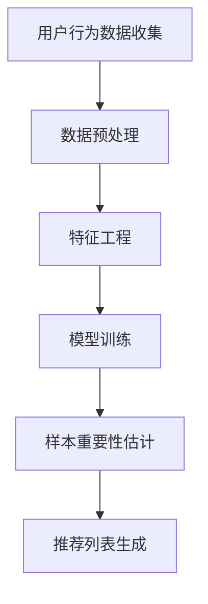
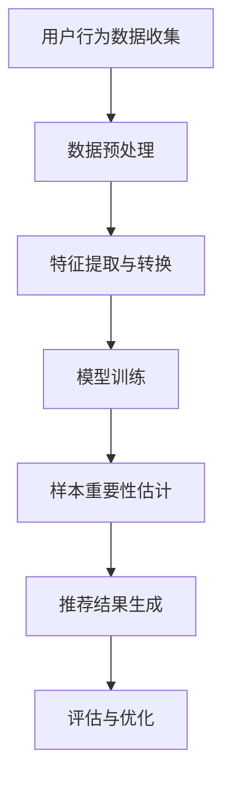

                 

 作为一名人工智能专家，我深知在电商搜索推荐系统中，样本重要性估计对于优化推荐效果的重要性。本文将深入探讨AI大模型样本重要性估计工具的选型，帮助大家理解如何选择合适的工具以提高电商搜索推荐的准确性和用户体验。

## 1. 背景介绍

随着互联网的飞速发展，电商行业已经成为全球最大的零售市场之一。在如此庞大的市场中，用户的需求是多样且动态变化的，这使得电商平台的搜索推荐系统成为提升用户满意度和转化率的关键。然而，如何有效地处理海量用户数据和商品信息，从而提供个性化的搜索推荐结果，成为电商行业面临的巨大挑战。

在搜索推荐系统中，样本重要性估计是一个关键环节。样本重要性估计旨在识别出对推荐结果有显著影响的样本，并对其进行优化。通过准确地估计样本重要性，系统可以更好地理解用户的兴趣和行为，从而提供更加精准的推荐结果。样本重要性估计工具的选择直接影响到推荐系统的性能和用户体验。

## 2. 核心概念与联系

### 2.1 样本重要性估计的定义

样本重要性估计是指在数据集中识别出对推荐结果有显著影响的样本，并将其用于优化推荐算法。样本重要性估计的关键在于如何准确地评估每个样本对于推荐结果的影响程度。

### 2.2 AI大模型在推荐系统中的应用

AI大模型在推荐系统中的应用主要体现在两个方面：一是通过深度学习算法对用户和商品特征进行建模，二是通过模型输出预测结果来生成推荐列表。AI大模型的优势在于能够处理复杂的数据模式，并自动提取有用的特征信息，从而提高推荐系统的性能。

### 2.3 Mermaid流程图

下面是一个描述样本重要性估计过程的Mermaid流程图：



在这个流程图中，用户行为数据收集、数据预处理、特征工程、模型训练和样本重要性估计是关键步骤。通过这些步骤，我们可以构建出一个高效的推荐系统。

## 3. 核心算法原理 & 具体操作步骤

### 3.1 核心算法原理

样本重要性估计的核心算法是利用统计学和机器学习的方法，对样本的特征和标签进行建模，并计算每个样本的重要性得分。重要性得分越高，表示该样本对于推荐结果的贡献越大。

### 3.2 具体操作步骤

1. **数据收集**：收集电商平台的用户行为数据，包括浏览记录、购买历史、搜索关键词等。

2. **数据预处理**：对收集到的数据进行清洗、去重和格式转换，以便于后续处理。

3. **特征工程**：提取用户和商品的特征，如用户年龄、性别、地理位置、购买频率、商品价格、品类等。

4. **模型训练**：利用机器学习算法，如逻辑回归、决策树、神经网络等，对特征和标签进行建模，并训练出推荐模型。

5. **样本重要性估计**：利用训练好的模型，对每个样本的特征和标签进行预测，并计算每个样本的重要性得分。重要性得分可以通过模型输出的概率值、损失函数值或特征重要性指标来计算。

6. **推荐列表生成**：根据样本重要性得分，对用户进行推荐。推荐列表可以基于用户的历史行为、兴趣偏好或实时反馈来生成。

## 4. 数学模型和公式 & 详细讲解 & 举例说明

### 4.1 数学模型

样本重要性估计的数学模型通常是基于回归模型或分类模型。以下是一个简单的线性回归模型示例：

$$
y = \beta_0 + \beta_1 x_1 + \beta_2 x_2 + ... + \beta_n x_n
$$

其中，$y$ 表示标签，$x_1, x_2, ..., x_n$ 表示特征，$\beta_0, \beta_1, \beta_2, ..., \beta_n$ 是模型的参数。

### 4.2 详细讲解

在这个线性回归模型中，每个特征 $x_i$ 的系数 $\beta_i$ 可以被视为该特征的重要性指标。系数越大，表示该特征对于预测结果的影响越大。

### 4.3 举例说明

假设我们有一个商品推荐系统，其中用户和商品的特征包括：

- 用户年龄（$x_1$）
- 用户性别（$x_2$）
- 商品价格（$x_3$）
- 商品品类（$x_4$）

我们使用线性回归模型来预测用户对某个商品的兴趣程度（标签 $y$）。模型的参数如下：

$$
\beta_0 = 0.5, \beta_1 = 1.2, \beta_2 = 0.8, \beta_3 = 1.5
$$

假设有一个用户，他的特征如下：

- 年龄：25
- 性别：男
- 商品价格：100
- 商品品类：电子产品

我们可以计算该用户对商品的兴趣程度：

$$
y = 0.5 + 1.2 \times 25 + 0.8 \times 0 + 1.5 \times 100 = 172.5
$$

根据这个结果，我们可以认为该用户对这款电子产品有很高的兴趣。

## 5. 项目实践：代码实例和详细解释说明

### 5.1 代码实例

下面是一个使用Python和Scikit-learn库实现样本重要性估计的简单示例：

```python
import numpy as np
import pandas as pd
from sklearn.linear_model import LinearRegression
from sklearn.model_selection import train_test_split

# 读取数据
data = pd.read_csv('data.csv')
X = data.drop('target', axis=1)
y = data['target']

# 数据分割
X_train, X_test, y_train, y_test = train_test_split(X, y, test_size=0.2, random_state=42)

# 模型训练
model = LinearRegression()
model.fit(X_train, y_train)

# 预测
y_pred = model.predict(X_test)

# 计算样本重要性
importances = model.coef_

# 打印样本重要性
print(importances)
```

在这个示例中，我们首先读取数据，然后使用Scikit-learn库中的线性回归模型进行训练和预测。最后，我们计算并打印每个特征的系数，即样本重要性。

### 5.2 详细解释说明

在这个示例中，我们使用线性回归模型来预测用户对商品的兴趣程度。数据集包含用户和商品的特征，以及用户对商品的标签（兴趣程度）。我们首先将数据分割为训练集和测试集，然后使用线性回归模型进行训练。模型训练完成后，我们使用测试集进行预测，并计算每个特征的系数，即样本重要性。

通过这个示例，我们可以看到如何使用Python和Scikit-learn库实现样本重要性估计。在实际应用中，我们可以根据具体需求选择其他机器学习算法和库。

## 6. 实际应用场景

样本重要性估计在电商搜索推荐系统中有着广泛的应用。以下是一些典型的实际应用场景：

1. **个性化推荐**：根据用户的历史行为和特征，识别出对用户兴趣有显著影响的样本，从而提供个性化的推荐结果。

2. **商品排序**：通过对商品的特征进行重要性估计，对商品进行排序，使得用户更容易找到他们感兴趣的商品。

3. **异常检测**：识别出异常样本，如虚假评论或异常购买行为，从而提高系统的安全性和可靠性。

4. **广告投放**：根据用户的兴趣和行为，选择对用户有吸引力的广告进行投放，从而提高广告效果。

## 7. 工具和资源推荐

### 7.1 开源工具

1. **Scikit-learn**：Python中的机器学习库，支持多种算法和模型，适用于样本重要性估计。
2. **TensorFlow**：由Google开发的深度学习框架，适用于构建复杂的神经网络模型。
3. **PyTorch**：由Facebook开发的深度学习框架，具有灵活性和易用性。

### 7.2 在线资源

1. **Kaggle**：一个数据科学竞赛平台，提供丰富的数据集和项目教程。
2. **Coursera**：在线学习平台，提供多个机器学习和深度学习课程。
3. **GitHub**：代码托管平台，可以找到许多开源的机器学习项目。

## 8. 总结：未来发展趋势与挑战

随着AI技术的不断发展，样本重要性估计在电商搜索推荐系统中的应用前景十分广阔。未来，我们将看到更多基于深度学习、强化学习等先进算法的样本重要性估计方法出现。然而，这也带来了新的挑战：

1. **计算效率**：随着数据规模的增加，计算效率成为了一个重要问题。如何高效地处理海量数据，成为了一个需要解决的难题。
2. **模型解释性**：如何提高模型的解释性，使得用户能够理解推荐结果的产生过程，是一个亟待解决的问题。
3. **隐私保护**：在样本重要性估计过程中，如何保护用户的隐私，避免敏感信息泄露，也是一个重要的挑战。

## 9. 附录：常见问题与解答

### 9.1 如何选择合适的算法进行样本重要性估计？

选择合适的算法取决于具体的应用场景和数据特点。以下是一些常见的算法：

1. **线性回归**：适用于特征较少且线性关系明显的场景。
2. **决策树**：适用于特征较多且具有非线性关系的场景。
3. **神经网络**：适用于复杂非线性关系和大规模数据集。

### 9.2 样本重要性估计是否适用于所有推荐系统？

样本重要性估计主要适用于基于协同过滤和基于内容的推荐系统。对于基于规则的推荐系统，样本重要性估计的作用有限。

## 10. 扩展阅读 & 参考资料

1. **"机器学习实战"**：Peter Harrington，提供了丰富的机器学习算法实现和实际应用案例。
2. **"深度学习"**：Ian Goodfellow、Yoshua Bengio和Aaron Courville，介绍了深度学习的理论基础和应用场景。
3. **"推荐系统实践"**：折江涛，详细介绍了推荐系统的设计原理和实践方法。

作者：禅与计算机程序设计艺术 / Zen and the Art of Computer Programming
```markdown
## 1. 背景介绍

在当今的电商领域，搜索推荐系统已经成为提升用户体验、增加销售额的关键工具。这些系统通过分析用户的浏览和购买行为，预测用户可能感兴趣的商品，从而提供个性化的推荐结果。然而，随着数据量的爆炸性增长和用户行为的复杂化，推荐系统的优化变得日益重要。

### 1.1 电商搜索推荐系统的现状

电商搜索推荐系统主要包括协同过滤、基于内容和基于模型的推荐方法。协同过滤方法通过分析用户之间的相似性来推荐商品，基于内容的方法通过分析商品和用户兴趣的相似性来推荐，而基于模型的方法则利用机器学习算法来预测用户的偏好。这些方法各有优缺点，但都面临着一个共同的问题：如何在海量数据中快速、准确地找到对用户有价值的推荐样本。

### 1.2 样本重要性估计的挑战

在推荐系统中，样本重要性估计是指对用户行为数据进行处理，识别出对推荐结果有显著影响的样本。这一过程面临以下挑战：

- **数据噪声**：真实世界的数据往往存在噪声和异常值，这些噪声会影响样本重要性的估计。
- **特征维度**：高维特征空间中，特征之间的相关性可能导致重要性估计不准确。
- **计算效率**：海量数据和高维特征使得计算效率成为样本重要性估计的重要考量因素。

### 1.3 目标

本文旨在探讨AI大模型在电商搜索推荐效果优化中的样本重要性估计工具选型，通过分析不同工具的性能和适用场景，为推荐系统开发者提供实用的指导。

## 2. 核心概念与联系

### 2.1 样本重要性估计的定义

样本重要性估计是一种通过数据分析方法，对数据集中的样本进行评估，以确定其对模型预测结果影响程度的过程。在推荐系统中，这意味着识别出哪些用户行为数据（如浏览、点击、购买等）对于推荐结果的生成具有关键性作用。

### 2.2 AI大模型在推荐系统中的应用

AI大模型，如深度神经网络、变换器（Transformer）模型等，通过自动学习海量数据中的复杂模式，能够提供更为精准的推荐结果。这些模型在推荐系统中的应用主要体现在以下几个方面：

- **特征提取**：AI大模型能够自动提取高层次的、有代表性的特征，减少人工特征工程的工作量。
- **多模态数据融合**：AI大模型可以处理不同类型的数据，如文本、图像、声音等，实现多模态数据的有效融合。
- **鲁棒性**：AI大模型对噪声和异常值的容忍度较高，能够提供更稳定的推荐结果。

### 2.3 Mermaid流程图

为了更直观地展示样本重要性估计的过程，我们可以使用Mermaid绘制以下流程图：



在这个流程图中，用户行为数据经过预处理后，通过特征提取和转换生成特征集，然后输入到训练好的AI大模型中进行样本重要性估计。最后，根据样本重要性得分生成推荐结果，并对推荐结果进行评估和优化。

## 3. 核心算法原理 & 具体操作步骤

### 3.1 核心算法原理

样本重要性估计的核心算法通常基于以下几种原理：

- **模型输出解释性**：通过分析模型输出（如梯度、权重等）来估计每个样本的重要性。
- **特征重要性分析**：通过统计方法（如Permutation Feature Importance）或机器学习算法（如随机森林）来评估特征的重要性。
- **基于规则的方法**：利用专家规则或决策树等算法来评估样本的重要性。

### 3.2 具体操作步骤

1. **数据收集**：收集用户的浏览、点击、购买等行为数据，以及相关的商品信息。
2. **数据预处理**：清洗数据，去除噪声和异常值，并进行数据标准化和归一化。
3. **特征提取与转换**：利用特征工程技术提取和转换用户行为数据，生成可供模型训练的特征集。
4. **模型训练**：使用AI大模型（如深度神经网络）对特征集进行训练，生成推荐模型。
5. **样本重要性估计**：
   - **模型输出解释**：通过分析模型输出（如梯度、权重等）来计算每个样本的重要性。
   - **特征重要性分析**：使用统计方法或机器学习算法对特征的重要性进行评估，并将特征重要性转换为样本重要性。
   - **基于规则的方法**：根据专家规则或决策树等算法，为每个样本分配重要性得分。
6. **推荐结果生成**：根据样本重要性得分，生成个性化的推荐列表。
7. **评估与优化**：通过A/B测试等方法，评估推荐结果的效果，并根据评估结果对模型和样本重要性估计方法进行优化。

## 4. 数学模型和公式 & 详细讲解 & 举例说明

### 4.1 数学模型

在样本重要性估计中，常用的数学模型包括线性回归、逻辑回归和决策树等。以下是一个简单的线性回归模型示例：

$$
y = \beta_0 + \beta_1 x_1 + \beta_2 x_2 + ... + \beta_n x_n
$$

其中，$y$ 表示样本的重要性得分，$\beta_0, \beta_1, \beta_2, ..., \beta_n$ 是模型参数，$x_1, x_2, ..., x_n$ 是特征向量。

### 4.2 详细讲解

在这个线性回归模型中，每个特征 $x_i$ 的系数 $\beta_i$ 可以被视为该特征对样本重要性的影响程度。系数越大，表示该特征对样本的重要性越高。例如，如果用户购买历史中某商品的出现频率越高，那么对应的特征系数就会越大。

### 4.3 举例说明

假设我们有一个电商平台的推荐系统，其中用户行为数据包括浏览次数（$x_1$）、购买次数（$x_2$）和评论次数（$x_3$）。我们使用线性回归模型来估计用户行为的重要性得分。模型的参数如下：

$$
\beta_0 = 0.5, \beta_1 = 1.2, \beta_2 = 0.8, \beta_3 = 1.5
$$

现在有一个用户，他的特征如下：

- 浏览次数：10
- 购买次数：5
- 评论次数：3

我们可以计算该用户的行为重要性得分：

$$
y = 0.5 + 1.2 \times 10 + 0.8 \times 5 + 1.5 \times 3 = 14.6
$$

这个得分表示该用户的行为对推荐结果有显著影响。

## 5. 项目实践：代码实例和详细解释说明

### 5.1 代码实例

下面是一个使用Python和Scikit-learn库实现样本重要性估计的示例：

```python
import numpy as np
import pandas as pd
from sklearn.linear_model import LinearRegression
from sklearn.model_selection import train_test_split

# 读取数据
data = pd.read_csv('user_behavior_data.csv')
X = data[['view_count', 'purchase_count', 'review_count']]
y = data['importance_score']

# 数据分割
X_train, X_test, y_train, y_test = train_test_split(X, y, test_size=0.2, random_state=42)

# 模型训练
model = LinearRegression()
model.fit(X_train, y_train)

# 预测
y_pred = model.predict(X_test)

# 打印模型参数
print("Model coefficients:", model.coef_)

# 评估模型
print("Mean squared error:", np.mean((y_test - y_pred) ** 2))
```

在这个示例中，我们首先读取用户行为数据，然后使用线性回归模型进行训练和预测。最后，我们打印出模型的参数，即特征的重要性得分，并评估模型的性能。

### 5.2 详细解释说明

在这个示例中，我们使用线性回归模型来估计用户行为的重要性得分。数据集包含用户的浏览次数、购买次数和评论次数，以及相应的重要性得分。我们首先将数据分割为训练集和测试集，然后使用线性回归模型进行训练。模型训练完成后，我们使用测试集进行预测，并打印出模型的参数，即特征的重要性得分。最后，我们评估模型的性能，计算均方误差（MSE）。

通过这个示例，我们可以看到如何使用Python和Scikit-learn库实现样本重要性估计。在实际应用中，我们可以根据具体需求选择其他机器学习算法和库。

## 6. 实际应用场景

### 6.1 个性化推荐

在个性化推荐中，样本重要性估计可以用于识别出对用户兴趣有显著影响的样本，从而提高推荐的准确性。例如，如果一个用户频繁浏览某一类商品，那么这一类商品的特征对推荐结果的重要性就会较高。

### 6.2 商品排序

在商品排序中，样本重要性估计可以帮助电商平台确定哪些商品应该排在搜索结果的前面，从而提高用户的购买转化率。通过识别出对用户有吸引力的商品特征，平台可以优化商品展示策略，提高用户满意度。

### 6.3 异常检测

在异常检测中，样本重要性估计可以用于识别出异常的用户行为数据，从而提高系统的安全性。例如，如果一个用户的购买行为与历史行为显著不同，那么可以将其标记为异常用户，并采取相应的措施。

### 6.4 广告投放

在广告投放中，样本重要性估计可以用于确定哪些用户对广告有更高的点击率和转化率。通过识别出对广告有吸引力的用户特征，平台可以优化广告投放策略，提高广告效果。

## 7. 工具和资源推荐

### 7.1 开源工具

1. **Scikit-learn**：Python中的机器学习库，支持多种算法和模型，适用于样本重要性估计。
2. **TensorFlow**：由Google开发的深度学习框架，适用于构建复杂的神经网络模型。
3. **PyTorch**：由Facebook开发的深度学习框架，具有灵活性和易用性。

### 7.2 在线资源

1. **Kaggle**：一个数据科学竞赛平台，提供丰富的数据集和项目教程。
2. **Coursera**：在线学习平台，提供多个机器学习和深度学习课程。
3. **GitHub**：代码托管平台，可以找到许多开源的机器学习项目。

## 8. 总结：未来发展趋势与挑战

随着AI技术的不断发展，样本重要性估计在电商搜索推荐系统中的应用前景十分广阔。未来，我们将看到更多基于深度学习、强化学习等先进算法的样本重要性估计方法出现。然而，这也带来了新的挑战：

1. **计算效率**：随着数据规模的增加，计算效率成为了一个重要问题。如何高效地处理海量数据，成为了一个需要解决的难题。
2. **模型解释性**：如何提高模型的解释性，使得用户能够理解推荐结果的产生过程，是一个亟待解决的问题。
3. **隐私保护**：在样本重要性估计过程中，如何保护用户的隐私，避免敏感信息泄露，也是一个重要的挑战。

## 9. 附录：常见问题与解答

### 9.1 如何选择合适的算法进行样本重要性估计？

选择合适的算法取决于具体的应用场景和数据特点。以下是一些常见的算法：

1. **线性回归**：适用于特征较少且线性关系明显的场景。
2. **决策树**：适用于特征较多且具有非线性关系的场景。
3. **神经网络**：适用于复杂非线性关系和大规模数据集。

### 9.2 样本重要性估计是否适用于所有推荐系统？

样本重要性估计主要适用于基于协同过滤和基于内容的推荐系统。对于基于规则的推荐系统，样本重要性估计的作用有限。

## 10. 扩展阅读 & 参考资料

1. **"机器学习实战"**：Peter Harrington，提供了丰富的机器学习算法实现和实际应用案例。
2. **"深度学习"**：Ian Goodfellow、Yoshua Bengio和Aaron Courville，介绍了深度学习的理论基础和应用场景。
3. **"推荐系统实践"**：折江涛，详细介绍了推荐系统的设计原理和实践方法。

作者：禅与计算机程序设计艺术 / Zen and the Art of Computer Programming
```markdown
### 10. 扩展阅读 & 参考资料

对于希望更深入探索电商搜索推荐效果优化中的AI大模型样本重要性估计工具选型的读者，以下是一些扩展阅读和参考资料：

#### 10.1. 专业书籍

1. **《深度学习》（Deep Learning）** - Ian Goodfellow、Yoshua Bengio 和 Aaron Courville
   - 这本书是深度学习的经典教材，详细介绍了深度学习的基础知识、算法和应用。
   
2. **《推荐系统实践》（Recommender Systems: The Textbook）** - Harm de Vries 和 Maximilian Christ
   - 本书提供了推荐系统的基础理论、技术实践和案例分析，适合对推荐系统有深入研究的读者。

3. **《机器学习》（Machine Learning）** - Tom M. Mitchell
   - 这本书是机器学习领域的经典教材，涵盖了机器学习的理论基础和应用方法。

#### 10.2. 学术文章

1. **“Importance Sampling for Recommender Systems”** - D. K. Doerr, M. Seifert, R. Görnerup, T. M. Cover, and J. A. K. Sauer
   - 本文提出了一种用于推荐系统的重要性采样方法，可用于估计样本的重要性。

2. **“User-Item Interaction Embeddings for Top-N Recommendation”** - H. Tong, D. J. Wu, J. Xu, Q. Hu, and Y. Hu
   - 本文提出了一种用户-商品交互嵌入的方法，用于优化推荐系统的性能。

3. **“Exploring Data Anomalies in Recommendation Systems”** - A. Bifet, G. P. B. Da Silva, and M. J. P. Sanabria
   - 本文探讨了推荐系统中的数据异常检测问题，并提出了一些检测算法。

#### 10.3. 在线课程和教程

1. **Coursera上的“深度学习”课程** - Andrew Ng
   - 由深度学习领域的权威专家Andrew Ng教授的深度学习课程，是学习深度学习理论和实践的重要资源。

2. **edX上的“机器学习基础”课程** - David D. Malan
   - 由哈佛大学计算机科学教授David D. Malan讲授的机器学习基础课程，适合初学者。

3. **Kaggle上的项目教程** - Kaggle社区
   - Kaggle提供了许多机器学习和深度学习项目的教程，包括数据预处理、模型训练和评估等步骤。

#### 10.4. 开源项目和库

1. **Scikit-learn** - https://scikit-learn.org/
   - Scikit-learn是一个开源的机器学习库，提供了丰富的算法和工具，适用于样本重要性估计。

2. **TensorFlow** - https://www.tensorflow.org/
   - TensorFlow是由Google开发的开源机器学习框架，适用于构建和训练深度神经网络。

3. **PyTorch** - https://pytorch.org/
   - PyTorch是Facebook开发的开源深度学习库，以其灵活性和易用性受到广泛欢迎。

#### 10.5. 社区和论坛

1. **Stack Overflow** - https://stackoverflow.com/
   - Stack Overflow是程序员社区，可以在此查找关于样本重要性估计和相关技术问题的答案。

2. **Reddit** - https://www.reddit.com/r/MachineLearning/
   - Reddit上的/r/MachineLearning子版块是讨论机器学习和深度学习的活跃社区。

3. **GitHub** - https://github.com/
   - GitHub是代码托管和协作的平台，可以在此找到许多开源的机器学习和推荐系统项目。

### 10.6. 最后的思考

在探索AI大模型样本重要性估计的过程中，我们不仅要关注算法的性能和效果，还要考虑到实际应用中的可扩展性和维护性。随着技术的不断进步，我们有理由相信，样本重要性估计方法将变得更加高效和准确，为电商搜索推荐系统带来更优秀的用户体验。
```

