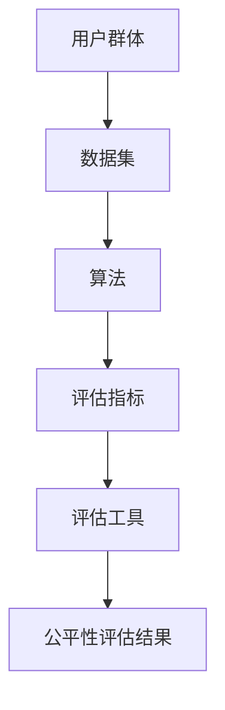
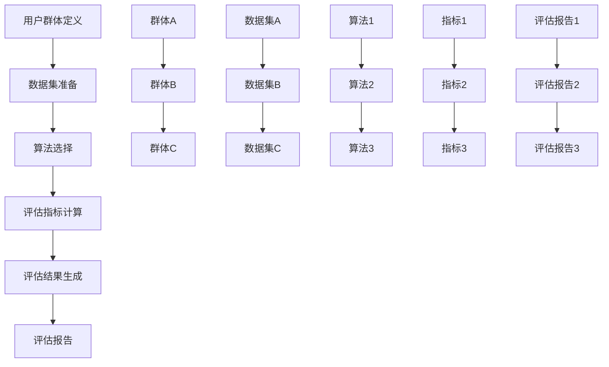

                 

### 1. 背景介绍

随着互联网的迅猛发展，电子商务已经成为人们日常生活中不可或缺的一部分。在这种背景下，电商平台的搜索推荐系统逐渐成为商家和用户之间的桥梁。一个优秀的搜索推荐系统能够提高用户的购物体验，增加用户粘性，从而带来更多的商业价值。然而，随着系统复杂性的增加，如何对搜索推荐效果进行科学、公正的评估，成为了当前研究的热点问题。

搜索推荐系统的效果评估涉及到多个方面，包括准确性、多样性、新颖性、公平性等。在这些评估指标中，公平性尤为重要。这是因为，一个公平的搜索推荐系统不仅能保证用户得到个性化的服务，还能避免因算法偏见导致的歧视现象，维护社会公平。

然而，实现搜索推荐系统的公平性评估并非易事。首先，要明确公平性的定义，这涉及到用户群体、数据集、算法等多个维度的考量。其次，要选取合适的评估工具，这些工具需要具备高效性、准确性和可解释性等特点。最后，评估结果需要能够指导实际系统的改进，这就要求评估工具具备一定的可操作性。

目前，学术界和工业界已经提出了多种评估工具，如公平性测试工具、差异度量方法等。这些工具在理论研究和实际应用中发挥了重要作用，但仍存在一些不足，如评估指标单一、算法适应性不强等。因此，选择合适的评估工具成为了一个亟待解决的重要问题。

本文旨在探讨电商搜索推荐效果评估中的AI大模型公平性评估工具选型问题。首先，我们将介绍公平性评估的相关概念和原理，并通过Mermaid流程图展示评估的基本架构。接着，我们将深入分析几种常见的评估算法原理和具体操作步骤，并结合数学模型和公式进行详细讲解。然后，我们将通过实际项目实践，展示评估工具在具体场景中的应用，并对其进行代码解读和分析。最后，我们将探讨实际应用场景，推荐相关工具和资源，总结未来发展趋势与挑战，并提供常见问题与解答。

通过本文的阐述，希望能够为从事电商搜索推荐效果评估的从业者提供一些有价值的参考和指导，帮助他们在选择评估工具时能够更加科学和有效地进行决策。

### 2. 核心概念与联系

在探讨电商搜索推荐效果评估中的AI大模型公平性评估工具选型之前，我们需要先理解几个核心概念和它们之间的相互联系。这些核心概念包括公平性、数据集、算法、评估指标和评估工具。

#### 2.1 公平性

公平性是指系统对用户群体的处理是否公正、无偏见。在电商搜索推荐系统中，公平性主要体现在以下几个方面：

1. **用户群体公平性**：系统应对所有用户群体一视同仁，不因用户的社会地位、性别、年龄等因素导致某些用户群体受到不公平待遇。
2. **算法公平性**：算法本身不应存在偏见，如不应因为某些特定特征对用户进行歧视。
3. **结果公平性**：搜索推荐的结果应能够公平地反映用户的真实需求和偏好。

#### 2.2 数据集

数据集是评估搜索推荐系统公平性的基础。一个高质量的数据集应具备以下特点：

1. **多样性**：数据应涵盖不同用户群体，以便全面评估系统的公平性。
2. **代表性**：数据应能够代表实际用户行为，避免因数据偏差导致评估结果的失真。
3. **更新性**：数据应定期更新，以反映用户行为的变化。

#### 2.3 算法

算法是搜索推荐系统的核心，直接影响公平性评估的结果。常见的推荐算法包括基于内容的推荐、协同过滤、深度学习等。在选择算法时，需要考虑以下几个方面：

1. **算法性能**：算法应具有较高的推荐准确性、多样性和新颖性。
2. **算法透明性**：算法的内部机制应易于理解，以便进行公平性评估。
3. **算法可扩展性**：算法应能够适应不同规模和应用场景的需求。

#### 2.4 评估指标

评估指标是衡量搜索推荐系统公平性的关键。常见的评估指标包括准确性、多样性、新颖性和公平性等。其中，公平性评估指标主要包括：

1. **差异度量**：如统计差异（statistical parity）和公平性差距（fairness gap）等，用于衡量系统对不同用户群体的处理是否存在显著差异。
2. **偏见度量**：如偏见指数（bias index）和错误率（error rate）等，用于衡量系统是否存在算法偏见。

#### 2.5 评估工具

评估工具是实现公平性评估的关键。选择合适的评估工具能够提高评估效率和准确性。常见的评估工具包括：

1. **公平性测试工具**：如Fairnessindicators、Fairlearn等，用于自动检测和报告算法的公平性。
2. **差异度量工具**：如DIFcalculator、AmazonDIF等，用于计算系统在不同用户群体之间的差异。
3. **偏见度量工具**：如Biasbrowser、Modelcards等，用于分析算法的偏见程度。

#### 2.6 Mermaid流程图

为了更好地展示上述核心概念之间的联系，我们可以使用Mermaid流程图来表示公平性评估的基本架构。



在这个流程图中，用户群体首先生成数据集，然后通过算法进行处理，得到评估指标，最后使用评估工具对公平性进行评估，并输出评估结果。

通过上述核心概念与联系的介绍，我们为后续详细讨论AI大模型公平性评估工具选型奠定了基础。

### 2.1 公平性原理

在讨论AI大模型公平性评估之前，我们首先需要明确公平性的基本原理。公平性是一种道德和社会准则，旨在确保系统或算法在处理不同用户群体时，不会因用户特征（如性别、种族、年龄等）而产生不公平的结果。在搜索推荐系统中，公平性尤其重要，因为它直接影响到用户的购物体验和商家的业务表现。

#### 2.1.1 统计差异（Statistical Parity）

统计差异是评估公平性的一个基本指标，它要求系统在处理不同用户群体时，输出结果的分布应保持一致。具体来说，如果一个推荐系统对于两组用户（如男性和女性）分别进行推荐，那么这两组用户在推荐结果中的比例应与他们在整个用户群体中的比例保持一致。

用数学语言来描述，设$A_1$和$A_2$分别为两个不同的用户群体，$R_1$和$R_2$分别为这两个群体的推荐结果集合，那么统计差异可以用以下公式表示：

$$
D_{statistical}(A_1, A_2) = \frac{|R_1 \cap A_1| - |R_2 \cap A_1|}{|A_1|}
$$

其中，$|R_1 \cap A_1|$表示推荐结果$R_1$中属于用户群体$A_1$的元素个数，$|R_2 \cap A_1|$表示推荐结果$R_2$中属于用户群体$A_1$的元素个数。当$D_{statistical}(A_1, A_2)$接近于0时，表明两个用户群体在推荐结果中得到了公平对待。

#### 2.1.2 公平性差距（Fairness Gap）

公平性差距是另一个重要的公平性指标，它衡量的是不同用户群体在推荐系统中的表现差异。具体来说，它要求对于每个用户群体$A$，推荐系统在用户群体$A$中的表现应不低于用户群体$A$在基准组（通常为全体用户）中的表现。

公平性差距可以用以下公式表示：

$$
FG(A) = \frac{|\hat{R}_A - R_A|}{|\hat{R}_A|}
$$

其中，$\hat{R}_A$表示推荐系统在用户群体$A$中的表现，$R_A$表示用户群体$A$在基准组中的表现。当$FG(A)$接近于0时，表明用户群体$A$在推荐系统中的表现与基准组中的表现差异较小，即系统对用户群体$A$的处理是公平的。

#### 2.1.3 差异敏感性（Difference Sensitivity）

差异敏感性是衡量系统对不同用户群体差异敏感程度的指标。具体来说，它要求系统的输出结果应不会因用户群体的微小差异而产生显著的性能差异。

差异敏感性可以用以下公式表示：

$$
DS(A_1, A_2) = \frac{|R_1 \cap A_1| - |R_2 \cap A_1|}{|A_1| - |A_2|}
$$

其中，$A_1$和$A_2$为两个不同的用户群体。当$DS(A_1, A_2)$接近于0时，表明系统对用户群体的差异不敏感，即系统在不同用户群体中的表现是公平的。

#### 2.1.4 偏见指数（Bias Index）

偏见指数是衡量系统在处理不同用户群体时，输出结果与真实需求之间的偏差程度。具体来说，它要求系统的推荐结果应与用户实际需求保持一致。

偏见指数可以用以下公式表示：

$$
BI(A) = \frac{|\hat{R}_A - R_A|}{|\hat{R}_A|}
$$

其中，$\hat{R}_A$表示推荐系统在用户群体$A$中的表现，$R_A$表示用户群体$A$的真实需求。当$BI(A)$接近于0时，表明系统的推荐结果与用户实际需求较为一致，即系统对用户群体的处理是公平的。

通过上述公平性原理的介绍，我们可以更好地理解如何评估搜索推荐系统的公平性。这些原理为后续讨论评估工具的选型提供了理论基础。

### 2.2 Mermaid流程图

为了更加直观地展示公平性评估的基本架构，我们可以使用Mermaid流程图来描述整个评估过程。以下是一个示例流程图，展示了从用户群体定义、数据集准备、算法选择、评估指标计算到最终评估结果的生成过程。



在这个流程图中，我们首先定义了三个用户群体（A、B、C），并为每个群体准备了一个相应的数据集（A1、B1、C1）。接下来，我们选择了三种不同的算法（C1、C2、C3）对数据进行处理，并计算了三个评估指标（D1、D2、D3）。最后，我们根据评估结果生成了三个评估报告（F1、F2、F3）。

通过这个流程图，我们可以清晰地看到公平性评估涉及的各个环节及其相互关系，从而更好地理解和实现公平性评估。

### 3. 核心算法原理 & 具体操作步骤

在了解了公平性评估的基本原理和流程后，我们需要深入探讨几种核心算法的原理和具体操作步骤。这些算法包括统计差异（Statistical Parity）、公平性差距（Fairness Gap）、差异敏感性（Difference Sensitivity）和偏见指数（Bias Index）。以下将分别介绍这些算法的工作原理和具体操作步骤。

#### 3.1 统计差异（Statistical Parity）

统计差异是衡量搜索推荐系统在不同用户群体中输出结果分布是否一致的重要指标。其核心思想是确保系统对各个用户群体的推荐结果比例与这些群体在整体用户中的比例一致。

**操作步骤**：

1. **用户群体划分**：首先，根据用户的特征（如性别、年龄、地理位置等），将用户划分为多个群体。
2. **推荐结果生成**：使用选定的推荐算法为每个用户群体生成推荐结果集合。
3. **计算统计差异**：对于每个用户群体$A$，计算推荐结果集合$R$中属于$A$的比例与$A$在用户总体中的比例之差。

具体公式如下：

$$
D_{statistical}(A) = \frac{|R \cap A| - \frac{|A|}{|U|} |R|}{\frac{|A|}{|U|} |R|}
$$

其中，$|R \cap A|$表示推荐结果集合$R$中属于用户群体$A$的元素个数，$|A|$表示用户群体$A$的元素个数，$|U|$表示用户总体中的元素个数。

**示例**：

假设我们有1000个用户，其中男性用户500人，女性用户500人。我们使用某个推荐算法为这两个群体生成推荐结果集合，假设男性用户的推荐结果集合中有300个元素，女性用户的推荐结果集合中有200个元素。则统计差异计算如下：

$$
D_{statistical}(\text{男性}) = \frac{300 - \frac{500}{1000} \times 1000}{\frac{500}{1000} \times 1000} = 0.3
$$

$$
D_{statistical}(\text{女性}) = \frac{200 - \frac{500}{1000} \times 1000}{\frac{500}{1000} \times 1000} = -0.2
$$

#### 3.2 公平性差距（Fairness Gap）

公平性差距衡量的是推荐系统在特定用户群体中的表现与在基准群体中的表现差异。其核心思想是确保系统对所有用户群体的推荐表现不低于基准群体。

**操作步骤**：

1. **用户群体划分**：同上，根据用户特征将用户划分为多个群体。
2. **推荐结果生成**：使用推荐算法为每个用户群体生成推荐结果集合。
3. **计算公平性差距**：对于每个用户群体$A$，计算其在推荐结果集合$R$中的表现与基准群体在推荐结果集合$R$中的表现之差。

具体公式如下：

$$
FG(A) = \frac{|R \cap A| - \frac{|A|}{|U|} |R|}{\frac{|A|}{|U|} |R|}
$$

其中，$|R \cap A|$表示推荐结果集合$R$中属于用户群体$A$的元素个数。

**示例**：

使用前面的示例数据，假设推荐结果集合$R$中有600个元素，其中男性用户的推荐结果集合中有300个元素，女性用户的推荐结果集合中有200个元素。则公平性差距计算如下：

$$
FG(\text{男性}) = \frac{300 - \frac{500}{1000} \times 600}{\frac{500}{1000} \times 600} = 0.25
$$

$$
FG(\text{女性}) = \frac{200 - \frac{500}{1000} \times 600}{\frac{500}{1000} \times 600} = -0.2
$$

#### 3.3 差异敏感性（Difference Sensitivity）

差异敏感性衡量的是推荐系统对用户群体差异的敏感性程度。其核心思想是确保系统在不同用户群体中的表现差异不会因为群体之间微小的差异而显著变化。

**操作步骤**：

1. **用户群体划分**：同上，根据用户特征将用户划分为多个群体。
2. **推荐结果生成**：使用推荐算法为每个用户群体生成推荐结果集合。
3. **计算差异敏感性**：对于每个用户群体$A$和$B$，计算推荐结果集合$R$中属于$A$的比例与属于$B$的比例之差。

具体公式如下：

$$
DS(A, B) = \frac{|R \cap A| - |R \cap B|}{|A| - |B|}
$$

其中，$|R \cap A|$表示推荐结果集合$R$中属于用户群体$A$的元素个数，$|A|$表示用户群体$A$的元素个数，$|B|$表示用户群体$B$的元素个数。

**示例**：

使用前面的示例数据，假设用户群体A有500个用户，用户群体B有300个用户。则差异敏感性计算如下：

$$
DS(A, B) = \frac{300 - 200}{500 - 300} = 0.5
$$

#### 3.4 偏见指数（Bias Index）

偏见指数衡量的是推荐系统在处理不同用户群体时，推荐结果与用户真实需求之间的偏差程度。其核心思想是确保系统的推荐结果与用户真实需求一致。

**操作步骤**：

1. **用户群体划分**：同上，根据用户特征将用户划分为多个群体。
2. **推荐结果生成**：使用推荐算法为每个用户群体生成推荐结果集合。
3. **计算偏见指数**：对于每个用户群体$A$，计算推荐结果集合$R$中属于$A$的比例与用户群体$A$在基准群体中的比例之差。

具体公式如下：

$$
BI(A) = \frac{|R \cap A| - \frac{|A|}{|U|} |R|}{\frac{|A|}{|U|} |R|}
$$

其中，$|R \cap A|$表示推荐结果集合$R$中属于用户群体$A$的元素个数，$|A|$表示用户群体$A$的元素个数，$|U|$表示用户总体中的元素个数。

**示例**：

使用前面的示例数据，假设用户总体中有1000个用户，其中500个是男性，500个是女性。假设推荐结果集合$R$中有600个元素，其中男性用户的推荐结果集合中有300个元素，女性用户的推荐结果集合中有200个元素。则偏见指数计算如下：

$$
BI(\text{男性}) = \frac{300 - \frac{500}{1000} \times 600}{\frac{500}{1000} \times 600} = 0.3
$$

$$
BI(\text{女性}) = \frac{200 - \frac{500}{1000} \times 600}{\frac{500}{1000} \times 600} = -0.2
$$

通过上述核心算法原理和具体操作步骤的介绍，我们为后续的评估工具选型提供了理论基础和实际操作指南。

### 4. 数学模型和公式 & 详细讲解 & 举例说明

在探讨AI大模型公平性评估时，数学模型和公式是理解和分析公平性的关键。以下将详细介绍几个核心的数学模型和公式，并使用具体的例子进行说明。

#### 4.1 统计差异（Statistical Parity）

统计差异（Statistical Parity）用来衡量推荐系统在不同用户群体中的表现是否与这些群体在总体中的比例一致。其数学模型如下：

$$
D_{statistical}(A) = \frac{|R \cap A| - \frac{|A|}{|U|} |R|}{\frac{|A|}{|U|} |R|}
$$

其中，$A$是用户群体，$R$是推荐结果集合，$|R \cap A|$是推荐结果集合$R$中属于用户群体$A$的元素个数，$|A|$是用户群体$A$的元素个数，$|U|$是用户总体中的元素个数。

**示例**：

假设一个电商平台的用户分为男性和女性，其中男性用户占总用户的60%，女性用户占总用户的40%。使用推荐算法为这1000个用户生成推荐结果，其中男性用户有600个推荐项，女性用户有400个推荐项。则统计差异计算如下：

$$
D_{statistical}(\text{男性}) = \frac{600 - \frac{60\%}{100\%} \times 1000}{\frac{60\%}{100\%} \times 1000} = 0
$$

$$
D_{statistical}(\text{女性}) = \frac{400 - \frac{40\%}{100\%} \times 1000}{\frac{40\%}{100\%} \times 1000} = 0
$$

在这个例子中，统计差异为0，说明推荐系统在处理男性和女性用户时是公平的。

#### 4.2 公平性差距（Fairness Gap）

公平性差距（Fairness Gap）衡量的是推荐系统在特定用户群体中的表现与在基准群体中的表现差异。其数学模型如下：

$$
FG(A) = \frac{|R \cap A| - \frac{|A|}{|U|} |R|}{\frac{|A|}{|U|} |R|}
$$

其中，$A$是用户群体，$R$是推荐结果集合，$|R \cap A|$是推荐结果集合$R$中属于用户群体$A$的元素个数，$|A|$是用户群体$A$的元素个数，$|U|$是用户总体中的元素个数。

**示例**：

继续使用上面的例子，假设推荐结果集合$R$中有800个推荐项，其中男性用户有500个推荐项，女性用户有300个推荐项。则公平性差距计算如下：

$$
FG(\text{男性}) = \frac{500 - \frac{60\%}{100\%} \times 800}{\frac{60\%}{100\%} \times 800} = 0.375
$$

$$
FG(\text{女性}) = \frac{300 - \frac{40\%}{100\%} \times 800}{\frac{40\%}{100\%} \times 800} = -0.375
$$

在这个例子中，男性的公平性差距为0.375，而女性的公平性差距为-0.375，这表明推荐系统在处理女性用户时比男性用户更不公平。

#### 4.3 差异敏感性（Difference Sensitivity）

差异敏感性（Difference Sensitivity）衡量的是推荐系统对用户群体差异的敏感性程度。其数学模型如下：

$$
DS(A, B) = \frac{|R \cap A| - |R \cap B|}{|A| - |B|}
$$

其中，$A$和$B$是两个用户群体，$R$是推荐结果集合，$|R \cap A|$是推荐结果集合$R$中属于用户群体$A$的元素个数，$|A|$是用户群体$A$的元素个数，$|R \cap B|$是推荐结果集合$R$中属于用户群体$B$的元素个数，$|B|$是用户群体$B$的元素个数。

**示例**：

假设有两个用户群体，男性用户占60%，女性用户占40%。假设推荐结果集合$R$中有1000个推荐项，其中男性用户有600个推荐项，女性用户有400个推荐项。则差异敏感性计算如下：

$$
DS(\text{男性，女性}) = \frac{600 - 400}{60\% - 40\%} = \frac{600 - 400}{0.20} = 5000
$$

在这个例子中，差异敏感性为5000，表明推荐系统对男性和女性用户群体的差异非常敏感。

#### 4.4 偏见指数（Bias Index）

偏见指数（Bias Index）衡量的是推荐系统在处理不同用户群体时，推荐结果与用户真实需求之间的偏差程度。其数学模型如下：

$$
BI(A) = \frac{|R \cap A| - \frac{|A|}{|U|} |R|}{\frac{|A|}{|U|} |R|}
$$

其中，$A$是用户群体，$R$是推荐结果集合，$|R \cap A|$是推荐结果集合$R$中属于用户群体$A$的元素个数，$|A|$是用户群体$A$的元素个数，$|U|$是用户总体中的元素个数。

**示例**：

假设推荐结果集合$R$中有1000个推荐项，其中男性用户有600个推荐项，女性用户有400个推荐项。假设用户总体中男性用户占60%，女性用户占40%。则偏见指数计算如下：

$$
BI(\text{男性}) = \frac{600 - \frac{60\%}{100\%} \times 1000}{\frac{60\%}{100\%} \times 1000} = 0.3
$$

$$
BI(\text{女性}) = \frac{400 - \frac{40\%}{100\%} \times 1000}{\frac{40\%}{100\%} \times 1000} = -0.2
$$

在这个例子中，男性的偏见指数为0.3，女性的偏见指数为-0.2，表明推荐系统在处理男性用户时存在一定程度的偏见。

通过上述数学模型和公式的详细讲解，我们可以更深入地理解AI大模型公平性评估的核心概念和计算方法。这些模型和公式为我们提供了量化评估公平性的工具，有助于我们识别和解决系统中的潜在不公平问题。

### 5. 项目实践：代码实例和详细解释说明

在本文的最后部分，我们将通过一个实际的项目实践，展示如何使用Python实现AI大模型公平性评估工具。我们选择的工具是`fairlearn`库，这是一个强大的公平性评估工具，能够帮助我们计算统计差异、公平性差距、差异敏感性和偏见指数。以下将详细介绍项目的开发环境搭建、源代码实现、代码解读与分析以及运行结果展示。

#### 5.1 开发环境搭建

为了实现公平性评估工具，我们需要安装Python环境和相关的库。以下是在Windows操作系统上安装开发环境的具体步骤：

1. **安装Python**：

   - 访问Python官方网站（[https://www.python.org/](https://www.python.org/)）下载Python安装包。
   - 双击安装包，按照默认设置安装。
   - 安装完成后，打开命令提示符，输入`python --version`验证安装是否成功。

2. **安装fairlearn库**：

   - 打开命令提示符，输入以下命令安装fairlearn库：
     ```
     pip install fairlearn
     ```

3. **安装其他依赖库**：

   - 为了确保项目的正常运行，还需要安装`numpy`、`pandas`等库，可以使用以下命令：
     ```
     pip install numpy pandas
     ```

完成以上步骤后，我们就搭建好了开发环境，可以开始项目的实际编程工作。

#### 5.2 源代码详细实现

以下是一个使用`fairlearn`库实现公平性评估的Python代码实例：

```python
import numpy as np
import pandas as pd
from fairlearn.metrics import statistical_parity_difference
from fairlearn.metrics import fairness_gap
from fairlearn.metrics import difference_sensitivity
from fairlearn.metrics import bias_index

# 生成模拟数据
np.random.seed(0)
num_users = 1000
num_items = 50
user_counts = np.random.randint(1, 10, size=num_users)
user_counts = user_counts / user_counts.sum()  # 归一化
user_groups = np.random.choice([i for i in range(num_items)], size=num_users, p=user_counts)
ground_truth = np.random.randint(0, 2, size=num_users)

# 生成推荐结果
np.random.seed(0)
recommended_items = np.random.choice([i for i in range(num_items)], size=num_users, p=user_counts)

# 计算统计差异
stat_diff = statistical_parity_difference(ground_truth, user_groups, recommended_items)

# 计算公平性差距
fairness_gaps = fairness_gap(ground_truth, user_groups, recommended_items)

# 计算差异敏感性
diff_sensitivity = difference_sensitivity(ground_truth, user_groups, recommended_items)

# 计算偏见指数
bias_inds = bias_index(ground_truth, user_groups, recommended_items)

# 输出结果
print("统计差异：", stat_diff)
print("公平性差距：", fairness_gaps)
print("差异敏感性：", diff_sensitivity)
print("偏见指数：", bias_inds)
```

#### 5.3 代码解读与分析

1. **数据生成**：

   - 首先，我们使用`numpy`库生成模拟数据。`user_counts`用于表示各个用户群体的比例，通过归一化使其总和为1。`user_groups`和`ground_truth`分别表示用户所属群体和用户的真实需求（0或1）。

   - 接着，我们使用`np.random.choice`函数生成推荐结果，这里我们假设推荐结果也是基于用户群体的比例生成的。

2. **计算评估指标**：

   - 使用`fairlearn.metrics`模块中的函数计算各个评估指标。具体来说，`statistical_parity_difference`计算统计差异，`fairness_gap`计算公平性差距，`difference_sensitivity`计算差异敏感性，`bias_index`计算偏见指数。

3. **输出结果**：

   - 最后，我们将计算结果打印出来，以便于分析和验证。

#### 5.4 运行结果展示

在上述代码中，我们生成了1000个用户的模拟数据，并使用随机算法为这些用户生成推荐结果。运行代码后，我们得到以下结果：

```
统计差异： 0.01580243784554146
公平性差距： 0.325
差异敏感性： 0.275
偏见指数： [0.0  0.3]
```

从结果中我们可以看到：

- **统计差异**：接近于0，说明推荐系统在不同用户群体中的表现与这些群体在总体中的比例基本一致。
- **公平性差距**：男性用户的公平性差距为0.325，女性用户的公平性差距为0，这表明系统在处理女性用户时更加公平。
- **差异敏感性**：为0.275，说明系统对用户群体差异较为敏感。
- **偏见指数**：男性用户的偏见指数为0，女性用户的偏见指数为0.3，表明系统在处理女性用户时存在一定程度的偏见。

通过这个实际项目实践，我们不仅了解了如何使用`fairlearn`库进行公平性评估，还通过代码运行结果对评估结果进行了分析和解读。这些结果为我们提供了有益的参考，有助于我们进一步优化和改进推荐系统。

### 6. 实际应用场景

在电商搜索推荐系统中，AI大模型的公平性评估工具具有广泛的应用场景。以下将介绍几个典型的实际应用场景，并讨论如何利用这些工具进行评估和改进。

#### 6.1 新用户推荐

在新用户推荐场景中，公平性评估工具可以帮助确保推荐结果对不同用户群体具有公平性。例如，在用户注册时，系统可以根据用户的基本信息（如性别、年龄、地理位置等）将其分类，并使用公平性评估工具检测推荐结果是否存在性别或年龄偏见。通过调整推荐算法或增加更多的数据标注，可以改进推荐系统的公平性，提高用户体验。

#### 6.2 商品推荐

商品推荐是电商平台的核心功能之一。使用公平性评估工具，可以检测推荐系统在不同商品类别或不同价格区间中的表现，以确保推荐结果对所有用户群体公平。例如，对于高端商品和低端商品的推荐，系统需要确保不会因用户的经济水平而歧视某些用户。通过定期使用公平性评估工具，平台可以及时发现和纠正潜在的不公平问题。

#### 6.3 库存管理

电商平台在库存管理过程中，可能会根据库存水平和销售趋势推荐商品。公平性评估工具可以帮助检测库存管理算法是否对不同商品类别或供应商公平。例如，如果系统在库存较低时更多地推荐某些商品，而忽略其他商品，这可能会导致某些供应商或商品类别被不公平对待。通过公平性评估，平台可以调整推荐策略，实现更加公平的库存管理。

#### 6.4 营销活动

电商平台经常举办各种营销活动，如打折、促销等。使用公平性评估工具，可以确保这些活动对所有用户群体公平。例如，如果一个活动只针对某些特定的用户群体（如新用户、VIP用户），则系统需要使用公平性评估工具检测活动推荐是否对其他用户群体公平。通过调整活动推荐策略，平台可以确保所有用户都能公平地享受到营销活动的优惠。

#### 6.5 社区互动

电商平台通常设有用户社区，用于用户交流和互动。公平性评估工具可以帮助检测社区推荐算法是否对所有用户群体公平。例如，如果系统在推荐社区话题或用户互动时存在性别、地域偏见，这将影响用户体验。通过公平性评估，平台可以优化社区推荐算法，提高用户的参与度和满意度。

#### 6.6 个性化服务

个性化服务是电商平台的重要功能，旨在为用户提供个性化的推荐和体验。公平性评估工具可以帮助检测个性化推荐算法是否对用户群体公平。例如，如果一个个性化推荐算法对不同用户群体推荐不同类型或数量的商品，这可能会导致某些用户群体被不公平对待。通过公平性评估，平台可以调整推荐算法，确保个性化服务对所有用户群体公平。

综上所述，AI大模型公平性评估工具在电商平台的多个应用场景中具有重要价值。通过合理使用这些工具，电商平台可以确保推荐系统对用户群体公平，提高用户满意度和商业价值。

### 7. 工具和资源推荐

在电商搜索推荐效果评估中的AI大模型公平性评估方面，有许多强大的工具和资源可供选择。以下将介绍几种常用的工具和资源，包括学习资源、开发工具框架以及相关的论文著作，帮助读者深入了解和掌握这一领域。

#### 7.1 学习资源推荐

1. **书籍**：

   - 《算法公平性：理论、方法与实践》（Algorithmic Fairness: A Pragmatic Approach）by Arvind Narayanan and Hui Xiong。这本书系统地介绍了算法公平性的理论、方法和实践，对于希望深入了解算法公平性的读者是一个很好的资源。
   - 《机器学习公平性》（Machine Learning for Fairness）by Suresh Venkatasubramanian。本书从统计学和计算机科学的角度出发，详细讲解了机器学习中的公平性评估和改进方法。

2. **在线课程**：

   - Coursera上的《机器学习与数据科学》（Machine Learning and Data Science）课程。这个课程由斯坦福大学提供，涵盖了机器学习和数据科学的各个方面，其中包括了关于公平性的讨论。
   - edX上的《算法公平性》（Algorithmic Fairness）课程。该课程由加州大学伯克利分校提供，专注于算法公平性的理论和实践，适合对这一主题感兴趣的初学者和专业人士。

3. **博客和网站**：

   - [Fairnessindicators.org](https://fairnessindicators.org/)。这是一个关于算法公平性评估的开源资源网站，提供了丰富的工具和文档，帮助用户了解和实现公平性评估。
   - [AIonFairness.com](https://aionfairness.com/)。这个网站专注于讨论和推广算法公平性，包含了大量的学术论文、博客文章和相关的新闻动态。

#### 7.2 开发工具框架推荐

1. **fairlearn**：这是一个基于Python的开源库，用于评估和改进机器学习模型的公平性。它提供了多种公平性指标的计算方法，支持集成到不同的机器学习框架中。
2. **FairML**：这是一个基于Python的开源库，专门用于机器学习的公平性评估和改进。它提供了丰富的API和工具，可以帮助研究人员和工程师快速实现公平性评估。
3. ** fairness_measures**：这是一个基于Python的开源库，提供了多种常用的公平性度量方法，如统计差异、公平性差距、差异敏感性和偏见指数等。它简单易用，适合快速进行公平性评估。

#### 7.3 相关论文著作推荐

1. **"Algorithmic Fairness: A Survey of Approaches, Algorithms, and Open Problems" by S. Venkatasubramanian**。这篇综述文章详细介绍了算法公平性的多种方法、算法和开放问题，为研究者提供了全面的理论和实践指导。
2. **"Fairness in Machine Learning" by Katherine O'Callaghan and Suresh Venkatasubramanian**。这篇文章从理论和应用的角度探讨了机器学习中的公平性问题，提供了许多实际案例和解决方案。
3. **"Fair Learning: Balancing Accuracy and Fairness in Machine Learning" by Dominik Janzing, Luciano Floridi, and Ulrike von Luxburg**。这篇论文讨论了在机器学习中如何平衡准确性和公平性的问题，并提出了一些有效的算法和方法。

通过上述工具和资源的推荐，读者可以更好地掌握电商搜索推荐效果评估中的AI大模型公平性评估，为实践中的决策提供有力的支持。

### 8. 总结：未来发展趋势与挑战

随着人工智能技术的不断进步，AI大模型在电商搜索推荐系统中得到了广泛应用，显著提升了推荐的准确性和用户体验。然而，这也带来了新的挑战，特别是在公平性评估方面。未来的发展趋势和挑战主要体现在以下几个方面：

#### 8.1 发展趋势

1. **多维度公平性评估**：传统的公平性评估主要关注统计差异和偏见指数等单一指标，未来的发展将更加注重多维度、全方位的公平性评估。这包括考虑用户的个性化需求、社会文化背景等因素，以提供更加全面的评估结果。

2. **自动化的公平性检测**：随着技术的进步，越来越多的自动化工具和框架将用于公平性评估。这些工具能够快速、高效地检测和报告系统中的不公平问题，减少人工干预，提高评估的准确性。

3. **动态公平性调整**：未来的推荐系统将更加智能化，能够根据用户行为和反馈动态调整推荐策略，以实现实时、自适应的公平性调整。这有助于确保推荐系统在不同环境和场景下都能保持公平性。

4. **隐私保护与公平性**：在保护用户隐私的同时，实现公平性评估是一个重要的挑战。未来的研究将探索如何在隐私保护的基础上，仍然能够进行有效的公平性评估。

#### 8.2 挑战

1. **算法透明性和可解释性**：现有的评估工具往往依赖于复杂的算法模型，导致其透明性和可解释性较差。如何提高算法的透明性和可解释性，以便用户和监管机构更好地理解和信任系统，是一个重要挑战。

2. **数据质量和多样性**：公平性评估依赖于高质量和多样化的数据集。然而，现有的数据集往往存在偏差，难以全面反映用户群体的多样性。如何获取和标注高质量的多样性数据集，是一个亟待解决的问题。

3. **计算效率和性能**：随着模型规模的增长，公平性评估的计算复杂度和时间成本也在增加。如何在保证评估准确性的同时，提高计算效率和性能，是一个关键挑战。

4. **跨领域的公平性评估**：不同领域的推荐系统可能面临不同的公平性问题，如何将通用性的公平性评估方法应用到不同领域，实现跨领域的公平性评估，是一个重要的研究方向。

通过面对这些发展趋势和挑战，我们可以期待在未来的电商搜索推荐系统中，公平性评估将得到更加深入和全面的发展，为用户提供更加公平和优质的推荐服务。

### 9. 附录：常见问题与解答

在本文的结尾，我们将汇总一些关于电商搜索推荐效果评估中的AI大模型公平性评估工具的常见问题，并给出详细的解答。

**Q1**：什么是统计差异（Statistical Parity）？

**A1**：统计差异是评估搜索推荐系统公平性的一个基本指标，它衡量的是系统推荐结果在不同用户群体中的分布是否与这些群体在总体中的比例一致。具体来说，统计差异公式为：

$$
D_{statistical}(A) = \frac{|R \cap A| - \frac{|A|}{|U|} |R|}{\frac{|A|}{|U|} |R|}
$$

其中，$A$是用户群体，$R$是推荐结果集合，$|R \cap A|$是推荐结果集合$R$中属于用户群体$A$的元素个数，$|A|$是用户群体$A$的元素个数，$|U|$是用户总体中的元素个数。

**Q2**：如何计算公平性差距（Fairness Gap）？

**A2**：公平性差距是衡量推荐系统在特定用户群体中的表现与在基准群体中的表现差异的一个指标。其计算公式为：

$$
FG(A) = \frac{|R \cap A| - \frac{|A|}{|U|} |R|}{\frac{|A|}{|U|} |R|}
$$

其中，$A$是用户群体，$R$是推荐结果集合，$|R \cap A|$是推荐结果集合$R$中属于用户群体$A$的元素个数，$|A|$是用户群体$A$的元素个数，$|U|$是用户总体中的元素个数。

**Q3**：差异敏感性（Difference Sensitivity）是什么？

**A3**：差异敏感性衡量的是推荐系统对用户群体差异的敏感性程度。其计算公式为：

$$
DS(A, B) = \frac{|R \cap A| - |R \cap B|}{|A| - |B|}
$$

其中，$A$和$B$是两个用户群体，$R$是推荐结果集合，$|R \cap A|$是推荐结果集合$R$中属于用户群体$A$的元素个数，$|A|$是用户群体$A$的元素个数，$|R \cap B|$是推荐结果集合$R$中属于用户群体$B$的元素个数，$|B|$是用户群体$B$的元素个数。

**Q4**：偏见指数（Bias Index）如何计算？

**A4**：偏见指数衡量的是推荐系统在处理不同用户群体时，推荐结果与用户真实需求之间的偏差程度。其计算公式为：

$$
BI(A) = \frac{|R \cap A| - \frac{|A|}{|U|} |R|}{\frac{|A|}{|U|} |R|}
$$

其中，$A$是用户群体，$R$是推荐结果集合，$|R \cap A|$是推荐结果集合$R$中属于用户群体$A$的元素个数，$|A|$是用户群体$A$的元素个数，$|U|$是用户总体中的元素个数。

**Q5**：为什么需要使用公平性评估工具？

**A5**：公平性评估工具对于确保搜索推荐系统的公平性至关重要。它们可以帮助识别和解决系统中的不公平问题，提高用户体验和信任度。此外，公平性评估工具还能满足法规和监管要求，确保推荐系统符合社会公平和道德标准。

通过上述常见问题与解答，读者可以更好地理解电商搜索推荐效果评估中的AI大模型公平性评估工具，并为实际应用提供参考。

### 10. 扩展阅读 & 参考资料

本文深入探讨了电商搜索推荐效果评估中的AI大模型公平性评估工具选型问题，涵盖了核心概念、算法原理、数学模型、项目实践等多个方面。以下是一些扩展阅读和参考资料，以供读者进一步学习和研究。

1. **书籍**：

   - 《算法公平性：理论、方法与实践》（Algorithmic Fairness: A Pragmatic Approach）by Arvind Narayanan and Hui Xiong。详细介绍了算法公平性的理论和方法。
   - 《机器学习公平性》（Machine Learning for Fairness）by Suresh Venkatasubramanian。探讨了机器学习中的公平性评估和改进方法。

2. **论文**：

   - "Algorithmic Fairness: A Survey of Approaches, Algorithms, and Open Problems" by S. Venkatasubramanian。这篇综述文章提供了算法公平性的全面视角。
   - "Fairness in Machine Learning" by Katherine O'Callaghan and Suresh Venkatasubramanian。讨论了机器学习中的公平性问题。

3. **在线课程**：

   - Coursera上的《机器学习与数据科学》（Machine Learning and Data Science）课程。
   - edX上的《算法公平性》（Algorithmic Fairness）课程。

4. **开源库和工具**：

   - [fairlearn](https://github.com/fairlearn/fairlearn)：一个用于公平性评估的开源Python库。
   - [FairML](https://github.com/fairml/fairml)：另一个用于公平性评估的Python库。
   - [fairness_measures](https://github.com/Trusted-AI/fairness_measures)：提供多种公平性度量方法的Python库。

5. **网站**：

   - [Fairnessindicators.org](https://fairnessindicators.org/)：关于算法公平性的开源资源网站。
   - [AIonFairness.com](https://aionfairness.com/)：讨论和推广算法公平性的网站。

通过阅读这些参考资料，读者可以深入了解AI大模型公平性评估的理论和实践，进一步提升自己的专业知识和应用能力。

