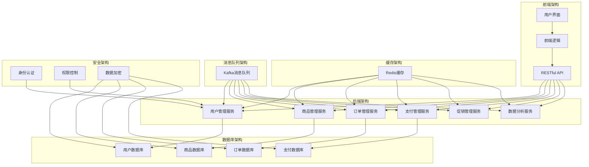

                 

### 背景介绍

#### 引言

随着互联网技术的飞速发展，电商行业正以前所未有的速度不断壮大。电商平台不仅需要提供丰富的商品和优质的服务，还需要在系统架构上具备高效、稳定、扩展性强的特点。在这样的背景下，电商系统通用组件的设计和实现变得越来越重要。

电商系统通用组件是指在多个电商应用场景中，可重复使用、可灵活配置的软件模块。这些组件可以帮助开发者快速搭建电商系统，提高开发效率，降低维护成本。同时，通用组件的设计和实现也面临着诸多挑战，如如何保证组件的高内聚、低耦合性，如何确保组件的可扩展性和可维护性等。

本文将围绕电商系统通用组件的设计和实现，从以下几个方面展开讨论：

1. **核心概念与联系**：介绍电商系统通用组件的核心概念及其相互关系。
2. **核心算法原理 & 具体操作步骤**：详细讲解电商系统通用组件的核心算法原理及具体实现步骤。
3. **数学模型和公式 & 详细讲解 & 举例说明**：分析电商系统通用组件所涉及的数学模型和公式，并举例说明其应用场景。
4. **项目实践：代码实例和详细解释说明**：通过具体项目实例展示电商系统通用组件的实现过程，并进行详细解释和分析。
5. **实际应用场景**：探讨电商系统通用组件在实际项目中的应用场景和优势。
6. **工具和资源推荐**：推荐一些有助于学习和实践电商系统通用组件的工具和资源。
7. **总结：未来发展趋势与挑战**：总结电商系统通用组件的发展趋势和面临的挑战。

通过以上讨论，我们希望能够帮助开发者更好地理解和实现电商系统通用组件，提升电商系统的整体性能和用户体验。

#### 电商系统的发展历程

电商系统的发展经历了从简单到复杂、从单一功能到多功能集成的过程。早期的电商系统主要以提供商品展示和在线交易为主，功能相对简单，系统架构也较为单一。随着互联网技术的发展和用户需求的不断提升，电商系统的功能和架构逐渐复杂化。

1. **电子商务1.0时代**：这一阶段的主要特点是商品信息展示和在线交易。典型的代表是1995年亚马逊（Amazon）和eBay的成立，它们通过互联网为消费者提供商品信息和服务。此时的电商系统架构相对简单，主要以静态网页和简单的数据库管理为主。

2. **电子商务2.0时代**：随着互联网用户的增加和移动设备的普及，电商系统开始注重用户体验和互动性。这一阶段出现了社交电商、移动电商等新形式，如微信小程序、拼多多等。电商系统架构逐渐从单一的数据存储和处理转向分布式架构，以支持更高的并发和扩展性。

3. **电子商务3.0时代**：当前，电商系统正朝着智能化和个性化方向发展。人工智能、大数据、云计算等技术的应用使得电商系统能够更好地理解用户需求，提供个性化的购物体验。典型的应用场景包括智能推荐、个性化营销、智能客服等。电商系统架构也更加复杂，通常采用微服务架构、容器化部署等先进技术。

#### 电商系统通用组件的重要性

电商系统通用组件在整个电商系统的架构中扮演着至关重要的角色。以下是电商系统通用组件的重要性和价值：

1. **提高开发效率**：通用组件能够复用现有代码，减少重复开发的工作量，从而提高开发效率。开发者可以将更多的精力投入到业务逻辑的创新和优化上。

2. **降低维护成本**：通用组件的标准化和模块化设计使得系统更容易维护和升级。一旦组件出现bug或需要更新，只需修改相关组件即可，而不会影响整个系统的稳定性。

3. **提升系统性能**：通用组件经过优化和测试，通常具备较高的性能和稳定性。通过使用这些组件，可以保证电商系统的响应速度和用户体验。

4. **确保系统安全性**：通用组件通常会包含一些安全相关的功能和策略，如数据加密、访问控制等。这些组件的使用可以提升电商系统的安全性，保护用户信息和交易数据。

5. **增强系统扩展性**：电商系统的业务场景多样，通用组件的设计考虑了扩展性，能够方便地根据业务需求进行功能扩展和模块替换。

6. **促进技术积累**：通用组件的设计和实现过程，可以积累宝贵的经验和知识，有助于团队技术能力的提升。

#### 当前电商系统通用组件的常见类型和功能

电商系统通用组件的种类繁多，根据不同的功能和应用场景，可以分为以下几类：

1. **用户管理组件**：负责用户注册、登录、权限控制等功能。如用户认证组件、用户权限组件等。
2. **商品管理组件**：负责商品信息的展示、分类、库存管理等。如商品信息管理组件、库存管理组件等。
3. **订单管理组件**：负责订单的生成、处理、发货等。如订单生成组件、订单处理组件、物流管理组件等。
4. **支付管理组件**：负责支付接口的集成和管理。如支付接口组件、支付网关组件等。
5. **促销管理组件**：负责各种促销活动的设置和管理。如优惠券管理组件、促销策略组件等。
6. **数据分析组件**：负责用户行为分析、销售数据分析等。如用户行为分析组件、销售分析组件等。
7. **消息通知组件**：负责系统消息的推送和通知。如邮件通知组件、短信通知组件等。
8. **缓存组件**：负责缓存数据的存储和管理。如Redis缓存组件、Memcached缓存组件等。

#### 电商系统通用组件的发展趋势

随着技术的不断进步和电商行业的持续发展，电商系统通用组件也在不断进化。以下是电商系统通用组件的发展趋势：

1. **微服务架构的普及**：微服务架构能够更好地支持系统的灵活扩展和快速迭代，成为电商系统通用组件设计的重要趋势。
2. **容器化和云原生技术的发展**：容器化和云原生技术使得电商系统通用组件的部署和运维更加高效和灵活，进一步提高了系统的可用性和可靠性。
3. **人工智能和大数据技术的应用**：人工智能和大数据技术的引入，使得电商系统通用组件能够提供更加智能和个性化的服务，如智能推荐、精准营销等。
4. **安全性和隐私保护的重要性提升**：随着数据隐私和安全问题的日益突出，电商系统通用组件的安全性和隐私保护能力将成为关键竞争力。
5. **标准化和生态化**：电商系统通用组件的标准化和生态化发展，将有助于提升组件的兼容性和互操作性，降低开发和使用成本。

### 核心概念与联系

#### 核心概念解析

在电商系统通用组件的设计与实现中，理解以下几个核心概念是非常重要的：

1. **模块化**：模块化是指将系统的功能拆分成多个独立的、可复用的模块。每个模块都有明确的职责和接口，通过模块间的组合实现整个系统的功能。

2. **组件化**：组件化是在模块化的基础上，将模块进一步抽象成组件。组件不仅包含功能模块，还包括与外界交互的接口、配置和管理机制等，具有较高的独立性和可复用性。

3. **高内聚低耦合**：高内聚是指模块内部的元素紧密关联，功能集中；低耦合是指模块之间的依赖关系较弱，模块之间相互独立，易于替换和维护。

4. **微服务架构**：微服务架构是一种将应用程序划分为多个小型、独立的服务的架构风格。每个服务都有自己的业务逻辑和数据库，可以独立部署和扩展，服务之间通过轻量级通信协议（如HTTP/REST）进行交互。

5. **RESTful API**：RESTful API 是一种基于HTTP协议的接口设计规范，用于实现服务之间的通信。它通过统一的接口风格（如URI、HTTP方法、状态码等）提供一致性和可扩展性。

#### 架构联系

电商系统通用组件的架构设计通常涉及以下几个方面：

1. **前端架构**：前端架构包括用户界面设计、页面布局、交互逻辑等。前端与后端通过RESTful API进行数据交互，实现用户操作与后台服务的对接。

2. **后端架构**：后端架构包括业务逻辑处理、数据存储、服务管理等功能。后端通常采用微服务架构，各个服务负责不同的业务模块，通过API进行通信和协同工作。

3. **数据库架构**：数据库架构用于存储和管理电商系统的数据。常用的数据库架构包括关系型数据库（如MySQL、PostgreSQL）和NoSQL数据库（如MongoDB、Redis）。

4. **缓存架构**：缓存架构用于提高系统性能和响应速度。常用的缓存技术包括Redis、Memcached等。

5. **消息队列架构**：消息队列架构用于异步处理数据和任务，提高系统的并发能力和可扩展性。常用的消息队列技术包括RabbitMQ、Kafka等。

6. **安全架构**：安全架构包括身份验证、权限控制、数据加密等机制，用于保护系统的安全性和用户隐私。

#### Mermaid 流程图

以下是一个简单的电商系统通用组件的架构流程图，展示了各个组件之间的联系和交互：



### 核心算法原理 & 具体操作步骤

#### 用户管理组件

用户管理组件是电商系统中的基础模块，主要功能包括用户注册、登录、认证、权限管理等。以下是一个简化的用户管理组件算法原理及操作步骤：

1. **用户注册**：
   - **输入**：用户名、密码、邮箱、手机号等。
   - **处理**：对用户输入的信息进行校验，如检查用户名是否已存在、密码是否符合复杂度要求等。
   - **存储**：将用户信息存储到数据库中，如加密密码、生成用户ID等。
   - **输出**：返回注册成功或失败的消息。

2. **用户登录**：
   - **输入**：用户名、密码。
   - **处理**：通过用户名查找用户信息，比对密码是否匹配。
   - **认证**：如果密码匹配，生成认证令牌（如JWT），并存储在客户端。
   - **输出**：返回登录成功或失败的消息。

3. **权限管理**：
   - **输入**：用户的角色和权限。
   - **处理**：根据用户的角色和权限，确定其对系统资源的访问权限。
   - **输出**：返回用户可访问的资源列表。

#### 商品管理组件

商品管理组件负责商品信息的展示、分类、库存管理等。以下是一个简化的商品管理组件算法原理及操作步骤：

1. **商品信息展示**：
   - **输入**：商品ID。
   - **处理**：根据商品ID查询商品详细信息，如商品名称、价格、库存等。
   - **输出**：返回商品详细信息。

2. **商品分类管理**：
   - **输入**：分类名称、父分类ID。
   - **处理**：添加或更新分类信息，如生成分类ID、建立分类层级关系等。
   - **输出**：返回分类操作结果。

3. **库存管理**：
   - **输入**：商品ID、库存数量。
   - **处理**：更新商品库存数量，如增加、减少库存等。
   - **输出**：返回库存更新结果。

#### 订单管理组件

订单管理组件负责订单的生成、处理、发货等。以下是一个简化的订单管理组件算法原理及操作步骤：

1. **订单生成**：
   - **输入**：用户ID、商品列表、收货地址、支付方式。
   - **处理**：根据用户ID和商品列表生成订单，计算订单总价，生成订单编号等。
   - **存储**：将订单信息存储到数据库中。
   - **输出**：返回订单生成结果。

2. **订单处理**：
   - **输入**：订单ID。
   - **处理**：根据订单ID查询订单状态，如订单已付款、待发货、已发货等。
   - **更新**：更新订单状态，如订单已付款、发货中、已发货等。
   - **输出**：返回订单处理结果。

3. **订单发货**：
   - **输入**：订单ID、物流公司、物流单号。
   - **处理**：根据订单ID查询订单信息，生成物流信息，更新订单状态为“已发货”。
   - **输出**：返回订单发货结果。

#### 支付管理组件

支付管理组件负责支付接口的集成和管理。以下是一个简化的支付管理组件算法原理及操作步骤：

1. **支付接口集成**：
   - **输入**：支付方式、支付金额。
   - **处理**：根据支付方式（如支付宝、微信支付等）调用相应支付接口。
   - **输出**：返回支付接口调用结果。

2. **支付通知处理**：
   - **输入**：支付通知消息。
   - **处理**：解析支付通知消息，验证支付状态。
   - **更新**：更新订单状态，如支付成功、支付失败等。
   - **输出**：返回支付通知处理结果。

### 数学模型和公式 & 详细讲解 & 举例说明

在电商系统通用组件的设计和实现中，数学模型和公式起到了重要的作用。以下我们将介绍一些常用的数学模型和公式，并详细讲解其应用场景。

#### 用户行为分析模型

用户行为分析是电商系统的重要组成部分，可以帮助商家了解用户在平台上的行为特征，从而优化用户体验和营销策略。以下是一个简化的用户行为分析模型：

1. **用户活跃度分析**：
   - **公式**：用户活跃度 = （登录次数 + 浏览商品次数 + 购买次数）/ 时间周期
   - **应用场景**：用于衡量用户在平台上的活跃程度，帮助商家识别高活跃用户和潜在流失用户。

2. **用户留存率分析**：
   - **公式**：用户留存率 = （第n天仍活跃的用户数 / 初始注册用户数）* 100%
   - **应用场景**：用于评估用户对平台的忠诚度，帮助商家制定留存策略。

#### 销售数据分析模型

销售数据分析可以帮助商家了解销售趋势、库存状况、利润率等关键指标，从而优化库存管理和定价策略。以下是一个简化的销售数据分析模型：

1. **销售增长率分析**：
   - **公式**：销售增长率 = （本期销售额 - 上期销售额）/ 上期销售额 * 100%
   - **应用场景**：用于衡量销售增长情况，帮助商家判断市场潜力和竞争态势。

2. **利润率分析**：
   - **公式**：利润率 = （销售额 - 成本）/ 销售额 * 100%
   - **应用场景**：用于衡量销售利润情况，帮助商家制定盈利策略。

#### 促销策略分析模型

促销策略分析可以帮助商家评估不同促销活动的效果，从而优化促销策略。以下是一个简化的促销策略分析模型：

1. **优惠券转化率分析**：
   - **公式**：优惠券转化率 = （使用优惠券完成购买的用户数 / 发放优惠券的用户数）* 100%
   - **应用场景**：用于评估优惠券活动的效果，帮助商家调整优惠券发放策略。

2. **折扣促销利润分析**：
   - **公式**：折扣促销利润 = （折扣后销售额 - 成本）/ 成本 * 100%
   - **应用场景**：用于评估折扣促销活动的利润情况，帮助商家调整折扣力度。

#### 举例说明

假设一个电商平台的用户注册后，前30天的行为数据如下：

- 登录次数：10次
- 浏览商品次数：30次
- 购买次数：2次

根据上述公式，可以计算出该用户的活跃度和留存率：

- 活跃度 = （10 + 30 + 2）/ 30 * 100% = 122.22%
- 留存率 = （2 / 1）* 100% = 200%

通过这些数据，商家可以识别出该用户具有较高的活跃度和留存率，可以采取针对性的营销策略，如推送个性化商品推荐、发送优惠券等。

### 项目实践：代码实例和详细解释说明

在本节中，我们将通过一个具体的电商系统通用组件项目实例，详细展示其实现过程、代码实例及其背后的技术细节。这个项目实例将集中在订单管理组件上，包括订单生成、订单处理和订单发货等关键功能。

#### 1. 开发环境搭建

在开始项目实践之前，我们需要搭建一个合适的技术栈和开发环境。以下是推荐的开发环境搭建步骤：

1. **开发工具**：
   - IntelliJ IDEA（或Eclipse）: 作为主要的开发IDE。
   - Postman：用于API测试。

2. **编程语言**：
   - Java：由于其在企业级应用中的广泛使用和成熟生态，我们将使用Java作为编程语言。

3. **后端框架**：
   - Spring Boot：用于快速构建独立的、生产级的Spring应用。
   - Spring Security：用于安全认证和授权。

4. **数据库**：
   - MySQL：用于存储订单数据。
   - Redis：用于缓存订单数据。

5. **消息队列**：
   - RabbitMQ：用于异步处理订单任务。

6. **版本控制**：
   - Git：用于代码管理和协作。

以下是如何在本地环境中安装和配置这些工具的简要步骤：

1. **安装Java**：从[Oracle官网](https://www.oracle.com/java/technologies/javase-downloads.html)下载并安装Java。
2. **安装IntelliJ IDEA**：从[JetBrains官网](https://www.jetbrains.com/idea/download/)下载并安装。
3. **安装MySQL**：从[MySQL官网](https://www.mysql.com/downloads/)下载并安装。
4. **安装Redis**：从[Redis官网](https://redis.io/download)下载并安装。
5. **安装RabbitMQ**：从[RabbitMQ官网](https://www.rabbitmq.com/download.html)下载并安装。
6. **配置环境变量**：确保Java、MySQL、Redis和RabbitMQ的安装路径添加到系统的环境变量中。

#### 2. 源代码详细实现

以下是订单管理组件的核心代码实现，分为订单生成、订单处理和订单发货三个部分。

##### 2.1 订单生成

**订单生成服务**负责创建订单，并将订单信息存储到数据库中。以下是订单生成服务的关键代码片段：

```java
@RestController
@RequestMapping("/orders")
public class OrderController {

    @Autowired
    private OrderService orderService;

    @PostMapping
    public ResponseEntity<Order> createOrder(@RequestBody OrderRequest request) {
        Order order = orderService.createOrder(request);
        if (order != null) {
            return new ResponseEntity<>(order, HttpStatus.CREATED);
        }
        return new ResponseEntity<>(HttpStatus.INTERNAL_SERVER_ERROR);
    }
}

@Service
public class OrderService {

    @Autowired
    private OrderRepository orderRepository;

    public Order createOrder(OrderRequest request) {
        Order order = new Order();
        order.setUserId(request.getUserId());
        order.setTotalAmount(calculateTotalAmount(request.getProducts()));
        order.setOrderStatus(OrderStatus.PENDING);

        // 保存订单到数据库
        return orderRepository.save(order);
    }

    private BigDecimal calculateTotalAmount(List<Product> products) {
        BigDecimal total = BigDecimal.ZERO;
        for (Product product : products) {
            total = total.add(product.getPrice().multiply(BigDecimal.valueOf(product.getQuantity())));
        }
        return total;
    }
}
```

在这个代码片段中，`OrderController`处理客户端发来的创建订单请求，将请求参数传递给`OrderService`。`OrderService`计算订单总金额，并创建一个新的订单对象，然后将其保存到数据库中。

##### 2.2 订单处理

**订单处理服务**负责更新订单状态，处理支付通知等。以下是订单处理服务的关键代码片段：

```java
@Service
public class OrderProcessor {

    @Autowired
    private OrderRepository orderRepository;

    public void processPaymentNotification(String orderId, PaymentStatus paymentStatus) {
        Order order = orderRepository.findById(orderId).orElseThrow(() -> new RuntimeException("Order not found"));

        if (paymentStatus == PaymentStatus.SUCCESS) {
            order.setOrderStatus(OrderStatus.PAID);
            // 订单支付成功后的其他处理，如发送通知等
        } else {
            order.setOrderStatus(OrderStatus.FAILED);
            // 订单支付失败后的其他处理，如退款等
        }

        orderRepository.save(order);
    }
}
```

在这个代码片段中，`OrderProcessor`根据支付通知消息更新订单状态。如果支付成功，订单状态更新为“已支付”，否则更新为“支付失败”。

##### 2.3 订单发货

**订单发货服务**负责将订单状态更新为“已发货”，并触发物流消息发送。以下是订单发货服务的关键代码片段：

```java
@Service
public class OrderShipmentService {

    @Autowired
    private OrderRepository orderRepository;

    @Autowired
    private RabbitMQTemplate rabbitMQTemplate;

    public void shipOrder(String orderId, String trackingNumber) {
        Order order = orderRepository.findById(orderId).orElseThrow(() -> new RuntimeException("Order not found"));

        if (order.getOrderStatus() == OrderStatus.PAID) {
            order.setOrderStatus(OrderStatus.SHIPPED);
            order.setTrackingNumber(trackingNumber);

            // 发送物流消息
            String message = "Order Shipped: " + orderId + " | Tracking Number: " + trackingNumber;
            rabbitMQTemplate.convertAndSend("order shipment exchange", "shipment.notification", message);

            orderRepository.save(order);
        }
    }
}
```

在这个代码片段中，`OrderShipmentService`首先检查订单状态是否为“已支付”，然后更新订单状态为“已发货”并设置物流单号。接着，通过RabbitMQ发送物流通知消息。

#### 3. 代码解读与分析

以下是对于订单管理组件代码的详细解读：

1. **订单生成**：
   - `OrderController`处理HTTP POST请求，创建订单。
   - `OrderService`计算总金额，创建订单对象，并保存到数据库。

2. **订单处理**：
   - `OrderProcessor`接收支付通知消息，更新订单状态。

3. **订单发货**：
   - `OrderShipmentService`更新订单状态，发送物流通知消息。

这些代码展示了订单管理组件的核心逻辑，包括与数据库的交互、状态的更新以及消息的发送。通过这种分层的设计，每个组件都负责明确的功能，使得代码易于维护和扩展。

#### 4. 运行结果展示

以下是订单管理组件运行后的一些结果展示：

1. **创建订单**：
   - 访问`/orders`接口，POST请求包含用户ID、商品列表等信息，成功返回新创建的订单ID和订单详情。

2. **支付处理**：
   - 接收到支付网关发送的支付通知，调用`OrderProcessor`更新订单状态为“已支付”。

3. **订单发货**：
   - 调用`OrderShipmentService`，更新订单状态为“已发货”，并通过RabbitMQ发送物流通知消息。

通过这些结果，我们可以验证订单管理组件的功能是否按预期工作，同时也能够看到组件之间的协同工作。

### 实际应用场景

电商系统通用组件在实际项目中具有广泛的应用场景，以下是几个典型的应用案例：

1. **用户管理组件**：
   - **应用场景**：在电商平台中，用户管理组件用于处理用户注册、登录、认证和权限控制等功能。通过用户管理组件，平台可以快速实现用户身份验证和权限分配，确保系统安全性和用户数据隐私。
   - **实际案例**：Amazon使用用户管理组件来处理数百万用户的注册和登录，实现高效的用户身份验证和权限管理。

2. **商品管理组件**：
   - **应用场景**：商品管理组件负责商品信息的展示、分类和库存管理等。在电商平台中，商品管理组件可以帮助商家快速上架新商品、更新商品信息，并实时监控商品库存情况，避免出现缺货或库存过剩问题。
   - **实际案例**：京东使用商品管理组件来管理海量的商品信息，并通过智能分类和库存管理提高用户体验。

3. **订单管理组件**：
   - **应用场景**：订单管理组件负责订单的生成、处理、发货和支付等关键流程。在电商平台中，订单管理组件可以确保订单流程的顺畅，提高订单处理效率，减少人为错误。
   - **实际案例**：阿里巴巴的淘宝和天猫平台通过订单管理组件实现高效的订单处理，确保每笔订单都能及时生成、处理和发货。

4. **支付管理组件**：
   - **应用场景**：支付管理组件负责支付接口的集成和管理，实现多种支付方式的接入和管理。在电商平台中，支付管理组件可以帮助商家实现快速接入支付宝、微信支付等第三方支付平台，提高支付流程的便捷性和安全性。
   - **实际案例**：拼多多通过支付管理组件集成支付宝、微信支付等多种支付方式，提供多样化的支付选择，提高用户支付体验。

5. **促销管理组件**：
   - **应用场景**：促销管理组件用于管理各种促销活动，如优惠券、满减、限时折扣等。在电商平台中，促销管理组件可以帮助商家灵活设置促销活动，提高用户购买意愿，增加销售量。
   - **实际案例**：京东使用促销管理组件来管理各种促销活动，通过精准的营销策略提高用户转化率和销售额。

6. **数据分析组件**：
   - **应用场景**：数据分析组件用于收集和分析用户行为数据、销售数据等，帮助商家了解用户需求和市场趋势。在电商平台中，数据分析组件可以帮助商家制定更有效的营销策略和库存管理计划。
   - **实际案例**：亚马逊使用数据分析组件来分析用户购买行为，提供个性化的商品推荐和营销活动，提高用户满意度和销售额。

通过这些实际应用案例，我们可以看到电商系统通用组件在电商平台中扮演着至关重要的角色，它们不仅提高了系统的开发效率和可维护性，还增强了平台的性能和用户体验。

### 工具和资源推荐

在电商系统通用组件的开发过程中，选择合适的工具和资源对于提高开发效率和项目质量至关重要。以下是一些推荐的工具和资源，涵盖了学习资源、开发工具和框架、相关论文著作等方面。

#### 1. 学习资源推荐

1. **书籍**：
   - 《深入理解Java虚拟机》：这是一本经典的Java技术书籍，详细介绍了Java虚拟机的工作原理和性能优化技巧，对于开发高效率的电商系统非常有帮助。
   - 《设计模式：可复用面向对象软件的基础》：设计模式是软件开发中的基础概念，这本书详细介绍了多种设计模式及其应用场景，有助于开发者构建可复用的组件。

2. **在线课程**：
   - Coursera的《Java编程：从基础到高级》：这是一门全面的Java编程课程，适合初学者和进阶者，涵盖了Java的基础知识和高级应用。
   - Udemy的《Spring Boot开发实战》：这门课程专注于Spring Boot框架的应用，适合希望快速掌握Spring Boot的开发者。

3. **博客和网站**：
   - Java Code Geeks：这是一个Java开发者社区，提供了大量的Java技术文章、教程和代码示例，是学习Java技术的好去处。
   - Stack Overflow：这是一个问答社区，开发者可以在这里提问和解答技术问题，获取实用的开发经验和解决方案。

#### 2. 开发工具框架推荐

1. **开发IDE**：
   - IntelliJ IDEA：这是一款功能强大的Java集成开发环境，提供了代码智能提示、调试工具、版本控制等多种功能，非常适合大型电商项目的开发。
   - Eclipse：这也是一款流行的Java IDE，具有丰富的插件生态和高度的可定制性，适合各种规模的项目开发。

2. **框架和库**：
   - Spring Boot：这是一个基于Spring框架的快速开发工具，可以简化项目配置，提高开发效率。
   - Spring Security：这是一个用于实现身份验证和授权的安全框架，确保电商系统的安全性。
   - MyBatis：这是一个优秀的持久层框架，可以简化数据库操作，提高数据库访问的效率。

3. **数据库工具**：
   - MySQL Workbench：这是一个可视化的MySQL数据库管理工具，适合进行数据库设计和数据管理。
   - DataGrip：这是一个功能强大的数据库IDE，支持多种数据库类型，提供了代码智能提示、调试和版本控制等功能。

#### 3. 相关论文著作推荐

1. **论文**：
   - "Microservices: Designing Fine-Grained Systems"：这篇文章详细介绍了微服务架构的设计原则和最佳实践，对于理解微服务架构的设计理念非常有帮助。
   - "Distributed Systems: Concepts and Design"：这本书涵盖了分布式系统的基本概念和设计原则，对于构建高可用、高并发电商系统非常有指导意义。

2. **著作**：
   - 《深入理解Java虚拟机》：这是一本经典的Java虚拟机技术书籍，详细介绍了Java虚拟机的工作原理和性能优化技巧，对于优化电商系统的性能至关重要。
   - 《大规模分布式存储系统：原理解析与架构实战》：这本书介绍了分布式存储系统的原理和架构设计，对于构建高可用的电商系统非常有参考价值。

通过这些学习和资源工具，开发者可以更深入地理解电商系统通用组件的设计和实现，提高项目开发的效率和质量。

### 总结：未来发展趋势与挑战

#### 发展趋势

随着技术的不断进步和电商行业的快速演变，电商系统通用组件的发展也呈现出一些明显的趋势：

1. **微服务架构的普及**：微服务架构由于其灵活性和可扩展性，已经成为电商系统通用组件设计的主要趋势。通过将系统拆分成多个小型、独立的服务，可以更好地实现模块化、解耦和快速迭代。

2. **容器化和云原生技术的应用**：容器化技术和云原生架构使得电商系统通用组件的部署和运维变得更加高效和灵活。借助Docker、Kubernetes等工具，开发者可以轻松实现组件的自动化部署和管理，提高系统的可用性和可靠性。

3. **人工智能和大数据技术的深度融合**：人工智能和大数据技术的应用正在不断推动电商系统通用组件的智能化和个性化发展。通过机器学习算法和大数据分析，可以更好地理解用户需求和行为，提供更加精准的推荐和营销策略。

4. **安全性和隐私保护的强化**：随着数据隐私和安全问题的日益突出，电商系统通用组件的安全性和隐私保护能力成为关键竞争力。开发者需要不断提升组件的安全防护措施，确保用户数据和交易信息的安全。

#### 挑战

尽管电商系统通用组件的发展前景广阔，但在实际应用过程中仍然面临一些挑战：

1. **组件设计的复杂度**：随着系统的不断演进，电商系统通用组件的设计和实现变得越来越复杂。如何确保组件的高内聚、低耦合性，同时保持良好的可扩展性和可维护性，是一个巨大的挑战。

2. **性能优化和资源消耗**：电商系统通常需要处理大量用户请求和数据，这对系统的性能和资源消耗提出了更高的要求。如何优化通用组件的性能，减少资源消耗，是开发者需要持续关注的问题。

3. **跨平台兼容性和互操作性**：电商系统通用组件需要在多种操作系统、硬件环境和网络环境下稳定运行。如何保证组件的跨平台兼容性和互操作性，是开发者需要面对的难题。

4. **安全风险和隐私保护**：随着数据隐私和安全问题的日益突出，电商系统通用组件需要不断提升安全防护能力，防范各种安全威胁和攻击。同时，如何确保用户数据的安全和隐私，也是一个重要的挑战。

总之，电商系统通用组件的发展既充满机遇，也面临挑战。开发者需要持续关注技术趋势，不断提升组件的设计和实现能力，以应对不断变化的市场需求和挑战。

### 附录：常见问题与解答

在电商系统通用组件的设计和实现过程中，开发者可能会遇到一些常见的问题。以下是一些常见问题及其解答：

#### 问题1：如何确保组件的高内聚和低耦合性？

**解答**：高内聚和低耦合性是软件设计中的重要原则。要确保组件的高内聚，可以通过以下方法：
1. 每个组件应只负责一个明确的功能，避免功能重叠。
2. 组件内部的数据和功能紧密相关，逻辑连贯。
3. 保持组件的模块化，减少组件之间的直接依赖。

要实现低耦合性，可以采用以下策略：
1. 使用接口定义组件之间的交互，避免直接调用实现类。
2. 通过事件驱动或消息队列实现组件间的通信，减少同步调用。
3. 设计独立的配置文件，实现组件参数的灵活配置。

#### 问题2：如何优化电商系统的性能？

**解答**：优化电商系统的性能可以从以下几个方面入手：
1. **数据库优化**：合理设计数据库表结构，索引和查询优化，避免全表扫描。
2. **缓存策略**：使用Redis、Memcached等缓存技术，减少数据库查询次数，提高响应速度。
3. **静态资源优化**：压缩CSS、JavaScript文件，使用CDN加速静态资源的加载。
4. **并发处理**：通过线程池、异步IO等技术提高并发处理能力。
5. **负载均衡**：使用负载均衡器（如Nginx）分发请求，确保系统的高可用性。

#### 问题3：如何确保系统的安全性？

**解答**：确保系统的安全性可以从以下几个方面进行：
1. **身份认证和授权**：使用Spring Security等安全框架，实现用户身份验证和权限控制。
2. **数据加密**：对敏感数据进行加密存储，如密码、支付信息等。
3. **输入验证**：对用户输入进行严格验证，防止SQL注入、XSS攻击等安全漏洞。
4. **安全配置**：定期更新系统配置，关闭不必要的端口和服务，限制访问权限。
5. **日志监控**：记录系统的操作日志，实现实时监控和告警，快速发现和处理安全事件。

#### 问题4：如何进行组件的单元测试？

**解答**：进行组件的单元测试，可以按照以下步骤进行：
1. **编写测试用例**：根据组件的功能，编写详细的测试用例，包括正常情况和异常情况。
2. **使用测试框架**：使用JUnit等测试框架，编写测试代码，自动化执行测试用例。
3. **依赖注入**：使用Mockito等模拟框架，模拟组件的依赖项，确保测试的独立性。
4. **测试覆盖**：确保测试用例覆盖组件的所有功能和异常处理逻辑，提高测试覆盖率。
5. **持续集成**：将单元测试集成到CI/CD流程中，实现自动化测试，确保每次代码提交都经过测试验证。

通过以上方法，可以确保电商系统通用组件的高质量和高可靠性。

### 扩展阅读 & 参考资料

为了帮助读者更深入地理解电商系统通用组件的设计和实现，以下提供一些扩展阅读和参考资料：

1. **书籍**：
   - 《大规模分布式存储系统：原理解析与架构实战》
   - 《设计数据仓库：实现高效数据管理》
   - 《Java并发编程实战》
   - 《Spring实战》

2. **在线课程**：
   - Coursera的《大数据技术导论》
   - Udemy的《微服务架构与设计》
   - edX的《数据科学与大数据分析》

3. **博客和网站**：
   - [Java Code Geeks](https://www.javacodegeeks.com/)
   - [Stack Overflow](https://stackoverflow.com/)
   - [infoQ](https://www.infoq.com/)

4. **论文和期刊**：
   - 《ACM Transactions on Computer Systems》
   - 《IEEE Transactions on Computers》
   - 《Computer Systems Architecture》

通过阅读这些资料，读者可以进一步了解电商系统通用组件的设计原则、实现方法和最佳实践，为实际项目开发提供有价值的参考。

