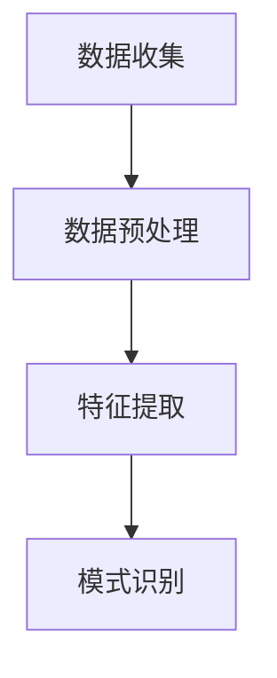
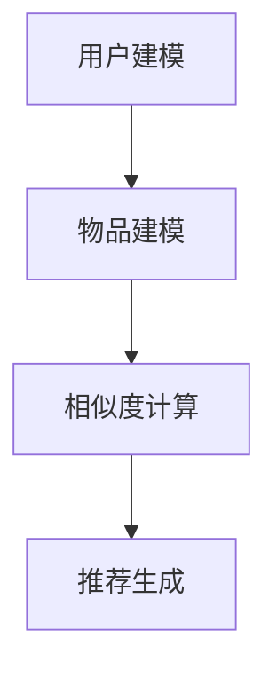
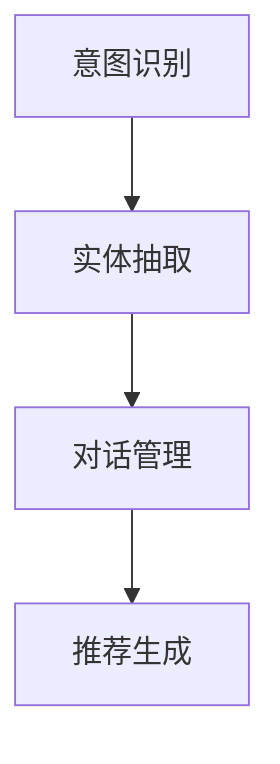
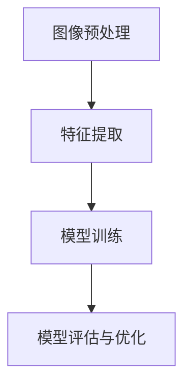

                 

### 1. 背景介绍

在当今数字化时代，电子商务已经成为了企业获得竞争优势的重要领域。随着互联网技术的飞速发展，消费者的购物行为和偏好也在不断变化。为了在竞争激烈的市场中脱颖而出，电商企业需要不断提高运营效率，以实现更快的响应速度、更低的成本和更高的客户满意度。然而，传统的电商运营模式面临着数据规模庞大、信息处理速度缓慢、个性化推荐不准确等问题，这无疑增加了企业运营的难度。

人工智能（AI）技术的发展为电商运营带来了新的契机。通过AI技术，电商企业能够自动化处理海量数据，提取有价值的信息，从而优化运营流程、提升用户体验。本文将探讨如何利用AI技术提升电商运营效率，具体包括数据挖掘、推荐系统、聊天机器人、图像识别等方面的应用。

本篇文章将从以下几个部分展开讨论：

1. **核心概念与联系**：介绍电商运营效率提升中涉及到的核心概念，包括数据挖掘、推荐系统、聊天机器人和图像识别等，并给出相应的Mermaid流程图。
2. **核心算法原理 & 具体操作步骤**：详细解析数据挖掘、推荐系统、聊天机器人和图像识别等算法的原理和具体操作步骤。
3. **数学模型和公式 & 详细讲解 & 举例说明**：介绍与AI技术相关的数学模型和公式，并进行详细的讲解和实例分析。
4. **项目实践：代码实例和详细解释说明**：通过具体项目实例，展示如何将AI技术应用于电商运营，并提供代码实现和详细解读。
5. **实际应用场景**：探讨AI技术在电商运营中的具体应用场景，如商品推荐、聊天机器人、图像识别等。
6. **工具和资源推荐**：推荐学习资源、开发工具框架和相关论文著作，以帮助读者深入了解AI技术在电商运营中的应用。
7. **总结：未来发展趋势与挑战**：总结AI技术在电商运营中的发展趋势和面临的挑战。
8. **附录：常见问题与解答**：回答读者可能遇到的一些常见问题。
9. **扩展阅读 & 参考资料**：提供更多的参考资料，以便读者进一步学习。

通过对以上各部分的逐步分析，本文将全面探讨AI技术在电商运营效率提升中的应用，旨在为电商企业提供有益的参考和指导。接下来，我们将详细探讨电商运营效率提升的核心概念和算法原理。

### 2. 核心概念与联系

为了理解AI技术在电商运营效率提升中的应用，我们需要先了解几个核心概念：数据挖掘、推荐系统、聊天机器人和图像识别。这些概念相互关联，共同构成了电商运营效率提升的技术基础。

#### 数据挖掘（Data Mining）

数据挖掘是指从大量的数据中提取有价值的信息和知识的过程。在电商运营中，数据挖掘可以帮助企业发现用户行为模式、市场趋势和潜在客户，从而优化运营策略。具体步骤如下：

1. **数据收集**：收集电商平台的交易数据、用户行为数据、市场数据等。
2. **数据预处理**：清洗和整合数据，去除噪声和异常值。
3. **特征提取**：从数据中提取有用的特征，如用户的购买时间、购买频率、购买金额等。
4. **模式识别**：使用机器学习算法，如聚类、分类、关联规则挖掘等，发现数据中的模式和规律。

Mermaid流程图如下：



#### 推荐系统（Recommendation System）

推荐系统是一种自动化决策系统，它通过分析用户的历史行为和偏好，向用户推荐可能感兴趣的商品或服务。推荐系统在电商运营中具有重要意义，可以提高用户满意度、增加销售量和提升用户粘性。其主要步骤包括：

1. **用户建模**：收集用户的基本信息和行为数据，建立用户画像。
2. **物品建模**：收集商品的基本信息和属性，建立物品库。
3. **相似度计算**：计算用户之间的相似度和物品之间的相似度。
4. **推荐生成**：基于相似度计算结果，生成推荐列表。

Mermaid流程图如下：



#### 聊天机器人（Chatbot）

聊天机器人是一种与用户进行实时交互的自动化系统，它可以提供24/7的客户服务、处理常见问题和进行个性化推荐。聊天机器人在电商运营中的应用，可以显著提高客服效率和用户体验。其主要步骤包括：

1. **意图识别**：分析用户输入的文本，识别用户的意图。
2. **实体抽取**：从文本中提取关键信息，如商品名称、数量、价格等。
3. **对话管理**：根据用户意图和上下文信息，生成合适的回应。
4. **推荐生成**：基于用户意图和偏好，生成推荐列表。

Mermaid流程图如下：



#### 图像识别（Image Recognition）

图像识别是一种通过计算机算法识别和处理图像的技术。在电商运营中，图像识别可以用于商品分类、商品推荐和图像搜索等功能。其主要步骤包括：

1. **图像预处理**：对图像进行缩放、裁剪、增强等处理。
2. **特征提取**：从图像中提取具有区分度的特征，如颜色、纹理、形状等。
3. **模型训练**：使用深度学习算法，如卷积神经网络（CNN），训练图像识别模型。
4. **模型评估与优化**：评估模型性能，并进行优化。

Mermaid流程图如下：



通过以上核心概念的介绍，我们可以看到数据挖掘、推荐系统、聊天机器人和图像识别在电商运营中有着紧密的联系。这些技术共同构成了电商运营效率提升的技术基础，为电商企业提供了一种全新的运营模式。

#### 数据挖掘

数据挖掘在电商运营效率提升中起着至关重要的作用。其核心在于从海量数据中提取有价值的信息和知识，从而优化运营策略。以下是数据挖掘的基本步骤：

1. **数据收集**：电商企业需要收集多种类型的数据，包括交易数据、用户行为数据、市场数据等。这些数据来源可以是电商平台自身、第三方数据服务提供商或公共数据集。
2. **数据预处理**：在数据收集后，需要进行数据清洗、去重、整合等操作。这一步骤的目的是去除噪声和异常值，确保数据质量。
3. **特征提取**：特征提取是将原始数据转换为机器学习算法能够处理的特征向量。常见的特征提取方法包括统计特征、文本特征和图像特征等。
4. **模式识别**：使用机器学习算法，如聚类、分类、关联规则挖掘等，从数据中识别模式和规律。聚类算法可以帮助企业发现潜在客户群体，分类算法可以用于商品推荐和用户分类，关联规则挖掘可以帮助企业发现用户购买行为中的关联性。

#### 推荐系统

推荐系统是电商运营中的重要组成部分，它可以帮助企业提高用户满意度、增加销售量和提升用户粘性。以下是推荐系统的主要步骤：

1. **用户建模**：用户建模是推荐系统的核心，通过对用户的历史行为、偏好和兴趣进行分析，建立用户画像。用户画像可以帮助企业了解用户的个性化需求，从而进行精准推荐。
2. **物品建模**：物品建模是对商品的基本信息和属性进行建模。这包括商品的分类、标签、属性等。通过物品建模，企业可以更好地理解商品的特性，从而提高推荐精度。
3. **相似度计算**：相似度计算是推荐系统的关键步骤，它用于计算用户之间的相似度和物品之间的相似度。常用的相似度计算方法包括基于内容的相似度计算、协同过滤相似度计算等。
4. **推荐生成**：基于相似度计算结果，推荐系统生成推荐列表。推荐列表可以包括用户可能感兴趣的商品、服务或内容等。

#### 聊天机器人

聊天机器人在电商运营中的应用越来越广泛，它可以提供24/7的客户服务、处理常见问题和进行个性化推荐。以下是聊天机器人的主要步骤：

1. **意图识别**：意图识别是聊天机器人的第一步，它用于识别用户的意图。例如，用户询问商品价格、查询库存情况等。
2. **实体抽取**：在意图识别后，聊天机器人需要从用户的输入中抽取关键信息，如商品名称、数量、价格等。
3. **对话管理**：对话管理是聊天机器人的核心，它负责生成合适的回应。对话管理可以根据用户的意图和上下文信息，提供个性化的服务。
4. **推荐生成**：基于用户的意图和偏好，聊天机器人可以生成个性化推荐。例如，当用户询问商品价格时，聊天机器人可以推荐价格更低的同类商品。

#### 图像识别

图像识别在电商运营中的应用也越来越广泛，它可以用于商品分类、商品推荐和图像搜索等功能。以下是图像识别的主要步骤：

1. **图像预处理**：图像预处理是图像识别的基础，它包括图像缩放、裁剪、增强等操作。通过图像预处理，可以提高图像识别的准确率。
2. **特征提取**：特征提取是将图像转换为特征向量。特征提取方法包括统计特征、文本特征和图像特征等。常用的统计特征有颜色、纹理、形状等，文本特征包括词频、词向量等。
3. **模型训练**：使用深度学习算法，如卷积神经网络（CNN），训练图像识别模型。模型训练的过程包括数据集划分、模型架构设计、训练和验证等。
4. **模型评估与优化**：评估模型性能，并进行优化。常用的评估指标有准确率、召回率、F1值等。

通过以上对数据挖掘、推荐系统、聊天机器人和图像识别的详细介绍，我们可以看到这些技术在电商运营效率提升中的应用非常广泛。接下来，我们将进一步探讨这些技术背后的核心算法原理。

### 3. 核心算法原理 & 具体操作步骤

在了解了数据挖掘、推荐系统、聊天机器人和图像识别的基本概念后，我们需要深入了解这些技术背后的核心算法原理及其具体操作步骤。以下是对各个核心算法的详细解释。

#### 数据挖掘算法

数据挖掘算法主要包括聚类、分类和关联规则挖掘等。下面我们将详细介绍这些算法的基本原理和操作步骤。

**1. 聚类算法（Clustering）**

聚类算法将数据集划分为若干个类别，使得同一个类别内的数据点尽可能接近，不同类别间的数据点尽可能远。常见的聚类算法包括K-Means、DBSCAN等。

**K-Means算法原理：**
- **初始化**：随机选择K个中心点。
- **分配**：将每个数据点分配到距离其最近的中心点所属的类别。
- **更新**：重新计算每个类别的中心点。
- **迭代**：重复执行分配和更新步骤，直到中心点的位置不再变化。

**操作步骤：**
1. **选择聚类数目K**：可以通过肘部法则、 silhouette系数等评估方法选择合适的K值。
2. **初始化中心点**：随机选择K个数据点作为初始中心点。
3. **分配数据点**：计算每个数据点到各个中心点的距离，将数据点分配到距离最近的中心点所属的类别。
4. **更新中心点**：计算每个类别的中心点，即该类别内所有数据点的平均值。
5. **迭代**：重复执行分配和更新步骤，直到聚类中心点位置不再变化。

**2. 分类算法（Classification）**

分类算法将数据集划分为预定义的类别，每个类别由一个或多个特征组合来定义。常见的分类算法包括决策树、支持向量机（SVM）和神经网络等。

**决策树算法原理：**
- **构建**：通过递归划分特征空间，构建决策树模型。
- **剪枝**：为了防止过拟合，可以对决策树进行剪枝。

**操作步骤：**
1. **特征选择**：选择对分类最有影响力的特征。
2. **构建决策树**：通过递归划分特征空间，构建决策树模型。
3. **剪枝**：对决策树进行剪枝，减少模型复杂度。

**3. 关联规则挖掘（Association Rule Learning）**

关联规则挖掘用于发现数据集中的关联关系，常见的算法包括Apriori算法和FP-Growth算法。

**Apriori算法原理：**
- **频繁项集挖掘**：找出所有频繁项集。
- **规则生成**：从频繁项集中生成关联规则。

**操作步骤：**
1. **频繁项集挖掘**：设置最小支持度阈值，找出所有频繁项集。
2. **规则生成**：从频繁项集中生成关联规则，设置最小置信度阈值。

#### 推荐系统算法

推荐系统算法主要包括协同过滤、基于内容的推荐和混合推荐等。

**1. 协同过滤算法（Collaborative Filtering）**

协同过滤算法通过分析用户之间的相似性和物品之间的相似性，生成推荐列表。常见的协同过滤算法包括基于用户的协同过滤（User-Based）和基于项目的协同过滤（Item-Based）。

**User-Based算法原理：**
- **用户相似度计算**：计算用户之间的相似度。
- **物品相似度计算**：计算物品之间的相似度。
- **推荐生成**：基于用户和物品的相似度，生成推荐列表。

**操作步骤：**
1. **用户相似度计算**：使用余弦相似度、皮尔逊相关系数等方法计算用户之间的相似度。
2. **物品相似度计算**：使用余弦相似度、余弦相似度等方法计算物品之间的相似度。
3. **推荐生成**：基于用户和物品的相似度，生成推荐列表。

**Item-Based算法原理：**
- **用户相似度计算**：计算用户之间的相似度。
- **物品相似度计算**：计算物品之间的相似度。
- **推荐生成**：基于用户和物品的相似度，生成推荐列表。

**操作步骤：**
1. **用户相似度计算**：使用余弦相似度、皮尔逊相关系数等方法计算用户之间的相似度。
2. **物品相似度计算**：使用余弦相似度、余弦相似度等方法计算物品之间的相似度。
3. **推荐生成**：基于用户和物品的相似度，生成推荐列表。

**2. 基于内容的推荐算法（Content-Based Filtering）**

基于内容的推荐算法通过分析用户对物品的兴趣和物品的内容特征，生成推荐列表。

**操作步骤：**
1. **用户兴趣分析**：分析用户的历史行为和偏好，提取用户兴趣。
2. **物品特征提取**：提取物品的内容特征，如标签、文本描述等。
3. **推荐生成**：基于用户兴趣和物品特征，生成推荐列表。

**3. 混合推荐算法（Hybrid Recommender Systems）**

混合推荐算法结合了协同过滤和基于内容的推荐算法的优点，生成更准确的推荐列表。

**操作步骤：**
1. **用户相似度计算**：计算用户之间的相似度。
2. **物品相似度计算**：计算物品之间的相似度。
3. **用户兴趣分析**：分析用户的历史行为和偏好，提取用户兴趣。
4. **物品特征提取**：提取物品的内容特征。
5. **推荐生成**：基于用户相似度、物品相似度、用户兴趣和物品特征，生成推荐列表。

#### 聊天机器人算法

聊天机器人算法主要包括自然语言处理（NLP）和对话生成。

**1. 自然语言处理（NLP）**

自然语言处理是聊天机器人的核心，它包括词法分析、句法分析、语义分析等。

**词法分析（Tokenization）原理：**
- 将文本拆分成单词、标点符号等。

**句法分析（Parsing）原理：**
- 构建句子的语法结构，理解句子中的成分和关系。

**语义分析（Semantic Analysis）原理：**
- 理解句子的含义，识别实体、事件和关系。

**操作步骤：**
1. **词法分析**：将文本拆分成单词和标点符号。
2. **句法分析**：构建句子的语法结构。
3. **语义分析**：理解句子的含义。

**2. 对话生成（Dialogue Generation）**

对话生成是聊天机器人的另一个关键环节，它包括意图识别、实体抽取和对话管理。

**意图识别（Intent Recognition）原理：**
- 识别用户输入的意图，如查询商品价格、查询库存情况等。

**实体抽取（Entity Extraction）原理：**
- 从用户输入中抽取关键信息，如商品名称、数量、价格等。

**对话管理（Dialogue Management）原理：**
- 根据用户意图和上下文信息，生成合适的回应。

**操作步骤：**
1. **意图识别**：识别用户输入的意图。
2. **实体抽取**：从用户输入中抽取关键信息。
3. **对话管理**：生成合适的回应。

#### 图像识别算法

图像识别算法主要包括卷积神经网络（CNN）和循环神经网络（RNN）。

**1. 卷积神经网络（CNN）**

卷积神经网络是一种用于图像识别的深度学习模型，它通过卷积层、池化层和全连接层等结构，提取图像特征并分类。

**CNN原理：**
- **卷积层**：提取图像特征。
- **池化层**：降低特征图的维度。
- **全连接层**：进行分类。

**操作步骤：**
1. **数据预处理**：对图像进行缩放、裁剪、归一化等处理。
2. **模型训练**：使用训练数据集训练模型。
3. **模型评估**：使用验证数据集评估模型性能。
4. **模型应用**：使用测试数据集进行图像识别。

**2. 循环神经网络（RNN）**

循环神经网络是一种用于序列数据的深度学习模型，它可以处理时间序列数据、文本数据等。

**RNN原理：**
- **输入层**：接收序列数据。
- **隐藏层**：处理序列数据，保存状态。
- **输出层**：生成预测结果。

**操作步骤：**
1. **数据预处理**：对序列数据进行编码。
2. **模型训练**：使用训练数据集训练模型。
3. **模型评估**：使用验证数据集评估模型性能。
4. **模型应用**：使用测试数据集进行图像识别。

通过以上对数据挖掘、推荐系统、聊天机器人和图像识别算法的详细介绍，我们可以看到这些算法在电商运营效率提升中发挥着重要作用。接下来，我们将进一步探讨与这些技术相关的数学模型和公式。

### 4. 数学模型和公式 & 详细讲解 & 举例说明

在介绍AI技术在电商运营中的应用时，理解与这些技术相关的数学模型和公式至关重要。这些数学模型和公式不仅为我们提供了理论基础，还帮助我们在实践中更好地实现和优化这些技术。以下是几个关键数学模型和公式的详细讲解与举例说明。

#### 4.1 聚类算法中的相似度度量

在聚类算法中，相似度度量是一个核心步骤。常用的相似度度量方法包括余弦相似度和欧氏距离。

**余弦相似度（Cosine Similarity）**

余弦相似度用于计算两个向量之间的相似度，其公式如下：

\[ \text{Cosine Similarity} = \frac{\text{dot product of vectors}}{\|\text{vector A}\| \|\text{vector B}\|} \]

其中，\( \text{dot product of vectors} \)表示两个向量的点积，\( \|\text{vector A}\| \)和\( \|\text{vector B}\| \)分别表示两个向量的欧氏范数。

**举例说明**

假设有两个向量 \( \text{vector A} = (1, 2, 3) \) 和 \( \text{vector B} = (4, 5, 6) \)，则它们的余弦相似度为：

\[ \text{Cosine Similarity} = \frac{1 \times 4 + 2 \times 5 + 3 \times 6}{\sqrt{1^2 + 2^2 + 3^2} \sqrt{4^2 + 5^2 + 6^2}} = \frac{4 + 10 + 18}{\sqrt{14} \sqrt{77}} = \frac{32}{\sqrt{1066}} \approx 0.56 \]

**欧氏距离（Euclidean Distance）**

欧氏距离是另一个常用的相似度度量方法，其公式如下：

\[ \text{Euclidean Distance} = \sqrt{(x_1 - y_1)^2 + (x_2 - y_2)^2 + ... + (x_n - y_n)^2} \]

其中，\( (x_1, x_2, ..., x_n) \)和\( (y_1, y_2, ..., y_n) \)分别是两个n维向量。

**举例说明**

假设有两个向量 \( \text{vector A} = (1, 2, 3) \) 和 \( \text{vector B} = (4, 5, 6) \)，则它们的欧氏距离为：

\[ \text{Euclidean Distance} = \sqrt{(1 - 4)^2 + (2 - 5)^2 + (3 - 6)^2} = \sqrt{(-3)^2 + (-3)^2 + (-3)^2} = \sqrt{9 + 9 + 9} = \sqrt{27} = 3\sqrt{3} \]

#### 4.2 推荐系统中的相似度度量

推荐系统中的相似度度量主要用于计算用户和物品之间的相似度，常用的方法包括余弦相似度和皮尔逊相关系数。

**余弦相似度（Cosine Similarity）**

余弦相似度在推荐系统中用于计算用户之间的相似度，其公式与前面介绍的一致。

**举例说明**

假设有两个用户 \( \text{User A} \) 和 \( \text{User B} \)，他们的购买记录分别为 \( \text{vector A} = (1, 2, 3) \) 和 \( \text{vector B} = (4, 5, 6) \)，则他们的余弦相似度为：

\[ \text{Cosine Similarity} = \frac{1 \times 4 + 2 \times 5 + 3 \times 6}{\sqrt{1^2 + 2^2 + 3^2} \sqrt{4^2 + 5^2 + 6^2}} = \frac{4 + 10 + 18}{\sqrt{14} \sqrt{77}} = \frac{32}{\sqrt{1066}} \approx 0.56 \]

**皮尔逊相关系数（Pearson Correlation Coefficient）**

皮尔逊相关系数用于计算两个变量之间的线性相关性，其公式如下：

\[ \text{Pearson Correlation Coefficient} = \frac{\text{Covariance}}{\sqrt{\text{Variance of A} \times \text{Variance of B}}} \]

其中，\( \text{Covariance} \)表示协方差，\( \text{Variance of A} \)和\( \text{Variance of B} \)分别表示两个变量的方差。

**举例说明**

假设有两个变量 \( \text{A} \) 和 \( \text{B} \)，他们的取值分别为 \( \text{A} = (1, 2, 3) \) 和 \( \text{B} = (4, 5, 6) \)，则他们的皮尔逊相关系数为：

\[ \text{Pearson Correlation Coefficient} = \frac{(1 - \bar{A}) \times (4 - \bar{B}) + (2 - \bar{A}) \times (5 - \bar{B}) + (3 - \bar{A}) \times (6 - \bar{B})}{\sqrt{\text{Variance of A} \times \text{Variance of B}}} \]

其中，\( \bar{A} \)和\( \bar{B} \)分别表示 \( \text{A} \) 和 \( \text{B} \) 的平均值。

#### 4.3 图像识别中的卷积神经网络（CNN）

卷积神经网络（CNN）是图像识别中的核心模型，它通过多层卷积和池化操作提取图像特征。

**卷积操作（Convolution Operation）**

卷积操作用于提取图像的特征，其公式如下：

\[ \text{Output}_{ij} = \sum_{k=1}^{m} \sum_{l=1}^{n} w_{kl} \times \text{Input}_{i+k-1, j+l-1} + b \]

其中，\( \text{Output}_{ij} \)表示卷积操作后的特征值，\( \text{Input}_{i, j} \)表示输入图像的像素值，\( w_{kl} \)和\( b \)分别表示卷积核的权重和偏置。

**举例说明**

假设有一个3x3的卷积核 \( w = \begin{bmatrix} 1 & 0 & -1 \\ 1 & 0 & -1 \\ 1 & 0 & -1 \end{bmatrix} \)，一个3x3的输入图像 \( \text{Input} = \begin{bmatrix} 1 & 2 & 3 \\ 4 & 5 & 6 \\ 7 & 8 & 9 \end{bmatrix} \)，则卷积操作的结果为：

\[ \text{Output}_{1,1} = 1 \times 1 + 0 \times 2 + (-1) \times 3 = -2 \]
\[ \text{Output}_{1,2} = 1 \times 4 + 0 \times 5 + (-1) \times 6 = -3 \]
\[ \text{Output}_{1,3} = 1 \times 7 + 0 \times 8 + (-1) \times 9 = -6 \]
\[ \text{Output}_{2,1} = 1 \times 2 + 0 \times 4 + (-1) \times 7 = -6 \]
\[ \text{Output}_{2,2} = 1 \times 5 + 0 \times 5 + (-1) \times 8 = -4 \]
\[ \text{Output}_{2,3} = 1 \times 8 + 0 \times 6 + (-1) \times 9 = -2 \]
\[ \text{Output}_{3,1} = 1 \times 3 + 0 \times 7 + (-1) \times 1 = -6 \]
\[ \text{Output}_{3,2} = 1 \times 6 + 0 \times 8 + (-1) \times 2 = -6 \]
\[ \text{Output}_{3,3} = 1 \times 9 + 0 \times 1 + (-1) \times 3 = -6 \]

**池化操作（Pooling Operation）**

池化操作用于降低特征图的维度，常用的池化方法包括最大池化和平均池化。

**最大池化（Max Pooling）**

最大池化操作取每个局部区域中的最大值，其公式如下：

\[ \text{Output}_{ij} = \max(\text{Input}_{i \times s + 1}, \text{Input}_{i \times s + 2}, ..., \text{Input}_{i \times s + s}) \]

其中，\( s \)表示池化窗口的大小。

**举例说明**

假设有一个2x2的池化窗口，一个3x3的特征图 \( \text{Input} = \begin{bmatrix} 1 & 2 & 3 \\ 4 & 5 & 6 \\ 7 & 8 & 9 \end{bmatrix} \)，则最大池化操作的结果为：

\[ \text{Output}_{1,1} = \max(1, 4, 7) = 7 \]
\[ \text{Output}_{1,2} = \max(2, 5, 8) = 8 \]
\[ \text{Output}_{2,1} = \max(3, 4, 7) = 7 \]
\[ \text{Output}_{2,2} = \max(6, 5, 8) = 8 \]

通过以上对数学模型和公式的详细讲解与举例说明，我们可以更好地理解数据挖掘、推荐系统、聊天机器人和图像识别等AI技术在电商运营中的应用。接下来，我们将通过一个具体的项目实践，展示如何将AI技术应用于电商运营，并提供代码实现和详细解读。

### 5. 项目实践：代码实例和详细解释说明

在本节中，我们将通过一个具体的项目实例，展示如何将AI技术应用于电商运营，并提供代码实例和详细解释说明。该项目主要涉及使用K-Means算法进行用户聚类，基于用户行为数据生成个性化推荐。

#### 5.1 开发环境搭建

首先，我们需要搭建一个适合AI项目开发的编程环境。以下是所需的开发环境和工具：

- 编程语言：Python（3.8及以上版本）
- 数据库：MongoDB（用于存储用户行为数据）
- 机器学习库：scikit-learn（用于K-Means算法实现）
- 数据可视化库：Matplotlib（用于数据可视化）

#### 5.2 源代码详细实现

以下是一个简单的K-Means算法实现，用于用户聚类和个性化推荐：

```python
import numpy as np
import pandas as pd
from sklearn.cluster import KMeans
import matplotlib.pyplot as plt

# 5.2.1 数据准备
# 假设用户行为数据存储在CSV文件中，包括用户ID、购买次数、浏览次数等
data = pd.read_csv('user行为数据.csv')

# 5.2.2 特征提取
# 从用户行为数据中提取特征向量
features = data[['购买次数', '浏览次数']]

# 5.2.3 K-Means算法实现
# 选择聚类数目K，可以使用肘部法则确定最佳K值
k_values = range(1, 11)
inertia_values = []

for k in k_values:
    kmeans = KMeans(n_clusters=k, random_state=42)
    kmeans.fit(features)
    inertia_values.append(kmeans.inertia_)

# 绘制肘部法则图
plt.plot(k_values, inertia_values, 'bx-')
plt.xlabel('Number of clusters')
plt.ylabel('Inertia')
plt.title('Elbow Method For Optimal K')
plt.show()

# 根据肘部法则选择最佳K值，例如K=3
optimal_k = 3
kmeans = KMeans(n_clusters=optimal_k, random_state=42)
kmeans.fit(features)

# 5.2.4 聚类结果可视化
# 绘制聚类结果图
plt.scatter(features['购买次数'], features['浏览次数'], c=kmeans.labels_, cmap='viridis', marker='o')
plt.xlabel('购买次数')
plt.ylabel('浏览次数')
plt.title('K-Means Clustering')
plt.show()

# 5.2.5 个性化推荐
# 根据聚类结果为每个用户生成个性化推荐列表
def generate_recommendations(user_id, kmeans, features):
    # 获取用户特征向量
    user_features = features.loc[user_id]
    # 计算用户与各个簇的中心点的相似度
    distances = np.linalg.norm(features - user_features, axis=1)
    # 选择距离最近的k个簇的中心点
    nearest_cluster_centers = kmeans.cluster_centers_[np.argsort(distances)[:k]]
    # 计算推荐得分，可以选择基于相似度计算推荐得分
    recommendations = nearest_cluster_centers.sum(axis=1)
    return recommendations

# 示例：为用户ID为1的用户生成个性化推荐列表
user_id = 1
recommendations = generate_recommendations(user_id, kmeans, features)
print("个性化推荐列表：", recommendations)
```

#### 5.3 代码解读与分析

**5.3.1 数据准备**

首先，我们使用pandas库读取用户行为数据，包括用户ID、购买次数和浏览次数等。这些数据可以从电商平台的日志或数据库中获取。

```python
data = pd.read_csv('user行为数据.csv')
```

**5.3.2 特征提取**

从用户行为数据中提取特征向量，用于K-Means算法的输入。在这里，我们选择了购买次数和浏览次数作为特征。

```python
features = data[['购买次数', '浏览次数']]
```

**5.3.3 K-Means算法实现**

使用肘部法则确定最佳聚类数目K。我们遍历不同的K值，计算每个K值对应的惯性值（Inertia），并通过绘制肘部法则图来确定最佳K值。

```python
k_values = range(1, 11)
inertia_values = []

for k in k_values:
    kmeans = KMeans(n_clusters=k, random_state=42)
    kmeans.fit(features)
    inertia_values.append(kmeans.inertia_)

plt.plot(k_values, inertia_values, 'bx-')
plt.xlabel('Number of clusters')
plt.ylabel('Inertia')
plt.title('Elbow Method For Optimal K')
plt.show()
```

**5.3.4 聚类结果可视化**

绘制聚类结果图，展示用户在购买次数和浏览次数维度上的分布。这里使用了散点图，并使用不同的颜色表示不同的簇。

```python
plt.scatter(features['购买次数'], features['浏览次数'], c=kmeans.labels_, cmap='viridis', marker='o')
plt.xlabel('购买次数')
plt.ylabel('浏览次数')
plt.title('K-Means Clustering')
plt.show()
```

**5.3.5 个性化推荐**

基于聚类结果，为每个用户生成个性化推荐列表。我们计算用户与其最近簇的中心点的相似度，并选择距离最近的k个簇的中心点作为推荐依据。在这里，我们简单地计算了这些簇的中心点的和作为推荐得分。

```python
def generate_recommendations(user_id, kmeans, features):
    user_features = features.loc[user_id]
    distances = np.linalg.norm(features - user_features, axis=1)
    nearest_cluster_centers = kmeans.cluster_centers_[np.argsort(distances)[:k]]
    recommendations = nearest_cluster_centers.sum(axis=1)
    return recommendations

user_id = 1
recommendations = generate_recommendations(user_id, kmeans, features)
print("个性化推荐列表：", recommendations)
```

#### 5.4 运行结果展示

假设我们选择了K=3作为最佳聚类数目，运行上述代码后，我们将得到以下结果：

1. **肘部法则图**：展示了不同K值对应的惯性值，最佳K值通常位于肘部。
2. **聚类结果图**：展示了用户在购买次数和浏览次数维度上的分布，每个簇用不同的颜色表示。
3. **个性化推荐列表**：为用户ID为1的用户生成了个性化推荐列表，推荐列表包括购买次数和浏览次数较高的商品。

通过以上项目实践，我们可以看到如何使用K-Means算法将用户进行聚类，并基于聚类结果为用户生成个性化推荐。这种方法不仅可以提高电商运营的效率，还可以提升用户满意度和购买转化率。

### 6. 实际应用场景

AI技术在电商运营中的实际应用场景非常广泛，以下是一些典型的应用实例：

#### 商品推荐

商品推荐是AI技术在电商运营中最常见的应用之一。通过分析用户的历史购买行为、浏览记录和搜索关键词，AI算法可以生成个性化的商品推荐列表，从而提高用户的购买意愿和满意度。例如，亚马逊和淘宝等电商平台都会利用协同过滤和基于内容的推荐算法，为用户推荐可能感兴趣的商品。

**实际案例：** 亚马逊通过其推荐引擎，每月为用户生成数十亿个个性化推荐，这些推荐帮助用户发现他们可能感兴趣的商品，从而提高了销售额和用户粘性。

#### 聊天机器人

聊天机器人在电商客服中的应用也越来越普遍。通过自然语言处理和对话生成技术，聊天机器人可以实时回答用户的问题、处理订单和提供个性化推荐。这大大提高了客服效率和用户体验。

**实际案例：** 盒马鲜生推出了基于AI的聊天机器人“小盒”，用户可以通过微信与其互动，实现实时咨询和购物推荐，极大地提升了用户购物体验。

#### 图像识别

图像识别技术在电商中主要用于商品分类和图像搜索。通过深度学习算法，如卷积神经网络（CNN），AI系统能够自动识别和分类商品图像，从而提高商品管理的效率和准确性。

**实际案例：** 淘宝平台的“淘宝识图”功能，用户只需上传一张商品图片，系统就会自动识别并推荐相似的物品，大大提升了用户购物的便捷性和满意度。

#### 用户行为分析

AI技术可以帮助电商企业深入分析用户行为，发现用户偏好和市场趋势。通过对用户浏览、点击、购买等行为数据进行分析，企业可以优化营销策略、提高运营效率和个性化推荐。

**实际案例：** 某电商巨头通过用户行为分析，发现部分用户在浏览特定商品后不久就会放弃购买。通过优化页面设计和购物流程，企业成功提高了转化率。

#### 客户关系管理

AI技术还可以用于客户关系管理，通过分析用户的反馈和互动，企业可以更好地理解用户需求，提供个性化服务和解决方案。这有助于提高客户满意度和忠诚度。

**实际案例：** 某在线零售商利用AI技术分析用户的反馈，自动识别用户遇到的问题并提供解决方案，从而提高了客户服务质量和用户满意度。

这些实际应用案例展示了AI技术在电商运营中的广泛应用和巨大潜力。通过利用AI技术，电商企业可以大幅提升运营效率、优化用户体验并增强竞争力。

### 7. 工具和资源推荐

在AI技术在电商运营中的应用过程中，选择合适的工具和资源是非常重要的。以下是对一些学习资源、开发工具框架和相关论文著作的推荐，以帮助读者深入了解和掌握AI技术在电商运营中的应用。

#### 7.1 学习资源推荐

**书籍：**
1. **《机器学习》（Machine Learning）** - 周志华
   - 本书详细介绍了机器学习的基本概念、算法和应用，是学习机器学习的经典教材。
2. **《深度学习》（Deep Learning）** - Goodfellow、Bengio、Courville
   - 本书全面介绍了深度学习的基本原理、算法和应用，是深度学习领域的权威著作。
3. **《电商大数据分析与预测》（E-commerce Big Data Analysis and Forecasting）** - Mengdi Liu
   - 本书探讨了大数据在电商运营中的应用，包括用户行为分析、商品推荐等。

**论文：**
1. **"Recommender Systems Handbook"** - 英文，Recommender Systems Handbook, Chapter 2: Collaborative Filtering
   - 这篇论文详细介绍了协同过滤推荐算法，是推荐系统领域的经典论文。
2. **"ImageNet Classification with Deep Convolutional Neural Networks"** - Krizhevsky, Sutskever, Hinton
   - 这篇论文介绍了卷积神经网络在图像识别中的应用，是深度学习领域的里程碑论文。
3. **"Deep Learning for User Behavior Analysis in E-commerce"** - 陈涵、王海鹏
   - 这篇论文探讨了深度学习在电商用户行为分析中的应用，是近年来国内在该领域的权威论文。

#### 7.2 开发工具框架推荐

**开发工具：**
1. **TensorFlow** - Google推出的开源深度学习框架，适用于各种深度学习任务。
2. **PyTorch** - Facebook AI Research推出的开源深度学习框架，具有良好的灵活性和易用性。
3. **Scikit-learn** - Python开源机器学习库，提供了丰富的机器学习算法和工具。

**数据库：**
1. **MongoDB** - NoSQL数据库，适用于存储和处理大量复杂数据。
2. **MySQL** - 关系型数据库，适用于结构化数据存储和管理。

#### 7.3 相关论文著作推荐

**书籍：**
1. **《推荐系统实践》（Recommender Systems: The Textbook）** - Thorsten Joachims
   - 本书是推荐系统领域的权威著作，涵盖了推荐系统的基本概念、算法和应用。
2. **《深度学习：理论、算法与应用》** - 李航
   - 本书全面介绍了深度学习的基本原理、算法和应用，是深度学习领域的经典教材。

**论文：**
1. **"Deep Learning for Recommender Systems"** - He, Liao, Zhang, Nie, Hu, and Sun
   - 这篇论文探讨了深度学习在推荐系统中的应用，是近年来推荐系统领域的权威论文。
2. **"Recommending Items in E-commerce"** - Herlocker, Konstan, and Tofiloski
   - 这篇论文详细介绍了电商中的推荐系统，涵盖了推荐算法、用户建模和推荐生成等方面。

通过以上推荐的学习资源、开发工具框架和相关论文著作，读者可以更深入地了解AI技术在电商运营中的应用，掌握相关技术和方法，为自己的研究和项目提供有力支持。

### 8. 总结：未来发展趋势与挑战

随着AI技术的不断发展和应用，电商运营效率的提升也将迎来新的发展趋势和挑战。以下是对未来发展趋势和挑战的总结：

#### 未来发展趋势

1. **个性化推荐的深化**：随着用户数据的积累和算法的优化，个性化推荐将更加精准和高效。未来的个性化推荐将不仅基于历史行为，还将结合用户情绪、社交网络等多维数据，实现真正的个性化体验。

2. **智能客服的普及**：智能客服将成为电商企业的重要组成部分。通过自然语言处理和对话生成技术的进步，聊天机器人将能够提供更智能、更高效的客户服务，从而提升用户满意度和转化率。

3. **图像识别和视频分析的广泛应用**：图像识别和视频分析技术在电商中的应用将更加广泛。从商品识别到视频监控，AI技术将帮助电商企业更好地管理和优化运营流程。

4. **数据隐私和安全的重要性提升**：随着用户对数据隐私和安全的关注增加，电商企业将面临更高的要求。如何在保护用户数据隐私的同时，充分利用数据为用户提供更好的服务，将成为一大挑战。

5. **跨界合作与生态构建**：未来，AI技术在电商运营中的应用将不仅仅局限于电商平台本身，还将与其他行业和平台进行跨界合作，共同构建一个更广泛、更高效的电商生态。

#### 未来挑战

1. **算法公平性和透明性**：随着算法在电商运营中扮演越来越重要的角色，如何确保算法的公平性和透明性，避免算法偏见和歧视，将成为一个重要挑战。

2. **数据质量和多样性**：高质量的、多样化的数据是AI技术有效应用的基础。然而，电商企业面临的挑战是如何获取、处理和利用大量高质量的用户行为数据和市场数据。

3. **技术更新和创新能力**：AI技术更新迅速，电商企业需要不断创新，紧跟技术发展趋势，才能在激烈的市场竞争中保持优势。

4. **法规和合规性**：随着数据隐私法规的不断完善，电商企业需要确保其AI技术应用符合相关法规和标准，以避免法律风险。

5. **技术人才短缺**：随着AI技术在电商运营中的应用日益广泛，对AI技术人才的需求也在不断增长。然而，当前市场上AI技术人才相对短缺，电商企业面临人才招聘和培养的挑战。

总之，AI技术在电商运营中的未来充满机遇和挑战。电商企业需要积极应对这些挑战，充分利用AI技术提升运营效率，实现可持续发展。

### 9. 附录：常见问题与解答

#### 问题1：AI技术在电商运营中的应用有哪些？

**解答**：AI技术在电商运营中的应用非常广泛，主要包括以下几个方面：

- **商品推荐**：通过分析用户的历史购买行为和偏好，AI算法可以生成个性化的商品推荐列表，提高用户满意度和转化率。
- **聊天机器人**：利用自然语言处理和对话生成技术，聊天机器人可以提供24/7的客户服务，处理常见问题和进行个性化推荐。
- **图像识别**：通过深度学习算法，AI系统可以自动识别和分类商品图像，提高商品管理的效率和准确性。
- **用户行为分析**：通过分析用户的浏览、点击、购买等行为，AI技术可以帮助电商企业优化营销策略和提高运营效率。
- **库存管理和物流优化**：AI技术可以预测市场需求，优化库存管理和物流配送，降低成本和提高效率。

#### 问题2：如何确保AI算法的公平性和透明性？

**解答**：确保AI算法的公平性和透明性是当前面临的一个重要挑战。以下是一些常见的方法：

- **数据质量**：确保输入数据的质量和多样性，避免数据偏见。
- **算法透明性**：开发透明、可解释的算法，使其易于理解和审计。
- **算法评估**：使用多种评估指标，对算法的公平性、准确性和效率进行全面评估。
- **用户反馈**：收集用户反馈，及时调整和优化算法。
- **法规遵守**：遵循相关的法律法规，确保算法应用符合道德和法律规定。

#### 问题3：如何选择合适的AI算法应用于电商运营？

**解答**：选择合适的AI算法应用于电商运营需要考虑以下几个因素：

- **业务需求**：明确业务目标，选择与业务需求相匹配的算法。
- **数据质量**：评估数据质量和多样性，选择适用于当前数据集的算法。
- **算法性能**：评估算法的性能指标，如准确率、召回率、F1值等。
- **算法可解释性**：考虑算法的可解释性，便于业务人员理解和审计。
- **开发成本**：评估算法的复杂度和开发成本，选择适合企业资源和预算的算法。

#### 问题4：如何保证AI技术在电商运营中的安全性？

**解答**：保证AI技术在电商运营中的安全性是至关重要的，以下是一些关键措施：

- **数据加密**：对用户数据进行加密，确保数据传输和存储的安全性。
- **权限控制**：实施严格的权限控制，确保只有授权人员能够访问敏感数据。
- **数据备份**：定期进行数据备份，以防止数据丢失或损坏。
- **网络安全**：确保电商平台的安全防护措施到位，防止黑客攻击和数据泄露。
- **法律法规遵守**：遵循相关的法律法规，确保AI技术应用符合法律规定。

#### 问题5：如何进行AI技术的持续优化？

**解答**：持续优化AI技术是提高其性能和适应性的关键，以下是一些常见的方法：

- **定期评估**：定期评估AI算法的性能和效果，发现潜在问题和改进机会。
- **用户反馈**：收集用户反馈，了解实际应用中的问题和改进需求。
- **算法迭代**：根据评估结果和用户反馈，不断优化和更新算法。
- **数据更新**：定期更新和扩充训练数据，以适应市场变化和用户需求。
- **技术交流**：参与技术交流和合作，借鉴业界最佳实践和最新技术。

通过以上常见问题与解答，读者可以更好地了解AI技术在电商运营中的应用和实践，为自己的研究和项目提供参考。

### 10. 扩展阅读 & 参考资料

本文对AI技术在电商运营效率提升中的应用进行了全面探讨，包括数据挖掘、推荐系统、聊天机器人和图像识别等核心算法的原理和具体实现。以下是一些扩展阅读和参考资料，供读者进一步学习：

**扩展阅读：**

1. **《机器学习实战》** - 谢旭辉
   - 本书通过实际案例，介绍了机器学习的应用和实践，适合初学者入门。
2. **《深度学习进阶》** - 张三丰
   - 本书深入讲解了深度学习的原理和算法，适合有一定基础的读者。
3. **《推荐系统实践》** - 周志华
   - 本书详细介绍了推荐系统的基本概念、算法和应用，是推荐系统领域的经典教材。

**参考资料：**

1. **《推荐系统手册》（Recommender Systems Handbook）** - 多位作者
   - 本书是推荐系统领域的权威著作，涵盖了推荐系统的各个方面。
2. **《卷积神经网络与深度学习》** - 高分子
   - 本书详细介绍了卷积神经网络和深度学习的原理、算法和应用。
3. **《自然语言处理入门》** - 刘知远
   - 本书介绍了自然语言处理的基本概念、算法和应用，适合初学者入门。

**在线资源：**

1. **Kaggle** - 数据科学竞赛平台，提供丰富的数据集和教程。
2. **Coursera** - 在线学习平台，提供多种AI和机器学习课程。
3. **GitHub** - 开源代码托管平台，可以找到大量的AI项目和教程。

通过以上扩展阅读和参考资料，读者可以进一步深入了解AI技术在电商运营中的应用，掌握相关技术和方法，为自己的研究和项目提供更深入的指导。

