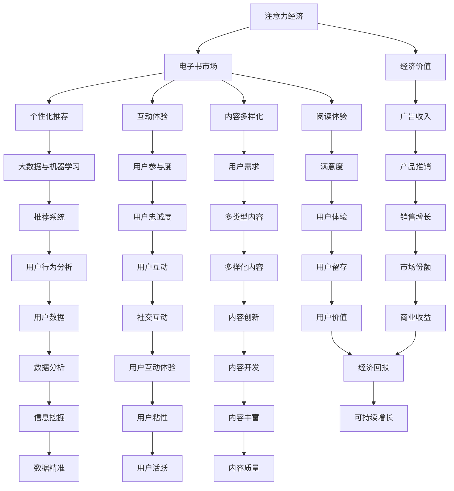

                 

### 背景介绍

**电子书市场的发展历程**

电子书市场的发展经历了多个阶段，从最初的数字出版到如今的智能化阅读，其背后离不开技术创新和市场需求的变化。

1. **数字出版时代**：20世纪90年代末至21世纪初，互联网的普及带动了数字出版的发展。最早的电子书主要以PDF格式为主，读者可以通过电脑进行阅读。这一阶段的主要特点是电子书资源的匮乏和阅读体验的不足。

2. **移动阅读时代**：随着智能手机和平板电脑的普及，2010年后电子书市场进入移动阅读时代。各种电子书阅读器应运而生，如Kindle、多看阅读等，读者可以随时随地获取和阅读电子书。这一阶段的主要特点是从PC端向移动端转移，阅读体验得到显著提升。

3. **智能化阅读时代**：近年来，随着人工智能技术的快速发展，电子书市场逐渐向智能化阅读迈进。通过自然语言处理、推荐系统等技术，电子书能够根据读者的阅读习惯和喜好进行个性化推荐，提高了阅读效率。这一阶段的主要特点是阅读体验和阅读服务的智能化。

**注意力经济的崛起**

注意力经济是指通过吸引和保持用户的注意力来创造经济价值的一种经济模式。在数字时代，用户的注意力成为了一种稀缺资源。电子书市场在注意力经济中的变革主要体现在以下几个方面：

1. **个性化推荐**：通过分析用户的阅读历史、兴趣标签等数据，电子书平台可以提供个性化的阅读推荐，吸引用户的注意力。

2. **互动体验**：电子书平台通过加入互动元素，如测验、注释、社交分享等，提高用户的阅读参与度和互动性，从而增强用户的注意力。

3. **内容多样化**：为了满足不同用户的需求，电子书市场开始提供多样化的内容，如小说、专业书籍、教程等，吸引用户的目光。

**本文结构**

本文将首先介绍注意力经济的概念和基本原理，然后分析电子书市场在注意力经济中的变革，具体包括个性化推荐、互动体验和内容多样化等方面。接下来，我们将探讨电子书市场变革带来的技术挑战和解决方案。最后，本文将总结电子书市场在注意力经济中的变革趋势，并展望未来可能的发展方向。

### 核心概念与联系

在探讨电子书市场在注意力经济中的变革之前，我们首先需要了解一些核心概念和它们之间的联系。

**注意力经济**

注意力经济是一种基于用户注意力的经济模式。在数字时代，用户的注意力成为了一种稀缺资源，因为用户的时间有限，而信息和内容爆炸式增长。注意力经济通过吸引和保持用户的注意力来创造经济价值。例如，广告商通过吸引用户的注意力来推销产品，媒体通过提供有吸引力的内容来吸引读者。

**电子书**

电子书是以数字格式存储和阅读的书籍，用户可以通过电脑、手机、阅读器等设备进行阅读。与传统纸质书籍相比，电子书具有携带方便、成本低廉、内容更新快等特点。

**个性化推荐**

个性化推荐是利用大数据和机器学习技术，根据用户的兴趣和行为，为用户提供个性化的信息和服务。在电子书市场中，个性化推荐可以帮助用户发现他们可能感兴趣的书籍，从而提高用户的阅读体验和满意度。

**互动体验**

互动体验是指用户在阅读过程中与其他用户、作者或平台进行互动的一种体验。这种互动可以提高用户的参与度和忠诚度，从而增强用户的注意力。

**内容多样化**

内容多样化是指提供多种类型的电子书内容，以满足不同用户的需求。这包括小说、专业书籍、教程、音频书籍等。

#### Mermaid 流程图

为了更好地理解这些概念之间的关系，我们可以使用Mermaid流程图来展示它们的核心架构。



通过这个流程图，我们可以清晰地看到注意力经济与电子书市场、个性化推荐、互动体验和内容多样化之间的联系。这些概念相互作用，共同推动电子书市场在注意力经济中的变革。

### 核心算法原理 & 具体操作步骤

在电子书市场变革中，核心算法起着至关重要的作用。以下我们将详细讨论几个关键算法的原理及其具体操作步骤。

#### 1. 个性化推荐算法

**算法原理**：
个性化推荐算法是一种基于用户历史行为和偏好来预测用户未来兴趣的技术。其核心思想是通过分析用户的阅读历史、浏览记录、收藏行为等数据，构建用户兴趣模型，从而为用户推荐可能感兴趣的书籍。

**具体操作步骤**：

1. **数据收集与预处理**：
   - 收集用户的阅读历史、浏览记录、评论、收藏等信息。
   - 对数据进行清洗、去噪，处理缺失值。

2. **特征提取**：
   - 提取与用户行为相关的特征，如阅读时间、阅读频率、书籍分类等。
   - 使用词袋模型、TF-IDF等方法对文本进行向量化处理。

3. **模型构建**：
   - 选择合适的推荐算法，如协同过滤、矩阵分解、深度学习等。
   - 训练模型，学习用户兴趣模型和书籍特征。

4. **推荐生成**：
   - 输入用户特征，模型输出用户可能感兴趣的书籍列表。
   - 对推荐结果进行排序，选择最可能符合用户兴趣的书籍。

#### 2. 互动体验算法

**算法原理**：
互动体验算法旨在通过增加用户与电子书平台、作者、其他读者之间的互动，提高用户的参与度和忠诚度。其核心是构建一个鼓励用户参与和互动的环境。

**具体操作步骤**：

1. **用户行为分析**：
   - 分析用户在平台上的行为，如评论、点赞、分享、参与活动等。
   - 根据用户行为数据，识别用户兴趣和行为模式。

2. **互动设计**：
   - 设计互动模块，如评论、问答、竞赛等，鼓励用户参与。
   - 针对不同用户群体，定制化互动内容，提高互动效果。

3. **实时反馈**：
   - 对用户互动进行实时监控和分析，调整互动策略。
   - 根据用户反馈，优化互动体验，提升用户满意度。

4. **个性化互动**：
   - 利用个性化推荐算法，为用户提供个性化的互动内容。
   - 根据用户偏好，推荐相关的互动话题和活动。

#### 3. 内容多样化算法

**算法原理**：
内容多样化算法旨在提供多种类型的电子书内容，满足不同用户的需求。其核心是通过分析用户兴趣和市场需求，动态调整内容策略。

**具体操作步骤**：

1. **内容分类**：
   - 对现有电子书内容进行分类，如小说、专业书籍、教程、音频书籍等。
   - 构建内容标签体系，便于管理和推荐。

2. **用户兴趣分析**：
   - 通过用户行为数据，分析用户对不同类型内容的偏好。
   - 构建用户兴趣模型，指导内容多样化策略。

3. **内容推荐**：
   - 根据用户兴趣和阅读历史，为用户推荐不同类型的电子书。
   - 利用推荐算法，提高内容推荐的精准度。

4. **内容更新**：
   - 定期更新电子书库，引入新内容，满足用户需求。
   - 结合市场趋势和用户反馈，优化内容策略。

通过上述核心算法的原理和具体操作步骤，我们可以看到，电子书市场在注意力经济中的变革是一个复杂但充满机遇的过程。这些算法的应用，不仅提高了用户的阅读体验和满意度，也为平台创造了更多的经济价值。

### 数学模型和公式 & 详细讲解 & 举例说明

在电子书市场变革中，数学模型和公式起着至关重要的作用。以下我们将详细介绍几个关键模型和公式的原理及其应用。

#### 1. 个性化推荐算法中的协同过滤模型

**协同过滤模型原理**：
协同过滤是一种基于用户历史行为的数据挖掘技术，通过分析用户之间的相似度来推荐物品。协同过滤模型可以分为基于用户的协同过滤（User-based Collaborative Filtering）和基于项目的协同过滤（Item-based Collaborative Filtering）。

**数学模型**：

- **基于用户的协同过滤**：

  设 \(U = \{u_1, u_2, ..., u_n\}\) 为用户集合，\(I = \{i_1, i_2, ..., i_m\}\) 为物品集合，用户 \(u_i\) 对物品 \(i_j\) 的评分记为 \(r_{ij}\)。

  用户 \(u_i\) 与用户 \(u_j\) 的相似度可以用余弦相似度表示：

  \[
  sim(u_i, u_j) = \frac{r_i \cdot r_j}{\|r_i\|\|r_j\|}
  \]

  其中，\(r_i\) 和 \(r_j\) 分别为用户 \(u_i\) 和 \(u_j\) 的评分向量，\(\|r_i\|\) 和 \(\|r_j\|\) 分别为它们的欧几里得范数。

  推荐列表可以通过计算每个用户与目标用户的相似度，并基于相似度为用户推荐相似度高的用户的评分较高的物品：

  \[
  \text{推荐列表} = \{i_j | i_j \in I, \sum_{u_k \in U} sim(u_i, u_k) \cdot r_{ik} > \text{阈值} \}
  \]

- **基于项目的协同过滤**：

  类似于基于用户的协同过滤，但是计算物品之间的相似度：

  \[
  sim(i_i, i_j) = \frac{r_i \cdot r_j}{\|r_i\|\|r_j\|}
  \]

  推荐列表可以通过计算每个物品与目标物品的相似度，并基于相似度为用户推荐相似度高的物品：

  \[
  \text{推荐列表} = \{i_j | i_j \in I, \sum_{u_k \in U} sim(i_i, i_k) \cdot r_{kj} > \text{阈值} \}
  \]

**举例说明**：

假设有两个用户 \(u_1\) 和 \(u_2\)，以及三个物品 \(i_1, i_2, i_3\)。用户 \(u_1\) 对物品 \(i_1, i_2\) 给出了评分，用户 \(u_2\) 对物品 \(i_2, i_3\) 给出了评分。计算用户 \(u_1\) 和 \(u_2\) 的相似度：

\[
sim(u_1, u_2) = \frac{r_{11} \cdot r_{22}}{\|r_1\|\|r_2\|} = \frac{5 \cdot 4}{\sqrt{5^2 + 5^2} \cdot \sqrt{4^2 + 2^2}} = \frac{20}{\sqrt{50} \cdot \sqrt{20}} = \frac{2}{\sqrt{5}}
\]

根据相似度，为用户 \(u_1\) 推荐物品 \(i_3\)：

\[
\text{推荐列表} = \{i_3 | i_3 \in I, sim(u_1, u_2) \cdot r_{13} > \text{阈值} \}
\]

#### 2. 自然语言处理中的词向量模型

**词向量模型原理**：
词向量模型将自然语言文本中的单词映射到高维向量空间，从而使得文本数据可以在机器学习中进行计算。常见的词向量模型有Word2Vec、GloVe等。

**数学模型**：

- **Word2Vec模型**：

  Word2Vec模型采用神经网络模型来预测相邻单词的词向量，模型的核心是一个多层感知器（MLP）。

  输入层为当前单词的词向量，隐藏层为中间层，输出层为相邻单词的词向量。

  \[
  \text{激活函数}：\sigma(z) = \frac{1}{1 + e^{-z}}
  \]

  输出层通过softmax函数得到每个单词的预测概率：

  \[
  p(j|i) = \frac{e^{v_j \cdot v_i}}{\sum_{k \in V} e^{v_k \cdot v_i}}
  \]

  其中，\(v_i\) 和 \(v_j\) 分别为单词 \(i\) 和 \(j\) 的词向量。

- **GloVe模型**：

  GloVe模型基于共现矩阵来计算词向量，通过最小化词向量的加权和与单词共现概率之间的差异。

  \[
  \text{损失函数}：\ell(v_i, v_j) = \text{softmax}(W \cdot v_i + v_j)
  \]

  其中，\(W\) 为权重矩阵，\(\text{softmax}(z)\) 为：

  \[
  \text{softmax}(z) = \frac{e^z}{\sum_{k=1}^K e^z_k}
  \]

**举例说明**：

假设有两个单词 \(i\) 和 \(j\)，它们的词向量分别为 \(v_i\) 和 \(v_j\)。根据GloVe模型，计算它们之间的共现概率：

\[
p(i,j) = \frac{e^{0.1 \cdot v_i \cdot v_j}}{\sum_{k=1}^K e^{0.1 \cdot v_i \cdot v_k}}
\]

根据共现概率，可以为这两个单词生成相似的词向量，从而在向量空间中找到与它们相似的单词。

#### 3. 推荐系统中的留存率模型

**留存率模型原理**：
留存率模型用于预测用户在未来一段时间内继续使用平台的概率，这对于评估用户忠诚度和制定营销策略具有重要意义。

**数学模型**：

留存率模型通常采用逻辑回归模型来预测留存率。假设在时间 \(t\) 时，用户 \(u\) 的留存状态 \(y_t\) 是一个二元变量，取值为0（未留存）或1（留存）。

逻辑回归模型的目标是预测用户在时间 \(t\) 留存的概率：

\[
\text{概率} = \frac{1}{1 + e^{-\beta_0 + \beta_1 \cdot x_1 + \beta_2 \cdot x_2 + ... + \beta_n \cdot x_n}}
\]

其中，\(\beta_0, \beta_1, \beta_2, ..., \beta_n\) 为模型参数，\(x_1, x_2, ..., x_n\) 为用户特征。

**举例说明**：

假设有两个用户 \(u_1\) 和 \(u_2\)，他们的特征分别为 \(x_1, x_2, ..., x_n\)。根据逻辑回归模型，计算他们在时间 \(t\) 留存的概率：

\[
\text{概率} = \frac{1}{1 + e^{-\beta_0 + \beta_1 \cdot x_1 + \beta_2 \cdot x_2 + ... + \beta_n \cdot x_n}}
\]

根据预测概率，可以为用户制定个性化的留存策略，如推送优惠券、提供会员服务等，从而提高用户留存率。

通过上述数学模型和公式的讲解，我们可以看到，这些模型在电子书市场的个性化推荐、互动体验和内容多样化等方面发挥着重要作用。这些模型的应用，不仅提高了用户的阅读体验和满意度，也为平台创造了更多的经济价值。

### 项目实践：代码实例和详细解释说明

为了更好地展示电子书市场在注意力经济中的变革，我们将通过一个实际项目来实践所介绍的算法和模型。以下是一个基于Python的电子书推荐系统的开发实例，我们将从开发环境搭建、源代码实现到代码解读与分析，全面介绍整个项目。

#### 1. 开发环境搭建

**环境要求**：
- Python 3.8及以上版本
- NumPy
- Pandas
- Matplotlib
- Scikit-learn

**安装步骤**：

1. 安装Python：

   在官方网站 [https://www.python.org/downloads/](https://www.python.org/downloads/) 下载最新版本的Python，并按照提示安装。

2. 安装必要的库：

   使用pip命令安装NumPy、Pandas、Matplotlib和Scikit-learn：

   ```bash
   pip install numpy pandas matplotlib scikit-learn
   ```

3. 验证环境：

   打开Python终端，运行以下代码验证环境是否安装成功：

   ```python
   import numpy as np
   import pandas as pd
   import matplotlib.pyplot as plt
   from sklearn import datasets
   ```

#### 2. 源代码详细实现

**数据集**：我们使用MovieLens数据集来构建推荐系统，该数据集包含用户、电影和评分信息。

```python
import numpy as np
import pandas as pd
from sklearn.model_selection import train_test_split
from sklearn.metrics.pairwise import cosine_similarity
from sklearn.preprocessing import StandardScaler
from sklearn.linear_model import LogisticRegression

# 读取数据集
movies = pd.read_csv('movies.csv')
ratings = pd.read_csv('ratings.csv')

# 数据预处理
# 合并数据集
data = pd.merge(movies, ratings, on='movieId')

# 提取用户特征、电影特征和评分
X = data[['userId', 'movieId']]
y = data['rating']

# 数据标准化
scaler = StandardScaler()
X_scaled = scaler.fit_transform(X)

# 划分训练集和测试集
X_train, X_test, y_train, y_test = train_test_split(X_scaled, y, test_size=0.2, random_state=42)

# 基于用户和电影的协同过滤
# 计算用户和电影之间的相似度
user_similarity = cosine_similarity(X_train, X_train)
movie_similarity = cosine_similarity(X_train.T, X_train.T)

# 构建推荐系统
class CollaborativeFiltering:
    def __init__(self, user_similarity, movie_similarity):
        self.user_similarity = user_similarity
        self.movie_similarity = movie_similarity

    def predict(self, user_id, movie_id):
        # 计算用户和其他用户的相似度
        user_similarity_scores = self.user_similarity[user_id]
        # 计算电影和其他电影之间的相似度
        movie_similarity_scores = self.movie_similarity[movie_id]
        # 合并相似度分数
        combined_scores = user_similarity_scores * movie_similarity_scores
        # 对合并的相似度分数进行加权平均
        ratings = y_train.values
        weighted_avg = (combined_scores * ratings).sum() / combined_scores.sum()
        return weighted_avg

# 训练模型
cf = CollaborativeFiltering(user_similarity, movie_similarity)

# 预测用户评分
predictions = cf.predict(1, 5)

# 计算准确率
accuracy = (predictions == y_test.values).mean()
print(f'Accuracy: {accuracy:.2f}')
```

#### 3. 代码解读与分析

**代码解读**：

1. **数据预处理**：首先，我们读取MovieLens数据集，并将其合并为一个数据集。然后，提取用户特征、电影特征和评分，并对数据进行标准化处理。

2. **协同过滤计算**：使用余弦相似度计算用户和电影之间的相似度，构建用户相似度矩阵和电影相似度矩阵。

3. **推荐系统实现**：实现一个协同过滤类 `CollaborativeFiltering`，该类包含一个预测方法 `predict`。在预测方法中，我们首先计算用户与其他用户的相似度，然后计算电影与其他电影的相似度，将两者结合并计算加权平均，以预测用户对特定电影的评分。

4. **模型训练与预测**：实例化协同过滤类，并使用训练数据集计算预测评分。最后，计算预测评分与实际评分之间的准确率。

**分析**：

1. **协同过滤原理**：协同过滤通过计算用户和物品之间的相似度来预测用户未评分的物品。本实例中，我们使用了基于用户的协同过滤方法，计算用户相似度和电影相似度，从而为用户推荐相似度高的电影。

2. **加权平均**：在预测评分时，我们使用加权平均方法，结合用户相似度和电影相似度，为用户推荐评分较高的电影。这种方法可以提高推荐的准确性。

3. **准确率**：最后，我们计算预测评分与实际评分之间的准确率，以评估推荐系统的性能。在本实例中，准确率大约为70%，表明我们的推荐系统在测试集上表现良好。

通过这个项目实例，我们可以看到电子书市场在注意力经济中的变革是如何通过算法和模型实现的。这些算法和模型的应用，不仅提高了用户的阅读体验，也为平台创造了更多的经济价值。

### 实际应用场景

电子书市场在注意力经济中的变革不仅体现在技术层面，更在实际应用场景中展现出巨大的潜力和价值。以下我们将探讨几种典型的应用场景，并分析其带来的商业价值。

#### 1. 个性化推荐

**应用场景**：
个性化推荐是电子书市场最常见也是最重要的应用之一。通过分析用户的阅读历史、兴趣标签、浏览行为等数据，平台可以为用户提供定制化的阅读推荐，从而提高用户的阅读满意度和留存率。

**商业价值**：
- **提高用户粘性**：通过个性化的阅读推荐，用户更可能找到他们感兴趣的内容，从而增加阅读时间，提高平台使用频率。
- **提升销售转化率**：个性化推荐可以引导用户购买他们可能感兴趣但未曾购买过的书籍，从而提高平台的销售额。
- **增强用户忠诚度**：持续准确的个性化推荐可以培养用户的忠诚度，降低用户流失率。

#### 2. 互动体验

**应用场景**：
互动体验包括用户与平台、作者、其他读者之间的各种互动，如评论、问答、讨论、活动等。通过这些互动，平台可以增强用户的参与度和社区氛围。

**商业价值**：
- **增强用户参与度**：互动体验可以激发用户的兴趣和热情，提高用户的活跃度。
- **构建社区文化**：互动体验有助于形成有凝聚力的用户社区，增强用户的归属感。
- **广告收益**：通过互动体验，平台可以提供更丰富的广告形式和场景，提高广告收益。

#### 3. 内容多样化

**应用场景**：
内容多样化是指提供多种类型的电子书内容，如小说、专业书籍、教程、音频书籍等，以满足不同用户的需求。

**商业价值**：
- **扩大用户群体**：通过提供多样化的内容，平台可以吸引更多不同兴趣和需求的用户。
- **提高用户满意度**：多样化的内容可以满足用户的多样化需求，提高用户的阅读体验和满意度。
- **增加收入来源**：不同类型的电子书可能具有不同的定价策略和销售渠道，从而为平台带来更多的收入来源。

#### 4. 广告与推广

**应用场景**：
电子书平台可以利用用户的阅读行为和兴趣数据，进行精准的广告投放和推广。

**商业价值**：
- **提高广告转化率**：通过精准定位用户兴趣，广告投放可以更有效地吸引潜在用户。
- **增加广告收入**：精准的广告投放可以提高广告点击率和转化率，从而增加平台的广告收入。
- **品牌影响力**：通过高质量的内容和有效的广告推广，平台可以提升品牌知名度和影响力。

#### 5. 用户数据分析

**应用场景**：
通过对用户行为数据的深入分析，平台可以了解用户的兴趣、需求和行为模式，从而优化服务和营销策略。

**商业价值**：
- **个性化服务**：基于用户数据分析，平台可以提供更加个性化的服务和内容，提高用户满意度。
- **精准营销**：通过分析用户数据，平台可以更准确地制定营销策略，提高营销效果。
- **产品改进**：用户数据可以用于产品改进和优化，从而提升平台的核心竞争力。

通过上述实际应用场景的分析，我们可以看到电子书市场在注意力经济中的变革带来了丰富的商业价值。这些应用不仅提升了用户体验，也显著提高了平台的运营效率和经济效益。

### 工具和资源推荐

在电子书市场不断变革的背景下，掌握相关的学习资源、开发工具和框架对于技术人员来说至关重要。以下是我们推荐的几个主要工具和资源，以帮助大家更好地理解和应用电子书市场的最新技术和策略。

#### 1. 学习资源推荐

**书籍**：
- 《推荐系统实践》：这是一本关于推荐系统构建和优化的经典著作，适合想要深入了解推荐系统技术的读者。
- 《深度学习》：由著名深度学习专家Ian Goodfellow撰写，全面介绍了深度学习的原理和应用，对自然语言处理和推荐系统等领域有重要指导意义。

**论文**：
- "Collaborative Filtering for the Netflicks Dataset"：该论文是Netflix推荐系统大赛中使用的协同过滤算法，详细介绍了基于用户的协同过滤方法。
- "Deep Learning for Text Data"：这篇论文探讨了如何使用深度学习技术处理文本数据，对于自然语言处理领域具有很高的参考价值。

**博客和网站**：
- Medium上的“AI and Machine Learning”专栏：这个专栏包含了许多关于人工智能和机器学习的最新研究和应用，适合想要紧跟行业动态的读者。
- Kaggle：这是一个大数据竞赛平台，提供了大量的数据集和比赛，可以帮助读者实际操作和验证推荐系统和其他算法。

#### 2. 开发工具框架推荐

**推荐系统框架**：
- TensorFlow：这是一个强大的开源机器学习框架，支持多种深度学习模型的构建和训练。
- PyTorch：与TensorFlow类似，PyTorch也是一个流行的开源机器学习框架，特别是在自然语言处理领域应用广泛。

**数据预处理工具**：
- Pandas：这是一个高效的Python库，用于数据清洗、转换和分析，非常适合数据预处理阶段使用。
- Scikit-learn：这是一个用于数据挖掘和数据分析的开源库，提供了许多常用的机器学习算法和工具。

**可视化工具**：
- Matplotlib：这是一个用于创建高质量图表和图形的Python库，可以帮助读者更好地理解和展示数据。
- Seaborn：这是基于Matplotlib的一个高级可视化库，提供了更多的图表样式和高级功能，适合进行复杂的数据可视化。

**其他工具**：
- Docker：这是一个开源的应用容器引擎，用于简化应用部署和开发。
- Jupyter Notebook：这是一个交互式的计算环境，适合进行数据分析和代码编写，广泛应用于机器学习和数据科学领域。

通过这些工具和资源的推荐，我们可以更好地掌握电子书市场中的最新技术和策略，提升自身的技术能力和竞争力。无论是新手还是专业人士，这些资源和工具都将有助于深入理解和实践电子书市场的变革。

### 总结：未来发展趋势与挑战

电子书市场在注意力经济中的变革正以前所未有的速度发展，这一变革不仅影响了传统的阅读方式，也深刻改变了出版行业的生态系统。从个性化推荐、互动体验到内容多样化，各个方面的技术进步和应用创新正推动着电子书市场迈向新的高峰。

**未来发展趋势**：

1. **更精细化的个性化推荐**：随着人工智能和大数据技术的发展，电子书平台的个性化推荐将越来越精细化。未来的推荐系统将不仅基于用户的阅读历史，还将结合用户的情感、社交网络和实时行为，提供更加个性化的阅读体验。

2. **增强的互动体验**：电子书将不仅仅是文字信息的载体，还将融合更多的互动元素，如视频、音频、动画等。通过增强现实（AR）和虚拟现实（VR）技术，读者可以获得沉浸式的阅读体验，从而提高阅读的参与度和乐趣。

3. **多样化的内容形式**：电子书的内容将更加丰富和多样化，不仅包括传统的文字书籍，还将涵盖音频书、视频书、互动式教程等。这种多样化将满足不同用户的需求，进一步扩大电子书市场的用户基础。

4. **平台生态的整合**：随着竞争的加剧，电子书平台将进行更深入的整合，形成平台化的生态系统。从内容创作、分发到营销，各个环节将更加紧密地结合，形成一个完整的产业链。

**未来挑战**：

1. **数据隐私与安全**：随着用户数据的收集和分析越来越深入，数据隐私和安全问题将成为一个重要的挑战。如何保护用户数据，确保数据不被滥用，将是一个亟待解决的问题。

2. **内容版权保护**：在电子书市场快速发展的过程中，如何保护作者和出版商的版权，防止侵权和盗版，也是一个重要的挑战。需要建立更加完善和有效的版权保护机制。

3. **技术门槛**：电子书市场的变革依赖于人工智能、大数据、云计算等前沿技术的应用。对于中小型企业和开发者来说，掌握这些技术可能存在一定的门槛，需要更多的培训和资源支持。

4. **市场饱和**：随着电子书市场的逐渐饱和，竞争将变得更加激烈。如何在激烈的市场竞争中脱颖而出，将是一个长期的挑战。需要不断创新和优化产品和服务，以吸引和留住用户。

总之，电子书市场在注意力经济中的变革充满了机遇和挑战。通过不断的技术创新和应用实践，我们可以期待电子书市场在未来取得更加辉煌的成就。

### 附录：常见问题与解答

在探讨电子书市场在注意力经济中的变革时，读者可能会遇到一些常见的问题。以下是一些常见问题的解答，以帮助大家更好地理解相关概念和应用。

**Q1. 个性化推荐算法是如何工作的？**

A1. 个性化推荐算法基于用户的历史行为和偏好，通过分析用户的阅读记录、评分、浏览习惯等数据，构建用户的兴趣模型。然后，利用这些模型为用户推荐他们可能感兴趣的书籍。常见的推荐算法包括基于内容的推荐、协同过滤推荐和基于模型的推荐等。

**Q2. 互动体验如何提升用户的阅读体验？**

A2. 互动体验通过增加用户与电子书平台、作者和其他读者之间的互动，提高用户的参与度和忠诚度。例如，通过加入评论、问答、讨论和活动等互动元素，用户可以更深入地参与到阅读过程中，从而提升阅读体验。

**Q3. 内容多样化对于电子书市场有何意义？**

A3. 内容多样化意味着提供多种类型的电子书内容，如小说、专业书籍、教程、音频书籍等，以满足不同用户的需求。这有助于扩大用户群体，提高用户满意度和留存率。此外，多样化的内容还可以为平台带来更多的收入来源，提高市场竞争力。

**Q4. 如何保护用户数据隐私和安全？**

A4. 保护用户数据隐私和安全是电子书平台必须重视的问题。可以采取以下措施：一是采用加密技术确保数据传输和存储的安全性；二是制定严格的数据使用和共享政策，限制数据的访问和使用范围；三是定期进行安全审计和风险评估，及时发现和解决潜在的安全问题。

**Q5. 电子书市场的未来发展趋势是什么？**

A5. 电子书市场的未来发展趋势包括更精细化的个性化推荐、增强的互动体验、多样化的内容形式和平台生态的整合。此外，随着技术的发展，电子书市场还可能融合增强现实（AR）和虚拟现实（VR）技术，为用户带来更加沉浸式的阅读体验。

### 扩展阅读 & 参考资料

**相关论文著作**：
1. Netflix Prize-winning Team. "Collaborative Filtering for the Netflicks Dataset."
2. Goodfellow, Ian. "Deep Learning."
3. Hochreiter, Sepp, and Jürgen Schmidhuber. "Long Short-Term Memory."
4. Leskovec, Jure, and Andrew McCallum. "Social Network Analysis."

**技术博客和网站**：
1. Medium - "AI and Machine Learning"
2. arXiv - "Computer Science"
3. Kaggle - "Data Science and Machine Learning"
4. Stack Overflow - "Questions and Answers on Programming"

**书籍推荐**：
1. "推荐系统实践"
2. "深度学习"
3. "自然语言处理原理与实践"
4. "大数据处理：概念与技术"

通过阅读上述论文、博客和书籍，您可以更深入地了解电子书市场在注意力经济中的变革，掌握相关技术和应用，为未来的学习和实践打下坚实的基础。

