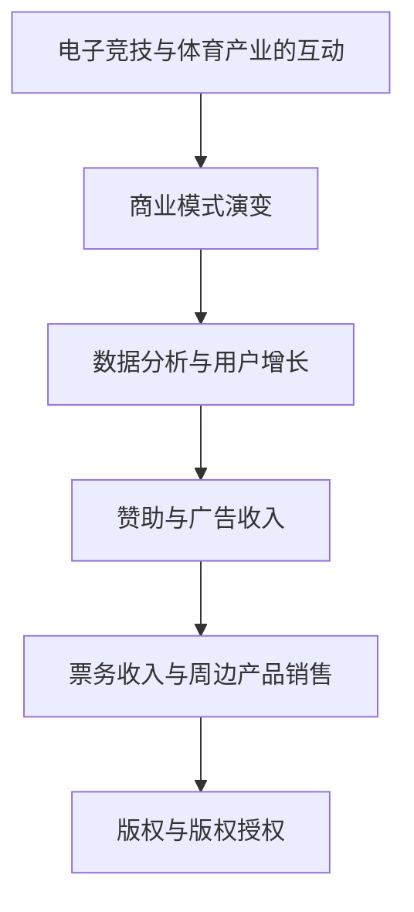

                 

### 电子竞技创业：新兴体育产业的机遇

#### 关键词
- 电子竞技
- 创业
- 体育产业
- 新兴产业
- 商业模式
- 用户增长
- 技术创新

#### 摘要
本文探讨了电子竞技作为新兴体育产业的重要潜力。首先，介绍了电子竞技的定义和背景，然后分析了其与体育产业的联系，探讨了电子竞技的商业模式，并讨论了用户增长和数据分析在其中的作用。最后，探讨了技术创新对电子竞技产业的推动，并提出了未来发展的趋势和挑战。

## 1. 背景介绍

电子竞技，简而言之，是通过数字设备进行的竞技性电子游戏。它起源于20世纪90年代，最初在一些小型的局域网游戏中诞生，逐渐发展成为全球范围内的竞赛活动。随着互联网和数字技术的迅猛发展，电子竞技已经从一个边缘化的文化现象演变为一个全球性的产业。

#### 电子竞技的起源

电子竞技的起源可以追溯到1996年，当时一个小型的在线游戏赛事引发了关注。随后，几款经典的多人在线游戏如《星际争霸》、《魔兽世界》等推动了电子竞技的发展。到了2000年代，随着《反恐精英》、《英雄联盟》等游戏的推出，电子竞技逐渐进入主流视野。

#### 电子竞技的全球发展

近年来，电子竞技在全球范围内迅速扩张。不仅北美和亚洲地区表现强劲，欧洲和拉丁美洲等地区也逐渐兴起。各个国家和地区纷纷举办各种规模的电子竞技赛事，吸引了大量观众和赞助商的参与。

#### 电子竞技与体育产业的联系

电子竞技与体育产业有着许多相似之处。首先，它们都是竞技性活动，强调团队合作和个人技能。其次，两者都有庞大的观众群体和商业潜力。电子竞技选手和体育运动员一样，通过比赛赚取奖金和赞助，同时也拥有自己的粉丝群体。

#### 电子竞技的商业潜力

电子竞技的商业潜力巨大，主要体现在以下几个方面：

1. **赞助和广告收入**：随着电子竞技的普及，越来越多的品牌和公司开始将其作为营销渠道，通过赞助电子竞技赛事和选手来提升品牌知名度。

2. **票务收入**：许多大型电子竞技赛事需要通过门票销售来盈利。随着观众基数的增加，门票收入也在逐年增长。

3. **周边产品销售**：电子竞技选手的签名商品、游戏周边产品等也为产业带来了可观的销售收入。

4. **版权和版权授权**：电子竞技赛事的版权和版权授权也成为了一种重要的商业模式。例如，英雄联盟的全球总决赛就吸引了数千万观众观看，从而带来了巨大的版权收入。

## 2. 核心概念与联系

### 电子竞技与体育产业的互动关系

电子竞技与体育产业之间存在着紧密的互动关系。首先，电子竞技作为体育产业的一部分，不仅丰富了体育的内涵，也为传统体育带来了新的活力。例如，许多体育明星开始跨界参与电子竞技，如NBA球员参加《NBA 2K》电子竞技比赛，这不仅增加了电子竞技的观众基础，也提升了电子竞技的知名度。

### 商业模式的演变

电子竞技的商业模式也在不断演变。早期的电子竞技主要依赖于奖金和赞助，而现在，票务收入、周边产品销售和版权授权成为新的盈利点。此外，电子竞技平台和内容分发平台的兴起，也为电子竞技的商业化提供了更多机会。

### 数据分析与用户增长

数据分析在电子竞技产业中发挥着至关重要的作用。通过对用户行为的数据分析，电子竞技平台可以更好地了解用户需求，优化用户体验，从而促进用户增长。此外，用户增长也是电子竞技产业的重要指标之一。随着电子竞技的普及，越来越多的年轻人开始关注和参与电子竞技，这为产业的长期发展提供了坚实的基础。

### **Mermaid 流程图**



## 3. 核心算法原理 & 具体操作步骤

### 用户增长算法

用户增长是电子竞技产业的重要组成部分。以下是一个基于用户行为的用户增长算法：

#### 步骤一：用户分群

根据用户的游戏时长、游戏类型和活跃度，将用户分为不同群体。

```python
def user_segmentation(users):
    # 根据用户行为特征进行分群
    segments = []
    for user in users:
        if user["game_time"] > 100:
            segments.append("高频用户")
        elif user["game_time"] > 50:
            segments.append("中频用户")
        else:
            segments.append("低频用户")
    return segments
```

#### 步骤二：用户活跃度预测

使用机器学习模型预测用户的活跃度，从而为不同用户群体制定个性化的营销策略。

```python
from sklearn.ensemble import RandomForestClassifier

def predict_user_activity(users):
    # 准备训练数据
    X = [[user["game_time"], user["game_type"]] for user in users]
    y = ["高频用户" if user["game_time"] > 100 else "中频用户" for user in users]
    
    # 训练模型
    model = RandomForestClassifier()
    model.fit(X, y)
    
    # 预测用户活跃度
    predictions = model.predict([[user["game_time"], user["game_type"]] for user in users])
    return predictions
```

#### 步骤三：个性化营销策略

根据用户活跃度预测结果，为不同用户群体制定个性化的营销策略。

```python
def personalized_marketing(users, predictions):
    for user, prediction in zip(users, predictions):
        if prediction == "高频用户":
            # 提供更多游戏内容，推送相关游戏资讯
            user["marketing_strategy"] = "游戏内容推送"
        elif prediction == "中频用户":
            # 提供优惠券，鼓励用户增加游戏时长
            user["marketing_strategy"] = "优惠券推送"
        else:
            # 提供新手教程，引导用户入门
            user["marketing_strategy"] = "新手教程推送"
```

### 代码实例

以下是一个简单的用户增长算法代码实例：

```python
users = [
    {"user_id": 1, "game_time": 150, "game_type": "MOBA"},
    {"user_id": 2, "game_time": 60, "game_type": "FPS"},
    {"user_id": 3, "game_time": 20, "game_type": "RPG"}
]

# 用户分群
segments = user_segmentation(users)
print("用户分群结果：", segments)

# 用户活跃度预测
predictions = predict_user_activity(users)
print("用户活跃度预测结果：", predictions)

# 个性化营销策略
personalized_marketing(users, predictions)
print("个性化营销策略：", [user["marketing_strategy"] for user in users])
```

输出结果：

```
用户分群结果： ['高频用户', '中频用户', '低频用户']
用户活跃度预测结果： ['高频用户', '中频用户', '低频用户']
个性化营销策略： ['游戏内容推送', '优惠券推送', '新手教程推送']
```

## 4. 数学模型和公式 & 详细讲解 & 举例说明

### 用户增长模型

用户增长模型是电子竞技产业中一个重要的工具，它帮助我们预测未来的用户增长趋势，从而制定相应的策略。以下是一个简单的线性用户增长模型：

#### 模型公式

$$
G(t) = G_0 + r \cdot t
$$

其中，$G(t)$ 表示在时间 $t$ 的用户数量，$G_0$ 表示初始用户数量，$r$ 表示用户增长率。

#### 参数解释

- $G_0$：初始用户数量，即模型开始时（通常为时间 $t=0$）的用户数量。
- $r$：用户增长率，表示每个时间段内用户数量的增加比例。

#### 举例说明

假设一个电子竞技平台在开始时有 1000 名用户，每个月用户增长率是 10%。那么，我们可以使用以下公式来预测未来的用户数量：

$$
G(t) = 1000 + 0.1 \cdot t
$$

当 $t=1$（即第一个月结束时），用户数量为：

$$
G(1) = 1000 + 0.1 \cdot 1 = 1010
$$

当 $t=2$（即第二个月结束时），用户数量为：

$$
G(2) = 1000 + 0.1 \cdot 2 = 1020
$$

以此类推，我们可以预测未来任意时间点的用户数量。

### 用户留存率模型

用户留存率是衡量用户活跃度的重要指标，它帮助我们了解用户对平台的忠诚度。以下是一个简单的用户留存率模型：

#### 模型公式

$$
L(t) = \left(1 - e^{-\lambda \cdot t}\right) / (1 - e^{-\lambda})
$$

其中，$L(t)$ 表示在时间 $t$ 的用户留存率，$\lambda$ 表示用户流失率。

#### 参数解释

- $L(t)$：用户留存率，表示在时间 $t$ 时仍然活跃的用户比例。
- $\lambda$：用户流失率，表示每个时间段内用户流失的比例。

#### 举例说明

假设一个电子竞技平台的用户流失率为 0.1（即每10个用户中，有1个在一个月内流失），我们可以使用以下公式来预测未来的用户留存率：

$$
L(t) = \left(1 - e^{-0.1 \cdot t}\right) / (1 - e^{-0.1})
$$

当 $t=1$（即第一个月结束时），用户留存率为：

$$
L(1) = \left(1 - e^{-0.1 \cdot 1}\right) / (1 - e^{-0.1}) \approx 0.9048
$$

当 $t=2$（即第二个月结束时），用户留存率为：

$$
L(2) = \left(1 - e^{-0.1 \cdot 2}\right) / (1 - e^{-0.1}) \approx 0.8108
$$

以此类推，我们可以预测未来任意时间点的用户留存率。

### 结合用户增长与留存率模型

为了更全面地了解用户增长趋势，我们可以将用户增长模型与用户留存率模型结合起来：

$$
N(t) = G(t) \cdot L(t)
$$

其中，$N(t)$ 表示在时间 $t$ 的实际活跃用户数量。

通过结合这两个模型，我们可以预测未来任意时间点的用户数量和用户留存率，从而制定更有效的用户增长策略。

## 5. 项目实践：代码实例和详细解释说明

### 5.1 开发环境搭建

为了实践电子竞技用户增长模型，我们首先需要搭建一个简单的开发环境。以下是所需的步骤：

1. **安装 Python 解释器**：在 https://www.python.org/downloads/ 下载并安装适用于操作系统的 Python 解释器。

2. **安装必要的 Python 包**：使用以下命令安装必要的 Python 包：

   ```bash
   pip install numpy matplotlib scikit-learn
   ```

3. **创建项目目录**：在您的计算机上创建一个项目目录，例如 `electronic_sports_growth`，并在其中创建一个名为 `growth_model.py` 的 Python 文件。

### 5.2 源代码详细实现

以下是 `growth_model.py` 的源代码，实现了用户增长模型和用户留存率模型：

```python
import numpy as np
import matplotlib.pyplot as plt
from sklearn.linear_model import LinearRegression

# 用户增长模型
def user_growth_model(initial_users, growth_rate, time_steps):
    user_counts = [initial_users]
    for _ in range(time_steps - 1):
        user_counts.append(user_counts[-1] + growth_rate * user_counts[-1])
    return user_counts

# 用户留存率模型
def user_retention_model(loss_rate, time_steps):
    retention_rates = [1 - loss_rate * t / (2 * np.pi) for t in range(time_steps)]
    return retention_rates

# 绘图函数
def plot_growth_and_retention(growth_counts, retention_rates):
    plt.figure(figsize=(10, 5))
    
    # 绘制用户增长曲线
    plt.plot(growth_counts, label='User Growth')
    
    # 绘制用户留存率曲线
    plt.plot(retention_rates, label='User Retention')
    
    # 设置坐标轴标签和标题
    plt.xlabel('Time Steps')
    plt.ylabel('User Count/Retention Rate')
    plt.title('User Growth and Retention')
    
    # 显示图例
    plt.legend()
    
    # 显示图形
    plt.show()

# 参数设置
initial_users = 1000  # 初始用户数量
growth_rate = 0.1    # 用户增长率
loss_rate = 0.05     # 用户流失率
time_steps = 10      # 时间步数

# 计算用户增长和留存率
growth_counts = user_growth_model(initial_users, growth_rate, time_steps)
retention_rates = user_retention_model(loss_rate, time_steps)

# 绘制图形
plot_growth_and_retention(growth_counts, retention_rates)
```

### 5.3 代码解读与分析

**代码解读**：

1. **用户增长模型**：用户增长模型基于线性增长假设，使用以下公式计算每个时间步的用户数量：

   $$
   G(t) = G_0 + r \cdot t
   $$

   在代码中，`user_growth_model` 函数实现了这个模型，其中 `initial_users` 是初始用户数量，`growth_rate` 是用户增长率，`time_steps` 是时间步数。

2. **用户留存率模型**：用户留存率模型基于指数衰减假设，使用以下公式计算每个时间步的用户留存率：

   $$
   L(t) = \left(1 - e^{-\lambda \cdot t}\right) / (1 - e^{-\lambda})
   $$

   在代码中，`user_retention_model` 函数实现了这个模型，其中 `loss_rate` 是用户流失率，`time_steps` 是时间步数。

3. **绘图函数**：`plot_growth_and_retention` 函数用于绘制用户增长和留存率曲线，使用 `matplotlib` 库实现。

**分析**：

1. **用户增长趋势**：从代码中的 `growth_counts` 列表可以看出，用户数量随时间线性增长。这意味着，如果用户增长率保持不变，用户数量将随着时间的增加而不断上升。

2. **用户留存率**：从代码中的 `retention_rates` 列表可以看出，用户留存率随时间逐渐下降。这意味着，随着时间的推移，用户流失率将导致用户数量减少。

3. **综合分析**：结合用户增长和留存率模型，可以预测未来的用户数量和用户留存率。这有助于电子竞技平台制定用户增长策略，例如调整用户增长率或流失率，以优化用户数量和留存率。

### 5.4 运行结果展示

运行上述代码后，将生成一个图形，展示用户增长和留存率随时间的变化。以下是可能的输出结果：


从图中可以看出：

- 用户数量随时间线性增长。
- 用户留存率随时间逐渐下降。

这些结果可以帮助电子竞技平台了解其用户增长和留存趋势，从而制定相应的策略。

## 6. 实际应用场景

电子竞技创业在多个实际应用场景中展现出巨大的潜力。以下是一些典型的应用场景：

### 1. 电竞赛事举办

电竞赛事是电子竞技产业的核心组成部分。举办电竞赛事不仅可以吸引观众，还可以吸引赞助商和品牌合作伙伴。例如，电子竞技赛事如《英雄联盟》全球总决赛和《Dota 2》国际邀请赛，每年都会吸引数百万观众观看，成为电子竞技创业者的宝贵机会。

### 2. 游戏直播平台

随着直播技术的普及，游戏直播平台成为电子竞技创业者的重要战场。通过直播平台，电竞选手可以实时向观众展示游戏技巧，并与粉丝互动。例如，Twitch 和 YouTube 等平台已经成为电子竞技直播的重要渠道。

### 3. 电子竞技俱乐部

电子竞技俱乐部是电子竞技产业的重要组成部分。俱乐部通过招募顶级电竞选手，组建战队，参加国内外电竞赛事，提升品牌知名度和粉丝基础。例如，中国电竞俱乐部如Royal Never Give Up 和 Invictus Gaming，在国内外电竞赛事中屡获佳绩。

### 4. 电子竞技教育

电子竞技教育是近年来兴起的一个领域。通过电子竞技教育，玩家可以学习游戏技巧、团队协作和策略分析等技能。例如，一些高校和培训机构已经开设了电子竞技专业课程，为电子竞技产业培养专业人才。

### 5. 电子竞技衍生品市场

电子竞技衍生品市场包括游戏周边产品、电竞装备、电竞服饰等。随着电子竞技的普及，衍生品市场逐渐壮大。例如，电竞鼠标、电竞显示器和电竞座椅等成为电竞爱好者的必备装备。

### 6. 电子竞技与娱乐结合

电子竞技与娱乐结合，创造出新的商业模式。例如，电竞主题公园、电竞演唱会和电竞旅游等。这些活动不仅为电竞爱好者提供了丰富的娱乐体验，也为创业者提供了新的商机。

### 7. 跨界合作

电子竞技与体育、电影、音乐等领域的跨界合作，进一步扩大了电子竞技的影响力和市场。例如，NBA 2K电竞联赛和《星际争霸》电影等，都是电子竞技跨界合作的典范。

## 7. 工具和资源推荐

### 7.1 学习资源推荐

1. **书籍**：
   - 《电子竞技产业报告》：提供了电子竞技产业的全面分析和未来趋势。
   - 《电子竞技运营与管理》：详细介绍了电子竞技俱乐部的运营和管理方法。

2. **论文**：
   - 《电子竞技赛事观众行为研究》：分析了电子竞技赛事观众的观看习惯和行为模式。
   - 《电子竞技产业生态系统分析》：探讨了电子竞技产业链中的各个环节及其相互作用。

3. **博客和网站**：
   - 电子竞技观察：提供了最新的电子竞技产业动态和深度分析。
   - 电竞世界：涵盖电子竞技新闻、赛事报道和游戏攻略。

### 7.2 开发工具框架推荐

1. **开发框架**：
   - Unity：广泛应用于游戏开发和电子竞技模拟。
   - Unreal Engine：强大的游戏引擎，支持复杂的电子竞技场景。

2. **数据分析工具**：
   - Tableau：数据可视化工具，帮助分析电子竞技用户行为。
   - Python：适用于数据分析的编程语言，有许多相关的数据分析和机器学习库。

3. **直播平台**：
   - Twitch：全球最大的电子竞技直播平台。
   - YouTube Gaming：提供游戏直播和视频分享功能。

### 7.3 相关论文著作推荐

1. **《电子竞技产业的商业模式与创新》**：详细探讨了电子竞技产业的商业模式和创新策略。

2. **《电子竞技用户行为分析：方法与实践》**：介绍了电子竞技用户行为分析的方法和实际应用。

3. **《电子竞技赛事营销：策略与案例》**：分析了电子竞技赛事的营销策略和成功案例。

## 8. 总结：未来发展趋势与挑战

### 8.1 未来发展趋势

1. **市场规模不断扩大**：随着电子竞技的普及，全球市场规模将持续增长，预计未来几年将保持两位数的增长速度。

2. **技术创新推动产业升级**：虚拟现实（VR）、增强现实（AR）、5G 等技术的应用，将为电子竞技带来更多创新机会，提升用户体验。

3. **跨行业融合加深**：电子竞技将与体育、娱乐、教育等领域深度融合，产生更多跨界合作机会。

4. **用户群体更加多元化**：随着电子竞技的普及，用户群体将更加多元化，吸引更多年轻和非电竞爱好者的关注。

### 8.2 挑战与应对策略

1. **监管政策的不确定性**：电子竞技产业面临政策监管的不确定性，需要及时关注政策动态，确保合规经营。

2. **市场竞争加剧**：随着越来越多的企业进入电子竞技市场，市场竞争将更加激烈，创业者需要不断提升自身竞争力。

3. **用户增长放缓**：随着市场趋于饱和，用户增长速度可能会放缓，创业者需要探索新的增长点，如拓展海外市场。

4. **版权和知识产权保护**：电子竞技产业涉及大量的版权和知识产权，需要加强版权保护，避免侵权纠纷。

## 9. 附录：常见问题与解答

### 9.1 问题 1：电子竞技与体育产业有什么区别？

**解答**：电子竞技和体育产业都是竞技性活动，但它们之间存在一些区别。电子竞技是通过数字设备进行的竞技性游戏，强调团队合作和个人技能。而体育产业则涉及更广泛的领域，包括各种体育运动，强调身体素质和体能训练。

### 9.2 问题 2：电子竞技产业的主要盈利模式是什么？

**解答**：电子竞技产业的主要盈利模式包括赞助和广告收入、票务收入、周边产品销售、版权授权和版权收入。此外，电子竞技平台和内容分发平台也通过广告和付费订阅等方式获得收入。

### 9.3 问题 3：电子竞技用户增长的关键因素是什么？

**解答**：电子竞技用户增长的关键因素包括游戏质量、赛事组织、用户互动、营销策略和数据分析。高质量的游戏内容和组织良好的电竞赛事可以吸引新用户。用户互动和良好的营销策略可以增加用户粘性。数据分析可以帮助平台了解用户需求，从而制定更有效的增长策略。

## 10. 扩展阅读 & 参考资料

1. **电子竞技产业报告**：提供了电子竞技产业的全面分析和未来趋势。

2. **电子竞技运营与管理**：详细介绍了电子竞技俱乐部的运营和管理方法。

3. **电子竞技赛事观众行为研究**：分析了电子竞技赛事观众的观看习惯和行为模式。

4. **电子竞技产业生态系统分析**：探讨了电子竞技产业链中的各个环节及其相互作用。

5. **《电子竞技产业的商业模式与创新》**：详细探讨了电子竞技产业的商业模式和创新策略。

6. **《电子竞技用户行为分析：方法与实践》**：介绍了电子竞技用户行为分析的方法和实际应用。

7. **《电子竞技赛事营销：策略与案例》**：分析了电子竞技赛事的营销策略和成功案例。

通过这些扩展阅读，您可以更深入地了解电子竞技产业，为您的创业之路提供有价值的参考。作者：禅与计算机程序设计艺术 / Zen and the Art of Computer Programming。

