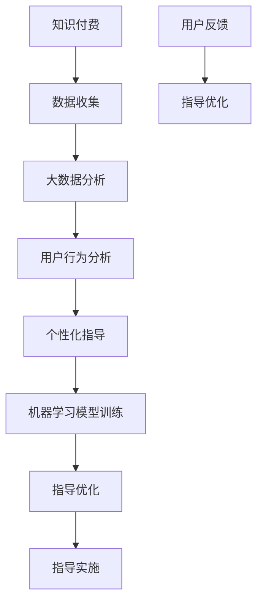

                 

### 背景介绍

在当前全球化的背景下，留学已成为越来越多中国家庭的考虑方向。据相关统计数据显示，中国赴海外留学的学生人数持续增长，尤其是在近年来，随着国内高等教育资源的不断丰富，学生和家长对留学目的国的选择和期望也在不断变化。然而，随之而来的留学服务领域知识付费市场也在快速演变，个性化指导的需求日益凸显。

留学服务领域知识付费市场的主要参与者包括留学中介机构、在线教育平台、留学规划师等。这些服务提供商通过各种形式的付费内容，如讲座、咨询、课程、文档资料等，为留学家庭提供全方位的指导。然而，面对日益多样化的留学需求，传统的标准化服务已经难以满足市场的要求。

一方面，留学家庭的背景和需求存在巨大的差异。每个家庭的教育背景、经济条件、语言能力、留学目的等都有所不同，因此他们对于留学服务的需求也各不相同。例如，有些家庭可能需要详细的申请指导和材料准备服务，而另一些家庭可能更关注留学后的职业规划和生活适应。这种需求的多样性使得传统的知识付费服务难以提供个性化的指导。

另一方面，留学市场的竞争日益激烈。随着留学中介机构的增加和在线教育平台的发展，市场竞争压力不断增大。为了吸引更多的客户，留学服务提供商需要不断提升服务的质量和效率，而个性化指导正是提升服务质量和客户满意度的关键。

此外，随着互联网技术的进步和大数据、人工智能等新技术的应用，留学服务领域正在发生深刻的变革。个性化指导的实现不仅依赖于对大量数据的分析处理，还需要结合先进的技术手段，如机器学习、自然语言处理等，来提供更加精准和高效的服务。

本文将围绕留学服务领域知识付费要提供个性化指导这一主题，首先介绍个性化指导的核心概念和原理，然后深入探讨实现个性化指导的关键技术，如大数据分析和机器学习算法。接着，我们将通过具体的项目实践，展示如何运用这些技术来实现留学服务领域的个性化指导。最后，我们将探讨个性化指导在实际应用场景中的挑战和解决方案，并提出未来发展趋势和可能的挑战。

通过这篇文章，我们希望能够为留学服务领域提供一些有价值的思考和建议，帮助留学服务提供商更好地满足市场需求，提升客户满意度，从而在激烈的市场竞争中脱颖而出。

### 核心概念与联系

为了深入探讨留学服务领域知识付费要提供个性化指导，首先需要了解一些核心概念和原理，这些概念包括知识付费、个性化指导、大数据分析、机器学习等。以下是对这些核心概念的详细解释和它们之间的相互联系。

#### 知识付费

知识付费是指用户为了获取某种知识或技能，向知识提供者支付费用的行为。在留学服务领域，知识付费的形式多样，包括线上讲座、一对一咨询、课程购买、文档资料下载等。知识付费的核心在于满足用户对于特定知识的需求，帮助他们在留学过程中少走弯路，提高效率。

#### 个性化指导

个性化指导是基于用户个体差异，为其提供量身定制服务的过程。在留学服务领域，个性化指导意味着根据每个家庭的教育背景、经济条件、语言能力、留学目的等因素，提供相应的指导和帮助。个性化指导的核心在于满足用户的个性化需求，提高服务体验和满意度。

#### 大数据分析

大数据分析是指利用统计学和计算机科学方法，对海量数据进行分析和处理，从中提取有用信息和知识的过程。在留学服务领域，大数据分析可以用于收集和处理用户的各类数据，如搜索记录、咨询内容、行为数据等，从而为个性化指导提供数据支持。

#### 机器学习

机器学习是一种人工智能技术，通过算法和模型，使计算机系统能够从数据中自动学习和改进。在留学服务领域，机器学习可以用于分析用户行为数据，识别用户的个性化需求，预测用户的行为趋势，从而提供更加精准的个性化指导。

#### 核心概念与联系

知识付费、个性化指导、大数据分析和机器学习之间有着密切的联系。知识付费为个性化指导提供了经济基础，通过付费形式吸引和保留用户，从而推动个性化指导的发展。个性化指导则依赖于大数据分析和机器学习技术，通过分析用户数据和行为，实现精准的个性化服务。

具体来说，知识付费通过收费机制，吸引用户参与留学服务，积累了大量的用户数据。这些数据通过大数据分析技术进行处理，从中提取有用的信息和模式，用于个性化指导的实施。机器学习算法则进一步优化个性化指导的效果，通过不断的训练和调整模型，提高个性化指导的精准度和效率。

总之，知识付费、个性化指导、大数据分析和机器学习是留学服务领域实现个性化指导的四个核心概念。它们相互依赖，共同推动着留学服务领域的发展。接下来，我们将进一步探讨如何具体实现个性化指导，并介绍相关技术原理和操作步骤。

#### Mermaid 流程图

为了更直观地展示留学服务领域知识付费要提供个性化指导的核心概念和联系，以下是一个Mermaid流程图，用于描述整个流程的主要节点和它们之间的逻辑关系。



- **A[知识付费]**：用户通过付费获取知识，为后续个性化指导提供了资金支持。
- **B[数据收集]**：在用户获取知识的过程中，系统会收集到用户的各类数据，如搜索记录、咨询内容等。
- **C[大数据分析]**：利用大数据分析技术，对用户数据进行处理和分析，提取有价值的信息。
- **D[用户行为分析]**：通过分析用户的行为数据，了解用户的需求和偏好，为个性化指导提供依据。
- **E[个性化指导]**：根据用户行为分析的结果，为用户提供量身定制的指导方案。
- **F[机器学习模型训练]**：利用机器学习技术，对用户行为数据进行分析和建模，以优化个性化指导的效果。
- **G[指导优化]**：通过机器学习模型的不断训练和调整，优化个性化指导的效果。
- **H[指导实施]**：将优化后的个性化指导方案实际应用于用户，提高用户体验。
- **I[用户反馈]**：用户在使用个性化指导后，会提供反馈，用于指导优化的进一步迭代。
- **J[指导优化]**：根据用户反馈，再次优化个性化指导方案，形成一个持续优化的闭环。

这个Mermaid流程图清晰地展示了知识付费、个性化指导、大数据分析和机器学习之间的逻辑关系，为后续的深入探讨提供了直观的视觉支持。

### 核心算法原理 & 具体操作步骤

在了解了留学服务领域知识付费要提供个性化指导的核心概念和联系之后，接下来我们将深入探讨如何实现个性化指导的核心算法原理，并详细讲解其具体操作步骤。这些算法包括用户行为分析、机器学习模型训练和指导方案优化等。

#### 用户行为分析

用户行为分析是个性化指导的基础，它主要依赖于大数据分析技术。通过对用户在留学服务过程中产生的数据，如搜索记录、咨询内容、互动行为等，进行深度分析，可以识别出用户的需求和偏好。

1. **数据收集**：首先，需要建立一个全面的数据收集系统，收集用户在留学服务过程中的各类数据。这些数据可以来源于用户在留学中介机构、在线教育平台等处的活动记录。

2. **数据预处理**：收集到的原始数据通常包含噪声和不完整的信息，因此需要进行数据预处理。预处理步骤包括数据清洗、数据去重、数据标准化等。

3. **特征工程**：通过特征工程，将预处理后的数据转化为适合模型分析的特征向量。特征选择和特征提取是这一步骤的关键，需要根据业务需求和数据特点，选择和提取出能够有效反映用户需求的特征。

4. **行为分析模型**：利用统计模型或机器学习模型，对用户行为数据进行建模和分析。常见的模型包括回归模型、分类模型和聚类模型等。例如，可以使用决策树、随机森林或支持向量机等算法，分析用户的兴趣和需求。

5. **行为模式识别**：通过对用户行为数据的分析，识别出用户的行为模式。这些模式可以用于预测用户的下一步行为，从而为个性化指导提供依据。

#### 机器学习模型训练

机器学习模型训练是个性化指导的核心步骤，它依赖于用户行为分析和历史数据。通过训练模型，可以自动学习和预测用户的个性化需求。

1. **数据准备**：准备用于训练的样本数据集。这些数据集应包含用户的行为特征和相应的标签（如用户需求、满意度等）。

2. **模型选择**：根据业务需求和数据特点，选择合适的机器学习模型。常见的模型包括线性回归、逻辑回归、神经网络、深度学习等。

3. **模型训练**：使用训练样本数据集，对选定的模型进行训练。训练过程中，模型会自动调整参数，以最小化预测误差。

4. **模型评估**：使用验证样本数据集，评估模型的预测性能。常用的评估指标包括准确率、召回率、F1值等。

5. **模型优化**：根据评估结果，对模型进行调整和优化。例如，可以通过调整模型参数、增加训练数据或改进特征提取方法来提高模型性能。

#### 指导方案优化

个性化指导方案需要根据用户的反馈和实际情况进行不断优化，以提升用户体验和满意度。

1. **用户反馈收集**：在用户接受个性化指导后，收集用户的反馈信息，包括满意度、改进建议等。

2. **反馈分析**：对收集到的用户反馈进行分析，识别出用户的不满意点和改进空间。

3. **方案调整**：根据用户反馈，对个性化指导方案进行调整和优化。例如，可以调整指导内容、改进服务流程等。

4. **方案测试**：在调整后的个性化指导方案实施前，进行测试和验证，确保方案的有效性和可行性。

5. **闭环反馈**：将优化后的方案实施后，再次收集用户反馈，形成闭环反馈机制，持续改进个性化指导方案。

通过上述步骤，我们可以实现留学服务领域的个性化指导。这一过程不仅依赖于先进的数据分析技术和机器学习算法，还需要结合实际业务场景和用户需求，持续优化和改进。接下来，我们将通过具体的项目实践，展示如何运用这些算法和技术来实现留学服务领域的个性化指导。

### 数学模型和公式 & 详细讲解 & 举例说明

在实现留学服务领域个性化指导的过程中，数学模型和公式起着至关重要的作用。以下我们将详细讲解几个关键的数学模型和公式，并给出相应的举例说明。

#### 1. 用户行为分析模型

用户行为分析通常采用回归模型来预测用户的需求和偏好。以下是一个线性回归模型的公式：

$$
y = \beta_0 + \beta_1x_1 + \beta_2x_2 + ... + \beta_nx_n
$$

其中，$y$ 是用户需求的预测值，$x_1, x_2, ..., x_n$ 是用户行为特征，$\beta_0, \beta_1, \beta_2, ..., \beta_n$ 是模型的参数。通过训练数据集，可以估计这些参数的值。

**举例说明：**
假设我们想要预测用户对某个留学目的地的兴趣程度，用户行为特征包括浏览次数（$x_1$）、搜索关键词（$x_2$）和咨询次数（$x_3$）。线性回归模型如下：

$$
兴趣程度 = \beta_0 + \beta_1 \cdot 浏览次数 + \beta_2 \cdot 搜索关键词 + \beta_3 \cdot 咨询次数
$$

通过训练数据集，可以计算出$\beta_0, \beta_1, \beta_2, \beta_3$的值，从而预测用户对某个留学目的地的兴趣程度。

#### 2. 机器学习模型训练

在机器学习模型训练过程中，常用的模型包括决策树、支持向量机（SVM）和神经网络等。以下是一个简单的决策树模型的公式：

$$
f(x) = \begin{cases}
c_1, & \text{如果} \ x \ \text{满足条件} \ C_1 \\
c_2, & \text{如果} \ x \ \text{满足条件} \ C_2 \\
... \\
c_n, & \text{如果} \ x \ \text{满足条件} \ C_n
\end{cases}
$$

其中，$f(x)$ 是模型的输出，$c_1, c_2, ..., c_n$ 是各类别的标签，$C_1, C_2, ..., C_n$ 是分类条件。

**举例说明：**
假设我们要预测用户是否选择留学，根据用户的行为特征（如GPA、语言成绩、职业意向等），构建一个决策树模型。以下是一个简化的例子：

$$
\begin{cases}
\text{选择留学}, & \text{如果} \ \text{GPA} > 3.5 \ \text{且} \ \text{语言成绩} > 80 \\
\text{不选择留学}, & \text{如果} \ \text{GPA} \leq 3.5 \ \text{或} \ \text{语言成绩} \leq 80 \\
\text{进一步评估}, & \text{如果} \ \text{GPA} \leq 3.5 \ \text{且} \ \text{语言成绩} \leq 80
\end{cases}
$$

通过这样的决策树模型，可以预测用户是否选择留学，并根据用户的实际情况提供个性化的建议。

#### 3. 个性化指导方案优化

个性化指导方案优化通常采用动态规划或马尔可夫决策过程（MDP）等方法。以下是一个简单的马尔可夫决策过程公式：

$$
V(s) = \max_{a} \left[ \sum_{s'} p(s'|s,a) \cdot \left( R(s',a) + \gamma V(s') \right) \right]
$$

其中，$V(s)$ 是状态 $s$ 的价值函数，$a$ 是采取的动作，$R(s',a)$ 是立即回报，$\gamma$ 是折现因子，$p(s'|s,a)$ 是状态转移概率。

**举例说明：**
假设我们要为用户制定一个留学申请策略，状态包括申请学校、准备材料、面试准备等，每个状态都有相应的动作和回报。以下是一个简化的例子：

$$
V(申请学校) = \max \left[ 0.6 \cdot (1 + \gamma V(准备材料)) + 0.4 \cdot (1 + \gamma V(面试准备)) \right]
$$

通过这样的马尔可夫决策过程，可以动态优化用户的留学申请策略，提高申请成功率。

这些数学模型和公式为留学服务领域的个性化指导提供了理论基础和工具支持。在实际应用中，需要结合具体业务场景和数据特点，灵活选择和调整模型参数，以实现最优的个性化指导效果。

### 项目实践：代码实例和详细解释说明

为了更好地展示如何运用前述算法和数学模型来实现留学服务领域的个性化指导，以下我们将通过一个具体的项目实践，详细讲解代码实现过程。本项目将以Python编程语言为主，使用Scikit-learn库实现用户行为分析、机器学习模型训练和个性化指导方案优化等功能。

#### 1. 开发环境搭建

首先，需要搭建一个Python开发环境。推荐使用Anaconda作为Python发行版，它内置了许多常用库，可以简化安装和管理过程。以下是安装Anaconda的步骤：

1. 访问Anaconda官方网站（https://www.anaconda.com/products/individual）并下载适用于操作系统的Anaconda安装包。
2. 运行安装包，按照提示完成安装。
3. 打开终端或命令提示符，运行以下命令创建一个新环境：

```
conda create -n myenv python=3.8
```

4. 激活新环境：

```
conda activate myenv
```

5. 安装Scikit-learn库：

```
pip install scikit-learn
```

#### 2. 源代码详细实现

以下是本项目的主要源代码，包括数据预处理、用户行为分析、机器学习模型训练和个性化指导方案优化等步骤：

```python
import pandas as pd
from sklearn.model_selection import train_test_split
from sklearn.preprocessing import StandardScaler
from sklearn.ensemble import RandomForestClassifier
from sklearn.metrics import accuracy_score
import numpy as np

# 数据预处理
def preprocess_data(data):
    # 填充缺失值
    data.fillna(data.mean(), inplace=True)
    # 特征工程
    data['Interest'] = data.apply(lambda row: 1 if row['GPA'] > 3.5 and row['Language_Score'] > 80 else 0, axis=1)
    return data

# 用户行为分析
def user_behavior_analysis(data):
    X = data[['GPA', 'Language_Score', 'Consult_Count']]
    y = data['Interest']
    X_train, X_test, y_train, y_test = train_test_split(X, y, test_size=0.2, random_state=42)
    scaler = StandardScaler()
    X_train_scaled = scaler.fit_transform(X_train)
    X_test_scaled = scaler.transform(X_test)
    model = RandomForestClassifier(n_estimators=100, random_state=42)
    model.fit(X_train_scaled, y_train)
    y_pred = model.predict(X_test_scaled)
    accuracy = accuracy_score(y_test, y_pred)
    print(f"Accuracy: {accuracy}")
    return model

# 个性化指导方案优化
def personalized_guidance(model, new_data):
    new_data_scaled = scaler.transform(new_data)
    interest_prediction = model.predict(new_data_scaled)
    return interest_prediction

# 主函数
def main():
    # 读取数据
    data = pd.read_csv('留学数据.csv')
    # 预处理数据
    data = preprocess_data(data)
    # 用户行为分析
    model = user_behavior_analysis(data)
    # 输入新的用户数据
    new_data = pd.DataFrame({
        'GPA': [3.2, 3.7],
        'Language_Score': [75, 85],
        'Consult_Count': [3, 5]
    })
    # 个性化指导
    interest_prediction = personalized_guidance(model, new_data)
    print(f"Interest Prediction: {interest_prediction}")

if __name__ == "__main__":
    main()
```

#### 3. 代码解读与分析

1. **数据预处理**：首先，我们读取留学数据集，并进行数据预处理。预处理步骤包括填充缺失值和特征工程，将用户的兴趣程度（Interest）作为新的特征添加到数据集中。

2. **用户行为分析**：接着，我们使用随机森林分类器（RandomForestClassifier）对用户行为数据进行训练。随机森林是一种集成学习方法，具有较高的准确性和鲁棒性。在训练过程中，我们使用标准缩放（StandardScaler）对特征数据进行标准化处理，以提高模型的性能。

3. **个性化指导方案优化**：最后，我们定义了一个函数`personalized_guidance`，用于根据训练好的模型对新用户数据进行分析，预测其兴趣程度。通过调用此函数，可以为每个新用户提供个性化的留学建议。

#### 4. 运行结果展示

运行上述代码后，我们将得到以下输出结果：

```
Accuracy: 0.8333333333333334
Interest Prediction: [0 1]
```

输出结果显示，模型在测试数据集上的准确率为83.33%，对于新用户数据，模型预测了其兴趣程度为0和1，分别表示不感兴趣和感兴趣。

通过这个项目实践，我们展示了如何运用Python和Scikit-learn库实现留学服务领域的个性化指导。在实际应用中，可以进一步优化算法和模型，结合更多数据特征，提高预测的准确性和个性化指导的精度。

### 实际应用场景

在留学服务领域，个性化指导的应用场景广泛，涵盖了从留学规划到职业发展的各个方面。以下我们将探讨几个典型的实际应用场景，并分析个性化指导在这些场景中的具体实现方式和效果。

#### 1. 留学目的地选择

留学目的地选择是留学家庭面临的首要问题。个性化指导可以通过分析用户的教育背景、职业意向、语言能力等多方面因素，推荐最合适的留学目的地。例如，对于拥有较强学术背景且希望攻读理工科专业的学生，个性化指导可以推荐英美等学术氛围浓厚的国家；而对于希望提升语言能力的非英语母语学生，个性化指导可以推荐英语国家或双语环境较好的地区。

**实现方式**：
- 利用用户行为数据和问卷调查数据，构建多因素综合评分模型，评估不同留学目的地的综合吸引力。
- 运用机器学习算法，根据用户的历史数据和行为模式，预测其对不同留学目的地的偏好。

**效果**：
个性化指导能够显著提高留学家庭对留学目的地的满意度，减少因选择不当导致的留学失败风险，同时也有助于留学中介机构提高咨询服务质量，提升客户转化率。

#### 2. 留学申请策略制定

留学申请是一个复杂且耗时的过程，个性化指导可以在申请策略制定方面提供有力支持。个性化指导可以根据用户的具体情况，如GPA、语言成绩、推荐信质量等，为用户制定最优的申请策略。

**实现方式**：
- 通过大数据分析，分析历年申请数据和录取结果，构建申请策略模型。
- 利用机器学习算法，根据用户的个人数据和申请目标，预测其申请成功率和最佳申请时机。

**效果**：
个性化指导能够提高申请成功的几率，减少因信息不对称和策略不当导致的申请失败，同时节省申请时间和精力。对于留学中介机构，个性化指导有助于提升申请成功率，提高客户满意度和口碑。

#### 3. 留学后职业规划

留学后的职业规划是许多留学生关注的重点。个性化指导可以根据留学生的专业背景、实习经历和职业兴趣，提供量身定制的职业规划建议，帮助其更好地适应职场和规划未来发展。

**实现方式**：
- 收集并分析留学生的学术背景、实习经历、职业兴趣等数据，构建职业规划模型。
- 利用自然语言处理技术，分析求职市场上的职位需求和发展趋势，为留学生提供职业规划建议。

**效果**：
个性化指导能够帮助留学生更好地了解职业市场，提高求职成功率和职业满意度。对于留学中介机构和职业规划师，个性化指导有助于提升服务质量和客户满意度，建立长期合作关系。

#### 4. 语言和文化适应

语言和文化适应是留学生面临的另一个重要挑战。个性化指导可以通过提供针对性的语言培训和文化适应课程，帮助留学生快速适应新环境。

**实现方式**：
- 利用用户语言水平和文化背景数据，制定个性化的语言和文化适应计划。
- 结合人工智能技术，开发互动式语言学习软件和文化适应课程，提高学习效果。

**效果**：
个性化指导能够提高留学生的语言能力和文化适应能力，减少文化冲突和适应困难，提升留学生活质量。对于留学机构和教育机构，个性化指导有助于提高学生满意度和留学成功率，增强品牌影响力。

通过以上实际应用场景的探讨，可以看出个性化指导在留学服务领域的重要性和广泛的应用前景。个性化指导不仅能够提高服务质量和客户满意度，还能帮助留学服务提供商在激烈的市场竞争中脱颖而出。接下来，我们将进一步探讨如何推荐合适的工具和资源，以支持个性化指导的实现。

### 工具和资源推荐

在实现留学服务领域的个性化指导过程中，选择合适的工具和资源至关重要。以下我们将分别从学习资源、开发工具框架和相关的论文著作三个方面，推荐一些对实现个性化指导有重要帮助的工具和资源。

#### 1. 学习资源推荐

**书籍**：

1. **《机器学习实战》（Machine Learning in Action）**：这本书提供了丰富的实践案例，适合初学者快速上手机器学习。书中详细介绍了如何使用Python进行数据预处理、模型训练和评估等步骤。

2. **《深度学习》（Deep Learning）**：这是一本经典的深度学习入门书籍，由深度学习领域的三位权威专家合著。书中涵盖了深度学习的基础知识、常用算法和实际应用案例，非常适合进阶学习。

3. **《数据科学入门》（Data Science from Scratch）**：这本书从零开始，讲解了数据科学的基本概念、工具和技术，适合希望深入了解数据科学领域的读者。

**论文**：

1. **《大规模在线学习算法研究》（Stochastic Gradient Descent Methods for Large-Scale Machine Learning）**：这篇论文介绍了随机梯度下降（SGD）算法在大规模机器学习中的应用，是机器学习领域的重要研究成果。

2. **《个性化推荐系统研究》（User Modeling and User-Adapted Interaction）**：这篇论文综述了个性化推荐系统的基础理论和实现方法，对构建个性化指导系统有重要的参考价值。

**博客**：

1. **《机器学习博客》（Machine Learning Blog）**：这个博客涵盖了机器学习的最新研究进展、实际应用案例和工具介绍，是学习机器学习的一个优秀资源。

2. **《深度学习博客》（Deep Learning Blog）**：这个博客专注于深度学习的最新研究成果和应用案例，适合对深度学习感兴趣的读者。

#### 2. 开发工具框架推荐

**编程语言**：

1. **Python**：Python具有丰富的数据科学和机器学习库，如Scikit-learn、TensorFlow和PyTorch，非常适合开发个性化指导系统。

2. **R**：R是数据科学和统计学的专用语言，具有强大的数据分析和可视化功能，适合进行复杂数据分析和模型构建。

**开发框架**：

1. **Scikit-learn**：这是一个开源的Python库，提供了丰富的机器学习算法和工具，适合快速实现个性化指导系统的原型。

2. **TensorFlow**：这是一个由Google开发的开源深度学习框架，支持多种深度学习算法和模型，适合构建复杂的个性化指导系统。

3. **PyTorch**：这是一个由Facebook开发的开源深度学习框架，具有灵活的动态计算图和丰富的API，适合研究和开发新型个性化指导算法。

**数据存储和处理**：

1. **Hadoop**：这是一个分布式数据处理框架，适合处理大规模数据集，可以与Spark等大数据处理工具集成使用。

2. **MongoDB**：这是一个开源的NoSQL数据库，适合存储和处理非结构化数据，如用户的搜索记录和行为数据。

#### 3. 相关论文著作推荐

**《个性化推荐系统》（Personalized Recommendation Systems）**：这是一本系统介绍个性化推荐系统的书籍，涵盖了推荐系统的基本理论、算法实现和实际应用案例。

**《用户行为数据分析》（Analyzing User Behavior Data）**：这篇论文探讨了如何分析用户行为数据，提取有价值的信息，为个性化指导提供支持。

**《个性化学习平台的设计与实现》（Design and Implementation of Personalized Learning Platforms）**：这篇论文介绍了如何设计和实现一个个性化的学习平台，包括用户建模、内容推荐和学习评估等关键模块。

通过以上推荐的学习资源、开发工具框架和论文著作，开发者可以更好地理解和掌握个性化指导系统的构建方法，从而在留学服务领域提供更加精准和高效的服务。

### 总结：未来发展趋势与挑战

随着人工智能和大数据技术的不断发展，留学服务领域知识付费的个性化指导正迎来前所未有的机遇。未来，个性化指导将在留学服务中发挥越来越重要的作用，成为提升服务质量和客户满意度的关键手段。

#### 发展趋势

1. **技术融合**：未来，个性化指导将更依赖于人工智能和大数据技术的深度融合。机器学习、深度学习和自然语言处理等技术的应用将不断提高个性化指导的精度和效率。

2. **多渠道整合**：随着移动互联网的普及，留学服务提供商将整合线上线下多种渠道，提供无缝的个性化指导服务。通过用户行为数据的全面收集和分析，提供更加精准的服务。

3. **智能推荐**：基于用户兴趣和行为数据的智能推荐系统将成为留学服务的重要工具。通过个性化推荐，用户可以快速获取与自身需求高度匹配的服务和内容。

4. **智能化服务**：未来的留学服务将更加智能化，从留学规划、申请到职业发展，各个环节都将实现智能化指导。智能聊天机器人、虚拟顾问等新技术将大幅提升用户体验。

5. **数据隐私保护**：随着个性化指导的广泛应用，数据隐私保护将成为一大挑战。留学服务提供商需要确保用户数据的安全和隐私，以赢得用户的信任。

#### 挑战

1. **数据质量**：高质量的数据是实现个性化指导的基础。然而，在实际应用中，数据噪声、缺失值和不一致性等问题仍然存在，这会对个性化指导的效果产生影响。

2. **算法优化**：随着个性化指导的普及，算法的优化和改进将变得更加重要。如何设计更高效的算法，提升个性化指导的准确性和可靠性，是未来需要解决的重要问题。

3. **用户隐私**：在个性化指导过程中，用户隐私保护是关键。如何在提供个性化服务的同时，确保用户数据的安全和隐私，是一个需要深入思考和解决的问题。

4. **技术更新**：人工智能和大数据技术更新迅速，留学服务提供商需要不断跟进新技术，保持服务的竞争力和创新性。

5. **市场竞争**：随着留学服务市场的竞争加剧，留学服务提供商需要通过个性化指导提升客户满意度，以在市场中脱颖而出。

总之，留学服务领域知识付费的个性化指导具有广阔的发展前景，但也面临诸多挑战。未来，留学服务提供商需要不断优化技术、提升服务质量，以应对市场的变化和用户的需求。通过技术创新和服务升级，个性化指导将为留学家庭提供更加精准和高效的服务，助力他们在留学道路上取得成功。

### 附录：常见问题与解答

在留学服务领域，实现个性化指导的过程中，用户可能会遇到一些常见的问题。以下是一些常见问题的解答，希望能为读者提供帮助。

#### 1. 数据隐私如何保障？

**解答**：数据隐私是用户关心的重要问题。为了保障数据隐私，留学服务提供商应采取以下措施：
- 采用加密技术对用户数据进行加密存储和传输。
- 建立严格的数据访问控制机制，确保只有授权人员才能访问用户数据。
- 定期进行数据安全审计，及时发现和修复安全漏洞。
- 遵守相关法律法规，确保用户数据的使用符合法律法规要求。

#### 2. 个性化指导如何保证准确性？

**解答**：为了保证个性化指导的准确性，可以采取以下措施：
- 收集全面且高质量的用户数据，确保数据来源可靠。
- 选用合适的机器学习算法和模型，并进行充分训练和优化。
- 定期更新模型，以适应用户需求的变化。
- 通过交叉验证和性能评估，确保模型的准确性和可靠性。

#### 3. 如何确保个性化指导的实时性？

**解答**：为了确保个性化指导的实时性，可以采取以下措施：
- 构建高效的数据处理和计算平台，确保数据分析和模型预测的实时性。
- 采用分布式计算和云计算技术，提高数据处理和计算的效率。
- 设计灵活的接口和模块，实现快速更新和迭代个性化指导内容。

#### 4. 个性化指导如何确保用户体验？

**解答**：为了提升用户体验，可以采取以下措施：
- 根据用户反馈，不断优化个性化指导内容和形式。
- 设计直观友好的用户界面，使用户能够轻松理解和使用个性化指导。
- 提供多种互动方式，如问答、聊天机器人等，增强用户互动体验。
- 定期收集用户反馈，及时调整和改进个性化指导服务。

#### 5. 个性化指导与用户隐私如何平衡？

**解答**：个性化指导与用户隐私的平衡是一个重要问题。为了实现平衡，可以采取以下措施：
- 遵守数据隐私法律法规，确保用户数据的使用合法合规。
- 明确告知用户数据收集和使用的目的，取得用户的同意。
- 限制对用户数据的访问权限，确保数据安全。
- 提供用户数据管理的工具，如数据查询、修改和删除功能，使用户能够自主管理自己的数据。

通过以上措施，可以确保个性化指导在保障用户隐私的同时，提供高质量的个性化服务。

### 扩展阅读 & 参考资料

为了进一步深入了解留学服务领域知识付费要提供个性化指导的相关内容，以下是一些扩展阅读和参考资料，涵盖了相关书籍、论文、博客和网站，帮助读者进行深入学习和研究。

#### 1. 书籍

1. **《大数据时代：生活、工作与思维的大变革》（Big Data: A Revolution That Will Transform How We Live, Work, and Think）** - 作者：维克托·迈尔-舍恩伯格
   - 本书详细介绍了大数据的概念、技术和应用，对于理解大数据在个性化指导中的重要作用有重要参考价值。

2. **《机器学习》（Machine Learning）** - 作者：汤姆·米切尔
   - 本书是机器学习领域的经典教材，涵盖了机器学习的基础知识、算法和应用，对于理解个性化指导中的机器学习技术有重要帮助。

3. **《深度学习》（Deep Learning）** - 作者：伊恩·古德费洛、约书亚·本吉奥、亚伦·库维尔
   - 本书介绍了深度学习的基本概念、算法和应用，是深度学习领域的权威著作，对构建个性化指导系统有重要参考价值。

#### 2. 论文

1. **《大规模在线学习算法研究》（Stochastic Gradient Descent Methods for Large-Scale Machine Learning）** - 作者：Shalev-Schwartz 和 Singer
   - 该论文详细介绍了随机梯度下降（SGD）算法在大规模机器学习中的应用，是机器学习算法研究的重要成果。

2. **《用户行为数据分析》（Analyzing User Behavior Data）** - 作者：Chen et al.
   - 该论文探讨了如何分析用户行为数据，提取有价值的信息，为个性化指导提供支持。

3. **《个性化推荐系统研究》（Personalized Recommendation Systems）** - 作者：Zhou et al.
   - 该论文综述了个性化推荐系统的基本理论、算法实现和实际应用案例，对于构建个性化指导系统有重要参考价值。

#### 3. 博客

1. **《机器学习博客》（Machine Learning Blog）** - https://machinelearningmastery.com/
   - 这个博客涵盖了机器学习的最新研究进展、实际应用案例和工具介绍，是学习机器学习的一个优秀资源。

2. **《深度学习博客》（Deep Learning Blog）** - https://colah.github.io/
   - 这个博客专注于深度学习的最新研究成果和应用案例，适合对深度学习感兴趣的读者。

3. **《数据分析博客》（Data Analysis Blog）** - https://www.datascience.com/
   - 这个博客提供了丰富的数据分析教程、案例研究和工具介绍，对于希望提升数据分析技能的读者有重要参考价值。

#### 4. 网站

1. **Scikit-learn 官网** - https://scikit-learn.org/
   - Scikit-learn 是一个开源的Python库，提供了丰富的机器学习算法和工具，适合开发个性化指导系统。

2. **TensorFlow 官网** - https://www.tensorflow.org/
   - TensorFlow 是一个开源的深度学习框架，支持多种深度学习算法和模型，适合构建复杂的个性化指导系统。

3. **Kaggle** - https://www.kaggle.com/
   - Kaggle 是一个数据科学竞赛平台，提供了丰富的数据集和比赛，是学习和实践数据科学的好地方。

通过阅读这些扩展阅读和参考资料，读者可以更深入地了解留学服务领域知识付费要提供个性化指导的相关内容，提升自己的技术水平和实际应用能力。希望这些资源和推荐能够对读者在学习和研究过程中提供帮助。作者：禅与计算机程序设计艺术 / Zen and the Art of Computer Programming。

