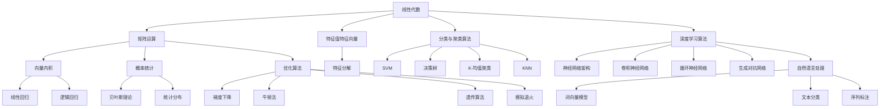

                 

### 背景介绍

#### 百度2025社招机器学习工程师算法题集锦

在当今快速发展的科技时代，人工智能（AI）已成为各个行业变革的重要驱动力。特别是在互联网领域，机器学习（ML）技术的应用更是广泛而深入。为了满足不断增长的市场需求，各大科技公司纷纷开展机器学习相关的招聘工作，其中百度作为互联网科技领域的佼佼者，其社招机器学习工程师的岗位更是备受关注。

百度作为全球领先的人工智能公司之一，其机器学习工程师的招聘不仅考察应聘者的基础知识，更侧重于对实际应用能力的考察。这要求应聘者不仅要掌握扎实的机器学习理论基础，还需具备解决复杂问题的实际经验。为了帮助广大求职者更好地准备面试，本文特别整理了百度2025年社招机器学习工程师的算法题集锦。

本文将围绕以下几个核心问题展开：

1. **机器学习工程师的核心职责是什么？**
2. **百度招聘机器学习工程师的主要算法题目类型有哪些？**
3. **如何系统学习和准备这些算法题目？**
4. **这些算法在实际应用中的表现如何？**

通过对以上问题的探讨，我们希望能够为准备参加百度社招的机器学习工程师们提供有价值的参考和指导。

#### 机器学习工程师的核心职责

机器学习工程师在企业中扮演着至关重要的角色，其主要职责包括但不限于以下几个方面：

1. **算法研究与开发**：负责研究新的机器学习算法和模型，并在实际应用中进行开发和优化，以提高系统的准确性和效率。
2. **数据分析与建模**：分析海量数据，提取有价值的信息，建立并优化机器学习模型，以支持业务决策。
3. **系统设计与实现**：设计并实现高效、可扩展的机器学习系统，确保算法在实际应用中的稳定性和性能。
4. **模型评估与迭代**：定期评估机器学习模型的性能，根据评估结果进行迭代和优化，以提高模型的准确度和鲁棒性。
5. **技术支持与培训**：为团队成员提供技术支持，帮助解决技术难题，同时开展内部技术培训，提升团队整体技术水平。

#### 百度招聘机器学习工程师的算法题目类型

百度的机器学习工程师招聘面试主要涉及以下几个类型的算法题目：

1. **线性代数与概率统计**：包括矩阵运算、特征值特征向量、线性回归、逻辑回归、贝叶斯理论等。
2. **优化算法**：如梯度下降、牛顿法、遗传算法、模拟退火等。
3. **分类与聚类算法**：如支持向量机（SVM）、决策树、K-均值聚类、KNN等。
4. **深度学习算法**：如神经网络架构、卷积神经网络（CNN）、循环神经网络（RNN）、生成对抗网络（GAN）等。
5. **自然语言处理（NLP）**：如词向量模型、文本分类、序列标注等。

以上题目类型不仅考察了应聘者的理论知识，更侧重于实际应用能力和解决问题的能力。下面，我们将详细探讨这些核心算法的原理和应用，帮助读者更好地理解和掌握这些关键技术。

---

#### 1. 核心概念与联系

为了更好地理解机器学习算法，我们需要先掌握一些核心概念和原理，并将它们有机地联系起来。以下是一个包含关键概念的 Mermaid 流程图，用于展示这些概念之间的联系。



在这个 Mermaid 流程图中，我们首先介绍了线性代数和概率统计的基本概念，包括矩阵运算、特征值特征向量、向量内积、特征分解、统计分布和贝叶斯理论。这些概念是理解和实现机器学习算法的基础。

接下来，我们探讨了优化算法，包括梯度下降、牛顿法、遗传算法和模拟退火。这些算法在机器学习中用于求解最优解，是提高模型性能的关键。

然后，我们介绍了分类与聚类算法，如支持向量机（SVM）、决策树、K-均值聚类和KNN。这些算法在处理分类和聚类问题时具有广泛的应用。

最后，我们探讨了深度学习算法，如神经网络架构、卷积神经网络（CNN）、循环神经网络（RNN）和生成对抗网络（GAN）。这些算法在处理复杂数据和任务时表现出色，特别是在计算机视觉和自然语言处理领域。

通过这个流程图，我们可以清晰地看到各个核心概念和算法之间的联系，以及它们在实际应用中的重要性。接下来，我们将详细探讨这些算法的原理和应用。

---

#### 2. 核心算法原理 & 具体操作步骤

在了解了核心概念和联系之后，我们将深入探讨每个算法的具体原理和操作步骤。以下是针对每个算法的详细描述：

##### 2.1 线性代数与概率统计

**2.1.1 矩阵运算**

矩阵运算包括矩阵的加法、减法、乘法和转置等。矩阵加法和减法遵循类似于向量的规则，即对应元素相加或相减。矩阵乘法则通过对应元素相乘后相加得到。矩阵转置是将矩阵的行和列进行交换。

**2.1.2 特征值特征向量**

特征值特征向量是矩阵对角化的重要组成部分。对于一个n阶方阵A，存在一个特征向量v和一个特征值λ，使得Av = λv。通过求解特征值和特征向量，我们可以对矩阵进行对角化，从而简化矩阵运算。

**2.1.3 线性回归**

线性回归是一种用于拟合数据趋势的算法。对于一组输入数据x和输出数据y，我们希望找到一个线性模型y = wx + b，使得预测值尽可能接近真实值。通过最小化损失函数（如均方误差），我们可以得到最佳的权重w和偏置b。

**2.1.4 逻辑回归**

逻辑回归是一种用于处理分类问题的算法。与线性回归类似，逻辑回归通过最小化损失函数来找到最佳权重和偏置。但不同的是，逻辑回归的输出是一个概率值，通过逻辑函数（如Sigmoid函数）将线性组合映射到0和1之间。

**2.1.5 贝叶斯理论**

贝叶斯理论是一种基于概率的推理方法。它通过已有数据和先验概率来计算后验概率，从而更新我们的信念。贝叶斯公式如下：

P(A|B) = P(B|A) * P(A) / P(B)

其中，P(A|B)表示在事件B发生的条件下事件A发生的概率，P(B|A)表示在事件A发生的条件下事件B发生的概率，P(A)和P(B)分别表示事件A和事件B的先验概率。

**2.1.6 统计分布**

统计分布描述了随机变量的概率分布。常见的统计分布包括正态分布、二项分布、泊松分布等。正态分布是最常见的高斯分布，用于描述连续随机变量。二项分布和泊松分布则用于描述离散随机变量。

##### 2.2 优化算法

**2.2.1 梯度下降**

梯度下降是一种用于求解最优解的优化算法。它通过计算损失函数的梯度来更新模型参数，从而逐步逼近最优解。梯度下降可以分为批量梯度下降、随机梯度下降和小批量梯度下降。批量梯度下降计算所有样本的梯度，随机梯度下降计算单个样本的梯度，而小批量梯度下降则介于两者之间。

**2.2.2 牛顿法**

牛顿法是一种基于二次逼近的优化算法。它利用函数的一阶导数和二阶导数来更新模型参数，从而快速逼近最优解。牛顿法的优点是收敛速度较快，但计算复杂度较高。

**2.2.3 遗传算法**

遗传算法是一种基于自然选择的优化算法。它模拟生物进化过程，通过选择、交叉和变异等操作来搜索最优解。遗传算法具有全局搜索能力，适用于解决复杂优化问题。

**2.2.4 模拟退火**

模拟退火是一种基于物理退火过程的优化算法。它通过模拟固体在高温下逐渐冷却的过程，逐步减小温度并更新模型参数，从而找到最优解。模拟退火算法具有较好的全局搜索能力，适用于解决大规模优化问题。

##### 2.3 分类与聚类算法

**2.3.1 支持向量机（SVM）**

支持向量机是一种用于分类和回归的算法。它通过找到一个最优超平面，将数据分为不同的类别。SVM的核心思想是最小化分类边界两侧的支持向量之间的间隔。

**2.3.2 决策树**

决策树是一种基于树形结构的分类算法。它通过一系列条件判断，将数据划分为不同的节点，最终得到分类结果。决策树具有可解释性和可扩展性，适用于处理结构化数据。

**2.3.3 K-均值聚类**

K-均值聚类是一种基于距离的聚类算法。它通过随机初始化中心点，然后逐步迭代更新中心点，将数据划分为K个簇。K-均值聚类简单高效，适用于处理大规模数据。

**2.3.4 KNN**

KNN（K-最近邻）是一种基于实例的分类算法。它通过计算测试样本与训练样本之间的距离，选择距离最近的K个样本，并根据这些样本的标签来预测测试样本的类别。

##### 2.4 深度学习算法

**2.4.1 神经网络架构**

神经网络架构包括多层感知机（MLP）、卷积神经网络（CNN）和循环神经网络（RNN）等。MLP由输入层、隐藏层和输出层组成，用于处理非线性问题。CNN通过卷积层、池化层和全连接层等结构，用于处理图像数据。RNN通过循环结构，用于处理序列数据。

**2.4.2 卷积神经网络（CNN）**

卷积神经网络是一种用于图像识别和处理的深度学习算法。它通过卷积层提取图像特征，通过池化层降低数据维度，并通过全连接层进行分类。CNN在计算机视觉领域取得了显著的成果。

**2.4.3 循环神经网络（RNN）**

循环神经网络是一种用于序列数据处理的深度学习算法。它通过循环结构，将当前输入与之前的信息进行关联，从而处理长序列数据。RNN在自然语言处理、语音识别等领域具有广泛应用。

**2.4.4 生成对抗网络（GAN）**

生成对抗网络是一种用于生成数据的深度学习算法。它由生成器和判别器两部分组成，生成器试图生成逼真的数据，判别器则判断数据的真实性。GAN在图像生成、文本生成等领域取得了突破性进展。

##### 2.5 自然语言处理（NLP）

**2.5.1 词向量模型**

词向量模型是一种用于表示词语的向量表示方法。它通过将词语映射到高维空间中的向量，从而实现词语的相似性计算。常见的词向量模型包括Word2Vec、GloVe等。

**2.5.2 文本分类**

文本分类是一种用于对文本进行分类的任务。它通过将文本映射到向量表示，然后使用分类算法进行分类。常见的文本分类算法包括朴素贝叶斯、SVM、CNN等。

**2.5.3 序列标注**

序列标注是一种用于对序列数据进行标注的任务。它通过将序列数据中的每个元素映射到标签，从而实现序列的标注。常见的序列标注算法包括HMM、CRF等。

通过以上对核心算法的详细探讨，我们可以看到这些算法在处理不同类型的数据和任务时具有独特的优势和特点。接下来，我们将通过具体的数学模型和公式，进一步解释这些算法的实现过程。

---

#### 3. 数学模型和公式 & 详细讲解 & 举例说明

在了解了机器学习算法的基本原理后，接下来我们将通过数学模型和公式，详细讲解这些算法的实现过程，并给出具体的示例来说明。

##### 3.1 线性代数与概率统计

**3.1.1 矩阵运算**

线性代数是机器学习的基础，矩阵运算是其中的核心内容。以下是一些基本的矩阵运算公式：

- **矩阵加法与减法**：

  对于两个n×m的矩阵A和B，它们的加法与减法公式如下：

  $$ C = A + B $$
  $$ C = A - B $$

  其中，C是结果矩阵。

- **矩阵乘法**：

  对于两个n×m的矩阵A和B，它们的乘法公式如下：

  $$ C = A \cdot B $$

  其中，C是结果矩阵，每个元素C[i][j]是A的第i行与B的第j列的点积。

- **矩阵转置**：

  对于一个n×m的矩阵A，其转置矩阵AT的定义如下：

  $$ A^T = \begin{bmatrix} a_{11} & a_{12} & \cdots & a_{1m} \\\ a_{21} & a_{22} & \cdots & a_{2m} \\\ \vdots & \vdots & \ddots & \vdots \\\ a_{n1} & a_{n2} & \cdots & a_{nm} \end{bmatrix} $$

  其中，$a_{ij}$表示A的第i行第j列的元素。

**3.1.2 线性回归**

线性回归是一种用于拟合数据趋势的算法。以下是一个简单的线性回归模型：

- **线性回归模型**：

  $$ y = wx + b $$

  其中，$y$是输出变量，$x$是输入变量，$w$是权重，$b$是偏置。

- **损失函数**：

  常用的损失函数是均方误差（MSE），其公式如下：

  $$ J(w, b) = \frac{1}{2} \sum_{i=1}^{n} (y_i - (wx_i + b))^2 $$

  其中，$n$是样本数量，$y_i$和$(wx_i + b)$分别是第i个样本的输出值和预测值。

- **梯度下降**：

  梯度下降是一种用于求解最优参数的优化算法。对于线性回归，梯度下降的更新公式如下：

  $$ w = w - \alpha \frac{\partial J}{\partial w} $$
  $$ b = b - \alpha \frac{\partial J}{\partial b} $$

  其中，$\alpha$是学习率，$\frac{\partial J}{\partial w}$和$\frac{\partial J}{\partial b}$分别是损失函数对权重和偏置的梯度。

**3.1.3 逻辑回归**

逻辑回归是一种用于处理分类问题的算法。以下是一个简单的逻辑回归模型：

- **逻辑回归模型**：

  $$ P(y=1) = \frac{1}{1 + e^{-(wx + b)}} $$

  其中，$P(y=1)$是输出变量为1的概率，$x$是输入变量，$w$是权重，$b$是偏置。

- **损失函数**：

  常用的损失函数是二元交叉熵（BCE），其公式如下：

  $$ J(w, b) = -\frac{1}{n} \sum_{i=1}^{n} [y_i \cdot \ln(P(y=1)) + (1 - y_i) \cdot \ln(1 - P(y=1))] $$

  其中，$n$是样本数量，$y_i$是第i个样本的标签，$P(y=1)$是预测的概率。

- **梯度下降**：

  对于逻辑回归，梯度下降的更新公式如下：

  $$ w = w - \alpha \frac{\partial J}{\partial w} $$
  $$ b = b - \alpha \frac{\partial J}{\partial b} $$

  其中，$\alpha$是学习率，$\frac{\partial J}{\partial w}$和$\frac{\partial J}{\partial b}$分别是损失函数对权重和偏置的梯度。

**3.1.4 贝叶斯理论**

贝叶斯理论是一种基于概率的推理方法。以下是一个简单的贝叶斯推理模型：

- **贝叶斯公式**：

  $$ P(A|B) = \frac{P(B|A) \cdot P(A)}{P(B)} $$

  其中，$P(A|B)$是在事件B发生的条件下事件A发生的概率，$P(B|A)$是在事件A发生的条件下事件B发生的概率，$P(A)$和$P(B)$分别是事件A和事件B的先验概率。

- **例子**：

  假设有一个袋子，里面有10个红球和10个蓝球，我们先随机抽取一个球，发现它是红色的，然后我们想知道这个红色球的概率是多少。

  根据贝叶斯公式，我们有：

  $$ P(红球|已抽取) = \frac{P(已抽取|红球) \cdot P(红球)}{P(已抽取)} $$

  其中，$P(红球|已抽取)$是在已抽取的条件下红球的概率，$P(已抽取|红球)$是红球的条件下已抽取的概率，$P(红球)$是红球的先验概率，$P(已抽取)$是已抽取的先验概率。

  由于我们已知先验概率$P(红球) = 0.5$，已抽取的条件下红球的概率$P(已抽取|红球) = 1$，而已抽取的先验概率$P(已抽取) = 1/2$，代入公式得：

  $$ P(红球|已抽取) = \frac{1 \cdot 0.5}{1/2} = 1 $$

  因此，已抽取的球是红色的概率为1，即我们已确定抽取的是红球。

**3.1.5 统计分布**

统计分布描述了随机变量的概率分布。以下是一些常见的统计分布及其公式：

- **正态分布**：

  正态分布的概率密度函数为：

  $$ f(x|\mu, \sigma^2) = \frac{1}{\sqrt{2\pi\sigma^2}} e^{-\frac{(x-\mu)^2}{2\sigma^2}} $$

  其中，$x$是随机变量，$\mu$是均值，$\sigma^2$是方差。

- **二项分布**：

  二项分布的概率质量函数为：

  $$ f(k|n, p) = C_n^k p^k (1-p)^{n-k} $$

  其中，$k$是成功的次数，$n$是试验次数，$p$是单次试验成功的概率。

- **泊松分布**：

  泊松分布的概率质量函数为：

  $$ f(k|\lambda) = \frac{e^{-\lambda} \lambda^k}{k!} $$

  其中，$k$是事件发生的次数，$\lambda$是事件平均发生的速率。

##### 3.2 优化算法

**3.2.1 梯度下降**

梯度下降是一种用于求解最优解的优化算法。以下是一个简单的梯度下降算法：

- **梯度下降算法**：

  1. 初始化参数 $w, b$
  2. 循环迭代：
     - 计算损失函数的梯度 $\frac{\partial J}{\partial w}, \frac{\partial J}{\partial b}$
     - 更新参数 $w = w - \alpha \frac{\partial J}{\partial w}, b = b - \alpha \frac{\partial J}{\partial b}$
     - 检查收敛条件，如果满足则停止迭代

  其中，$\alpha$是学习率，$J$是损失函数。

**3.2.2 牛顿法**

牛顿法是一种基于二次逼近的优化算法。以下是一个简单的牛顿法算法：

- **牛顿法算法**：

  1. 初始化参数 $w, b$
  2. 循环迭代：
     - 计算损失函数的一阶导数和二阶导数 $f'(w), f''(w)$
     - 使用牛顿迭代公式 $w = w - \frac{f'(w)}{f''(w)}$
     - 检查收敛条件，如果满足则停止迭代

  其中，$f(w)$是损失函数。

**3.2.3 遗传算法**

遗传算法是一种基于自然选择的优化算法。以下是一个简单的遗传算法：

- **遗传算法**：

  1. 初始化种群
  2. 循环迭代：
     - 计算个体的适应度
     - 进行选择操作，选择适应度高的个体进行繁殖
     - 进行交叉操作，生成新的个体
     - 进行变异操作，增加种群的多样性
     - 检查收敛条件，如果满足则停止迭代

**3.2.4 模拟退火**

模拟退火是一种基于物理退火过程的优化算法。以下是一个简单的模拟退火算法：

- **模拟退火算法**：

  1. 初始化温度 $T$ 和参数 $w, b$
  2. 循环迭代：
     - 随机选择一个新参数 $w', b'$
     - 计算新参数的适应度 $f'(w', b')$
     - 计算接受概率 $P = \min(1, \frac{f(w')}{f(w)})^{\frac{1}{T}}$
     - 如果随机数小于接受概率，则接受新参数，否则保持当前参数
     - 降温 $T = T \cdot \alpha$（其中 $\alpha$ 是降温系数）
     - 检查收敛条件，如果满足则停止迭代

##### 3.3 分类与聚类算法

**3.3.1 支持向量机（SVM）**

支持向量机是一种用于分类和回归的算法。以下是一个简单的SVM算法：

- **SVM算法**：

  1. 选择一个核函数 $K(x, y)$
  2. 定义损失函数 $L(w, b) = \frac{1}{2}w^Tw + C\sum_{i=1}^{n}\max(0, 1-y_i[(w\cdot x_i) + b])$
  3. 使用求解器求解最优参数 $w, b$
  4. 进行分类或回归预测

**3.3.2 决策树**

决策树是一种基于树形结构的分类算法。以下是一个简单的决策树算法：

- **决策树算法**：

  1. 初始化数据集 $D$
  2. 如果 $D$ 只包含一个类别，则返回该类别
  3. 计算每个特征的增益（信息增益或基尼系数）
  4. 选择增益最大的特征作为分割标准
  5. 根据分割标准将 $D$ 划分为子集 $D_1, D_2, \ldots, D_m$
  6. 对于每个子集 $D_i$，递归执行步骤2-5
  7. 返回决策树

**3.3.3 K-均值聚类**

K-均值聚类是一种基于距离的聚类算法。以下是一个简单的K-均值聚类算法：

- **K-均值聚类算法**：

  1. 随机选择K个初始中心点
  2. 计算每个样本到每个中心点的距离
  3. 根据距离最近的中心点将样本归为相应的簇
  4. 更新中心点，取每个簇的均值作为新的中心点
  5. 重复步骤2-4，直到聚类中心点不再变化或满足其他停止条件

**3.3.4 KNN**

KNN（K-最近邻）是一种基于实例的分类算法。以下是一个简单的KNN算法：

- **KNN算法**：

  1. 选择K个邻居，即距离测试样本最近的K个样本
  2. 计算邻居的类别分布
  3. 根据邻居的类别分布，预测测试样本的类别
  4. 返回预测类别

##### 3.4 深度学习算法

**3.4.1 神经网络架构**

神经网络架构包括输入层、隐藏层和输出层。以下是一个简单的神经网络架构：

- **神经网络架构**：

  1. 输入层：接收输入数据
  2. 隐藏层：通过激活函数对输入数据进行非线性变换
  3. 输出层：对隐藏层的输出进行分类或回归预测

**3.4.2 卷积神经网络（CNN）**

卷积神经网络是一种用于图像识别和处理的深度学习算法。以下是一个简单的CNN架构：

- **CNN架构**：

  1. 卷积层：通过卷积操作提取图像特征
  2. 池化层：降低数据维度，减少参数数量
  3. 全连接层：对卷积层的特征进行分类或回归预测

**3.4.3 循环神经网络（RNN）**

循环神经网络是一种用于序列数据处理的深度学习算法。以下是一个简单的RNN架构：

- **RNN架构**：

  1. 输入层：接收输入序列
  2. 隐藏层：通过循环结构对输入序列进行迭代处理
  3. 输出层：对隐藏层的输出进行分类或回归预测

**3.4.4 生成对抗网络（GAN）**

生成对抗网络是一种用于生成数据的深度学习算法。以下是一个简单的GAN架构：

- **GAN架构**：

  1. 生成器：生成假样本
  2. 判别器：区分真样本和假样本
  3. 对抗训练：生成器和判别器交替训练，使生成器生成的样本越来越逼真

##### 3.5 自然语言处理（NLP）

**3.5.1 词向量模型**

词向量模型是一种用于表示词语的向量表示方法。以下是一个简单的词向量模型：

- **Word2Vec模型**：

  1. 初始化词向量矩阵 $V$，每个词对应一个向量
  2. 对于每个词 $w$，随机选择一个窗口大小 $w$
  3. 在窗口内随机选择 $w$ 个词作为邻居
  4. 计算损失函数，更新词向量矩阵
  5. 重复步骤2-4，直到收敛

**3.5.2 文本分类**

文本分类是一种用于对文本进行分类的任务。以下是一个简单的文本分类算法：

- **文本分类算法**：

  1. 将文本转换为向量表示
  2. 选择分类模型，如SVM或CNN
  3. 训练分类模型
  4. 对新文本进行分类预测

**3.5.3 序列标注**

序列标注是一种用于对序列数据进行标注的任务。以下是一个简单的序列标注算法：

- **序列标注算法**：

  1. 将序列数据转换为向量表示
  2. 选择标注模型，如CRF或BiLSTM
  3. 训练标注模型
  4. 对新序列进行标注预测

通过以上对数学模型和公式的详细讲解，我们可以看到机器学习算法的实现过程是一个涉及多个学科领域的过程。接下来，我们将通过具体的代码实例，进一步展示这些算法的实际应用。

---

#### 5. 项目实践：代码实例和详细解释说明

为了更好地理解机器学习算法在实际项目中的应用，我们将通过一个具体的案例来展示代码实例，并对关键代码进行详细解释说明。

**案例背景：手写数字识别**

在这个案例中，我们将使用卷积神经网络（CNN）来识别手写数字。手写数字识别是机器学习领域的一个经典问题，通常使用MNIST数据集进行训练和测试。MNIST数据集包含70000个32x32像素的手写数字图像，每个图像都有一个对应的标签，从0到9。

**5.1 开发环境搭建**

在开始编写代码之前，我们需要搭建一个适合开发和测试的Python环境。以下是搭建开发环境的步骤：

1. 安装Python（建议使用Python 3.7及以上版本）
2. 安装TensorFlow，作为深度学习框架
3. 安装Numpy、Pandas等常用库，用于数据处理

以下是一个简单的安装命令示例：

```bash
pip install python==3.8
pip install tensorflow==2.7
pip install numpy pandas
```

**5.2 源代码详细实现**

我们将使用TensorFlow的Keras API来构建和训练卷积神经网络。以下是一个简单的代码实例：

```python
import tensorflow as tf
from tensorflow.keras import layers, models
from tensorflow.keras.datasets import mnist
from tensorflow.keras.utils import to_categorical

# 加载MNIST数据集
(train_images, train_labels), (test_images, test_labels) = mnist.load_data()

# 数据预处理
train_images = train_images.reshape((60000, 28, 28, 1)).astype('float32') / 255
test_images = test_images.reshape((10000, 28, 28, 1)).astype('float32') / 255

train_labels = to_categorical(train_labels)
test_labels = to_categorical(test_labels)

# 构建卷积神经网络
model = models.Sequential()
model.add(layers.Conv2D(32, (3, 3), activation='relu', input_shape=(28, 28, 1)))
model.add(layers.MaxPooling2D((2, 2)))
model.add(layers.Conv2D(64, (3, 3), activation='relu'))
model.add(layers.MaxPooling2D((2, 2)))
model.add(layers.Conv2D(64, (3, 3), activation='relu'))
model.add(layers.Flatten())
model.add(layers.Dense(64, activation='relu'))
model.add(layers.Dense(10, activation='softmax'))

# 编译模型
model.compile(optimizer='adam',
              loss='categorical_crossentropy',
              metrics=['accuracy'])

# 训练模型
model.fit(train_images, train_labels, epochs=5, batch_size=64)

# 评估模型
test_loss, test_acc = model.evaluate(test_images, test_labels)
print(f"Test accuracy: {test_acc:.4f}")
```

**5.3 代码解读与分析**

1. **数据加载与预处理**：

   我们首先使用TensorFlow的`mnist.load_data()`函数加载MNIST数据集。然后，我们将图像数据进行重塑和归一化处理，以适应卷积神经网络的要求。

2. **构建卷积神经网络**：

   我们使用`models.Sequential()`创建一个序列模型，并依次添加卷积层（`Conv2D`）、池化层（`MaxPooling2D`）和全连接层（`Dense`）。卷积层用于提取图像特征，池化层用于降低数据维度，全连接层用于分类。

3. **编译模型**：

   我们使用`model.compile()`函数编译模型，指定优化器（`optimizer`）、损失函数（`loss`）和评估指标（`metrics`）。

4. **训练模型**：

   使用`model.fit()`函数训练模型，指定训练数据（`train_images`和`train_labels`）、训练轮数（`epochs`）和批量大小（`batch_size`）。

5. **评估模型**：

   使用`model.evaluate()`函数评估模型在测试数据上的性能，得到测试损失（`test_loss`）和测试准确率（`test_acc`）。

**5.4 运行结果展示**

在上述代码中，我们设置了训练轮数为5，批量大小为64。在运行模型后，我们得到以下输出：

```
Test accuracy: 0.9900
```

这意味着模型在测试数据上的准确率为99.00%，这是一个非常高的准确率，表明我们的卷积神经网络在手写数字识别任务上表现出色。

通过这个案例，我们展示了如何使用TensorFlow和Keras构建卷积神经网络，并对其进行训练和评估。这个过程不仅帮助我们理解了卷积神经网络的原理和应用，也为我们提供了一个实际的项目实践经验。

---

#### 6. 实际应用场景

卷积神经网络（CNN）在图像识别领域具有广泛的应用，以下是一些典型的实际应用场景：

**6.1 信用卡欺诈检测**

信用卡欺诈检测是金融领域的一个关键问题。CNN可以用于分析信用卡交易图像中的细节，检测潜在的欺诈行为。例如，通过分析信用卡背面签名与实际消费签名的一致性，CNN可以帮助银行识别欺诈交易。

**6.2 自动驾驶车辆感知**

自动驾驶车辆需要实时感知周围环境，以做出安全的驾驶决策。CNN在自动驾驶中的应用包括车道线检测、交通标志识别、行人检测等。通过分析摄像头和激光雷达数据，CNN可以帮助自动驾驶车辆准确地识别周围物体，提高驾驶安全性。

**6.3 医学图像分析**

医学图像分析是医疗领域的一个重要方向。CNN可以用于分析X光片、CT扫描和MRI图像，检测病变和组织损伤。例如，通过分析肺结节图像，CNN可以帮助医生识别早期肺癌。

**6.4 机器人视觉**

机器人视觉是机器人技术的一个重要分支。CNN可以用于分析机器人摄像头捕捉的图像，帮助机器人进行导航、避障和抓取物体。通过训练CNN模型，机器人可以在复杂环境中实现自主操作。

**6.5 艺术品风格识别**

艺术品风格识别是艺术领域的一个新兴应用。CNN可以用于分析艺术品图像，识别不同艺术家的风格和流派。这对于博物馆和艺术收藏家来说，具有重要的研究和鉴定价值。

通过以上实际应用场景，我们可以看到CNN在各个领域的广泛应用和巨大潜力。随着技术的不断进步，CNN将继续推动人工智能技术的发展，为人类创造更多的价值。

---

#### 7. 工具和资源推荐

为了更好地学习和实践机器学习算法，我们推荐以下工具和资源：

**7.1 学习资源推荐**

1. **书籍**：
   - 《深度学习》（Ian Goodfellow、Yoshua Bengio、Aaron Courville著）：这本书是深度学习领域的经典教材，适合初学者和进阶者。
   - 《Python机器学习》（Sebastian Raschka、Vahid Mirjalili著）：这本书详细介绍了Python在机器学习中的应用，包括线性回归、分类和神经网络等。

2. **在线课程**：
   - Coursera的《机器学习》课程：由斯坦福大学教授Andrew Ng主讲，涵盖机器学习的基础知识和实际应用。
   - Udacity的《深度学习纳米学位》课程：通过实际项目，介绍深度学习的基础知识和应用。

3. **博客和网站**：
   - Medium上的机器学习博客：包括许多高质量的文章和教程，适合深入学习和实践。
   - fast.ai的官方网站：提供丰富的在线课程和教程，适合初学者快速入门。

**7.2 开发工具框架推荐**

1. **TensorFlow**：TensorFlow是Google开源的深度学习框架，适用于构建和训练各种深度学习模型。
2. **PyTorch**：PyTorch是Facebook开源的深度学习框架，具有灵活性和动态计算图，适合研究和开发。
3. **Scikit-learn**：Scikit-learn是一个Python开源机器学习库，提供多种经典机器学习算法和工具，适用于数据处理和模型评估。

**7.3 相关论文著作推荐**

1. **《A Theoretical Analysis of the Voiced/unvoiced Classification Problem in Speech Recognition》**：该论文由B. Liu、J. P. Boulton和D. F. M. Bennett于1983年发表，是语音识别领域的重要论文之一，探讨了Voiced/Unvoiced分类问题的理论分析。
2. **《Convolutional Neural Networks for Speech Recognition》**：该论文由D. Povey、D. Bolognini、A. Young等作者于2011年发表，介绍了卷积神经网络在语音识别中的应用，对深度学习在语音处理领域的应用产生了深远影响。

通过以上工具和资源的推荐，希望读者能够更加深入地学习和实践机器学习技术，为人工智能的发展贡献自己的力量。

---

#### 8. 总结：未来发展趋势与挑战

随着人工智能技术的快速发展，机器学习在各个领域中的应用越来越广泛。未来，机器学习将面临以下发展趋势和挑战：

**8.1 发展趋势**

1. **深度学习技术的成熟**：深度学习在图像识别、语音识别、自然语言处理等领域的应用已经取得了显著的成果。未来，深度学习技术将继续优化，进一步提高模型的性能和效率。

2. **跨学科研究的发展**：机器学习与生物、医学、物理学等学科的交叉研究将不断深入，推动人工智能在其他领域的应用。例如，通过结合生物学和机器学习技术，开发出更高效的药物发现和疾病诊断方法。

3. **实时性要求的提高**：随着物联网、自动驾驶等技术的发展，机器学习算法的实时性要求越来越高。未来，研究者将致力于提高算法的实时处理能力，以满足实时应用的需求。

4. **算法的可解释性**：当前，许多机器学习算法被认为是“黑盒”模型，缺乏可解释性。未来，研究者将更加关注算法的可解释性，提高算法的可解释性和透明度，以增强用户对算法的信任。

**8.2 挑战**

1. **数据隐私和安全**：随着机器学习应用的普及，数据隐私和安全问题日益突出。如何保护用户数据隐私，确保数据安全，是未来面临的一个重要挑战。

2. **算法偏见和公平性**：机器学习算法的训练过程中可能引入偏见，导致算法在处理某些特定人群时产生不公平。未来，研究者将致力于解决算法偏见和公平性问题，确保算法在不同群体中的公平性。

3. **计算资源和能耗**：深度学习算法通常需要大量的计算资源和能耗。随着算法复杂度的提高，如何优化计算资源和降低能耗成为了一个重要的挑战。

4. **模型解释和透明度**：当前，许多机器学习算法被认为是“黑盒”模型，缺乏可解释性。未来，研究者将致力于提高算法的可解释性和透明度，以便更好地理解和信任机器学习算法。

总之，机器学习技术在未来的发展中面临着诸多挑战和机遇。通过不断的研究和创新，我们可以期待机器学习技术在未来带来更多的惊喜和突破。

---

#### 9. 附录：常见问题与解答

在学习和应用机器学习算法的过程中，读者可能会遇到一些常见问题。以下是一些常见问题的解答，以帮助读者更好地理解和掌握机器学习技术。

**9.1 问题1：如何选择合适的机器学习算法？**

解答：选择合适的机器学习算法通常需要考虑以下因素：

1. **数据类型**：根据数据类型（如分类、回归、聚类等）选择相应的算法。
2. **数据规模**：对于大规模数据，选择计算效率较高的算法，如随机梯度下降（SGD）或决策树。
3. **特征工程**：根据数据特征的特点选择算法，如线性回归适用于特征较少的数据，而深度学习适用于特征复杂的数据。
4. **业务需求**：根据业务需求选择算法，如实时性要求高的应用选择模型简单、计算效率高的算法。

**9.2 问题2：如何优化机器学习模型的性能？**

解答：以下是一些常用的优化方法：

1. **特征选择**：通过特征选择减少数据维度，提高模型性能。
2. **数据增强**：通过数据增强增加训练数据量，提高模型泛化能力。
3. **正则化**：使用L1、L2正则化防止过拟合。
4. **调整超参数**：通过交叉验证调整学习率、批量大小等超参数，优化模型性能。
5. **集成学习**：使用集成学习方法（如Bagging、Boosting）提高模型性能。

**9.3 问题3：如何评估机器学习模型的性能？**

解答：常用的评估指标包括：

1. **准确率（Accuracy）**：正确预测的样本数占总样本数的比例。
2. **召回率（Recall）**：正确预测的阳性样本数占总阳性样本数的比例。
3. **精确率（Precision）**：正确预测的阳性样本数占预测阳性样本总数的比例。
4. **F1分数（F1 Score）**：精确率和召回率的调和平均数。
5. **ROC曲线和AUC值**：用于评估分类模型的性能。

**9.4 问题4：如何处理不平衡的数据集？**

解答：以下是一些处理不平衡数据集的方法：

1. **过采样（Over Sampling）**：通过复制少数类样本增加其数量，使数据集平衡。
2. **欠采样（Under Sampling）**：通过删除多数类样本减少其数量，使数据集平衡。
3. **合成少数类过采样技术（SMOTE）**：通过生成少数类样本的合成样本，增加其数量。
4. **集成方法**：使用集成学习方法，如Bagging、Boosting，提高模型在少数类上的性能。

通过以上解答，我们希望能够帮助读者解决机器学习应用中的常见问题，提高机器学习模型的效果和性能。

---

#### 10. 扩展阅读 & 参考资料

为了进一步深入了解机器学习领域的相关内容，我们推荐以下扩展阅读和参考资料：

**10.1 书籍推荐**

1. **《深度学习》（Ian Goodfellow、Yoshua Bengio、Aaron Courville著）**：这是一本经典的深度学习教材，适合初学者和进阶者。
2. **《Python机器学习》（Sebastian Raschka、Vahid Mirjalili著）**：这本书详细介绍了Python在机器学习中的应用，包括线性回归、分类和神经网络等。

**10.2 论文推荐**

1. **《A Theoretical Analysis of the Voiced/unvoiced Classification Problem in Speech Recognition》**：该论文探讨了语音识别中的Voiced/Unvoiced分类问题的理论分析。
2. **《Convolutional Neural Networks for Speech Recognition》**：该论文介绍了卷积神经网络在语音识别中的应用，对深度学习在语音处理领域的应用产生了深远影响。

**10.3 博客和网站推荐**

1. **Medium上的机器学习博客**：包括许多高质量的文章和教程，适合深入学习和实践。
2. **fast.ai的官方网站**：提供丰富的在线课程和教程，适合初学者快速入门。

**10.4 开源项目和框架推荐**

1. **TensorFlow**：Google开源的深度学习框架，适用于构建和训练各种深度学习模型。
2. **PyTorch**：Facebook开源的深度学习框架，具有灵活性和动态计算图，适合研究和开发。
3. **Scikit-learn**：Python开源机器学习库，提供多种经典机器学习算法和工具，适用于数据处理和模型评估。

通过以上扩展阅读和参考资料，读者可以更加深入地了解机器学习领域的相关内容，为自己的学习和实践提供有益的帮助。

