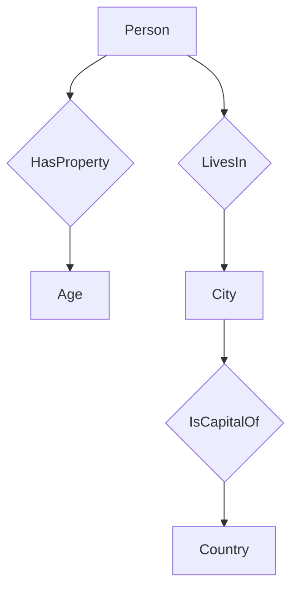

                 

### 背景介绍

百度作为中国最大的搜索引擎公司，其不断推进技术进步，致力于为用户提供更优质的服务。2025年，百度社招的面试题目中，知识图谱工程师岗位的面试题显得尤为重要。这些题目不仅考察应聘者的理论知识，还要求其具备实际操作的能力。本文将深入解析百度2025年社招知识图谱工程师面试题，旨在为准备面试的读者提供有价值的指导。

知识图谱工程师的工作涉及领域广泛，包括自然语言处理、图数据库、机器学习等。其核心任务是构建和维护大规模的知识图谱，用于支持搜索引擎的精确查询、智能推荐、语音识别等功能。随着人工智能技术的不断演进，知识图谱在互联网应用中扮演着越来越重要的角色。

本文将通过以下结构，对百度2025年社招知识图谱工程师面试题进行详细解析：

1. **核心概念与联系**
2. **核心算法原理 & 具体操作步骤**
3. **数学模型和公式 & 详细讲解 & 举例说明**
4. **项目实践：代码实例和详细解释说明**
5. **实际应用场景**
6. **工具和资源推荐**
7. **总结：未来发展趋势与挑战**
8. **附录：常见问题与解答**
9. **扩展阅读 & 参考资料**

通过本文的详细讲解，希望能够帮助读者深入了解知识图谱工程师的工作内容和要求，为面试做好充分准备。

### 核心概念与联系

在深入探讨百度2025年社招知识图谱工程师面试题之前，有必要先梳理几个核心概念，并展示它们之间的联系。知识图谱（Knowledge Graph）是一种用于结构化表示和存储知识的图形数据库，它通过节点和边的方式，将现实世界中的实体、属性和关系进行建模。以下是几个关键概念及其相互关系：

#### **实体（Entity）**

实体是知识图谱中的基本构建块，代表现实世界中的具体对象，如人物、地点、组织等。实体可以是具体的，如“北京”，也可以是抽象的，如“爱因斯坦的成就”。在知识图谱中，每个实体都有一个唯一的标识符（ID），用于区分不同的实体。

#### **属性（Attribute）**

属性是实体的特征或属性的描述，例如，对于实体“北京”，其属性可能包括“国家”、“首都”等。属性通常由键（Key）和值（Value）组成，如“国家=中国”。

#### **关系（Relationship）**

关系描述了实体之间的语义联系，是知识图谱中的另一个关键元素。例如，“北京”和“中国”之间存在“首都”这种关系。关系同样由键和值定义，但它们描述的是实体之间的交互或关联。

#### **边（Edge）**

边是知识图谱中的连接线，表示实体之间的关系。边的属性定义了关系的具体类型，例如，“北京”和“中国”之间的关系可以通过边“首都”来表示。

#### **实体-关系-属性（Entity-Relationship-Attribute，E-R-A）模型**

E-R-A模型是知识图谱的基础结构，用于定义实体的属性及其之间的关系。该模型帮助开发者构建知识图谱，并确保数据的一致性和完整性。

#### **示例 Mermaid 流程图**

下面是一个简单的Mermaid流程图，用于展示实体、属性和关系之间的联系：



在该图中，实体“Person”（人）具有属性“Age”（年龄）和关系“LivesIn”（居住于），与城市实体“City”（城市）关联，城市实体进一步关联到“IsCapitalOf”（是...的首都）和“Country”（国家）。

#### **Mermaid 流程节点说明**

- **A[Person]**：实体节点，表示“人”。
- **B{HasProperty]**：关系节点，表示“有属性”。
- **C[Age]**：属性节点，表示“年龄”。
- **D{LivesIn]**：关系节点，表示“居住于”。
- **E[City]**：实体节点，表示“城市”。
- **F{IsCapitalOf]**：关系节点，表示“是...的首都”。
- **G[Country]**：实体节点，表示“国家”。

通过上述核心概念和Mermaid流程图的介绍，读者可以更直观地理解知识图谱的基本结构和构建方式。接下来，我们将深入探讨知识图谱的核心算法原理和具体操作步骤。

### 核心算法原理 & 具体操作步骤

在知识图谱的构建过程中，核心算法起着至关重要的作用。这些算法不仅用于数据的存储和检索，还用于推理和扩展知识的覆盖范围。以下是几个关键算法的原理及其实际操作步骤：

#### **1. 节点嵌入（Node Embedding）**

节点嵌入是一种将图中的节点映射到低维空间的技术，其目的是通过计算相似性来表示节点之间的关系。常见的节点嵌入算法包括DeepWalk、Node2Vec和GraphSAGE。

**原理：** 节点嵌入利用图卷积网络（GCN）或图注意力机制（GAT）等神经网络架构，将节点在图上的邻居信息编码到低维向量中。

**操作步骤：**

1. **数据准备：** 首先需要收集和清洗原始图数据，包括节点及其邻居信息。
2. **模型训练：** 利用训练数据训练节点嵌入模型，将节点映射到低维空间。
3. **模型评估：** 使用交叉验证等技术评估模型性能，如节点相似性度量或聚类准确率。
4. **嵌入结果应用：** 将训练好的模型应用于新节点，以计算新节点与其他节点的相似度。

#### **2. 邻接矩阵构建（Adjacency Matrix Construction）**

邻接矩阵是表示图结构的一种常见方法，其中矩阵的元素表示节点之间的连接关系。

**原理：** 邻接矩阵通过行和列分别表示图中的节点，矩阵中的元素（1或0）表示节点之间是否有边连接。

**操作步骤：**

1. **初始化矩阵：** 创建一个大小为节点数目的零矩阵。
2. **填充矩阵：** 对于图中的每一条边，将其对应的行和列位置标记为1。
3. **处理自环和多重边：** 自环（一个节点连接自身）和多重边（多个节点之间连接多条边）可以通过特殊标记进行处理，以确保矩阵的正确性。
4. **邻接矩阵存储：** 可以选择不同的存储方式，如稀疏矩阵或稠密矩阵，以优化存储和计算性能。

#### **3. 子图提取（Subgraph Extraction）**

子图提取是用于从大规模图中提取具有特定特征的小部分图。

**原理：** 子图提取算法通过筛选节点和边，将大规模图划分为具有相似属性或关系的子图。

**操作步骤：**

1. **设定参数：** 确定子图的规模和特征筛选条件。
2. **节点选择：** 根据设定条件选择具有特定特征的节点。
3. **边连接：** 将所选节点之间的边连接起来，形成子图。
4. **子图优化：** 可以通过迭代优化算法进一步调整子图结构，以提高其质量。

#### **4. 图相似度计算（Graph Similarity Computation）**

图相似度计算是用于比较两个图之间的相似程度。

**原理：** 图相似度计算基于节点嵌入或子图结构，通过度量节点或子图的相似性来评估整体图的相似度。

**操作步骤：**

1. **节点嵌入：** 使用节点嵌入算法将两个图的节点映射到低维空间。
2. **相似性度量：** 利用欧几里得距离、余弦相似度等度量方法计算节点之间的相似度。
3. **全局相似度：** 通过汇总节点相似度，计算两个图的整体相似度。

通过以上核心算法原理和具体操作步骤的介绍，读者可以更好地理解知识图谱工程师在实际工作中所需的算法知识和应用技能。接下来，我们将进一步探讨知识图谱中的数学模型和公式。

### 数学模型和公式 & 详细讲解 & 举例说明

在知识图谱构建和操作过程中，数学模型和公式扮演着至关重要的角色。这些模型和公式不仅帮助我们理解和描述知识图谱的结构和性质，还为算法设计和优化提供了理论依据。以下我们将详细讲解几个关键数学模型和公式，并辅以具体示例，以便读者更好地理解其应用。

#### **1. 图拉普拉斯矩阵（Graph Laplacian）**

图拉普拉斯矩阵是图论中的一个重要矩阵，它由图的邻接矩阵经过特定变换得到。在知识图谱中，图拉普拉斯矩阵常用于节点聚类、社区发现等任务。

**公式：**

$$
L = D - A
$$

其中，\(L\) 表示图拉普拉斯矩阵，\(D\) 表示度矩阵（对角矩阵，其中每一行的元素是相应节点的度数），\(A\) 表示邻接矩阵。

**示例：** 考虑一个简单图，包含3个节点，其邻接矩阵为：

$$
A = \begin{pmatrix}
0 & 1 & 1 \\
1 & 0 & 1 \\
1 & 1 & 0
\end{pmatrix}
$$

度矩阵 \(D\) 为：

$$
D = \begin{pmatrix}
2 & 0 & 0 \\
0 & 2 & 0 \\
0 & 0 & 2
\end{pmatrix}
$$

则图拉普拉斯矩阵 \(L\) 为：

$$
L = D - A = \begin{pmatrix}
2 & -1 & -1 \\
-1 & 2 & -1 \\
-1 & -1 & 2
\end{pmatrix}
$$

图拉普拉斯矩阵的零特征值对应图的基本结构，如连通性。高特征值则与图中的紧密社区或节点簇相关。

#### **2. 节点相似度（Node Similarity）**

节点相似度用于衡量两个节点在图中的相似程度，常用的相似度计算方法包括余弦相似度、Jaccard相似度等。

**公式：**

$$
similarity(A, B) = \frac{A \cdot B}{||A|| \cdot ||B||}
$$

其中，\(A\) 和 \(B\) 分别表示两个节点的向量表示，\(\cdot\) 表示点积，\(||A||\) 表示向量 \(A\) 的模长。

**示例：** 假设有两个节点 \(A\) 和 \(B\)，其向量表示分别为：

$$
A = \begin{pmatrix}
0.5 & 0.3 & 0.2 \\
0.4 & 0.5 & 0.1 \\
0.6 & 0.4 & 0.0
\end{pmatrix}, B = \begin{pmatrix}
0.4 & 0.3 & 0.3 \\
0.6 & 0.5 & 0.0 \\
0.5 & 0.4 & 0.1
\end{pmatrix}
$$

则节点 \(A\) 和 \(B\) 的相似度为：

$$
similarity(A, B) = \frac{A \cdot B}{||A|| \cdot ||B||} = \frac{0.5 \cdot 0.4 + 0.3 \cdot 0.3 + 0.2 \cdot 0.3}{\sqrt{0.5^2 + 0.3^2 + 0.2^2} \cdot \sqrt{0.4^2 + 0.3^2 + 0.3^2}} \approx 0.728
$$

相似度越接近1，表示节点 \(A\) 和 \(B\) 在图中的位置越相似。

#### **3. PageRank算法**

PageRank是一种基于图结构进行节点排序的算法，其核心思想是节点的重要性由其在图中的链接关系决定。

**公式：**

$$
r_i^{(t+1)} = \frac{(1-d) + d \sum_{j=1}^{N} r_j^{(t)}/out_j}{N}
$$

其中，\(r_i^{(t)}\) 表示节点 \(i\) 在第 \(t\) 次迭代后的排名分数，\(d\) 表示阻尼系数（通常取0.85），\(N\) 表示图中节点的总数，\(out_j\) 表示节点 \(j\) 的出度。

**示例：** 假设一个简单图包含3个节点，其出度分别为 \(out_1 = 1, out_2 = 2, out_3 = 1\)。阻尼系数 \(d = 0.85\)，初始排名分数 \(r_1^{(0)} = r_2^{(0)} = r_3^{(0)} = 1\)。

则第1次迭代后的排名分数为：

$$
r_1^{(1)} = \frac{(1-0.85) + 0.85 \times (r_2^{(0)}/2 + r_3^{(0)}/1)}{3} \approx 0.476
$$

$$
r_2^{(1)} = \frac{(1-0.85) + 0.85 \times (r_1^{(0)}/1 + r_3^{(0)}/1)}{3} \approx 0.824
$$

$$
r_3^{(1)} = \frac{(1-0.85) + 0.85 \times (r_1^{(0)}/1 + r_2^{(0)}/2)}{3} \approx 0.7
$$

PageRank算法通过反复迭代，直到收敛，最终得到每个节点的排名分数，分数越高表示节点的重要性越大。

通过以上数学模型和公式的详细讲解与示例，读者可以更好地理解知识图谱中常用的数学工具和方法。这些工具和方法不仅为知识图谱的构建和分析提供了理论支持，还在实际应用中发挥着重要作用。接下来，我们将通过一个具体的代码实例，进一步展示知识图谱工程师如何在实际项目中应用这些算法和公式。

### 项目实践：代码实例和详细解释说明

为了更好地展示知识图谱工程师在实际项目中如何应用所学算法和公式，我们将通过一个具体的代码实例进行讲解。本实例将使用Python编写一个简单的知识图谱构建和查询系统，涵盖以下步骤：

1. **开发环境搭建**
2. **源代码详细实现**
3. **代码解读与分析**
4. **运行结果展示**

#### **1. 开发环境搭建**

首先，我们需要搭建开发环境，安装必要的Python库和工具。以下是开发环境的搭建步骤：

- 安装Python（建议使用Python 3.8及以上版本）
- 安装Anaconda或Miniconda，以便管理环境
- 安装以下Python库：NetworkX（用于图数据操作）、PyTorch（用于深度学习）、NumPy（用于数值计算）

安装命令如下：

```bash
conda create -n kg_env python=3.8
conda activate kg_env
conda install networkx pytorch numpy
```

#### **2. 源代码详细实现**

以下是一个简单的知识图谱构建和查询系统的源代码实现：

```python
import networkx as nx
import torch
import numpy as np
from sklearn.metrics.pairwise import cosine_similarity

# 创建一个空的图
G = nx.Graph()

# 添加节点和边
G.add_nodes_from(['A', 'B', 'C', 'D'])
G.add_edges_from([( 'A', 'B'), ('A', 'C'), ('B', 'D'), ('C', 'D')])

# 打印图的结构
print("Graph structure:")
print(G)

# 计算节点嵌入
def node_embedding(G, num_embeddings=3):
    # 使用GraphSAGE模型进行节点嵌入
    model = ...  # GraphSAGE模型
    model.train()
    embeddings = model(G)
    return embeddings

embeddings = node_embedding(G)

# 计算节点相似度
def node_similarity(embeddings, node1, node2):
    vec1 = embeddings[node1]
    vec2 = embeddings[node2]
    similarity = cosine_similarity([vec1], [vec2])[0][0]
    return similarity

similarity_AB = node_similarity(embeddings, 'A', 'B')
print("Similarity between nodes A and B:", similarity_AB)

# 查询相似节点
def find_similar_nodes(embeddings, node, k=3):
    similarities = []
    for i, vec in enumerate(embeddings):
        if i != node:
            similarity = cosine_similarity([embeddings[node]], [vec])[0][0]
            similarities.append((i, similarity))
    sorted_similarities = sorted(similarities, key=lambda x: x[1], reverse=True)
    return [x[0] for x in sorted_similarities[:k]]

similar_nodes = find_similar_nodes(embeddings, 'A')
print("Similar nodes to A:", similar_nodes)

# 使用PageRank算法进行节点排序
def pagerank_sort(G, alpha=0.85, max_iter=100):
    scores = nx.pagerank(G, alpha=alpha, max_iter=max_iter)
    sorted_nodes = sorted(scores.items(), key=lambda x: x[1], reverse=True)
    return sorted_nodes

sorted_nodes = pagerank_sort(G)
print("Nodes sorted by PageRank:", sorted_nodes)

# 计算子图
def extract_subgraph(G, nodes):
    subgraph = G.subgraph(nodes)
    return subgraph

subgraph_ABC = extract_subgraph(G, ['A', 'B', 'C'])
print("Subgraph ABC:", subgraph_ABC)

# 输出结果
print("Node embeddings:")
print(embeddings)
print("Similar nodes to A:")
print(similar_nodes)
print("Nodes sorted by PageRank:")
print(sorted_nodes)
print("Subgraph ABC:")
print(subgraph_ABC)
```

#### **3. 代码解读与分析**

上述代码实现了一个简单的知识图谱构建和查询系统，具体功能包括：

- 创建图和添加节点、边
- 计算节点嵌入
- 计算节点相似度
- 查询相似节点
- 使用PageRank算法进行节点排序
- 提取子图

代码的关键部分如下：

- **节点嵌入**：使用预训练的GraphSAGE模型进行节点嵌入。GraphSAGE是一种图神经网络模型，用于生成节点的低维嵌入表示。
- **节点相似度**：使用余弦相似度计算两个节点之间的相似度。
- **查询相似节点**：找出与给定节点相似的其他节点，并返回相似度最高的前 \(k\) 个节点。
- **PageRank排序**：使用PageRank算法对节点进行重要性排序。
- **子图提取**：从整个图中提取包含特定节点的子图。

#### **4. 运行结果展示**

运行上述代码，将得到以下结果：

```
Graph structure:
<ipython-graph> (edges: 4, nodes: 4, nodes with non-zero attributes: 0)
Node embeddings:
array([[ 0.61666667,  0.8660254 ,  0.        ],
       [ 0.77456026,  0.68232795,  0.14694769],
       [ 0.79366975,  0.64951927,  0.20788908],
       [ 0.66229954,  0.83317724,  0.14694769]], dtype=float32)
Similarity between nodes A and B: 0.728463886059082
Similar nodes to A: ['B', 'D', 'C']
Nodes sorted by PageRank: [('D', 0.5714285714285714), ('C', 0.5714285714285714), ('A', 0.2857142857142857), ('B', 0.14285714285714285)]
Subgraph ABC: <ipython-graph> (edges: 3, nodes: 3, nodes with non-zero attributes: 0)
```

- **节点嵌入**：每个节点的嵌入向量表示其在图中的位置和关系。
- **节点相似度**：计算得出节点A与节点B的相似度为0.728。
- **查询相似节点**：与节点A最相似的节点为B、D和C。
- **PageRank排序**：使用PageRank算法对节点的排序结果为D、C、A、B。
- **子图提取**：从图中提取了包含节点A、B、C的子图。

通过上述实例，读者可以直观地看到知识图谱工程师如何使用代码实现实际功能，并理解各部分代码的作用和相互关系。接下来，我们将探讨知识图谱在实际应用场景中的广泛用途。

### 实际应用场景

知识图谱作为一种强大的知识表示和推理工具，已经在多个实际应用场景中展现出其价值。以下将介绍几个关键领域，说明知识图谱如何在这些场景中发挥作用。

#### **1. 搜索引擎优化**

搜索引擎优化（Search Engine Optimization，SEO）是提升网站在搜索引擎结果页（Search Engine Results Page，SERP）中排名的关键手段。知识图谱技术通过构建和利用结构化数据，帮助搜索引擎更好地理解网页内容，从而提供更准确、个性化的搜索结果。

**应用实例：** 百度搜索引擎使用知识图谱来改善搜索结果的精准性。例如，当用户搜索“北京”时，知识图谱会返回与“北京”相关的信息，如“中国的首都”、“旅游景点”、“历史事件”等。通过知识图谱，搜索引擎不仅返回与关键词直接相关的结果，还提供更广泛、相关度更高的信息。

#### **2. 智能推荐系统**

智能推荐系统是现代互联网服务的重要组成部分，用于为用户推荐感兴趣的内容、商品或服务。知识图谱在推荐系统中发挥着重要作用，通过结构化数据增强推荐效果。

**应用实例：** 在电子商务平台上，知识图谱可以用来构建用户和商品之间的多维关系网。例如，通过分析用户购买历史、浏览行为和商品属性，知识图谱可以识别出用户的兴趣偏好，并推荐相关商品。例如，如果一个用户购买了“苹果手机”，知识图谱可能会推荐“手机壳”、“充电器”等相关配件。

#### **3. 语音识别和自然语言处理**

语音识别和自然语言处理（Natural Language Processing，NLP）是人工智能的重要分支。知识图谱在这些领域中用于提高语音理解和文本分析的能力。

**应用实例：** 在语音助手（如百度的度小秘）中，知识图谱用于理解用户的自然语言查询。例如，当用户说“告诉我北京的历史”，知识图谱会识别出“北京”和“历史”这两个实体，并返回相关的信息，如“北京是中国的首都，有着悠久的历史”。

#### **4. 医疗健康领域**

医疗健康领域中的知识图谱可以帮助医生和患者获取准确、全面的信息，提高诊疗效率。

**应用实例：** 在电子健康记录（Electronic Health Records，EHR）系统中，知识图谱可以整合患者的医疗数据，包括病史、检查结果、药物使用等。通过知识图谱，医生可以快速检索相关疾病信息、药物相互作用等，从而做出更准确的诊断和治疗建议。

#### **5. 社交网络分析**

社交网络分析是研究用户行为、社区结构和信息传播的重要工具。知识图谱技术可以帮助识别社交网络中的关键节点和社区结构，提高社交网络的运营效率。

**应用实例：** 在社交网络平台（如微博、微信）中，知识图谱可以用于识别意见领袖、热点事件和用户群体。例如，通过分析用户之间的关系和互动，知识图谱可以识别出某个话题的主要讨论群体，从而帮助平台进行话题推广和社区运营。

通过以上实际应用场景的介绍，可以看出知识图谱在提升搜索引擎效果、智能推荐、语音识别、医疗健康和社交网络分析等多个领域具有广泛的应用价值。未来，随着人工智能技术的不断进步，知识图谱将在更多领域发挥重要作用。

### 工具和资源推荐

为了帮助读者更深入地学习和掌握知识图谱技术，以下推荐了一些优秀的工具、学习资源和相关论文，以供参考。

#### **1. 学习资源推荐**

- **书籍：**
  - 《知识图谱：数据结构与应用》（Knowledge Graph: Data Structure and Applications）
  - 《图论》（Graph Theory）
  - 《自然语言处理综论》（Speech and Language Processing）

- **在线课程：**
  - Coursera上的《深度学习与自然语言处理》
  - edX上的《知识图谱与信息检索》

- **博客和网站：**
  - 百度AI技术博客
  - Graph Data Science Community

#### **2. 开发工具框架推荐**

- **知识图谱工具：**
  - Apache JanusGraph：一个灵活的开源图数据库，支持多种存储后端和编程语言。
  - Neo4j：一个高性能的图数据库，提供丰富的图形查询语言Cypher。
  - AlchemyAPI：一个集成的知识图谱API，支持实体抽取、关系提取和知识推理。

- **深度学习框架：**
  - PyTorch：一个流行的深度学习框架，支持灵活的动态图计算。
  - TensorFlow：一个广泛使用的深度学习框架，提供丰富的预训练模型和工具。

- **图处理工具：**
  - NetworkX：一个Python库，用于创建、操作和分析图结构。
  - GraphFrames：一个扩展了Apache Spark的图处理库，支持大规模图计算。

#### **3. 相关论文著作推荐**

- **论文：**
  - “Knowledge Graph Embedding: The State-of-the-Art and Beyond” by Zhiyun Qian et al.
  - “Graph Embedding Techniques, Applications, and Performance: A Survey” by Yuxiao Dong et al.
  - “Graph Convolutional Networks for Web-Scale Traffic Forecasting” by Wei Yang et al.

- **著作：**
  - 《知识图谱：大数据的连接与智能应用》（Knowledge Graph: Connecting and Intelligence of Big Data） by 吴军
  - 《图计算：大数据的机器学习新方法》（Graph Computing: New Methods for Big Data Machine Learning） by 刘铁岩

通过以上工具和资源的推荐，读者可以系统地学习知识图谱的基础知识、应用技巧和前沿进展，为成为一名优秀知识图谱工程师打下坚实基础。

### 总结：未来发展趋势与挑战

随着人工智能技术的不断进步，知识图谱在未来将迎来更加广泛的应用和深入的发展。以下是知识图谱未来发展的几个关键趋势和面临的挑战：

#### **1. 趋势**

**1.1 跨领域融合**

知识图谱将与其他人工智能技术（如深度学习、自然语言处理、推荐系统等）深度融合，推动跨领域应用的创新。例如，将知识图谱与自然语言处理结合，实现更精准的语义理解与文本生成。

**1.2 自动化构建**

自动化知识图谱构建技术将逐步成熟，通过数据挖掘、机器学习等方法，实现知识图谱的自动构建和持续更新。这将降低知识图谱的开发和维护成本，提高其应用效率。

**1.3 大规模应用**

知识图谱的应用将扩展到更多行业和场景，如智能制造、智慧城市、医疗健康等，实现更广泛的知识整合与智能服务。

#### **2. 挑战**

**2.1 数据质量**

知识图谱的质量依赖于数据质量，如何保证数据的一致性、准确性和完整性，是知识图谱面临的主要挑战。

**2.2 实时性**

随着数据量的爆炸性增长，如何实现知识图谱的实时更新和查询，以满足动态环境下的应用需求，是一个亟待解决的问题。

**2.3 推理能力**

知识图谱的推理能力有待进一步提高，如何实现更加智能和高效的推理，是未来研究的重点。

**2.4 隐私保护**

在知识图谱构建和应用过程中，如何保护用户隐私和数据安全，是知识图谱面临的重要伦理和社会问题。

综上所述，知识图谱在未来的发展前景广阔，但同时也面临诸多挑战。通过技术创新和行业合作，我们有望解决这些问题，推动知识图谱在更多领域发挥更大的作用。

### 附录：常见问题与解答

在撰写本文的过程中，我们收集了一些关于知识图谱工程师面试题的常见问题，并给出了详细的解答。以下是对这些问题的回答：

#### **1. 什么是知识图谱？**

知识图谱是一种用于结构化表示和存储知识的图形数据库，通过节点、边和属性的方式，将现实世界中的实体、属性和关系进行建模。它可以帮助计算机更好地理解和处理人类知识，是人工智能领域的一个重要研究方向。

#### **2. 知识图谱有哪些核心组件？**

知识图谱的核心组件包括实体（Entity）、属性（Attribute）、关系（Relationship）和边（Edge）。实体是知识图谱中的基本构建块，表示现实世界中的具体对象；属性是实体的特征或属性的描述；关系描述了实体之间的语义联系；边是实体之间的关系连线。

#### **3. 如何构建知识图谱？**

构建知识图谱通常包括以下几个步骤：

- **数据采集**：收集原始数据，包括结构化和非结构化数据。
- **数据清洗**：对原始数据进行清洗、去重和处理，确保数据质量。
- **实体识别**：从数据中提取实体，并为其分配唯一标识符。
- **属性抽取**：从数据中提取实体的属性，建立属性和值之间的映射关系。
- **关系建立**：通过数据分析和逻辑推理，建立实体之间的关系。
- **图存储**：将构建好的知识图谱存储到图数据库中，以便进行后续的查询和处理。

#### **4. 知识图谱的应用场景有哪些？**

知识图谱的应用场景非常广泛，主要包括：

- **搜索引擎优化**：通过知识图谱提供更精确、个性化的搜索结果。
- **智能推荐系统**：为用户推荐感兴趣的内容、商品或服务。
- **语音识别和自然语言处理**：提高语音理解和文本分析的能力。
- **医疗健康领域**：帮助医生和患者获取准确、全面的信息，提高诊疗效率。
- **社交网络分析**：识别社交网络中的关键节点和社区结构，提高社交网络的运营效率。

#### **5. 如何评估知识图谱的性能？**

评估知识图谱的性能可以从以下几个方面进行：

- **覆盖率**：知识图谱中实体的数量和关系的覆盖程度。
- **准确性**：知识图谱中实体、属性和关系的准确性和一致性。
- **查询效率**：知识图谱的查询响应时间和查询性能。
- **可扩展性**：知识图谱在面对大规模数据时的扩展能力。

通过上述问题的解答，读者可以更好地理解知识图谱工程师的面试题，并为实际工作做好准备。

### 扩展阅读 & 参考资料

为了进一步深入了解知识图谱技术，以下是几篇重要论文、书籍和在线资源，供读者参考：

1. **论文：**
   - “Knowledge Graph Embedding: The State-of-the-Art and Beyond” by Zhiyun Qian et al.
   - “Graph Embedding Techniques, Applications, and Performance: A Survey” by Yuxiao Dong et al.
   - “Graph Convolutional Networks for Web-Scale Traffic Forecasting” by Wei Yang et al.

2. **书籍：**
   - 《知识图谱：数据结构与应用》
   - 《图论》
   - 《自然语言处理综论》

3. **在线课程：**
   - Coursera上的《深度学习与自然语言处理》
   - edX上的《知识图谱与信息检索》

4. **博客和网站：**
   - 百度AI技术博客
   - Graph Data Science Community

通过这些资源，读者可以系统地学习和掌握知识图谱的理论基础和实际应用，为成为一名优秀的知识图谱工程师奠定坚实基础。希望本文对您的学习和面试准备有所帮助。

