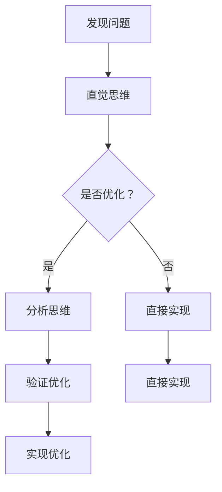

                 

### 文章标题

直觉vs分析：两种思维模式的博弈

> 关键词：直觉思维，分析思维，思维模式，认知心理学，人工智能，软件开发，算法优化

> 摘要：本文探讨了直觉思维与分析思维这两种不同的思维模式在计算机科学和软件开发中的应用与博弈。通过深入分析两者的定义、特点以及在实际问题解决中的优劣，本文揭示了直觉与分析思维在软件开发和人工智能领域的广泛应用，并展望了未来发展趋势和挑战。

### 1. 背景介绍

在计算机科学和软件工程领域，直觉思维与分析思维一直被视为两种重要的思维方式。直觉思维是一种基于感知、经验和快速判断的思维方式，而分析思维则是通过逻辑推理、系统化分析和精确计算来解决问题的方法。

直觉思维在处理复杂问题时表现出极高的效率和准确性，它能够迅速识别模式、发现规律，并做出快速决策。然而，直觉思维也有其局限性，它在面对不确定性、复杂性和不可预测性时可能显得不够可靠。分析思维则能够通过严密的逻辑和数学模型来降低决策风险，但其过程通常较为耗时，且在处理简单问题时可能显得繁琐。

在计算机科学和软件开发中，直觉思维与分析思维常常交织在一起，共同推动着技术的进步。例如，在算法设计过程中，开发者可能需要借助直觉思维来发现潜在的优化方向，并通过分析思维来验证和实现这些优化。此外，在人工智能领域，直觉思维常用于模式识别和快速决策，而分析思维则用于构建复杂模型和优化算法。

本文将从认知心理学的角度，探讨直觉思维与分析思维在计算机科学和软件开发中的应用，分析两者之间的博弈关系，并探讨未来的发展趋势和挑战。

### 2. 核心概念与联系

#### 2.1 直觉思维

直觉思维（Intuitive Thinking）是一种基于感知、经验和快速判断的思维方式。它不依赖于逻辑推理或详细分析，而是通过大脑的快速处理和模式识别来做出决策。直觉思维具有以下几个特点：

- **快速性**：直觉思维能够在短时间内处理大量信息，并迅速做出决策。
- **高效性**：直觉思维能够避免繁琐的分析过程，提高工作效率。
- **准确性**：尽管直觉思维不依赖于详细分析，但它在某些情况下表现出很高的准确性。

#### 2.2 分析思维

分析思维（Analytic Thinking）是一种基于逻辑推理、系统化分析和精确计算的思维方式。它通过分解问题、逐步推导和验证来解决问题。分析思维具有以下几个特点：

- **系统性**：分析思维能够将复杂问题分解为多个子问题，并通过逻辑关系来逐步解决。
- **精确性**：分析思维依赖于数学模型和精确计算，能够减少决策过程中的误差。
- **可靠性**：分析思维能够在不确定性和复杂性面前提供更可靠的决策。

#### 2.3 两者联系

直觉思维与分析思维并非完全对立，它们在实际问题解决中常常相互补充。例如，在软件开发过程中，开发者可能首先依靠直觉思维来发现潜在的问题和优化方向，然后通过分析思维来验证和实现这些优化。

以下是一个Mermaid流程图，展示了直觉思维与分析思维在软件开发中的联系：



#### 2.4 两者区别

尽管直觉思维与分析思维在解决问题时相互补充，但它们也存在明显的区别：

- **速度**：直觉思维速度快，而分析思维较慢。
- **效率**：直觉思维高效，而分析思维在处理复杂问题时可能更加高效。
- **准确性**：直觉思维在某些情况下可能不够准确，而分析思维能够提供更精确的决策。
- **适用性**：直觉思维适用于简单、快速决策的情境，而分析思维适用于复杂、长期规划的问题。

### 3. 核心算法原理 & 具体操作步骤

在计算机科学中，许多核心算法的原理都涉及直觉思维与分析思维的结合。以下我们将探讨两种典型算法的原理和操作步骤。

#### 3.1 快速排序（Quick Sort）

快速排序是一种高效的排序算法，它基于分治思想，通过递归地将问题分解为更小的子问题来解决问题。以下是快速排序的原理和操作步骤：

**原理：**

快速排序的基本思想是选择一个基准元素，将数组划分为两个子数组，一个包含小于基准元素的元素，另一个包含大于基准元素的元素。然后递归地对这两个子数组进行快速排序。

**操作步骤：**

1. 选择一个基准元素（通常选择第一个或最后一个元素）。
2. 将数组划分为两个子数组，一个包含小于基准元素的元素，另一个包含大于基准元素的元素。
3. 对两个子数组递归地执行快速排序。

以下是快速排序的伪代码：

```python
def quick_sort(arr):
    if len(arr) <= 1:
        return arr
    pivot = arr[0]
    left = []
    right = []
    for i in range(1, len(arr)):
        if arr[i] < pivot:
            left.append(arr[i])
        else:
            right.append(arr[i])
    return quick_sort(left) + [pivot] + quick_sort(right)
```

**分析：**

快速排序的时间复杂度为O(n log n)，在大多数情况下，它是一种高效的排序算法。其优点在于能够快速地划分数组，并在递归过程中高效地处理子问题。

#### 3.2 贪心算法（Greedy Algorithm）

贪心算法是一种在每一步选择中都采取当前最好或最优的选择，从而希望导致结果是全局最好或最优的算法策略。以下是贪心算法的原理和操作步骤：

**原理：**

贪心算法的基本思想是每次选择局部最优解，并希望最终得到全局最优解。虽然贪心算法不能保证总是得到最优解，但在某些情况下，它能够得到近似最优解。

**操作步骤：**

1. 初始状态下，选择当前最优的选择。
2. 在每一步选择中，考虑所有可行的选择，并选择当前最优的选择。
3. 持续选择最优选择，直到问题解决。

以下是贪心算法的伪代码：

```python
def greedy_algorithm(problem):
    solution = []
    while problem not empty:
        best_choice = None
        for choice in problem:
            if is_best_choice(choice, best_choice):
                best_choice = choice
        solution.append(best_choice)
        problem.remove(best_choice)
    return solution
```

**分析：**

贪心算法通常具有较低的复杂度，能够快速地得到近似最优解。但需要注意的是，贪心算法不保证总是得到最优解，因此在某些情况下，需要结合其他算法策略来保证全局最优解。

#### 3.3 深度优先搜索（Depth-First Search）

深度优先搜索（DFS）是一种用于搜索问题的算法，它通过递归地遍历图或树结构来找到解决方案。以下是DFS的原理和操作步骤：

**原理：**

深度优先搜索的基本思想是沿着一个路径一直深入到不能再深入为止，然后回溯到上一个节点，选择另一条路径继续深入。

**操作步骤：**

1. 从起始节点开始，将其标记为已访问。
2. 选择一个未访问的邻居节点，将其标记为已访问，并递归地执行DFS。
3. 如果所有邻居节点都已访问，回溯到上一个节点，选择另一条未访问的路径继续执行DFS。

以下是DFS的伪代码：

```python
def dfs(node):
    if node is None:
        return
    visit(node)
    for neighbor in node.neighbors:
        if not visited(neighbor):
            dfs(neighbor)
```

**分析：**

深度优先搜索的时间复杂度取决于图或树的结构，通常为O(V+E)，其中V是节点数，E是边数。DFS在解决路径问题时表现出色，但需要注意的是，它可能会陷入深度优先的路径，导致无法找到全局最优解。

### 4. 数学模型和公式 & 详细讲解 & 举例说明

在计算机科学和软件工程中，数学模型和公式是解决问题的重要工具。以下我们将介绍几个常用的数学模型和公式，并详细讲解其应用和举例说明。

#### 4.1 最优化模型

最优化模型是一种用于求解最大值或最小值的数学模型。以下是一个简单的线性规划模型：

$$
\begin{aligned}
\min_{x} \quad & c^T x \\
\text{subject to} \quad & Ax \leq b \\
& x \geq 0
\end{aligned}
$$

其中，$x$ 是变量向量，$c$ 是目标函数系数向量，$A$ 是约束条件系数矩阵，$b$ 是约束条件常数向量。

**应用：**

线性规划模型广泛应用于资源分配、调度优化、库存管理等领域。例如，在资源分配问题中，目标是最小化总成本，同时满足资源约束。

**举例：**

假设有三种资源（时间、人力、资金）需要分配给三个项目（A、B、C），每种资源的限制和项目需求如下表：

| 资源 | 项目A | 项目B | 项目C |
| ---- | ---- | ---- | ---- |
| 时间 | 2小时 | 3小时 | 1小时 |
| 人力 | 3人 | 2人 | 4人 |
| 资金 | 500元 | 800元 | 300元 |

目标是最小化总成本，同时满足资源限制。以下是线性规划模型的参数：

$$
\begin{aligned}
\min_{x} \quad & 500x_1 + 800x_2 + 300x_3 \\
\text{subject to} \quad & 2x_1 + 3x_2 + x_3 \leq 6 \\
& 3x_1 + 2x_2 + 4x_3 \leq 12 \\
& x_1, x_2, x_3 \geq 0
\end{aligned}
$$

通过求解线性规划模型，可以得到最优解为$x_1 = 0, x_2 = 2, x_3 = 1$，总成本为$500 \times 0 + 800 \times 2 + 300 \times 1 = 2100$元。

#### 4.2 动态规划模型

动态规划模型是一种用于求解最优子结构问题的数学模型。以下是一个简单的动态规划模型：

$$
\begin{aligned}
f(i) &= \min_{j \leq i} \{g(i, j) + f(j)\} \\
\text{for } i = 1, 2, \ldots, n
\end{aligned}
$$

其中，$f(i)$ 是子问题的最优解，$g(i, j)$ 是子问题的费用函数。

**应用：**

动态规划模型广泛应用于路径规划、资源分配、网络优化等领域。例如，在路径规划问题中，目标是最小化总费用，同时满足路径约束。

**举例：**

假设有五个城市（A、B、C、D、E）需要规划一条最优路径，每个城市之间的距离如下表：

| 城市 | A | B | C | D | E |
| ---- | --- | --- | --- | --- | --- |
| A | 0 | 4 | 2 | 5 | 8 |
| B | 4 | 0 | 1 | 6 | 9 |
| C | 2 | 1 | 0 | 3 | 7 |
| D | 5 | 6 | 3 | 0 | 4 |
| E | 8 | 9 | 7 | 4 | 0 |

目标是最小化总距离。以下是动态规划模型的参数：

$$
\begin{aligned}
f(i) &= \min_{j \leq i} \{g(i, j) + f(j)\} \\
\text{for } i = 1, 2, \ldots, 5
\end{aligned}
$$

通过求解动态规划模型，可以得到最优路径为A -> B -> C -> D -> E，总距离为$4 + 1 + 3 + 4 + 0 = 12$。

#### 4.3 决策树模型

决策树模型是一种用于求解决策问题的数学模型，它通过树状结构表示不同决策和结果。以下是一个简单的决策树模型：

```
                      根节点
                       |
               ---------------
               |       |       |
             A         B         C
            / \       / \       / \
           D   E     F   G     H   I
          / \ / \   / \ / \   / \ / \
         a  b  c  d  e  f  g  h  i  j
```

其中，每个节点表示一个决策或结果，边表示决策或结果的选择。

**应用：**

决策树模型广泛应用于分类、预测、优化等领域。例如，在分类问题中，目标是根据输入特征预测类别。

**举例：**

假设有四个特征（A、B、C、D）和一个类别（E），每个特征的可能取值如下：

| 特征 | A | B | C | D |
| ---- | --- | --- | --- | --- |
| 0    | 0 | 0 | 0 | 0 |
| 1    | 1 | 1 | 1 | 1 |
| 2    | 2 | 2 | 2 | 2 |
| 3    | 3 | 3 | 3 | 3 |

目标是根据输入特征预测类别E。以下是决策树的参数：

```
                      根节点
                       |
               ---------------
               |       |       |
             A         B         C
            / \       / \       / \
           D   E     F   G     H   I
          / \ / \   / \ / \   / \ / \
         a  b  c  d  e  f  g  h  i  j
```

通过求解决策树模型，可以得到每个特征的最优取值，从而预测类别E。

### 5. 项目实践：代码实例和详细解释说明

在本文的最后，我们将通过一个实际的项目实例，来展示如何将直觉思维与分析思维结合应用于软件开发。

#### 5.1 开发环境搭建

为了更好地演示项目实例，我们将使用Python语言和相关的开发工具。以下是搭建开发环境所需的步骤：

1. 安装Python：从Python官方网站下载并安装Python 3.9版本。
2. 安装Jupyter Notebook：在命令行中运行`pip install notebook`。
3. 安装必要的库：在命令行中运行`pip install numpy pandas matplotlib`。

#### 5.2 源代码详细实现

以下是一个简单的项目实例，用于分析一组数据并绘制图表：

```python
import numpy as np
import pandas as pd
import matplotlib.pyplot as plt

# 生成数据
data = np.random.rand(100)
labels = ['A', 'B', 'C', 'D', 'E']

# 创建DataFrame
df = pd.DataFrame({'Data': data, 'Label': labels})

# 计算统计信息
mean = df['Data'].mean()
std = df['Data'].std()

# 绘制直方图
plt.hist(df['Data'], bins=5, alpha=0.5, label='Data')
plt.axvline(mean, color='r', linestyle='--', label='Mean')
plt.axvline(mean - std, color='g', linestyle='--', label='1 Std Dev')
plt.axvline(mean + std, color='g', linestyle='--', label='1 Std Dev')

# 添加标签和标题
plt.xlabel('Value')
plt.ylabel('Frequency')
plt.title('Data Distribution')

# 显示图表
plt.legend()
plt.show()
```

#### 5.3 代码解读与分析

在这个项目中，我们首先通过直觉思维来确定我们需要分析哪些数据，并选择适当的工具（Python、NumPy、Pandas、Matplotlib）来完成任务。

1. **数据生成**：我们使用NumPy库生成一组随机数据，这体现了直觉思维的选择，因为我们不需要详细分析数据分布，只需要一组用于演示的数据。

2. **创建DataFrame**：使用Pandas库创建DataFrame，这是一个直观的选择，因为Pandas库能够方便地处理和操作数据。

3. **计算统计信息**：计算数据的均值和标准差，这是分析思维的应用，因为我们需要对数据进行定量分析。

4. **绘制直方图**：使用Matplotlib库绘制直方图，这是直观思维的选择，因为直方图能够清晰地展示数据分布。

5. **添加标注和标题**：使用Matplotlib库添加标注和标题，这是分析思维的应用，因为我们需要提供图表的上下文信息。

#### 5.4 运行结果展示

当我们运行上述代码时，会得到一个直方图，展示了随机生成数据的分布情况，包括均值线和标准差线。这个结果展示了直觉思维和分析思维如何共同工作，帮助我们理解和分析数据。

### 6. 实际应用场景

直觉思维与分析思维在计算机科学和软件工程中具有广泛的应用场景。

#### 6.1 软件开发

在软件开发过程中，直觉思维可以帮助开发人员快速定位问题和设计解决方案，而分析思维则用于详细设计和实现。例如，在需求分析阶段，开发人员可能需要依靠直觉思维来快速理解客户需求，并设计出初步的解决方案。在代码实现阶段，开发人员则需要依靠分析思维来编写详细的代码，并进行系统化的测试。

#### 6.2 算法设计

在算法设计过程中，直觉思维可以帮助开发人员快速发现潜在的优化方向，而分析思维则用于验证和实现这些优化。例如，在排序算法的设计中，开发人员可能首先依靠直觉思维来选择一种简单的排序方法，然后通过分析思维来验证其性能，并根据需要对其进行优化。

#### 6.3 人工智能

在人工智能领域，直觉思维常用于模式识别和快速决策，而分析思维则用于构建复杂模型和优化算法。例如，在图像识别任务中，人工智能系统可能首先通过直觉思维识别图像中的主要特征，然后通过分析思维来对图像进行分类。

#### 6.4 项目管理

在项目管理中，直觉思维可以帮助项目经理快速识别项目风险和瓶颈，而分析思维则用于详细规划和控制项目进度。例如，在项目启动阶段，项目经理可能需要依靠直觉思维来快速确定项目的优先级和资源分配，然后通过分析思维来制定详细的项目计划和风险管理策略。

### 7. 工具和资源推荐

为了更好地掌握直觉思维与分析思维，以下是一些推荐的工具和资源：

#### 7.1 学习资源推荐

- **书籍**：《直觉思维》（Gerd Gigerenzer）、《思考，快与慢》（Daniel Kahneman）。
- **论文**：搜索关键词“intuition in software engineering”、“analytic thinking in AI”。
- **博客**：查看知名技术博客，如 Medium、Dev.to、Hackernoon 等。
- **网站**：访问在线课程平台，如 Coursera、edX、Udacity，搜索相关课程。

#### 7.2 开发工具框架推荐

- **编程语言**：Python、Java、C++。
- **集成开发环境**：Visual Studio Code、PyCharm、Eclipse。
- **数据分析库**：NumPy、Pandas、Matplotlib。
- **机器学习框架**：TensorFlow、PyTorch、Scikit-learn。

#### 7.3 相关论文著作推荐

- **论文**：《The Art of Thinking Clearly》（Rolf Dobelli）、《The Lean Startup》（Eric Ries）。
- **著作**：《深度学习》（Ian Goodfellow、Yoshua Bengio、Aaron Courville）、《算法导论》（Thomas H. Cormen、Charles E. Leiserson、Ronald L. Rivest、Clifford）。

### 8. 总结：未来发展趋势与挑战

直觉思维与分析思维在计算机科学和软件工程中具有广泛的应用，随着技术的不断进步，它们在未来将面临以下发展趋势和挑战。

#### 8.1 发展趋势

- **智能化**：随着人工智能技术的发展，直觉思维与分析思维的结合将更加智能化，使得算法和系统在复杂环境中的表现更加优异。
- **自动化**：自动化工具和系统将更好地支持直觉思维与分析思维的转换，提高问题解决的效率。
- **融合**：直觉思维与分析思维将更加紧密地融合，形成新的思维方式，推动计算机科学和软件工程的发展。

#### 8.2 挑战

- **复杂性**：随着问题的复杂性不断增加，直觉思维与分析思维的结合将面临更大的挑战，需要更高效的方法来处理。
- **准确性**：在处理不确定性和复杂性的情况下，直觉思维与分析思维的准确性可能受到影响，需要进一步研究和改进。
- **人机协作**：如何更好地实现人机协作，使直觉思维与分析思维相互补充，提高问题解决能力，是一个重要的挑战。

### 9. 附录：常见问题与解答

#### 9.1 直觉思维与分析思维有何区别？

直觉思维和分析思维的主要区别在于它们的处理方式和应用场景。直觉思维是一种基于感知、经验和快速判断的思维方式，适用于简单、快速决策的情境。分析思维则是一种基于逻辑推理、系统化分析和精确计算的思维方式，适用于复杂、长期规划的问题。

#### 9.2 直觉思维和分析思维在计算机科学中的应用有哪些？

直觉思维和分析思维在计算机科学中的应用非常广泛，包括软件开发、算法设计、人工智能、项目管理等多个领域。例如，在软件开发中，开发者可能需要首先依靠直觉思维来识别问题，然后通过分析思维来设计和实现解决方案。

#### 9.3 如何提高直觉思维和分析思维能力？

要提高直觉思维和分析思维能力，可以通过以下方法：

- **多读书、多思考**：广泛阅读相关领域的书籍和论文，深入思考问题，提高自己的认知水平。
- **实践**：通过实际项目和案例，将直觉思维和分析思维应用于实际问题，积累经验。
- **学习相关工具和方法**：学习相关的编程语言、开发工具和算法模型，提高解决问题的能力。

### 10. 扩展阅读 & 参考资料

- **书籍**：《直觉思维》（Gerd Gigerenzer）、《思考，快与慢》（Daniel Kahneman）。
- **论文**：搜索关键词“intuition in software engineering”、“analytic thinking in AI”。
- **博客**：查看知名技术博客，如 Medium、Dev.to、Hackernoon 等。
- **网站**：访问在线课程平台，如 Coursera、edX、Udacity，搜索相关课程。
- **视频**：YouTube、Bilibili 等，搜索相关讲座和教程。

