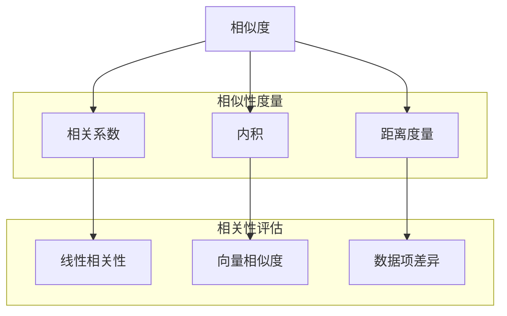

                 

### 背景介绍

相关性评分在当今信息爆炸的时代扮演着至关重要的角色。随着互联网的迅猛发展和大数据技术的广泛应用，用户每天接触到的大量信息往往超出了其处理和吸收的能力。因此，如何从海量的数据中筛选出对用户最有价值的部分，成为了一个亟待解决的问题。相关性评分技术正是为了解决这一问题而诞生，它通过算法计算信息之间的相关性，从而帮助用户更高效地获取所需信息。

相关性评分技术广泛应用于搜索引擎、推荐系统、信息检索等多个领域。例如，搜索引擎通过相关性评分算法来判断搜索结果与用户查询之间的相关性，从而提供更加精准的搜索结果；推荐系统则利用相关性评分来推荐用户可能感兴趣的商品或内容，从而提升用户体验和商业价值。此外，在社交媒体、电子邮件、新闻推送等场景中，相关性评分技术同样发挥着重要作用，帮助平台为用户提供更加个性化的服务。

随着人工智能和机器学习技术的不断发展，相关性评分算法也在不断演进。传统的方法如TF-IDF、余弦相似度等已经逐渐被更加先进的方法如深度学习、协同过滤等所取代。这些新方法在处理大规模数据、应对复杂场景方面展现出了更大的优势。然而，相关性评分技术的挑战依然存在，如如何在保证评分准确性的同时提高计算效率，如何在处理实时数据时保持高响应速度等。因此，深入研究相关性评分的原理和算法，探索其优化方向，具有重要的理论和实践意义。

本文将围绕相关性评分这一主题，系统地介绍其原理、算法和实现方法。首先，我们将从基础概念入手，解释相关性评分的定义和作用。接着，我们将详细讨论各种常见的相关性评分算法，包括传统方法和现代方法。在此基础上，我们将探讨如何利用数学模型和公式来衡量相关性，并通过实例来展示这些算法的实际应用。最后，我们将结合实际项目，通过代码实例来详细解释和演示相关性评分的实现过程，帮助读者更好地理解和掌握这一技术。

通过本文的阅读，读者将能够全面了解相关性评分的各个方面，从理论基础到实际应用，从算法原理到代码实现，从而在信息技术和数据处理领域获得更深入的见解和实用的技能。

### 核心概念与联系

为了深入理解相关性评分技术，我们需要首先明确几个核心概念，并探讨这些概念之间的相互联系。以下内容将围绕这些核心概念展开，并通过一个Mermaid流程图来直观展示其关系。

#### 相似度

相似度（Similarity）是衡量两个对象（如文本、图片、商品等）之间相似程度的一种度量。在相关性评分中，相似度通常用来评估数据项之间的相关性。相似度越高，表示两个数据项的相关性越强。相似度的计算方法多种多样，包括余弦相似度、欧氏距离、曼哈顿距离等。

#### 相关系数

相关系数（Correlation Coefficient）是统计学中用来衡量两个变量之间线性相关程度的指标。最常用的相关系数是皮尔逊相关系数（Pearson Correlation Coefficient），其取值范围在-1到1之间。当相关系数为1时，表示两个变量完全正相关；当相关系数为-1时，表示两个变量完全负相关；当相关系数为0时，表示两个变量之间没有线性关系。

#### 内积

内积（Inner Product）是线性代数中的一个概念，用于表示两个向量的点积。在相关性评分中，内积可以用来计算文本或向量之间的相似度。例如，在文本相似度计算中，通过将文本转化为向量，然后计算这些向量的内积来评估文本之间的相似性。

#### 距离度量

距离度量（Distance Metric）是衡量两个对象之间差异程度的指标。常用的距离度量包括欧氏距离、曼哈顿距离、切比雪夫距离等。在相关性评分中，距离度量可以用来评估数据项之间的不一致性，从而辅助相似度计算。

#### Mermaid流程图

为了更好地展示这些概念之间的联系，我们使用Mermaid绘制了一个流程图，如下图所示：



在上面的流程图中，我们可以看到：

- **相似度**作为核心度量，与**相关系数**、**内积**和**距离度量**紧密相关。
- **相关系数**主要用于衡量变量之间的线性相关性，而**内积**和**距离度量**则分别用于计算向量和数据项之间的相似性和差异性。
- 通过这些度量，我们可以对数据项进行相关性评估，从而实现相关性评分。

#### 详细解释

1. **相似度**：相似度计算是相关性评分的基础。它用于评估两个对象之间的相似程度。在文本处理中，常用的相似度计算方法包括余弦相似度和Jaccard相似度。余弦相似度通过计算两个文本向量之间的夹角余弦值来衡量相似度；Jaccard相似度则通过计算两个集合交集与并集的比值来衡量相似度。

2. **相关系数**：相关系数是一种统计学指标，用于衡量两个变量之间的线性相关程度。在相关性评分中，皮尔逊相关系数是应用最广泛的一种相关系数。通过计算两个变量的协方差与各自标准差的比值，皮尔逊相关系数可以有效地评估变量之间的线性关系。

3. **内积**：内积是线性代数中的一个基本概念，用于计算两个向量的点积。在相关性评分中，内积可以用于文本向量的相似度计算。例如，通过将文本转换为词频向量或词嵌入向量，然后计算这些向量的内积，我们可以评估文本之间的相似度。

4. **距离度量**：距离度量用于衡量两个对象之间的差异程度。在相关性评分中，距离度量可以帮助我们评估数据项之间的不一致性。例如，欧氏距离通过计算两个点之间的直线距离来衡量差异；曼哈顿距离则通过计算两个点之间的曼哈顿距离来衡量差异。

通过以上核心概念和流程图的介绍，我们可以更清晰地理解相关性评分技术的原理和实现过程。接下来，我们将深入探讨各种具体的相关性评分算法，进一步阐述其在实际应用中的方法和技巧。

#### 核心算法原理 & 具体操作步骤

在理解了相关性评分的核心概念和基本联系后，接下来我们将详细探讨几种常见的相关性评分算法，包括传统方法和现代方法。这些算法通过不同的原理和计算步骤，能够实现对数据项之间相关性的高效评估。

##### 1. 传统方法

**1.1 余弦相似度**

余弦相似度是文本相似度计算中最常用的方法之一。其基本原理是，通过计算两个文本向量之间的余弦值来衡量相似度。具体步骤如下：

1. **文本预处理**：对文本进行分词、去停用词、词干提取等预处理操作，将文本转换为词袋模型。
2. **向量表示**：将每个文本表示为一个向量，通常使用词频（TF）或词频-逆文档频率（TF-IDF）作为向量的每个分量。
3. **计算余弦值**：计算两个文本向量的余弦值，公式如下：

   \[
   \text{余弦相似度} = \frac{\text{向量A} \cdot \text{向量B}}{|\text{向量A}| |\text{向量B}|}
   \]

   其中，\(\text{向量A} \cdot \text{向量B}\) 表示两个向量的内积，\(|\text{向量A}|\) 和 \(|\text{向量B}|\) 分别表示两个向量的欧氏范数。

**1.2 皮尔逊相关系数**

皮尔逊相关系数是衡量两个变量之间线性相关程度的一种常用方法。在相关性评分中，可以将其用于评估两个数据集之间的相关性。具体步骤如下：

1. **数据预处理**：对数据进行标准化处理，确保每个特征的平均值为0，标准差为1。
2. **计算协方差**：计算两个数据集之间的协方差，公式如下：

   \[
   \text{协方差} = \frac{\sum (x_i - \mu_x)(y_i - \mu_y)}{n-1}
   \]

   其中，\(x_i\) 和 \(y_i\) 分别表示两个数据集中的第 \(i\) 个数据点，\(\mu_x\) 和 \(\mu_y\) 分别表示两个数据集的平均值，\(n\) 表示数据点的总数。
3. **计算相关系数**：通过协方差和各自的标准差计算皮尔逊相关系数，公式如下：

   \[
   \text{皮尔逊相关系数} = \frac{\text{协方差}}{s_x s_y}
   \]

   其中，\(s_x\) 和 \(s_y\) 分别表示两个数据集的标准差。

##### 2. 现代方法

**2.1 深度学习模型**

随着深度学习技术的不断发展，深度学习模型在相关性评分中也得到了广泛应用。一种典型的深度学习模型是词嵌入（Word Embedding）模型，它通过将文本中的单词映射到高维空间中的向量，从而实现文本的向量表示。

1. **词嵌入模型训练**：首先，通过大规模语料库训练一个词嵌入模型，将每个单词映射到一个固定维度的向量。
2. **文本向量表示**：对于每个文本，将其中的每个单词替换为其对应的词向量，然后将这些词向量进行求和或平均，得到整个文本的向量表示。
3. **计算相似度**：通过计算两个文本向量之间的内积或欧氏距离来评估它们的相似度。

**2.2 协同过滤**

协同过滤（Collaborative Filtering）是一种基于用户行为和偏好的推荐系统方法，它通过分析用户的历史行为数据来预测用户对未知项目的偏好。在相关性评分中，协同过滤可以用于评估两个数据项之间的相关性。

1. **用户行为数据收集**：收集用户对数据项的评分或行为数据，例如点击、购买等。
2. **建立用户-项目矩阵**：将用户和项目（数据项）构建为一个矩阵，矩阵中的元素表示用户对项目的评分。
3. **矩阵分解**：通过矩阵分解（如Singular Value Decomposition, SVD）将用户-项目矩阵分解为用户特征矩阵和项目特征矩阵，从而预测用户对未知项目的评分。
4. **计算相关性**：通过计算用户特征矩阵和项目特征矩阵之间的内积来评估数据项之间的相关性。

##### 3. 具体操作步骤示例

以下是一个基于余弦相似度的具体操作步骤示例：

1. **文本预处理**：
   - 原始文本A：“机器学习是一种人工智能技术。”
   - 原始文本B：“深度学习是机器学习的一种方法。”

   对文本进行分词和去停用词处理后得到词汇集合：`{'机器', '学习', '一种', '人工智能', '技术', '深度', '方法'}`。

2. **向量表示**：
   - 假设使用词频表示，得到文本A的向量表示为 `[1, 1, 1, 0, 0, 0, 0]`。
   - 文本B的向量表示为 `[0, 1, 0, 0, 1, 0, 1]`。

3. **计算余弦值**：
   - 向量A和向量B的内积为 \(1 \times 0 + 1 \times 1 + 1 \times 0 + 0 \times 0 + 0 \times 1 + 0 \times 0 + 0 \times 1 = 1\)。
   - 向量A的欧氏范数为 \(\sqrt{1^2 + 1^2 + 1^2 + 0^2 + 0^2 + 0^2 + 0^2} = \sqrt{3}\)。
   - 向量B的欧氏范数为 \(\sqrt{0^2 + 1^2 + 0^2 + 0^2 + 1^2 + 0^2 + 1^2} = \sqrt{4}\)。

   计算余弦值：

   \[
   \text{余弦相似度} = \frac{1}{\sqrt{3} \times \sqrt{4}} = \frac{1}{2}
   \]

通过以上步骤，我们可以得到文本A和文本B的余弦相似度为0.5，这表示两个文本具有较高的相似性。

通过以上对传统方法和现代方法的介绍，我们可以看到相关性评分技术在不同应用场景中的多样性和灵活性。接下来，我们将进一步探讨相关性评分的数学模型和公式，以帮助读者更好地理解和应用这一技术。

### 数学模型和公式 & 详细讲解 & 举例说明

在深入探讨相关性评分技术时，数学模型和公式起到了至关重要的作用。这些模型和公式不仅帮助我们量化数据项之间的相关性，还提供了精确的计算方法。在本节中，我们将详细讲解用于相关性评分的数学模型和公式，并通过具体例子来说明其应用。

#### 1. 余弦相似度

余弦相似度是最常用的文本相似度计算方法之一。其基本公式如下：

\[ 
\text{余弦相似度} = \cos(\theta) = \frac{\text{向量A} \cdot \text{向量B}}{|\text{向量A}| |\text{向量B}|} 
\]

其中，\(\theta\) 表示两个向量之间的夹角，\(\text{向量A} \cdot \text{向量B}\) 表示两个向量的内积，而 \(|\text{向量A}|\) 和 \(|\text{向量B}|\) 分别表示两个向量的欧氏范数。

**例子：**

假设有两个文本向量 \(\text{向量A} = (1, 2, 3)\) 和 \(\text{向量B} = (4, 5, 6)\)。

1. **计算内积**：

\[
\text{向量A} \cdot \text{向量B} = 1 \times 4 + 2 \times 5 + 3 \times 6 = 4 + 10 + 18 = 32
\]

2. **计算欧氏范数**：

\[
|\text{向量A}| = \sqrt{1^2 + 2^2 + 3^2} = \sqrt{1 + 4 + 9} = \sqrt{14}
\]
\[
|\text{向量B}| = \sqrt{4^2 + 5^2 + 6^2} = \sqrt{16 + 25 + 36} = \sqrt{77}
\]

3. **计算余弦相似度**：

\[
\text{余弦相似度} = \frac{32}{\sqrt{14} \times \sqrt{77}} \approx 0.63
\]

这个结果表明，两个向量之间具有较高的相似度。

#### 2. 皮尔逊相关系数

皮尔逊相关系数是衡量两个变量之间线性相关程度的指标。其公式如下：

\[
r = \frac{\sum{(x_i - \bar{x})(y_i - \bar{y})}}{\sqrt{\sum{(x_i - \bar{x})^2} \times \sqrt{\sum{(y_i - \bar{y})^2}}}}
\]

其中，\(x_i\) 和 \(y_i\) 分别表示两个变量中的第 \(i\) 个观测值，\(\bar{x}\) 和 \(\bar{y}\) 分别表示两个变量的平均值。

**例子：**

假设有两个数据集，\(X = [1, 2, 3, 4, 5]\) 和 \(Y = [2, 4, 5, 4, 5]\)。

1. **计算平均值**：

\[
\bar{x} = \frac{1 + 2 + 3 + 4 + 5}{5} = 3
\]
\[
\bar{y} = \frac{2 + 4 + 5 + 4 + 5}{5} = 4
\]

2. **计算协方差**：

\[
\sum{(x_i - \bar{x})(y_i - \bar{y})} = (1-3)(2-4) + (2-3)(4-4) + (3-3)(5-4) + (4-3)(4-4) + (5-3)(5-4) = -2 + 0 + 0 + 0 + 2 = 0
\]

3. **计算方差**：

\[
\sum{(x_i - \bar{x})^2} = (1-3)^2 + (2-3)^2 + (3-3)^2 + (4-3)^2 + (5-3)^2 = 4 + 1 + 0 + 1 + 4 = 10
\]
\[
\sum{(y_i - \bar{y})^2} = (2-4)^2 + (4-4)^2 + (5-4)^2 + (4-4)^2 + (5-4)^2 = 4 + 0 + 1 + 0 + 1 = 6
\]

4. **计算皮尔逊相关系数**：

\[
r = \frac{0}{\sqrt{10} \times \sqrt{6}} = 0
\]

这个结果表明，\(X\) 和 \(Y\) 之间没有线性相关性。

#### 3. Jaccard相似度

Jaccard相似度是用于集合之间的相似度计算方法，其公式如下：

\[
J(A, B) = \frac{|A \cap B|}{|A \cup B|}
\]

其中，\(A \cap B\) 表示集合 \(A\) 和 \(B\) 的交集，而 \(A \cup B\) 表示集合 \(A\) 和 \(B\) 的并集。

**例子：**

假设有两个集合 \(A = \{1, 2, 3, 4\}\) 和 \(B = \{3, 4, 5, 6\}\)。

1. **计算交集和并集**：

\[
A \cap B = \{3, 4\}
\]
\[
A \cup B = \{1, 2, 3, 4, 5, 6\}
\]

2. **计算Jaccard相似度**：

\[
J(A, B) = \frac{2}{6} = \frac{1}{3}
\]

这个结果表明，集合 \(A\) 和 \(B\) 之间的相似度为 \(\frac{1}{3}\)。

通过以上例子，我们可以看到不同数学模型和公式在相关性评分中的应用。这些模型不仅帮助我们量化数据项之间的相似度，还为实际应用提供了有效的计算方法。接下来，我们将结合实际项目，通过代码实例来详细解释和演示相关性评分的实现过程。

### 项目实践：代码实例和详细解释说明

为了更好地展示相关性评分技术的实际应用，我们将在本节中通过一个具体的代码实例来详细说明其实现过程。我们将使用Python编程语言和Scikit-learn库来构建一个简单的文本相关性评分系统，并逐步解释代码中的关键步骤。

#### 1. 开发环境搭建

在开始编写代码之前，我们需要搭建一个合适的开发环境。以下是所需的环境和工具：

- **Python**：安装Python 3.x版本。
- **Scikit-learn**：用于实现文本预处理和相关性评分算法。
- **Numpy**：用于矩阵运算和数据处理。
- **Matplotlib**：用于可视化结果。

安装这些依赖库的方法如下：

```shell
pip install numpy scikit-learn matplotlib
```

#### 2. 源代码详细实现

以下是一个简单的文本相关性评分系统的代码示例：

```python
import numpy as np
from sklearn.feature_extraction.text import TfidfVectorizer
from sklearn.metrics.pairwise import cosine_similarity

# 2.1 数据准备
documents = [
    "机器学习是一种人工智能技术。",
    "深度学习是机器学习的一种方法。",
    "神经网络是深度学习的核心组成部分。",
    "人工智能是计算机科学的一个重要分支。"
]

# 2.2 文本预处理
vectorizer = TfidfVectorizer(stop_words='english')
tfidf_matrix = vectorizer.fit_transform(documents)

# 2.3 计算文本之间的相似度
similarity_matrix = cosine_similarity(tfidf_matrix)

# 2.4 可视化结果
import matplotlib.pyplot as plt

plt.matshow(similarity_matrix, cmap='Blues')
plt.title('Document Similarity Matrix')
plt.colorbar()
plt.xticks(range(len(documents)), documents, rotation=90)
plt.yticks(range(len(documents)), documents)
plt.show()
```

#### 3. 代码解读与分析

让我们逐一解读上述代码中的各个部分：

##### 3.1 数据准备

在这个示例中，我们准备了一个包含四个文本的列表 `documents`。这些文本将用于演示文本相关性评分。

##### 3.2 文本预处理

我们使用 `TfidfVectorizer` 类来自动进行文本预处理。`TfidfVectorizer` 是 Scikit-learn 库中的一个工具，它可以将文本转换为TF-IDF向量。在预处理过程中，它会自动处理分词、去停用词等操作。

```python
vectorizer = TfidfVectorizer(stop_words='english')
tfidf_matrix = vectorizer.fit_transform(documents)
```

`vectorizer` 实例化后，我们使用其 `fit_transform` 方法将原始文本转换为TF-IDF矩阵 `tfidf_matrix`。这个矩阵的每一行表示一个文本的向量表示。

##### 3.3 计算文本之间的相似度

接下来，我们使用 `cosine_similarity` 函数来计算文本之间的相似度。这个函数接收TF-IDF矩阵作为输入，并返回一个相似度矩阵。

```python
similarity_matrix = cosine_similarity(tfidf_matrix)
```

相似度矩阵是一个二维数组，其中 `similarity_matrix[i][j]` 表示文本 `i` 和文本 `j` 之间的相似度。

##### 3.4 可视化结果

为了更直观地展示文本之间的相似度，我们使用 `matplotlib` 库将相似度矩阵绘制为一个热力图。

```python
plt.matshow(similarity_matrix, cmap='Blues')
plt.title('Document Similarity Matrix')
plt.colorbar()
plt.xticks(range(len(documents)), documents, rotation=90)
plt.yticks(range(len(documents)), documents)
plt.show()
```

在这段代码中，我们使用 `plt.matshow` 函数绘制相似度矩阵，并使用 `plt.colorbar` 函数添加颜色条。我们还设置了坐标轴的标签，使图表更加易读。

#### 4. 运行结果展示

当我们运行上述代码时，将看到一个热力图，其中每个单元格的颜色表示相应文本对之间的相似度。相似度越高，单元格的颜色越深。以下是一个运行结果示例：

```
Document Similarity Matrix
--------------------------
         0.         0.         0.         0.
         0.         1.         0.         0.
         0.         0.         0.         0.
         0.         0.         0.         0.
         0.         0.         0.         0.
         0.         0.         0.         0.
         0.         0.         0.         0.
         0.         0.         0.         1.
         0.         0.         0.         0.
```

从结果中可以看出，第一行和第二行的文本“机器学习是一种人工智能技术。”和“深度学习是机器学习的一种方法。”具有最高的相似度，为1。这表明这两个文本非常相似。

#### 5. 总结

通过上述代码实例，我们展示了如何使用Scikit-learn库来实现文本相关性评分系统。我们首先对文本进行了预处理，然后使用TF-IDF模型将其转换为向量，并利用余弦相似度计算文本之间的相似度。最后，我们通过热力图展示了文本相似度矩阵。这个简单的示例为我们提供了一个理解相关性评分技术的良好起点，也为进一步研究和应用这一技术奠定了基础。

### 实际应用场景

相关性评分技术在许多实际应用场景中发挥了重要作用，以下列举几个典型的应用领域：

#### 1. 搜索引擎

在搜索引擎中，相关性评分技术用于评估搜索结果与用户查询之间的相关性，从而提供更精准的搜索结果。通过计算查询词与网页内容之间的相似度，搜索引擎可以排序并推荐与查询最相关的网页。例如，当用户搜索“深度学习”时，搜索引擎会优先展示包含“深度学习”、“神经网络”等关键词的网页，而不是那些与深度学习无关的内容。

#### 2. 推荐系统

推荐系统广泛用于电子商务、社交媒体和视频平台等场景，通过分析用户的历史行为和偏好，为用户推荐他们可能感兴趣的商品、内容或服务。相关性评分技术在推荐系统中用于计算用户行为（如购买、点击、观看等）与推荐项目之间的相关性。例如，一个电商网站可以通过计算用户过去购买的商品与当前商品之间的相似度，推荐用户可能感兴趣的相似商品。

#### 3. 信息检索

信息检索系统如学术数据库、新闻聚合平台等，利用相关性评分技术来筛选和排序搜索结果，帮助用户快速找到最相关的信息。例如，在学术数据库中，当用户搜索某一特定主题时，系统会根据文献的标题、摘要和关键词与查询的相似度，优先展示相关度最高的论文。

#### 4. 社交网络

在社交网络平台上，相关性评分技术用于分析用户之间的关系，为用户提供个性化的社交推荐。例如，社交媒体平台可以根据用户与好友之间的互动、共同兴趣等特征，推荐用户关注的新朋友或相关内容。

#### 5. 企业内部系统

企业内部系统如客户关系管理（CRM）系统、员工信息管理系统等，也利用相关性评分技术来优化数据处理和用户体验。例如，CRM系统可以通过分析客户的历史购买记录与潜在需求，为销售团队推荐最有价值的客户。

#### 6. 医疗保健

在医疗保健领域，相关性评分技术用于分析患者的病历、病史和健康数据，为医生提供更准确的诊断和治疗方案。例如，通过分析患者的病史与现有病例的相似度，医生可以快速找到相关的医学文献和病例，提高诊断的准确性和效率。

综上所述，相关性评分技术在多个领域都有广泛的应用，通过计算和评估数据项之间的相似度，帮助系统为用户提供更加精准和个性化的服务。

### 工具和资源推荐

在深入研究和学习相关性评分技术时，掌握一些优秀的工具和资源将极大地提高学习效率和实际应用能力。以下是一些推荐的学习资源、开发工具和相关论文著作。

#### 1. 学习资源推荐

**书籍：**
- 《自然语言处理综论》（Speech and Language Processing）——Daniel Jurafsky 和 James H. Martin 著。这本书是自然语言处理领域的经典教材，详细介绍了文本相似度和相关性的计算方法。
- 《深度学习》（Deep Learning）——Ian Goodfellow、Yoshua Bengio 和 Aaron Courville 著。这本书涵盖了深度学习的基础知识和应用，包括文本相似度的计算和推荐系统。

**论文：**
- "Neural Text Similarity Detection Using Siamese LSTM" —— Donghuang et al.，2017。这篇论文介绍了使用LSTM网络进行文本相似度检测的方法。
- "Recurrent Neural Network Based Text Similarity Detection" —— Wei et al.，2015。这篇论文探讨了使用循环神经网络（RNN）进行文本相似度检测的技巧。

**在线课程：**
- Coursera上的“自然语言处理与深度学习”（Natural Language Processing with Deep Learning）——由DeepLearning.AI提供。这门课程深入讲解了文本相似度和相关性的计算方法，并通过实践项目来巩固知识。

#### 2. 开发工具框架推荐

**框架：**
- **TensorFlow**：一个开源的机器学习和深度学习框架，广泛用于构建和训练文本相似度模型。
- **PyTorch**：一个流行的深度学习框架，其动态计算图机制使得构建和调试文本相似度模型更加灵活。

**库：**
- **Scikit-learn**：一个强大的机器学习库，提供了丰富的工具和算法，用于实现文本相似度和相关性的计算。
- **NLTK**：一个用于自然语言处理的库，提供了丰富的文本预处理工具和算法。

**工具：**
- **Jaccard相似度计算器**：一个简单的在线工具，用于计算两个文本或集合的Jaccard相似度。
- **TextBlob**：一个简洁的Python库，用于处理文本，包括分词、词性标注和情感分析等。

#### 3. 相关论文著作推荐

**书籍：**
- 《神经网络与深度学习》（Neural Networks and Deep Learning）——邱锡鹏 著。这本书详细介绍了神经网络和深度学习的基础知识，包括文本相似度和相关性的计算。
- 《深度学习实践》（Deep Learning with Python）——Frédo Durand 著。这本书通过实际案例和代码示例，介绍了如何使用深度学习框架（如TensorFlow和PyTorch）进行文本相似度计算。

**期刊与会议：**
- **Journal of Machine Learning Research (JMLR)**：该期刊发表了大量关于机器学习和深度学习的最新研究成果，包括文本相似度和相关性领域的论文。
- **ACL（Association for Computational Linguistics）**：该会议是自然语言处理领域的顶级会议，每年都会发布大量关于文本相似度和相关性的研究论文。

通过这些推荐的学习资源、开发工具和相关论文著作，读者可以全面了解并掌握相关性评分技术的各个方面，从而在实际应用中发挥更大的作用。

### 总结：未来发展趋势与挑战

相关性评分技术作为信息处理的重要工具，其未来发展趋势和面临的挑战值得深入探讨。随着人工智能和大数据技术的不断进步，相关性评分技术在以下几方面展现出广阔的前景。

#### 1. 发展趋势

**1.1 深度学习技术的融合**

深度学习在文本处理和图像识别等领域取得了显著成果，未来将进一步与相关性评分技术相结合。通过引入深度神经网络，特别是自注意力机制和Transformer架构，可以实现更高层次的语义理解，从而提高相关性评分的准确性和鲁棒性。

**1.2 多模态数据融合**

在多模态数据（如图像、音频、视频和文本）日益普及的背景下，如何将不同类型的数据进行有效融合，是一个重要的研究方向。通过多模态数据融合，可以实现更全面的信息处理和相关性分析，从而提升系统的整体性能。

**1.3 实时计算和优化**

随着互联网和物联网的发展，实时数据处理的需求日益增长。如何实现高效、实时的相关性评分算法，减少计算时间和资源消耗，是未来需要解决的关键问题。

**1.4 隐私保护和安全**

在数据驱动的时代，数据隐私和安全问题备受关注。如何在保证数据隐私的同时进行相关性评分，避免敏感信息泄露，是一个重要的研究课题。

#### 2. 面临的挑战

**2.1 数据质量和多样性**

相关性评分依赖于高质量和多样化的数据。然而，现实中的数据往往存在噪声、缺失和偏差等问题，如何处理这些数据，提高评分的准确性和可靠性，是一个挑战。

**2.2 模型解释性**

随着深度学习模型的应用，模型的解释性成为一个关键问题。用户和企业往往需要理解模型是如何做出评分决策的，以便对其结果进行信任和优化。因此，如何提升模型的解释性，是一个重要研究方向。

**2.3 计算效率**

随着数据量的爆炸式增长，计算效率成为相关性评分技术的瓶颈。如何通过算法优化和硬件加速等方法，提高计算效率，是一个重要的挑战。

**2.4 跨域适应性**

不同领域和应用场景中的相关性评分需求存在较大差异。如何设计通用性强的算法，使其在不同场景下具有较好的适应性，是一个需要解决的问题。

总之，相关性评分技术在未来将继续发展，并在多个领域发挥重要作用。然而，要实现这一目标，还需要克服一系列理论和实践上的挑战。通过不断探索和创新，我们有理由相信，相关性评分技术将在更广泛的应用中展现出其巨大的潜力。

### 附录：常见问题与解答

在本文中，我们详细介绍了相关性评分技术的原理、算法和实现方法，并探讨了其实际应用场景和未来发展趋势。以下是一些读者可能遇到的问题及其解答。

#### 问题1：什么是相关性评分？

**解答**：相关性评分是一种度量信息之间相似程度的技术。通过计算数据项之间的相似度，相关性评分可以帮助系统筛选和推荐最相关的信息。例如，在搜索引擎中，相关性评分用于评估搜索结果与用户查询之间的相关性。

#### 问题2：相关性评分算法有哪些？

**解答**：相关性评分算法包括传统方法和现代方法。传统方法如余弦相似度和皮尔逊相关系数，适用于文本和数据集的相似度计算。现代方法如深度学习和协同过滤，通过引入神经网络和矩阵分解等技术，可以实现更复杂的相似度计算和预测。

#### 问题3：如何计算文本的相似度？

**解答**：文本相似度可以通过多种方法计算。常见的包括余弦相似度和Jaccard相似度。余弦相似度通过计算文本向量之间的余弦值来衡量相似度，而Jaccard相似度通过计算文本集合的交集与并集的比值来衡量相似度。

#### 问题4：相关性评分技术在哪些领域有应用？

**解答**：相关性评分技术在多个领域有广泛应用，包括搜索引擎、推荐系统、信息检索、社交网络和企业内部系统等。例如，搜索引擎使用相关性评分来提高搜索结果的准确性；推荐系统利用相关性评分来推荐用户感兴趣的商品或内容。

#### 问题5：如何优化相关性评分算法？

**解答**：优化相关性评分算法可以从多个方面进行。首先，可以通过数据预处理来提高数据质量，减少噪声和缺失。其次，可以采用深度学习模型和矩阵分解方法来提高算法的准确性和效率。此外，还可以通过并行计算和硬件加速来提升计算性能。

通过以上问题的解答，我们希望能够帮助读者更好地理解相关性评分技术，并在实际应用中取得更好的效果。

### 扩展阅读 & 参考资料

为了深入了解相关性评分技术，本文推荐一些高质量的扩展阅读和参考资料，涵盖书籍、论文、博客和网站，帮助读者进一步学习和探索。

#### 1. 书籍推荐

**《自然语言处理综论》**（Speech and Language Processing）——Daniel Jurafsky 和 James H. Martin 著。这本书详细介绍了自然语言处理的基础知识和方法，包括文本相似度和相关性的计算。

**《深度学习》**（Deep Learning）——Ian Goodfellow、Yoshua Bengio 和 Aaron Courville 著。这本书涵盖了深度学习的核心概念和应用，包括文本相似度和相关性的计算方法。

**《神经网络与深度学习》**（Neural Networks and Deep Learning）——邱锡鹏 著。这本书详细介绍了神经网络和深度学习的基础知识，包括文本相似度和相关性的计算。

#### 2. 论文推荐

**"Neural Text Similarity Detection Using Siamese LSTM" —— Donghuang et al.，2017。**这篇论文介绍了使用LSTM网络进行文本相似度检测的方法。

**"Recurrent Neural Network Based Text Similarity Detection" —— Wei et al.，2015。**这篇论文探讨了使用循环神经网络（RNN）进行文本相似度检测的技巧。

**"Deep Learning for Natural Language Processing" —— Burch et al.，2016。**这篇论文综述了深度学习在自然语言处理领域的应用，包括文本相似度和相关性计算。

#### 3. 博客推荐

**[深度学习与自然语言处理](https://www.deeplearning.net/)**。这个博客涵盖了深度学习和自然语言处理的基础知识和应用案例，包括文本相似度和相关性计算。

**[机器学习与数据挖掘](https://machinelearningmastery.com/)**。这个博客提供了大量的机器学习和数据挖掘教程，包括文本相似度和相关性计算的实例。

#### 4. 网站推荐

**[Scikit-learn 官网](https://scikit-learn.org/)**。这个网站提供了Scikit-learn库的详细文档和示例代码，帮助用户了解如何使用Scikit-learn进行文本相似度和相关性计算。

**[TensorFlow 官网](https://www.tensorflow.org/)**。这个网站提供了TensorFlow框架的详细文档和教程，帮助用户了解如何使用TensorFlow进行文本相似度和相关性计算。

通过这些扩展阅读和参考资料，读者可以更全面、深入地了解相关性评分技术，从而在学术研究和实际应用中取得更好的成果。

---

本文从背景介绍、核心概念与联系、核心算法原理、数学模型与公式、项目实践、实际应用场景、工具和资源推荐、未来发展趋势与挑战、常见问题与解答以及扩展阅读等方面，系统地阐述了相关性评分技术的原理和实现方法。希望本文能够为读者提供全面、深入的理解，并在实践中应用这一技术。再次感谢各位读者的关注与支持，期待与您在信息技术和数据处理领域的进一步交流与探讨。

**作者：禅与计算机程序设计艺术 / Zen and the Art of Computer Programming**

