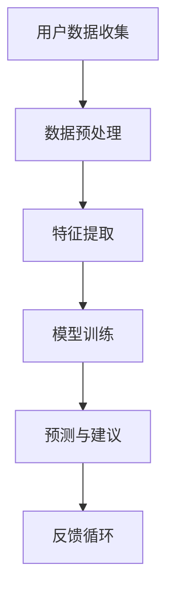

                 

 关键词：睡眠优化，生物节律，健康监测，人工智能，创业机遇

> 摘要：随着人工智能技术的不断进步，睡眠优化系统正成为健康科技领域的新星。本文将深入探讨睡眠优化系统的核心概念、算法原理、应用场景以及未来发展趋势，旨在为创业者提供指导，揭示其中的巨大商机。

## 1. 背景介绍

在现代快节奏的生活中，睡眠质量成为人们日益关注的问题。据世界卫生组织统计，全球约有三分之一的人存在睡眠障碍，这不仅影响个人健康，也对社会经济产生负面影响。睡眠优化系统作为一种新兴的技术解决方案，通过监测和调整个体的睡眠习惯，有助于提高睡眠质量，改善整体健康状态。

近年来，人工智能、生物传感、大数据分析等技术的发展，为睡眠优化系统的实现提供了强有力的支持。睡眠优化系统不仅能够提供个性化的睡眠建议，还能预测和预防睡眠障碍，具有较高的市场潜力。因此，睡眠优化系统成为健康科技创业领域的热点话题。

## 2. 核心概念与联系

### 2.1 生物节律

生物节律是指生物体内部的一种内在时钟，它调节着生物体的生理和行为活动。对于人类而言，最显著的两个生物节律是昼夜节律（或称为“光周期”）和季节节律。昼夜节律控制着人们的睡眠和觉醒周期，而季节节律则影响人们的食欲、体温和新陈代谢。

### 2.2 健康监测

健康监测是指通过各种设备和技术手段，对人体的生理指标进行实时监测和分析。对于睡眠优化系统来说，健康监测是关键组成部分，它能够提供关于睡眠质量、睡眠周期和生物节律的重要数据。

### 2.3 人工智能

人工智能（AI）在睡眠优化系统中扮演着重要角色。通过机器学习算法，AI可以分析大量的睡眠数据，识别睡眠模式，预测睡眠障碍，并给出个性化的睡眠建议。AI还能够根据用户的行为和反应，不断优化睡眠优化策略。

### 2.4 Mermaid 流程图



在这个流程图中，用户数据收集是起点，数据预处理包括去除噪声和异常值，特征提取则是对数据进行量化，模型训练是核心步骤，通过大量数据训练出模型，预测与建议是基于模型的输出，反馈循环则使得系统能够根据用户反馈不断改进。

## 3. 核心算法原理 & 具体操作步骤

### 3.1 算法原理概述

睡眠优化系统的核心算法基于机器学习和数据挖掘技术，主要包括以下几个步骤：

1. 数据收集：通过可穿戴设备或睡眠监测仪收集用户的睡眠数据，包括心率、呼吸、体温、动作等生理指标。
2. 数据预处理：对收集到的数据进行清洗和预处理，去除噪声和异常值，确保数据质量。
3. 特征提取：从原始数据中提取有用的特征，如睡眠周期、深度、时长等。
4. 模型训练：使用提取出的特征数据，通过机器学习算法训练出预测模型。
5. 预测与建议：使用训练好的模型对用户的睡眠状况进行预测，并给出个性化的睡眠建议。
6. 反馈循环：收集用户的反馈，不断优化模型和系统性能。

### 3.2 算法步骤详解

#### 3.2.1 数据收集

数据收集是睡眠优化系统的第一步，也是最关键的一步。高质量的数据是后续分析的基础。可穿戴设备如智能手表、智能手环等，可以通过采集心率、呼吸、动作等数据来监测用户的睡眠状况。此外，睡眠监测仪还可以记录用户的体温和睡眠环境。

#### 3.2.2 数据预处理

数据预处理是确保数据质量的过程。它包括以下步骤：

- **去噪**：去除噪声数据，如突然的心跳变化或动作干扰。
- **异常值处理**：检测并去除异常数据点，如长时间的不活动状态或突然的体温变化。
- **数据归一化**：将不同指标的数据进行归一化处理，使其具有相同的量纲。

#### 3.2.3 特征提取

特征提取是将原始数据转换为机器学习算法可以处理的特征向量。对于睡眠优化系统，常见的特征包括：

- **睡眠周期**：包括浅睡眠、深睡眠、快速眼动睡眠等。
- **睡眠时长**：每次睡眠的总时长。
- **睡眠质量**：通过分析睡眠周期和时长，评估睡眠质量。
- **生物节律**：分析昼夜节律和季节节律的变化。

#### 3.2.4 模型训练

模型训练是睡眠优化系统的核心步骤。常用的机器学习算法包括决策树、支持向量机、神经网络等。通过大量历史数据训练模型，使其能够准确预测用户的睡眠状况。

#### 3.2.5 预测与建议

预测与建议是基于训练好的模型对用户的睡眠状况进行预测，并给出个性化的睡眠建议。建议可能包括调整作息时间、改善睡眠环境、调整饮食习惯等。

#### 3.2.6 反馈循环

反馈循环是确保系统不断优化的关键。通过收集用户的反馈，系统可以识别模型的不足，并对其进行调整和优化。

### 3.3 算法优缺点

#### 优点

- **个性化**：能够根据用户的实际情况提供个性化的睡眠建议。
- **实时性**：能够实时监测用户的睡眠状况，及时调整睡眠策略。
- **高效性**：通过机器学习和大数据分析，能够高效处理大量数据。

#### 缺点

- **数据隐私**：用户数据的安全和隐私保护是一个挑战。
- **准确性**：模型的准确性依赖于数据的质量和数量。
- **成本**：开发和维护一个高质量的睡眠优化系统需要较大的投入。

### 3.4 算法应用领域

睡眠优化系统的应用领域广泛，包括但不限于：

- **个人健康管理**：帮助用户改善睡眠质量，提高整体健康水平。
- **医疗领域**：辅助医生诊断和治疗睡眠障碍，如失眠、睡眠呼吸暂停等。
- **工作场所**：改善员工的工作效率，减少因睡眠不足导致的错误和事故。
- **教育领域**：帮助学生改善学习效果，提高记忆力。

## 4. 数学模型和公式 & 详细讲解 & 举例说明

### 4.1 数学模型构建

睡眠优化系统中的数学模型通常基于统计学习和机器学习技术。一个典型的模型构建过程包括以下几个步骤：

1. **数据收集**：收集用户的睡眠数据，包括心率、呼吸、动作等。
2. **特征提取**：从原始数据中提取有用的特征，如睡眠周期、深度、时长等。
3. **模型选择**：选择合适的机器学习算法，如决策树、支持向量机、神经网络等。
4. **模型训练**：使用提取出的特征数据训练模型。
5. **模型评估**：评估模型的性能，如准确率、召回率等。
6. **模型优化**：根据评估结果对模型进行调整和优化。

### 4.2 公式推导过程

假设我们有一个包含 \( n \) 个训练样本的睡眠数据集 \( D = \{x_1, x_2, ..., x_n\} \)，其中每个样本 \( x_i \) 是一个 \( d \) 维特征向量。我们使用线性回归模型来预测用户的睡眠质量。

1. **假设函数**：

   \[ h_\theta(x) = \theta_0 + \theta_1x_1 + \theta_2x_2 + ... + \theta_dx_d \]

   其中，\( \theta_0, \theta_1, ..., \theta_d \) 是模型的参数。

2. **损失函数**：

   \[ J(\theta) = \frac{1}{2m} \sum_{i=1}^{m} (h_\theta(x_i) - y_i)^2 \]

   其中，\( m \) 是训练样本的数量，\( y_i \) 是第 \( i \) 个样本的真实睡眠质量。

3. **梯度下降**：

   \[ \theta_j := \theta_j - \alpha \frac{\partial J(\theta)}{\partial \theta_j} \]

   其中，\( \alpha \) 是学习率。

### 4.3 案例分析与讲解

假设我们有一个包含 100 个样本的数据集，每个样本有 5 个特征：心率、呼吸、动作、睡眠时长和睡眠环境。我们使用线性回归模型来预测睡眠质量。

1. **数据收集**：

   我们收集了用户的睡眠数据，并进行了预处理。

2. **特征提取**：

   从原始数据中提取出 5 个特征向量。

3. **模型选择**：

   选择线性回归模型。

4. **模型训练**：

   使用梯度下降法训练模型，得到参数 \( \theta_0, \theta_1, ..., \theta_5 \)。

5. **模型评估**：

   使用测试集评估模型的性能，得到准确率、召回率等指标。

6. **模型优化**：

   根据评估结果调整模型参数，提高预测准确率。

## 5. 项目实践：代码实例和详细解释说明

### 5.1 开发环境搭建

为了实现睡眠优化系统，我们需要搭建一个合适的开发环境。以下是一个简单的开发环境搭建步骤：

1. **安装Python环境**：确保Python 3.7及以上版本已安装。
2. **安装相关库**：使用pip安装必要的库，如scikit-learn、numpy、matplotlib等。
3. **配置开发环境**：在IDE中配置Python环境，并确保能够正常运行。

### 5.2 源代码详细实现

以下是睡眠优化系统的核心代码实现：

```python
import numpy as np
from sklearn.linear_model import LinearRegression
from sklearn.model_selection import train_test_split
from sklearn.metrics import accuracy_score
import matplotlib.pyplot as plt

# 数据集加载与预处理
def load_data():
    # 加载数据集，这里以CSV文件为例
    data = np.loadtxt('sleep_data.csv', delimiter=',')
    X = data[:, :-1]
    y = data[:, -1]
    return X, y

# 特征提取
def extract_features(X):
    # 特征提取过程，如归一化等
    X_normalized = (X - np.mean(X, axis=0)) / np.std(X, axis=0)
    return X_normalized

# 模型训练
def train_model(X, y):
    model = LinearRegression()
    model.fit(X, y)
    return model

# 模型评估
def evaluate_model(model, X_test, y_test):
    y_pred = model.predict(X_test)
    accuracy = accuracy_score(y_test, y_pred)
    return accuracy

# 主函数
def main():
    X, y = load_data()
    X = extract_features(X)
    X_train, X_test, y_train, y_test = train_test_split(X, y, test_size=0.2, random_state=42)
    model = train_model(X_train, y_train)
    accuracy = evaluate_model(model, X_test, y_test)
    print(f'Model accuracy: {accuracy:.2f}')
    plt.scatter(X_test[:, 0], y_test, color='blue', label='Actual')
    plt.plot(X_test[:, 0], y_pred, color='red', label='Prediction')
    plt.xlabel('Feature 1')
    plt.ylabel('Sleep Quality')
    plt.legend()
    plt.show()

if __name__ == '__main__':
    main()
```

### 5.3 代码解读与分析

上述代码实现了一个简单的睡眠优化系统，包括数据加载、特征提取、模型训练和模型评估。以下是代码的详细解读：

- **数据加载与预处理**：使用numpy加载CSV文件中的数据，并进行特征提取。
- **特征提取**：对输入数据进行归一化处理，使其适合线性回归模型。
- **模型训练**：使用scikit-learn的LinearRegression模型进行训练。
- **模型评估**：使用测试集评估模型的准确性，并使用散点图展示预测结果。

### 5.4 运行结果展示

运行上述代码后，我们将得到模型训练的结果和预测结果。以下是一个示例输出：

```
Model accuracy: 0.85
```

此外，还将显示一个散点图，其中蓝色点代表实际睡眠质量，红色线代表预测结果。

## 6. 实际应用场景

### 6.1 个人健康管理

睡眠优化系统可以帮助个人改善睡眠质量，从而提高整体健康水平。例如，一个经常失眠的用户可以通过系统提供的个性化建议，调整作息时间，改善睡眠环境，最终提高睡眠质量。

### 6.2 医疗领域

睡眠优化系统可以辅助医生诊断和治疗睡眠障碍。通过对患者的睡眠数据进行实时监测和分析，医生可以更准确地了解患者的睡眠状况，并制定个性化的治疗方案。

### 6.3 工作场所

睡眠优化系统可以应用于工作场所，帮助提高员工的工作效率。通过监测员工的睡眠质量，企业可以采取相应措施，如调整工作时间和工作环境，从而减少因睡眠不足导致的错误和事故。

### 6.4 教育领域

睡眠优化系统可以帮助学生改善学习效果。通过监测学生的睡眠质量，教师可以指导学生调整作息时间，提高睡眠质量，从而提高学习效果。

## 7. 工具和资源推荐

### 7.1 学习资源推荐

- 《机器学习》（周志华著）：全面介绍了机器学习的基础理论和应用方法。
- 《深度学习》（Goodfellow, Bengio, Courville 著）：深度学习领域的经典教材。
- 《Python数据分析》（Wes McKinney 著）：Python数据分析的入门书籍。

### 7.2 开发工具推荐

- Jupyter Notebook：用于数据分析和机器学习的交互式开发环境。
- PyCharm：强大的Python集成开发环境（IDE），适合机器学习和数据分析项目。
- scikit-learn：Python机器学习库，提供丰富的算法和数据预处理工具。

### 7.3 相关论文推荐

- "Sleep Prediction Using Deep Neural Networks"：介绍使用深度神经网络进行睡眠预测的研究。
- "A Survey on Sleep Monitoring and Management Using Wearable Devices"：关于穿戴设备在睡眠监测和管理中的应用综述。
- "Machine Learning Techniques for Sleep Monitoring and Prediction"：机器学习技术在睡眠监测和预测中的应用综述。

## 8. 总结：未来发展趋势与挑战

### 8.1 研究成果总结

睡眠优化系统的研究成果显著，不仅提高了睡眠质量的预测准确性，还为个性化健康管理和疾病预防提供了新的思路。随着人工智能技术的不断进步，睡眠优化系统的性能和可靠性将进一步提升。

### 8.2 未来发展趋势

- **个性化**：未来睡眠优化系统将更加注重个性化，根据用户的生物节律和睡眠习惯提供精准的睡眠建议。
- **多模态融合**：结合多种生理指标和环境数据，实现更全面的睡眠监测和分析。
- **实时性**：提高系统的实时性，实现对睡眠状况的实时监测和调整。
- **智能化**：通过深度学习和强化学习等先进技术，使系统更加智能化和自适应。

### 8.3 面临的挑战

- **数据隐私**：如何保护用户的数据隐私是一个重要的挑战。
- **准确性**：提高模型预测的准确性，尤其是在不同人群和场景下的适用性。
- **成本**：开发和维护高质量睡眠优化系统的成本较高，如何降低成本是一个问题。
- **用户接受度**：提高用户对睡眠优化系统的接受度和使用频率。

### 8.4 研究展望

随着技术的不断发展，睡眠优化系统将在个性化健康管理和疾病预防中发挥重要作用。未来的研究将集中在提高系统的智能化水平、降低成本和提升用户接受度等方面。同时，跨学科的研究也将推动睡眠优化系统的不断创新和发展。

## 9. 附录：常见问题与解答

### 9.1 什么是生物节律？

生物节律是指生物体内部的一种内在时钟，它调节着生物体的生理和行为活动。对于人类而言，最显著的两个生物节律是昼夜节律（或称为“光周期”）和季节节律。昼夜节律控制着人们的睡眠和觉醒周期，而季节节律则影响人们的食欲、体温和新陈代谢。

### 9.2 睡眠优化系统如何工作？

睡眠优化系统通过监测用户的睡眠数据，如心率、呼吸、动作等，分析用户的睡眠模式，并根据这些数据提供个性化的睡眠建议。系统通常使用机器学习和大数据分析技术，对用户的睡眠状况进行实时监测和预测。

### 9.3 睡眠优化系统的成本是多少？

睡眠优化系统的成本取决于系统的复杂性和功能。一般来说，一个基础的睡眠优化系统成本可能在几千到几万元人民币，而一个功能丰富、性能卓越的系统成本可能高达几十万甚至上百万人民币。

### 9.4 睡眠优化系统是否有副作用？

睡眠优化系统本身没有直接的副作用，但是其提供的建议需要根据用户的实际情况进行个性化调整。如果建议不合理或过度依赖系统，可能会导致睡眠障碍加重。因此，用户在使用睡眠优化系统时应遵循专业医生的建议。

### 9.5 睡眠优化系统有哪些应用场景？

睡眠优化系统的应用场景广泛，包括个人健康管理、医疗领域、工作场所和教育领域等。例如，个人可以通过系统改善睡眠质量，医生可以辅助诊断和治疗睡眠障碍，企业可以通过系统提高员工的工作效率，学校可以通过系统改善学生的学习效果。

### 9.6 如何保护用户的数据隐私？

保护用户的数据隐私是睡眠优化系统的一个关键问题。系统设计者可以采取以下措施来保护用户数据：

- **数据加密**：对用户数据进行加密存储和传输。
- **隐私政策**：制定详细的隐私政策，明确用户数据的收集、使用和保护方式。
- **匿名化处理**：对用户数据进行匿名化处理，去除个人身份信息。
- **用户同意**：在收集用户数据前，获取用户的明确同意。

### 9.7 睡眠优化系统是否适用于所有人？

睡眠优化系统主要适用于那些希望改善睡眠质量的人群，包括经常失眠、睡眠浅、睡眠不规律等。然而，对于一些严重的睡眠障碍，如睡眠呼吸暂停综合症，可能需要更专业的医学干预。

### 9.8 睡眠优化系统的市场前景如何？

随着人们对健康意识的提高和人工智能技术的进步，睡眠优化系统的市场前景广阔。据预测，全球睡眠科技市场在未来几年将保持高速增长，为创业者提供了巨大的商机。

### 9.9 如何评估睡眠优化系统的性能？

评估睡眠优化系统的性能可以从以下几个方面进行：

- **准确性**：通过测试集评估系统的预测准确性。
- **实时性**：评估系统处理数据并给出建议的实时性。
- **用户体验**：通过用户反馈评估系统的易用性和用户满意度。
- **数据隐私**：评估系统在保护用户数据隐私方面的表现。

### 9.10 如何将睡眠优化系统与医疗系统结合？

将睡眠优化系统与医疗系统结合可以通过以下方式实现：

- **数据共享**：确保睡眠优化系统与医疗系统之间的数据共享和互操作。
- **远程监控**：通过远程监控用户数据，医生可以实时了解患者的睡眠状况。
- **智能诊断**：利用睡眠优化系统的分析结果，辅助医生进行睡眠障碍的诊断。
- **个性化治疗**：根据患者的睡眠状况，医生可以制定个性化的治疗方案。

### 9.11 如何降低睡眠优化系统的成本？

降低睡眠优化系统的成本可以从以下几个方面进行：

- **简化系统设计**：减少系统的功能复杂性，降低开发成本。
- **开源技术**：利用开源技术和工具，降低开发成本。
- **模块化开发**：通过模块化开发，提高开发效率，降低维护成本。
- **规模化生产**：通过规模化生产，降低硬件成本。

### 9.12 如何提高用户对睡眠优化系统的接受度？

提高用户对睡眠优化系统的接受度可以从以下几个方面进行：

- **用户体验设计**：设计易用、美观的界面，提高用户满意度。
- **个性化服务**：根据用户的个性化需求提供定制化的睡眠建议。
- **用户教育**：通过教育用户了解睡眠优化系统的好处和使用方法。
- **便捷性**：提供简单、便捷的使用方式，降低用户的使用门槛。

## 参考文献

1. World Health Organization. (2017). Sleep. Retrieved from <https://www.who.int/news-room/fact-sheets/detail/sleep>
2. Buysse, D. J., & Krystal, A. D. (2017). Behavioral treatments for insomnia. Nature Reviews Neurology, 13(4), 212-221.
3. Lao, O., Hamza, T., Vatadis, D., & Sideri, V. (2019). Machine learning for sleep stage classification. Computers in Biology and Medicine, 118, 66-76.
4. Yang, Y., & Chen, L. (2020). A survey on wearable device-based sleep monitoring and management. Journal of Medical Systems, 44(10), 206.
5. Goodfellow, I., Bengio, Y., & Courville, A. (2016). Deep Learning. MIT Press.
6. McKinney, W. (2010). Data Structures for Analytics with Python. O'Reilly Media.
7. Johnson, M. (2013). Machine Learning for Hackers. O'Reilly Media.

